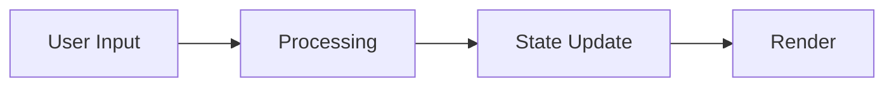

# [Feature Name] - Technical Reference

> **WHAT:** Post-implementation technical reference documenting the architecture, subsystems, data flow, and operational details of [feature name] as currently built.
> **WHY:** Serves as the canonical source of truth for both AI coding agents and human developers who need to understand, modify, or extend this feature without reading every source file. Where implementation diverges from the TDD, this document is authoritative.
> **HOW TO USE:** Engineering teams maintain this as a living document; developers and AI agents consult it before modifying or extending the feature.

### Document Lifecycle Position

| Phase | Document | Ownership | Status |
|-------|----------|-----------|--------|
| Requirements | Product PRD | Product | Frozen at implementation start |
| Design | TDD | Engineering | Frozen at implementation complete |
| **Implementation** | **This Technical Reference** | **Engineering** | **Living document — updated with every significant change** |

### Tiered Usage

| Tier | When to Use | Sections Required |
|------|-------------|-------------------|
| **Lightweight** | Small features, single subsystem, <5 components | 1, 2, 3, 4, 5, 12, 13 |
| **Standard** | Most features (5-20 components, multiple subsystems) | All numbered sections; skip conditional sections marked *(if applicable)* |
| **Heavyweight** | Major features, cross-cutting systems, platform-level | All sections fully completed, including all conditional sections |

---

## Document Information

| Field | Value |
|-------|-------|
| **Feature Name** | [Feature Name] |
| **Feature Type** | [Frontend / Backend / Full-Stack / Service / Library / Infrastructure] |
| **Tech Lead** | [Name] |
| **Engineering Team** | [Team Name] |
| **Maintained By** | [Team or person responsible for keeping this document current] |
| **Source Location** | [Primary directory path, e.g., `frontend/app/wizard/`] |
| **Last Verified Against Code** | [Date — when someone last confirmed this doc matches reality] |
| **Implementation Status** | [Active Development / Stable / Maintenance / Deprecated] |

### Living Document Contract

This document MUST be updated when:
- A component is added, removed, or significantly refactored
- A subsystem's behavior, data flow, or interface changes
- New conventions or patterns are introduced to the feature
- State shape or management approach changes
- The feature is deprecated or replaced

---

## Completeness Status

**Completeness Checklist:**
- [ ] Section 1: Overview — **Status**
- [ ] Section 2: Architecture — **Status**
- [ ] Section 3: Directory Structure — **Status**
- [ ] Section 4: Data Flow — **Status**
- [ ] Section 5: Subsystem Reference — **Status**
- [ ] Section 6: State Management — **Status**
- [ ] Section 7: Component Inventory — **Status**
- [ ] Section 8: API & Integration Points — **Status**
- [ ] Section 9: Configuration & Environment — **Status**
- [ ] Section 10: Error Handling & Edge Cases — **Status**
- [ ] Section 11: Performance Characteristics — **Status**
- [ ] Section 12: Conventions & Patterns — **Status**
- [ ] Section 13: Extension Guide — **Status**
- [ ] Section 14: Known Limitations & Technical Debt — **Status**
- [ ] Section 15: Verification & Accuracy — **Status**
- [ ] Section 16: Glossary — **Status**
- [ ] All links verified — **Status**
- [ ] Reviewed by [team] — **Status**

**Contract Table:**

| Element | Details |
|---------|---------|
| **Dependencies** | [Docs/systems this tech reference depends on] |
| **Upstream** | Feeds from: [PRD, TDD, source code] |
| **Downstream** | Feeds to: [README, operational guides, onboarding docs] |
| **Change Impact** | Notify: [teams to notify when this changes] |
| **Review Cadence** | [Quarterly / Monthly / As-needed] |

---

## Table of Contents

1. [Overview](#1-overview)
2. [Architecture](#2-architecture)
3. [Directory Structure](#3-directory-structure)
4. [Data Flow](#4-data-flow)
5. [Subsystem Reference](#5-subsystem-reference)
6. [State Management](#6-state-management)
7. [Component Inventory](#7-component-inventory)
8. [API & Integration Points](#8-api--integration-points)
9. [Configuration & Environment](#9-configuration--environment)
10. [Error Handling & Edge Cases](#10-error-handling--edge-cases)
11. [Performance Characteristics](#11-performance-characteristics)
12. [Conventions & Patterns](#12-conventions--patterns)
13. [Extension Guide](#13-extension-guide)
14. [Known Limitations & Technical Debt](#14-known-limitations--technical-debt)
15. [Verification & Accuracy](#15-verification--accuracy)
16. [Glossary](#16-glossary)

---

## 1. Overview

[2-3 paragraphs maximum. A developer or AI agent reading only this section should understand: what this feature does, who uses it, and where it lives in the codebase. Write in present tense — describe what IS, not what was planned.]

**What it does:** [One sentence]

**Who uses it:** [End users? Internal systems? Other services?]

**Where it lives:** [Primary directory/module paths]

**Key numbers:** [Quantitative summary — e.g., "9 stages, 14 Zustand slices, 274 video assets, ~85 components"]

---

## 2. Architecture

### 2.1 High-Level Architecture

[Describe the overall architecture as built. Include a diagram (Mermaid, ASCII, or image link). This should show the major subsystems and how they connect.]

```
[ASCII diagram or Mermaid diagram showing subsystem relationships]
```

### 2.2 Subsystem Map

[List every major subsystem in the feature. This is the table of contents for Section 5.]

| Subsystem | Purpose | Primary Directory | Key Files |
|-----------|---------|-------------------|-----------|
| [Subsystem 1] | [What it does] | [Path] | [2-3 most important files] |
| [Subsystem 2] | [What it does] | [Path] | [2-3 most important files] |
| [Subsystem 3] | [What it does] | [Path] | [2-3 most important files] |

### 2.3 Key Design Decisions (As Built)

[Document the actual design decisions made during implementation. Include decisions that diverged from the TDD and why.]

| Decision | What Was Built | Rationale | TDD Divergence |
|----------|---------------|-----------|----------------|
| [Decision 1] | [What we actually did] | [Why] | [How it differs from TDD, if at all] |
| [Decision 2] | [What we actually did] | [Why] | [How it differs from TDD, if at all] |

### 2.4 Technology Stack (Feature-Specific)

[List only technologies and libraries specific to this feature, beyond what the platform already provides. Do NOT repeat platform-level stack items documented elsewhere (e.g., in CLAUDE.md).]

| Technology | Version | Purpose in This Feature |
|------------|---------|------------------------|
| [Library 1] | [Version] | [Specific usage] |
| [Library 2] | [Version] | [Specific usage] |

---

## 3. Directory Structure

[Show the actual directory layout of this feature. This tells an AI agent or developer exactly where to find things.]

```
[feature-root]/
├── components/           # [Description of what lives here]
│   ├── [subdir]/         # [Description]
│   └── [subdir]/         # [Description]
├── data/                 # [Description]
├── store/                # [Description]
├── utils/                # [Description]
├── hooks/                # [Description]
├── config/               # [Description]
├── types/                # [Description]
└── docs/                 # [Description]
```

### 3.1 File Naming Conventions

[Document any feature-specific file naming patterns that differ from or extend platform conventions.]

| Pattern | Convention | Example |
|---------|-----------|---------|
| [File type] | [Naming rule] | [Example filename] |

---

## 4. Data Flow

### 4.1 Primary Data Flow

[Describe the main data flow through the feature from input to output. Use a diagram.]



[Narrative description of the flow, explaining each step.]

### 4.2 Data Sources

[Where does this feature get its data?]

| Source | Type | Location | Description |
|--------|------|----------|-------------|
| [Source 1] | [Static JSON / API / User Input / Derived] | [File path or endpoint] | [What data it provides] |
| [Source 2] | [Static JSON / API / User Input / Derived] | [File path or endpoint] | [What data it provides] |

### 4.3 Data Transformations

[Document key data transformations — where raw data is shaped, filtered, mapped, or computed into the form used by the UI or downstream consumers.]

| Transformation | Input | Output | Location | Description |
|---------------|-------|--------|----------|-------------|
| [Transform 1] | [Input shape] | [Output shape] | [File:function] | [What it does and why] |

---

## 5. Subsystem Reference

> **This is the core of the Technical Reference.** Each subsystem gets its own subsection with enough detail that a developer or AI agent can understand it without reading every source file.
>
> **For each subsystem, document:**
> - What it does (purpose)
> - How it works (mechanism)
> - Where the code lives (files)
> - What interfaces it exposes (APIs/exports)
> - What it depends on (inputs)
> - What depends on it (consumers)
> - Key patterns and conventions specific to this subsystem

### 5.1 [Subsystem Name]

**Purpose:** [1-2 sentences]

**Key Files:**

| File | Purpose |
|------|---------|
| `[path/file.ts]` | [What this file does] |
| `[path/file.ts]` | [What this file does] |

**How It Works:**

[Narrative explanation of the subsystem's behavior. Focus on the "how" — the mechanism, not just the "what." Include any non-obvious behavior, edge cases, or important implementation details.]

**Public Interface:**

```typescript
// Key exports, types, or APIs that other code uses
[Interface or function signatures — enough for a consumer to understand usage]
```

**Dependencies:**

| Depends On | Type | Description |
|------------|------|-------------|
| [Dependency] | [Import / Store / API / Event] | [How it's used] |

**Consumers:**

| Used By | How |
|---------|-----|
| [Component/Module] | [How it uses this subsystem] |

**Conventions & Patterns:**

- [Convention 1 — e.g., "All nodes must have an entry in both the category section and the `nodes` flat catalog"]
- [Convention 2 — e.g., "Never embed user-facing text directly; always use getNodeCopy()"]

---

### 5.2 [Subsystem Name]

[Repeat the structure from 5.1 for each subsystem]

---

### 5.N [Subsystem Name]

[Repeat for all subsystems. Number of subsections will vary by feature.]

---

## 6. State Management *(if applicable — frontend features)*

> **Conditional Section:** Include for any feature that manages client-side state. Skip for purely backend features.

### 6.1 State Architecture

| Store/Slice | Library | Scope | Primary Purpose |
|-------------|---------|-------|-----------------|
| [Store 1] | [Zustand / Redux / Context / etc.] | [Global / Feature / Component] | [What state it manages] |
| [Store 2] | [Zustand / Redux / Context / etc.] | [Global / Feature / Component] | [What state it manages] |

### 6.2 State Shape

```typescript
// Document the actual state shape for each store/slice
interface [StoreName]State {
  [field]: [type]; // [description]
  [field]: [type]; // [description]
}
```

### 6.3 Key State Transitions

[Document the most important state transitions — the ones that drive the feature's core behavior.]

| Trigger | From State | To State | Side Effects |
|---------|-----------|----------|--------------|
| [User action / Event] | [Before] | [After] | [What else happens — API calls, derived updates, etc.] |

### 6.4 Cross-Store Dependencies

[Document any relationships between stores/slices where one reacts to or reads from another.]

| Source Store | Consumer Store | Relationship | Description |
|-------------|---------------|--------------|-------------|
| [Store A] | [Store B] | [Reads / Subscribes / Triggers] | [What the dependency is] |

---

## 7. Component Inventory *(if applicable — frontend features)*

> **Conditional Section:** Include for frontend features. Skip for purely backend features.

### 7.1 Component Tree

[Show the component hierarchy as it actually exists in the code.]

```
[FeatureRoot]
├── [Component A]
│   ├── [Child 1]
│   └── [Child 2]
├── [Component B]
│   ├── [Child 3]
│   │   └── [Grandchild 1]
│   └── [Child 4]
└── [Component C]
```

### 7.2 Component Catalog

| Component | File Location | Purpose | Key Props | Renders |
|-----------|---------------|---------|-----------|---------|
| [Component] | [Path] | [What it does] | [Important props] | [What it renders — children, elements] |

### 7.3 Shared/Reusable Components

[List components within this feature that are designed for reuse, either within the feature or across the application.]

| Component | Purpose | Usage Pattern | Location |
|-----------|---------|---------------|----------|
| [Component] | [What it does] | [How to use it — brief example or description] | [Path] |

---

## 8. API & Integration Points *(if applicable)*

> **Conditional Section:** Include if the feature communicates with backend APIs, external services, or other features.

### 8.1 API Endpoints Used

| Endpoint | Method | Purpose | Request Shape | Response Shape |
|----------|--------|---------|---------------|----------------|
| [Endpoint] | [GET/POST/etc.] | [What it does] | [Key fields] | [Key fields] |

### 8.2 Internal Integration Points

[How does this feature connect to other features or platform systems?]

| Integration | Direction | Mechanism | Description |
|-------------|-----------|-----------|-------------|
| [System/Feature] | [Inbound / Outbound / Bidirectional] | [Import / Event / API / Store] | [What data or control flows] |

### 8.3 External Service Dependencies

| Service | Purpose | Failure Mode | Fallback |
|---------|---------|-------------|----------|
| [Service] | [Why needed] | [What happens when it's down] | [Graceful degradation behavior] |

---

## 9. Configuration & Environment *(if applicable)*

> **Conditional Section:** Include if the feature has configurable behavior, feature flags, or environment-dependent settings.

### 9.1 Configuration Files

| File | Purpose | Key Settings |
|------|---------|-------------|
| [Path] | [What it configures] | [Most important settings and their effects] |

### 9.2 Environment Variables

| Variable | Purpose | Default | Required |
|----------|---------|---------|----------|
| [VAR_NAME] | [What it controls] | [Default value] | [Yes/No] |

### 9.3 Feature Flags *(if applicable)*

| Flag | Description | Default | Impact When Toggled |
|------|-------------|---------|---------------------|
| [Flag name] | [What it controls] | [on/off] | [What changes] |

---

## 10. Error Handling & Edge Cases

### 10.1 Error Handling Patterns

[Document the error handling approach used in this feature.]

| Error Category | Handling Pattern | User Experience | Recovery |
|----------------|-----------------|-----------------|----------|
| [Category] | [How handled in code] | [What user sees] | [How to recover] |

### 10.2 Known Edge Cases

| Scenario | Current Behavior | Notes |
|----------|-----------------|-------|
| [Edge case] | [What happens] | [Why it works this way, any caveats] |

### 10.3 Graceful Degradation

[What still works when parts of the feature fail?]

| Failure | Impact | Degraded Experience |
|---------|--------|---------------------|
| [Component/service failure] | [What breaks] | [What still works] |

---

## 11. Performance Characteristics

### 11.1 Performance Profile

[Document actual performance characteristics, not targets. Include measured values where available.]

| Metric | Measured Value | Measurement Method | Notes |
|--------|---------------|-------------------|-------|
| [Metric — e.g., initial load time] | [Value] | [How measured] | [Context] |
| [Metric — e.g., bundle size contribution] | [Value] | [How measured] | [Context] |

### 11.2 Performance-Critical Code

[Identify areas where performance is important and what optimizations are in place.]

| Area | Optimization | Why It Matters | Location |
|------|-------------|----------------|----------|
| [Area] | [What optimization was applied] | [Impact of removing it] | [File:function] |

### 11.3 Asset Management *(if applicable)*

[Document significant assets (images, videos, fonts, large data files) and how they are loaded/managed.]

| Asset Type | Count | Total Size | Loading Strategy | Location |
|------------|-------|------------|------------------|----------|
| [Type] | [N] | [Size] | [Lazy / Eager / Preload / On-demand] | [Path pattern] |

---

## 12. Conventions & Patterns

[Document the conventions specific to this feature that a developer or AI agent must follow when making changes. These are the "rules of the road" for working in this codebase area.]

### 12.1 Code Conventions

| Convention | Description | Example |
|------------|-------------|---------|
| [Convention] | [What the rule is and why] | [Brief code or file example] |

### 12.2 Architectural Patterns

| Pattern | Where Used | Description |
|---------|-----------|-------------|
| [Pattern name] | [Which subsystems use it] | [How and why this pattern is applied] |

### 12.3 Anti-Patterns (Things to Avoid)

| Anti-Pattern | Why It's Wrong | Do This Instead |
|-------------|----------------|-----------------|
| [Bad practice] | [What goes wrong] | [Correct approach] |

---

## 13. Extension Guide

[How to extend this feature. This section answers the most common "how do I add X?" questions.]

### 13.1 Common Extension Tasks

| Task | Steps | Files to Touch | Pitfalls |
|------|-------|---------------|----------|
| [Add a new X] | [Ordered steps] | [Which files need changes] | [Common mistakes to avoid] |
| [Modify Y behavior] | [Ordered steps] | [Which files need changes] | [Common mistakes to avoid] |
| [Integrate with Z] | [Ordered steps] | [Which files need changes] | [Common mistakes to avoid] |

### 13.2 Testing Requirements for Changes

[What tests need to be written or updated when this feature is modified?]

| Change Type | Required Tests | Test Location |
|-------------|---------------|---------------|
| [Type of change] | [What must be tested] | [Where tests live] |

---

## 14. Known Limitations & Technical Debt

### 14.1 Current Limitations

| Limitation | Impact | Workaround | Planned Fix |
|-----------|--------|------------|-------------|
| [Limitation] | [Who/what it affects] | [How to work around it] | [Future plan, or "none"] |

### 14.2 Technical Debt

| Item | Severity | Description | Effort to Fix |
|------|----------|-------------|---------------|
| [Debt item] | [High / Medium / Low] | [What it is and why it matters] | [T-shirt size: XS/S/M/L/XL] |

### 14.3 Future Considerations

[Items explicitly deferred from the current implementation that may be built later. Document what was deferred and why.]

| Item | Deferred Because | Revisit When |
|------|-----------------|-------------|
| [Future item] | [Why not now] | [Trigger or timeline] |

---

## 15. Verification & Accuracy *(Mandatory)*

> **This section ensures the Technical Reference stays accurate.** Every fact in this document should be verifiable against the actual codebase.

### 15.1 Verification Log

[Record each time this document is verified against the actual code. A Technical Reference that hasn't been verified recently should be treated with skepticism.]

| Date | Verified By | Code Version / Commit | Sections Verified | Issues Found |
|------|------------|----------------------|-------------------|-------------|
| [Date] | [Person or agent] | [Commit SHA or branch] | [Which sections] | [Any discrepancies found and fixed] |

### 15.2 Spot-Check Protocol

[Define how to spot-check this document for accuracy. This gives future maintainers a quick way to validate the document.]

1. **File existence check:** Verify that all file paths listed in this document exist in the codebase
2. **Export verification:** Spot-check 3-5 public interfaces listed in Section 5 against actual code exports
3. **State shape check:** Compare Section 6 state shapes against actual store definitions
4. **Component tree check:** Verify Section 7 component hierarchy against actual file structure
5. **Convention check:** Verify 2-3 conventions from Section 12 are followed in recent code changes

---

## 16. Glossary *(if applicable)*

[Define feature-specific terms, abbreviations, or concepts that a developer or AI agent might not know.]

| Term | Definition |
|------|------------|
| [Term] | [Definition] |

---

## Appendices *(as needed)*

### Appendix A: [Title]

[Supplementary material that doesn't fit in the main sections — detailed schemas, exhaustive component lists, migration notes, etc.]

---

## Document History

| Version | Date | Author | Changes |
|---------|------|--------|---------|
| 1.0 | [Date] | [Author] | Initial reference created from implementation |
| [X.Y] | [Date] | [Author] | [Summary of what changed and why] |

---

<!--
LINE BUDGET — Target line counts per tier:
- Lightweight (single subsystem, <5 components): 400–600 lines
- Standard (5–20 components, multiple subsystems): 800–1,200 lines
- Heavyweight (major features, cross-cutting systems, 50+): 1,200–1,800 lines

If a document exceeds the tier ceiling, it needs editing — not a larger tier.
Documents over 2,000 lines are a code smell.
-->

<!--
CONTENT RULES:
| Rule                  | Do                                                    | Don't                                                               |
|-----------------------|-------------------------------------------------------|---------------------------------------------------------------------|
| Source code           | Summarize behavior in tables and prose                | Reproduce TypeScript interfaces, function bodies, or CSS values     |
| Statistics            | State key numbers once in Section 1 Overview          | Embed file counts, line counts, or component counts throughout      |
| Architecture          | Use tables and ASCII diagrams                         | Write multi-paragraph prose for what could be a table row           |
| Configuration         | List key settings with purpose and default            | Reproduce entire config files                                       |
| State shape           | Table with Slice / Key Fields / Notable Behavior      | Full TypeScript interface definitions per slice                     |
| Single source of truth| Describe each concept in exactly one section          | Repeat the same info in Architecture, Subsystem Ref, and State Mgmt |
| Conventions           | List rules with brief rationale                       | Lengthy explanations of why each convention exists                  |
-->

<!--
FILE NAMING CONVENTION:
Technical reference files use kebab-case:
- Pattern: [feature-name]-technical-reference.md (e.g., docker-compose-technical-reference.md)
- Multi-word features: [name-name]-technical-reference.md (e.g., pixel-streaming-technical-reference.md)
- Always lowercase, hyphens as separators, suffix -technical-reference.md
-->

<!--
CALLOUT CONVENTIONS:
Use these standardized callout formats throughout the document:
  > **Note:** Informational context that is helpful but not critical
  > **Important:** Something the reader must be aware of to avoid issues
  > **CRITICAL:** Something that will cause failure or data loss if ignored
  > **Tip:** Helpful shortcut, best practice, or time-saving suggestion
-->

<!--
ADDITIONAL TECH REF GUIDANCE:

SUBSYSTEM DEPTH LIMITS (Section 5):
| Subsystem Complexity | Line Target | Characteristics                                                           |
|----------------------|-------------|---------------------------------------------------------------------------|
| Simple               | 40–80 lines | Single component hierarchy, straightforward data flow, few dependencies   |
| Standard             | 80–120 lines| Multiple components, some behavioral complexity, cross-subsystem deps     |
| Complex              | 120–200 lines| Multiple component hierarchies, rendering strategies, state machines     |

If a subsystem requires more than 200 lines, it is a candidate for its own separate
Technical Reference document. Keep the structure flat within each subsystem:
Purpose → Key Files → How It Works → Dependencies → Consumers → Conventions.
Use tables for multi-item data (transition phases, component variants, configuration values).

STATE MANAGEMENT DEPTH LIMIT (Section 6):
Section 6 should stay under 150 lines total. Use a single summary table for state shape
(Slice | Key Fields | Notable Behavior) rather than per-slice TypeScript interfaces.
Keep cross-store dependencies to a table with the most critical dependencies only.

DIRECTORY STRUCTURE RULES (Section 3):
Show directory layout without file counts (no "85 files" or "14 slices" annotations inline).
State key numbers once in Section 1 Overview instead.

CONFIGURATION RULES (Section 9):
Do not reproduce full configuration files. Instead, create a summary table with:
Setting | Purpose | Default | Impact. Reference the actual file path for the complete config.
-->

> **See also:**
> - [prd_template.md](prd_template.md) — Product requirements template
> - [tdd_template.md](tdd_template.md) — Technical design specifications template

---

> **Template Version:** 1.0.2
> **Template Created:** 2026-03-06
> **Template Updated:** 2026-03-08
> **Template Type:** Technical Reference — Post-Implementation Living Document
> **Based On:** Google Developer Documentation Style Guide, Diátaxis Documentation Framework (Reference quadrant), Microsoft REST API Guidelines (documentation standards), Write the Docs community best practices, IEEE 1063 Software User Documentation, internal PRD and TDD template patterns
> **Lifecycle Position:** PRD (what to build) → TDD (how to build it) → **Technical Reference (what was built)** → README (quick-start entry point)
> **Design Principle:** This template is designed for the AI-assisted development paradigm where both human developers and AI coding agents need to understand a feature's current state without reading every source file. Every section prioritizes discoverability, accuracy, and actionability over completeness for its own sake.
