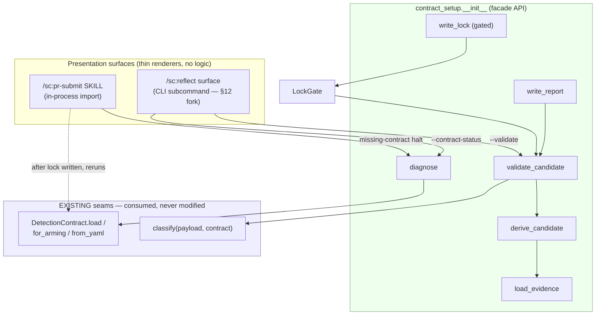
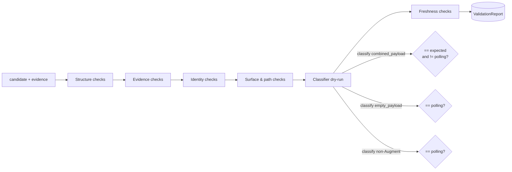
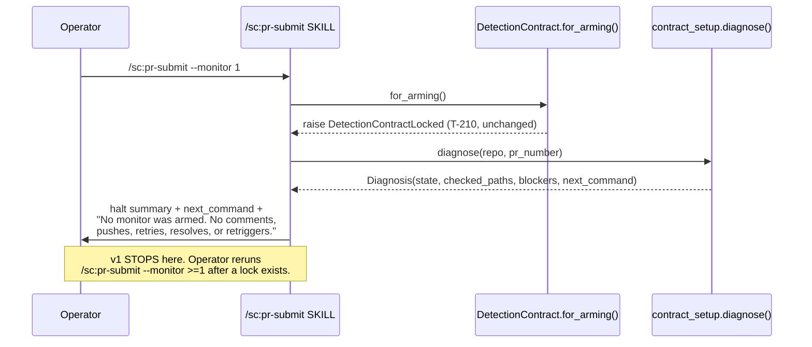
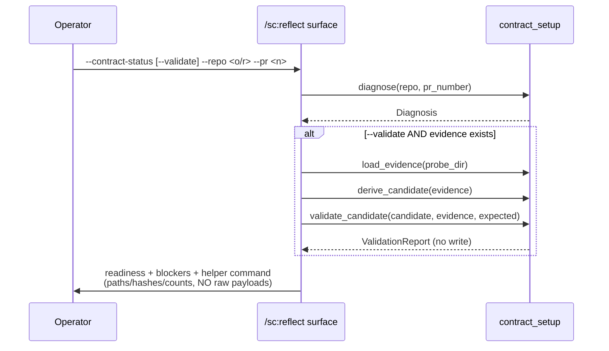

# Component Design — Locked Detection Contract Setup Flow

Design deliverable for the merged requirements in
[`merged-requirements.md`](./merged-requirements.md). This document specifies the
component decomposition, data model, public interfaces, state machine, validation
pipeline, and integration seams. It is **design only** — no implementation bodies.
Implementation follows via `/sc:implement` after approval.

Every "existing seam" claim below is grounded in the current tree:

| Seam | Location | Contract (unchanged by this design) |
|---|---|---|
| `DetectionContract` dataclass | `src/superclaude/pr_submit/detection.py:79-199` | 11 classifier/config fields + `locked` (12 dataclass fields total) |
| `DetectionContract.load()` | `detection.py:147-188` | `(path, *, require_locked=True, prefer_local_override=False)` |
| `DetectionContract.for_arming()` | `detection.py:190-199` | `== load(prefer_local_override=True)` |
| `DetectionContract.from_yaml()` | `detection.py:119-145` | dict → contract, no lock enforcement |
| `DetectionContractLocked` | `detection.py:71-76` | the T-210 raise type |
| `classify()` | `classifier.py:158-232` | `(payload, contract, *, watermark=None) -> str` |
| Result literals | `classifier.py:23-26` | `"polling"` / `"clean"` / `"findings"` / `"declined"` |
| Resolution order | `detection.py:165-170` | explicit `path` → local override → shipped ref |
| Local override path | `detection.py:40` | `.dev/pr-monitor/detection-contract.locked.md` |
| T-210 gate | `detection.py:183-187` | `if require_locked and not contract.locked: raise` |

## 1. Scope and Non-Goals

### In scope

- A new Python package `superclaude.pr_submit.contract_setup` (facade import path
  fixed by requirements §5 metadata `generated_by: "superclaude.pr_submit.contract_setup"`).
- Read-only **diagnosis** of contract readiness (9 UX states, requirements §3).
- File-based **evidence loading** from captured probe JSON.
- **Candidate derivation** with per-field provenance that refuses required-unobserved fields.
- **Validation** via a dry-run of the *existing* `classify()` seam plus negative controls.
- **Report writing** and, only behind an explicit gate, **local-lock writing**.
- Integration wiring for the `/sc:pr-submit` halt message and a `/sc:reflect` readiness surface.

### Non-goals (design will actively prevent)

- **No change to `for_arming()` / `load()` / `classify()` semantics** (requirements §12 risk 1).
  This design *consumes* those seams; it never edits them.
- **No monitor arming, PR mutation, push, reply, resolve, retrigger, or resume** from any
  setup path (requirements §1.5, §9.5, §12 risk 7).
- **No default lock writing** — `write_lock` is the only writer and requires an explicit
  confirmation flag *plus* a passing gate (requirements §1.2, §10, §12 risk 4).
- **No classifier logic duplicated in skill markdown** — all derivation/validation lives in
  Python; skills render returned structs (requirements §12 risk 2).
- **No shipped-contract mutation** — the shipped ref stays `locked: false`; the only lock
  target is `.dev/pr-monitor/detection-contract.locked.md` (requirements §6.12, §13.12).

## 2. Component Architecture

The shared helper is decomposed into single-responsibility modules under a new package,
mirroring the ownership boundary in requirements §2 ("Shared helper owns: diagnosis, probe
loading, candidate derivation, validation, report + local-lock writing"). The package
`__init__.py` is the **facade** — the only import surface the two skills touch.

```text
src/superclaude/pr_submit/
├── detection.py            # EXISTING — unchanged (load/for_arming/from_yaml/DetectionContract)
├── classifier.py           # EXISTING — unchanged (classify + result literals)
└── contract_setup/         # NEW package (facade = superclaude.pr_submit.contract_setup)
    ├── __init__.py         # Facade: diagnose / load_evidence / derive_candidate /
    │                       #         validate_candidate / write_report / write_lock
    ├── states.py           # ContractState enum (9 states) + state-classification pure fn
    ├── diagnosis.py        # Diagnosis dataclass + diagnose() (read-only path/lock/evidence probe)
    ├── evidence.py         # EvidenceBundle dataclass + load_evidence() + sha256 + surface map
    ├── candidate.py        # CandidateContract + FieldProvenance + derive_candidate()
    ├── validation.py       # ValidationReport + CheckResult + validate_candidate() (dry-runs classify)
    ├── lockgate.py         # LockGate — the 12 §6 preconditions as ordered named checks
    ├── writer.py           # write_report() + write_lock() (gated, confirmation-required)
    └── questions.py        # SETUP_QUESTIONS declarative table (§4) + default-derivation binders
```



**Design rationale for a package (vs a single `contract_setup.py` module):** the ownership
boundary in requirements §2 lists six distinct responsibilities, and the safe-locking policy
(§6) plus validation checklist (§7) are large, independently testable units. A package keeps
each seam ≤ one screen and lets the regression suite (requirements §11.9) target modules
directly. The facade preserves a single import path (`superclaude.pr_submit.contract_setup`)
so callers are unaffected by the internal split.

> **Fork A (recommended = package).** If the reviewer prefers minimal surface area, the same
> API can ship as one `contract_setup.py` module; the facade signatures are identical either
> way. Recommended: package, for testability and SRP.

## 3. Data Model

All dataclasses are frozen where they are pure values; `Diagnosis`/`ValidationReport` carry a
`.summary()` that renders **status, paths, hashes, counts, blockers — never raw payload bodies**
(requirements §8, §12 risk 8).

### 3.1 `ContractState` (states.py) — requirements §3

```python
class ContractState(str, Enum):
    MISSING            = "missing"             # no local override; shipped fallback unlocked
    UNLOCKED           = "unlocked"            # a contract exists but locked: false
    UNPARSEABLE        = "unparseable"         # file exists, YAML cannot parse
    EVIDENCE_MISSING   = "evidence_missing"    # locked:true but probe_evidence missing/unreadable
    VALIDATION_MISSING = "validation_missing"  # evidence exists, no validation report
    VALIDATION_FAILED  = "validation_failed"   # validation report exists but failed
    STALE              = "stale"               # repo/PR/hash/freshness mismatch
    READY              = "ready"               # local locked contract validates against evidence
    DECLINED_BY_USER   = "declined_by_user"    # user cancelled setup
```

### 3.2 `Diagnosis` (diagnosis.py)

```python
@dataclass(frozen=True)
class Diagnosis:
    state: ContractState
    checked_paths: list[Path]          # every path probed, in resolution order (§9.3)
    override_present: bool             # .dev/pr-monitor/detection-contract.locked.md exists
    override_locked: bool | None       # None if unparseable/absent
    shipped_locked: bool               # always False in a healthy tree (asserted for drift)
    evidence_path: Path | None
    evidence_sha256: str | None
    repo: str | None                   # resolved owner/repo (may be None if unresolved)
    pr_number: int | None
    validation_report_path: Path | None
    validation_result: str | None      # "passed" | "failed" | None
    blockers: list[str]                # human-readable, ordered by severity
    next_command: str                  # the single safe rerun/setup command to print

    def summary(self) -> str: ...       # renders status+paths+hashes+counts+blockers, NO payloads
```

### 3.3 `EvidenceBundle` (evidence.py)

```python
@dataclass(frozen=True)
class EvidenceBundle:
    probe_dir: Path
    repo: str | None
    pr_number: int | None
    captured_at: str | None            # ISO-8601 from manifest, else file mtime
    surfaces: list[str]                # subset of {"reviews","comments","check_runs"} present
    reviews: list[dict]                # parsed; [] if surface absent
    comments: list[dict]
    check_runs: list[dict]
    combined_payload: dict             # the {"reviews":[...], "comments":[...]} classify() consumes
    sha256: str                        # hash of combined_payload canonical bytes
    pagination_complete: bool | None   # None = unknown (diagnosed + recorded, §7 evidence)
```

### 3.4 `FieldProvenance` + `CandidateContract` (candidate.py)

```python
@dataclass(frozen=True)
class FieldProvenance:
    value: object
    source: str          # "observed" | "default_suggested" | "user"
    observed: bool        # True only if resolved against payload metadata (not prose)
    evidence_ref: str | None   # json-path or file locus that backs an observed value

@dataclass(frozen=True)
class CandidateContract:
    contract: DetectionContract               # the real dataclass — reuses detection.py
    provenance: dict[str, FieldProvenance]    # keyed by contract field name
    expected_classifier_result: str           # "clean" | "findings" | "declined" (never "polling")

    def required_unobserved(self) -> list[str]: ...   # §6 must-never-guess fields lacking observed provenance
```

### 3.5 `CheckResult` + `ValidationReport` (validation.py)

```python
@dataclass(frozen=True)
class CheckResult:
    name: str            # stable id, e.g. "classifier_dry_run", "negative_control_empty"
    passed: bool
    detail: str          # short reason; never a raw payload body

@dataclass(frozen=True)
class ValidationReport:
    result: str                        # "passed" | "failed"
    classifier_result: str | None      # what classify() actually returned on the real payload
    expected_result: str
    checks: list[CheckResult]          # structure/evidence/identity/surface/classifier/freshness
    negative_controls: list[CheckResult]  # empty-payload + non-Augment must be "polling"
    decline_validation: str            # "passed" | "not_exercised" | "failed" (§4.12 policy)
    evidence_sha256: str
    validated_surfaces: list[str]
    blockers: list[str]

    def summary(self) -> str: ...       # paths/hashes/counts/blockers, NO payloads
```

## 4. Public Interface (facade — `contract_setup/__init__.py`)

Signatures + contracts only (pre/post-conditions), no bodies. Every function is **pure w.r.t.
side effects except the two writers**; `diagnose` / `validate_candidate` never write a lock and
never touch the network.

```python
def diagnose(
    *,
    repo: str | None = None,
    pr_number: int | None = None,
    cwd: Path | None = None,
) -> Diagnosis:
    """Read-only readiness probe. Resolves paths in the §9.3 order, classifies into one
    ContractState (§3), and derives the single safe next_command. NEVER writes, arms, or fetches.
    Post: result.state ∈ ContractState; result.blockers non-empty iff state ≠ READY."""

def load_evidence(probe_dir: Path) -> EvidenceBundle:
    """Load captured JSON from a probe dir (§8 layout). Computes sha256, maps present surfaces,
    diagnoses pagination completeness when derivable. Raises FileNotFoundError if no payload."""

def derive_candidate(
    evidence: EvidenceBundle,
    *,
    answers: "SetupAnswers | None" = None,
) -> CandidateContract:
    """Build a CandidateContract from observed evidence (+ optional operator answers, §4).
    Records provenance per field. Marks a §6 must-never-guess field 'observed' ONLY when it
    resolves against payload metadata. Post: candidate.required_unobserved() lists any gap."""

def validate_candidate(
    candidate: CandidateContract,
    evidence: EvidenceBundle,
    *,
    expected_result: str,
) -> ValidationReport:
    """Run the §7 checklist. Dry-runs the EXISTING classify(evidence.combined_payload,
    candidate.contract) — never a reimplementation — and asserts == expected_result and
    ≠ "polling". Runs empty-payload + non-Augment negative controls. NEVER writes."""

def write_report(
    report: ValidationReport,
    evidence: EvidenceBundle,
    dest_dir: Path,
) -> Path:
    """Write validation-report.yaml + validation-summary.md under the probe dir (§8).
    Idempotent overwrite. Returns the report path. This is NOT the lock writer."""

def write_lock(
    candidate: CandidateContract,
    evidence: EvidenceBundle,
    report: ValidationReport,
    *,
    confirmed: bool,
    dest: Path = Path(".dev/pr-monitor/detection-contract.locked.md"),
) -> Path:
    """The ONLY writer of a locked:true contract. Evaluates LockGate (§6, all 12 preconditions).
    Raises ContractSetupRefused unless gate.passed AND confirmed is True. Refuses any dest that
    is not under .dev/pr-monitor/ (§6.12) — never the shipped ref, never a .claude/ mirror.
    Writes the §5 YAML + metadata block. Returns the lock path. NEVER arms the monitor."""
```

`SetupAnswers` (questions.py) is a plain dataclass holding the resolved answers to the §4
sequence; `None` means "derive all defaults from evidence."

## 5. UX State Machine (requirements §3)

`diagnose()` is a pure classifier over three observations: (a) which contract path resolved,
(b) whether it parses + is `locked`, (c) whether its `probe_evidence` + validation report exist
and are fresh. The transitions below are the decision tree `diagnose()` encodes.

```mermaid
stateDiagram-v2
    [*] --> resolve
    resolve --> MISSING: no override AND shipped is fallback
    resolve --> UNPARSEABLE: file exists, YAML fails
    resolve --> UNLOCKED: parses, locked=false
    resolve --> lockedTrue: parses, locked=true

    lockedTrue --> EVIDENCE_MISSING: probe_evidence absent/unreadable
    lockedTrue --> hasEvidence: probe_evidence readable

    hasEvidence --> STALE: repo/PR/hash/age mismatch
    hasEvidence --> VALIDATION_MISSING: no validation report
    hasEvidence --> VALIDATION_FAILED: report.result == failed
    hasEvidence --> READY: report.result == passed AND fresh

    UNLOCKED --> [*]: validate candidate if evidence exists
    READY --> [*]: /sc:pr-submit --monitor >=1 may proceed (existing gate)
    note right of DECLINED_BY_USER: entered only from an interactive\nsetup cancel; leaves contract untouched
```

Default action per state is carried in `Diagnosis.next_command` and rendered by the skill —
never executed by the helper. Mapping to requirements §3 "Default action" column is 1:1.

## 6. Setup Question Sequence (requirements §4)

The 16-question sequence is encoded **declaratively** in `questions.py` so the skill markdown
renders prompts and the Python owns default-derivation (requirements §12 risk 2). No question
logic lives in markdown.

```python
@dataclass(frozen=True)
class SetupQuestion:
    id: str                       # "repo", "probe_pr", "operation", ... (§4 order)
    prompt: str
    derive_default: Callable[[EvidenceBundle | None, SetupAnswers], object | None]
    required_for_lock: bool       # true for §6 must-never-guess fields
    lockable_only_if_observed: bool

SETUP_QUESTIONS: list[SetupQuestion] = [ ... 16 entries ... ]
```

Key binding rules (from §4 + §6):

- `repo` (Q1) default = resolved origin `owner/repo`; unresolved → require explicit value.
- `operation` (Q3) default is **surface-specific**: `/sc:reflect` → *diagnose only*; setup helper
  → *capture/validate/offer write*; `/sc:pr-submit` halt → *print setup command and stop*.
- `emission_shape` (Q8), `findings_locus` (Q9), `review_completeness_signal` (Q11),
  `augment_bot_login`/identity (Q6), `probe_evidence`, repo binding — `lockable_only_if_observed = True`.
  `derive_candidate` refuses to mark these observed unless they resolve against payload metadata.
- `run_validation` (Q14) default = yes; **required** before any `locked: true`.
- `write_local_locked_contract` (Q15) default = **no**; requires explicit confirmation post-validation.
- `next_step` (Q16) prints absolute artifact paths + the `/sc:pr-submit --monitor >=1` command;
  **does not execute it**.

## 7. Safe-Locking Gate (requirements §6)

`LockGate` (lockgate.py) is an **ordered list of 12 named predicates** — one per §6 precondition.
`write_lock` calls `LockGate.evaluate(...)` and refuses on the first failure; the gate returns
*all* failures for the report.

| # | Check id | Predicate (fails → block) | Source |
|---|---|---|---|
| 1 | `evidence_readable` | `EvidenceBundle` loaded, combined_payload non-null | §6.1 |
| 2 | `evidence_repo_bound` | `evidence.repo == candidate repo` | §6.2 |
| 3 | `pr_identity_recorded` | `evidence.pr_number` set; cross-PR flagged shape-only | §6.3 |
| 4 | `identity_observed` | bot/app identity in payload metadata, not prose | §6.4 |
| 5 | `emission_shape_observed` | selected `emission_shape` present in payload | §6.5 |
| 6 | `paths_resolve` | findings locus / completion signal resolve vs evidence | §6.6 |
| 7 | `expected_not_polling` | `expected_classifier_result ∈ {clean,findings,declined}` | §6.7 |
| 8 | `classifier_matches` | `classify(payload, contract) == expected` | §6.8 |
| 9 | `negative_controls_pass` | empty + non-Augment payload → `polling` | §6.9 |
| 10 | `report_written` | validation report exists, references evidence hash | §6.10 |
| 11 | `user_confirmed` | explicit `confirmed=True` | §6.11 |
| 12 | `dest_under_pr_monitor` | dest path under `.dev/pr-monitor/`, not shipped/`.claude/` | §6.12 |

```python
@dataclass(frozen=True)
class GateResult:
    passed: bool
    failures: list[CheckResult]     # empty iff passed

class LockGate:
    @staticmethod
    def evaluate(candidate, evidence, report, *, confirmed: bool, dest: Path) -> GateResult: ...
```

**Must-never-guess enforcement:** checks 4/5/6 consult `candidate.provenance` and require
`observed=True`. §6's "acceptable only as suggestions" defaults (bot login display, app slug,
findings path names, decline regex, freshness threshold) may seed prompts but can never satisfy
an `observed` requirement on their own.

## 8. Validation Pipeline (requirements §7)

`validate_candidate()` runs six check groups, each emitting `CheckResult`s. The classifier group
is the load-bearing one and it **reuses `classify()` verbatim** — the design never re-derives
classification (requirements §12 risk 2).



- **Structure** (§7.1): YAML parses; required fields present; no placeholders in required fields;
  candidate loads through the *existing* `DetectionContract.from_yaml()`; shipped ref still `locked:false`.
- **Evidence** (§7.2): payload under `.dev/pr-monitor/probes/` (or copied there); hash recorded;
  repo + PR recorded; capture time recorded; surfaces recorded; pagination diagnosed when known.
- **Identity** (§7.3): selected actor/app appears in payload metadata; copied human text ignored;
  multiple candidates require explicit selection.
- **Surface & path** (§7.4): selected surface present; findings locus resolves when findings exist;
  completion signal resolves for clean evidence; severity path resolves if non-null; check-run status
  terminal before use as completion.
- **Classifier dry-run** (§7.5): `classify(combined_payload, contract) == expected != "polling"`;
  empty payload → `polling`; non-Augment payload → `polling`; decline evidence (when present) →
  `declined`, distinct from `clean`/`polling`.
- **Freshness** (§7.6): repo mismatch blocks; missing evidence file/hash blocks; same PR preferred;
  cross-PR requires explicit confirm + validates shape only; **age warning default = 30 days**.

## 9. Output Artifact Layout (requirements §8)

`write_report` / `write_lock` write only under `.dev/pr-monitor/` (gitignored — `.gitignore:243`).

```text
.dev/pr-monitor/
  detection-contract.locked.md              # write_lock target (only after gate+confirm)
  probes/
    <YYYYMMDD-HHMMSS>-pr-<number>/
      gh-reviews.json                        # captured surface payloads (V2 live / V1 provided)
      gh-comments.json
      gh-check-runs.json
      combined-payload.json                  # the {"reviews","comments"} classify() consumes
      candidate.detection-contract.md        # derive_candidate output (with provenance comments)
      validation-report.yaml                 # write_report output (§5 metadata + checks)
      validation-summary.md                  # human summary: status/paths/hashes/counts/blockers
```

The locked contract's YAML block is exactly the §5 classifier-critical schema **plus** the §5
`metadata:` extension (schema_version, generated_by, generated_at, repo, pr_number, evidence_sha256,
validation_report, validation_result, validation_classifier_result, validated_surfaces,
decline_validation). The classifier ignores `metadata` — it is provenance only.

## 10. Integration Design

### 10.1 `/sc:pr-submit` missing-contract halt (requirements §9)

`for_arming()` still raises `DetectionContractLocked` on `locked:false` (unchanged). The skill
catches it and calls `diagnose()` to render a better halt — **it never arms after setup in v1**.



Halt message contents (requirements §9.2-9.5): resolved status, checked paths, setup/diagnose
command, and the literal invariant line *"No monitor was armed…"*. After a lock is written by the
separate setup flow, a rerun simply re-enters the **unchanged** `for_arming()` path (requirements §9 close).

### 10.2 `/sc:reflect` readiness surface (requirements §10)

`/sc:reflect` gains a **diagnose/validate-first** path. It **never** writes a lock and **never** arms
(requirements §10 v1, §12 risk 4).



### 10.3 Presentation-surface decision — **Fork B**

`/sc:reflect` currently has a Click group `reflect_group` (`cli/reflect/commands.py`) with a
`reflect run` subcommand, and **no** current linkage to detection code. `/sc:pr-submit` has **no**
CLI subcommand and imports `superclaude.pr_submit` in-process.

| Option | Reflect surface | Pros | Cons |
|---|---|---|---|
| **B1 (recommended)** | New `superclaude reflect contract-status [--validate] --repo --pr` subcommand calling the facade | Matches existing `reflect_group`; unit-testable via `CliRunner`; keeps logic out of markdown | Adds one CLI subcommand + option wiring |
| B2 | Skill-markdown flag only; skill imports facade in-process (like pr-submit) | Zero CLI change; symmetric with pr-submit | Harder to test headlessly; more markdown orchestration |

**Recommendation: B1** for reflect (testability + existing group), and **in-process import** for the
`/sc:pr-submit` halt (matches how it already imports `for_arming()`). Both call the same facade, so
the choice is presentation-only and does not change the component design.

## 11. Error / Refusal Model

```python
class ContractSetupError(RuntimeError): ...          # base
class ContractSetupRefused(ContractSetupError): ...  # write_lock gate failed or unconfirmed
class EvidenceUnreadable(ContractSetupError): ...    # load_evidence could not parse/hash
```

- `write_lock` raises `ContractSetupRefused` (never silently no-ops) when the gate fails or
  `confirmed` is false — the caller renders the blockers.
- `diagnose` never raises on a bad contract; it classifies the failure into a `ContractState`
  (`UNPARSEABLE` / `EVIDENCE_MISSING` / …) so the halt path is always actionable.
- The existing `DetectionContractLocked` is **not** re-purposed; it remains the arm-gate signal only.

## 12. Test Design → Acceptance Criteria (requirements §11, §13)

New tests live under `tests/pr_submit/` alongside the existing `test_detection_contract.py`.
Traceability:

| Acceptance criterion (§13) | Design element | Test |
|---|---|---|
| 1. shipped-only still halts | unchanged `for_arming()`; diagnose(state=MISSING/UNLOCKED) | `test_shipped_only_halts_and_diagnoses` |
| 2. halt names override + setup path | `Diagnosis.next_command`, `checked_paths` | `test_halt_message_actionable` |
| 3. `--monitor 0` unaffected | no integration on ordinal-0 path | `test_monitor_0_unaffected` |
| 4. defaults alone cannot lock | `LockGate` checks 4/5/6 require `observed` | `test_defaults_cannot_lock` |
| 5. `polling` cannot lock | `LockGate.expected_not_polling` + `classifier_matches` | `test_polling_expected_refused` |
| 6. wrong-repo cannot lock | `LockGate.evidence_repo_bound` | `test_wrong_repo_blocks_lock` |
| 7. cross-PR shape-only | `derive_candidate` cross-PR flag; freshness check | `test_cross_pr_shape_only` |
| 8. non-Augment copied text ignored | identity check; negative control | `test_non_augment_text_ignored` |
| 9. decline/clean/no-evidence distinct | `validate_candidate` classifier group | `test_states_distinguished` |
| 10. reflect no raw payloads | `.summary()` renders paths/hashes only | `test_reflect_summary_no_payloads` |
| 11. lock only under `.dev/pr-monitor/` after confirm | `write_lock` + `dest_under_pr_monitor` + `confirmed` | `test_lock_path_and_confirm_gate` |
| 12. shipped stays unlocked/generic | structure check asserts shipped `locked:false` | `test_shipped_remains_unlocked` |
| §11.9 regressions | T-210 preserved; local-override preference; wrong/stale evidence; no side effects | reuse + extend `test_detection_contract.py` |

**Critical invariant test:** `test_no_monitor_side_effects` asserts no setup path imports/calls any
arming, `Monitor`, push, reply, resolve, or retrigger symbol (grep-style guard, mirroring the
existing purity assertions).

## 13. Minimal Implementation Order (requirements §11)

Design supports the requirements' staged plan directly:

1. `states.py` + `diagnosis.py` → `diagnose()` (read-only; powers the better halt).
2. Wire `/sc:pr-submit` halt to `diagnose()` (monitor stays unarmed).
3. `evidence.py` → `load_evidence()` (file-based, captured JSON).
4. `candidate.py` → `derive_candidate()` (provenance + required-unobserved refusal).
5. `validation.py` → `validate_candidate()` (dry-run `classify` + negative controls).
6. `lockgate.py` + `writer.py` → `write_lock()` (gated, confirmation-required).
7. `/sc:reflect` `contract-status` surface (diagnose/validate-first; no writes).
8. Optional live GitHub capture (V2; all `gh` calls pin `--repo <owner/repo>`).
9. Regression tests per the §12 traceability matrix.

## 14. Open Decisions for Approval

1. **Fork A — helper granularity:** package (recommended) vs single module. Facade identical.
2. **Fork B — reflect surface:** new `superclaude reflect contract-status` CLI subcommand
   (recommended) vs skill-markdown flag calling the in-process facade.
3. **Live capture (V2) timing:** design includes the `EvidenceBundle` seam so live capture is a
   later `load_evidence` source; confirm V2 is out of this design's build scope (requirements §11.8
   treats it as optional/after file-based validation).

No `for_arming()` / `classify()` semantics change under any option above.

## 15. Requirements Traceability Summary

| Requirements § | Covered by |
|---|---|
| §1 recommended behavior | §1 scope, §10 integration, §7 gate |
| §2 ownership boundary | §2 module decomposition (facade = shared helper) |
| §3 UX states | §3.1 enum, §5 state machine |
| §4 question sequence | §6 declarative `SETUP_QUESTIONS` |
| §5 contract fields | §9 YAML block + `metadata` |
| §6 safe-locking policy | §7 `LockGate` (12 checks) |
| §7 validation checklist | §8 validation pipeline (6 groups) |
| §8 output artifacts | §9 layout + writers |
| §9 pr-submit integration | §10.1 sequence |
| §10 reflect integration | §10.2 sequence + §10.3 surface |
| §11 implementation plan | §13 order |
| §12 risks/mitigations | §1 non-goals, §11 error model, §8 classify reuse |
| §13 acceptance criteria | §12 test matrix |
