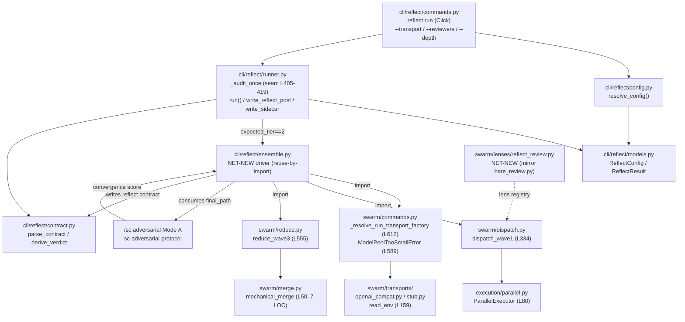

# sc:reflect Tier-2 Reviewer Ensemble Swarm Re-Wiring — Technical Design Document (TDD)

> **WHAT:** Technical Design Document specifying the architecture, data models, contract-mapping layer, and implementation design for re-routing the headless `sc:reflect` Tier-2 reviewer ensemble through the swarm dispatch library.
> **WHY:** Translates the FR-RH2 release spec (the *what*) into an engineering specification (the *how*). The headless Tier-2 ensemble is architecturally unreachable today; this TDD defines how to restore a faithful, model-diverse adversarial Tier-2 audit by adapting the existing swarm seam rather than building a new fan-out engine.
> **HOW TO USE:** Engineers and architects use this document to align on the in-process swarm-import approach, the OI-1 swarm→reflect contract-correspondence gate, and the (M,N) divergence boundary before implementation begins.

### Document Lifecycle Position

| Phase | Document | Ownership | Status |
|-------|----------|-----------|--------|
| Requirements | FR-RH2 Release Spec | Engineering (reflect-hardening) | Approved (source of truth) |
| **Design** | **This TDD** | **Engineering** | **🟡 Draft** |
| Implementation | Technical Reference (post-build) | Engineering | Not started |

This TDD implements requirements from the FR-RH2 spec (`.dev/reflect-hardening/issue-2-headless-ensemble/spec.md`): FR-RH2.1–FR-RH2.9 and NFR-RH2.1–NFR-RH2.8.

### Tiered Usage

| Tier | When to Use | Sections Required |
|------|-------------|-------------------|
| Lightweight | Bug fixes, config changes, small features (<1 sprint) | 1, 2, 3, 6.4, 21, 22 |
| Standard | Most features and services (1-3 sprints) | All numbered sections; skip conditional sections marked *(if applicable)* |
| **Heavyweight** | **New systems, platform changes, cross-team projects** | **All sections fully completed, including conditional sections** |

This document is authored at the **Heavyweight** tier (HIGH complexity 0.82).

---

## Document Information

| Field | Value |
|-------|-------|
| **Component Name** | sc:reflect Tier-2 Swarm Ensemble |
| **Component Type** | Backend / CLI Library |
| **Tech Lead** | reflect-swarm-maintainers |
| **Engineering Team** | SuperClaude reflection-gate reliability |
| **Maintained By** | Reflect/swarm maintainers |
| **Target Release** | 4.4.0 |
| **Status** | Draft |
| **Last Verified** | 2026-06-20 against current worktree source |

### Approvers

| Role | Name | Status | Date |
|------|------|--------|------|
| Tech Lead | | ⬜ Pending | |
| Engineering Manager | | ⬜ Pending | |
| Architect | | ⬜ Pending | |
| Security | | ⬜ Pending | |

---

## Completeness Status

**Completeness Checklist:**

- [x] Section 1: Executive Summary — **Complete**
- [x] Section 2: Problem Statement & Context — **Complete**
- [x] Section 3: Goals & Non-Goals — **Complete**
- [x] Section 4: Success Metrics — **Complete**
- [x] Section 5: Technical Requirements — **Complete**
- [x] Section 6: Architecture — **Complete**
- [x] Section 7: Data Models — **Complete**
- [x] Section 8: API Specifications — **Complete**
- [x] Section 9: State Management — **N/A (backend CLI library)**
- [x] Section 10: Component Inventory — **N/A (backend CLI library)**
- [x] Section 11: User Flows & Interactions — **Complete**
- [x] Section 12: Error Handling & Edge Cases — **Complete**
- [x] Section 13: Security Considerations — **Complete**
- [x] Section 14: Observability & Monitoring — **Complete**
- [x] Section 15: Testing Strategy — **Complete**
- [x] Section 16: Accessibility Requirements — **N/A (backend CLI library)**
- [x] Section 17: Performance Budgets — **Complete**
- [x] Section 18: Dependencies — **Complete**
- [x] Section 19: Migration & Rollout Plan — **Complete**
- [x] Section 20: Risks & Mitigations — **Complete**
- [x] Section 21: Alternatives Considered — **Complete**
- [x] Section 22: Open Questions — **Complete**
- [x] Section 23: Timeline & Milestones — **Complete**
- [x] Section 24: Release Criteria — **Complete**
- [x] Section 25: Operational Readiness — **Complete (light)**
- [x] Section 26: Cost & Resource Estimation — **Complete (light)**
- [x] Section 27: References & Resources — **Complete**
- [x] Section 28: Glossary — **Complete**
- [ ] All links verified — **Pending QA**
- [ ] Reviewed by reflect-swarm-maintainers — **Pending**

**Contract Table:**

| Element | Details |
|---------|---------|
| **Dependencies** | FR-RH2 spec; in-process swarm dispatch library (`dispatch_wave1` / `_resolve_run_transport_factory` / `reduce_wave3`); `/sc:adversarial` Mode A; `T2Model0N` proxy contract (`~/.aienv`) |
| **Upstream** | Feeds from: FR-RH2 release spec, 11 codebase research files, 9 synthesis files |
| **Downstream** | Feeds to: implementation (`cli/reflect/ensemble.py`, `lenses/reflect_review.py`), the stub-integration test suite, the Technical Reference |
| **Change Impact** | Notify: reflect maintainers, swarm maintainers, CI owners (credit-free stub lane) |
| **Review Cadence** | As-needed (until 4.4.0 ships) |

---

## Table of Contents

1. [Executive Summary](#1-executive-summary)
2. [Problem Statement & Context](#2-problem-statement--context)
3. [Goals & Non-Goals](#3-goals--non-goals)
4. [Success Metrics](#4-success-metrics)
5. [Technical Requirements](#5-technical-requirements)
6. [Architecture](#6-architecture)
7. [Data Models](#7-data-models)
8. [API Specifications](#8-api-specifications)
9. [State Management](#9-state-management)
10. [Component Inventory](#10-component-inventory)
11. [User Flows & Interactions](#11-user-flows--interactions)
12. [Error Handling & Edge Cases](#12-error-handling--edge-cases)
13. [Security Considerations](#13-security-considerations)
14. [Observability & Monitoring](#14-observability--monitoring)
15. [Testing Strategy](#15-testing-strategy)
16. [Accessibility Requirements](#16-accessibility-requirements)
17. [Performance Budgets](#17-performance-budgets)
18. [Dependencies](#18-dependencies)
19. [Migration & Rollout Plan](#19-migration--rollout-plan)
20. [Risks & Mitigations](#20-risks--mitigations)
21. [Alternatives Considered](#21-alternatives-considered)
22. [Open Questions](#22-open-questions)
23. [Timeline & Milestones](#23-timeline--milestones)
24. [Release Criteria](#24-release-criteria)
25. [Operational Readiness](#25-operational-readiness)
26. [Cost & Resource Estimation](#26-cost--resource-estimation)
27. [References & Resources](#27-references--resources)
28. [Glossary](#28-glossary)

---

## 1. Executive Summary

`superclaude reflect run` is the headless wrapper for the post-execution reflection gate (`/sc:reflect --mode post`). At `--depth standard|deep` it is contracted to deliver a **Tier-2 reviewer ensemble** — 2–3 heterogeneous reviewers on distinct model classes (the new `--reviewers` flag accepts [2,4], default 3), merged adversarially — whose convergence is the evidence that the audit is trustworthy. Today it cannot. The wrapper launches **one** `claude --print` subprocess (`_audit_once`, `runner.py:392-428`) and relies on *that single child's own in-process Task fan-out* to spawn the reviewers. Subagent→agent nesting is forbidden, so the inner fan-out never forms: the run degrades to `single-reviewer-fallback` / `tier_reached:1` with zero adversarial reviewers. NFR-7 forbids the only in-process alternative (`Task(` / `subagent_type` inside the reflect package), which makes the failure **architecturally guaranteed, not incidental**. The defect was invisible to CI because the test harness mock (`conftest.py:98-138`) makes a stubbed `ClaudeProcess.wait()` copy a hand-authored `pass.yaml` — whose line 4 literally reads `tier_reached: 2` — into `return-contract.yaml`; "Tier 2 works" was a fixture constant validated against itself, never a computed result.

This TDD re-routes the Tier-2 ensemble through the **swarm dispatch library**, reused in-process (`dispatch_wave1` at `swarm/dispatch.py:334`, the per-slot transport factory at `swarm/commands.py:612`, `reduce_wave3` at `swarm/reduce.py:555` — all plain synchronous `def`s that route through `ParallelExecutor` + `Transport`, never `Task(` / `subprocess`). A new `cli/reflect/ensemble.py` driver imports and composes these to fan out N external OpenAI-compatible proxy workers (`T2Model0N`), which sidestep the nesting defect and provide genuine model-class diversity. A new `reflect-review` swarm lens (mirroring `lenses/bare_review.py`) supplies per-reviewer reflection briefs with `tier:"T2"`, `suspect:true`, and a `recommended_next_command_template` handing the normalized artifacts to `/sc:adversarial`. Swarm normalizes and mechanically concatenates the per-reviewer artifacts; reflect's existing `sc-adversarial-protocol` Mode A scores them (swarm's `merge.py` stays a mechanical concat and is never treated as the adversarial verdict). The seam is narrow: `_audit_once` branches on the already-computed `expected_tier` (`runner.py:403`) — route `expected_tier==2` into `ensemble.py`, leave the L420-427 parse+derive tail and the Tier-1 single-`ClaudeProcess` path untouched.

What deliberately stays the same: the 4-state verdict map and exit codes (`pass→0, halted→10, degraded→11, blocked→2`), the `return-contract.yaml` shape and the `reflect_post:` / `wrapper-result.yaml` write-back, Tier-1's grounded single-agent pass, and swarm's merge boundary.

**Key Deliverables:**

- **`cli/reflect/ensemble.py`** — in-process Tier-2 driver: imports/composes swarm `dispatch_wave1` + per-slot transport factory + `reduce_wave3`, fans out N `T2Model0N` proxy workers (or `StubTransport`), and translates the swarm reduction into the reflect contract shape landed at `config.contract_path` (FR-RH2.1, FR-RH2.3).
- **`reflect-review` swarm lens + per-reviewer output template** — registered in the bundled swarm-lens registry, passing the same validator as `bare-review`; emits `suspect:true` + a `/sc:adversarial` `recommended_next_command_template`; `default_workers ∈ [2,4]`; no hard-coded Claude model (FR-RH2.2).
- **`tests/cli/reflect/test_ensemble_stub_integration.py`** — non-mocked `--transport stub` positive witness (≥2 reviewers → real fan-out→reduce→derive) + one-reviewer negative witness; runs offline, asserts the FR-RH2.4 signals are *computed*, not fixture constants (FR-RH2.5, FR-RH2.6).
- **NFR-7 guard extension** — `test_no_nesting_guard.py` extended so its Layer-B agent-import + raw-subprocess bans cover `ensemble.py` as well as `runner.py` (FR-RH2.8).

---

## 2. Problem Statement & Context

### 2.1 Background

The reflect Tier-2 protocol exists specifically to neutralize the representational bias of single-agent self-review: instead of one agent grading its own work, Tier 2 fans out 2–3 heterogeneous reviewers on **different model classes** (the new `--reviewers` flag accepts [2,4], default 3), then merges them through `sc-adversarial-protocol` Mode A; the convergence of independent reviewers is what makes the audit trustworthy. The `superclaude reflect run` CLI is the **headless wrapper** that drives this gate non-interactively. At `--depth standard|deep` it computes `expected_tier = 2` (`runner.py:403`) and is contracted to surface, in `return-contract.yaml`, evidence that a real ensemble formed.

In the shipped architecture there is **no ensemble driver**. `cli/reflect/ensemble.py` does not exist; the reflect package is exactly `commands.py, config.py, contract.py, __init__.py, models.py, runner.py`. Tier 2 is launched as **one** headless `claude --print` subprocess running `/sc:reflect --mode post` (`_audit_once`, `runner.py:392-428`; prompt built by `_build_prompt`, `runner.py:341-366`). The wrapper sees only that single child and the one `return-contract.yaml` it pins; the fan-out of the 2–3 reviewers is delegated to *that child's own in-process Task tool*. The `reflect_group` docstring (`commands.py:49-61`) states this design literally — it launches the slash command "as a top-level `claude --print` subprocess (**so Tier 2 fans out**)" — i.e. fan-out is the child's job, not the wrapper's.

### 2.2 Problem Statement

**The core problem:** the headless Tier-2 ensemble is architecturally unreachable — the single `claude -p` child cannot nest a second level of Task fan-out (subagent→agent nesting is forbidden), so the run degrades to a single reviewer, and NFR-7 forbids the only in-process alternative, making the failure guaranteed rather than incidental.

Expanded with specifics:

- **What is broken:** the only Tier-2 launch surface (`_audit_once`) builds *one* `ClaudeProcess` with `--tools default` and trusts the `/sc:reflect` skill protocol inside it to fan out reviewers. That inner fan-out is a subagent→agent nesting, which does not form. The result degrades to `merge_method: single-reviewer-fallback` and/or `tier_reached: 1` with zero adversarial reviewers (the `single-reviewer-fallback` path routes `degraded`/exit 11 via `_degraded_reason` trigger 10).
- **Why it cannot simply be fixed in place:** the reflect package's isolation guardrails (`runner.py:8-12`) forbid `async`/`await` and any Agent/Task surface — the ONLY launch path may be `ClaudeProcess`/subprocess (NFR-7). So the wrapper cannot itself spawn per-model reviewers via `Task(` / `subagent_type`; the in-process alternative is closed by design.
- **Why CI never caught it (the mock gap):** `tests/cli/reflect/conftest.py:98-138` (`make_claude_process_stub`) makes the stubbed `ClaudeProcess.wait()` copy a hand-authored fixture into `return-contract.yaml`. `tests/cli/reflect/fixtures/pass.yaml:4` literally hard-codes `tier_reached: 2` (with `t2_model_class_diversity: full`, `merge_method: adversarial`, `adversarial_convergence_score: 0.86`). No real subprocess runs, no reviewer is dispatched, no merge happens — every "Tier 2 succeeded" field is a typed fixture constant the existing e2e suite validates against itself.
- **Who/what is affected:** every headless reflection gate (sprint/task post-execution audits invoking `superclaude reflect run --depth deep`). A degraded audit that should fail loud can instead read as a less-trustworthy degrade, undermining the anti-bias guarantee the Tier-2 ensemble was built to provide.
- **Cost of not solving:** the post-execution trust gate runs without real adversarial cross-checking; the protective property of heterogeneous reviewers + adversarial convergence is silently absent in headless mode.

**Evidence Table**

| Evidence | Source (file:line) | Impact |
|----------|--------------------|--------|
| No ensemble driver exists; reflect pkg is 6 files, `ensemble.py` absent | `ls` of `src/superclaude/cli/reflect/` | Tier-2 fan-out has no in-process owner — delegated to the single child |
| Tier 2 = one `claude --print` child; fan-out delegated to that child's Task tool | `runner.py:392-428` (`_audit_once`); `commands.py:49-61` docstring ("so Tier 2 fans out") | Subagent→agent nesting never forms → degrade to single reviewer |
| Isolation guardrails forbid the in-process alternative (NFR-7) | `runner.py:8-12`; `test_no_nesting_guard.py` Layer B | Cannot fix by adding `Task(` / `subagent_type` in-runner → failure is architecturally guaranteed |
| Mock copies a canned fixture into `return-contract.yaml` | `conftest.py:98-138` (`make_claude_process_stub`) | No real dispatch/reduce ever runs in CI |
| `pass.yaml` hard-codes the Tier-2 success fields | `tests/cli/reflect/fixtures/pass.yaml:4` (`tier_reached: 2`), L12/L15/L16 | "Tier 2 works" is a fixture constant validated against itself, hiding the defect |
| `single-reviewer-fallback` already routes degraded/exit 11 | `contract.py:280-281` (`_degraded_reason` trigger 10) | The degrade path the broken run lands on is real verdict logic, not noise |

### 2.3 Business / Engineering Context

This work hardens the SuperClaude reflection-gate reliability surface; it has no external product PRD — the driving requirement document is the FR-RH2 release spec (`.dev/reflect-hardening/issue-2-headless-ensemble/spec.md`).

- **Driving spec reference:** FR-RH2, target release **4.4.0**, complexity **HIGH (0.82)** — FRs FR-RH2.1…FR-RH2.9 + NFRs NFR-RH2.1…NFR-RH2.8.
- **Engineering impact:** restores a faithful, model-diverse adversarial Tier-2 audit in headless mode by **adapting an existing shared seam** (swarm dispatch) rather than building a new fan-out engine — the reuse-by-import verdict is grounded in the three swarm symbols all being importable synchronous `def`s that route through `ParallelExecutor`+`Transport`.
- **User impact:** consumers of `superclaude reflect run` (sprint/task pipelines, the task-builder terminal gate) get a Tier-2 verdict backed by a real ≥2-reviewer adversarial merge, and a credit-free CI lane (`--transport stub`) that proves the ensemble forms without burning proxy credits (NFR-RH2.4).

---

## 3. Goals & Non-Goals

### 3.1 Goals

What this component WILL accomplish (derived from spec §1.2 in-scope + FR-RH2.1–.9):

| ID | Goal | Success Criteria |
|----|------|------------------|
| G1 | Form the Tier-2 ensemble via the swarm dispatch library, not in-process Task fan-out | `_audit_once` (`expected_tier==2`) drives `dispatch_wave1` + per-slot transport factory; **no** `Task(` / `subagent_type` in `runner.py` or the new `ensemble.py`; each `--depth standard\|deep` worker slot binds a distinct external `T2Model0N` (FR-RH2.1) |
| G2 | Add a `reflect-review` swarm lens with per-reviewer reflection briefs | Lens registered and passes the same swarm lens validator as `bare-review`; emits `suspect:true` + a `recommended_next_command_template` containing `/sc:adversarial` with `{suspect_files}`; `default_workers ∈ [2,4]`; no hard-coded Claude model (FR-RH2.2) |
| G3 | Score the normalized per-reviewer artifacts via `sc-adversarial-protocol` Mode A, not swarm merge | Downstream merge consumes swarm per-reviewer `final_path` artifacts; no scoring/ranking/dedup added to `swarm/merge.py`; the adversarial merge records a convergence score on the reflect contract (FR-RH2.3) |
| G4 | Make a faithful Tier-2 run yield a real adversarial merge with ≥2 distinct model classes | On a successful run: `tier_reached==2`, `merge_method != "single-reviewer-fallback"`, `reviewer_count == M ≥ 2` (M = `WorkerResult`s with `status=="success"`), `t2_model_class_diversity == "full"` computed over the **distinct `model_id`s of the M survivors** (FR-RH2.4, FR-RH2.9) |
| G5 | Define the N→M divergence (partial-failure) acceptance boundary explicitly | A reader can derive the verdict for any (M,N): M≥2 ∧ ≥2 distinct classes → pass-eligible; M≥2 but <2 classes → `degraded-model-diversity`; M==1 → `single-reviewer-fallback`/tier 1; M==0 → `blocked` (ordered ahead of degraded) (FR-RH2.9) |
| G6 | Prove ensemble formation in CI credit-free, with a falsifiable witness | `--transport stub` test drives the **real** wrapper (unmocked `dispatch_wave1`/`reduce_wave3`), performs zero network I/O, does NOT patch `ClaudeProcess` to copy a canned `tier_reached:2` fixture, and asserts the FR-RH2.4 signals; a **1-reviewer** run degrades and the positive assertions FAIL on it (FR-RH2.5, FR-RH2.6) |
| G7 | Preserve downstream return-contract consumers | `return-contract.yaml` shape, `reflect_post:` write-back, and `wrapper-result.yaml` sidecar keep field names/semantics; existing reflect contract/verdict/runner tests pass unmodified (FR-RH2.7, NFR-RH2.6) |
| G8 | Preserve (or deliberately amend on the record) the NFR-7 no-nesting guarantee | `test_no_nesting_guard.py` Layer-B passes for the new driver (extended to `ensemble.py`); no raw `subprocess.run`/`Popen` added to the reflect package; any NFR-7 prose amendment is recorded in the spec + guard docstring (FR-RH2.8) |

### 3.2 Non-Goals

What this component will NOT do (spec §1.2 out-of-scope):

| ID | Non-Goal | Rationale |
|----|----------|-----------|
| NG1 | Change the 4-state verdict map or exit codes | `pass→0, halted→10, degraded→11, blocked→2` in `contract.py`/`models.py` are the safety contract; shape-preservation (FR-RH2.7) depends on them staying byte-identical |
| NG2 | Rewrite the Tier-1 single-agent grounded pass | Tier-1 (`/sc:reflect` via `ClaudeProcess`) is unchanged; the fix is scoped to the `expected_tier==2` branch only (FR-RH2.1 AC) |
| NG3 | Change swarm's merge boundary | `swarm/merge.py` stays a mechanical concat, never an adversarial scorer; no scoring/ranking/dedup is added (its LOC ceiling + boundary tests stay green) (FR-RH2.3) |
| NG4 | Build a new parallel fan-out engine | Swarm already provides one; this spec **adapts the shared seam** (reuse-by-import of `dispatch_wave1`/factory/`reduce_wave3`), it does not rebuild |
| NG5 | Touch the UC-1 pre-execution path or roadmap's `validate_executor.py` | The change is confined to the UC-2 post-execution Tier-2 launch seam; UC-1 is explicitly out of scope |
| NG6 | Change the auto-fix loop (FR-1/FR-3) beyond the audit-launch seam it calls | The bounded fix loop in `run()` consumes the returned `ReflectResult` verdict/`remediation_task_path` unchanged; routing T2 inside `_audit_once` leaves the loop launch-agnostic |

### 3.3 Future Considerations

Items flagged by research but deferred:

| Item | Target Phase | Notes |
|------|--------------|-------|
| Promote a public swarm transport-factory API | Post-FR-RH2 | Both `_resolve_run_transport` (`commands.py:510`) and `_resolve_run_transport_factory` (`commands.py:612`) are private; reuse-by-import imports a private cross-package symbol (coupling smell) — there is no public equivalent. See §22 Q7 |
| Reconcile `count_model_aliases`/`env_alias_count` with the proxy `T2Model0N` pool | During FR-RH2.1 | Today reflect diversity = 3 `ANTHROPIC_DEFAULT_*` Claude aliases; swarm fan-out diversity = `T2Model0N` proxy pool — the driver must populate the contract diversity fields honestly from whichever pool it used |
| `--transport stub` auto-select in CI vs always opt-in | Before FR-RH2.5 lands | CI ergonomics decision. See §22 Q3 |

---

## 4. Success Metrics

### 4.1 Technical Metrics

How we will measure success (FR-RH2.4/.5/.6/.9 acceptance signals + the (M,N) guard table). M = succeeded workers (`WorkerResult.status=="success"`); N = requested reviewer slots.

| Metric | Current State | Target | Measurement Method |
|--------|---------------|--------|--------------------|
| Tier reached on a faithful `--depth standard\|deep` run | `tier_reached: 1` (single-reviewer degrade; inner Task fan-out never forms) | `tier_reached == 2` | `derive_verdict` over the `return-contract.yaml` produced by the **real** `reduce_wave3` (FR-RH2.4 AC) |
| Merge method | `single-reviewer-fallback` (degraded/exit 11) | `merge_method != "single-reviewer-fallback"` (e.g. `adversarial`) | `_degraded_reason` trigger 10 keys on this exact field (`contract.py:280-281`); asserted in the stub integration test |
| Reviewer count | effectively 1 (degraded) | `reviewer_count == M ≥ 2` (count of `success` `WorkerResult`s; `proxy_error`/`timeout`/`parse_error` do NOT count) | Distinct succeeded-worker count in swarm `WorkerResult`s; "results == workers" witness mirroring `tests/swarm/test_commands_run.py:507-568` |
| Model-class diversity | absent / fixture-only `full` | `t2_model_class_diversity == "full"`, computed over the **distinct `model_id`s of the M survivors** (two survivors on the same class do NOT count as full) | Assert distinct `model_id` count in the `WorkerResult`s (NFR-RH2.5); degraded routing via `_degraded_reason` trigger 7 when set and `!= "full"` |
| Ensemble-proof faithfulness (mock gap closed) | "Tier 2" is a `pass.yaml:4` `tier_reached:2` fixture constant copied by `conftest.py:98-138` | The proof runs the real `dispatch_wave1`→`reduce_wave3`→`derive_verdict` path; signals are **computed**, not pre-written; the test does NOT patch `ClaudeProcess` to copy a canned contract | `test_ensemble_stub_integration.py` exercises real fan-out under `StubTransport`, zero network I/O |
| Negative-witness falsifiability | no falsifying witness (defect hidden) | A **1-reviewer** stub run yields `merge_method == "single-reviewer-fallback"` and/or `tier_reached == 1`, and the FR-RH2.5 positive assertions FAIL on it | Same harness, single reviewer → `Verdict.DEGRADED`/exit 11; grounded in real verdict logic, not a fixture |
| Backward compatibility | existing reflect suites green | All still green unchanged; verdict map + exit codes unchanged | `uv run pytest tests/cli/reflect -q` (NFR-RH2.6); regression floor = `test_verdict_mapping.py`, `test_runner_e2e.py`, `test_writeback.py` |

**(M,N) divergence → verdict mapping** (spec §5.3, the canonical guard table referenced throughout this TDD):

| M-condition | verdict | exit-code | reason-slug |
|-------------|---------|-----------|-------------|
| `M==0` (all workers failed / no artifacts) | `blocked` | `2` | `ensemble-empty` |
| `M==1` (≥N−1 failed, or `--reviewers 1`) | `degraded` | `11` | `single-reviewer-fallback` |
| `M≥2` but `<2` distinct model classes | `degraded` | `11` | `degraded-model-diversity` |
| `M≥2` AND `≥2` distinct classes | `pass-eligible` | `0` | `pass` |

### 4.2 Business Metrics

Not applicable — this is an internal engineering reliability fix with no external product KPI. The "business" value is the restored anti-bias guarantee of the headless Tier-2 audit (real heterogeneous reviewers + adversarial convergence), measured entirely by the technical metrics in §4.1.

---

## 5. Technical Requirements

### 5.1 Functional Requirements

> Mapping note: FR-001..FR-009 are a 1:1 re-projection of the spec's FR-RH2.1..FR-RH2.9. The spec sequences FR-RH2.9 immediately after FR-RH2.4 (the N→M divergence contract is load-bearing for FR-RH2.4's diversity/reviewer_count semantics), so the Source column is `.1,.2,.3,.4,.9,.5,.6,.7,.8`, **not** straight numeric: this table keeps its own numeric order and documents the offset — **FR-005 ↔ FR-RH2.9** (with FR-006↔FR-RH2.5, FR-007↔FR-RH2.6, FR-008↔FR-RH2.7, FR-009↔FR-RH2.8 following). The mapping is documented, not a straight read.

| ID | Requirement | Priority | Acceptance Criteria | Source |
|----|-------------|----------|---------------------|--------|
| FR-001 | Tier-2 reviewer ensemble forms via the **swarm dispatch library** (`ensemble.py` imports `dispatch_wave1` + per-slot transport factory in-process), **not** by a single `claude -p` agent fanning out reviewers via the Task tool. `superclaude swarm run --lens reflect-review` is the optional `--detached` observability variant, not the default inner-loop transport. | Must Have | Given `depth ∈ {standard,deep}` (expected tier 2), When `_audit_once` launches Tier-2, Then it invokes the swarm dispatch surface (`dispatch_wave1` / per-slot factory) and **no `Task(`/`subagent_type` fan-out** is introduced in `runner.py` or the new driver; each worker slot binds to a distinct external model (`T2Model0N`) via the per-slot factory; the Tier-1 grounded pass (`/sc:reflect` via `ClaudeProcess`) is **unchanged**. | FR-RH2.1 |
| FR-002 | A `reflect-review` swarm lens supplies per-reviewer reflection briefs (mirroring `lenses/bare_review.py`), framing each external worker as a heterogeneous reflection reviewer with `tier:"T2"`, `suspect:true`, and a `recommended_next_command_template` that hands normalized artifacts to `/sc:adversarial`. | Must Have | Given the bundled swarm-lens registry, When the `reflect-review` lens is loaded, Then it **passes the swarm lens validator** (same gate as `bare-review`, assertions 2 & 6 against `REGISTRY`/`STRATEGIES`); it emits `suspect:true` and a `recommended_next_command_template` containing `/sc:adversarial` with `{suspect_files}` substitution; `default_workers ∈ [2,4]`; the lens does **not** hard-code a Claude model. | FR-RH2.2 |
| FR-003 | Swarm normalized per-reviewer artifacts (the N `final_path`s) are scored by reflect's existing **`sc-adversarial-protocol` Mode A merge** — swarm's `mechanical_merge` (`merge.py`) output MUST NOT be treated as the adversarial verdict. **(Blocked by OI-1: the swarm `ResultContract`→reflect-contract field-correspondence table must be resolved BEFORE this code lands — see §8.3 / §22 Q1.)** | Must Have | Given N normalized per-reviewer `final_path` artifacts (suspect-aware), When the downstream merge runs, Then it consumes those artifacts as Mode A input; **no scoring/ranking/dedup logic is added to `swarm/merge.py`** (LOC ceiling + boundary tests stay green); the adversarial merge produces a convergence score recorded on the reflect contract. | FR-RH2.3 |
| FR-004 | A faithful (non-mocked) Tier-2 run yields a real adversarial merge with ≥2 distinct model classes, surfacing in `return-contract.yaml`: `tier_reached:2`, `merge_method != single-reviewer-fallback`, `reviewer_count ≥ 2`, `t2_model_class_diversity:full`. Diversity & reviewer_count are measured over **succeeded workers M**, not requested slots N. | Must Have | Given a successful Tier-2 run, Then `tier_reached == 2` AND `merge_method != "single-reviewer-fallback"` AND `reviewer_count == M ≥ 2` (M = count of `WorkerResult`s with `status=="success"`) AND `t2_model_class_diversity == "full"` computed over the **distinct `model_id`s of the M succeeded workers** — two survivors of the same class do NOT count as `full`. | FR-RH2.4 |
| FR-005 | **Faithful run signals + N→M divergence boundary** — the contract for an honest Tier-2 pass and the boundary that derives the verdict for any (M,N): M≥2 with ≥2 distinct classes → faithful (PASS-eligible); M≥2 but <2 distinct classes → `degraded` (`degraded-model-diversity`); M==1 → `degraded` (`single-reviewer-fallback`) and/or `tier_reached:1`; M==0 → `blocked` (`ensemble-empty`, ordered ahead of degraded). | Must Have | Given a `--reviewers 3` run with exactly one worker `proxy_error` after retry (M==2), Then PASS-eligible **iff** the 2 survivors are ≥2 distinct model classes else `degraded-model-diversity`; Given an M==1 outcome, Then `single-reviewer-fallback` and/or `tier_reached==1` (non-PASS); Given M==0, Then route `blocked` (exit 2), not `degraded`. Worker-status→M: only `success` counts. | FR-RH2.9 |
| FR-006 | **Credit-free stub proof** — a `--transport stub` (`transports/stub.py`) variant drives the **real** wrapper (unmocked `dispatch_wave1`/`reduce_wave3`) over a deterministic network-free transport and asserts the FR-004 acceptance signals, proving ensemble formation in CI without burning proxy credits. | Must Have | Given a test running the real reflect Tier-2 driver with `--transport stub`, Then it performs **zero network I/O** and asserts `tier_reached==2`, `merge_method != single-reviewer-fallback`, `reviewer_count>=2`, `t2_model_class_diversity=="full"`; the test does **not** patch `ClaudeProcess` to copy a canned `tier_reached:2` fixture — it exercises the real fan-out→reduce path. | FR-RH2.5 |
| FR-007 | **One-reviewer negative witness** — a run configured with a single reviewer MUST NOT satisfy the Tier-2 pass signals; it MUST degrade, proving the FR-006 proof is falsifiable and cannot pass vacuously. | Must Have | Given a 1-reviewer stub run, Then `merge_method == "single-reviewer-fallback"` and/or `tier_reached == 1` (non-PASS Tier-2); AND the **same assertions** used in the positive FR-006 test FAIL for the 1-reviewer case. | FR-RH2.6 |
| FR-008 | **Return-contract shape preserved** — `return-contract.yaml` shape + the derived `reflect_post:` write-back + `wrapper-result.yaml` sidecar remain compatible; the 4-state verdict map and exit codes (`contract.py`, `models.py`) are unchanged. | Must Have | Given the post-fix codebase, Then `derive_verdict` + the `Verdict` exit-code map (`pass→0`, `halted→10`, `degraded→11`, `blocked→2`) are unchanged; `write_reflect_post` produces the same `reflect_post:` field set/order and the sidecar keeps its fields; existing reflect contract/verdict tests pass **without modification**. | FR-RH2.7 |
| FR-009 | **NFR-7 preserved or amended on the record** — the change introduces no `Task(`/`subagent_type` fan-out into the reflect package; the author confirms whether spawning swarm/proxy workers is within the NFR-7 guard's exact scope (`test_no_nesting_guard.py`), amending NFR-7 **deliberately and explicitly** (never silently) if the guard scope must recognize the swarm-driven path. | Must Have | Given `test_no_nesting_guard.py` (Layer B), Then it passes including for the new driver module; If NFR-7 prose/scope is amended, Then the amendment is recorded in the **spec's §9 (Migration & Rollout)** — NOT TDD §9, which is N/A (State Management) — and reflected in the guard's docstring/assertions with rationale; **no raw `subprocess.run`/`Popen`** is added to the reflect package. | FR-RH2.8 |

**Spec-trace coverage:** All 9 functional requirements carry an FR-RH2.N source. No `[NO SPEC TRACE]` gaps — every FR maps to exactly one spec FR (FR-005↔FR-RH2.9, FR-008↔FR-RH2.7, FR-009↔FR-RH2.8 per the source ordering note).

**Open Item dependency:** FR-003 (FR-RH2.3) is **gated by OI-1**, the BLOCKING GATE — the swarm `ResultContract` field → reflect contract field correspondence table (§8.3) must be produced and resolved before any FR-003 code lands; it sizes the `ensemble.py` mapping layer.

### 5.2 Non-Functional Requirements

> Each NFR carries an explicit **measurement method**. All eight map 1:1 to the spec's NFR-RH2.1..NFR-RH2.8.

| ID | Requirement | Target | Measurement Method | Source |
|----|-------------|--------|--------------------|--------|
| NFR-001 | No in-process Task/Agent fan-out in the reflect package (NFR-7 preserved) — zero `Task(` / `subagent_type` fan-out anywhere, including the new `ensemble.py`. The Tier-2 ensemble forms via the swarm dispatch library (`dispatch_wave1`→`ParallelExecutor`→`Transport`). | No `Task(` / `subagent_type` token in `runner.py` **or** `ensemble.py`. | `test_no_nesting_guard.py` Layer B, **extended to cover `ensemble.py`** (anchored regexes for `Task(`/`subagent`/`anthropic` imports). Green = pass. | NFR-RH2.1 |
| NFR-002 | Thinness / isolation (NFR-1) preserved — no `cli.sprint`/`cli.roadmap` import, no `async`/`await`, no raw `subprocess.run`/`Popen`. The swarm reuse is import-and-compose of synchronous `def`s. | Zero matches for the forbidden import/async/subprocess anchors in the reflect package. | `test_no_nesting_guard.py` import/async/subprocess anchored regexes (the same guard that verifies `runner.py` L8-12 isolation), extended to `ensemble.py`. | NFR-RH2.2 |
| NFR-003 | Non-vacuous ensemble proof — a positive witness (≥2 reviewers → faithful Tier-2) and a falsifying witness (1 reviewer → degrade), both exercising the **real** fan-out→reduce path (not a patched/canned fixture). | Positive test asserts FR-004 signals and passes; the identical assertions FAIL for the 1-reviewer negative case. | `test_ensemble_stub_integration.py` — positive (`--reviewers ≥2`) + negative (`--reviewers 1`) cases over the real driver with `--transport stub`. | NFR-RH2.3 |
| NFR-004 | Credit-free CI — the Tier-2 ensemble proof performs **zero network I/O** via the deterministic `--transport stub` lane. | The `--transport stub` test imports no httpx wire path and runs fully offline. | Assert the stub test imports no `httpx`/wire transport; run offline (no `:4000` / proxy connection). | NFR-RH2.4 |
| NFR-005 | Model-class diversity full when pool ≥ reviewers — `t2_model_class_diversity == "full"` whenever the available model pool has ≥ `--reviewers` distinct models. Diversity is computed over the **distinct `model_id`s of the M succeeded workers**, never over the N requested slots. | When pool ≥ requested reviewers and all resolve to distinct classes, contract reports `full`; when survivors collapse onto one class, `degraded-model-diversity`. | Assert distinct `model_id` count in the swarm `WorkerResult`s (M succeeded) ≥ expected distinct-class count. | NFR-RH2.5 |
| NFR-006 | Backward compatibility — existing reflect contract / verdict / runner tests pass **unchanged**; field names, the 4-state verdict map, and exit codes are preserved. The seam is routed only inside `_audit_once` (branch on `expected_tier`). | `tests/cli/reflect` suite green with no modifications to existing tests. | `uv run pytest tests/cli/reflect -q` green. | NFR-RH2.6 |
| NFR-007 | Observability — headless Tier-2 runs are pollable: the `t2-swarm` subrun supports `--detached`/tmux, writes a `done.json` sentinel, and exposes `--tui`. | A headless Tier-2 run can be polled mid-flight and its terminal state read from the sentinel. | Verify swarm `--detached`/tmux + `done.json` sentinel + `--tui` are available for the t2-swarm subrun. | NFR-RH2.7 |
| NFR-008 | Proxy contract respected — workers use **only** the `:4000/cli` base + `T2Model01..NN` models per `~/.aienv`. No probing of `:4000/v1`, `:8317`, or the proxy API for models. | All Tier-2 worker transports resolve base/model from `read_env` against `~/.aienv`; no other endpoint contacted. | `read_env` preflight (`swarm/transports/openai_compat.py:159`); assert no `:4000/v1` / `:8317` probe in the transport path. | NFR-RH2.8 |

**NFR spec-trace coverage:** All 8 non-functional requirements carry a NFR-RH2.N source with an explicit measurement method. No `[NO SPEC TRACE]` gaps.

### 5.3 CLI Surface (input contract for §5.1)

> The FR-RH2 input-mutation surface is a three-file chain in `src/superclaude/cli/reflect/` (`commands.py` Click option → `config.py` `resolve_config` → `models.py` `ReflectConfig` dataclass tail). `--depth` already exists; `--transport` / `--reviewers` are net-new. Full field detail in §8.1.

```
superclaude reflect run <tasklist> --depth {standard|deep}
    [--transport {openai_compat|stub}]   # default: openai_compat (live proxy); stub = credit-free CI
    [--reviewers <N>]                     # clamp [2,4]; default 3; 1 => negative-witness degrade
    [--allow-single-vendor]               # unchanged FR-11 suppression
    [--fix] [--promote] [--resume] [--dry-run] [--print-command]
```

### 5.4 (M,N) Divergence Guard Table (verdict derivation)

> M = succeeded workers (`status=="success"` only), N = requested slots. Reproduced from spec §5.3 `mn_guard_table`. Verdict ordering in `derive_verdict`: `blocked → degraded → halted → pass`. This is the same canonical table referenced in §4.1, §11.2, §12.2, and §14.3.

| M-condition | verdict | exit-code | reason-slug |
|-------------|---------|-----------|-------------|
| `M==0` (all workers failed / no artifacts) | `blocked` | `2` | `ensemble-empty` |
| `M==1` (≥N−1 failed, or `--reviewers 1`) | `degraded` | `11` | `single-reviewer-fallback` |
| `M≥2` but `<2` distinct model classes | `degraded` | `11` | `degraded-model-diversity` |
| `M≥2` AND `≥2` distinct classes | `pass-eligible` | `0` | `pass` |

**Worker-status → M mapping:** `success` counts; `proxy_error` / `timeout` / `parse_error` do NOT (post-salvage status governs for `parse_error`).

**Path-confinement invariant:** TWO `return-contract.yaml` files exist — `<output_dir>/return-contract.yaml` (the ONLY file `reflect.derive_verdict` parses) and `<output_dir>/t2-swarm/return-contract.yaml` (swarm subrun, consumed by `ensemble.py` only). Reflect MUST NOT parse the `t2-swarm/` subdir contract directly.

---

## 6. Architecture

> **Evidence rule:** Every architectural claim below is grounded in a `[CODE-VERIFIED]` finding from the research set (line numbers re-verified against shipped source). Components that do not yet exist (`ensemble.py`, `reflect_review.py`, the output template, the stub integration test) are explicitly marked **NET-NEW** and their design is grounded against the verified precedents they mirror.
>
> **Architecture status:** The wiring described here **does not yet exist in code** — this is a TDD/hardening design, not documentation of current behaviour. `cli/reflect/ensemble.py` is absent; reflect does NOT currently consume swarm artifacts (`grep "t2-swarm|final_path|output_files" src/superclaude/cli/reflect/` → zero hits); `--transport`/`--reviewers` are 100% net-new (`--depth` already exists and must NOT be re-added). The path-confinement invariants below are **design rules to be built**, not existing enforcement. The seam (`_audit_once` L405-419, branched on `expected_tier` L403), the parse+derive tail (L420-427), `run()`'s fix-loop/write-back, and the three reusable swarm symbols are all verified-present and structurally compatible with the in-process import.

### 6.1 High-Level Architecture

The change re-routes the reflect Tier-2 launch from a single `claude --print` subprocess (which relied on in-process Task fan-out inside the child — the path that architecturally cannot nest) to an **in-process import** of the swarm dispatch library that fans out to external `T2Model0N` proxy workers. The seam is `_audit_once`, branched on the already-computed `expected_tier`; the parse + derive tail of `_audit_once` and all of `run()` (fix-loop, write-back, sidecar) are untouched.

```
                    superclaude reflect run <tasklist> --depth {standard|deep}
                            --transport {openai_compat|stub} --reviewers N
                                              │
                                              ▼
        ┌─────────────────────────────────────────────────────────────────────┐
        │  cli/reflect/runner.py :: ReflectRunner._audit_once   (runner.py L392)│
        │  expected_tier = 2 if depth in {standard,deep} else 1   (L403)        │
        │                                                                       │
        │     ┌───────────────────────────┐     ┌───────────────────────────┐  │
        │     │ expected_tier == 1        │     │ expected_tier == 2        │  │
        │     │ EXISTING single-agent path│     │ NEW ensemble route (seam) │  │
        │     │ ClaudeProcess(/sc:reflect)│     │ L405-419 branch point     │  │
        │     │ (subprocess) — UNCHANGED  │     └────────────┬──────────────┘  │
        │     └───────────────────────────┘                  │                 │
        │                                                     ▼   in-process    │
        │                                          import (no subprocess,       │
        │                                          no Task(, no async)          │
        └─────────────────────────────────────────────────────┼───────────────┘
                                                               ▼
        ┌──────────────────────────────────────────────────────────────────────┐
        │  cli/reflect/ensemble.py        ── NET-NEW (reuse-by-import) ──        │
        │  1. _resolve_run_transport_factory(...)    (swarm/commands.py L612)    │
        │       → factory: slot i → DISTINCT T2Model0N (pool[i % len(pool)])     │
        │       guarded by ModelPoolTooSmallError when len(pool) < N (L687-688)  │
        │  2. dispatch_wave1(preflight, transport_for_slot=factory, ...)         │
        │       (swarm/dispatch.py L334) → ParallelExecutor fan-out, ONE         │
        │       WorkerResult per slot (len N)                                    │
        │  3. reduce_wave3(worker_results, mode="normalize+merge",               │
        │       output_dir=<output_dir>/t2-swarm/)   (swarm/reduce.py L555)      │
        │       → per-reviewer final_path artifacts + t2-swarm/return-contract   │
        │         + t2-swarm/done.json                                           │
        │     swarm/merge.py :: mechanical_merge → t2-swarm/merged.md            │
        │       (7 LOC, scoring-FREE concat — NEVER the verdict) (merge.py L50)  │
        └──────────────────────────────────┬─────────────────────────────────────┘
                                            │ output_files[].final_path (NOT merged.md)
                                            ▼
        ┌──────────────────────────────────────────────────────────────────────┐
        │  /sc:adversarial Mode A  (sc-adversarial-protocol, --suspect-source)   │
        │  scores the N normalized per-reviewer artifacts                        │
        │  → adversarial_convergence_score                                       │
        └──────────────────────────────────┬─────────────────────────────────────┘
                                            │  ensemble.py maps swarm facts +
                                            │  adversarial score → reflect contract
                                            ▼
        ┌──────────────────────────────────────────────────────────────────────┐
        │  <output_dir>/return-contract.yaml   (REFLECT contract — the ONLY      │
        │  file derive_verdict parses; NOT the t2-swarm/ subdir contract)        │
        │  fields: status, tier_reached, merge_method,                          │
        │          t2_model_class_diversity, reviewer_count,                    │
        │          adversarial_convergence_score, deviation_count_by_class      │
        └──────────────────────────────────┬─────────────────────────────────────┘
                                            ▼
        parse_contract(config.contract_path)  → derive_verdict(expected_tier, child_rc)
                                            │   (runner.py L420-426; UNCHANGED tail)
                                            ▼
        write_reflect_post (frontmatter, FR-6)  +  write_sidecar (wrapper-result.yaml, FR-7)
                                            │   (runner.py L117 / L188; UNCHANGED)
                                            ▼
                       Verdict → exit code  (pass→0, halted→10, degraded→11, blocked→2)
```

**Load-bearing invariants encoded in the diagram:**

- **Boundary invariant (path-confinement A):** reflect consumes `output_files[].final_path` (the per-reviewer normalized bodies), **NEVER** `merged.md`. `merged.md` is the scoring-free mechanical concat; feeding it to `/sc:adversarial` would collapse the per-reviewer diversity the ensemble exists to provide (`merge.py` L50-57, `reduce.py` L248-294). `[CODE-VERIFIED]`
- **Path-confinement B:** TWO files are named `return-contract.yaml`. `reflect.derive_verdict` parses only `<output_dir>/return-contract.yaml`; the swarm subrun's `<output_dir>/t2-swarm/return-contract.yaml` is consumed by `ensemble.py` only and is NEVER fed raw into `derive_verdict` — the two schemas are disjoint (share only the key name `status`, with different semantics). `[CODE-VERIFIED]`
- **Diversity over M, not N:** `reviewer_count` and `t2_model_class_diversity` are measured over the **succeeded** workers (M = `WorkerResult.status == "success"`), not the requested slots (N). `[CODE-VERIFIED]` (`dispatch.py` L496; `reduce.py` L648)

### 6.2 Component Diagram / Module Dependency Graph



**Module dependency narrative (`[CODE-VERIFIED]`):**

| Edge | Nature | Evidence |
|------|--------|----------|
| `runner.py → ensemble.py` | new in-process call, branched on `expected_tier` at the L405-419 launch block | `runner.py` L403, L405-419 |
| `ensemble.py → swarm.dispatch.dispatch_wave1` | reuse-by-import; sync `def`, fans out via `ParallelExecutor`, returns `list[WorkerResult]` of length N | `dispatch.py` L334-508 |
| `ensemble.py → swarm.commands._resolve_run_transport_factory` | reuse-by-import; private symbol (coupling smell — see §6.4 / §22 Q7) builds slot→`T2Model0N` factory | `commands.py` L612-707 |
| `ensemble.py → swarm.reduce.reduce_wave3` | reuse-by-import; emits per-reviewer `final_path` + swarm contract under `t2-swarm/` | `reduce.py` L555-724 |
| `ensemble.py → /sc:adversarial Mode A` | consumes `output_files[].final_path`, returns `adversarial_convergence_score` | `merge.py` boundary delegates scoring (L24-29) |
| `ensemble.py → contract.py` | writes the reflect-shaped `return-contract.yaml` at `config.contract_path` for the unchanged parse+derive tail | `runner.py` L420-427; `contract.py` `parse_contract` L65 |
| `reflect_review.py ⇢ lens registry` | NET-NEW lens, registered in `swarm/lenses/__init__.py` (3 edits) | `lenses/__init__.py` L49-67/L73-82/L105-114 |

**Boundary invariant — `swarm/merge.py` stays mechanical concat.** `mechanical_merge` is 7 LOC (≤30-LOC ceiling), reads each worker's `final_path`, orders by slot `index`, prepends the fixed provenance header `## From {model_label} ({elapsed_ms}ms)`, and concats. DISALLOWED: sort / rank / score / judge / dedup / filter / rewrite / cross-worker synthesis. Four structural guards protect it (docstring enumeration + LOC-ceiling test + PR-touch review + 3-worker boundary test). FR-RH2.3 adds NO scoring logic here. `[CODE-VERIFIED]` (`merge.py` L9-57)

**Isolation invariant — the reflect package stays thin (NFR-RH2.1 / NFR-RH2.2).** The `ensemble.py` driver composes swarm functions that fan out via `ParallelExecutor` + `Transport` (HTTP/proxy or stub) — **not** via `Task(`, `subagent_type`, `subprocess.run`/`Popen`, or `async`/`await`. This is structurally satisfiable because all three swarm symbols are plain sync `def`s.

| Forbidden in reflect pkg | Why satisfiable | Guard |
|--------------------------|-----------------|-------|
| `Task(` / `subagent_type` fan-out | swarm fan-out is `ParallelExecutor`, not Task | `test_no_nesting_guard.py` Layer B (extended to `ensemble.py`) |
| `cli.sprint` / `cli.roadmap` import | `ensemble.py` imports only `cli.swarm.*` | import-anchored regex |
| `async` / `await` | swarm dispatch is fully synchronous | async-anchored regex |
| raw `subprocess.run` / `Popen` | swarm call goes through in-process import | subprocess-anchored regex |

### 6.3 System Boundaries

| Boundary | Description | Protocol / Contract |
|----------|-------------|---------------------|
| **Upstream** | `cli/reflect/runner.py::_audit_once` invokes the ensemble in-process when `expected_tier == 2` (computed at L403). Hands the driver `config` (tasklist, base, depth, transport, reviewers, output_dir) and expects a reflect-shaped `return-contract.yaml` at `config.contract_path` + an `rc` for `derive_verdict(child_rc=…)`. | In-process Python call; `ReflectConfig` dataclass in; `(rc, contract-at-path)` out. The L420-427 parse+derive tail is untouched. `[CODE-VERIFIED]` |
| **Downstream** | `/sc:adversarial` Mode A scores the N normalized per-reviewer artifacts (`output_files[].final_path`, suspect-aware via `--suspect-source`) and returns an `adversarial_convergence_score`. Reflect's `write_reflect_post` (FR-6) + `write_sidecar` (FR-7) are the terminal write-back, unchanged. | Reads `final_path` files (NEVER `merged.md`); emits convergence score. `[CODE-VERIFIED]` |
| **External** | The `T2Model0N` proxy (operator convention: base `:4000/cli`). `openai_compat` transport POSTs `<base>/chat/completions` with `Authorization: Bearer <T2ProxyKey>`, one client per distinct `T2Model0N`. `stub` transport is offline/deterministic (stdlib-only, zero network I/O). | OpenAI-compatible Chat Completions over httpx; env contract read by `read_env` from `os.environ` (`T2ProxyUrl` + `T2ProxyKey` + dense `T2Model01..T2Model09`). The swarm never opens an `.aienv` file. `[CODE-VERIFIED]` |

**External contract guards:**

- `read_env` raises `TransportEnvError` eagerly if `T2ProxyUrl`/`T2ProxyKey`/any `T2Model0N` is absent. `[CODE-VERIFIED]` (`openai_compat.py` L187-196)
- `ModelPoolTooSmallError` raises eagerly at factory-build time iff `len(pool) < workers_requested` — catching the gap INV-005 cannot see (INV-005 checks spec *placeholders*; this checks the live `T2Model0N` env pool). `[CODE-VERIFIED]` (`commands.py` L589-609, L687-688)
- No `:4000`/`:8317`/`/v1`/`/cli` literal exists in transport/config code — the base URL is 100% from `T2ProxyUrl`; only `/chat/completions` is appended. `[CODE-VERIFIED]` (`openai_compat.py` L122)

### 6.4 Key Design Decisions

> **Important:** Before finalizing the architecture, see **§21 Alternatives Considered** — particularly **Alternative 0: Do Nothing**. The decision rows below are self-contained and do not cross-reference any external scaffolding labels.

| Decision | Choice | Rationale | Alternatives Considered |
|----------|--------|-----------|-------------------------|
| **D1. How `ensemble.py` reaches swarm** | **In-process library import** of `dispatch_wave1` / `_resolve_run_transport_factory` / `reduce_wave3` — NOT a `superclaude swarm run` CLI subprocess | NFR-RH2.2 forbids a second subprocess; all three swarm symbols are sync `def`s routing through `ParallelExecutor`+`Transport`, so import satisfies the reflect isolation guards and keeps `derive_verdict` in-process. `[CODE-VERIFIED]` | (a) CLI shellout `swarm run --lens reflect-review` — rejected as default (adds a subprocess; kept ONLY as the optional `--detached` observability variant). (b) raw `Popen` of swarm — violates NFR-RH2.2 subprocess ban. |
| **D2. Who fans out the reviewers** | **Swarm-driven fan-out** via `dispatch_wave1` + per-slot transport factory | Swarm already provides a `ParallelExecutor`-backed, heterogeneous-per-slot fan-out engine with retry/timeout matrix and one-`WorkerResult`-per-slot invariant; spec §1.2 says *adapt the shared seam, do not rebuild*. `[CODE-VERIFIED]` | (a) Rebuild a new parallel fan-out engine in reflect — rejected (duplicates swarm; out-of-scope). (b) In-process `Task(` fan-out inside reflect — **architecturally forbidden** (NFR-7 / the exact nesting defect this feature fixes). |
| **D3. What produces the adversarial verdict** | **`/sc:adversarial` Mode A scores the per-reviewer artifacts** | Scoring/ranking/adversarial merge are delegated to `/sc:adversarial`; `swarm/merge.py` is intentionally too small (7 LOC) to host them and is fenced by 4 guards. FR-RH2.3 forbids adding scoring to `merge.py`. `[CODE-VERIFIED]` | (a) Treat swarm `mechanical_merge` / `merged.md` as the verdict — rejected (collapses per-reviewer diversity). (b) Score inside `ensemble.py` — rejected (re-implements `/sc:adversarial` Mode A). |
| **D4. Source of model-class diversity** | **The `T2Model0N` proxy pool model_ids** (distinct `model_id`/`model_label` of the M succeeded workers) | Real heterogeneity comes from distinct proxy models, measured over succeeded workers M, not the `ANTHROPIC_DEFAULT_*` Claude-alias *count* (the current wrapper's observability-only `count_model_aliases`, capped at 3, never the runtime reviewer source). `[CODE-VERIFIED]` | (a) Keep deriving diversity from `ANTHROPIC_DEFAULT_*` alias count — rejected (counts aliases the ensemble does not use). (b) Measure diversity over requested slots N — rejected (failed/collapsed workers would falsely count as `full`). |
| **D5. Swarm→reflect contract bridge** | **`ensemble.py` synthesizes the reflect contract** from swarm raw facts + the adversarial score | The two `return-contract.yaml` schemas are disjoint (share only `status`, different semantics); reflect verdict fields have NO swarm counterparts and must be mapped/computed. This is OI-1, the load-bearing blocking gate (§8.3 / §22 Q1). `[CODE-VERIFIED]` | (a) Feed swarm contract raw into `derive_verdict` — rejected (disjoint schemas; would mis-derive). (b) Extend swarm `ResultContract` with reflect fields — rejected (pollutes swarm boundary with reflect-specific vocabulary). |

> **D1 supporting note (private-symbol coupling):** `_resolve_run_transport_factory` is a private (`_`-prefixed) symbol and there is **no public swarm transport-factory API** (`_resolve_run_transport` L510 and `_resolve_run_transport_factory` L612 are both private; only `read_env` L159 is public). Reuse-by-import must either import the private symbol (a coupling smell the TDD calls out — §22 Q7) or recompose `read_env` + transport classes directly. `[CODE-VERIFIED]` (`[CODE-CONTRADICTED]` on "a public equivalent exists").

### 6.5 Reuse & Consolidation Audit

> This subsection occupies the §6.5 slot (template §6.5 Multi-Tenancy is N/A — this is a single-tenant internal CLI library with no SaaS/platform tenancy surface). Rendered from `research/reuse-audit.yaml` (stage: pre; 4 candidates scanned, 8 neighbours found, max overlap 0.81; `degraded: []`). One row per proposed component. All four are **maybe-related** tier — none is an L3 confident-duplicate, so **no confident-duplicate banner fires** and no proposed component is blocked. Verdicts are detection-only.

| Proposed component | Nearest prior art (file:line) | Tier | Verdict | Disposition |
|--------------------|-------------------------------|------|---------|-------------|
| `src/superclaude/cli/reflect/ensemble.py` | `swarm/dispatch.py:334` (fan via `ParallelExecutor`); `swarm/commands.py:612` (per-slot transport factory); `swarm/reduce.py:555` (compute status + emit `ResultContract`); `swarm/lenses/bare_review.py:65` (next-command template) | maybe-related (conf 0.88) | **reuse-by-import** | Import & compose the three swarm symbols in-process; do NOT rebuild fan-out. Real work = the swarm→reflect contract translation (the OI-1 blocking gate, §8.3 / §22 Q1) + the private-factory coupling decision (§22 Q7). `recommend_centralize: false`. |
| `src/superclaude/cli/swarm/lenses/reflect_review.py` | `bare_review.py:40` (`LENS = LensEntry(`); `:63` (`suspect=True`); `:64` (`tier="T2"`); `:66` (`/sc:adversarial …` next-command) | maybe-related (conf 0.84) | **mirror-shape** | NET-NEW lens module mirroring `bare_review.py` field-for-field; keep `suspect=True`, `tier="T2"`, `+ CANONICAL_INJECTION_GUARD_SENTENCE`, `{suspect_files}` next-command tail. No model ID. |
| `src/superclaude/cli/swarm/lenses/templates/reflect-review-output.md` | `feasibility-probe-output.md:44` (canonical-shape header); `:52` (`reviewer_model_id` substitution); `:98` (`schema_version`/`tier`/`suspect`/`lens` pinned by lens) | maybe-related (conf 0.79) | **mirror-shape** | NET-NEW template mirroring `feasibility-probe-output.md` frontmatter (pinned `suspect: true`, `tier: "T2"`, `lens: "reflect-review"`, `{reviewer_model_id}` substitution), blended with a `## Suspect files` section (bare-review style). |
| `tests/cli/reflect/test_ensemble_stub_integration.py` | `tests/swarm/test_commands_run.py:516` (stub-transport assert results==workers); `:548` (bare-review `default_workers=3`); `:551` (`assert "results=3"`) | maybe-related (conf 0.81) | **mirror-shape** | NET-NEW non-mocked stub-transport test mirroring the swarm stub-integration assertion shape; drives the REAL `dispatch_wave1`/`reduce_wave3` path (positive ≥2 + negative 1-reviewer witness). |

**Recipe binding for the new lens.** A **net-new `lenses/reflect_review.py` module is required** (no `reflect-review`/`reflect_review` token exists anywhere in `src/` today). The recipe binding **reuses the already-registered `bare-review-v1`**: set `recipe_name="bare-review-v1"` and `normalizer_strategy="bare-review-v1"`. Both keys already exist in `recipes/__init__.py` `REGISTRY` (L181) and `STRATEGIES` (L208), so validator **assertions 2 (recipe registered) and 6 (normalizer-strategy resolves) are satisfied with ZERO recipe-package edits** — no new recipe module, no new boundary test. `[CODE-VERIFIED]`. A new `reflect-review-v1` recipe (Path B) is required only if the reflect-review output shape must differ from the bare-review findings-table shape — not the chosen default.

**No L3 confident-duplicate banner.** All four candidates are advisory `maybe-related`; the audit surfaces them so the TDD can confirm the import/mirror dispositions, not to block any net-new file. `recommend_centralize` is `false` for every row.

---

## 7. Data Models

The RH feature joins two existing, frozen contracts (swarm-side producer, reflect-side consumer) through a new in-process mapping layer (`ensemble.py`, which does **not yet exist** in the tree). The entities below are the on-wire and in-memory records that layer reads and writes. Four are swarm-side (`WorkerResult`, `ResultContract`, `LensEntry`, `DoneSentinel`); one is reflect-side (`ReflectResult` + the parsed `return-contract.yaml` verdict fields).

**M / N convention (used throughout §7–§8):**

- **N** = `workers_requested` = requested reviewer slot count. `dispatch_wave1` returns a `list[WorkerResult]` of length **N** (one per slot, including failed/synthesized slots).
- **M** = `workers_succeeded` = `sum(1 for w in worker_results if w.status == "success")` (`reduce.py:648`; predicate identical to `dispatch.py:496`). Diversity and `reviewer_count` are measured over **M**, never N.

### 7.1 Data Entities

#### `WorkerResult` (DM-013)

Swarm per-reviewer outcome record. `@dataclass` at `models.py:1027`; `status` enum guarded in `__post_init__` (L1130-1136). **Exactly 12 fields.** One `WorkerResult` per requested slot, sorted by `index` 0..N-1.

| Field | Type | Required | Description | Constraints |
|-------|------|----------|-------------|-------------|
| `index` | `int` | Yes | Worker slot index 0..N-1; drives `{index:02d}` filename substitution and `mechanical_merge` ordering. | Default `0` |
| `path` | `str` | Yes | Canonical output path (post-normalize, or = `raw_path` in raw mode). | Default `""` |
| `raw_path` | `str` | No | Per-worker raw output `*.raw.<ext>`; retained when `retain_raw=True`. | Default `""` |
| `meta_path` | `str` | No | Per-worker meta sidecar `*.meta.json`. | Default `""` |
| `final_path` | `str` | Yes | **Post-normalization file consumed by Wave-3 reduce/merge AND (per RH design) by reflect.** `mechanical_merge` reads this, never `merged.md`/`raw_path`. | Default `""` |
| `model_id` | `str` | Yes | Transport model id (e.g. `gpt-5-codex`). | Default `""`; basis for diversity computation |
| `model_label` | `str` | Yes | Human label printed in merge provenance header. | Default `""` |
| `bytes` | `int` | No | Output byte count. | Default `0` |
| `status` | `WorkerStatus` enum | Yes | One of `success`/`timeout`/`parse_error`/`proxy_error`. Drives the M-count. | `__post_init__` raises `ValueError` on out-of-enum. Only `success` counts toward M. |
| `http_code` | `Optional[int]` | No | Transport HTTP status. | Default `None` |
| `attempts` | `int` | No | Attempt count. | Default `1`; `2` only when a 5xx was retried once |
| `elapsed_ms` | `int` | No | Per-worker wall-clock (ms), cumulative across attempts (backoff sleep excluded). | Default `0` |

> **Note:** `WorkerStatus = Literal["success","timeout","parse_error","proxy_error"]` (`models.py:69`) — a different enum from the job-level `ResultStatus` (`success`/`partial`/`failed`, `models.py:68`) used by `ResultContract`. **M = count of `WorkerResult`s with `status == "success"`** (the salvage promotion `parse_error → success` is a Wave-2/normalize concern applied upstream). The raw response body is stashed on the non-dataclass attribute `WorkerResult.body`.

#### `ResultContract` (DM-012) — the swarm `return-contract.yaml`

Swarm Wave-3 terminal contract. `@dataclass(frozen=True)` at `models.py:877`; `status` enum guarded in `__post_init__`. The on-disk `<output_dir>/return-contract.yaml` IS `to_dict(ResultContract)` dumped via `yaml.safe_dump(..., sort_keys=False)` (`emit_contract`, `reduce.py:369-394`), so YAML key order == declaration order below.

| Field | Type | Required | Description | Constraints |
|-------|------|----------|-------------|-------------|
| `contract_version` | `str` | Yes | §5 schema version (SWARM schema). | Default `"1.0"` |
| `status` | `ResultStatus` enum | Yes | IMM-5 job verdict stamped at reduce. | `success`/`partial`/`failed` |
| `job_id` | `str` | Yes | UUID. | Default `""` |
| `started` / `finished` | `str` | No | ISO 8601 timestamps. | Default `""` |
| `elapsed_ms` | `int` | No | `finished − started` delta. | Default `0` |
| `caller` | `CallerInfo` (DM-019) | Yes | Identity block copied from `JobSpec`. | Stub default |
| `lens` | `str` | No | Lens name; `""` when JSON-Schema-driven. | Default `""` |
| `lens_source` | `str` | No | Provenance of the lens. | `{"", "registry", "custom"}` |
| `target` | `ContractTarget` (nested) | Yes | Post-exec target snapshot. | `path`, `checksum`, `truncated`, `truncation_line_cap` |
| `workers_requested` | `int` | Yes | **N**. | Default `0`; INV-005: `succeeded + failed == requested` (enforced at emitter) |
| `workers_succeeded` | `int` | Yes | **M** (success count). | Default `0` |
| `workers_failed` | `int` | Yes | N − M (non-success). | Default `0`; counted against `len(worker_results)` in reduce, not N |
| `output_files` | `list[WorkerResult]` (DM-013) | Yes | **Per-reviewer artifact list** (each carries `final_path`). | Default `[]` |
| `amalgamation_mode` | `AmalgamationMode` enum | Yes | Reduce mode that ran. | `raw`/`normalize`/`normalize+merge`; default `"normalize+merge"` |
| `merged_path` | `Optional[str]` | No | Path to `merged.md`. | Default `None`; null unless mode==`normalize+merge` AND M ≥ floor(2) AND `output_dir` set |
| `caller_metadata` | `CallerMetadata` (DM-020) | Yes | `suspect:bool` + `tier:str`. | Stub default |
| `recommended_next_command` | `str` | No | **Rendered** next-command string. | Default `""` |
| `artifacts` | `Artifacts` (DM-018) | Yes | Path bundle (`manifest_path`, `state_path`, event logs, `done_sentinel`). | Stub default |

> **CRITICAL (OI-1 root cause):** None of the reflect verdict-driver fields (`tier_reached`, `merge_method`, `t2_model_class_diversity`, `t2_vendor_diversity`, `adversarial_convergence_score`, `deviation_count_by_class`, the load-bearing booleans) appear on this dataclass. The two `return-contract.yaml` files (swarm DM-012 vs reflect) share **only** the key name `status`, and even there the semantics differ. See §8.3.

#### `DoneSentinel` (DM-017)

Swarm completion sentinel. `@dataclass(frozen=True)` at `models.py:1424`. Written by `emit_done_sentinel` (`reduce.py:402-459`) as `json.dumps(to_dict(sentinel), sort_keys=True, indent=2)` to `<contract_path>.parent/done.json`.

| Field | Type | Required | Description | Constraints |
|-------|------|----------|-------------|-------------|
| `atomic_write` | `bool` | Yes | Always-on marker; tmp + fsync + `os.replace`. | Default `True` |
| `terminal_status` | `ResultStatus` enum | Yes | IMM-5 verdict. | `success`/`partial`/`failed`. The kill path (`_emit_killed_done_sentinel`) bypasses the dataclass because `"killed"` is intentionally NOT in `ResultStatus`. |
| `contract_path` | `str` | Yes | Absolute path to `return-contract.yaml` (lets a poller locate the rich record). | Default `""` |

#### `LensEntry` (DM-010)

Swarm lens registry record. `@dataclass` at `models.py:637`; `stability` enum guarded in `__post_init__`. **14 fields.** The RH `reflect-review` lens ships one of these; the validator's assertions 2 & 6 require `recipe_name` ∈ `REGISTRY` and `normalizer_strategy` ∈ `STRATEGIES`. Load-bearing fields for FR-RH2.2:

| Field | Type | Required | Description / Constraint |
|-------|------|----------|--------------------------|
| `name` | `str` | Yes | Lens identifier; unique. |
| `system_prompt_fragment` | `str` | Yes | System-prompt injection; validator-asserted substring. |
| `user_template` | `str` | Yes | Per-worker user prompt template. |
| `output_template_path` | `str` | No | Path to output template (expanded into `NormalizationSpec`). |
| `recipe_name` | `str` | Yes | M4 recipe binding; validator assertion 2 requires ∈ `recipes.REGISTRY` (reuse `bare-review-v1`). |
| `normalizer_strategy` | `str` | Yes | Output-shape name; validator assertion 6 requires resolution in `recipes.STRATEGIES`. |
| `default_workers` | `int` | No | Lens-driven default N. Default `3`; FR-RH2.2 requires `∈ [2,4]`. |
| `suspect` | `bool` | No | Triggers review discipline; propagates into `CallerMetadata`. Default `False`; RH sets `True`. |
| `tier` | `str` | No | Caller tier label. RH sets `"T2"`. |
| `recommended_next_command_template` | `str` | No | Unrendered next-command template; `suspect` ↔ `{suspect_files}` placeholder coupling asserted by validator. RH contains `/sc:adversarial`. |
| `stability` | `Stability` enum | No | `stable`/`experimental`; default `"stable"`. |

(Remaining `LensEntry` fields — `description`, `default_target_line_cap`, `acceptance_notes` — are non-load-bearing for FR-RH2.)

#### `ReflectResult` + parsed verdict fields (reflect-side consumer)

Reflect-wrapper result. `@dataclass` at `reflect/models.py:94-121`. Built by `_make_result` (`reflect/contract.py:104-127`) reading the parsed reflect `return-contract.yaml` defensively (`c = contract or {}`). This is the **left column** of the OI-1 table (§8.3).

| Field | Type | Required | Description | Constraints |
|-------|------|----------|-------------|-------------|
| `verdict` | `Verdict` enum | Yes | Derived verdict. | `PASS`(0)/`HALTED`(10)/`DEGRADED`(11)/`BLOCKED`(2); `is_promotable` ⇔ `PASS` |
| `status` | `str \| None` | Yes | Raw audit completion status. | PASS requires `== "success"` |
| `tier_reached` | `int \| None` | Yes | Highest reflection tier reached. | Coerced to `None` if not `int`; PASS requires `== expected_tier` |
| `reason` | `str` | Yes | Reason slug. | Branch arg |
| `report_path` | `str \| None` | No | Path to the reflect report. | May be `None` |
| `contract_path` | `str \| None` | No | Pinned contract path the runner parsed. | Runner fills (L122) |
| `deviations` | `dict[str,int]` | Yes | 4-key int dict (authorized/necessary/drift/regression). | Non-coercible → `0` |
| `child_exit_code` | `int` | Yes | Child `claude` process rc. | Passthrough of `child_rc` |
| `write_status` | `str` | No | Write-back status. | Runner finalizes |
| `remediation_task_path` | `str \| None` | No | FR-8: wrapper only READS reflect's emitted path. | Default `None` |
| `fix_iterations` | `int` | No | Auto-fix loop bookkeeping. | Default `0` |
| `fix_converged` | `bool` | No | Auto-fix convergence flag. | Default `False` |

> `ReflectResult.outcome` returns `"success"` IFF `verdict is Verdict.PASS`, else `"failed"`. The full set of verdict-DRIVER fields parsed from the reflect contract is the left column of §8.3.

---

## 8. API Specifications

This component exposes no HTTP surface. Its "API" is (a) the `reflect run` CLI flag surface, (b) the in-process swarm library functions `ensemble.py` calls, and (c) the OI-1 field-correspondence contract between the two `return-contract.yaml` schemas. **Section 8.3 is the BLOCKING deliverable (§22 Q1).**

### 8.1 CLI Surface — `superclaude reflect run`

The FR-RH2 mutation surface is a three-file chain per resolved field: `ReflectConfig` dataclass field (`reflect/models.py:57-91`), `resolve_config` param + resolution + constructor kwarg (`reflect/config.py:123-240`), and the `@click.option` + `run()` signature param + `resolve_config(...)` kwarg (`reflect/commands.py:76-190`). New fields append at the dataclass tail after `max_fix_iterations`.

| Flag | Type / Choices | Default | Status | Resolution / Semantics |
|------|----------------|---------|--------|------------------------|
| `--transport` | `Choice([openai_compat, stub])`, case-insensitive | `openai_compat` | **NET-NEW** | Mirrors the `--depth` `click.Choice` idiom. Validate in `resolve_config` against `{"openai_compat","stub"}`; a bad value → `ValueError` → command-body `blocked`/exit 2. `stub` selects the offline deterministic `StubTransport`; `openai_compat` selects the live `:4000/cli` proxy driver. |
| `--reviewers` | `int` | `3` | **NET-NEW** | Clamp to `[2,4]`; `1` is a sentinel selecting **negative-witness mode**. Clamp + sentinel branch live in `resolve_config` (house convention: all resolution in `config.py`), NOT a Click callback. **The `1` sentinel MUST be branched BEFORE the `max(2, min(4, n))` clamp** or the clamp rewrites it to `2` and erases negative-witness mode. Maps to swarm `workers_requested` (N). |
| `--depth` | `Choice([standard, deep])`, case-insensitive | `standard` | **ALREADY EXISTS** — do NOT re-add | `commands.py:101-106` → `resolve_config` floor (`config.py:190`) → `ReflectConfig.depth`. Drives `expected_tier = 2 if config.depth in {"standard","deep"} else 1` (`runner.py:403`); both depths currently collapse to tier 2. |

> **Note:** There is deliberately **no `--model` flag**; the model is `os.environ.get("ANTHROPIC_MODEL","").strip() or _DEFAULT_MODEL` where `_DEFAULT_MODEL="claude-opus-4-8"` (`commands.py:31, 172`). `ReflectConfig.contract_path` is a property → `self.output_dir / "return-contract.yaml"` (`models.py:88-91`).
>
> **Open question (§22 Q8):** `--reviewers` out-of-range (0, 5) — silent clamp vs hard-fail. "clamp [2,4]" implies silent clamp for the normal range; `1` must be accepted (not clamped) so the FR-RH2.6 negative witness can reach `single-reviewer-fallback`. Recommended predicate: `if reviewers == 1: <negative-witness> else: reviewers = max(2, min(4, reviewers))`.

### 8.2 In-Process Library Interface (swarm seam `ensemble.py` consumes)

These are the existing, stable swarm functions the new `ensemble.py` calls in-process. Signatures verbatim from the worktree.

#### `dispatch_wave1(...)` — Wave-1 fan-out (`swarm/dispatch.py:334-343`)

```python
def dispatch_wave1(
    preflight_result: PreflightResult,
    transport: Optional[Transport] = None,
    *,
    transport_for_slot: Optional[Callable[[int], Transport]] = None,
    prompt: str = "",
    parallel_executor: Optional[ParallelExecutor] = None,
    worker_spec: Optional[WorkerSpec] = None,
    logger: Optional[Logger] = None,
) -> list[WorkerResult]:
```

- All params after `transport` are **keyword-only** (bare `*` at L337). Returns a `list[WorkerResult]` of length **N**, one per slot sorted by `index`, with a synthesized `proxy_error` backstop guaranteeing one result per slot (L484-490).
- `transport_for_slot` (the shape `ensemble.py` uses for heterogeneous per-model fan-out) **takes precedence** over `transport` when supplied (L453-457).
- Early exits: both transport sources `None` → `return []` (L409-410); `workers_requested <= 0` → `return []` (L412-414). Sets `executor.quiet = True` (FR-1 single-writer, L425).

#### `_resolve_run_transport_factory(...)` — per-slot transport factory (`swarm/commands.py:612-707`)

```python
def _resolve_run_transport_factory(
    transport_kind,
    *,
    models=None,
    env=None,
    workers_requested=None,
) -> Callable[[int], Any]:
```

- Returns a `(slot_index) -> Transport` factory. `openai_compat` branch: `config = read_env(env)` eagerly (L680), `pool = [m for m in config.models if m]` (L681), then the pool guard `if workers_requested is not None and len(pool) < workers_requested: raise ModelPoolTooSmallError(len(pool), workers_requested)` (L687-688). Binding rule: slot `i` → `pool[i % len(pool)]` with a per-model client cache → each slot gets a **distinct** `T2Model0N` model.
- `stub` branch: one shared `StubTransport` for every slot (`lambda _slot: shared`, L670-673).
- `ModelPoolTooSmallError` (`commands.py:589-609`, subclass of `RuntimeError`) raises eagerly at factory-build, catching the env-pool-vs-workers gap INV-005 cannot see. Env pool read by `read_env` from `os.environ`: `T2ProxyUrl`, `T2ProxyKey`, dense `T2Model01..T2Model09`; never from an `.aienv` file in-code.

#### `reduce_wave3(...)` — Wave-3 reduce + contract emission (`swarm/reduce.py:555`)

```python
def reduce_wave3(
    worker_results: list[WorkerResult],
    mode: AmalgamationMode = "normalize+merge",
    *,
    output_dir: Optional[Path] = None,
    workers_requested: Optional[int] = None,
    status_policy: Optional[StatusPolicy] = None,
    emit_to_disk: Optional[bool] = None,
    merge_callable: Optional[Callable[..., str]] = None,
    # ... (caller/lens/target/timestamp metadata threaded onto the emitted ResultContract)
) -> ResultContract:
```

- Computes `workers_succeeded` (M, L648), `workers_failed` (L649), `effective_n` (N = `workers_requested` if supplied else `len(worker_results)`, L650-653), then `status = determine_status(...)` (IMM-5 truth table; defaults `floor=2, success_first=True, partial_threshold=2`).
- Dispatches by `AmalgamationMode`: `raw`/`normalize` → `merged_body=None`; `normalize+merge` → calls `mechanical_merge` (scoring-free, 7 LOC) when `M >= floor`, else `None`.
- Emits `<output_dir>/return-contract.yaml` + co-located `done.json` only when `should_emit and output_dir is not None`. `merged_path` set only when `merged_body is not None AND output_dir is not None AND should_emit` (L686-689).

### 8.3 THE OI-1 Field-Correspondence Table — swarm DM-012 → reflect verdict (BLOCKING / §22 Q1)

> **CRITICAL — this is THE load-bearing deliverable.** It is the BLOCKING gate (§22 Q1) because it sizes the `ensemble.py` mapping layer. The two `return-contract.yaml` files (swarm DM-012 producer vs reflect consumer) are **disjoint schemas sharing one filename**: they share **only** the key name `status`, and even there the semantics differ (swarm = IMM-5 worker verdict `success`/`partial`/`failed`; reflect = a `status == "success"`-vs-tier check). **Every other reflect verdict-driver field has NO swarm DM-012 source** and must be synthesized/defaulted in `ensemble.py`. The number of `synthesize in ensemble.py` rows below is the size of the mapping layer the RH feature must build.

**Left column** = every field `derive_verdict` reads. **Right column** = swarm DM-012 source. `ensemble.py` does not exist yet; "synthesize in ensemble.py" is the design obligation.

| Reflect-consumed field (derive_verdict reads) | Type | Swarm-emitted source (DM-012 / WorkerResult) | Mapping / Transform | Notes |
|---|---|---|---|---|
| `status` | `str` | `ResultContract.status` (name-collision only) | **RE-MAP, not passthrough.** Swarm `status` ∈ {success,partial,failed}; reflect `status` must be the reflect audit completion status (`success` for the PASS gate, `contract.py:235`). `ensemble.py` must NOT forward the swarm worker verdict. | The ONLY shared key name; semantics diverge. |
| `tier_reached` | `int` (1 or 2) | **Absent** in DM-012 | **Synthesize** from swarm execution facts (which/how many T2 reviewers ran; `expected_tier` is 2 for standard/deep). | Consumed in degraded (T1 trigger L263; null-convergence L284) + PASS (tier match L235). |
| `merge_method` | `str` | **Absent.** Closest: `amalgamation_mode` + `workers_succeeded` (M) | **Synthesize/derive:** `merged_path is None` (mode≠`normalize+merge` OR M<2) ⇔ no merge → reflect's `"single-reviewer-fallback"`. | DEGRADED trigger 10 (`== "single-reviewer-fallback"` → exit 11, L280-281). |
| `reviewer_count` | `int` | `workers_succeeded` (M) | **MAP from M** = `ResultContract.workers_succeeded` (rename + re-derive over succeeded subset). NOT `workers_requested` (N), NOT `len(output_files)`. | FR-RH2.4/2.9: count over M succeeded only. |
| `t2_model_class_diversity` | `str` (e.g. `"full"`) | **Absent.** Closest: distinct `output_files[].model_id` over M | **Compute** from the distinct model classes of the M succeeded `WorkerResult`s. | DEGRADED trigger 7 (set AND `!= "full"` → exit 11, L267-269). T1-null guard: `None` → skipped. |
| `t2_vendor_diversity` | `str` (e.g. `"single"`) | **Absent.** Closest: distinct vendor of `output_files[].model_id` over M | **Compute** from the distinct vendors of the M succeeded models. | DEGRADED trigger 8 (`== "single"` AND NOT `allow_single_vendor` → exit 11, L272-273). |
| `degraded_components` | `list[str]` | **Absent** | **Synthesize** (telemetry of chain-critical capability loss). | BLOCKED list-shape guard (L184-193); DEGRADED triggers 1-5. Non-list → BLOCKED. |
| `adversarial_unavailable` | `bool` | **Absent** | **Synthesize** (whether the adversarial merge stage could run). | DEGRADED trigger 9 (`is True`, L276-277). Present non-bool → BLOCKED. |
| `adversarial_convergence_score` | numeric \| `None` | **Absent** (a `/sc:adversarial` artifact, not swarm) | **From the adversarial stage, NOT swarm.** Defaults `None` until adversarial runs. | DEGRADED trigger 11 (only when `tier_reached == 2` AND `is None` → `"null-convergence"`, L284-285). |
| `verification_ran` | `bool` | **Absent** | **Synthesize** (whether reflect's verification executed). | DEGRADED trigger 12 (`is False` AND skip-reason not exempt, L288-291). |
| `verification_skip_reason` | `str` | **Absent** | **Synthesize.** | Read inside trigger 12; exempt set = `{read-only-project, tool-unavailable, --no-verify}`. |
| `citations_dropped` | `int` | **Absent** | **Synthesize** (count). | DEGRADED trigger 13 (`int(...) > 0`, L294-298). Absent → `0`. |
| `input_drift_detected` | `bool` | **Absent** | **Synthesize.** | DEGRADED trigger 14 (`is True`, L301-302). |
| `regression_present` | `bool` | **Absent** | **Synthesize.** | HALTED (`is True` → `"regression"`, L315-316) + `classify_fix`. |
| `unauthorized_deviation_present` | `bool` | **Absent** | **Synthesize.** | HALTED (`is True`, L317-318) + `classify_fix`. |
| `needs_human_decision` | `bool` | **Absent** | **Synthesize.** | HALTED (L319-320) + `classify_fix`. |
| `user_decision_required` | `bool` | **Absent** | **Synthesize.** | HALTED (L321-322) + `classify_fix`. |
| `deviation_count_by_class` | `dict[str,int]` | **Absent** | **Synthesize** (4-key: authorized/necessary/drift/regression). | HALTED (`regression>0`→`"regression"`, `drift>0`→`"drift"`, L323-327). Non-dict → `{}`/`0`. |
| `contract_version` | `str` | `ResultContract.contract_version` exists (`"1.0"`) but is the SWARM schema version | **Do NOT forward.** Emit the **reflect** contract version (major `1`). | BLOCKED: absent/blank → `"contract-version-missing"`; major ≠ `"1"` → `"unknown-major-version"` (L166-181). |
| `status` (PASS conjunct) | `str` | (see `status` row) | PASS requires `status == "success"` AND `tier_reached == expected_tier`. | Only exit-0 path. Success-but-tier-mismatch → HALTED `"tier-mismatch"`. |
| `report_path` | `str \| None` | **Absent** | **Synthesize** (path to the reflect report). | Read into `ReflectResult.report_path`; not a verdict driver but contract-emitted. |
| `remediation_task_path` | `str \| None` | **Absent** | **Synthesize** (FR-8: wrapper only READS reflect's emitted path; default `None`). | Read into `ReflectResult.remediation_task_path`. |
| *(call-arg)* `child_rc` | `int` | N/A — child `claude` process exit code | Supplied by the runner, not the contract. `124` → BLOCKED `"timeout"`; any other non-zero → BLOCKED `"child-crash"` (F0 veto). | Gates the BLOCKED stage AHEAD of contract parse (L148-159). |

**Sizing conclusion (the BLOCKING answer to §22 Q1):** of ~22 reflect verdict-driver fields, exactly **one** (`status`) has a swarm DM-012 key of the same name (and it needs re-mapping, not passthrough); **`reviewer_count` maps from `workers_succeeded` (M)**; `merge_method`/`t2_model_class_diversity`/`t2_vendor_diversity` are **derived/computed** from swarm raw facts; and **every remaining field is synthesized or defaulted in `ensemble.py`** with no swarm source. The swarm DM-012 contract supplies only the *raw execution facts* (`workers_succeeded`, `amalgamation_mode`, `merged_path`, `output_files[].model_id/model_label/final_path`); `ensemble.py` is the entire vocabulary-translation layer. This non-interchangeability is precisely why the OI-1 table is load-bearing.

### 8.4 Path-Confinement Contracts (swarm ↔ reflect)

Two design rules the RH feature must implement (today neither is wired — `grep -rn "t2-swarm\|final_path\|output_files" src/superclaude/cli/reflect/` returns zero hits):

**Contract A — reflect consumes per-reviewer `output_files[].final_path`, NEVER `merged.md`.** The swarm emits both: the per-reviewer `WorkerResult` list (each with `final_path`) AND, in `normalize+merge` mode, a single `merged.md` (path on `merged_path`). `merged.md` is the scoring-free mechanical concat (7 LOC, no judging). Reflect's independent adversarial ensemble requires the **separate per-reviewer bodies** — feeding it `merged.md` would collapse the per-reviewer diversity the ensemble depends on.

**Contract B — `reflect.derive_verdict` parses `<reflect output_dir>/return-contract.yaml` ONLY; it MUST NOT parse the swarm `t2-swarm/` subdir contract directly.** `reflect/contract.py::parse_contract` (L65) takes a single pinned `path: Path` and does not walk into any `t2-swarm/` subdir. Because the two schemas are disjoint (§8.3), the swarm DM-012 `t2-swarm/return-contract.yaml` is NOT directly parseable as if it were the reflect contract — it is consumed only via the `ensemble.py` mapping layer.

> **M==0 interaction:** if the mapping produces a missing/blank `contract_version`, a non-list `degraded_components`, or any present-but-non-bool load-bearing boolean, `derive_verdict` returns `BLOCKED` (exit 2) at stage 1 — BEFORE any degrade/halt/pass evaluation. `ensemble.py` must therefore emit a well-typed reflect contract (proper bools, list `degraded_components`, major-1 `contract_version`) or the zero-trustworthy-signal path routes to BLOCKED, never silently leaks to PASS.

---

## 9. State Management

**N/A — backend CLI library, no client surface.**

FR-RH2 is a Python CLI/library change inside `src/superclaude/cli/reflect/` (the new `ensemble.py` driver) composing the `src/superclaude/cli/swarm/` dispatch library in-process. There is no frontend, browser/client runtime, or UI state (no TanStack Query / Redux / Zustand / URL / form state). The reflect package's isolation rules forbid even an event loop (`runner.py` L8-12: zero `async def`/`await`). What loosely resembles "state" — the reviewer fan-out result, the verdict, the deviation counts — is not client state; it is data serialized to two on-disk YAML artifacts (`return-contract.yaml` and the `reflect_post:` frontmatter / `wrapper-result.yaml` sidecar) and consumed by `derive_verdict`. That data and its lifecycle are documented in §7 (Data Models) and §11 (User Flows).

---

## 10. Component Inventory

**N/A — backend CLI library, no client surface.**

There are no pages, routes, React/UI components, or component hierarchy. The deliverable units are Python modules and a swarm lens, catalogued as code modules in §6 (Architecture / Component Diagram) with their public call contracts in §8 (API Specifications): the NET-NEW in-process driver `cli/reflect/ensemble.py`, a NET-NEW `reflect-review` lens (mirroring `cli/swarm/lenses/bare_review.py`), and the existing reflect runner seam (`_audit_once`, `runner.py` L392-428). A frontend component inventory has no referent in a headless CLI library.

---

## 11. User Flows & Interactions

The "user" is an operator at the shell (or a CI lane) invoking `superclaude reflect run`. The flow is a headless pipeline; "interactions" are CLI-flag inputs and on-disk artifact outputs. There is exactly one primary flow (the faithful Tier-2 run) and a set of error/degradation branches driven entirely by **(M,N)** — M = succeeded reviewer workers, N = requested reviewer slots.

### 11.1 Primary User Flow: Faithful Tier-2 Reflection Run (`--depth deep`)

```mermaid
sequenceDiagram
    actor Op as Operator / CI
    participant CMD as reflect commands.py<br/>(CLI entry, L148-249)
    participant RUN as runner.py<br/>_audit_once (L392-428)
    participant T1 as ClaudeProcess<br/>(Tier-1 grounded pass)
    participant ENS as ensemble.py<br/>(NET-NEW driver)
    participant LENS as reflect-review lens<br/>(NET-NEW)
    participant DISP as swarm dispatch_wave1<br/>(dispatch.py L334)
    participant POOL as Per-slot transport<br/>T2Model01..0N (proxy / stub)
    participant RED as swarm reduce_wave3<br/>(reduce.py L555)
    participant ADV as /sc:adversarial<br/>Mode A (--compare)
    participant VRD as contract.py<br/>parse_contract + derive_verdict
    participant OUT as write_reflect_post (L117)<br/>+ write_sidecar (L188)

    Op->>CMD: superclaude reflect run <tasklist> --depth deep<br/>[--transport openai_compat|stub] [--reviewers N]
    CMD->>RUN: run() → loop calls _audit_once()
    Note over RUN: expected_tier = 2 (depth in {standard,deep}) @ L403

    rect rgb(235,245,255)
        Note over RUN,T1: Tier-1 grounded pass — UNCHANGED (FR-RH2.1 AC)
        RUN->>T1: ClaudeProcess(/sc:reflect, --tools default)
        T1-->>RUN: grounded baseline reflection (existing reviewer artifact)
    end

    rect rgb(235,255,235)
        Note over RUN,RED: Tier-2 ensemble — NET-NEW seam (expected_tier==2 branch @ L405)
        RUN->>ENS: ensemble.run(config, base, existing_artifact)
        ENS->>LENS: build per-reviewer reflection briefs<br/>(tier:T2, suspect:true)
        ENS->>DISP: dispatch_wave1(preflight, transport_for_slot=λi→T2Model0(i), prompt=…, worker_spec=…, logger=…)
        DISP->>POOL: fan N slots via ParallelExecutor (quiet=True)
        POOL-->>DISP: list[WorkerResult] length N<br/>(status ∈ success|timeout|parse_error|proxy_error)
        DISP-->>ENS: N WorkerResults (one per slot, index 0..N-1)
        Note over ENS: M = Σ(status=="success"); diversity over distinct<br/>model_id of the M survivors (NOT over N)
        ENS->>RED: reduce_wave3(worker_results, "normalize+merge",<br/>output_dir=<output>/t2-swarm, workers_requested=N)
        RED-->>ENS: ResultContract: workers_succeeded=M,<br/>output_files[].final_path, merged_path (M≥2)
    end

    rect rgb(255,250,235)
        Note over ENS,ADV: Mode A scoring — per-reviewer final_paths, NEVER merged.md (FR-RH2.3)
        ENS->>ADV: --compare <existing>,<final_path…M> --suspect-source <final_path…M>
        ADV-->>ENS: convergence_score, merged_output_path
    end

    ENS->>ENS: map swarm facts → reflect contract vocabulary<br/>(tier_reached, merge_method, t2_model_class_diversity,<br/>reviewer_count, adversarial_convergence_score)
    ENS-->>RUN: write reflect-shaped return-contract.yaml @ config.contract_path; return rc
    RUN->>VRD: parse_contract(config.contract_path) → derive_verdict(contract, expected_tier=2, child_rc=rc)
    VRD-->>RUN: ReflectResult (verdict via blocked→degraded→halted→pass)
    RUN->>OUT: write_reflect_post (frontmatter) + write_sidecar (wrapper-result.yaml)
    OUT-->>Op: exit code (pass→0 | degraded→11 | blocked→2 | halted→10)
```

**Diagram provenance:** every participant and edge is a `[CODE-VERIFIED]` symbol from the research set — Tier-1 unchanged + `expected_tier==2` seam at `_audit_once` L403/L405; `dispatch_wave1` with `transport_for_slot` per-slot factory; M = `Σ(status=="success")` and diversity-over-M; `reduce_wave3` `normalize+merge` emitting `final_path` + `merged_path` when M≥floor; Mode A `--compare`/`--suspect-source` handoff from succeeded `final_path`s, never `merged.md`; the `ensemble.py` contract translation; `parse_contract`→`derive_verdict`→`write_reflect_post`/`write_sidecar` tail unchanged.

**Steps:**

1. **Invoke.** Operator runs `superclaude reflect run <tasklist> --depth deep` (optionally `--transport {openai_compat|stub}`, `--reviewers N` clamped to `[2,4]`, default 3). Unknown `--transport` value is rejected at Click parse before any dispatch.
2. **Tier branch.** `run()` calls `_audit_once()`, which computes `expected_tier = 2` because `depth ∈ {standard, deep}` (`runner.py` L403).
3. **Tier-1 grounded pass (UNCHANGED).** The single `/sc:reflect --mode post` grounded reflection runs via `ClaudeProcess` (`--tools default`), producing the trusted baseline reviewer artifact.
4. **Per-reviewer briefs.** `ensemble.py` builds the `reflect-review` lens briefs — each external worker framed as a heterogeneous reflection reviewer (`tier: "T2"`, `suspect: true`), `default_workers ∈ [2,4]`, models drawn from the `T2Model0N` env pool.
5. **Fan-out (`dispatch_wave1`).** `ensemble.py` calls `dispatch_wave1(preflight, transport_for_slot=λ i → transport_for_model(T2Model0(i)), …)`. The per-slot factory binds each slot to a distinct external model and **takes precedence** over a shared `transport` (`dispatch.py` L453-457). Fan-out routes strictly through `ParallelExecutor` (`quiet=True`). Returns `list[WorkerResult]` of length **N** (synthesized `proxy_error` backstop guarantees one-per-slot).
6. **Compute M + diversity (over survivors).** M = `Σ(1 for r in results if r.status == "success")` — the exact predicate dispatch uses at `dispatch.py` L496. Diversity is computed over the **distinct `model_id` of the M survivors, never over N**.
7. **Reduce (`reduce_wave3`).** `ensemble.py` calls `reduce_wave3(worker_results, "normalize+merge", output_dir=<output>/t2-swarm, workers_requested=N)`. This stamps swarm `status` (IMM-5), writes each survivor's **`final_path`**, and writes `merged.md` only when M ≥ floor(2). The merge boundary (`merge.py`, ≤30 LOC) is a scoring-free mechanical concat.
8. **Mode A scoring.** `ensemble.py` collects the M succeeded `final_path`s and hands them to `/sc:adversarial` Mode A as `--compare <existing-Tier-1>,<final_path…M> --suspect-source <final_path…M>` — built from per-reviewer `final_path`s, **never** swarm's `merged.md`. Mode A returns a `convergence_score`.
9. **Contract translation.** `ensemble.py` maps swarm raw facts (`workers_succeeded`=M, `amalgamation_mode`, `merged_path`, distinct `output_files[].model_id`) into the **reflect** contract vocabulary and lands a reflect-shaped `return-contract.yaml` at `config.contract_path`. Path confinement: reflect parses `<output_dir>/return-contract.yaml`, NEVER the `t2-swarm/` subdir contract directly.
10. **Verdict (UNCHANGED tail).** `_audit_once` runs `parse_contract(config.contract_path)` → `derive_verdict(contract, expected_tier=2, allow_single_vendor, child_rc=rc)`, ordering `blocked → degraded → halted → pass`. The wrapper never classifies deviations itself (NFR-1 thinness preserved).
11. **Serialize + exit.** `run()` finalizes via `write_reflect_post` (atomic `reflect_post:` frontmatter replace, FR-6) and `write_sidecar` (`wrapper-result.yaml`, always written, carries the sidecar-only `env_alias_count`, FR-7). Exit code from the `Verdict` map: `pass→0`, `halted→10`, `degraded→11`, `blocked→2`.

**Success Criteria (faithful Tier-2 PASS — FR-RH2.4):**

- `tier_reached == 2`; `merge_method != "single-reviewer-fallback"`; `reviewer_count == M >= 2` (M = `WorkerResult`s with `status == "success"`); `t2_model_class_diversity == "full"` computed over the distinct `model_id` of the M succeeded workers — two survivors of the same class do NOT count as `full`. Exit code `0`.
- No `Task(` / `subagent_type` fan-out in `runner.py` or `ensemble.py`; no raw `subprocess.run`/`Popen`; no `async`/`await`; no `cli.sprint`/`cli.roadmap` import (guarded by `test_no_nesting_guard.py`). Tier-1 grounded pass unchanged.
- The credit-free `--transport stub` lane reaches the SAME success signals over the REAL `dispatch_wave1`/`reduce_wave3` path with zero network I/O (FR-RH2.5), and the 1-reviewer witness genuinely FAILS those same assertions (FR-RH2.6).

### 11.2 Error Scenarios & Degradation Branches — the (M,N) divergence guard

The Tier-2 fan-out is a filtering pipeline: **N** requested slots reduce to **M** succeeded workers (`proxy_error`/`timeout`/`parse_error` failures drop the count; only `status=="success"` counts toward M). The verdict for any **(M,N)** is fully determined by the canonical guard table (§4.1 / §5.4), reproduced here for the flow mapping:

| M-condition | verdict | exit-code | reason-slug |
|-------------|---------|-----------|-------------|
| `M==0` (all workers failed / no usable artifacts) | `blocked` | `2` | `ensemble-empty` |
| `M==1` (≥N−1 failed, or `--reviewers 1`) | `degraded` | `11` | `single-reviewer-fallback` |
| `M≥2` but `<2` distinct model classes | `degraded` | `11` | `degraded-model-diversity` |
| `M≥2` AND `≥2` distinct classes | `pass-eligible` | `0` | `pass` |

**`derive_verdict` ordering:** `blocked → degraded → halted → pass` (blocked is ordered AHEAD of degraded, so M==0 wins over any degrade). Mapping each branch to the flow above:

- **M ≥ 2 AND ≥ 2 distinct classes → faithful Tier-2 (PASS-eligible).** The §11.1 happy path; the Mode A merge over the M survivors' `final_path`s yields the convergence score recorded on the contract.
- **M ≥ 2 but < 2 distinct classes → `degraded` (`degraded-model-diversity`), NEVER PASS.** The survivors ran but collapsed onto a single model class, so the ensemble lacks true heterogeneity; exit `11`.
- **M == 1 → `degraded` via `merge_method: single-reviewer-fallback` and/or `tier_reached: 1`.** SAME path the `--reviewers 1` negative witness reaches; a 3-slot run that loses 2 workers lands here too — by design. A single reviewer cannot produce an adversarial merge (`reduce_wave3` merge gate is `M < floor(2) → merged_body None`).
- **M == 0 → `blocked` (`ensemble-empty`), NOT a silent degrade.** Zero reviewers → untrustworthy audit; `blocked` is ordered ahead of `degraded`, exit `2`.
- **Unknown `--transport` enum value → rejected at Click parse**, before any dispatch. Accepted values: `[openai_compat, stub]` only.
- **Swarm dispatch backstop:** a worker callable that raises and returns `None` for that slot is synthesized as a `WorkerResult(status="proxy_error")` (`dispatch.py` L487-490) — that slot does NOT count toward M, folding cleanly into the (M,N) table without a separate code path.
- **Write-back fail-closed:** if `write_reflect_post` cannot write on an otherwise-PASS run (frontmatter stale/missing → status not `"written"`), the FR-6 rule flips the verdict PASS→`BLOCKED` (`runner.py` L588-590).

**Falsifiability guarantee (NFR-RH2.3):** the positive proof (M≥2, faithful Tier-2) and the falsifying witness (M==1, degrades) BOTH run the real `dispatch_wave1`/`reduce_wave3` path — the stub transport is deterministic and network-free but NOT a canned `tier_reached:2` fixture, so the ensemble proof is non-vacuous.

---

## 12. Error Handling & Edge Cases

### 12.1 Error Categories

The FR-RH2 driver (`ensemble.py`) sits between three failure surfaces: (a) the **swarm transport/dispatch layer** (proxy I/O, pool guard, enum guard), (b) the **swarm reduce/merge layer** (M/N reduction, contract emission), and (c) the **reflect verdict layer** (`derive_verdict`, exit-code map). Errors are categorized by where they surface and how they route to the 4-state verdict.

| Category | Examples | Surfaces at | Verdict / Exit | Recovery |
|----------|----------|-------------|----------------|----------|
| Config / env-contract errors | Missing `T2ProxyUrl` / `T2ProxyKey` / all `T2Model0N` slots | `read_env` eager preflight (`openai_compat.py:159-202`) → `TransportEnvError` | `EXIT_INVALID` (swarm subrun) → routes to reflect `blocked`/exit 2 | Operator sets the missing env vars per `~/.aienv`; no retry |
| Pool-size errors | `len(T2Model0N pool) < --reviewers` | `_resolve_run_transport_factory` eager build (`commands.py:687-688`) → `ModelPoolTooSmallError` | `EXIT_INVALID`, message on stderr, **no slot dispatched** | Add `T2Model0N` slots OR reduce `workers.count` |
| CLI parse errors | `--transport bogus` (not in enum) | Click enum validation, **before any dispatch** | Non-zero exit, no partial run | Re-invoke with `openai_compat` or `stub` |
| Per-worker transport errors | non-200 / connection refused / DNS (`proxy_error`); `httpx.TimeoutException` (`timeout`); 200-but-unparseable (`parse_error`) | `OpenAICompatTransport.send` status mapping (`openai_compat.py:329-382`) | Drops the worker from M; reduce computes status on survivors | 5xx → retry once; else drop (see §12.4) |
| Partial-failure / divergence | N requested slots reduce to M succeeded | `reduce_wave3` (`reduce.py:647-658`) + reflect `derive_verdict` | Per (M,N) table (§12.2.1) | Graceful degradation (§12.3); never a silent pass |
| Contract-integrity errors | Missing / unparseable / wrong major version / malformed load-bearing field / child crash/timeout | reflect `derive_verdict` Stage 1 (`contract.py:147-209`) | `blocked` / exit 2 | Fail-loud; investigate contract emission |

### 12.2 Edge Cases

#### 12.2.1 The (M,N) divergence table — the load-bearing partial-failure boundary

The Tier-2 fan-out is a **filtering pipeline**: N requested reviewer slots reduce to M succeeded workers. `M = sum(1 for w in worker_results if w.status == "success")` (`reduce.py:648`); `N = workers_requested` if supplied else `len(worker_results)` (`reduce.py:650-653`). The verdict for **any** (M,N) is fully derivable from the canonical table (spec §5.3 `mn_guard_table`):

| M-condition | verdict | exit-code | reason-slug | Test case |
|-------------|---------|-----------|-------------|-----------|
| `M==0` (all workers failed / no usable artifacts) | `blocked` | `2` | `ensemble-empty` *(slug reconciliation — see §22 Q6)* | An M==0 outcome routes `blocked` (exit 2), NOT `degraded` |
| `M==1` (≥N−1 failed, or `--reviewers 1`) | `degraded` | `11` | `single-reviewer-fallback` | 1-reviewer stub run OR 3-slot run that loses 2 workers; both reach the SAME path |
| `M≥2` but `<2 distinct model classes` | `degraded` | `11` | `degraded-model-diversity` | `--reviewers 3` with one `proxy_error` → M==2; if the 2 survivors are the same class → `degraded-model-diversity` |
| `M≥2` AND `≥2 distinct classes` | `pass-eligible` | `0` | `pass` | `--reviewers 3` with one `proxy_error` → M==2; if the 2 survivors are ≥2 distinct classes → PASS-eligible |

**Diversity and `reviewer_count` are measured over the SUCCEEDED workers (M), not the requested slots (N).** `t2_model_class_diversity == "full"` is computed over the **distinct `model_id`s of the M succeeded workers** — two survivors that resolved to the same model class do NOT count as `full`.

#### 12.2.2 Worker-status → M mapping

`reduce_wave3` counts `success` only (`reduce.py:648`). Failure statuses drop the worker from M:

| `WorkerResult.status` | Counts toward M? | Source / note |
|------------------------|------------------|---------------|
| `success` | **counts toward M** | HTTP 200 + parseable Chat-Completions + non-empty content (`openai_compat.py:368-382`); stub always returns `success` (`stub.py:122-159`) |
| `proxy_error` | does NOT count | any non-200 OR non-timeout `httpx.RequestError`; retry-once-then-drop (5xx only) |
| `timeout` | does NOT count | `httpx.TimeoutException` (`openai_compat.py:329-336`); no retry |
| `parse_error` | does NOT count | HTTP 200 but body not JSON / no `choices` / empty content. **Salvage may promote `parse_error → success` upstream; post-salvage status governs M** |

#### 12.2.3 Additional edge cases

| Scenario | Expected Behavior | Test Case |
|----------|-------------------|-----------|
| `ModelPoolTooSmallError` — `len(T2Model0N pool) < workers_requested` | **Eager raise at transport-factory build time, BEFORE any slot dispatched** (`commands.py:687-688`). Message names the slot shortfall and the remedy (set ≥N `T2Model0N` slots OR reduce `workers.count` ≤ pool size). Caught in `run_cmd` → `EXIT_INVALID`. | 2 `T2Model0N` slots, `--reviewers 3`: assert `ModelPoolTooSmallError(2, 3)` raised eagerly, no slot dispatched, exit `EXIT_INVALID` |
| `ModelPoolTooSmallError` vs INV-005 | INV-005 guards `workers.count` against `spec.workers.models` (lens **placeholder** ids), NOT the live `T2Model0N` env pool. A job can pass preflight (enough placeholders) yet have fewer real env models than workers. The pool guard fails loudly instead of silently `pool[i % len]`-wrapping. | Job with enough placeholders but 2 real `T2Model0N`, `--reviewers 3`: INV-005 passes preflight, `ModelPoolTooSmallError` still fires |
| `--transport` unknown enum value | Rejected at **Click parse** (enum validation), before any dispatch. Accepted: `[openai_compat, stub]`. | `--transport bogus` → Click usage error, exit ≠ 0, zero workers dispatched |
| Two `return-contract.yaml` files (path confinement) | Reflect parses ONLY `<output_dir>/return-contract.yaml` (`contract.py:65`, `_make_result:120`). It MUST NOT parse `<output_dir>/t2-swarm/return-contract.yaml` (swarm DM-012; consumed by `ensemble.py` only). Disjoint schemas — share only the key name `status`. | Assert `derive_verdict` is handed only the reflect-pinned path; assert no walk into `t2-swarm/`; assert swarm DM-012 keys never reach `derive_verdict` raw |
| Verdict ordering — first-match-wins | `derive_verdict` evaluates `blocked → degraded → halted → pass` (first match returns; `contract.py:130-246`). **M==0 `blocked` is ordered structurally AHEAD of `degraded`**: a contract with zero trustworthy signal returns `blocked` BEFORE `_degraded_reason`/`_halted_reason` ever run. | Assert a contract that would otherwise look "degraded" but is malformed returns `blocked` (exit 2), not `degraded` (exit 11) |
| INV-005 arithmetic gap in `reduce_wave3` | `workers_failed` counts against `len(worker_results)`, while N = `workers_requested` may differ (`reduce.py:649-653`). If `workers_requested > len(worker_results)`, the emitted contract's `succeeded + failed != requested` — INV-005 does NOT mechanically hold inside this function (the dataclass defers INV-005 to the emitter). *(See note below.)* | Pass `workers_requested=4` with only 3 `WorkerResult`s: assert the emitted contract may show `succeeded + failed == 3 != 4`; the mapping layer must reconcile M against the original N |

> **INV-005 arithmetic gap (design implication for `ensemble.py`).** The identity `succeeded + failed == requested` is **not guaranteed inside `reduce_wave3`** when a caller passes `workers_requested > len(worker_results)` (e.g. slots that never produced a `WorkerResult` at all). When mapping swarm execution facts → reflect verdict vocabulary, compute the M==0/M==1 boundary from **M against the original requested N (preflight-recorded)**, not from `M + workers_failed`; do not assume the swarm contract's three count fields are internally consistent. This is a documented invariant gap, not a blocker.

### 12.3 Graceful Degradation

The whole FR-RH2 design is a graceful-degradation ladder: a Tier-2 ensemble that loses reviewers does NOT crash and does NOT silently pass — it degrades to the lowest trustworthy verdict the surviving signal supports. Degradation is **always a non-PASS** (`is_promotable ⇔ PASS`); the audit never claims a clean result it cannot back.

| Component Failure | Degraded Experience | Fallback Behavior |
|-------------------|---------------------|-------------------|
| 1 of N workers fails, M stays ≥2 with ≥2 classes | Full Tier-2 audit on the survivors | `pass-eligible` (exit 0); diversity computed over M survivors, not N slots |
| Survivors collapse onto a single model class (M≥2, <2 distinct) | Audit ran but lacks model-class diversity → untrustworthy | `degraded` / `degraded-model-diversity` (exit 11), never PASS |
| Down to a single reviewer (M==1) | No adversarial cross-check possible | `degraded` / `single-reviewer-fallback` and/or `tier_reached:1` (exit 11) |
| All workers fail (M==0) | No usable audit signal at all | `blocked` (exit 2); fail-loud, ordered ahead of degraded |
| Adversarial merge stage cannot run (`adversarial_unavailable:true`) | Reviewers ran but no convergence score | `degraded` / `adversarial-unavailable` (exit 11); the swarm `mechanical_merge` concat is NEVER promoted to the adversarial verdict |
| Live proxy unavailable (CI, no credits) | Ensemble formation still provable | `--transport stub` lane: real `dispatch_wave1`/`reduce_wave3` over deterministic network-free `StubTransport`, zero network I/O |
| Chain-critical capability loss (serena/auggie/evidence-validator down) | Audit produced output but a trust-critical tool was missing | `degraded` / `degraded-components` (exit 11) via exact membership in `_DEGRADED_COMPONENTS_HALT_SET` |

### 12.4 Retry & Recovery Strategies

The swarm dispatch layer retries on exactly one signature (5xx), **once, with a 2s backoff**; everything else fails fast and drops the worker. The per-call wall-clock budget is **180s** (`_DEFAULT_TIMEOUT_SEC = 180` / `WorkerSpec.timeout_sec`; `dispatch.py:124`, `:244`). Per-worker retry policy is code-verified against the swarm matrix (`dispatch.py:202-273`; defaults `on_5xx=True`, `on_5xx_backoff_sec=2`, `on_4xx=False`, `on_timeout=False` at `dispatch.py:224-225`; the backoff is slept at `dispatch.py:269-271` before the single retry). This matches §17.2.

| Error Type | Retry Strategy | Max Attempts | Backoff / Budget |
|------------|----------------|--------------|------------------|
| Swarm dispatch 5xx (server error) | **Retry once** with **2s backoff** (`on_5xx_backoff_sec=2`), then drop | 2 (`attempts=2`) | Single retry after a 2s backoff sleep; per-call budget 180s (`elapsed_ms` excludes the backoff sleep) |
| 4xx / non-200 non-5xx (`proxy_error`) | **No retry** — drop worker, decrement M | 1 | N/A — fails fast |
| Connection refused / DNS / read error (`proxy_error`) | **No retry** — drop worker | 1 | N/A |
| Worker timeout (`timeout`) | **No retry** — drop worker, decrement M | 1 | Default **180s** wall-clock per call |
| 200-but-unparseable (`parse_error`) | **No retry** at transport; salvage may promote upstream | 1 | Post-salvage status governs M |
| Env-contract / pool-size / enum errors | **No retry** — eager raise, fail-loud | 0 | N/A — caught before dispatch |
| Stub transport | No I/O to retry against; `del timeout`; fixed `elapsed_ms` | 1 (always `success`) | No clock dependency |

**Recovery routing:** a dropped worker reduces M; the run does not abort — `reduce_wave3` computes status on the survivors and emits the contract. Recovery is the (M,N) ladder of §12.2.1, not a wait-and-retry loop. There is **no response cache** (NFR-014): every `send` issues a fresh request, so retries never serve stale bodies.

---

## 13. Security Considerations

FR-RH2 introduces an **external proxy fan-out** (Tier-2 reviewers run on `T2Model0N` models reached over an OpenAI-compatible HTTP proxy) and consumes **untrusted reviewer output** back into the reflect verdict. The two principal concerns are (1) keeping the proxy contract tight (no rogue endpoints, no credential leakage) and (2) never trusting reviewer output raw. Both are addressed by construction, not runtime policy.

### 13.1 Threat Model

| Threat | Likelihood | Impact | Mitigation |
|--------|------------|--------|------------|
| Rogue/unexpected proxy endpoint — code probes `:4000/v1` or `:8317` instead of the contracted `:4000/cli` base | L | H | **Proxy contract by construction**: transport/config code hardcodes NO host/port/path; grep over `cli/swarm/` finds no `:4000`/`:8317`/`/v1`/`/cli` literal in executable transport/config code paths (docstring examples in `openai_compat.py` L17/217/219 excepted). Base URL comes 100% from `T2ProxyUrl`; the only appended suffix is `/chat/completions` (`openai_compat.py:122`) — `:4000/v1` and `:8317` are unreachable |
| Credential leakage — `T2ProxyKey` / `ANTHROPIC_DEFAULT_*` exposed in logs/artifacts | M | H | `_child_env` preserves keys into the child process env from `os.environ` (never hardcoded, never echoed). Key sent only as `Authorization: Bearer <api_key>` header (`openai_compat.py:311-314`); no response cache writes bodies to disk (NFR-014) |
| Untrusted reviewer output trusted as verdict — a compromised reviewer model emits a fabricated "all clear" that promotes to PASS | M | H | **`suspect: true` framing**: the `reflect-review` lens marks every reviewer artifact `suspect: true`; reviews are NEVER trusted raw. Routed through `/sc:adversarial` Mode A (FR-RH2.3). Swarm `mechanical_merge` is a scoring-free concat and MUST NOT be treated as the adversarial verdict |
| Prompt injection via reviewer brief / target content | M | M | **Injection guard on the lens**: the `reflect-review` lens embeds `schema.CANONICAL_INJECTION_GUARD_SENTENCE`, the same canonical guard `bare-review` uses; the worker treats target content as data, not instructions. Output further quarantined by `suspect:true` + adversarial scoring |
| Silent degrade leaks to PASS — a partial/untrustworthy ensemble is promoted | L | H | **Verdict ordering `blocked → degraded → halted → pass`, first-match-wins** (`contract.py:130-246`); strict `is True`/`is False` identity (not truthiness) + F0/F2/list-shape fail-closed guards stop a malformed-but-truthy field leaking into PASS |
| Path traversal / cross-run contamination | L | M | **Path confinement**: reflect parses ONLY its runner-pinned `<output_dir>/return-contract.yaml`, never the `t2-swarm/` subdir. Swarm writes confined to `output_dir` (NFR-013); `emit_contract` always targets `<output_dir>/return-contract.yaml` via atomic tmp+fsync+`os.replace` |
| Network exfiltration in CI / credit burn on every test | L | M | **`--transport stub`** drives the real wrapper over a stdlib-only, network-free `StubTransport` (imports only `hashlib`/`threading`; `del timeout`) — zero HTTP/DNS/socket, zero credits |

### 13.2 Security Controls

| Control | Implementation | Verification |
|---------|----------------|--------------|
| Proxy endpoint allow-listing | No host/port/path literal in transport/config code; base URL solely from `T2ProxyUrl`, only `/chat/completions` appended (`openai_compat.py:122,252,264-267`) | `tests/swarm/` grep test: no host-vendor URL or model id in any transport-config source |
| Env-contract preflight | `read_env` reads `T2ProxyUrl`/`T2ProxyKey`/dense `T2Model01..09` from `os.environ`; raises `TransportEnvError(tuple(missing))` BEFORE any dispatch | `read_env` preflight unit test; swarm never opens an `.aienv` file |
| Credential confinement (`_child_env`) | Keys preserved into child env from `os.environ`; transmitted only as `Authorization: Bearer` header; no cache persists request bodies (NFR-014) | Child-env preservation test (proxy key present in spawned env, absent from contract/merged artifacts) |
| Untrusted-input quarantine (`suspect:true`) | `reflect-review` lens emits `suspect: true` + `recommended_next_command_template` handing artifacts to `/sc:adversarial` with `{suspect_files}` | Lens passes the swarm lens validator; asserts `suspect:true` + `/sc:adversarial` in template |
| Injection guard | `schema.CANONICAL_INJECTION_GUARD_SENTENCE` embedded in the lens brief | Lens-validator gate + assertion that the canonical guard sentence is present in the rendered brief |
| Scoring-boundary enforcement | `merge.py::mechanical_merge` is a 7-LOC verbatim concat; sort/rank/score/judge/dedup/filter/rewrite DISALLOWED — scoring lives in `/sc:adversarial` | ≤30-LOC ceiling test, PR-touch review, 3-worker boundary test, scoring-engine grep audit |
| Verdict fail-closed ordering | `derive_verdict` `blocked → degraded → halted → pass` first-match-wins; strict identity checks; F0/F2/malformed-list guards all → `blocked` | Existing reflect contract/verdict tests pass unchanged (FR-RH2.7); guard-specific unit tests |
| Path confinement | Reflect parses only the runner-pinned reflect contract path; swarm writes confined to `output_dir` with atomic replace (NFR-013) | Assert `derive_verdict` never walks `t2-swarm/`; assert swarm artifacts stay under `output_dir` |
| No-nesting guarantee (NFR-7) | No `Task(`/`subagent_type` fan-out, no raw `subprocess.run`/`Popen` in the reflect package; ensemble forms via in-process swarm-library import | `test_no_nesting_guard.py` Layer B (extended to `ensemble.py`); NFR-RH2.1/.2 anchored regexes |

### 13.3 Sensitive Data Handling

| Data Type | Classification | Encryption | Access Control |
|-----------|----------------|------------|----------------|
| `T2ProxyKey` (proxy bearer token) | Confidential / credential | In transit: TLS to proxy + `Authorization: Bearer` header; never persisted (no response cache, NFR-014) | Read from `os.environ` only; confined to child env via `_child_env`; never written to contract/merged/log artifacts |
| `ANTHROPIC_DEFAULT_*` env (model routing) | Confidential / config | In transit only (env→child process) | Preserved into child env from `os.environ`; not echoed into artifacts |
| `T2ProxyUrl` / `T2Model0N` (proxy endpoint + model ids) | Internal / config | N/A (endpoint identifiers) | From `os.environ`; the only proxy surface; no other host/port/path constructed |
| Reviewer output artifacts (`output_files[].final_path`) | Untrusted input (`suspect:true`) | At rest under run `output_dir` | Quarantined as `suspect:true`; consumed only via `/sc:adversarial`, never trusted raw |
| Audited target content (the tasklist/spec under review) | Per source classification | At rest under `output_dir` | Sent verbatim to proxy reviewers; injection-guarded at the lens |

---

## 14. Observability & Monitoring

This feature is a headless CLI pipeline, not a long-running service, so observability is **artifact-and-exit-code-based**, not metric-server-based. A Tier-2 run is observed three ways: (1) a terminal `done.json` sentinel a poller reads to learn the outcome without parsing the rich contract; (2) the process exit code and the reflect `return-contract.yaml` verdict it derives; (3) optional live surfaces — swarm `--detached`/tmux and `--tui` — for the inner `t2-swarm/` subrun (NFR-RH2.7).

### 14.1 The `done.json` terminal-status sentinel (pollable)

Per NFR-RH2.7 the headless Tier-2 subrun MUST be pollable. The swarm reduce layer emits a terminal-status sentinel; reflect's `t2-swarm/` subrun inherits it. `[CODE-VERIFIED: reduce.py emit_done_sentinel L402-459, models.py DoneSentinel L1423/L1479-1481]`

| Property | Value | Source |
|----------|-------|--------|
| Filename | `done.json` (`DONE_SENTINEL_FILENAME`) | reduce.py L140 |
| Location | `<contract_path>.parent/done.json` — co-located with `return-contract.yaml` | reduce.py L456 |
| Write semantics | atomic: tmp + fsync + `os.replace`; `atomic_write: true` always-on | reduce.py `_atomic_write_bytes` |
| Serialization | `json.dumps(to_dict(sentinel), sort_keys=True, indent=2) + "\n"` | reduce.py L457 |
| `terminal_status` | `ResultStatus` Literal — `success`/`partial`/`failed` (enum-enforced) | models.py L1480, L1483-1489 |
| `contract_path` | absolute path to `return-contract.yaml` | models.py L1481 |

Sentinel shape (sorted keys):

```json
{
  "atomic_write": true,
  "contract_path": "<abs path to return-contract.yaml>",
  "terminal_status": "success"
}
```

> **Note:** The kill path (`commands._emit_killed_done_sentinel`) bypasses the dataclass because `"killed"` is deliberately NOT in `ResultStatus`; only the IMM-5 reduce path (`success`/`partial`/`failed`) goes through the guarded dataclass. A poller distinguishes a clean terminal run (one of the three enum values, atomic) from a killed run (out-of-enum `killed`).

**Polling contract:** a watcher waits for `done.json` to appear (atomic `os.replace` means it is never observed half-written), reads `terminal_status` for the swarm subrun verdict, then opens `contract_path` for the full record. This is the inner-loop observability primitive; the reflect verdict is the outer-loop one.

### 14.2 `--detached` / tmux and `--tui` (NFR-RH2.7 live surfaces)

The spec routes the Tier-2 ensemble through the swarm dispatch library in-process by default; the `superclaude swarm run --lens reflect-review` **CLI** is the optional `--detached` observability variant. Available live surfaces for the `t2-swarm/` subrun:

| Surface | What it gives the operator | Caveat |
|---------|----------------------------|--------|
| `--detached` / tmux | Headless background run; outcome observed via `done.json` + `return-contract.yaml` | reflect's own runner must NOT add a raw `subprocess.run`/`Popen` for this — it goes through the swarm CLI surface / `ClaudeProcess` (FR-RH2.8 AC-3) |
| `done.json` sentinel | Terminal status without parsing YAML (§14.1) | `killed` bypasses the dataclass (out-of-enum) |
| `--tui` dashboard | Live per-worker progress for the subrun | `--tui` single-writer gate is a known swarm fragility; not load-bearing for reflect verdict correctness |

> **CRITICAL (FR-RH2.8 / NFR-RH2.2):** No raw `subprocess.run`/`Popen` may be added to the reflect package for the detached launch. The no-nesting guard (`test_no_nesting_guard.py`, extended to `ensemble.py`) enforces this: the swarm fan-out goes through the swarm dispatch library / `ClaudeProcess`, never a hand-rolled `Popen`.

### 14.3 Verdict / exit-code surface table

The reflect verdict→exit-code map is **unchanged** by FR-RH2 (FR-RH2.7). The (M,N) divergence guard table (§5.4) routes each ensemble outcome into one of these four states. `[CODE-VERIFIED: contract.py _degraded_reason L249-304]`

| Terminal state | Verdict | Exit code | (M,N) condition that routes here | reason-slug surfaced |
|----------------|---------|-----------|----------------------------------|----------------------|
| Faithful Tier-2 | `pass` | **0** | `M≥2 AND ≥2 distinct succeeded model classes` | `pass` |
| One-reviewer / N→M collapse to 1 | `degraded` | **11** | `M==1` (`--reviewers 1`, OR N>1 with N−1 failures) | `single-reviewer-fallback` (and/or `degraded-tier1` when `tier_reached==1`) |
| Survivors collapsed onto one class | `degraded` | **11** | `M≥2 but <2 distinct model classes` | `degraded-model-diversity` |
| Empty ensemble | `blocked` | **2** | `M==0` (all workers failed / no usable artifacts) | `ensemble-empty` |
| (Pre-existing) audit-found problem / tier mismatch | `halted` | **10** | status success but tier mismatch / audit problem | `tier-mismatch` (pre-existing, unchanged) |

> **`derive_verdict` ordering:** `blocked → degraded → halted → pass`. `blocked` (M==0) is ordered **ahead** of `degraded`, so an empty ensemble is never silently degraded.

### 14.4 Degraded reason slugs (grounded in `_degraded_reason`)

The three FR-RH2-relevant degraded slugs map onto **existing** triggers in `contract._degraded_reason` (first-match ordering); FR-RH2 adds no new verdict branch, it feeds the existing triggers from a *computed* contract. `[CODE-VERIFIED: contract.py L249-304]`

| Reason slug | Trigger condition | contract.py line | Spec (M,N) row |
|-------------|-------------------|------------------|----------------|
| `single-reviewer-fallback` | `contract.get("merge_method") == "single-reviewer-fallback"` (Trigger 10) | L280-281 | M==1 |
| `degraded-model-diversity` | `mcd = contract.get("t2_model_class_diversity"); mcd is not None and mcd != "full"` (Trigger 7) | L267-269 | M≥2, <2 distinct classes |
| `degraded-tier1` | `expected_tier >= 2 and tier_reached == 1` (Trigger 6) | L263-264 | M==1 (when reduce sets `tier_reached:1`) |

> **`ensemble-empty` (M==0 → blocked/exit2)** routes through the **blocked** branch (ordered ahead of degraded), not through `_degraded_reason`. The slug name is spec-supplied vocabulary; the mechanism (M==0 → blocked → exit 2) is the load-bearing contract. See §22 Q6 for the slug reconciliation (the literal `ensemble-empty` string does not exist in `contract.py` today).

### 14.5 Logging — per-reviewer ensemble facts

The ensemble logs the raw execution facts from which the verdict is computed, so a degraded/blocked outcome is diagnosable from the artifact set, not just the exit code. These derive from the swarm `WorkerResult` records (DM-013) and the reduce M/N computation.

| Logged fact | Field / source | Log level | Why |
|-------------|----------------|-----------|-----|
| M / N (succeeded / requested) | `workers_succeeded` (M) / `workers_requested` (N) | INFO | The N→M divergence is the verdict driver |
| Per-reviewer `model_id` | `WorkerResult.model_id` | INFO | Diversity is computed over **distinct `model_id`s of the M succeeded workers** |
| Per-reviewer `status` | `WorkerResult.status` | INFO (success) / WARN (non-success) | Only `success` counts toward M |
| Per-reviewer `elapsed_ms` | `WorkerResult.elapsed_ms` | INFO | Latency + the `## From {model_label} ({elapsed_ms}ms)` provenance header |
| Computed diversity | `t2_model_class_diversity` (full vs not) | INFO | The PASS-vs-degraded discriminator (Trigger 7) |
| `merge_method` | `single-reviewer-fallback` vs adversarial | INFO | The M==1 discriminator (Trigger 10) |

---

## 15. Testing Strategy

The load-bearing risk this feature must retire is the **conftest mock gap**: today `make_claude_process_stub` (`tests/cli/reflect/conftest.py` L98-138) makes the stubbed `ClaudeProcess.wait()` copy a hand-authored `fixtures/*.yaml` into `return-contract.yaml`, so `pass.yaml` L4 `tier_reached: 2` is a **typed constant**, never a computed result. "Tier 2 works" was a fixture asserted against itself. FR-RH2.5's integration proof is the load-bearing test: it must run the **real** `dispatch_wave1 → reduce_wave3 → derive_verdict` flow under an injected `StubTransport`, NOT the canned-fixture path.

### 15.1 Test Pyramid

| Level | Coverage Target | Tools | What it proves here | FR/NFR |
|-------|-----------------|-------|---------------------|--------|
| Unit | Lens + ensemble binding + guard logic | `uv run pytest`, `parametrize` | lens registers + validates; slot→`T2Model0N` binding + `ModelPoolTooSmallError`; diversity from proxy `model_id`s; verdict map unchanged; no-nesting guard extended; swarm merge stays scoring-free; proxy-endpoint no-forbidden-literal grep | FR-RH2.1, .2, .3, .4, .8; NFR-RH2.1, .2, .5, .8 |
| **Integration (load-bearing)** | Real dispatch→reduce→derive under `--transport stub` | `uv run pytest`, `StubTransport`, no httpx | The ensemble **actually forms**: tier 2 / merge≠fallback / reviewer_count≥2 / diversity full computed from stubbed reviewers; negative + partial-failure witnesses; `done.json` sentinel shape | FR-RH2.4, .5, .6, .9; NFR-RH2.3, .4, .7 |
| Backward-compat | Existing reflect suite green unchanged | `uv run pytest tests/cli/reflect -q` | Verdict map, contract shape, runner, write-back all preserved | FR-RH2.7; NFR-RH2.6 |
| (No new) E2E / Perf / Security | n/a | n/a | Out of scope: live-proxy E2E burns credits (the stub lane replaces it for CI); no perf/security surface added | spec §1.2 out-of-scope |

> **Anti-pattern the integration level exists to kill:** a `pass.yaml`-driven e2e can be 100% green while `ensemble.py`'s real dispatch→reduce→derive is broken or absent — the test and the thing-under-test share the same fabricated witness. The stub-integration level breaks that loop by computing the witness from real (stubbed) reviewer outputs.

### 15.2 Unit Tests

File: `tests/cli/reflect/test_ensemble_unit.py` (new) + extensions to `tests/cli/reflect/test_no_nesting_guard.py` + assertions against `tests/swarm/`-style lens/merge guards. (`ensemble.py` function names below are the TDD's canonical proposals — module not yet created.)

| # | Component / Function | Test case | Expected result | FR/NFR |
|---|----------------------|-----------|-----------------|--------|
| U1 | `reflect-review` lens registration | Register lens; run the swarm lens validator (same gate as `bare-review`) | Lens registered + passes validator; emits `suspect: true` and a `recommended_next_command_template` containing `/sc:adversarial` with `{suspect_files}` | FR-RH2.2 |
| U2 | `reflect-review` lens config | Inspect `default_workers` and model binding | `default_workers ∈ [2,4]`; lens does NOT hard-code a Claude model | FR-RH2.2 |
| U3 | `ensemble` slot→model binding | Build the per-slot transport factory with pool ≥ reviewers | Each slot `i` binds a **distinct** `T2Model0N` (`pool[i % len(pool)]`) | FR-RH2.1; NFR-RH2.5 |
| U4 | `ModelPoolTooSmallError` guard | Build factory with `workers_requested > len(pool)` | Raises `ModelPoolTooSmallError(pool_size, workers_requested)` **eagerly at build time** | FR-RH2.1; NFR-RH2.5 |
| U5 | Diversity source | Compute `t2_model_class_diversity` from succeeded `WorkerResult.model_id`s | Diversity derived from **distinct proxy `model_id`s of M succeeded workers**, NOT from `ANTHROPIC_DEFAULT_*` alias count | FR-RH2.4; NFR-RH2.5 |
| U6 | Verdict map unchanged | Call `derive_verdict` on the four verdict fixtures | `pass→0`, `halted→10`, `degraded→11`, `blocked→2` unchanged | FR-RH2.7; NFR-RH2.6 |
| U7 | No-nesting guard extended | Run extended `test_no_nesting_guard.py` (Layer B + raw-subprocess looped over `[runner.py, ensemble.py]`) | `ensemble.py` has NO `Task(`/`subagent`/`import anthropic`/`from anthropic`, NO raw `subprocess.run`/`Popen`/`import subprocess` | FR-RH2.8; NFR-RH2.1, .2 |
| U8 | Swarm merge stays scoring-free | Run swarm merge boundary guards after FR-RH2 | `swarm/merge.py` ≤30 LOC, no scoring/ranking/dedup added; boundary tests green | FR-RH2.3 |
| U9 | Proxy-endpoint contract (no forbidden literal) | Grep `cli/swarm/transports/` + `cli/swarm/commands.py` executable code for `:4000`/`:8317`/`/v1`/`/cli` host/port/path literals (docstring examples excepted) | NO such literal in executable transport/config code paths; base URL is solely `T2ProxyUrl`, only `/chat/completions` appended (`openai_compat.py:122`) — mirrors the existing `tests/swarm/` proxy-grep guard; never probes `:4000/v1` or `:8317` | NFR-RH2.8 |

```
uv run pytest tests/cli/reflect/test_ensemble_unit.py -v
uv run pytest tests/cli/reflect/test_no_nesting_guard.py -v
uv run pytest tests/swarm/test_merge_loc_ceiling.py tests/swarm/test_merge_mechanical_only.py -v
```

### 15.3 Integration Tests (the load-bearing proof)

File: `tests/cli/reflect/test_ensemble_stub_integration.py` (new). **Mirror-shape** of `tests/swarm/test_commands_run.py::test_run_cmd_stub_transport_dispatches_workers_not_noop` (L507-568) — replicate the *structure* (real dispatch under an injected stub transport + results==N + behavioral-artifact witnesses), authored against the reflect ensemble's own API.

> **CRITICAL — avoids the conftest mock gap (FR-RH2.5):** these tests MUST NOT reuse `make_claude_process_stub`'s canned-fixture path. Inject a `StubTransport` at the **transport** seam and let `dispatch_wave1 → reduce_wave3 → derive_verdict` run for real, so `tier_reached`/`merge_method`/diversity are **computed from stubbed reviewer outputs**, then mapped. The contract is **produced by the real reduce step**, never pre-written.

| # | Test case | Setup (real flow, `--transport stub`) | Positive assertions | Negative assertions (must FAIL here) | FR/NFR |
|---|-----------|----------------------------------------|----------------------|--------------------------------------|--------|
| I1 | **Positive witness (≥2 reviewers)** | Real driver, `--transport stub` returning ≥2 **distinct** reviewer responses; no network I/O; no `ClaudeProcess` patch | `tier_reached == 2`; `merge_method != "single-reviewer-fallback"`; `reviewer_count == M >= 2`; `t2_model_class_diversity == "full"`; `derive_verdict → PASS` / exit 0 | n/a | FR-RH2.4, .5; NFR-RH2.3, .4 |
| I2 | **Negative witness (1 reviewer)** | Same real flow, `--reviewers 1` | reduce sets `tier_reached == 1` and/or `merge_method == "single-reviewer-fallback"`; `derive_verdict → DEGRADED` / exit 11 | The I1 positive assertions FAIL — proving the proof is falsifiable | FR-RH2.6; NFR-RH2.3 |
| I3 | **Partial-failure 2-of-3, 2 distinct classes** | `--reviewers 3`, stub drives one worker to `proxy_error`; the 2 survivors are distinct classes | `M == 2`; `t2_model_class_diversity == "full"`; PASS-eligible; exit 0 | n/a | FR-RH2.9 (PASS branch) |
| I4 | **Partial-failure 2-of-3, duplicate survivor classes** | `--reviewers 3`, 1 failure, the 2 survivors resolve to the **same** class | `M == 2` but `t2_model_class_diversity != "full"`; `derive_verdict → DEGRADED` / exit 11; `degraded-model-diversity` | The I3/I1 PASS assertions FAIL | FR-RH2.9 (degraded branch); FR-RH2.4 |
| I5 | **M==1 from N>1 (N−1 failures)** | `--reviewers 3`, stub drives 2 workers to failure → M==1 | `single-reviewer-fallback` and/or `tier_reached == 1`; DEGRADED / exit 11 — same path as `--reviewers 1` | I1 PASS assertions FAIL | FR-RH2.9 |
| I6 | **All-fail M==0** | `--reviewers 3`, stub drives all workers to failure → M==0 | `derive_verdict → BLOCKED` / exit **2** (ordered ahead of degraded); reason `ensemble-empty` (per §22 Q6); NOT a silent degrade | DEGRADED/exit11 must NOT be returned | FR-RH2.9; spec §5.3 ordering |
| I7 | **Return-contract shape preserved** | Run I1, inspect the reflect `return-contract.yaml` + `write_reflect_post` + sidecar | Existing fields keep names/semantics; `reflect_post:` field set/order unchanged; sidecar keeps its fields | n/a | FR-RH2.7 |
| I8 | **Path-confinement** | Run I1 with a `t2-swarm/` subrun present | `reflect.derive_verdict` parses only `<output_dir>/return-contract.yaml`; does NOT parse `t2-swarm/return-contract.yaml` directly | n/a | spec §5.3 path_confinement |
| I9 | **Observability sentinel (`done.json` shape)** | Run I1 with the `t2-swarm/` subrun under `--transport stub`; no tmux/attach (the live `--detached`/`--tui` interactive path stays a §8.3 manual E2E) | `<output_dir>/t2-swarm/done.json` exists at terminal status; shape valid per DM-017 — atomic write, `terminal_status ∈ {success,partial,failed}`, absolute `contract_path`; the subrun is pollable without attaching (spec §8.3 headless-observability scenario) | `done.json` absent, or written non-atomically (torn/partial read observable) must FAIL | NFR-RH2.7 |

```
uv run pytest tests/cli/reflect/test_ensemble_stub_integration.py -v
```

- **Mutation-catching contrast:** the same harness that GREENs on I1 MUST go RED on I2, I4, I5, I6 — proving the assertions are wired to *observed* reviewer count + computed diversity, not a fixture constant.
- **Zero network I/O (NFR-RH2.4):** the `StubTransport` is stdlib-only (`hashlib`/`threading`), `del timeout`, fixed `elapsed_ms`, pure-function body — no httpx/socket import reachable.
- **Grounding for the negative witnesses:** `derive_verdict`'s degraded triggers already key on `merge_method == "single-reviewer-fallback"` (Trigger 10), `t2_model_class_diversity != "full"` (Trigger 7), and `expected_tier>=2 and tier_reached==1` (Trigger 6) — so a real 1-reviewer reduce deterministically routes DEGRADED/exit11. Grounded in real verdict logic, not a fixture.

### 15.4 Backward-Compatibility Tests (NFR-RH2.6)

The existing reflect suite is the **regression floor**: it pins the verdict-mapping + write-back contracts `ensemble.py` feeds into. These MUST stay green **without modification** (FR-RH2.7).

| # | Test file (existing) | What it pins | Must stay green because |
|---|----------------------|--------------|--------------------------|
| B1 | `tests/cli/reflect/test_verdict_mapping.py` (276 L) | Direct `derive_verdict` calls; verdict matrix (PASS/0, HALTED/10, DEGRADED/11, BLOCKED/2), first-match ordering, single-vendor flag, fail-loud unknown major version, unknown-field tolerance, F0/F2/F5 fail-closed | FR-RH2.7: verdict map + exit codes unchanged |
| B2 | `tests/cli/reflect/test_runner_e2e.py` (220 L) | Real `ReflectRunner.run` with `ClaudeProcess` patched; verdict + exit + `reflect_post.verdict` write-back; `max_turns==250`, resume short-circuit, FR-6 fail-closed write-back | FR-RH2.7: runner contract preserved |
| B3 | `tests/cli/reflect/test_writeback.py` (172 L) | `write_reflect_post`/`write_sidecar`: atomic write-back preserves body byte-for-byte + §6 block, compare-mismatch → `frontmatter-stale`, CRLF round-trip → `written` | FR-RH2.7: `reflect_post:` field set/order + sidecar fields unchanged |

```
uv run pytest tests/cli/reflect -q
```

Pass criterion (NFR-RH2.6): the **entire** `tests/cli/reflect` directory is green, with B1/B2/B3 unmodified. If `ensemble.py` requires an ensemble-aware `make_claude_process_stub` variant, that variant is **additive** — the existing B1/B2/B3 assertions are not edited.

### 15.5 FR-RH2 acceptance traceability

| FR/NFR | Covered by |
|--------|------------|
| FR-RH2.1 (Tier-2 via swarm; distinct `T2Model0N`; Tier-1 unchanged) | U3, U7, B2 |
| FR-RH2.2 (lens registers + validates; `suspect:true` + `/sc:adversarial`; `default_workers∈[2,4]`) | U1, U2 |
| FR-RH2.3 (per-reviewer `final_path`; no scoring in `swarm/merge.py`; convergence score) | U8, I1 |
| FR-RH2.4 (tier 2 / merge≠fallback / reviewer_count≥2 / diversity full over M) | I1, U5 |
| FR-RH2.5 (real flow under stub, zero I/O, NOT canned-fixture) | I1 (+ §15.3 note) |
| FR-RH2.6 (1-reviewer degrades; positive assertions FAIL) | I2 |
| FR-RH2.7 (verdict map; `reflect_post:` field set/order; sidecar; existing tests unmodified) | U6, I7, B1, B2, B3 |
| FR-RH2.8 (no `Task(`/`subagent`/`anthropic`/raw `subprocess` in `ensemble.py`; amendment on record) | U7 |
| FR-RH2.9 (2-of-3 PASS-iff-2-classes; M==1 fallback; M==0 blocked exit2) | I3, I4, I5, I6 |
| NFR-RH2.1 (no in-process Task/Agent fan-out in the reflect package) | U7 (`test_no_nesting_guard.py` Layer B, **extended to `ensemble.py`**) |
| NFR-RH2.2 (thinness/isolation: no `cli.sprint`/`cli.roadmap` import, no `async`/`await`, no raw `subprocess.run`/`Popen`) | U7 (`test_no_nesting_guard.py` import/async/subprocess anchored regexes, extended to `ensemble.py`) |
| NFR-RH2.3 (non-vacuous: positive + falsifying witness, both real path) | I1 + I2 |
| NFR-RH2.4 (credit-free CI, zero network I/O) | I1 |
| NFR-RH2.5 (diversity from distinct proxy `model_id`s) | U5, I1, I4 |
| NFR-RH2.6 (existing reflect tests pass unchanged) | B1, B2, B3 |
| NFR-RH2.7 (observability: `--detached`/tmux + `done.json` sentinel + `--tui` pollable) | **I9** (`done.json` shape under a stub subrun) + I7 (contract/sidecar shape) + §14.1 `done.json` sentinel + §14.2 `--detached`/`--tui` availability check (live tmux/`--tui` interactive surface → §8.3 manual E2E) |
| NFR-RH2.8 (proxy contract: only `:4000/cli` base + `T2Model01..NN`; no `:4000/v1`/`:8317` probe) | **U9** (no forbidden host/port/path literal in executable transport/config code) + `read_env` preflight unit test + §13.2 proxy-endpoint grep audit |

---

## 16. Accessibility Requirements

**N/A — backend CLI library, no client surface.**

FR-RH2 modifies the `superclaude reflect` CLI package and the in-process swarm dispatch library. The component type is **Library / Backend** — a Click command, an in-process Python driver, a swarm lens module, and YAML/markdown artifacts. There is no rendered UI, DOM, screen-reader target, color/contrast surface, or keyboard-navigable client; WCAG 2.1 AA criteria have no applicable artifact. The closest analogue — operator legibility of CLI output and the `--tui` dashboard — is covered under §14 Observability; exit-code/verdict legibility is an API/contract concern under §8/§12. No accessibility testing tools (axe, Lighthouse a11y, screen readers) are in scope.

---

## 17. Performance Budgets

> **Scope note (light):** This is a CLI-infrastructure feature, not a latency-SLO web service. There is no FCP/LCP/CLS surface (§17.1 frontend table is N/A — see §16). The performance envelope is dominated by **N parallel external proxy calls** (the Tier-2 reviewer fan-out) and the **auto-fix loop multiplier** — *how many proxy calls happen, how long each is allowed to take, and how failures bound the wall-clock*.

### 17.1 Frontend Performance

**N/A** — no client/browser surface (see §16). FCP/LCP/FID/CLS/TTI/bundle-size budgets do not apply.

### 17.2 Reviewer Fan-Out & Loop Cost (the real budget)

The Tier-2 ensemble fans `prompt` across `workers_requested` (= N) reviewer slots **strictly through `ParallelExecutor`** (`dispatch_wave1` is forbidden from instantiating `ThreadPoolExecutor` directly, AC-004; sets `executor.quiet = True`). All N reviewer HTTP calls run concurrently, so the wall-clock floor of one audit is **one worker's latency, not N×**; the ceiling is governed by the per-worker timeout matrix.

| Budget dimension | Value | Source |
|---|---|---|
| Reviewer slots per audit (N) | `--reviewers`, clamped `[2,4]`, default **3** (1 = negative-witness degrade) | CLI surface §8.1 |
| Fan-out concurrency | All N slots in **one** parallel group (`depends_on=[]`), via `ParallelExecutor(max_workers=N)` | 03-swarm-dispatch §4 |
| Per-worker default timeout | **180s** (`_DEFAULT_TIMEOUT_SEC = 180`, NFR-010), forwarded to `transport.send(prompt, timeout_sec)` | 03-swarm-dispatch §2 |
| 5xx retry | **once** (`on_5xx=True`, `on_5xx_backoff_sec=2`); `elapsed_ms` cumulative across attempts, backoff sleep excluded | 03-swarm-dispatch §2 |
| 4xx / timeout / network retry | **none** | 03-swarm-dispatch §2 |
| Worst-case single-worker wall-clock | `180s` (timeout) `+ 2s` (backoff) `+ 180s` (one 5xx retry) ≈ **362s** | derived from the matrix |
| Per-audit wall-clock (parallel) | ≈ **max over surviving slots** (not sum) — the slowest reviewer paces the audit | `ParallelExecutor` `as_completed` |

#### Per-worker timeout / retry matrix

| Outcome | `http_code` | Retry? | `attempts` | Cost impact |
|---|---|---|---|---|
| `success` | 200 | no | 1 | 1 proxy call |
| `proxy_error` 4xx | 400-499 | no | 1 | 1 proxy call, drops from M |
| `proxy_error` 5xx | 500-599 | **yes, once** | 1 or 2 | up to 2 proxy calls |
| `timeout` | `None` | no | 1 | 1 proxy call (≤180s), drops from M |
| network/other | `None` | no | 1 | 1 proxy call, drops from M |
| `parse_error` | 200 | no | 1 | 1 proxy call; salvage may promote (Wave-2) |

### 17.3 M-Survivor Reduction & Auto-Fix Loop Multiplier

N requested slots reduce to M succeeded workers (only `status == "success"` counts). Diversity and `reviewer_count` are measured over **M, never N** — a run that requested 3 reviewers but had 1 fail still pays for 3 proxy calls while crediting 2 toward the merge.

The bounded auto-fix loop (FR-1/FR-3) calls `_audit_once()` once per cycle (`runner.py` L536-537), with **`--max-fix-iterations` default 2**. Each Tier-2 `_audit_once` invocation drives a **fresh N-reviewer fan-out**:

```
total reviewer proxy calls  ≤  (max_fix_iterations + 1) × reviewers × (1 + 5xx-retry factor)
                            =   (2 + 1) × N            × (up to 2 on all-5xx)
```

- **Live path (`--transport openai_compat`):** up to `3 × N` ensemble fan-outs (default N=3 → up to **9** base reviewer calls, up to ~18 if every slot 5xx-retries). Each fan-out also feeds one `/sc:adversarial` Mode A merge.
- **Stub path (`--transport stub`):** re-audits are **free** — `StubTransport` is deterministic and network-free, so the loop multiplier carries **zero proxy/credit cost** in CI while still exercising the real dispatch→reduce→derive path.

> **CRITICAL budget guardrail:** the multiplier is bounded by `max_fix_iterations` (terminal HALT at the cap). Without the cap, a non-converging fix loop would multiply proxy spend unboundedly. The cap is the cost ceiling.

### 17.4 Measurement Methods

| What to measure | Method |
|---|---|
| Per-worker latency / attempts / status | `WorkerResult.elapsed_ms`, `.attempts`, `.status`, `.model_id` |
| Reviewer fan-out actually happened (not no-op) | `execution-log.jsonl` `worker_done` event count == N (`test_commands_run.py` L559-568) |
| M-survivor count / diversity | `reduce_wave3` `ResultContract` `workers_succeeded` (M) + distinct `model_id` over succeeded set |
| Loop multiplier / convergence | `ReflectResult.fix_iterations`, `fix_converged` |
| Credit-free proof | `--transport stub` test asserts zero network I/O (imports no httpx wire path) |

No new APM/load-test/soak-test tooling is introduced. Performance is observed off the existing swarm artifacts and the reflect sidecar.

---

## 18. Dependencies

> FR-RH2 is, by design, a **reuse-by-import** feature: it adds no new third-party package — it composes already-shipped in-process swarm functions and an existing external proxy contract. The dependency surface is almost entirely *internal* + *infrastructure*.

### 18.1 External Dependencies

| Dependency | Version | Purpose | Risk | Fallback |
|---|---|---|---|---|
| T2Model0N proxy (OpenAI-compatible) | N/A (service) — base `:4000/cli`, models `T2Model01..NN` per `~/.aienv` | The live Tier-2 reviewer fan-out transport (`--transport openai_compat`); supplies true cross-vendor model-class diversity | **H** — external network service; if down/credit-exhausted, all N workers fail → M==0 → `blocked` (exit 2) | `--transport stub` (network-free) for CI/offline; live failure is an honest `blocked`, not a silent degrade. Proxy contract fixed: only `:4000/cli` + `T2Model01..NN`; never probe `:4000/v1` / `:8317` |
| `httpx` (transitive, via swarm `openai_compat` transport) | existing pin (no change) | Wire transport for proxy calls; timeout bound to the 180s budget | **L** — already shipped, not new | `StubTransport` imports no httpx wire path |

> No new PyPI dependency is added by FR-RH2. `pytest` / `click` / `rich` are unchanged.

### 18.2 Internal Dependencies

| Dependency | Symbol / Location | Status | Interface | Risk |
|---|---|---|---|---|
| Swarm Wave-1 fan-out | `dispatch_wave1` (`swarm/dispatch.py` L334) | Shipped, stable, **sync** | `(preflight_result, transport=None, *, transport_for_slot=None, ...) -> list[WorkerResult]` | **L** — public, stable, all-sync; one `WorkerResult` per slot guaranteed |
| Per-slot transport factory | `_resolve_run_transport_factory` (`swarm/commands.py` L612) | Shipped — **PRIVATE symbol** | `(transport_kind, *, models=None, env=None, workers_requested=None) -> Callable[[int], Transport]` | **M** — **cross-package import of a private symbol is a coupling smell.** No public swarm transport-factory API exists (`[CODE-CONTRADICTED]` that a public equivalent exists). Import the private factory (record the coupling, §22 Q7) or recompose the public `read_env` + transport classes |
| Swarm Wave-3 reduce | `reduce_wave3` (`swarm/reduce.py` L555) | Shipped, **sync** | `(worker_results, mode="normalize+merge", *, output_dir=None, workers_requested=None, ...) -> ResultContract` | **L** — public, sync. Emits **swarm** `ResultContract`, which `ensemble.py` must **translate** into the reflect contract shape before landing it (OI-1, BLOCKING gate) |
| `WorkerResult` shape (DM-013) | `swarm/models.py` L1027 | Shipped | 12-field dataclass; load-bearing: `status`, `model_id`, `model_label`, `final_path`, `elapsed_ms` | **L** — stable; `__post_init__` validates `status` enum |
| `ParallelExecutor` | `execution/parallel.py` L80 | Shipped | The single sanctioned parallelism seam; `quiet=True` under dispatch | **L** |
| `/sc:adversarial` Mode A | `sc-adversarial-protocol/SKILL.md` (`--compare`) | Shipped | `--compare file1,…file10` (2-10 files); returns `convergence_score` / `merged_output_path` | **M** — **`--suspect-source` is emitted by the swarm/bare-review side but is NOT documented or parsed in the adversarial SKILL** (`[CODE-CONTRADICTED]`). Reflect's handoff must rely on `--compare` (suspect handling advisory) — see §22 Q5 |
| `reflect-review` lens recipe binding | `recipes/__init__.py` `REGISTRY` L181 / `STRATEGIES` L208 — reuse **`bare-review-v1`** | Shipped (reused) | Validator assertions 2 & 6 satisfied with **zero recipe-package edits** | **L** — reuse path adds no recipe code |
| Reflect verdict/contract core | `contract.derive_verdict`, `models.Verdict`, `runner.write_reflect_post` / `write_sidecar` | Shipped — **unchanged** by FR-RH2 | Verdict map + exit codes preserved; `ensemble.py` only feeds the pinned `return-contract.yaml` | **L** — explicitly out-of-scope to change |

### 18.3 Infrastructure Dependencies

| Resource | Type | Environment | Configuration |
|---|---|---|---|
| `~/.aienv` proxy env | Env-file contract | Live (openai_compat) | Provides `T2ProxyUrl` (`:4000/cli`), `T2ProxyKey`, `T2Model01..NN`. Read via swarm `read_env` preflight. **Only** these endpoints/models — no `:4000/v1`, `:8317` probing (NFR-RH2.8) |
| `ANTHROPIC_DEFAULT_{OPUS,SONNET,HAIKU}_MODEL` aliases | Env vars | Tier-1 grounded pass (unchanged) | Reflect Tier-1 / `count_model_aliases` diversity source (cap 3 Claude classes), recorded as sidecar-only `env_alias_count`. **Reconciliation work**: Tier-2 ensemble sources diversity from the `T2Model0N` proxy pool, a *different* pool — the ensemble must populate `t2_model_class_diversity` honestly from whichever pool it used |
| `<output_dir>/return-contract.yaml` | Pinned artifact path | All | `config.contract_path = output_dir / "return-contract.yaml"`. **Path-confinement invariant**: reflect parses ONLY this file; the `t2-swarm/` subrun contract is consumed by `ensemble.py` only |
| `StubTransport` | In-process fake | CI / `--transport stub` | Deterministic, network-free reviewer responses; drives the **real** dispatch→reduce path |
| tmux + `done.json` sentinel + `--tui` | Observability infra | Optional `--detached` variant | NFR-RH2.7 pollability; **observability only, not the default inner-loop transport** |

### 18.4 Dependency Risk Callouts

- **`_resolve_run_transport_factory` private-symbol coupling (M):** the cleanest reuse path imports a `_`-prefixed cross-package symbol; there is provably no public equivalent. Record the coupling (§20 R2/§22 Q7) and decide import-private vs recompose-from-`read_env`.
- **swarm `ResultContract` → reflect contract translation (OI-1, BLOCKING):** the real integration work; the mapping layer in `ensemble.py` is sized by the §8.3 field-correspondence table OI-1 must produce **before** FR-RH2.3 code lands.
- **`--suspect-source` seam gap (M):** emitted by the lens, unparsed by `/sc:adversarial`. Reflect must hand off via `--compare` with suspect handling advisory (§22 Q5 resolves to "no rubric difference today, because Mode A doesn't read `suspect` at all").
- **`cli/pipeline/process.py` — investigated, ORTHOGONAL (not a FR-RH2 dependency):** the user-named scope file `cli/pipeline/process.py` is a generic `ClaudeProcess` subprocess-lifecycle primitive (`process.py:72`, `claude -p` `Popen` management). Reflect's runner imports it for the **Tier-1 single-process** launch (`runner.py:31`), which is explicitly UNCHANGED by FR-RH2. The Tier-2 swarm-driven fan-out seam composes the `cli/swarm/` dispatch library (§18.2) and never touches `pipeline/process.py`; it is therefore **outside the FR-RH2 dependency surface** and requires no change.

---

## 19. Migration & Rollout Plan

> **What is migrating:** the Tier-2 reviewer-ensemble launch mechanism — **from** the broken single-`claude -p` in-process Task fan-out **to** the in-process swarm-driven external-proxy ensemble. This is a *mechanism swap behind a preserved contract*, not a data migration. There is no persisted state, no schema bump, no user data to move. The `return-contract.yaml` shape and verdict→exit-code map are unchanged (FR-RH2.7), so downstream consumers are unaffected.

### 19.1 Migration Strategy

| Phase | Description | Duration | Rollback Plan |
|---|---|---|---|
| Phase 0 — OI-1 gate (BLOCKING) | Produce the swarm `ResultContract` → reflect-contract field-correspondence table (§8.3). Sizes the `ensemble.py` mapping layer. **Must land before any FR-RH2.3 code.** | — | N/A (analysis gate) |
| Phase 1 — Additive scaffolding (inert) | Add `cli/reflect/ensemble.py` + `lenses/reflect_review.py` (net-new lens) + reuse `bare-review-v1` recipe binding. **Not yet wired into `_audit_once`.** | 1 sprint | Delete the two new files; nothing references them |
| Phase 2 — Config plumbing (3-file edit) | Add `transport` + `reviewers` to `ReflectConfig` (`models.py` tail), `resolve_config` (`config.py`), Click options (`commands.py`). `--depth` already exists — do NOT re-add. | within Phase 1 | Revert the 3-file diff; new fields unreferenced until Phase 3 |
| Phase 3 — Rewire `_audit_once` | Branch `_audit_once` on `expected_tier`: route `expected_tier==2` into `ensemble.py`; keep `expected_tier==1` on the single `ClaudeProcess` path. Parse+derive tail untouched. | within Phase 1 | Revert the `_audit_once` branch (one method); ensemble.py + lens become inert again |
| Phase 4 — Guard extension + proof | Extend NFR-7 guard to `ensemble.py` (§19.5); land FR-RH2.5 stub-integration test (positive ≥2 + negative 1-reviewer witnesses). | within Phase 1 | Revert guard/test additions |

### 19.2 The 3-File ReflectConfig Edit (migration mechanics)

`ReflectConfig` is a dataclass in **`models.py:57-91`** (NOT `config.py` — `config.py` imports it via `from .models import ReflectConfig`). Adding each new resolved field is a **strict 3-file chain**:

1. **`models.py`** — append the field at the **tail** of the dataclass, after `max_fix_iterations` (line 86): `transport: str` then `reviewers: int`.
2. **`config.py` `resolve_config()`** — add the keyword param (`transport: str = "openai_compat"`, `reviewers: int = 3`), the resolution/validation logic (transport-validate + reviewers clamp/branch in the `config.py:190` depth-floor region), and the constructor kwarg.
3. **`commands.py`** — add the `@click.option` (after `--depth` at L106), the `run()` signature param, and the `resolve_config(...)` kwarg.

**Do NOT re-add `--depth`** — it already exists fully wired (`commands.py:101-106` → `config.py:190` floor → `models.py:71`).

**`expected_tier` is derived, not a config field** — at **`runner.py:403`**: `expected_tier = 2 if config.depth in {"standard","deep"} else 1`. If `deep` must map to a different expected tier, `runner.py:403` is the single mutation point.

**`--reviewers` clamp/sentinel ordering:** the `1`→negative-witness sentinel MUST be branched **before** any `max(2, min(4, n))` clamp, or the clamp rewrites `1`→`2` and erases negative-witness mode. Clamp lives in `resolve_config`, not a Click callback.

### 19.3 Net-New Lens Module + Recipe Binding (migration mechanics)

- **Net-new LENS module required:** add `src/superclaude/cli/swarm/lenses/reflect_review.py` exporting `LENS: LensEntry`, mirroring `lenses/bare_review.py`. Register it in `lenses/__init__.py` (import block, `LENSES` dict, `LENS_NAMES` tuple). **Additive** — a new lens file, not a modification of `bare_review.py`.
- **Recipe binding reuses `bare-review-v1` (zero recipe edits):** set `recipe_name="bare-review-v1"` and `normalizer_strategy="bare-review-v1"`. Both keys already exist, so lens-validator assertions 2 & 6 pass with zero recipe-package edits. A net-new `reflect-review-v1` recipe is required **only** if the reflect-review output shape differs from the bare-review findings-table-with-`suspect` shape.
- The lens must emit `suspect: true`, `tier: "T2"`, `default_workers ∈ [2,4]`, a `recommended_next_command_template` containing `/sc:adversarial` with `{suspect_files}`, and **must not hard-code a Claude model**.

### 19.4 Feature-Gating & Rollout

| Flag | Description | Default | Cleanup Date | Owner |
|---|---|---|---|---|
| `--transport {openai_compat\|stub}` | Gates the Tier-2 worker transport | **`openai_compat`** (live) | Permanent flag — it is the transport selector, not a temporary gate | Reflect/swarm maintainers |
| `--reviewers <N>` | Tier-2 reviewer slots, clamped `[2,4]`, default 3; `1` = negative-witness degrade | **3** | Permanent — operational knob | — |

**Progressive delivery posture:** there is no percentage-traffic canary — this is a CLI tool, not a fleet service. The "canary" is the **stub lane proving ensemble formation in CI before the live path is trusted** (FR-RH2.5): the credit-free `--transport stub` test exercises the real dispatch→reduce→derive path offline, so the live `openai_compat` path is only ever exercised against a mechanism already proven by the stub witness pair.

### 19.5 Rollback Procedure

The change is engineered for **cheap, surgical rollback** because the new components are additive/inert until the single rewire point activates them:

1. **Revert the `_audit_once` rewire** (`runner.py` — the `expected_tier==2` branch). This alone restores the prior single-`ClaudeProcess` launch for Tier-2.
2. **Revert the config plumbing** (the 3-file `transport`/`reviewers` edit). New fields become unreferenced.
3. **Leave `ensemble.py` + `lenses/reflect_review.py` in place or delete** — additive and inert when not wired.
4. **No downstream touch required:** the `return-contract.yaml` shape is unchanged, so `reflect_post:` write-back, the sidecar, `derive_verdict`, and the verdict→exit-code map are untouched by rollback. Existing reflect contract/verdict tests stay green.

**Rollback decision criteria:** live proxy fan-out producing systematic `blocked`/`degraded` verdicts traceable to the ensemble path (not genuine audit findings); the private-symbol coupling breaking on a swarm refactor; or the OI-1 contract translation proving incorrect in production.

### 19.6 NFR-7 Reconciliation — recorded as a migration concern

> This is the explicit NFR-7 amendment-or-confirm decision the migration must record. **It resolves to: CONFIRM-with-scope-extension, not a silent bypass.** (Cross-ref §22 Q2.)

**The guarantee (Layer B of `test_no_nesting_guard.py`):** the reflect launch path must contain **no** `Task(` / `subagent` / `import anthropic` / `from anthropic`, and **no raw `subprocess.run`/`Popen`** in the no-nest modules.

**Why HTTP workers are NOT the forbidden surface:** Layer B forbids *in-process Task/subagent nesting* and *raw subprocess fan-out*. The swarm-driven ensemble fans out via **`dispatch_wave1` → `ParallelExecutor` → `Transport` (HTTP/proxy or stub)** — not via `Task(`, `subagent_type`, or `subprocess.run`/`Popen`. Importing and composing the (all-sync) swarm functions adds zero `Task(`/`subprocess`/`async` to the reflect launch path. So the no-nesting guarantee is **preserved**, arguably **strengthened**: the previously-broken path *relied on* in-process Task nesting inside the child `claude -p`; the new path removes that reliance entirely.

**Guard scope extension (the recorded amendment mechanics):**

- Add constant `_ENSEMBLE_SRC = _REFLECT_PKG / "ensemble.py"` next to `_RUNNER_SRC`.
- Define `_NO_NEST_SRCS = [_RUNNER_SRC, _ENSEMBLE_SRC]` and **loop the Layer-B agent-import test AND the raw-subprocess test over both modules** (existing `_RAW_SUBPROCESS_CALL_RE` and `_IMPORT_SUBPROCESS_RE` regexes reused — no new regex).
- The package-wide async/await + sprint/roadmap-import guards **already auto-cover `ensemble.py`** via the `*.py` glob — no change needed.
- **The raw-subprocess ban stays scoped to the two no-nest modules, NOT package-wide** — because `reflect/commands.py` keeps a legitimate `--tmux` `subprocess.run` in `_launch_tmux` (`reflect/commands.py:320`, the `subprocess.run(["tmux","new-session",-d,…])` launch; `tmux attach-session`/`kill-session` at `reflect/commands.py:325,327`). Extending the ban package-wide would false-fail on that sanctioned tmux launch. The ban is precisely `{runner.py, ensemble.py}`.

**Recorded amendment text (for the guard docstring / spec §9):** "NFR-7 Layer B is extended to scan both `runner.py` and `ensemble.py` for `Task(`/`subagent`/`anthropic` imports and raw `subprocess.run`/`Popen`. The swarm-driven Tier-2 ensemble forms via in-process `dispatch_wave1`→`ParallelExecutor`→`Transport` (HTTP/stub), which is NOT the in-process Task/subagent nesting NFR-7 forbids; the no-nesting guarantee is preserved. The raw-subprocess ban is scoped to these two no-nest modules only; `reflect/commands.py` retains its sanctioned `--tmux` `subprocess.run` in `_launch_tmux` (`reflect/commands.py:320`)."

**The stub-integration test must inject `StubTransport`, not monkeypatch `subprocess`** — because the guard forbids raw subprocess in `ensemble.py`, the FR-RH2.5 proof exercises the real dispatch under an injected stub transport, never a subprocess monkeypatch (which would also re-create the mock gap that hid the original defect).

---

## 20. Risks & Mitigations

| ID | Risk | Probability | Impact | Mitigation | Contingency |
|----|------|-------------|--------|------------|-------------|
| R1 | External proxy models (`T2Model0N`) produce lower-quality reflection reviews than Claude reviewers would | M | M | `suspect: true` framing on every reflect-review artifact routes all reviews through `/sc:adversarial` Mode A scoring — never trusted raw; require **≥2 distinct model classes** so single-model blind spots are hedged (FR-RH2.4) | Live-proxy E2E covers review *content*; if a model class is consistently weak, drop its slug from the `T2Model0N` pool and re-run |
| R2 | `merge_method` / `reviewer_count` / `t2_model_class_diversity` are **not** emitted by the swarm DM-012 contract in reflect's expected shape (the OI-1 schema-disjointness finding) | M | **H** | `ensemble.py` mapping layer synthesizes reflect verdict vocabulary from swarm raw facts (`workers_succeeded`, `amalgamation_mode`, `merged_path`, distinct `output_files[].model_id`); the OI-1 field-correspondence table (§8.3) sizes this layer; FR-RH2.7 + existing contract tests pin the shape | If a field cannot be derived from swarm facts, route the audit to `blocked` (fail-loud) rather than emit a guessed value; OI-1 is BLOCKING (§22 Q1) |
| R3 | NFR-7 guard-scope ambiguity — does `test_no_nesting_guard.py` Layer B forbid the swarm-driven HTTP-worker path? | M | **H** | FR-RH2.8: Layer B forbids `Task(`/`subagent`/`anthropic` imports, **not** HTTP workers; confirm the guard's intent already covers the new path, else amend the guard prose **deliberately** and record in spec §9 (§22 Q2) | If scope must change, the amendment is a recorded, reviewed event in the guard docstring/assertions — never a silent bypass |
| R4 | `ModelPoolTooSmallError` raised when the `T2Model0N` pool < `--reviewers` slots | M | L | Default `--reviewers 3` against a ≥4-slot pool; preflight fires the guard **eagerly before dispatch** (`commands.py:589–609`); surface the actionable message verbatim | Operator reduces `--reviewers` or adds proxy model slugs to `~/.aienv`; runbook §25.1 entry |
| R5 | Stub transport diverges from live proxy behavior, hiding a real defect | L | M | Stub proves **formation**, not review **content**; the stub test drives the **real** unmocked `dispatch_wave1`/`reduce_wave3` (must NOT patch `ClaudeProcess`); a live-proxy E2E covers content; the one-reviewer negative witness guards against vacuous pass | Live-proxy E2E catches transport-specific regressions; if stub and live diverge on formation signals, treat as a stub-fidelity bug and fix the stub |
| R6 | Adversarial scorer receives swarm `merged.md` (mechanical concat) instead of the per-reviewer `final_path` artifacts | L | **H** | FR-RH2.3: Mode A consumes `output_files[].final_path` (filtered `status == "success"`), **never** `merged.md`; no scoring/ranking/dedup may be added to `swarm/merge.py` (4 boundary guards) | `merge.py` boundary tests fail loud if scoring leaks in; code review on the `ensemble.py` handoff confirms `final_path`-only input |
| R7 | Tier-2 latency increases (HTTP fan-out + adversarial pass on top of Tier-1) | M | L | Parallel fan-out via swarm `ParallelExecutor` (I/O-bound thread-pool); per-worker `timeout_sec` (NFR-010); `--detached`/tmux + `done.json` sentinel for long headless runs | `--detached` observability path lets operators poll instead of blocking; raise `timeout_sec` for slow proxies |
| R8 | Auto-fix loop cost multiplier — each `--fix` re-audit re-runs the full ensemble | M | L | `--fix` calls the swarm-driven ensemble once per audit: up to `(max_fix_iterations + 1) × reviewers` proxy calls; bounded by `max_fix_iterations` (default 2); `--transport stub` re-audits are free; cost surfaced so operators size proxy credits (§26) | Cap `max_fix_iterations`; use `--transport stub` in CI; operator monitors proxy spend |
| R9 | NFR-7 scope ambiguity is also an acceptance-boundary ambiguity — the guard could pass-by-accident if Layer B never anchored on `ensemble.py` | M | M | NFR-RH2.1 explicitly extends Layer B to `ensemble.py`; the extended `test_no_nesting_guard.py` must anchor regexes on the new module, not just `runner.py`; resolve confirm-vs-amend during FR-RH2.8 | If the extension is forgotten, the new driver could harbor `Task(` undetected — make the `ensemble.py` anchor a required assertion |

> **Risk-source provenance:** R1–R8 transcribe the spec §7 risk table. R9 is a synthesis-derived elaboration of the NFR-7 scope ambiguity, surfaced because it is both a risk and an open question (cross-referenced to §22 Q2).

---

## 21. Alternatives Considered

> Reviewers should verify these alternatives were genuinely evaluated, not reverse-engineered. The reuse-audit (max_overlap 0.81, verdict `reuse-by-import`) and the external grounding independently point at the chosen design.

### Alternative 0: Do Nothing *(mandatory)*

**Description:** Ship nothing. `superclaude reflect run --depth standard|deep` continues to spawn one `claude -p` subprocess that delegates `/sc:reflect` into a Task worker, which **cannot nest a second level of Task fan-out** (subagent→agent nesting is forbidden under `claude -p`). The headless Tier-2 path stays broken.

**Pros:**

- No engineering cost.
- No operational burden (no proxy dependency, no `T2Model0N` pool to maintain).
- No risk of introducing regressions into the reflect verdict/exit-code contract.

**Cons:**

- Headless Tier-2 is **architecturally guaranteed to be broken**: the run degrades to `single-reviewer-fallback`, `tier_reached: 1`, **zero adversarial reviewers**. The ensemble — the entire reason Tier-2 exists — never forms.
- The defect is not incidental: **NFR-7 forbids the only in-process alternative** (in-runner `Task(`/`subagent_type`), so the failure cannot be fixed by tweaking the existing path. Doing nothing locks in a permanently degraded headless audit.
- Every `--depth deep` headless reflect silently produces a degraded/untrustworthy verdict instead of a real multi-model ensemble — the calibration-bias defense is unavailable exactly when it is most needed (unattended CI runs).

**Why Not Chosen:** "Do nothing" leaves a load-bearing capability (heterogeneous Tier-2 reviewer ensemble) non-functional in headless mode, and the defect is **architecturally guaranteed** rather than transient. Not viable.

### Alternative 1: Rebuild per-reviewer fan-out inside `runner.py`

**Description:** Implement a new parallel fan-out engine directly in the reflect package that binds each reviewer slot to a distinct external `T2Model0N` model over the proxy, collects per-reviewer results, guards a too-small pool, and hands artifacts to Mode A — without importing swarm.

**Pros:**

- No cross-package coupling to swarm's dispatch API; reflect owns its fan-out end-to-end.
- Freedom to shape the result objects exactly to reflect's verdict vocabulary (no mapping layer).

**Cons:**

- **Duplicates swarm's already-hardened seam.** The reuse-audit fingerprints `ensemble.py`'s capability at **max_overlap 0.81 / verdict `reuse-by-import`** against `dispatch.py:334`, `commands.py:612`, and `reduce.py:555`. Rebuilding re-implements per-slot model binding, the `ModelPoolTooSmallError` guard, the `WorkerResult`/`ResultContract` surface, retry-once-then-drop, and the salvage path.
- Reproducing the retry/timeout/salvage matrix correctly is non-trivial; a hand-rolled copy is a fresh bug surface.
- Violates the spec's explicit out-of-scope: "Building a new parallel fan-out engine (swarm already provides one — this spec **adapts the shared seam**, it does not rebuild)."

**Why Not Chosen:** Reuse-by-import wins decisively (S_reuse 0.81). Rebuilding duplicates a hardened, tested seam and re-opens guard/retry/salvage bugs the swarm path has already closed — against the spec's stated intent.

### Alternative 2: Keep the in-process Task fan-out (status quo mechanism)

**Description:** Retain the current mechanism — the single `claude -p` reflect subprocess uses the Task tool to fan out reviewer sub-agents in-process — and attempt to make nesting work (e.g. by restructuring prompts or sub-agent definitions).

**Pros:**

- Zero new dependency surface; no proxy, no swarm import.
- Conceptually the simplest — it is the path already wired.

**Cons:**

- **This IS the broken root cause.** Subagent→agent nesting under `claude -p` fails — and fails *silently* (the nested spawn behaves as if the tool was never requested; in-process team agents lack the Agent tool). No prompt restructuring fixes a primitive that is not exposed in the nested context.
- **NFR-7 forbids the alternative in-runner mechanism** (`Task(`/`subagent_type` in `runner.py`), so even if nesting could be coaxed to work it would violate the no-nesting guarantee.
- Produces exactly the degraded `single-reviewer-fallback`/`tier_reached:1` outcome that motivated the spec.

**Why Not Chosen:** It is the defect, not a fix. The failure mode is a documented, silent, primitive-level limitation; the field-tested remedy is a flat / in-process-library model with file-based handoffs, which is precisely the chosen design.

### Integration sub-decision: in-process library import vs CLI-subprocess shell-out

> This distinguishes the chosen design from the **proven prior art** in `roadmap/validate_executor.py`. Both fan out one reviewer per distinct model and merge adversarially over the per-reviewer artifacts; they differ only in *how* each reviewer is invoked.

**Prior art (untouched):** `roadmap/validate_executor.py::_build_multi_agent_steps` (L317–373/378, `[CODE-VERIFIED]`) is shipped, tested separate-process-per-agent fan-out: one `Step` per `config.agents` entry, each binding a **distinct `model`**, returned as a parallel group, with the adversarial-merge step fed the **list of per-agent reflection output files** — the same "merge consumes per-reviewer artifacts, not a pre-merged blob" contract. **But each `Step` becomes its own `claude -p` subprocess**, which for reflect's *inner* Tier-2 loop re-introduces the exact `claude -p` nesting failure.

**Chosen — in-process library import (NFR-RH2.2):** `ensemble.py` imports `dispatch_wave1` / `_resolve_run_transport_factory` / `reduce_wave3` and calls them **in-process** — no second `claude -p` subprocess for the inner loop. NFR-RH2.2 forbids `cli.sprint`/`cli.roadmap` imports, `async`/`await`, and any raw `subprocess.run`/`Popen` in the reflect package, anchored by `test_no_nesting_guard.py`.

- **Pros:** sidesteps the nesting failure entirely; "import is generally vastly preferable to spawning a separate process… in the absence of factors which force the other choice"; avoids the per-process startup + serialization/IPC tax a subprocess fan-out pays per reviewer; reuses swarm's hardened `ParallelExecutor` (I/O-bound thread-pool, the idiomatic fit).
- **Cons:** couples reflect to swarm's dispatch API stability (`[UNVERIFIED that the planned import shape compiles — depends on swarm dispatch public API stability]`); couples to a private symbol `_resolve_run_transport_factory` (§22 Q7).

**Retained for observability ONLY (NFR-RH2.7):** the `superclaude swarm run --lens reflect-review` CLI surface (`--detached`/tmux + `done.json` + `--tui`) is the optional pollability variant for long headless runs — **NOT** the default inner-loop transport. If it ever shells out, it goes through the swarm CLI surface / `ClaudeProcess` (sanctioned), never a hand-rolled `Popen`. **Net: library import is the transport; CLI `--detached`/tmux is the telescope.**

---

## 22. Open Questions

| ID | Question | Owner | Target | Status | Resolution |
|----|----------|-------|--------|--------|------------|
| **Q1 (OI-1, BLOCKING GATE)** | Does the swarm DM-012 `ResultContract` already emit `reviewer_count` / `merge_method` / `t2_model_class_diversity` in the exact shape `contract.derive_verdict` reads, or must `ensemble.py` map them? Produce + validate the swarm→reflect contract-field correspondence table (§8.3). | Eng (TDD author / FR-RH2.3 implementer) | **BEFORE any FR-RH2.3 code lands** | 🟡 Investigating | **Research answer:** the two `return-contract.yaml` schemas are **disjoint** — they share only the key name `status`, with different semantics. `tier_reached`, `merge_method`, `t2_model_class_diversity`, `reviewer_count`, `adversarial_convergence_score`, `deviation_count_by_class` are **all absent** from swarm DM-012 and must be SYNTHESIZED by `ensemble.py` from raw swarm facts. §8.3 has produced the correspondence table; **it must still be validated against the shipped diff at implementation** before this gate closes. |
| Q2 (OI-2) | Exact NFR-7 amendment text (if any) — does Layer B's intent already cover HTTP workers, or does the guard prose need updating? | Eng (FR-RH2.8) | During FR-RH2.8 | 🔴 Open | Decide confirm-vs-amend; if amended, record in spec §9 and in the guard docstring/assertions with rationale (§19.6). Cross-ref R3/R9. |
| Q3 (OI-3) | Should `--transport stub` be auto-selected in CI, or always opt-in? | Eng (FR-RH2.5) | Before FR-RH2.5 lands | 🟡 Investigating | **Recommendation: opt-in.** Auto-selecting stub in CI risks masking a live-transport regression and couples CI config to transport internals; an explicit `--transport stub` keeps the credit-free lane intentional and visible. Low-impact (CI ergonomics). |
| Q4 (OI-4) | How does `/sc:adversarial` Mode A treat `suspect: true` reflect-review artifacts vs bare-review ones — any rubric difference? | Eng (FR-RH2.3) | During FR-RH2.3 | 🟡 Investigating | **Research answer:** *no rubric difference today, because Mode A does not read `suspect` at all* (grep over all 3002 SKILL lines: zero `suspect` hits). The symmetry is real but vacuous. Recommend **option (a): keep the suspect flag advisory/caller-side** (lowest risk; preserves FR-RH2.3 AC and backward-compat). Teaching Mode A a suspect rubric is an out-of-scope protocol change. |
| Q5 | `--suspect-source` is emitted by the `bare-review` lens (`bare_review.py` L65–68) but is **NOT documented or parsed anywhere in `sc-adversarial-protocol/SKILL.md`** (0 hits over 3002 lines; Mode A's input parser L551–610 never lists it). Does reflect's handoff rely on a flag the consumer doesn't formally parse, or pass suspect files via `--compare`? | Eng (FR-RH2.3) | During FR-RH2.3 | 🔴 Open | Decide: (i) pass suspect files via `--compare` and treat `--suspect-source` as advisory caller-side metadata (no Mode A change — recommended, consistent with Q4(a)); OR (ii) teach Mode A to parse `--suspect-source` (out-of-scope protocol change, must be applied symmetrically to both lens families). `[CODE-CONTRADICTED]` |
| Q6 | The (M,N) guard table assigns `M==0 → blocked / exit 2 / reason-slug `ensemble-empty``, but `grep ensemble-empty src/superclaude/cli/reflect/` returns **zero hits** — the slug does not exist in `contract.py` today; the existing M==0→BLOCKED path uses structural slugs (`contract-missing`, `child-crash`, `malformed-*`). Reconcile against FR-RH2.7 "verdict map unchanged." | Eng (FR-RH2.3 / FR-RH2.9) | During FR-RH2.9 wiring | 🔴 Open | `[CODE-VERIFIED]` confirmed-absence of the slug. Decide: (i) **Option B (preserves FR-RH2.7 literally)** — `ensemble.py` maps the empty-ensemble condition onto an **existing** BLOCKED trigger/slug (emit no usable contract → existing `contract-missing`/`malformed-*` Stage-1 guard fires) so the verdict→exit-code map stays byte-identical **and `derive_verdict` is not touched**; the cost is a less-specific slug; OR (ii) **Option A** — add `ensemble-empty` as a new M==0 BLOCKED branch in `derive_verdict`. This **modifies the verdict-derivation path** so, although the exit-code map and 4-state vocabulary stay intact, it **must be called out as a deliberate amendment against FR-RH2.7's "`derive_verdict` unchanged" claim** — NOT a no-cost slug rename. Either way the verdict/exit-code is identical (`blocked`/exit 2); only slug fidelity and the FR-RH2.7 scope-impact differ. **Must be explicitly chosen and recorded.** |
| Q7 | `ensemble.py` imports **`_resolve_run_transport_factory`** — a **private** symbol (leading underscore). Reflect would couple to swarm's private API; the import shape compiling depends on swarm dispatch public-API stability (`[UNVERIFIED]`). Should this be promoted to a public swarm entrypoint, or is the private coupling accepted? | Eng (FR-RH2.1) | During FR-RH2.1 (driver) | 🔴 Open | Recommend promoting the per-slot transport-factory resolver to a documented public swarm function (or a thin public wrapper) so reflect does not depend on a private `_`-prefixed symbol. If accepted as-is, pin a swarm contract test that fails if the private signature drifts. |
| Q8 | `--reviewers` is documented as **clamped to `[2,4]`** yet `1` is the negative-witness value. Is `--reviewers 1` *clamped* up to 2, or accepted as the negative-witness value (`1` → degrade)? | Eng (FR-RH2.6 / config plumbing) | During config.py plumbing | 🟡 Investigating | **Reconciliation:** `1` must be **accepted (not clamped to 2)** so the FR-RH2.6 negative witness can reach `single-reviewer-fallback`/`tier_reached:1`; values `>4` clamp down to 4; `0`/negative reject or floor. The "clamp `[2,4]`" applies to the *normal operating range*; `1` is the deliberate sub-range negative-witness escape. Confirm the clamp predicate treats `1` as pass-through-to-degrade, not clamp-to-2. |

> **Blocking note:** **Q1 (OI-1) is the load-bearing BLOCKING GATE** — it must be resolved (table produced AND validated against the shipped diff) before any FR-RH2.3 code lands. The `ensemble.py` mapping layer is *sized* by §8.3. The remaining gate action is validation against the implementation diff.
>
> **`[UNVERIFIED]` / `[CODE-CONTRADICTED]` items carried from research land here:** Q5 (`--suspect-source` undocumented) and Q6 (`ensemble-empty` slug absent, `[CODE-VERIFIED]` absence). Q7 carries the `[UNVERIFIED]` import-shape-compiles caveat. The `t2_model_class_diversity`/`t2_vendor_diversity` enum domains and the `adversarial_convergence_score` numeric type are `[UNVERIFIED]` from the consumer side and folded into Q1's validation step.

---

## 23. Timeline & Milestones

> Ordering transcribes the spec §4.6 dependency-respecting implementation order. This is a CLI-infrastructure change inside a single package; phases are work units, not calendar weeks. **Q1 (OI-1) must close before Milestone M3 (FR-RH2.3) begins.**

### 23.1 High-Level Milestones

| Milestone | Work unit | Status | Dependencies |
|-----------|-----------|--------|--------------|
| M0 | OI-1 field-correspondence table (§8.3) validated against shipped diff (Q1 BLOCKING) | ⬜ | §8.3 table (produced) |
| M1 | `reflect-review` lens + output template (swarm-side; no reflect dependency) | ⬜ | — |
| M2 | `ensemble.py` thin driver + `contract.py` diversity-source change *(parallel)* | ⬜ | M1 |
| M3 | `runner.py` `_audit_once` rewire to `ensemble.py` | ⬜ | M1, M2, **M0 (FR-RH2.3 gate)** |
| M4 | `config.py` `--transport`/`--reviewers` plumbing | ⬜ | M3 |
| M5 | Stub integration test (positive ≥2) + one-reviewer negative witness | ⬜ | M3, M4 |
| M6 | NFR-7 reconciliation (confirm scope or amend guard deliberately) | ⬜ | M3 |

### 23.2 Implementation Phases (from spec §4.6)

#### Phase 1 — Lens + template

**Deliverables:** `reflect-review` `LensEntry` (mirrors `bare_review.py`): `suspect: true`, `tier: "T2"`, `recommended_next_command_template` with `/sc:adversarial` + `{suspect_files}`, `default_workers ∈ [2,4]`, no hard-coded Claude model; `reflect-review-output.md` normalized per-reviewer template (pinned frontmatter `schema_version`, `tier`, `suspect`, `lens`).

**Exit Criteria:** `reflect-review` passes the swarm lens validator; `test_reflect_review_lens_registered` green; no reflect-package change yet.

#### Phase 2 — `ensemble.py` driver + diversity source

**Deliverables:** `ensemble.py` imports `dispatch_wave1` / `_resolve_run_transport_factory` / `reduce_wave3`; binds slot `i` → `T2Model0N`; collects succeeded `final_path`s; hands `--compare <existing>,<final_path…>` to Mode A; **never** passes `merged.md`. `contract.py` diversity-source change: `t2_model_class_diversity` derives from distinct succeeded swarm `model_id`s.

**Exit Criteria:** `test_ensemble_binds_distinct_models`; `test_diversity_from_proxy_modelids` green; **OI-1 table validated (M0/Q1 closed) before this phase's FR-RH2.3 portion merges.**

#### Phase 3 — Runner rewire

**Deliverables:** `runner.py` `_audit_once` calls `ensemble.py` for the Tier-2 path; Tier-1 grounded pass unchanged.

**Exit Criteria:** `tests/cli/reflect` green unchanged (NFR-RH2.6); no `Task(`/`subagent_type`/raw subprocess in `runner.py` or `ensemble.py`.

#### Phase 4 — Config plumbing

**Deliverables:** `--transport {openai_compat|stub}` (default `openai_compat`; unknown value rejected at Click parse), `--reviewers <N>` (clamp `[2,4]`, default 3, `1` → negative-witness degrade per Q8), `--depth {standard|deep}` (quick floors to standard).

**Exit Criteria:** `test_transport_enum_rejects_unknown`; `--reviewers 1` reaches degrade (does not clamp to 2).

#### Phase 5 — Proof tests

**Deliverables:** `test_ensemble_stub_integration.py` positive (≥2, real unmocked path, zero network I/O) asserts `tier_reached==2`, `merge_method != single-reviewer-fallback`, `reviewer_count>=2`, `t2_model_class_diversity=="full"`; one-reviewer negative witness: same assertions FAIL for `--reviewers 1`.

**Exit Criteria:** Both witnesses run the real path; positive passes, negative fails the positive assertions (non-vacuous, NFR-RH2.3).

#### Phase 6 — NFR-7 reconciliation

**Deliverables:** `test_no_nesting_guard.py` Layer B extended to anchor on `ensemble.py`; OI-2 confirm-vs-amend decided and recorded in spec §9 + guard docstring.

**Exit Criteria:** Guard passes including the `ensemble.py` anchor; if amended, the amendment is on the record with rationale.

---

## 24. Release Criteria

### 24.1 Definition of Done

A feature is complete (4.4.0-ready) when:

- [ ] **FR-RH2.1** — Tier-2 audit invokes the swarm run surface; no `Task(`/`subagent_type` fan-out in `runner.py` or the new driver; each slot binds a distinct `T2Model0N`; Tier-1 grounded pass unchanged.
- [ ] **FR-RH2.2** — `reflect-review` lens registered + passes the lens validator; emits `suspect: true` + `recommended_next_command_template` with `/sc:adversarial` and `{suspect_files}`; `default_workers ∈ [2,4]`; no hard-coded Claude model.
- [ ] **FR-RH2.3** — downstream merge consumes succeeded `output_files[].final_path`; no scoring added to `swarm/merge.py`; adversarial merge produces a convergence score recorded on the reflect contract. **(Gated on Q1/OI-1.)**
- [ ] **FR-RH2.4** — a successful Tier-2 run yields `tier_reached==2`, `merge_method != single-reviewer-fallback`, `reviewer_count == M >= 2`, `t2_model_class_diversity == "full"` over distinct succeeded `model_id`s.
- [ ] **FR-RH2.9** — (M,N) divergence boundaries hold: `M==0 → blocked/exit 2`; `M==1 → degraded`; `M>=2 but <2 classes → degraded-model-diversity`; `M>=2 ∧ >=2 classes → pass-eligible`. (Slug reconciliation Q6 closed.)
- [ ] **FR-RH2.5** — stub-transport test drives the real wrapper, zero network I/O, asserts the FR-RH2.4 signals; does NOT patch `ClaudeProcess` to copy a canned `tier_reached:2` fixture.
- [ ] **FR-RH2.6** — one-reviewer negative witness degrades; the positive-test assertions FAIL for it.
- [ ] **FR-RH2.7** — `derive_verdict` + verdict→exit-code map unchanged; `write_reflect_post` field set/order + sidecar unchanged; existing reflect tests pass without modification.
- [ ] **FR-RH2.8** — `test_no_nesting_guard.py` passes (incl. `ensemble.py`); any NFR-7 amendment recorded in spec §9 + guard docstring; no raw `subprocess.run`/`Popen` in the reflect package.
- [ ] **NFR-RH2.1–.8** all met: no in-process Task fan-out; thinness/isolation; non-vacuous proof; credit-free CI (zero network I/O); model-class diversity assertion; backward compatibility (`uv run pytest tests/cli/reflect -q` green); observability; proxy contract (`:4000/cli` + `T2Model01..NN`, no `:4000/v1`/`:8317` probing).
- [ ] OI-1 (Q1) resolved + table validated; OI-2/OI-3/OI-4 (Q2/Q3/Q4) closed; Q5 / Q6 reconciled on the record.
- [ ] `make verify-sync` green (lens/skill source-of-truth synced); `uv run ruff format --check src/ tests/` green.

### 24.2 Release Checklist

- [ ] All nine FRs + eight NFRs satisfied per DoD.
- [ ] No open BLOCKING question (Q1).
- [ ] Positive + negative stub witnesses green; live-proxy E2E run once against the real proxy.
- [ ] `swarm/merge.py` boundary tests + LOC ceiling green (no scoring leaked).
- [ ] Rollback = revert to the in-process path is a no-op behavioral change (it was already degraded); documented in §19.

---

## 25. Operational Readiness

> *(light — CLI infrastructure)* This is a local CLI pipeline, not a hosted service. "Operational readiness" = the operator running `superclaude reflect run --depth deep` headlessly can diagnose a failed/degraded Tier-2 run without reading source.

### 25.1 Runbook

| Scenario | Symptoms | Diagnosis Steps | Resolution | Escalation |
|----------|----------|-----------------|------------|------------|
| **Pool too small** | `ModelPoolTooSmallError` before any reviewer dispatches; non-zero exit at preflight | Check `~/.aienv` for `T2Model01..NN` count vs `--reviewers`; the guard message names the deficit (`commands.py:589–609`) | Add `T2Model0N` slugs until pool ≥ `--reviewers`, OR lower `--reviewers` (min 2) | If `~/.aienv` is correct but the guard still fires, verify `read_env` preflight |
| **All workers fail (M==0)** | Verdict `blocked`, exit `2`; slug per Q6; no usable per-reviewer artifacts | Read `<output_dir>/t2-swarm/return-contract.yaml` → `output_files[].status` (all `proxy_error`/`timeout`); check proxy reachability | Fail-loud by design (M==0 → blocked). Fix proxy/network, re-run | If proxy healthy but every worker `proxy_error`s, escalate as transport/auth defect — do NOT probe `:4000/v1` or `:8317` |
| **Proxy unreachable** | Workers `proxy_error` after retry-once; M drops; verdict degrades or `blocked` if M==0 | Confirm `:4000/cli` base + `T2ProxyUrl`/`T2ProxyKey` in `~/.aienv`; check the proxy is up | Restore proxy; re-run. For CI, use `--transport stub` to keep proving *formation* | Page proxy owner; meanwhile CI stays green on `--transport stub` |
| **Degraded to single-reviewer (M==1)** | `merge_method: single-reviewer-fallback`, `tier_reached:1`, exit `11` | Distinguish intended (`--reviewers 1`) from N>1 with N−1 failures: read `workers_requested` vs `workers_succeeded` | If unintended: investigate which workers failed and re-run; if `--reviewers 1`: expected (negative witness) | — |
| **Diversity collapse (M≥2, <2 classes)** | `t2_model_class_diversity != "full"`, `degraded-model-diversity`, exit `11` | Survivors resolved onto the same class; read distinct `output_files[].model_id` of succeeded workers | Widen the `T2Model0N` pool to span ≥2 classes, or accept degrade; never PASS | — |

### 25.2 On-Call Expectations

| Aspect | Detail |
|--------|--------|
| Surface | Developer/CI tool; no production rotation. "On-call" = the engineer who ran the reflect audit. |
| Pollability | `--detached`/tmux + `done.json` sentinel + `--tui` for long headless Tier-2 subruns (NFR-RH2.7). |
| Knowledge prereqs | `~/.aienv` proxy contract (`:4000/cli`, `T2Model0N`); the (M,N) divergence table; verdict→exit-code map. |

### 25.3 Capacity Planning

No fleet capacity to plan — this is a local CLI tool with no hosted compute. The only "capacity" knob is the `T2Model0N` proxy pool size (must be ≥ `--reviewers`, enforced eagerly by `ModelPoolTooSmallError`) and the proxy's own token/rate budget (operator-managed; see §26).

---

## 26. Cost & Resource Estimation

> *(light)* The cost driver is proxy token spend for external `T2Model0N` reviewer calls. No infra/hosting cost (local CLI).

### 26.1 Per-Run Proxy Call Budget

| Scenario | Reviewer calls (worst case) | Formula | Notes |
|----------|-----------------------------|---------|-------|
| Single audit, no `--fix` | `N` (= `--reviewers`, default 3) | `reviewers` | One fan-out of N proxy calls + one adversarial (Mode A) pass |
| `--fix` loop | up to `(max_fix_iterations + 1) × reviewers` | `(max_fix_iterations + 1) × reviewers` | Each re-audit re-runs the full ensemble; `max_fix_iterations` default 2 → up to `3 × 3 = 9` proxy reviewer calls (R8) |
| CI proof | `0` proxy calls | `--transport stub` | Stub is deterministic + network-free; re-audits under stub are free |

### 26.2 Cost Notes

- The auto-fix multiplier is **bounded** by `max_fix_iterations` (default 2); surfaced so operators can size proxy credits before a long `--fix` run.
- `--transport stub` re-audits cost zero proxy tokens — use it in CI and for formation regression tests.
- Adversarial Mode A scoring is one pass per audit (Claude-side, not a `T2Model0N` proxy call); the convergence score is **telemetry recorded at tier 2, NOT a pass gate** (a low score alone does not fail a PASS).

---

## 27. References & Resources

### 27.1 Related Documents

| Document | Type | Path |
|----------|------|------|
| FR-RH2 release spec | Spec (source of truth) | `.dev/reflect-hardening/issue-2-headless-ensemble/spec.md` |
| PRD extraction | Research | `.dev/tasks/.../research/00-prd-extraction.md` |
| Reflect contract verdict derivation (OI-1 reflect half) | Research | `.dev/tasks/.../research/02-reflect-contract-verdict.md` |
| Swarm reduce/merge/contract (OI-1 swarm half) | Research | `.dev/tasks/.../research/05-swarm-reduce-merge-contract.md` |
| Precedents + adversarial handoff | Research | `.dev/tasks/.../research/08-precedents-adversarial-handoff.md` |
| Web grounding (import vs subprocess fan-out) | Research | `.dev/tasks/.../research/web-01-inprocess-import-vs-subprocess-fanout.md` |
| Reuse audit (S_reuse 0.81, reuse-by-import) | Research | `.dev/tasks/.../research/reuse-audit.yaml` |

### 27.2 Key Source Files

| File | Role |
|------|------|
| `src/superclaude/cli/reflect/runner.py` | reflect wrapper; `_audit_once` rewire target (M3) |
| `src/superclaude/cli/reflect/contract.py` | `derive_verdict` (L130–246); 4-state ordering; diversity-source change |
| `src/superclaude/cli/reflect/models.py` | `Verdict` enum + exit-code map (L44–49) |
| `src/superclaude/cli/reflect/ensemble.py` | **to-be-created** thin driver |
| `src/superclaude/cli/reflect/config.py` | `--transport`/`--reviewers` plumbing (M4) |
| `src/superclaude/cli/swarm/dispatch.py` | `dispatch_wave1` fan-out via `ParallelExecutor` (L334) |
| `src/superclaude/cli/swarm/commands.py` | `_resolve_run_transport_factory` (L612); next-command build (L2058–2081); `ModelPoolTooSmallError` (L589–609) |
| `src/superclaude/cli/swarm/reduce.py` | `reduce_wave3` (L555); M-count (L648); `emit_contract` DM-012 (L369) |
| `src/superclaude/cli/swarm/merge.py` | `mechanical_merge` (7 LOC, L50–57); scoring-free boundary wall |
| `src/superclaude/cli/swarm/lenses/bare_review.py` | the lens `reflect-review` mirrors (`suspect=True`, `tier="T2"`, L63–66) |
| `src/superclaude/cli/roadmap/validate_executor.py` | **§21 prior art** — `_build_multi_agent_steps` separate-process-per-agent fan-out (L317–373/378), untouched |
| `src/superclaude/skills/sc-adversarial-protocol/SKILL.md` | Mode A `--compare` scorer (no `--suspect-source` parse — Q5) |
| `tests/cli/reflect/test_no_nesting_guard.py` | NFR-7 Layer B guard (extend to `ensemble.py`, M6) |

### 27.3 External References

| Resource | Why relevant | Link |
|----------|--------------|------|
| Claude Code issue #61993 | nested sub-agent spawning silently fails; flat in-process workaround | https://github.com/anthropics/claude-code/issues/61993 |
| Claude Code issue #31977 | in-process team agents lack the Agent tool (corroborates import-don't-nest) | https://github.com/anthropics/claude-code/issues/31977 |
| SO: subprocess vs import | "import is generally vastly preferable to spawning a separate process" | https://stackoverflow.com/questions/48862112/subprocess-or-import-to-invoke-a-script-in-python |
| ricardoanderegg: replace FFI CLI subprocess | subprocess fan-out's honest cost: startup + serialization tax | https://ricardoanderegg.com/posts/replace-ffi-cli-subprocess-call |

---

## 28. Glossary

| Term | Definition |
|------|------------|
| **Tier-2 ensemble** | sc:reflect's heterogeneous multi-reviewer pass: 2–3 heterogeneous reviewers on distinct model classes (the `--reviewers` flag accepts [2,4], default 3) whose outputs are adversarially merged (Mode A). The capability this spec restores in headless mode. |
| **In-process Task fan-out** | The broken status-quo mechanism: a single `claude -p` reflect subprocess uses the Task tool to spawn reviewer sub-agents in-process. Fails because subagent→agent nesting is not exposed under `claude -p` (Alt 2). |
| **Swarm-driven fan-out** | The chosen mechanism: `ensemble.py` imports the swarm dispatch library (`dispatch_wave1`/`_resolve_run_transport_factory`/`reduce_wave3`) in-process and fans out to external `T2Model0N` proxy workers — no second `claude -p`. |
| **single-reviewer-fallback** | A `merge_method` value (and reflect reason slug) signalling M==1: only one reviewer survived/was requested. Maps to `degraded` / exit 11. Reached by `--reviewers 1` (negative witness) OR N>1 with N−1 failures. |
| **t2_model_class_diversity** | Reflect contract field: `"full"` when the **distinct `model_id`s of the M succeeded workers** span ≥ the expected distinct-class count. Computed over succeeded M, not requested N. |
| **T2Model0N** | The external proxy model pool from `~/.aienv` (`T2Model01..NN`), reachable only via the `:4000/cli` base. Each reviewer slot binds a distinct `T2Model0N` (no Claude model id, no `:4000/v1`/`:8317` probing). |
| **ModelPoolTooSmallError** | Eager preflight guard (`commands.py:589–609`) raised before dispatch when the `T2Model0N` pool < `--reviewers`. Surfaces an actionable message. |
| **Negative witness** | The one-reviewer test proving the ensemble proof is falsifiable: a `--reviewers 1` run MUST fail the positive Tier-2 assertions (degrade), so FR-RH2.5's positive proof cannot pass vacuously. |
| **suspect:true** | Lens/caller metadata stamped on every reflect-review (and bare-review) artifact, marking it as an unscaffolded external review to be scored — never trusted raw — by `/sc:adversarial` Mode A. Today Mode A's rubric has no `suspect` branch (advisory; Q4/Q5). |
| **M / N** | M = succeeded workers (`WorkerResult.status == "success"`); N = requested reviewer slots. The Tier-2 fan-out is a filtering pipeline N→M; the verdict is derived over M (the (M,N) divergence guard table). |
| **DM-012** | The swarm `ResultContract` data model (`models.py` L877) serialized as `to_dict()` → `<output_dir>/t2-swarm/return-contract.yaml`. Disjoint from the reflect contract schema (shares only the `status` key name). |
| **Mode A** | `/sc:adversarial`'s "Compare Existing Files" mode (`--compare file1,…,file10`): the meta-model adversarial scorer that consumes the per-reviewer `final_path` artifacts and emits a convergence score. The aggregator for the Tier-2 ensemble (not statistical voting). |
| **`final_path`** | The per-reviewer post-normalization artifact pointer on each `WorkerResult` in `output_files`. Both `mechanical_merge` and reflect's Mode A handoff consume `final_path` (succeeded workers only) — **never** `merged.md`. |
| **`merged.md` / mechanical_merge** | Swarm's scoring-free verbatim concat of per-reviewer `final_path`s (7 LOC, `merge.py`). Explicitly NOT the adversarial verdict — must never flow into Mode A as the merged input (FR-RH2.3). |

---

## Appendices

### Appendix A: Document Provenance

This TDD was assembled from the following sources. No content was fabricated; every section traces to a synthesis file grounded in the research set and the FR-RH2 spec.

| Source | Type | Role |
|--------|------|------|
| `.dev/reflect-hardening/issue-2-headless-ensemble/spec.md` | FR-RH2 release spec | Requirements source of truth (FR-RH2.1–.9, NFR-RH2.1–.8, the (M,N) guard table, the implementation order) |
| 11 codebase research files (`research/00`–`research/09`, `web-01`, `reuse-audit.yaml`) | Research | Code-verified findings (file:line anchors) feeding every synthesis file |
| 9 synthesis files (`synth-01` … `synth-09`) | Synthesis | One-to-one section mapping into §1–§28 of this TDD |

**Synthesis → TDD section map:** synth-01 → §1–4; synth-02 → §5; synth-03 → §6 (incl. §6.5 Reuse & Consolidation Audit); synth-04 → §7–8 (incl. the §8.3 OI-1 correspondence table); synth-05 → §9–11; synth-06 → §12–13; synth-07 → §14–15; synth-08 → §16–19; synth-09 → §20–28.

**Assembly notes:** internal orchestration directive labels ("(Dn)" research-gate tokens) carried by the synthesis files were neutralized during assembly (they collided across files and were not part of the spec); the §6.4 Key Design Decisions table retains its own self-contained `D1`–`D5` decision rows. The Reuse & Consolidation Audit occupies the §6.5 slot (template §6.5 Multi-Tenancy is N/A for a single-tenant CLI library).

### Appendix B: Detailed Contract Mapping

The full swarm DM-012 → reflect verdict-field correspondence (the OI-1 deliverable) is in §8.3. It is the BLOCKING gate for FR-RH2.3 (§22 Q1) and sizes the `ensemble.py` mapping layer.

### Appendix C: Reflect Package Inventory (pre-change)

The shipped reflect package is exactly: `commands.py`, `config.py`, `contract.py`, `__init__.py`, `models.py`, `runner.py`. `ensemble.py` does **not** exist yet. `--transport` / `--reviewers` have zero occurrences in `cli/reflect/` today; `--depth` already exists.

---

## Document History

| Version | Date | Author | Changes |
|---------|------|--------|---------|
| 0.1 | 2026-06-20 | user, claude | Initial draft — assembled from FR-RH2 spec + 11 research files + 9 synthesis files |

---

> **Template Version:** 1.2 (TDD — Engineering Specification)
> **Based On:** Google Design Docs, Stripe API Governance, HashiCorp RFCs, Google SRE Production Readiness, IEEE SRS, FinOps Foundation, SLODLC
