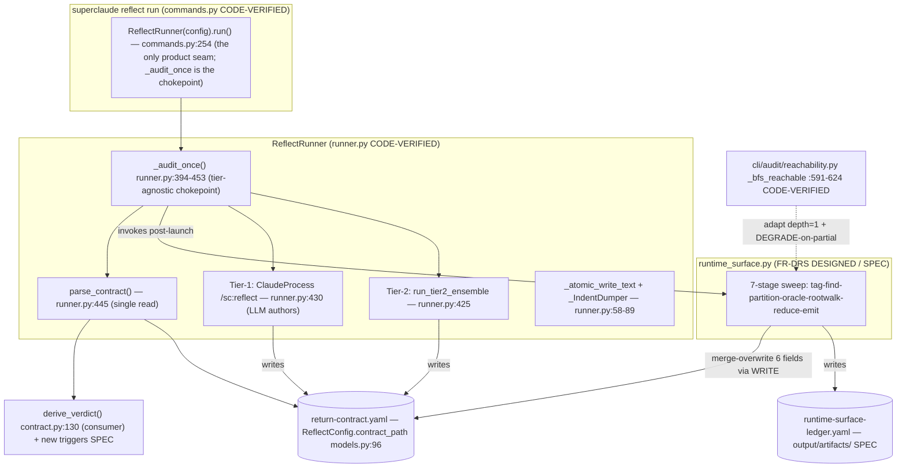
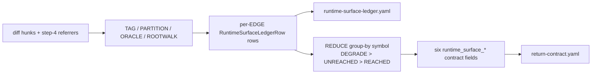
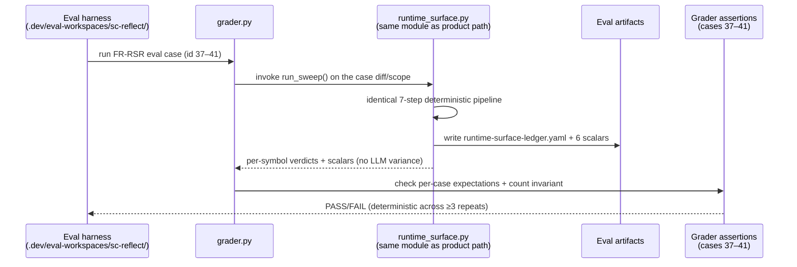

# Deterministic Runtime-Surface Sweep (FR-DRS) - Technical Design Document (TDD)

> **WHAT:** Technical Design Document specifying the architecture, data models, module/function API, and implementation details for the FR-DRS deterministic runtime-surface sweep — a pure-Python module that produces the `runtime-surface-ledger.yaml` artifact and the six `runtime_surface_*` contract scalars deterministically on every UC-2 reflect run.
> **WHY:** Translates the FR-DRS spec into an engineering specification the team builds against. Where the spec defines *what* must hold (deterministic structured emission), this TDD defines *how* to build it (the 7-step sweep, its integration seams, and its consumer wiring).
> **HOW TO USE:** Reflect engineers, architects, and QA use this document to align on the technical approach before implementation begins.

### Document Lifecycle Position

| Phase | Document | Ownership | Status |
|-------|----------|-----------|--------|
| Requirements | FR-DRS spec.md | Engineering (reflect) | Approved |
| **Design** | **This TDD** | **Engineering** | **Draft** |
| Implementation | Technical Reference | Engineering | Not started |

This TDD implements requirements from [FR-DRS spec.md](spec.md) (supersedes FR-RSR structured-output reliability, issue-1-uc2-reachability).

### Tiered Usage

| Tier | When to Use | Sections Required |
|------|-------------|-------------------|
| **Lightweight** | Bug fixes, config changes, small features (<1 sprint) | 1, 2, 3, 6.4, 21, 22 |
| **Standard** | Most features and services (1-3 sprints) | All numbered sections; skip conditional sections marked *(if applicable)* |
| **Heavyweight** | New systems, platform changes, cross-team projects | All sections fully completed, including all conditional sections |

> **Note:** FR-DRS is a **HIGH-complexity new-feature** TDD. It completes all numbered sections; the frontend-only sections (§9 State Management, §10 Component Inventory, §16 Accessibility) and the service-oriented NFR/observability families are explicitly marked **N/A** with rationale, because FR-DRS is a backend/library + CLI-integration component with no UI, network, or service surface.

---

## Document Information

| Field | Value |
|-------|-------|
| **Component Name** | Deterministic Runtime-Surface Sweep (FR-DRS) |
| **Component Type** | Backend/Library + CLI integration |
| **Tech Lead** | reflect-tech-lead |
| **Engineering Team** | Reflect Engineering |
| **Maintained By** | Reflect Engineering |
| **Target Release** | TBD |
| **Last Verified** | 2026-06-21 against the FR-DRS spec + codebase research (greenfield — module not yet implemented) |
| **Status** | Draft |

### Approvers

| Role | Name | Status | Date |
|------|------|--------|------|
| Tech Lead | | ⬜ Pending | |
| Engineering Manager | | ⬜ Pending | |
| Architect | | ⬜ Pending | |
| Security | | ⬜ Pending | |

---

## Table of Contents

1. [Executive Summary](#1-executive-summary)
2. [Problem Statement & Context](#2-problem-statement--context)
3. [Goals & Non-Goals](#3-goals--non-goals)
4. [Success Metrics](#4-success-metrics)
5. [Technical Requirements](#5-technical-requirements)
6. [Architecture](#6-architecture)
7. [Data Models](#7-data-models)
8. [API Specifications](#8-api-specifications)
9. [State Management](#9-state-management) — *N/A (backend/library + CLI)*
10. [Component Inventory](#10-component-inventory) — *N/A (backend/library + CLI)*
11. [User Flows & Interactions](#11-user-flows--interactions)
12. [Error Handling & Edge Cases](#12-error-handling--edge-cases)
13. [Security Considerations](#13-security-considerations)
14. [Observability & Monitoring](#14-observability--monitoring)
15. [Testing Strategy](#15-testing-strategy)
16. [Accessibility Requirements](#16-accessibility-requirements) — *N/A (backend/library + CLI)*
17. [Performance Budgets](#17-performance-budgets)
18. [Dependencies](#18-dependencies)
19. [Migration & Rollout Plan](#19-migration--rollout-plan)
20. [Risks & Mitigations](#20-risks--mitigations)
21. [Alternatives Considered](#21-alternatives-considered)
22. [Open Questions](#22-open-questions)
23. [Timeline & Milestones](#23-timeline--milestones)
24. [Release Criteria](#24-release-criteria)
25. [Operational Readiness](#25-operational-readiness)
26. [Cost & Resource Estimation](#26-cost--resource-estimation)
- [Reuse & Consolidation Audit](#reuse--consolidation-audit)
27. [References & Resources](#27-references--resources)
28. [Glossary](#28-glossary)
- [Appendices](#appendices)
- [Document History](#document-history)

---

## 1. Executive Summary

FR-DRS exists to **produce the runtime-surface structured outputs — the `runtime-surface-ledger.yaml` artifact and the six `runtime_surface_*` contract scalars — deterministically on every UC-2 run**, by moving their emission out of LLM reflection prose and into a standalone pure-Python sweep module, so they no longer depend on LLM field emission or "alarm level."

FR-RSR (issue-1) added runtime-surface reachability escalation to `sc-reflect-protocol` as SKILL.md prose executed by an LLM. A controlled 3×-before / 3×-after eval experiment (2026-06-20) proved that a prose-only implementation cannot deliver FR-RSR's structured-output guarantee: the LLM engaged the full structured machinery (ledger + canonical scalars) only on an alarming UNREACHED that escalates, while quiet REACHED/DEGRADE paths got a lighter reflection — correct verdict in prose, but no ledger (written in only 1 of 9 quiet-path runs) and improvised scalar names (the observed set: `runtime_surface_reachable`, `surface_reachability_verdict`, `surface_production_reachable`) that persisted even after the prose was strengthened to forbid improvised names.

The fix is a standalone `src/superclaude/cli/reflect/runtime_surface.py` module that runs a deterministic 7-step sweep (tag → find-referrers → partition → degrade-oracle → rootwalk → reduce → emit), always writes the ledger, and computes the six scalars from ledger rows by construction. The LLM retains its role authoring narration/verdict in REPORT.md; only the structured contract mirror moves to code. The safety behavior (never clean-pass an unwired/registry/test-only surface) already works at the verdict/prose level and is explicitly **not** rebuilt — FR-DRS is scoped narrowly to making the structured mirror — consumed today by the §5.3 forbid-STOP pre-filter (and, as a deferred/FR-006a future consumer, the `sprint run` executor, which reads no reflect contract today) — reliable.

**Key Deliverables:**

- A new pure-Python, LLM-free sweep module `src/superclaude/cli/reflect/runtime_surface.py` implementing the 7-step algorithm ported from `refs/runtime-surface.md`.
- Deterministic emission of `runtime-surface-ledger.yaml` (one row per evaluated edge) plus the six `runtime_surface_*` contract scalars on every UC-2 path (REACHED, DEGRADE, UNREACHED alike).
- Three integration paths: the **product path** (reflect CLI wrapper writes/overwrites the fields + ledger into `return-contract.yaml` before consumers parse it), the **eval path** (harness/grader invokes the same module), and the **SKILL.md demotion** of prose §6.1 steps 4b/4b' to "the deterministic sweep computes these; narrate the verdict in REPORT.md."

---

## 2. Problem Statement & Context

### 2.1 Background

FR-RSR (issue-1-uc2-reachability) added runtime-surface reachability escalation to `sc-reflect-protocol` as **SKILL.md prose executed by an LLM**. The intent was that, on a UC-2 audit, the skill tags surface symbols from the diff, sweeps their referrers, classifies reachability (REACHED / UNREACHED / DEGRADE), writes a `runtime-surface-ledger.yaml`, and emits six `runtime_surface_*` contract scalars that the downstream consumer (the §5.3 forbid-STOP pre-filter) reads to gate. *(The original FR-RSR intent also named the `sprint run` executor as a reader, but that read is **deferred to FR-006a** — `cli/sprint/executor.py` reads no reflect contract today and is net-new, out of FR-DRS v1 scope.)*

This work is happening now because a controlled experiment (dated 2026-06-20; full data at `TASK-RF-uc2-reachability-20260620-025931/phase-outputs/reports/before-after-comparison.md`) ran the skill 3× before and 3× after the SKILL.md prose was strengthened to forbid the improvised field names. The strengthened skill was verified loaded, yet the improvised names persisted and the ledger remained mostly unwritten — proving the prose-only approach cannot deliver the structured-output guarantee, independent of how the prose is worded.

As of this investigation, **no runtime-surface implementation exists** in `src/superclaude/cli/reflect/` (grep-confirmed zero matches for `runtime_surface`, `ledger`, `RuntimeSurfaceLedger`, `rootwalk`, `unreached_surfaces` across all seven files in that package). `refs/runtime-surface.md` is a forward-looking SPEC to build, not a description of existing code — so FR-DRS is greenfield product-path work.

### 2.2 Problem Statement

**The core problem:** A prose-only, LLM-executed implementation cannot reliably emit the `runtime-surface-ledger.yaml` artifact or the six `runtime_surface_*` contract scalars, because the LLM only engages the structured machinery on an alarming UNREACHED escalation and does a lighter reflection (no ledger, improvised scalar names) on the quiet REACHED/DEGRADE paths.

| Symptom | Evidence (from the 3×before/3×after experiment) |
|---------|-------------------------------------------------|
| Ad-hoc field names on non-escalating paths | **Observed (emitted by the LLM, research/00 §3 lines 47–49):** REACHED path emitted `runtime_surface_reachable: true`; DEGRADE path emitted `surface_reachability_verdict: DEGRADE`; quiet-UNREACHED emitted `surface_production_reachable: false` / `unreachable_surfaces`. These ad-hoc names persisted even after the SKILL prose was strengthened to forbid improvised names — note the SKILL's explicit forbid-list (research/03 §1.1: `runtime_surface_reachable`, `reachability_path`, `static_caller_absent_is_expected`) is a *separate* enumeration that overlaps the observed set only on `runtime_surface_reachable`; the persistence is structural, not a matter of which exact names the prose named. |
| Ledger not written on quiet paths | `runtime-surface-ledger.yaml` written in only **1 of 9** quiet-path runs — so deriving the contract fields from the ledger is also non-viable; the ledger is the missing artifact. |
| Full-pass before→after results never converged | positive-control 0/3→0/3; dynamic-dispatch 0/3→1/3; test-only-ref 0/3→0/3. |

- **What is broken/inadequate:** the structured contract mirror (ledger + 6 scalars) is unreliable; the consumer that reads it today (§5.3 pre-filter) cannot trust it (the `sprint run` executor is a deferred/FR-006a future consumer that reads no reflect contract today).
- **Who is affected:** the deterministic reflect layer and its downstream consumers — not end users directly, but the reliability of the forbid-STOP gating and `sprint run` execution.
- **Cost of not solving:** the FR-RSR structured-output guarantee remains undeliverable; gating consumers must fall back to unreliable LLM-typed values.
- **Root cause:** the LLM fully engages the structured machinery (ledger + canonical scalars) only on an alarming UNREACHED that escalates (the headline case, 3/3 at standard depth); on quiet paths it does a lighter reflection — correct verdict in prose, but no ledger and improvised scalar names.

### 2.3 Business Context

- **Parent spec reference:** `sc-reflect-protocol`; FR-DRS supersedes "FR-RSR structured-output reliability (issue-1-uc2-reachability)." Driving evidence: `TASK-RF-uc2-reachability-20260620-025931/phase-outputs/reports/before-after-comparison.md`. Behavior source of truth to port: `src/superclaude/skills/sc-reflect-protocol/refs/runtime-surface.md`. Contract field definitions: `SKILL.md` §9.1 (the 1.6.0 `runtime_surface_*` block).
- **Business Impact:** makes the structured contract mirror — consumed today by the §5.3 forbid-STOP pre-filter (and, as a deferred/FR-006a future consumer, the `sprint run` executor) — reliable, so reachability gating no longer depends on LLM field emission.
- **User Impact:** the existing FR-RSR **safety behavior** (caught the unwired / registry / test-only surface and never clean-passed it; FR-S9-04 blind spot closed at the verdict/prose level) already works and must NOT be rebuilt. FR-DRS is ONLY about making the structured mirror reliable, not about re-deriving the reachability safety logic.

---

## 3. Goals & Non-Goals

### 3.1 Goals

What FR-DRS WILL accomplish:

| ID | Goal | Success Criteria |
|----|------|------------------|
| G1 | Emit the structured outputs deterministically on every UC-2 run | On every UC-2 run, `runtime-surface-ledger.yaml` is written AND the six `runtime_surface_*` scalars are present with their exact canonical names — REACHED, DEGRADE, and UNREACHED paths alike — with zero dependence on LLM field emission (AC-1). |
| G2 | Remove the LLM from the structured-emission path | A standalone pure-Python module `src/superclaude/cli/reflect/runtime_surface.py` (no LLM) computes the ledger + scalars via the 7-step sweep; the LLM keeps only narration/verdict in REPORT.md (spec §1, §2). |
| G3 | Compute the six scalars from the ledger rows by construction | The six `runtime_surface_*` scalars are derived from the per-edge ledger rows reduced to per-symbol verdicts; the count invariant holds by construction, not by asserting on LLM output (AC-3). |
| G4 | Wire the deterministic values into the in-scope consumer | The §5.3 forbid-STOP pre-filter reads the deterministic scalars, not LLM-typed ones (AC-4, v1 in-scope portion). *(The `sprint run` executor read is **deferred to FR-006a** — `cli/sprint/executor.py` reads no reflect contract today, so wiring it is net-new and out of v1 scope.)* |
| G5 | Make the eval deterministic | The eval harness/grader invokes the same module so the eval is free of LLM variance; the 5 FR-RSR eval cases (ids 37–41) pass deterministically across ≥3 repeated runs with no variance (AC-2). |
| G6 | Preserve the existing safety behavior | Existing FR-RSR safety behavior (never clean-pass an unwired surface) is preserved (AC-5). |
| G7 | Pass repo hygiene gates | `make verify-sync` clean; UV-only; `ruff format --check` clean for the new module (AC-6). |

### 3.2 Non-Goals

What FR-DRS will NOT do (explicit scope boundaries, inherited from spec §5 Out of Scope):

| ID | Non-Goal | Rationale |
|----|----------|-----------|
| NG1 | Re-litigate the REACHED-vs-DEGRADE policy for `[project.scripts]` | Keep `refs/runtime-surface.md` oracle as-is: traceable dynamic wiring (incl. packaging entrypoints / console-scripts) still DEGRADEs. FR-DRS changes the producer, not the policy (spec §5). |
| NG2 | Rewrite the headline fail-pre fixture | The headline fail-pre fixture rewrite (state reachability implicitly) is carried as a sibling fixture task alongside FR-DRS so the eval is a true falsifier — it is not part of the FR-DRS module itself (spec §5). |
| NG3 | Change the LLM's narration/verdict role in REPORT.md | The LLM continues to author narration/verdict in REPORT.md; only the structured contract mirror moves to code (spec §1, §5). |
| NG4 | Rebuild the reachability safety logic | Verdict/prose correctness is already solved and verified (caught unwired/registry/test-only surfaces, never clean-passed; FR-S9-04 blind spot closed). FR-DRS is scoped narrowly to deterministic structured emission (spec §0). |

### 3.3 Future Considerations

Items deferred / dependent on open-question resolution (spec §3):

| Item | Target Phase | Notes |
|------|--------------|-------|
| Sprint executor consumer wiring (FR-006a) | Deferred (Non-Goal v1) | `cli/sprint/executor.py` reads no reflect contract today; wiring it is net-new, not a field-read swap. If/when it begins reading the contract it MUST read the deterministic scalars. |
| Programmatic LSP/Serena referrer precision upgrade (OQ-DRS.1) | Future | ripgrep/AST is the determinism floor + no-MCP fallback; LSP is an optional precision upgrade. |
| Deterministic fields on bare `claude -p /sc:reflect` runs (OQ-DRS.2) | Decision needed | Post-skill in `commands.py` covers only `superclaude reflect run`; a Wave-1A skill shell-out is the only option covering the non-CLI path. |
| Contract-version handling (OQ-DRS.3) | Decision needed | FR-RSR shipped 1.6.0 fields; FR-DRS changes the PRODUCER, not the field set — likely no version bump (semantics unchanged, reliability improved). |

---

## 4. Success Metrics

How we will measure success. All targets trace to the FR-DRS acceptance criteria (spec §4, AC-1..AC-6).

### 4.1 Technical Metrics

| Metric | Current State | Target | Measurement Method |
|--------|---------------|--------|--------------------|
| Ledger written per UC-2 run | 1 of 9 quiet-path runs (prose-only) | `runtime-surface-ledger.yaml` written on every UC-2 run — REACHED, DEGRADE, UNREACHED paths alike (AC-1) | Assert ledger file present at `<output>/artifacts/runtime-surface-ledger.yaml` after each UC-2 run |
| Six `runtime_surface_*` scalars emitted per UC-2 run | Improvised ad-hoc names on quiet paths | All six scalars present with exact canonical names on every UC-2 run, zero dependence on LLM field emission (AC-1) | Parse `return-contract.yaml`; assert the six canonical keys present on REACHED/DEGRADE/UNREACHED paths |
| Eval determinism across repeats | LLM variance; full-pass never converged (e.g. dynamic-dispatch 0/3→1/3) | 5 uc2 eval cases (ids 37–41) pass deterministically across ≥3 repeated runs with zero variance (AC-2) | Run each of the 5 cases ≥3× via the harness/grader that invokes the same module; assert identical pass result each run |
| Count invariant | Asserted on LLM output (unreliable) | `len(unreached_surfaces) == runtime_surface_unreached` holds by construction — computed, not asserted-on-LLM (AC-3) | Computed in the emitter from the per-symbol UNREACHED set; unit/integration assertion as a checkable post-condition |
| Consumer wiring | §5.3 pre-filter reads LLM-typed values | §5.3 forbid-STOP pre-filter reads the deterministic scalars (AC-4, v1 in-scope portion; the `sprint run` executor read is deferred to FR-006a — net-new, `cli/sprint/executor.py` reads no reflect contract today) | Trace the §5.3 pre-filter read against deterministically-written `runtime_surface_*` fields |
| Safety behavior preserved | Already works (verdict/prose level) | Never clean-pass an unwired surface — existing FR-RSR safety behavior preserved (AC-5) | Eval cases (unwired/test-only → UNREACHED + count invariant; degraded-backend → Grounding Gap, no STOP, no clean-pass) |
| Repo hygiene | n/a (new module) | `make verify-sync` clean; UV-only; `ruff format --check` clean for the new module (AC-6) | CI / `make verify-sync` + `uv run ruff format --check` |

**Per-case deterministic expectations (AC-2, the 5 FR-RSR eval cases ids 37–41 — five distinct fixtures):**

| Id | Case | Expected deterministic verdict |
|----|------|--------------------------------|
| 37 | `uc2-unwired-surface-passes` | FAIL-pre / PASS-post; `runtime_surface_unreached ≥ 1` + regression 1; never clean-pass the unwired surface |
| 38 | `uc2-surface-positive-control` | reachable; `unreached` 0, `degraded` false; no UNREACHED/STOP escalation |
| 39 | `uc2-surface-dynamic-dispatch` | `[project.scripts]` registry dispatch → `degraded` true, regression 0; DEGRADE, never UNREACHED |
| 40 | `uc2-surface-degraded-backend` | `backend: none` → Grounding Gap + `degraded` true; no hard-STOP, no clean-pass |
| 41 | `uc2-surface-test-only-ref` | test/comment-only → UNREACHED; hosts the `len(unreached_surfaces) == runtime_surface_unreached` count-invariant assertion |

### 4.2 Business Metrics

Not applicable in the conventional product-KPI sense — FR-DRS is an internal reliability hardening of the reflect contract pipeline. The closest "business" proxy is **structured-emission reliability**: the fraction of UC-2 runs that emit the complete ledger + six canonical scalars, with a target of 100% (every UC-2 run) by construction, versus the prose-only baseline of 1/9 ledger writes and improvised scalar names.

---

## 5. Technical Requirements

> **Source column rule:** every FR/NFR cites the spec acceptance criterion (AC-1..AC-6) it traces to. Where no AC maps, the row would be marked `[NO PRD TRACE]` and flagged in §5.3 — none were required (full coverage achieved).

> **Bridge note (algorithm steps ↔ code units):** FR-004 below specifies a **7-step algorithm** (tag → find-referrers → partition → degrade-oracle → rootwalk → reduce → emit). These 7 algorithm steps map to **6 logical code units** (§6.1, §8.1): the trailing `reduce` and `emit` steps are realized by a single `reduce_ledger` unit, giving the mapping tag→find-referrers→partition→degrade-oracle→rootwalk→**reduce+emit** = 6 units. The "7-step" framing is the algorithm flow; the "6 logical units" framing is the code-module decomposition; they describe the same pipeline.

### 5.1 Functional Requirements

The deterministic sweep module (`src/superclaude/cli/reflect/runtime_surface.py`) and its three integration paths (product `commands.py`/`runner.py`, eval harness/grader, demoted SKILL.md prose) decompose into the following functional requirements. The "Source" column traces each to a spec acceptance criterion from `research/00-prd-extraction.md` §6.

| ID | Requirement | Priority | Acceptance Criteria | Source |
|----|-------------|----------|---------------------|--------|
| FR-001 | **Deterministic ledger written on every UC-2 run.** The sweep MUST write `<output>/artifacts/runtime-surface-ledger.yaml` (one `RuntimeSurfaceLedgerRow` per evaluated edge) on every UC-2 run where `runtime_surface_sweep_ran` is true — REACHED, DEGRADE, and UNREACHED paths alike — with zero dependence on LLM field emission. | Must Have | Given any UC-2 run with ≥1 tagged surface, When the sweep completes on any verdict path, Then `runtime-surface-ledger.yaml` exists at `<output>/artifacts/` with ≥1 edge row. (Closes the 1/9-quiet-path ledger-write defect.) | AC-1 |
| FR-002 | **Six contract scalars emitted by exact canonical name on every path.** The sweep MUST compute and write all six `runtime_surface_*` fields (`runtime_surface_requirements`, `runtime_surface_sweep_ran`, `runtime_surface_ledger_path`, `runtime_surface_unreached`, `runtime_surface_degraded`, `unreached_surfaces`) using the SKILL.md §9.1 canonical names — never improvised names (`runtime_surface_reachable`, `surface_reachability_verdict`, `surface_production_reachable`, etc.). | Must Have | Given a successful sweep on REACHED/DEGRADE/UNREACHED, Then the contract carries all six fields by exact name (REACHED → `unreached:0`/`degraded:false`/`unreached_surfaces:[]`); no forbidden key appears. | AC-1 |
| FR-003 | **Count invariant holds by construction.** The module MUST compute `runtime_surface_unreached` (count of per-symbol UNREACHED verdicts) and `unreached_surfaces` (one entry per UNREACHED symbol) from the same reduced per-symbol map, such that `len(unreached_surfaces) == runtime_surface_unreached` is guaranteed by construction — computed, never asserted-on-LLM. | Must Have | Given any sweep output, Then `len(unreached_surfaces) == runtime_surface_unreached` is true on every path; a DEGRADE symbol is never added to `unreached_surfaces`. | AC-3 |
| FR-004 | **7-step deterministic sweep algorithm.** The module MUST implement the algorithm ported from `refs/runtime-surface.md`: tag → find-referrers → partition → degrade-oracle → rootwalk → reduce → emit, with per-symbol reduction precedence `DEGRADE-on-incompleteness > UNREACHED > REACHED`. | Must Have | Given the diff/scope/tasklist inputs, Then surfaces are tagged from symbol kind/decorator (py/rust/ts/js/go; others DEGRADE), referrers partitioned production-vs-test/comment, degrade-oracle categories (a)–(d) applied, rootwalk (depth=1) run before any UNREACHED, and per-symbol verdict reduced by precedence. | AC-1 |
| FR-005 | **Product path writes deterministic scalars before the contract is consumed.** The reflect CLI (`runner._audit_once`, the tier-agnostic chokepoint at runner.py:445) MUST invoke the sweep and merge-overwrite the six fields + ledger path into `return-contract.yaml` BEFORE `parse_contract` reads it, on both Tier-1 (LLM-authored) and Tier-2 (ensemble-authored) paths. | Must Have | Given a `superclaude reflect run` (Tier-1 or Tier-2, incl. tmux + fix-loop re-audit), When the contract is authored, Then the deterministic six fields overwrite any LLM/ensemble values before `parse_contract`, and `derive_verdict` consumes the deterministic values. | AC-4 |
| FR-006 | **§5.3 forbid-STOP pre-filter gates on the DERIVED `surface_unreached` field (in-scope).** The §5.3 tier-decision pre-filter does **not** read the integer `runtime_surface_unreached` directly; it gates on a DERIVED string field `surface_unreached` (SKILL.md:390-391 row conjuncts `NOT surface_unreached`; SKILL.md:402 table-wide pre-filter; SKILL.md:412 literal value `"runtime_surface_unreached"`). A **derivation step** sets `surface_unreached = "runtime_surface_unreached"` (the literal string) whenever the deterministic sweep emits the integer `runtime_surface_unreached ≥ 1` from a SUCCESSFUL sweep; on a degrade-only or fully-REACHED run `surface_unreached` stays `null`. The sweep MUST emit the integer scalar deterministically AND the derivation MUST run so the pre-filter gates on a deterministically-derived value, not an LLM-typed one. **Derivation owner (recommended):** the deterministic sweep / reflect CLI wrapper writes `surface_unreached` into `tier_decision`/contract state alongside the six scalars at `runner._audit_once` (same merge-overwrite point, FR-005); `derive_verdict` is the fallback owner if the field is consumed there. This read executes in-skill today, so wiring it to the deterministic value is in scope for this rollout. | Must Have | Given a successful sweep with integer `runtime_surface_unreached ≥ 1`, Then the derivation sets `surface_unreached = "runtime_surface_unreached"`, And the §5.3 pre-filter evaluates `NOT surface_unreached` as false (forces Tier 2, `status: partial`); REACHED writes integer `0` → `surface_unreached` null → no force. | AC-4 |
| FR-006a | **Sprint executor read of the deterministic scalars (DEFERRED — net-new, not delivered by this rollout).** AC-4 also names the `sprint run` executor as a deterministic-scalar reader, but `cli/sprint/executor.py` reads no reflect contract today (it imports `TurnLedger` for budget only, per research/03 §5.2/§5.3). Wiring it is a **net-new integration**, not a field-read swap, and **no rollout phase wires it** — this requirement is SPEC-ONLY / deferred and explicitly out of scope for FR-DRS v1. | Deferred (Non-Goal v1) | N/A this rollout — recorded as a deferred consumer. If/when the executor begins reading the reflect contract, it MUST read the deterministic scalars; until then there is nothing to wire. | AC-4 (partial / deferred) |
| FR-007 | **FR-RSR safety preserved — never clean-pass an unwired surface.** The module MUST preserve the existing FR-RSR safety behavior: a tagged surface whose production reachability could not be evaluated, or that is UNREACHED, MUST NOT produce a clean PASS. Reachability uncertainty maps to `DEGRADE → §10.6 Grounding Gap`; UNREACHED suppresses clean PASS and routes through the existing deviation mapping (§10.9). | Must Have | Given an unwired/registry/test-only surface, Then the sweep never emits a clean PASS for it; uncertainty → DEGRADE + Grounding Gap; decided UNREACHED → suppress PASS (no regression rebuild of solved verdict/prose logic). | AC-5 |
| FR-008 | **Eval path invokes the same module for determinism.** The eval harness/grader MUST invoke the same deterministic module so the FR-RSR eval (ids 37–41) is free of LLM variance — either as a grader oracle assertion or by materializing the contract's six fields upstream of grading. | Must Have | Given the **5 distinct FR-RSR eval cases** run ≥3 times, Then results are identical across runs (no variance): **37 `uc2-unwired-surface-passes`** → FAIL-pre/PASS-post, `runtime_surface_unreached ≥ 1` + regression 1, never clean-pass the unwired surface; **38 `uc2-surface-positive-control`** → reachable, `unreached: 0`, `degraded: false`, no UNREACHED/STOP; **39 `uc2-surface-dynamic-dispatch`** (`[project.scripts]`) → `degraded: true`, regression 0, DEGRADE never UNREACHED; **40 `uc2-surface-degraded-backend`** (`backend: none`) → Grounding Gap + `degraded: true`, no hard-STOP, no clean-pass; **41 `uc2-surface-test-only-ref`** (test/comment-only) → UNREACHED + the `len(unreached_surfaces) == runtime_surface_unreached` count invariant (this case hosts the count-invariant assertion). | AC-2 |
| FR-009 | **Degrade-oracle classifies idiomatic dynamic wiring as DEGRADE, never Regression.** The module MUST route decorator routes, `[project.scripts]`/entry-points, registry/DI/string-dispatch, and reflection/dynamic-import surfaces to `DEGRADE` (sets `runtime_surface_degraded: true`, §10.6 Grounding Gap), never incrementing `deviation_count_by_class.regression` and never `verification_regressions_detected`. | Must Have | Given a `[project.scripts]`/registry/reflection-wired surface, Then verdict is DEGRADE with `runtime_surface_degraded: true`; `regression` counter is not incremented; no blocking Regression is produced. | AC-2 |
| FR-010 | **Fail-open backend/tool loss → DEGRADE, continue, never STOP.** On `backend: none`, chain-degraded availability, Serena/LSP unavailable, or a referrer-fetch failure, the module MUST degrade the affected edge to §10.6 Grounding Gap, set `runtime_surface_degraded: true`, append `"runtime-surface:backend_unavailable"` to `degraded_components`, continue over remaining edges, and NEVER STOP/abort. | Should Have | Given backend/tool unavailability mid-sweep, Then the affected edge degrades, the sweep continues over remaining edges, no global abort occurs, and no clean PASS is emitted for the degraded surface. | AC-2, AC-5 |
| FR-011 | **Demote SKILL.md scalar-emission prose to deterministic-sweep narration.** SKILL.md §6.1 step 4b/4b′ prose MUST be demoted from "the LLM hand-types the six scalars" to "the deterministic sweep computes these; narrate the verdict in REPORT.md." The LLM retains only narration/verdict authorship in REPORT.md. | Must Have | Given the updated SKILL.md, Then §6.1 4b/4b′ instructs the LLM not to emit the scalars (sweep owns them); the LLM's REPORT.md narration/verdict role is unchanged. | AC-1 |
| FR-012 | **Non-surface fast path adds zero sweep cost.** A diff with no tagged surface symbol MUST short-circuit to `runtime_surface_requirements: []`, `runtime_surface_sweep_ran: false`, write no ledger, and add zero referrer-analysis cost. | Should Have | Given a non-surface diff, Then `runtime_surface_sweep_ran: false`, `runtime_surface_requirements: []`, no ledger file is written, and no referrer sweep runs. | AC-1 |
| FR-013 | **`make verify-sync` / UV-only / `ruff format --check` clean.** The new module and all SKILL/ref edits MUST keep `make verify-sync` clean (src/ ↔ .claude/ in sync), use UV-only Python invocation, and pass `ruff format --check` for the new module. | Must Have | Given the implemented change, Then `make verify-sync` exits clean, no bare `python -m`/`pip` is used, and `uv run ruff format --check src/superclaude/cli/reflect/runtime_surface.py` reports no diff. | AC-6 |

**FR count: 14** (Must Have: 11 — FR-001..009, FR-011, FR-013; Should Have: 2 — FR-010, FR-012; Deferred/Non-Goal v1: 1 — FR-006a; Could Have: 0). FR-006 was split: the §5.3 pre-filter read stays in-scope Must-Have; the sprint-executor read is carried as the deferred FR-006a (net-new, not wired by this rollout).

### 5.2 Non-Functional Requirements

This component is a deterministic, local-only, library-style code module — not a network service. The standard NFR families in the template (latency p50/p95/p99, throughput, availability %, SLOs/error budgets, encryption-in-transit) are **N/A — local deterministic module, no request surface**: there is no request/response surface, no network I/O, and no multi-user concurrency model beyond parallel local sessions. The non-functional requirements that govern FR-DRS are determinism, reliability/idempotency, no-network/local-only file writes, atomic durability, and YAML lint-safety.

| ID | Requirement | Priority | Acceptance Criteria | Source |
|----|-------------|----------|---------------------|--------|
| NFR-001 | **Full determinism — zero LLM dependence in the structured path.** Identical inputs (diff/patch + scope/work-tree + tasklist + static caller index) MUST yield byte-identical six scalars, `unreached_surfaces` membership, and ledger rows across runs. No LLM call, no wall-clock/random/PID-dependent value, and no environment-ordering dependence may enter the structured-emission path. | Must Have | Given the same inputs run ≥3 times, Then the six scalars + `unreached_surfaces` symbol set + ledger edge rows are identical every time (no variance) — the property the eval relies on for AC-2. | AC-1, AC-2 |
| NFR-002 | **Reliability / idempotency across re-audits.** The sweep MUST be safely re-runnable: the fix-loop re-audit (`_audit_once` per loop turn, same `--base` reused) and any repeat invocation MUST recompute the same result and overwrite the ledger + scalars idempotently, with no accumulation or drift across iterations. | Must Have | Given N re-audits over an unchanged base, Then each produces the same ledger + scalars; re-running never appends duplicate edges or mutates the count invariant. | AC-2, AC-4 |
| NFR-003 | **No network — local-only file writes.** The module MUST perform no network I/O of any kind. All reads are local (diff, work-tree, `pyproject.toml`, tasklist, Wave-0 availability surface); all writes are confined to `<output>/` (`return-contract.yaml` merge + `<output>/artifacts/runtime-surface-ledger.yaml`). It MUST never write outside `<output>/` and never STOP/abort the run. | Must Have | Given a sweep run with no network access, Then it completes; static analysis confirms zero socket/HTTP/MCP-network calls; all writes resolve under `<output>/`. | AC-1, AC-5 |
| NFR-004 | **Atomic, parallel-safe writes.** The ledger and the contract merge MUST be written atomically via the runner convention `_atomic_write_text` (randomized same-dir temp + `os.replace` + `finally`-unlink, `parent.mkdir(parents=True, exist_ok=True)` first), giving last-write-wins safety for parallel sessions sharing the output dir. The non-atomic ensemble `path.write_text` MUST NOT be copied for these artifacts. | Should Have | Given concurrent writers to the same `<output>/`, Then no partial/torn ledger or contract is observable; a reader sees either the prior or the complete new file (never a truncated temp). | AC-1 |
| NFR-005 | **yamllint-safe YAML emission.** The ledger and any sweep-authored YAML (nested `unreached_surfaces:` / `production_referrers:` block sequences) MUST be dumped through the runner's `_IndentDumper` (SafeDumper subclass overriding `increase_indent`, `indent-sequences: true` conformant), so pre-commit yamllint passes. The ensemble's bare `yaml.safe_dump` MUST NOT be used for nested-sequence artifacts. | Should Have | Given the emitted ledger YAML, Then pre-commit `yamllint` passes (sequences indented under their key); `yaml.safe_load` round-trips the file to the same structure. | AC-6 |
| NFR-006 | **`evidence_ref` re-readability.** Every ledger row's `evidence_ref` MUST resolve to a re-readable `file:line` or an on-disk artifact path under `<output>/` (never a transient/in-memory handle), so the downstream evidence-validator can re-Read it. | Should Have | Given any ledger row, Then its `evidence_ref` points at a resolvable `file:line` or `<output>/` artifact that re-Reads successfully. | AC-1 |
| NFR-007 | **Toolchain hygiene (UV-only, sync, format).** All Python operations MUST use UV (`uv run …`); `make verify-sync` MUST stay clean (edits land in `src/superclaude/`, never `.claude/` directly); `uv run ruff format --check` MUST pass for the new module. | Must Have | Given the change set, Then no bare `python -m`/`pip` appears, `make verify-sync` is clean, and `ruff format --check` reports no diff for `runtime_surface.py`. | AC-6 |

**NFR count: 7** (Must Have: 4 — NFR-001, 002, 003, 007; Should Have: 3 — NFR-004, 005, 006).

### 5.3 PRD/AC Traceability Coverage & Gaps

Every FR and NFR above maps to at least one spec acceptance criterion (AC-1..AC-6). **No `[NO PRD TRACE]` rows were required** — full coverage achieved. (This sub-section is the requirement→AC traceability roll-up; it is distinct from the SKILL's `§5.3` forbid-STOP pre-filter referenced throughout this TDD.)

**Per-AC coverage map (confirms all six ACs are exercised):**

| AC | Spec acceptance criterion (abridged) | Covered by |
|----|--------------------------------------|------------|
| AC-1 | Every UC-2 run writes the ledger + six canonical scalars, zero LLM dependence | FR-001, FR-002, FR-004, FR-011, FR-012; NFR-001, 003, 004, 006 |
| AC-2 | 5 FR-RSR eval cases (37–41) pass deterministically across ≥3 runs, no variance | FR-008, FR-009, FR-010; NFR-001, 002 |
| AC-3 | `len(unreached_surfaces) == runtime_surface_unreached` by construction | FR-003 |
| AC-4 | §5.3 forbid-STOP pre-filter reads deterministic scalars (in-scope); `sprint run` executor read is deferred (FR-006a, net-new — not wired this rollout) | FR-005, FR-006 (in-scope); FR-006a (deferred); NFR-002 |
| AC-5 | Existing FR-RSR safety (never clean-pass an unwired surface) preserved | FR-007, FR-010; NFR-003 |
| AC-6 | `make verify-sync` clean; UV-only; `ruff format --check` clean | FR-013; NFR-005, 007 |

**Design gaps flagged for the TDD author (open design decisions surfaced by research — not requirement-trace gaps):**

| # | Gap | Source research | Disposition |
|---|-----|-----------------|-------------|
| G1 | **Bare `claude -p /sc:reflect` coverage (OQ-DRS.2).** `runner._audit_once` (FR-005) covers all runner-driven paths but NOT a bare skill invocation that never enters the CLI. Full coverage needs a Wave-1A skill shell-out to the same module. AC-1 says "every UC-2 run"; the product-path FR currently guarantees only runner-driven runs. | research/02 §commands, §candidate-sites; research/00 OQ-DRS.2 | Decide whether bare-skill runs are in-scope for the determinism guarantee; if yes, add a shell-out FR. Spec leaves this open (OQ-DRS.2). See §22. |
| G2 | **Sprint executor consumer is spec-only, not implemented.** AC-4 / FR-006 names the sprint executor as a reader, but `cli/sprint/executor.py` reads no reflect contract today (imports `TurnLedger` for budget only). Wiring it is a net-new integration, not a field-read swap. | research/03 §5.2, §5.3, Gap 1 | **Resolved:** the sprint-executor read is **deferred as FR-006a** (net-new, Non-Goal v1 — see FR-006a row above); **FR-006 covers only the in-scope §5.3 forbid-STOP pre-filter read.** AC-4's v1 portion is the pre-filter read alone; the executor read is recorded as a deferred consumer with nothing to wire this rollout. |
| G3 | **`contract_version` "1.0" (ensemble) vs "1.6.0" (skill) mismatch.** Tier-2 ensemble stamps `1.0`; skill declares `1.6.0` for the `runtime_surface_*` additive bump. Consumer gate only checks `major == "1"`, so verdict derivation is unaffected, but emitting the six fields under `1.0` is internally inconsistent. OQ-DRS.3 leans "no version bump (semantics unchanged)." | research/02 Stale Doc §1; research/00 OQ-DRS.3 | Reconcile (bump ensemble to match, or document independence) when the ensemble path emits the six fields. Carried into §19 Migration and §22 Open Questions. |
| G4 | **Sixth field naming is non-uniform.** Only five of the six fields carry the literal `runtime_surface_` prefix; the sixth is `unreached_surfaces`. A consumer using `startswith("runtime_surface_")` would silently drop it. FR-002 pins the exact six names to prevent this. | research/03 §1, Gap 2; research/01 Gap 1 | Already mitigated by FR-002 (exact-name emission); flagged so the §8 data-model keys on the literal six. |
| G5 | **Referrer engine choice (OQ-DRS.1).** ripgrep/AST floor vs programmatic Serena/LSP. Determinism + no-MCP fallback (NFR-001, FR-010) argue ripgrep/AST as the deterministic floor; LSP as optional precision upgrade. | research/01 §1–§2; research/00 OQ-DRS.1 | Architecture/§6 decision (§6.4 D3); constrained by NFR-001 (must be deterministic regardless of engine availability). |

---

## 6. Architecture

> **Scope of this section:** FR-DRS introduces a new pure-Python module, `src/superclaude/cli/reflect/runtime_surface.py`, that deterministically produces the six `runtime_surface_*` contract scalars and the `runtime-surface-ledger.yaml` artifact, removing the LLM from the structured-emission path. The architecture below is the **DESIGNED** target. The runtime-surface module **does not exist yet** — a grep across all seven files in `src/superclaude/cli/reflect/` (`models.py`, `runner.py`, `commands.py`, `contract.py`, `ensemble.py`, `config.py`, `__init__.py`) returns zero matches for `runtime_surface`, `RuntimeSurface`, `rootwalk`, `unreached_surfaces`, or `ledger` [CODE-VERIFIED, research 01/02]. Algorithm steps (the 6 logical units and 7-stage data flow) are grounded in the spec `refs/runtime-surface.md` and are correctly tagged `[SPEC]`, **not** presented as existing code. The integration surfaces the module plugs into (`_audit_once`, `parse_contract`, `_IndentDumper`, `_atomic_write_text`, `ReflectConfig.contract_path`, `cli/audit/reachability.py:_bfs_reachable`) are all `[CODE-VERIFIED]` and described as the real, current product path.

### 6.1 High-Level Architecture

The sweep is a **deterministic, LLM-free, UC-2-only** pipeline composed of **6 logical units** wired in a fixed 7-stage data flow (see the §5.1 bridge note for the 7-step ↔ 6-unit mapping). It consumes the diff/patch under audit (plus scope work-tree and tasklist) and produces one per-edge ledger YAML plus six per-symbol contract scalars, written into `return-contract.yaml` **before** that contract is parsed by any consumer.

The 6 logical units and the `tag → find-referrers → partition → degrade-oracle → rootwalk → reduce → emit` data flow:

```
                         FR-DRS runtime_surface.py  (DESIGNED, pure-Python, LLM-free, UC-2 only)
                         [SPEC: refs/runtime-surface.md §1-§6]

 INPUTS                                                                                  OUTPUTS
 ┌─────────────┐                                                                         ┌──────────────────────────┐
 │ diff/patch  │                                                                         │ runtime-surface-         │
 │ scope wtree │                                                                         │   ledger.yaml            │
 │ tasklist    │                                                                         │ (per-edge rows)          │
 └──────┬──────┘                                                                         │ <output>/artifacts/      │
        │                                                                                └────────────▲─────────────┘
        ▼                                                                                             │
 ┌──────────────┐   ┌──────────────┐   ┌──────────────┐   ┌──────────────┐   ┌──────────────┐  ┌─────┴────────┐
 │ (1) surface- │   │ (2) referrer-│   │ (3)          │   │ (4) degrade- │   │ (5) entrypoint│  │ (6) ledger + │
 │     tagger   │──▶│     finder   │──▶│  partitioner │──▶│     oracle   │──▶│   -rootwalk   │─▶│  scalar      │
 │              │   │ (rg/AST floor│   │ prod vs test/│   │ a–d → DEGRADE│   │ depth=1;      │  │  reducer     │
 │ kind+decorat.│   │  LSP overlay)│   │   comment    │   │ before UNREA.│   │ partial→DEGR. │  │ reduce→emit  │
 └──────────────┘   └──────────────┘   └──────────────┘   └──────────────┘   └───────┬──────┘  └─────┬────────┘
   TAG               FIND-REFERRERS      PARTITION          DEGRADE-ORACLE     ROOTWALK│          REDUCE│
   FR-RSR.1          (reuse step-4)      §2 lang table      §3 oracle          §4      │          §5    │
        │                                                                              │                │
        └── non-surface fast path: requirements:[], sweep_ran:false, zero cost ────────┘                ▼
                                                                                          ┌──────────────────────────┐
   reduction precedence:  DEGRADE-on-any-incompleteness > UNREACHED > REACHED            │ 6 contract scalars into   │
   invariant:  len(unreached_surfaces) == runtime_surface_unreached                      │ return-contract.yaml      │
                                                                                          │ (BEFORE parse_contract)   │
                                                                                          └──────────────────────────┘
```

| Stage | Logical unit | What it does | Source |
|-------|--------------|--------------|--------|
| TAG | (1) surface-tagger | Classify diff-hunk symbols as runtime surfaces by resolved symbol kind + decorator/registration against the allowlist `{py, ts, js, rust, go}`; unclassifiable → DEGRADE (never silent-skip). Non-surface diff short-circuits to the fast path (`requirements:[]`, `sweep_ran:false`, zero added cost). | `[SPEC]` RS §1 |
| FIND-REFERRERS | (2) referrer-finder | Extend the already-fetched step-4 `find_referencing_symbols` result (no second fetch); rg/AST floor with optional LSP/Serena precision overlay that DEGRADEs-to-floor on any unavailability. | `[SPEC]` RS §1 / SKILL:489; web-01/web-02 |
| PARTITION | (3) partitioner | Split each referrer into production vs test/inline-test/comment via the per-language table; unknown/ambiguous → DEGRADE (never "treat as production"). | `[SPEC]` RS §2 |
| DEGRADE-ORACLE | (4) degrade-oracle | If any of 4 categories matches (decorator routes / packaging entrypoints / registry-DI-string-dispatch / reflection-dynamic-import) → DEGRADE; MUST run before any UNREACHED. | `[SPEC]` RS §3 |
| ROOTWALK | (5) entrypoint-rootwalk | For each candidate-UNREACHED symbol, enumerate runtime roots and walk at depth bound = 1; REACHED on any root hit, confirmed UNREACHED only on full enumeration + clean oracle, DEGRADE on any partial enumeration. Adapts `cli/audit/reachability.py:_bfs_reachable`. | `[SPEC]` RS §4; adapts `[CODE-VERIFIED]` `reachability.py:591-624` |
| REDUCE + EMIT | (6) ledger + scalar reducer | Collapse per-edge rows to per-symbol verdict under `DEGRADE > UNREACHED > REACHED`; write the per-edge ledger YAML; compute the 6 scalars with `len(unreached_surfaces) == runtime_surface_unreached` holding by construction. | `[SPEC]` RS §5/§6 |

**Governing posture (preserved from FR-RSR safety logic, NOT re-derived):** fail-loud asymmetric cost — never silently PASS an untested surface, never silently Regression an idiomatic dynamic/registry/decorator/packaging/reflection entrypoint; every uncertainty maps to `DEGRADE → §10.6 Grounding Gap` [SPEC, RS §3/§4; research 06 P1–P5].

**Root-enumeration algorithm (I2 — produces the `EntrypointRoot` set the rootwalk starts from).** The rootwalk (stage 5) walks at depth=1 from a set of enumerated runtime roots; that set is produced deterministically by scanning, in fixed order, these declared-entrypoint sources in the scope work-tree:

1. **`[project.scripts]`** in `pyproject.toml` (e.g. `superclaude = "superclaude.cli.main:main"`) — `[CODE-VERIFIED]` against `pyproject.toml:68-69` (the same source degrade-oracle category (b) cites).
2. **`[project.entry-points.*]`** groups in `pyproject.toml` (plugin/console-script entry-point tables).
3. **CLI command roots** registered via the project's command framework (Click/Typer group/command roots reachable from the script entrypoints in 1–2).

Each declared entrypoint becomes one `EntrypointRoot` (`{root_id, kind, target}`, §8.1.1), sorted lexicographically by `root_id` for determinism (NFR-001). **Completeness check (gates REACHED vs DEGRADE-on-partial):** enumeration is "complete" only when every source above was scanned without error AND every declared entrypoint resolved to a `module:symbol` target. If ANY source errors, is unreadable, or yields an unresolvable target, `enumeration_complete = false` → the candidate-UNREACHED symbol DEGRADEs (never UNREACHED) — because an incomplete root set could hide a real reach path. A symbol is confirmed `UNREACHED` ONLY on a complete enumeration with no depth=1 root hit; any root hit → `REACHED`; any partial enumeration → `DEGRADE` (RS:L57, §12.3 "Partial rootwalk enumeration" row).

### 6.2 Component Diagram

How the FR-DRS module fits the existing reflect CLI product path. Solid boxes are `[CODE-VERIFIED]` current code; the dashed box is the `[SPEC]` new module; the merge/write edge into `return-contract.yaml` is the new wiring.



**Reading the diagram.** `_audit_once` (runner.py:394-453) is the single tier-agnostic chokepoint that runs on every audit and every auto-fix re-audit; it sits exactly between contract-authoring (Tier-1 LLM or Tier-2 ensemble) and `parse_contract` (runner.py:445, the single read). The FR-DRS sweep is invoked there, **merge-overwrites** the six `runtime_surface_*` keys into the just-authored `return-contract.yaml` (via the runner's `_atomic_write_text` + `_IndentDumper`), and writes the sibling ledger — so `derive_verdict` consumes the deterministic values, not LLM-typed ones [research 02]. The rootwalk unit adapts the audit BFS internal (`_bfs_reachable`) rather than importing it (see §6.4 D1). **Coverage caveat:** this CLI-side site covers `superclaude reflect run` (foreground, `--tmux` inner, and the fix loop) on **both** tiers, but does **NOT** cover a bare `claude -p /sc:reflect` invocation, which never enters the Python wrapper — see §6.4 D2 (OQ-DRS.2).

### 6.3 System Boundaries

| Boundary | Description | Protocol / Format |
|----------|-------------|-------------------|
| Upstream (inputs) | The diff/patch under audit plus the scope work-tree, and the tasklist consumed for requirement-mapping. The diff/patch supplies the changed symbols the surface-tagger classifies; the scope work-tree supplies the referrer search space; the tasklist supplies the requirement→surface linkage. | Unified diff / patch text + filesystem work-tree + MDTM tasklist markdown [research 01] |
| Downstream — contract consumers | **In-scope live readers:** `return-contract.yaml` is read by `contract.py` `parse_contract` / `derive_verdict` (the single read at `runner.py:445`), and the SKILL §5.3 forbid-STOP pre-filter gates on the DERIVED `surface_unreached` string field — **not** on the integer `runtime_surface_unreached` directly. The sweep emits the integer `runtime_surface_unreached`; a derivation step sets `surface_unreached = "runtime_surface_unreached"` when that integer is `≥ 1` from a successful sweep (SKILL.md:402/412); the §5.3 pre-filter then reads `surface_unreached` (SKILL.md:390-391). The sweep merge-overwrites the six `runtime_surface_*` fields **before** these consumers read, and the derivation runs at the same point (FR-006). **Deferred (SPEC-ONLY) consumer:** the `sprint run` executor (`cli/sprint/executor.py`) reads **no** reflect contract today (it imports `TurnLedger` for budget only, research/03 §5.2/§5.3); it is NOT a live reader and is NOT wired by this rollout. The architecture records it as a future/deferred consumer (FR-006a) — when it begins reading the contract it MUST read the deterministic scalars, but FR-DRS v1 delivers no executor wiring. | `return-contract.yaml` (PyYAML; written via `_IndentDumper` + `_atomic_write_text`) [research 02, research 03 §5, research 06] |
| Artifact (sibling output) | The per-edge ledger `<output>/artifacts/runtime-surface-ledger.yaml` (one row per referrer edge), written alongside the contract for forensics; not consumed by `derive_verdict`. | `runtime-surface-ledger.yaml` (block-sequence YAML, yamllint-conformant) [research 02] |

**Entrypoint-rootwalk adaptation note.** The rootwalk unit adapts `cli/audit/reachability.py` `_bfs_reachable` (`:591-624`) but inverts two of its semantics at the boundary: it walks with **depth = 1** and **DEGRADEs on partial enumeration**, whereas the audit BFS is **unbounded** (no depth parameter; depth>50 guard only on recursive module parse) and reports **UNREACHABLE on dynamic-dispatch** rather than DEGRADE. The boundary thus converts cleanup-audit's binary reachable/unreachable doctrine into runtime-surface's asymmetric-cost DEGRADE-on-uncertainty doctrine [research 05 §5, research 06].

**Diff-acquisition contract (I1 — unified input shape across both paths).** `run_sweep` (§8.1.2) takes the diff as **unified-diff/patch text** (`diff: str`) plus the `base_ref` it was computed against — never a pre-parsed hunk list and never an in-process git handle, so the product and eval paths share one byte-identical input shape:

- **Product path:** `runner._audit_once` supplies the diff text from the `ReflectConfig` audit inputs — the same `--base`-relative diff the audit already computes (reused verbatim on every fix-loop re-audit, NFR-002). The sweep does NOT shell its own `git diff`; it consumes the diff the runner already holds.
- **Eval path:** the grader supplies the case's `input/diff.patch` (the `cases/uc2-*/input/diff.patch` fixture) as the same `diff: str`.

The surface-tagger then AST-parses the changed hunks into `DiffHunk`s (§8.1.1) internally. Because both callers hand `run_sweep` the identical unified-diff text + base_ref, the tagger sees the same input on both paths — the precondition for the eval being a true falsifier (§11.2). Supplier: the **runner** (product) / the **grader** (eval); neither relies on the sweep fetching its own diff.

### 6.4 Key Design Decisions

| Decision | Choice | Rationale | Alternatives Considered |
|----------|--------|-----------|-------------------------|
| **D1 — reflect→audit import boundary** | **Option C (reflect-local copy) for v1**; Option B (boundary-neutral shared helper) as the clean long-term shape; **avoid Option A**. | Importing `cli/audit` is *mechanically legal* — reflect's documented import ban names `cli/sprint` and `cli/roadmap` ONLY (verified in `runner.py:8-9`, `config.py:7-10`, `models.py:8-12`; `__init__.py` carries no ban) — BUT it couples reflect's product/gating path to cleanup-audit heuristic semantics whose defaults (UNKNOWN→SOURCE, dynamic→KEEP:monitor, dynamic-dispatch→UNREACHABLE, depth>50) are the *inverse* of runtime-surface's asymmetric-cost doctrine. Option C matches the in-repo copy-over-import precedent at `runner.py:14-17` (`_IndentDumper` copied locally rather than importing the private symbol). [research 05 §7] | (A) import `cli/audit` directly — lowest LOC but silent, semantics-inverted coupling + reaches an unexported `_bfs_reachable`; (B) extract a boundary-neutral BFS helper both packages import — no coupling but a refactor touching `cli/audit` with its own regression cost; (C) reflect-local copy of the ~30-line BFS skeleton with depth=1 + DEGRADE-on-partial baked in. [research 05 §7 A/B/C] |
| **D2 — invocation site (OQ-DRS.2)** | Invoke the sweep at `runner.py` `_audit_once` (`:394-453`); keep the SKILL prose demotion **conditional** with an LLM-fallback branch for the bare-CLI path. | `_audit_once` is the strongest CLI chokepoint: tier-agnostic, runs on every audit and every auto-fix re-audit, and sits between contract-authoring and `parse_contract`. But it covers ONLY `superclaude reflect run` (foreground, `--tmux` inner, fix loop) — it does **NOT** cover bare `claude -p /sc:reflect`, which never enters the Python wrapper. So the deterministic demotion cannot be unconditional; the bare path must retain an LLM-authored fallback, branched on the **presence of `runtime_surface_sweep_ran` in `return-contract.yaml`** as the "module ran" detection signal (§19.1 I6). [research 02] | `commands.py` (too early / not the re-audit chokepoint) vs `runner.py` `_audit_once` (chosen) vs a Wave-1A skill-shell-out (would couple the skill prose to a subprocess and still miss the chokepoint coverage). [research 02] |
| **D3 — referrer engine (OQ-DRS.1)** | ripgrep/AST **floor** as the determinism-safe default (`--sort path`), with an **optional** Serena/LSP precision overlay that **DEGRADEs-to-floor** on any unavailability. | The floor must be deterministic and reproducible for a gating path; an LSP/Serena overlay adds symbol-level precision when present but must never make the verdict depend on a non-deterministic or absent tool — hence fail-open back to the rg/AST floor. [web-01, web-02; research 05 §2] | LSP/Serena as a *hard* dependency (rejected — non-deterministic, breaks reproducible gating); rg/AST only with no overlay (loses precision where structured analysis is available). |
| **D4 — sweep ordering (before parse)** | The sweep runs and merge-overwrites the six `runtime_surface_*` fields into `return-contract.yaml` **before** `parse_contract` consumes it. | Guarantees `derive_verdict` (and the §5.3 forbid-STOP pre-filter) consume the deterministic, sweep-computed scalars rather than LLM-typed ones; the `len(unreached_surfaces) == runtime_surface_unreached` invariant holds by construction at read time. [research 02, research 06] | Sweep after parse / as a separate post-pass (rejected — would let `derive_verdict` read stale LLM-authored values before the deterministic overwrite lands). |

---

## 7. Data Models

> **Component type note:** FR-DRS is a backend/library component (a deterministic, LLM-free Python sweep under `src/superclaude/cli/reflect/`). This section models the **on-disk ledger artifact** and the **in-memory `RuntimeSurfaceLedgerRow` TypedDict** that the sweep produces, plus the per-symbol reduction and the count invariant. The contract scalars the ledger reduces to are specified in §8 (API).

### 7.1 Data Entities

#### 7.1.1 `runtime-surface-ledger.yaml` (per-run artifact)

The sweep writes `<output>/artifacts/runtime-surface-ledger.yaml` as a **per-run artifact**, **one row per evaluated EDGE** (not one row per symbol). The per-edge-vs-per-symbol split is the most error-prone aspect of the model and is what drives the count invariant in §7.4. Source: `refs/runtime-surface.md:61-101` (RS:L63 granularity; RS:L65-L72 row shape).

YAML row shape (RS:L65-L72):

```yaml
- requirement_id: <str | null>          # null is valid; tagger is symbol-anchored
  symbol: <str>                          # tagged surface symbol name-path
  edge: <str>                            # "<symbol> -> <referrer-or-entrypoint-root>"
  status: REACHED | UNREACHED | DEGRADE
  production_referrers: [<file:line>]    # surviving non-test/non-comment referrers; [] for UNREACHED
  evidence_ref: <file:line-or-artifact>  # evidence backing the verdict; re-Read by evidence-validator
```

Ledger row entity — Field / Type / Required / Description / Constraints:

| Field | Type | Required | Description | Constraints |
|-------|------|----------|-------------|-------------|
| `requirement_id` | `str \| null` | No | Surface requirement id tagged from the diff hunk. `null` is valid because the tagger is **symbol-anchored, not requirement-anchored** (RS:L7, L66). | May be `null`; a surface hunk with no mapped requirement is still tagged and still swept. |
| `symbol` | `str` | Yes | The tagged surface symbol **name-path** (e.g. `MyClass/my_handler`). | Stable **join key** for the per-symbol reduction (§7.4). One symbol → N edge rows. |
| `edge` | `str` | Yes | Formatted `"<symbol> -> <referrer-or-entrypoint-root>"` (RS:L68). One ledger row = one such edge. | **Canonical formatter (pinned, resolves OQ-EDGE — see §7.1.1a).** Exact form: `f"{symbol} -> {target}"` with a single space on each side of the literal `->` delimiter; `target` is a referrer `file:line` for referrer edges, or `root:{root_id}` for an entrypoint-root edge (`EntrypointRoot.root_id`, §8.1.1); edges are deduped on the exact `(symbol, target)` pair and sorted lexicographically by the formatted string before emit (determinism, R3). Grouping joins on `symbol`, NOT `edge`. |
| `status` | `Literal["REACHED","UNREACHED","DEGRADE"]` | Yes | **Per-EDGE** status. The per-symbol verdict is derived by reduction (§7.4), not stored here. | Exactly one of the three enum tokens. |
| `production_referrers` | `list[str]` | Yes | Surviving non-test / non-comment referrers as `file:line`. | **MUST be `[]` for an UNREACHED edge** (RS:L70). Nested block sequence → writer must dump via `_IndentDumper`. |
| `evidence_ref` | `str` | Yes | `file:line` or artifact path backing the verdict. | **Re-Read by the downstream evidence-validator** (RS:L71) → MUST resolve to a re-readable `file:line` or an on-disk artifact under `<output>/`; never a transient/in-memory handle. |

#### 7.1.1a Canonical `edge` formatter (pinned — resolves OQ-EDGE; enables the R3/§12.4 golden-file test)

The determinism golden-file test (R3, §12.4) compares ledger bytes, so the `edge` string MUST be byte-canonical. The pinned formatter:

| Rule | Specification |
|------|---------------|
| **Delimiter** | The literal ` -> ` — one ASCII space, hyphen-greater-than, one ASCII space. No tabs, no Unicode arrow, no variable spacing. |
| **Left operand** | `symbol` — the tagged surface symbol name-path verbatim (e.g. `MyClass/my_handler`). |
| **Right operand (referrer edge)** | the referrer rendered as `file:line` (POSIX-relative path, colon, 1-based line). |
| **Right operand (entrypoint-root edge)** | `root:{root_id}` where `root_id` is the `EntrypointRoot.root_id` (§8.1.1) — distinguishes a root edge from a referrer edge unambiguously. |
| **Dedup** | de-duplicate on the exact `(symbol, target)` tuple; identical edges collapse to one row. |
| **Sort** | sort the final row list lexicographically by the formatted `edge` string (ASCII codepoint order) before YAML dump. |

`format_edge(symbol, target) -> f"{symbol} -> {target}"` is a pure function; the golden-file test asserts a fixed input hunk produces a byte-identical sorted ledger across ≥3 runs (R3). This pins what the spec left as OQ-EDGE.

#### 7.1.2 `RuntimeSurfaceLedgerRow` (TypedDict — field by field)

The in-memory representation of one ledger row (RS:L77-L84). Greenfield: no TypedDict exists in `cli/reflect/models.py` today; the port introduces this as new surface (decide `models.py` vs a new `runtime_surface.py`).

```python
class RuntimeSurfaceLedgerRow(TypedDict):
    requirement_id: str | None
    symbol: str
    edge: str
    status: Literal["REACHED", "UNREACHED", "DEGRADE"]
    production_referrers: list[str]
    evidence_ref: str
```

| TypedDict field | Type | Maps to YAML field | Port note |
|-----------------|------|--------------------|-----------|
| `requirement_id` | `str \| None` | `requirement_id` | Optional; `None` ⇄ YAML `null`. |
| `symbol` | `str` | `symbol` | Reduction join key. |
| `edge` | `str` | `edge` | One row per edge. |
| `status` | `Literal["REACHED","UNREACHED","DEGRADE"]` | `status` | Per-edge, not per-symbol. |
| `production_referrers` | `list[str]` | `production_referrers` | `[]` for UNREACHED. |
| `evidence_ref` | `str` | `evidence_ref` | Must be re-readable. |

#### 7.1.3 `UnreachedSurface` (per-symbol entry — `unreached_surfaces[]` member)

One entry per symbol reduced to UNREACHED (FR-RSR.6). This list is the per-symbol projection of the per-edge ledger; its length is bound to the `runtime_surface_unreached` scalar by the §7.4 invariant. A DEGRADE-only or fully-REACHED run emits `[]`.

**Minimal pinned element shape (M3):** each `unreached_surfaces[]` entry MUST carry at least:

| Field | Type | Description |
|-------|------|-------------|
| `symbol` | `str` | the UNREACHED surface symbol name-path (the reduction join key, §7.1.1) |
| `requirement_id` | `str \| null` | the tagged surface requirement id, or `null` (symbol-anchored, may be unmapped) |
| `evidence_ref` | `str` | a re-readable `file:line` / `<output>/` artifact path backing the UNREACHED verdict (re-Read by the evidence-validator, NFR-006) |

The authoritative super-shape (any additional fields) is owned by the contract spec (SKILL.md §9.1); this minimal triple is what the emitter MUST construct so the entry is self-explanatory and the count invariant operand is well-formed. The emitter keys on these exact names.

### 7.2 Per-symbol Reduction Precedence

Edge rows for a given `symbol` collapse into one per-symbol verdict by taking the **highest-precedence status present** (RS:L86-L90):

```text
DEGRADE-on-any-incompleteness  >  UNREACHED  >  REACHED
```

| Condition over a symbol's N edge rows | Per-symbol verdict |
|---------------------------------------|--------------------|
| **Any** single edge is `DEGRADE` | `DEGRADE` (degrade dominance, RS:L98) |
| No degrade, but ≥1 edge `UNREACHED` and no REACHED rescue | `UNREACHED` |
| Otherwise (a root/rescue reached the symbol) | `REACHED` |

Per-symbol verdict → contract-field effect (RS table; SKILL.md:727-729):

| Per-symbol verdict | `runtime_surface_unreached` | `runtime_surface_degraded` | `unreached_surfaces` |
|--------------------|-----------------------------|-----------------------------|----------------------|
| REACHED | `0` (no increment) | `false` | `[]` (no entry) |
| UNREACHED | `+1` increment | `false` | `+1` entry |
| DEGRADE | no increment | `true` (+ §10.6 Grounding Gap) | **NOT added** |

> **CRITICAL:** A DEGRADE symbol is **never** added to `unreached_surfaces`, so it does not count toward the invariant below. Degrade routes through §10.6 Grounding Gaps, never the deviation ledger, never `deviation_count_by_class.regression`.

### 7.3 Data Flow



Data-model layering (RS:L178-L181):

1. Producer emits per-EDGE `RuntimeSurfaceLedgerRow[]` → YAML ledger.
2. Reducer groups rows by `symbol`, applies `DEGRADE > UNREACHED > REACHED` → per-symbol verdict map.
3. Contract emitter derives the six `runtime_surface_*` fields (§8) from the per-symbol map, maintaining the §7.4 invariant as a checkable post-condition.

### 7.4 Data-Integrity Constraint — Count Invariant

> **CRITICAL invariant (RS:L96, SKILL.md:730):** `len(unreached_surfaces) == runtime_surface_unreached` **MUST hold on every run.**

- The ledger is **per-edge**; contract counts are **per-symbol** (RS:L94).
- `runtime_surface_unreached` counts **symbols** reduced to UNREACHED, **never edges** (RS:L95).
- `unreached_surfaces` (list) and `runtime_surface_unreached` (int) are two views of the same per-symbol UNREACHED set; the port keeps them in lockstep.
- **Worked example (RS:L97):** a symbol with N test-only/comment-only referrers contributes **N ledger rows** but exactly **1** to `runtime_surface_unreached` — *if* all edges are non-production AND none degrade.
- This constraint is a unit/contract-boundary test assertion (a malformed-contract guard candidate mirroring `contract.py`'s `_LOAD_BEARING_BOOL_FIELDS` fail-closed block, contract.py:200-209).

### 7.5 Data Storage / Write Conventions

| Artifact | Location | Writer convention | Source |
|----------|----------|-------------------|--------|
| Ledger | `<output>/artifacts/runtime-surface-ledger.yaml` | `_IndentDumper` (NOT bare `yaml.safe_dump`) + `_atomic_write_text`; `mkdir(parents=True, exist_ok=True)` the `artifacts/` dir | runner.py:58-67, 70-89; ensemble divergence noted at ensemble.py:508-509 |
| Six fields | `<output>/return-contract.yaml` (= `ReflectConfig.contract_path` property, models.py:96) | merge-overwrite the six keys into the just-authored contract before `parse_contract` at runner.py:445 | research 02 §runner |

> **Note:** Nested block sequences (`unreached_surfaces:`, `production_referrers:`) require `_IndentDumper` or pre-commit yamllint (`indent-sequences: true`) fails. The ensemble's bare `yaml.safe_dump` + `path.write_text` is NOT the convention to copy.

---

## 8. API Specifications

> **Component-type note:** FR-DRS is a backend/library component. There are **no HTTP endpoints**. This section is REPURPOSED to specify (8.1) the **module / function API** of the deterministic sweep and (8.2) the **contract-field surface** — the six canonical `runtime_surface_*` scalars the sweep reduces to. The sweep module lives at `src/superclaude/cli/reflect/runtime_surface.py` and is invoked from `_audit_once` (`runner.py:394-453`).

### 8.1 Module / Function API

Six logical units. Proposed Python signatures (bodies not reproduced; the input/intermediate types they reference are defined in §8.1.1 and the orchestrator in §8.1.2). All live in `src/superclaude/cli/reflect/runtime_surface.py`; a single orchestrator (`run_sweep`, §8.1.2) wires them and returns a `SweepResult` (ledger rows + the six-scalar contract dict + ledger path) consumed at `runner.py:445`.

| Function (proposed signature) | Purpose | Key Params | Returns |
|-------------------------------|---------|------------|---------|
| `tag_surfaces(diff_hunks: list[DiffHunk], allowlist: SurfaceAllowlist) -> list[TaggedSurface]` | **Surface-tagger.** Tag diff-hunk symbols by AST kind + decorator against the surface allowlist; symbol-anchored (requirement_id may be `null`). | `diff_hunks`, `allowlist` (kind/decorator table) | `list[TaggedSurface]` (symbol name-path + kind + optional `requirement_id`) |
| `find_referrers(surfaces: list[TaggedSurface], *, lsp: LspOverlay \| None = None) -> list[ReferrerEdge]` | **Referrer-finder.** Find referrers via ripgrep `--json --sort path` with an AST floor; optional LSP overlay for precision. | `surfaces`, optional `lsp` overlay | `list[ReferrerEdge]` (symbol → referrer `file:line`) |
| `partition_referrers(edges: list[ReferrerEdge], lang_table: TestCommentTable) -> PartitionedReferrers` | **Production-vs-test partitioner.** Split referrers into production vs test/comment using the per-language test/comment table. | `edges`, `lang_table` (per-language test+comment patterns) | `PartitionedReferrers` (`.production`, `.test_or_comment`) |
| `degrade_oracle(surface: TaggedSurface, partitioned: PartitionedReferrers) -> DegradeVerdict` | **Degrade-oracle.** Match the 4 incompleteness categories a–d → DEGRADE when reachability cannot be soundly decided. | `surface`, `partitioned` | `DegradeVerdict` (`degraded: bool`, `category: Literal["a","b","c","d"] \| None`) |
| `rootwalk_entrypoints(surface: TaggedSurface, roots: list[EntrypointRoot]) -> RootwalkResult` | **Entrypoint-rootwalk.** Depth=1 walk from the enumerated entrypoint roots → REACHED; partial/unsound enumeration → DEGRADE. | `surface`, `roots` (enumerated entrypoint roots) | `RootwalkResult` (`status: Literal["REACHED","partial"]`) |
| `reduce_ledger(rows: list[RuntimeSurfaceLedgerRow]) -> tuple[dict[str, str], ContractScalars]` | **Ledger + scalar reducer.** Reduce per-edge rows to a per-symbol verdict (`DEGRADE > UNREACHED > REACHED`) and compute the 6 contract scalars (§8.2), enforcing the §7.4 count invariant. | `rows` (per-edge ledger) | `(per_symbol_verdict_map, ContractScalars)` — the six `runtime_surface_*` fields as a dict merged into `return-contract.yaml` |

### 8.1.1 Input & Intermediate Types (DESIGNED — to be defined in `runtime_surface.py`)

The §8.1 signatures reference input/intermediate types that, like the module itself, are **greenfield DESIGN-level types to be defined in `runtime_surface.py`** (none exist in `cli/reflect/` today — grep-confirmed §6). Each is given a compact shape below so the unit contracts are implementable from §8 alone. `RuntimeSurfaceLedgerRow` is the one already modeled (§7.1.2); `UnreachedSurface` is pinned in §7.1.3. The rest:

| Type | Kind | Compact shape / field list | Notes |
|------|------|-----------------------------|-------|
| `DiffHunk` | input dataclass | `{ file: str, lang: str, added_symbols: list[str], hunk_text: str, decorators: list[str] }` | One changed hunk from the diff under audit; `added_symbols` are the enclosing symbol name-paths the tagger classifies. Produced by the diff-acquisition step (I1, §6.3). |
| `SurfaceAllowlist` | input config | `{ langs: frozenset[str] = {"py","ts","js","rust","go"}, kind_decorator_table: dict[str, list[str]] }` | The kind/decorator table the tagger matches against; a language outside `langs` → DEGRADE-tag (never silent-skip). Static config data, not per-run. |
| `TaggedSurface` | intermediate | `{ symbol: str, lang: str, kind: str, requirement_id: str \| None, decorators: list[str] }` | A symbol confirmed as a runtime surface (or DEGRADE-tagged); symbol-anchored so `requirement_id` may be `null` (§7.1.1). |
| `LspOverlay` | optional input | opaque pass-through handle to the Serena/LSP referrer provider | **Opaque** — the floor (rg/AST) never inspects its internals; the overlay either returns refined referrers or is absent (`None`) → DEGRADE-to-floor (D3, R4). Its concrete shape is owned by the overlay adapter, not this module. |
| `ReferrerEdge` | intermediate | `{ symbol: str, referrer: str (file:line), kind: Literal["production","test","comment","unknown"] \| None }` | One symbol→referrer edge; `kind` is `None` pre-partition (set by `partition_referrers`). Maps 1:1 onto a ledger `edge` (§7.1.1). |
| `TestCommentTable` | input config | `{ per_lang: dict[str, {test_prefixes: tuple[str,...], test_infixes: tuple[str,...], comment_markers: tuple[str,...]}] }` | Per-language test/comment partition data; DATA-copied from audit `filetype_rules.py:106-107` (`_TEST_PREFIXES`/`_TEST_INFIXES`) with the default INVERTED (unknown→DEGRADE, not SOURCE; Reuse Audit). |
| `PartitionedReferrers` | intermediate | `{ production: list[ReferrerEdge], test_or_comment: list[ReferrerEdge], degraded: list[ReferrerEdge] }` | Partitioner output; `.degraded` holds ambiguous/unclassifiable referrers (never silently treated as production). |
| `EntrypointRoot` | intermediate | `{ root_id: str, kind: Literal["project_script","entry_point","cli_command"], target: str (module:symbol) }` | One enumerated runtime root the rootwalk starts from; enumeration algorithm in §6.1 / I2 below. |
| `RootwalkResult` | intermediate | `{ status: Literal["REACHED","UNREACHED","partial"], hit_root: str \| None, enumeration_complete: bool }` | `partial` / `enumeration_complete == false` → DEGRADE (never UNREACHED); a root hit → REACHED. |
| `DegradeVerdict` | intermediate | `{ degraded: bool, category: Literal["a","b","c","d"] \| None }` | Degrade-oracle output (§12.2 categories a–d); `category` names which incompleteness fired. |
| `ContractScalars` | output dict | the six canonical fields (§8.2): `{ runtime_surface_requirements: list[str], runtime_surface_sweep_ran: bool, runtime_surface_ledger_path: str \| None, runtime_surface_unreached: int, runtime_surface_degraded: bool, unreached_surfaces: list[UnreachedSurface] }` | The reducer's emitted scalar set; merged verbatim into `return-contract.yaml`. Keyed on the EXACT six names (§8.2 prefix caveat). |

> **Opaque pass-throughs:** only `LspOverlay` is a genuine opaque pass-through (its internals belong to the overlay adapter). All other types above are concrete records `runtime_surface.py` MUST define (as dataclasses or TypedDicts), alongside `RuntimeSurfaceLedgerRow` (§7.1.2) and `UnreachedSurface` (§7.1.3).

### 8.1.2 Orchestrator — `run_sweep` Signature (DESIGNED)

`run_sweep` is the single module entry point both the product path (Phase 2, `runner._audit_once`) and the eval path (Phase 3, grader) call. Its contract is load-bearing for two of four phases, so it is pinned explicitly:

```python
def run_sweep(
    diff: str,                      # unified diff/patch text of the change under audit (I1)
    base_ref: str,                  # git base the diff is computed against (reused across fix-loop re-audits)
    scope_worktree: Path,           # the work-tree root supplying the referrer search space
    tasklist: Path,                 # MDTM tasklist for requirement→surface linkage (requirement_id may be null)
    output_dir: Path,               # <output>/ — ledger written to <output>/artifacts/, contract merged at <output>/return-contract.yaml
    availability_surface: dict,     # Wave-0 §0.5d backend/tool availability (drives DEGRADE-to-floor; D3/R4)
    *,
    lsp: LspOverlay | None = None,  # optional precision overlay; None → rg/AST floor only
) -> "SweepResult": ...

class SweepResult(TypedDict):
    ledger_rows: list[RuntimeSurfaceLedgerRow]   # per-edge rows written to runtime-surface-ledger.yaml
    scalars: ContractScalars                     # the six canonical fields merged into return-contract.yaml
    ledger_path: str | None                      # abs path to the written ledger; None on the non-surface fast path
```

**How `_audit_once` constructs the args (`runner.py:394-453`):** the `diff` / `base_ref` come from the `ReflectConfig` audit inputs (the same `--base` reused on every fix-loop re-audit, NFR-002); `scope_worktree` and `output_dir` from `ReflectConfig` (`output_dir` is the same dir backing `ReflectConfig.contract_path`, models.py:96); `tasklist` from the audited task path; `availability_surface` from the Wave-0 availability probe already on the config. `run_sweep` is invoked post-launch / pre-`parse_contract` (D4), its `scalars` merge-overwrite the six contract keys, and `ledger_rows` are written to `<output>/artifacts/runtime-surface-ledger.yaml` — both via `_atomic_write_text` + `_IndentDumper`.

### 8.2 Contract-Field Surface

The six canonical fields the reducer emits, verbatim from `research/03-consumer-surfaces.md` lines 25–32 / `SKILL.md` §9.1 lines 731–736. Emitted under the MANDATORY-EMISSION rule (all six, exact names, on REACHED/DEGRADE/UNREACHED alike) when `runtime_surface_sweep_ran` is true.

| Field | Type | Semantics | Consumer-that-reads-it |
|-------|------|-----------|------------------------|
| `runtime_surface_requirements` | `list[str]` | FR-RSR.1: surface requirement ids tagged from symbol kind/decorator; `[]` when none. | §9.3 UC-2 advisory (non-gating) |
| `runtime_surface_sweep_ran` | `bool` | FR-RSR.2: `true` ONLY when ≥1 tagged surface triggered the sweep. | §9.3 UC-2 advisory (non-gating) |
| `runtime_surface_ledger_path` | `str \| null` (abs path) | FR-RSR.2: `<output>/artifacts/runtime-surface-ledger.yaml`; `null` when sweep did not run. | §9.3 UC-2 advisory (non-gating) |
| `runtime_surface_unreached` | `int` (symbol count) | FR-RSR.2/6: count of SYMBOLS reduced to UNREACHED; `0` on a fully-REACHED run. | **§5.3 pre-filter (GATING, via derivation)** — `≥1` from a successful sweep derives `surface_unreached = "runtime_surface_unreached"`, which forces Tier 2 (the pre-filter gates on the derived `surface_unreached`, not this integer directly; FR-006, SKILL.md:402/412); also §9.3 UC-2 advisory; sprint executor SPEC-ONLY |
| `runtime_surface_degraded` | `bool` | FR-RSR.3/8: `true` when ≥1 symbol reduced to DEGRADE (→ §10.6 Grounding Gap); `false` on fully-REACHED. | §9.3 UC-2 advisory (non-gating) |
| `unreached_surfaces` | `list[UnreachedSurface]` | FR-RSR.6: one entry per UNREACHED symbol; `[]` on REACHED and DEGRADE-only runs. Bound to `runtime_surface_unreached` by the §7.4 count invariant. | §9.3 UC-2 advisory; sprint executor SPEC-ONLY |

> **CRITICAL prefix caveat:** Only **5 of the 6** fields carry the literal `runtime_surface_` prefix. The 6th, **`unreached_surfaces`**, is a **list** with NO prefix. A naive `startswith("runtime_surface_")` filter would **silently drop** `unreached_surfaces` — every consumer (and the reducer's own emit/test code) MUST key on the **exact six names**, never a prefix glob. (research/03 §1 line 22-23, Gap #2 lines 230-234.)

### 8.3 API-Governance Note

- **This is a PRODUCER change, not a field-set change.** FR-DRS makes the deterministic sweep actually *populate* the six fields; the contract's field set is unchanged. The six fields were already added **additively at `contract_version: "1.6.0"`** (`SKILL.md` line 671–672, `1.6.0 (FR-RSR) ADDITIVE ONLY: +runtime_surface_* (6 fields)`).
- **Likely no version bump (OQ-DRS.3).** Because the surface stays additive and read-and-ignore forward-compatible (§9.4, research/03 lines 115–117), populating existing fields does not force a minor/major bump. Confirm against OQ-DRS.3 before finalizing.
- **Stale version constant to reconcile:** `ensemble.REFLECT_CONTRACT_VERSION = "1.0"` (`ensemble.py:59`) is stale vs the SKILL-declared `1.6.0`. The port must reconcile this constant (or document why the ensemble path carries a different version literal) so the producer and the declared contract version do not silently disagree. (Carried into §19 Migration and §22 Open Questions.)

---

## 9. State Management

> **Conditional Section (frontend-only):** This section applies to frontend/client-side components. FR-DRS has no such surface.

**N/A — rationale: backend/library + CLI component, no frontend surface.**

The sweep module (`src/superclaude/cli/reflect/runtime_surface.py`) is a pure-Python, LLM-free function over an immutable diff/work-tree input that emits on-disk artifacts (`runtime-surface-ledger.yaml` + the six contract scalars merged into `return-contract.yaml`). It holds no client-side, session, or global UI state — there is no server-state cache, store, URL state, or form state to model. Run-scoped intermediate values (per-edge ledger rows, the per-symbol reduction map) are transient locals discarded after `EMIT`; durable state lives only in the run artifacts under `<output>/`, which are covered by §7 Data Models, not here.

---

## 10. Component Inventory

> **Conditional Section (frontend-only):** This section applies to frontend/client-side components. FR-DRS has no such surface.

**N/A — rationale: backend/library + CLI component, no frontend surface.**

There are no pages, routes, layouts, or shared UI components. The "components" of FR-DRS are Python modules/functions (the new `runtime_surface.py` sweep, plus the consumer seams in `runner.py` / `contract.py` / `ensemble.py`) and are specified as the module/function API in §8, not as a UI component tree. No page/route table, shared-component table, or component hierarchy applies.

---

## 11. User Flows & Interactions

> The "user" of FR-DRS is an operator invoking reflect (or the eval harness). Both flows below are deterministic, LLM-free for the structured-emission path, and converge on the same `runtime_surface.run_sweep()` module. The LLM role is reduced to narrating the verdict in `REPORT.md` only.

### 11.1 Primary Flow: Deterministic Sweep on a Reflect Run (Product Path)

```mermaid
sequenceDiagram
    participant Op as Operator
    participant CLI as reflect CLI wrapper<br/>(commands.py / runner.py)
    participant Skill as /sc:reflect skill<br/>(SKILL.md §6.1)
    participant Sweep as runtime_surface.py<br/>(deterministic 7-step)
    participant FS as Artifacts (&lt;output&gt;/)
    participant Con as Consumers<br/>(contract.py · §5.3 · sprint executor [deferred/FR-006a])
    participant Rep as REPORT.md (LLM)

    Op->>CLI: superclaude reflect run TASK.md<br/>(or bare claude -p "/sc:reflect --mode post")
    CLI->>Skill: launch audit (_audit_once, runner.py:394)
    Skill-->>FS: author return-contract.yaml<br/>(Tier-1 LLM) / ensemble (Tier-2)
    CLI->>Sweep: invoke sweep (diff/base/tasklist from config)
    Sweep->>Sweep: TAG → FIND-REFERRERS (reuse step-4) → PARTITION →<br/>DEGRADE-ORACLE → ROOTWALK(depth=1) → REDUCE
    Sweep->>FS: write artifacts/runtime-surface-ledger.yaml<br/>(_IndentDumper + _atomic_write_text)
    Sweep->>FS: merge-overwrite 6 runtime_surface_* scalars<br/>into return-contract.yaml  [BEFORE parse]
    CLI->>Con: parse_contract(contract_path)  (runner.py:445)
    Con->>Con: derive_verdict — read deterministic scalars<br/>(UNREACHED → existing regression slug; degraded → existing degraded-components slug; §14.3/I7)
    Con->>Con: derive surface_unreached from runtime_surface_unreached ≥ 1
    Con->>Con: §5.3 pre-filter gates on surface_unreached ⇒ force Tier 2 + status:partial
    Con-->>CLI: Verdict (exit_code) + deviation mapping (§10.9)
    CLI->>Rep: LLM narrates verdict (narration only — no scalar typing)
    CLI-->>Op: exit code + contract: path (stderr on non-PASS)
```

**Steps:**

| # | Actor | Action |
|---|-------|--------|
| 1 | Operator | Invokes `superclaude reflect run TASK.md` **or** a bare `claude -p "/sc:reflect --mode post …"`. |
| 2 | CLI wrapper | `ReflectRunner.run()` → `_audit_once()` launches the audit (Tier-1 LLM or Tier-2 ensemble authors `return-contract.yaml`). |
| 3 | Sweep | `runtime_surface.run_sweep()` runs the 7 deterministic stages — **TAG → FIND-REFERRERS (reuses the already-fetched step-4 referrers; no second fetch) → PARTITION → DEGRADE-ORACLE → ROOTWALK (depth=1) → REDUCE**. |
| 4 | Sweep → FS | Always writes `<output>/artifacts/runtime-surface-ledger.yaml` (one `RuntimeSurfaceLedgerRow` per edge) via `_IndentDumper` + `_atomic_write_text`. |
| 5 | Sweep → FS | **EMIT:** merge-overwrites the **six** `runtime_surface_*` scalars into `return-contract.yaml` **before** the contract is parsed — overriding any LLM-typed/ad-hoc values. |
| 6 | Consumers | `parse_contract()` (single read, runner.py:445) → `derive_verdict()` reads the deterministic scalars; the derivation sets `surface_unreached = "runtime_surface_unreached"` when the integer `runtime_surface_unreached ≥ 1` from a successful sweep, and the §5.3 pre-filter gates on `surface_unreached` (not the integer directly) to force Tier 2 + `status: partial` (SKILL.md:390-391/402/412); sprint executor (spec/deferred) gates on the §10.9 `regression` mapping. |
| 7 | LLM | `REPORT.md` narrates the verdict only — no longer hand-types the scalars. |
| 8 | Operator | Receives the exit code (`pass=0 / halted=10 / degraded=11 / blocked=2` — owned by `Verdict.exit_code` property, `src/superclaude/cli/reflect/models.py:39` def, value dict at `:44-49`; research/03) and the `contract:` path echo on a non-PASS verdict. |

**Ordering invariant (load-bearing):** EMIT (step 5) MUST complete **before** `parse_contract` at `runner.py:445`. The strongest tier-agnostic chokepoint is `ReflectRunner._audit_once` (post-launch, pre-parse); it re-runs on every auto-fix re-audit so the scalars stay consistent across fix cycles. A bare `claude -p /sc:reflect` does not enter the CLI wrapper, so full coverage of that path additionally requires a Wave-1A skill shell-out to the same module (OQ-DRS.2).

**Success Criteria:**

- All six `runtime_surface_*` fields present with exact canonical names on REACHED / DEGRADE / UNREACHED paths alike, zero dependence on LLM emission (AC-1).
- `len(unreached_surfaces) == runtime_surface_unreached` holds by construction (AC-3).
- §5.3 pre-filter reads the deterministic scalars (AC-4, v1 in-scope portion). *(The sprint executor read is **deferred to FR-006a / SPEC-ONLY** — `cli/sprint/executor.py` reads no reflect contract today, so it is net-new and out of v1 scope; see step 6 above, which already marks it "(spec/deferred)".)*
- Existing safety behavior (never clean-pass an unwired surface) preserved (AC-5).

**Error / Degrade Scenarios:**

- If backend/tooling (Serena/LSP) is unavailable or a referrer fetch fails → degrade the affected edge, set `runtime_surface_degraded: true`, append `"runtime-surface:backend_unavailable"` to `degraded_components`, continue over remaining edges — NEVER STOP.
- If the language is unclassifiable, root enumeration is partial, or dynamic/registry/decorator/packaging wiring is detected → `DEGRADE` → §10.6 Grounding Gap; never silently PASS, never a Regression solely from idiomatic dynamic wiring.
- If `return-contract.yaml` is missing/unparseable at parse → `parse_contract` returns `None` → routes BLOCKED (unchanged existing behavior).

### 11.2 Secondary Flow: Eval-Path Sweep (Grader Invokes the Same Module)



**Steps:**

| # | Actor | Action |
|---|-------|--------|
| 1 | Eval harness | Runs an FR-RSR eval case (ids 37–41) from `.dev/eval-workspaces/sc-reflect/`. |
| 2 | Grader | Invokes the **same** `runtime_surface.run_sweep()` module — no LLM in the structured-emission path, removing LLM variance from the eval. |
| 3 | Sweep | Runs the identical 7-step pipeline and writes the ledger + six scalars. |
| 4 | Grader | Asserts the per-case expectation and the count invariant. |

**Success Criteria (AC-2):** the 5 distinct FR-RSR cases (ids 37–41) pass deterministically across ≥3 repeated runs (no variance):

| Id | Case | Expected deterministic result |
|----|------|-------------------------------|
| 37 | `uc2-unwired-surface-passes` | FAIL-pre / PASS-post; `runtime_surface_unreached ≥ 1` + `regression: 1`; never clean-pass the unwired surface |
| 38 | `uc2-surface-positive-control` | `runtime_surface_unreached: 0`, `runtime_surface_degraded: false`; no UNREACHED/STOP |
| 39 | `uc2-surface-dynamic-dispatch` | `[project.scripts]` registry → `runtime_surface_degraded: true`, `regression: 0`; DEGRADE, never UNREACHED |
| 40 | `uc2-surface-degraded-backend` | `backend: none` → Grounding Gap + `runtime_surface_degraded: true`; no hard-STOP, no clean-pass |
| 41 | `uc2-surface-test-only-ref` | test/comment-only → `UNREACHED`; hosts the `len(unreached_surfaces) == runtime_surface_unreached` count-invariant assertion |

**Why two flows share one module:** product path and eval path call the identical `runtime_surface.run_sweep()`, which is the determinism guarantee — the eval can no longer pass on LLM-emitted scalars, making it a true falsifier for AC-1/AC-3.

> **Cross-references:** the six canonical field names, the `RuntimeSurfaceLedgerRow` TypedDict, and the count invariant belong to §7/§8 (not restated here). Verdict→exit-code mapping (`pass=0/halted=10/degraded=11/blocked=2`) is owned by the existing reflect `Verdict.exit_code` property (`models.py:39` def, value dict `:44-49`; enum members `:33-36`); FR-DRS does not change it. Degrade/Grounding-Gap and backend-unavailable handling detail belong to §12 Error Handling.

---

## 12. Error Handling & Edge Cases

> **Authoring note:** §12 is the CENTRAL section of this design. The sweep's entire safety value is its handling of uncertainty: every reachability ambiguity collapses to a deterministic `DEGRADE → §10.6 Grounding Gap` rather than a silent PASS or a silent Regression.

### 12.1 Governing posture — fail-loud asymmetric cost

The sweep is `[UNVERIFIED — spec-only]` greenfield code (`runtime-surface.md` is a SPEC to build; no implementation exists in `src/superclaude/cli/reflect/` — research 01 §0, research 02). Its single governing rule for every error and edge case:

| Posture rule | Meaning | Forbidden opposite |
|---|---|---|
| **Never silently PASS an untested surface** | A tagged runtime surface whose reachability cannot be soundly decided MUST NOT be emitted as clean/REACHED | Emitting `REACHED`/clean on uncertainty |
| **Never silently Regression an idiomatic dynamic entrypoint** | A decorator-/registry-/reflection-/packaging-wired symbol that static analysis cannot prove MUST NOT be reported as a blocking Regression | Incrementing `deviation_count_by_class.regression` on an idiomatic dynamic surface |
| **Every uncertainty → `DEGRADE → §10.6 Grounding Gap`** | All four uncertainty categories, all tool failures, all classification gaps collapse to one deterministic outcome | `UNREACHED` or "treat as production" on incompleteness |
| **Never STOP / never global-abort** | The sweep degrades the affected EDGE and continues over the remaining edges | Halting the whole audit on one bad edge |

`DEGRADE` sets `runtime_surface_degraded: true`, routes the finding to **§10.6 Grounding Gaps**, and **never** increments `regression` and **never** blocks (research 01 §3, RS:L36–L47).

### 12.2 The degrade oracle — 4 categories (a–d) as the error/edge-case table

Rationale (RS:L36, web-01 Finding 6, web-02): static referrer analysis is **semi-decidable** for runtime wiring — even Meta's Pysa misses `importlib`/`getattr`/`eval`. Matching ANY row below yields `DEGRADE`. The oracle runs BEFORE any `UNREACHED` can be emitted (precedence in §12.6).

| Cat | Uncertainty source | Deterministic match predicate (what the sweep detects) | Web-research trigger | Outcome |
|---|---|---|---|---|
| **(a)** | **Decorator routes / command decorators** | Tagged/adjacent hunk carries route/command decorators: `@app.route`, router route decorators, `@click.command`, `@click.group`, `@*.command`, Typer command/callback decorators | `flatten_attr`→`None` (unresolvable dotted decorator); decorator aliasing `r = app.route; @r(...)` (web-01 F2/F3/F6) | `DEGRADE → §10.6` |
| **(b)** | **Packaging entrypoints** | Tagged symbol named by `[project.scripts]`, `[project.entry-points.*]`, console-scripts-equivalent metadata, or equivalent packaging entrypoint declarations | `[project.scripts]` metadata (e.g. `superclaude = "superclaude.cli.main:main"`) — `[CODE-VERIFIED]` against `pyproject.toml` (research 01 §3) | `DEGRADE → §10.6` |
| **(c)** | **Registry / DI / string dispatch** | Tagged symbol appears as the registered object or string value/key in a registry assignment/call, DI-container binding, command map, plugin table, or string-dispatch table in the hunk/adjacent metadata | dispatch tables `funcs[name]()`, `REGISTRY[key]()`, string-keyed dispatch (web-01 F6; research 05 §5 reachability mismatch) | `DEGRADE → §10.6` |
| **(d)** | **Reflection / dynamic import** | Tagged symbol reached via visible reflection/dynamic-import: `importlib.import_module(...)`, `__import__(...)`, `getattr(<module>, "<symbol>")`, entry-point/plugin `load()`, name-based lookup where symbol/module is data | `getattr`/`setattr`, `importlib.import_module`/`__import__`, `eval`/`exec`, `from x import *` (web-01 F6, Recommendation 4) | `DEGRADE → §10.6` |

> **CRITICAL:** Category (a) overlaps the §1 surface tagger — a decorator that *qualifies* a symbol as a surface is simultaneously a *degrade* trigger, because static analysis cannot prove the decorator-registered route is wired at runtime. The 7-step order (tag at Step 1 → oracle at Step 4) resolves this: tagging must NOT suppress the later degrade (research 01 §3 port implication, Gap 5).

### 12.3 Edge-case table — every uncertainty → deterministic outcome

| Scenario / uncertainty | Source of incompleteness | Expected deterministic behavior | Test case |
|---|---|---|---|
| Dynamic dispatch / reflection (`getattr`/`importlib`/`eval`/`__import__`) | Oracle cat (d) — irresolvable by `ast`+`rg` in principle (web-01 F6) | `DEGRADE → §10.6`; `runtime_surface_degraded: true`; `regression` NOT incremented | Hunk with `getattr(mod, "h")()` → degraded true, regression 0 |
| Registry / DI / string-dispatch table membership | Oracle cat (c) | `DEGRADE → §10.6`; not UNREACHED, not Regression | `REGISTRY["x"] = handler` adjacent → degraded true |
| Decorator-aliasing / unresolvable dotted decorator | Oracle cat (a); `flatten_attr`→`None` (web-01 F2/F3) | `DEGRADE → §10.6` | `r = app.route; @r("/x")` → degraded true |
| Packaging entrypoint (`[project.scripts]`/entry-points) | Oracle cat (b) | `DEGRADE → §10.6`; never UNREACHED solely for missing static caller | `superclaude = "...:main"` console script → degraded true |
| `star-import` (`from m import *`) in scope | Oracle cat (d) referrer-invisibility (web-01 F6) | `DEGRADE → §10.6` | Module with `from x import *` referencing surface → degraded true |
| **Unknown / ambiguous file type** | §2 language table miss (lang ∉ {py,ts,js,rust,go}) | `DEGRADE` — **never** UNREACHED, **never** "treat as production" (RS:L21, research 05 §3 inverted default: audit's UNKNOWN→SOURCE does NOT transfer) | A `.kt`/`.rb` referrer → degraded true |
| **'Other' language candidate the tagger cannot classify** | §1 allowlist miss — unclassifiable surface | `DEGRADE` via language-table/default oracle; **never silently skip a possible surface** (RS:L15) | Surface in unsupported lang → degraded true, not dropped |
| Ambiguous comment-vs-test classification | §2 partition cannot decide an axis | `DEGRADE` (never UNREACHED, never production) (RS:L21) | Doc-comment-only ref that could be a call → degraded true |
| **Partial rootwalk enumeration** (root errors / skipped / unenumerable) | §4 rootwalk step 5 — incompleteness | `DEGRADE`, **never** `UNREACHED` (RS:L57, research 05 §5) | One runtime root errors during enum → degraded true |
| **Depth bound (=1) hit before resolution** | §4 rootwalk — incompleteness distinct from "walked, found nothing" | `DEGRADE` (step 5), NOT `UNREACHED` (step 4) | Candidate beyond depth-1 from all roots → degraded true |
| **LSP / language-server unavailable** (binary absent / no `referencesProvider` / handshake error / `null` / cold-start partial subset / timeout) | OQ-DRS.1 optional overlay (web-02 F5/F6/F7) — availability is multi-valued | `DEGRADE` to ripgrep/AST floor; emit explicit auditable "degraded: LSP unavailable, fell back to floor" marker; floor verdict still reproducible | LSP returns same-file-only subset → degrade-to-floor marker emitted |
| Backend `none` / chain-degraded availability / Serena down / `find_referencing_symbols` failure | Wave-0 §0.5d availability surface (research 01 backend-availability) | Degrade affected edge to §10.6; `runtime_surface_degraded: true`; append `"runtime-surface:backend_unavailable"` to `degraded_components`; continue, NO global abort | `backend: none` → edge degraded, sweep continues |
| Python source unparseable (`SyntaxError`/`OSError`/`UnicodeDecodeError`) | AST parse failure (research 05 §1 `_safe_parse` fail-soft pattern) | Return-`None` fail-soft → affected symbol DEGRADE, never silent-skip | Malformed `.py` hunk → degraded true |
| ripgrep non-UTF-8 referrer (base64 `bytes` key) or `line_number == null` | rg `--json` wire schema (web-01 F4) | Parser tolerates `bytes` fallback + null line numbers; do not silently drop a possible referrer → degrade if undecidable | Binary-ish match line → handled, not dropped |
| Kind-resolution failure on a diff-hunk symbol | Step 1 TAG cannot resolve symbol kind/decorator | `DEGRADE` (FR-RSR.3/8 → §10.6), **never** silent-skip (SKILL:L487) | Hunk symbol with unresolved kind → degraded true |
| **Non-surface diff (fast path)** | No tagged surface at all | `runtime_surface_requirements: []`, `runtime_surface_sweep_ran: false`, **zero** added cost — short-circuit before any referrer work (RS:L17) | Pure-docs diff → sweep_ran false, no ledger rows |
| `--mode pre` invocation | Sweep is UC-2-only | Sweep does NOT run (`runtime_surface_sweep_ran: false`); never on `--mode pre` (SKILL:L487) | `--mode pre` → no sweep |

### 12.4 Determinism guarantees (error-avoidance by construction)

| Lever | Rule | Source |
|---|---|---|
| ripgrep ordering | Always invoke `rg --json --sort path` — default rg is multi-threaded / non-deterministic; `--sort path` implies `--threads=1`, lexicographic order (`--sort-files` is deprecated) | web-01 F5, Rec 3/5 |
| Golden-file determinism test | Golden-file the `--json --sort path` output; assert byte-identical across repeated runs in CI (AC-2: pass across ≥3 runs, no variance) | web-01 Rec 5, prd §6 AC-2 |
| AST decorator resolver | Branch on `Name`/`Attribute`/`Call`; never read `.id` without an `isinstance` guard; match `ast.FunctionDef` AND `ast.AsyncFunctionDef`; `flatten_attr`→`None` is the DEGRADE signal | web-01 F2/F3, Rec 1/2 |
| LSP overlay is never load-bearing | Floor (ripgrep/AST) = ground truth; LSP may only *prune* false positives, never *required* to reach a verdict or flip a PASS/FAIL non-reproducibly | web-02 Rec 5, OQ-DRS.1 conclusion |

### 12.5 Per-symbol reduction precedence (edge-case resolution rule)

When a symbol has N edge-rows (the ledger is **per-edge**; counts are **per-symbol** — research 01 §5.4), collapse to one per-symbol verdict by taking the highest-precedence status present:

```text
DEGRADE-on-any-incompleteness  >  UNREACHED  >  REACHED
```

| Reduction rule | Outcome |
|---|---|
| **ANY** single degraded edge | Whole symbol → `DEGRADE`; sets `runtime_surface_degraded: true`; routes §10.6; **NOT** added to `unreached_surfaces` |
| No degrade, ≥1 UNREACHED edge, no REACHED rescue | Symbol → `UNREACHED`; `+1` to `runtime_surface_unreached`; `+1` entry in `unreached_surfaces` |
| Otherwise (REACHED rescue, incl. zero direct referrers but root-reachable at depth 1) | Symbol → `REACHED`; no increment; no list entry |

> **Worked example (RS:L97):** a symbol with N test-only/comment-only referrers contributes **N ledger rows** but exactly **1** to `runtime_surface_unreached` — *only if* all edges are non-production AND none degrade. Any one degraded edge dominates → the symbol is DEGRADE, not UNREACHED.

**Count invariant (hard post-condition, AC-3):** `len(unreached_surfaces) == runtime_surface_unreached` MUST hold **by construction** (computed, never asserted on LLM output). DEGRADE symbols are excluded from `unreached_surfaces`, so they do not perturb the invariant (research 01 §5.4, prd AC-3).

### 12.6 Step ordering that enforces the asymmetric posture

The 7-step sweep order is itself the error-handling control flow (research 01 §6): **tag → find-referrers → partition → degrade-oracle → rootwalk → reduce → emit**. The two ordering guarantees that prevent a silent wrong verdict:

1. **Degrade-oracle (Step 4) MUST be consulted before any `UNREACHED` is emitted** (RS:L36, SKILL:L489).
2. **Rootwalk (Step 5) MUST run on every candidate-`UNREACHED` before `UNREACHED` is final** — it is the last gate that can rescue to `REACHED` or escalate to `DEGRADE` (RS:L51).

### 12.7 Retry & recovery strategy

| Failure | Strategy | Rationale |
|---|---|---|
| LSP cold-start partial / timeout | **No retry** — degrade-to-floor immediately | Floor is deterministic + always available; retry would reintroduce index-warmth nondeterminism (web-02 F5/F6) |
| ripgrep transient failure | Degrade affected edge; continue | Asymmetric-cost: a missing scan result is an incompleteness, not a clean PASS |
| AST parse failure | Fail-soft return-`None` → symbol DEGRADE | Mirrors `_safe_parse` pattern (research 05 §1) |
| Partial root enumeration | Degrade edge; **no** re-enumeration | Step 5 is definitional: partial enum ≡ DEGRADE (RS:L57) |

There is no network, no rate-limit, and no remote service in this module, so the template's network-timeout/5xx/backoff rows do not apply (see §13).

---

## 13. Security Considerations

> **LIGHT section.** FR-DRS is a local-only, deterministic, pure-Python module. It performs no network I/O, fronts no production service, processes no credentials/PII, and exposes no API. Its only side effect is writing two local files under the run's `<output>/` directory. The standard web-app threat surfaces (authn/authz, CSRF, XSS, SQLi, data-residency) are **not applicable**.

### 13.1 Threat Model

| Threat | Likelihood | Impact | Mitigation |
|---|---|---|---|
| Path traversal / write outside `<output>/` | L | L | All writes scoped to `<output>/return-contract.yaml` (merge) and `<output>/artifacts/runtime-surface-ledger.yaml` (sibling), resolved via `ReflectConfig.contract_path` + a parallel `ledger_path` property — single pinned location, no user-supplied path joined unsanitized (research 02) |
| Partial / corrupt file on concurrent runs | L | L | Atomic writes via `_atomic_write_text` (randomized same-dir temp + `os.replace`); parallel-session last-write-wins (research 02, research 05 §6) |
| Untrusted referrer/AST content executed | L | L | The sweep **parses** source via `ast.parse` and scans via ripgrep — it **never** `eval`/`exec`/imports the audited code; reflection patterns are *detected as DEGRADE triggers*, never invoked (web-01 F6) |
| Secret leakage into ledger/contract | L | L | Ledger rows carry only `symbol`, `edge`, `status`, `file:line` referrers, and `evidence_ref` paths — no env/secret material; no network egress to exfiltrate to |
| Supply-chain via new dependency | L | L | No new runtime dependency: stdlib `ast` + the already-present ripgrep binary; reuse-by-import/copy stays intra-repo (research 05 §7 — reflect→audit boundary is the only coupling question, and is mechanically legal) |

### 13.2 Security posture summary

| Property | Value |
|---|---|
| **Network access** | None — no HTTP, no remote service, no MCP egress required (LSP overlay is local + optional) |
| **Production service exposure** | None — dev/CI-time reflect-audit tool only |
| **Secrets / credentials handled** | None |
| **PII / sensitive data** | None — operates on the diff under audit + the work-tree source already on disk |
| **Persisted output** | Two local files, atomic, scoped to `<output>/` (contract merge + `artifacts/` ledger) |
| **Code execution of audited source** | None — static parse/scan only; dynamic constructs are detected, never run |
| **Input validation** | Fail-soft parse (`_safe_parse` pattern); tolerant ripgrep `--json` parsing (base64 `bytes` / null line-number guards, web-01 F4); unknown/ambiguous → DEGRADE, never trusted |

### 13.3 Data Governance & Compliance

Not applicable. No regulated data (GDPR/CCPA/HIPAA/PCI-DSS), no data residency constraints, no retention obligations — the module reads local source and writes local run artifacts that follow the existing reflect output lifecycle. No new compliance surface is introduced by FR-DRS.

---

## 14. Observability & Monitoring

> **Note:** FR-DRS is a **local, deterministic Python sweep** invoked inside the reflect CLI / eval harness — not a long-running service. There is **no metrics backend, no tracing infra, no alerting, and no dashboards**. The observable artifacts are entirely file-based: the ledger and the six contract scalars. This section is intentionally light; the load-bearing observability for FR-DRS lives in §15 (Testing Strategy) and in the contract itself.

### 14.1 Observable Artifacts

The only runtime-observable outputs are two file-based artifacts, both produced deterministically by `runtime_surface.py` on every UC-2 run (AC-1).

| Artifact | Path | Producer | Content | When written |
|----------|------|----------|---------|--------------|
| Runtime-surface ledger | `<output>/artifacts/runtime-surface-ledger.yaml` | `runtime_surface.py` (emit step 7) | One `RuntimeSurfaceLedgerRow` per evaluated edge (symbol → referrer → verdict) | **Always**, on REACHED / DEGRADE / UNREACHED alike (AC-1) |
| Contract scalars (6 fields) | `<output>/return-contract.yaml` (6 keys merged in) | `runtime_surface.py`, written via `_IndentDumper` + `_atomic_write_text` | The six `runtime_surface_*` group fields, computed from ledger rows | Always; before `parse_contract` reads it (research 02) |

The ledger is the **forensic record**: it is the per-edge audit trail that explains *why* each symbol reduced to its verdict. Where prose-FR-RSR wrote the ledger in only 1/9 quiet-path runs (research 00 §3), FR-DRS writes it by construction every run, making the ledger a reliable observability surface for the first time.

### 14.2 The Six Contract Scalars (the observable contract surface)

These six fields ARE the monitoring surface — a consumer or operator inspects them to understand the sweep's outcome. Names are canonical and verbatim (research 03 §1; SKILL.md §9.1 lines 731–736).

| # | Field | Type | Observability meaning |
|---|-------|------|----------------------|
| 1 | `runtime_surface_requirements` | `[str]` | Which surface requirement ids were tagged; `[]` = no surfaces in diff |
| 2 | `runtime_surface_sweep_ran` | `bool` | `true` only when ≥1 tagged surface triggered the sweep |
| 3 | `runtime_surface_ledger_path` | `abs path \| null` | Pointer to the forensic ledger; `null` when sweep did not run |
| 4 | `runtime_surface_unreached` | `int` | Count of UNREACHED symbols; **drives §5.3 pre-filter** |
| 5 | `runtime_surface_degraded` | `bool` | `true` when ≥1 symbol DEGRADEd (→ §10.6 Grounding Gap) |
| 6 | `unreached_surfaces` | `[UnreachedSurface]` | One entry per UNREACHED symbol; member set is the diagnostic |

**Count invariant (the self-observable consistency check):** `len(unreached_surfaces) == runtime_surface_unreached` holds **by construction** (AC-3) because both are computed from the same ledger rows — not asserted on an LLM emission. The grader independently re-checks it (§15.4).

### 14.3 Logging / Diagnostics

| Diagnostic | Channel | Notes |
|------------|---------|-------|
| `degraded_components` (tool-loss) | Contract field + ledger row reason | Set when referrer engine falls back grep-on-LSP-loss (research 00 §5 step 2) |
| Grounding Gap rows | REPORT.md (LLM-narrated) + `runtime_surface_degraded: true` | DEGRADE verdict surfaced for human decision (`needs_human_decision: true`) |
| Sweep-incompleteness signal | `runtime_surface_degraded: true` (NOT `child_rc`) | Tier-2 hardcodes `rc=0`; incompleteness must signal via degrade, not exit code (research 02 Q2) |

> **Note:** There is no `runtime_surface` metric counter and no `deviation_count_by_class.runtime_surface` key. UNREACHED is **not a 5th deviation class** (research 03 §4) — its blocking signal flows through the existing `deviation_count_by_class.regression` / `.drift` counters. Nothing new to instrument on the deviation-counter surface.

---

## 15. Testing Strategy

> **CRITICAL:** §15 is the central section of this TDD. FR-DRS's entire reason to exist is that a prose-only LLM implementation could **not** deliver deterministic structured output (research 00 §3: ad-hoc field names persisted, ledger written 1/9 runs). The testing strategy therefore proves two properties: (1) the module computes each verdict correctly at the unit level, and (2) the 5 FR-RSR eval cases pass **deterministically across ≥3 repeated runs with zero variance** (AC-2). Determinism is the acceptance bar, not coverage percentage.

### 15.1 Test Pyramid

| Level | Scope | Tool | Coverage target | Determinism requirement |
|-------|-------|------|-----------------|-------------------------|
| **Unit** | Each of the 6 logical units of `runtime_surface.py` (tagger, referrer-finder, partitioner, degrade-oracle, rootwalk, reducer) | `uv run pytest` | > 90% (pure functions, no LLM, no network) | Identical input → identical output, asserted directly |
| **Integration** | The 5 FR-RSR uc2 eval cases (ids 37–41) end-to-end through the grader | `superclaude reflect run` eval harness + `grader.py` | All 5 cases pass | **Zero variance across ≥3 repeated runs (AC-2)** |
| **Contract / invariant** | `len(unreached_surfaces) == runtime_surface_unreached` | `uv run pytest` (unit, by construction) + `grader.py:191` `check_yaml_list_len_eq` (integration re-check) | Holds every run (AC-3) | By construction in the reducer; re-asserted in grader |
| **Sync / lint** | `make verify-sync`, `ruff format --check`, UV-only | `make`, `uv run ruff` | Clean (AC-6) | N/A |

There is **no E2E, performance, or security tier** for FR-DRS — it is a pure local function with no UI, no service, no auth surface. Those template rows are intentionally omitted.

### 15.2 Unit Tests — the 6 logical units

Each unit is a pure function; tests feed a fixed input and assert the exact output. The **count invariant is asserted at the reducer/emit unit by construction** — the reducer derives `runtime_surface_unreached` as `len([rows reduced to UNREACHED])`, so the scalar and the list cannot disagree.

| # | Unit | Responsibility | Representative unit test | Expected result |
|---|------|----------------|--------------------------|-----------------|
| 1 | **tagger** | Tag surface symbols from diff hunks by resolved kind/decorator vs allowlist (py/rust/ts/js/go; others DEGRADE) | Feed a diff adding a decorated `/ai` handler | Symbol tagged with its `runtime_surface_requirements` id; unknown-lang symbol → DEGRADE-tagged |
| 2 | **referrer-finder** | Find referrers of each tagged symbol (ripgrep/AST floor; LSP/Serena optional); fail-open to grep + `degraded_components` on tool loss | Symbol with 2 production callers + 1 test caller | 3 referrer edges found; tool-loss path sets `degraded_components` |
| 3 | **partitioner** | Split referrers into production vs test/comment via lang→(test-marker, comment) table | Mixed referrer set incl. inline-test module | Production/test classification matches table; inline-test counted as test |
| 4 | **degrade-oracle** | Categories a–d (decorator routes; `[project.scripts]`/entry-points; registry/DI/string-dispatch; reflection/dynamic-import) → DEGRADE | `[project.scripts]`-wired entrypoint (case 39 shape) | Verdict DEGRADE, `runtime_surface_degraded: true`, NOT UNREACHED, NOT Regression |
| 5 | **rootwalk** | Entrypoint rootwalk depth=1: REACHED if reachable from any enumerated root; partial enumeration → DEGRADE | Symbol reachable from a CLI root (case 38 shape) | Verdict REACHED, `unreached: 0` |
| 6 | **reducer** | Per-edge → per-symbol verdict under `DEGRADE-on-incompleteness > UNREACHED > REACHED`; **compute the 6 scalars from ledger rows** | Symbol with only test/comment referrers (case 41 shape) | Verdict UNREACHED; `runtime_surface_unreached == 1`; `len(unreached_surfaces) == 1` **asserted by construction** |

**Count-invariant unit assertion (AC-3):** a dedicated reducer test constructs ledger rows with N symbols reduced to UNREACHED and asserts `len(result.unreached_surfaces) == result.runtime_surface_unreached == N` for N ∈ {0, 1, 2}. Because the reducer computes both from the same row set, this is a by-construction guarantee, not a check against an LLM scalar.

**Command:**

```
uv run pytest tests/cli/reflect/test_runtime_surface.py -v
```

### 15.3 Integration Tests — the 5 FR-RSR uc2 eval cases (AC-2)

The integration tier runs the 5 `case_dir`-backed cases (evals.json ids 37–41, `cases/uc2-*/`) through the eval harness, where **the grader invokes the SAME `runtime_surface.py` module** the product path uses (research 00 §4.2; spec §2 eval path). This is what makes the eval deterministic and free of LLM variance — both operands of every assertion are module-computed, not LLM-emitted.

| id | Case | Verdict under test | Key assertions (research 04 §3) | Expected |
|----|------|--------------------|--------------------------------|----------|
| 37 | `uc2-unwired-surface-passes` | UNREACHED (headline FAIL-pre / PASS-post) | `old_skill` clean-passes; `with_skill` `runtime_surface_unreached >= 1` + Regression; no clean-pass | unreached 1, regression 1, tier 2 |
| 38 | `uc2-surface-positive-control` | REACHED (no-fire control) | `runtime_surface_unreached == 0`, `runtime_surface_degraded == false`, no UNREACHED/STOP | all-zero, tier 1 |
| 39 | `uc2-surface-dynamic-dispatch` | DEGRADE (registry/`[project.scripts]`) | `runtime_surface_degraded == true`, `unreached == 0`, **no Regression** | degraded true, regression 0, tier 1 |
| 40 | `uc2-surface-degraded-backend` | DEGRADE (`backend:none`) | `degraded == true`, Grounding Gap present, **no STOP**, **no clean-pass** | degraded true, status partial, tier 1 |
| 41 | `uc2-surface-test-only-ref` | UNREACHED (count-invariant host) | `runtime_surface_unreached >= 1`; **`yaml_list_len_eq` count invariant**; UNREACHED surfaced | unreached 1, regression 1, tier 2 |

**Determinism acceptance bar (AC-2):** each case must produce **byte-identical** verdicts across **≥3 repeated runs with zero variance**. The test driver runs the harness 3× and asserts the per-case grading.json is identical run-to-run. This is the criterion the prose-only implementation failed (case dynamic-dispatch was 0/3→1/3 before — research 00 §3).

**Commands:**

```
# Run the eval harness over an iteration dir (grader invokes runtime_surface.py)
uv run python .dev/eval-workspaces/sc-reflect/grader.py <iterations/iteration-N/>

# Repeat-run determinism gate (3 iterations, assert zero variance)
uv run pytest tests/cli/reflect/test_runtime_surface_eval_determinism.py -v
```

> **Note (carry-forward C-5 — UNVERIFIED dependency):** the grader reads per-eval `eval_metadata.json` (grader.py:440, with the no-metadata skip at :442), NOT `evals.json` directly. The step that **materializes `evals.json` → per-eval `eval_metadata.json`** (and copies `cases/uc2-*/expected.yaml` + `input/` into `iterations/iteration-N/eval-<name>/`) was **not located** in the research and is unverified. The integration test plan assumes this materializer exists and runs before the grader. If FR-DRS's eval-path wiring (Option B — runner materializes the contract's 6 fields) is to hook in upstream of grading, it likely lives in this unlocated materializer. **This dependency must be verified during implementation.**

### 15.4 Contract / Invariant Test — `check_yaml_list_len_eq`

The count invariant is enforced at two layers:

| Layer | Mechanism | What it proves |
|-------|-----------|----------------|
| Producer (unit) | reducer computes both scalars from one row set | Invariant holds **by construction** (AC-3) — cannot diverge |
| Grader (integration) | `check_yaml_list_len_eq` at **grader.py:191** | Re-asserts `len(unreached_surfaces) == runtime_surface_unreached` reading `with_skill/outputs/contract.yaml` (`list_field: unreached_surfaces`, `count_field: runtime_surface_unreached`) — case 41's assertion 2 |

`check_yaml_list_len_eq` parses the contract with `yaml.safe_load`, reads the two named fields, and passes iff length == value (research 04 §2). Its signature is unchanged by FR-DRS — it is agnostic to whether the fields were written by the LLM (before) or the deterministic module (after). FR-DRS makes **both of its operands trustworthy** (module-computed), upgrading it from a self-consistency gate to a meaningful correctness gate.

> **CRITICAL (carry-forward C-6 — target-prefix routing fragility):** `grade_eval` buckets assertions into the `with_skill` / `old_skill` configs **solely** by `assertion.get("target", "").startswith("with_skill/" | "old_skill/")` (**grader.py:448–449**). An assertion that omits a `target` key (as `citation_resolves` / `checkpoint_logged` do) falls into **neither bucket and is silently never graded**. The 5 current uc2 cases are safe (every assertion carries a `target`), and `yaml_list_len_eq` carries `target` (the contract.yaml path). **Therefore: any new FR-DRS oracle assertion type (e.g. a deterministic-reachability check comparing the module's ground truth to the contract) MUST carry a `target` key prefixed `with_skill/` (or extend the bucketing logic), or it will never run.** This is a load-bearing constraint on the eval-path integration.

### 15.4a `surface_unreached` Derivation Test (AC-4 wiring)

The §5.3 pre-filter gates on the DERIVED string field `surface_unreached`, not the integer `runtime_surface_unreached` (FR-006; SKILL.md:390-391/402/412). The derivation step — owned by the deterministic sweep / reflect CLI wrapper at `runner._audit_once` (same merge point as the six scalars, FR-005) — is itself a unit-testable transform and MUST be covered so AC-4 wiring is provable, not assumed:

| Given (integer scalar from sweep) | Sweep status | Expected `surface_unreached` | Expected §5.3 effect |
|-----------------------------------|--------------|------------------------------|----------------------|
| `runtime_surface_unreached == 0` | successful (REACHED) | `null` | no force; STOP rows may fire |
| `runtime_surface_unreached == 1` | successful (UNREACHED) | `"runtime_surface_unreached"` | force Tier 2 + `status: partial` |
| `runtime_surface_unreached == 2` | successful | `"runtime_surface_unreached"` | force Tier 2 + `status: partial` |
| `runtime_surface_degraded == true`, `unreached == 0` | degrade-only | `null` | NOT forced via this pre-filter (degrade path is independent) |

The test asserts the derivation transform in isolation (integer → derived string), then asserts the §5.3 pre-filter reads the derived string — proving the producer→derivation→consumer chain is wired to the deterministic value, never an LLM-typed one. This closes the C1 gap (the pre-filter target field + its derivation step are now explicitly tested, not just emitted).

### 15.5 Test Environments

| Environment | Purpose | Data | Notes |
|-------------|---------|------|-------|
| Local (UV) | Unit + determinism eval | The 5 `cases/uc2-*/` fixtures (`input/diff.patch` + `input/tasklist.md` + `expected.yaml`) | UV-only (AC-6); no network, no LLM in the sweep path |
| CI | Sync + lint + full suite | Same fixtures | `make verify-sync` clean, `ruff format --check` clean for the new module (AC-6) |

### 15.6 Coverage of Acceptance Criteria

| AC | Covered by |
|----|-----------|
| AC-1 (ledger + 6 fields always emitted) | §15.2 reducer/emit unit tests; §14.1 always-write artifact |
| AC-2 (5 cases deterministic ≥3 runs, zero variance) | §15.3 integration determinism gate |
| AC-3 (count invariant by construction) | §15.2 reducer count-invariant unit test; §15.4 grader re-check |
| AC-4 (§5.3 pre-filter gates on derived `surface_unreached`; sprint executor read deferred/FR-006a) | §15.4a derivation test (integer `runtime_surface_unreached ≥ 1` → `surface_unreached == "runtime_surface_unreached"`; `0` → null); consumer-side producer determinism is the precondition (sprint executor is SPEC-ONLY today, research 03 §5) |
| AC-5 (never clean-pass an unwired surface preserved) | §24.2 AC-5 safety-regression gate (`test_runtime_surface_safety_regression.py` — cases 37/39/40/41 through the verdict layer, FAIL release if any clean-passes); §15.3 case 37 + case 41 |
| AC-6 (verify-sync, UV-only, ruff format clean) | §15.1 sync/lint tier |

---

## 16. Accessibility Requirements

**N/A — rationale: backend/library + CLI component, no UI/frontend surface.**

FR-DRS is a pure-Python sweep module (`src/superclaude/cli/reflect/runtime_surface.py`) invoked by the reflect CLI layer; its only outputs are a YAML ledger artifact and six contract scalars written to disk. There is no rendered UI, no DOM, no screen-reader, keyboard-navigation, focus, or color-contrast surface. WCAG 2.1 AA does not apply.

The template's §16.1 requirements table and §16.2 testing tools are therefore not instantiated. Operator-facing output (REPORT.md narration, stderr `contract:` echo) is plain text consumed in a terminal and inherits the existing reflect CLI's text conventions; no new accessibility obligation is introduced.

---

## 17. Performance Budgets

> **LIGHT section.** FR-DRS adds a local file scan + bounded ripgrep/AST passes over the diff already under audit. The frontend/backend latency and SLO machinery of the template (§5.2 SLOs, Lighthouse metrics, APM percentiles) does **not** apply — there is no service, no request path, no error budget. The only cost is **local CPU for the scan**, and it must complete within the reflect run's existing budget; there is **no separate SLO infra** to provision.

### 17.1 Cost Model

The sweep is invoked inside an already-running reflect audit and operates on artifacts the audit has already produced or fetched, so its marginal cost is bounded and additive-only:

| Stage | Work performed | Marginal cost | Notes |
|-------|----------------|---------------|-------|
| Tag (step 1) | AST-parse / decorator-scan of changed diff hunks only | Local CPU, O(diff size) | Python `ast` over hunk-enclosing symbols; non-surface diff short-circuits to zero added cost |
| Find-referrers (step 2) | **Extends the already-fetched step-4 referrer result** | **Zero added fetch** | No second `find_referencing_symbols` call; reuses `include_info:true` payload (research 06, SKILL.md:489) |
| Partition (step 3) | path/inline-test/comment classification of referrers | Local CPU, O(referrers) | Pure string/marker checks against the §2 language table |
| Degrade-oracle (step 4) | regex/predicate match over hunk + adjacent metadata | Local CPU, negligible | `pyproject.toml` read once; reuses `_DYNAMIC_PATTERNS` regex data |
| Rootwalk (step 5) | depth=1 bounded walk from enumerated roots, candidate-UNREACHED only | Local CPU, bounded by depth=1 | Hard depth constant = 1; never a full transitive search |
| Reduce + emit (steps 6–7) | per-symbol reduction + ledger/scalar write | Local CPU + 1 atomic file write | One `runtime-surface-ledger.yaml` write per run |

### 17.2 Budget Table

| Metric | Budget | Measurement |
|--------|--------|-------------|
| Added cost on a **non-surface diff** | **Zero** (fast-path exit before any referrer work) | Unit assertion: `runtime_surface_sweep_ran == false`, no ledger write (research 01 §1) |
| Added cost on a **surface diff** | Bounded local-CPU scan; completes within the reflect run's existing wall-clock budget | No separate timer/SLO; folded into the audit's runtime |
| Second referrer fetch | **None** — sweep extends the step-4 result | Code review: no new `find_referencing_symbols` call site |
| Referrer-finder execution mode | `rg --sort path` single-thread cost is acceptable | Deterministic ordering > throughput; the single-thread cost is the accepted trade for reproducibility |
| Ledger I/O | 1 atomic write under `<output>/artifacts/` per run (re-run each fix-loop turn) | `_atomic_write_text` (research 02, runner.py:70-89) |

### 17.3 Performance Posture

- **No load/stress/soak testing.** The sweep is a one-shot local computation per audit, not a served endpoint; the template's §17.3 performance-test matrix is N/A.
- **Determinism over speed.** OQ-DRS.1 resolves the referrer engine to a ripgrep/AST floor (LSP optional). Where ripgrep is used, `--sort path` enforces stable single-thread ordering so the ledger and scalars are byte-reproducible across runs (AC-2 "no variance"); the single-thread cost is acceptable because reproducibility is the load-bearing property, not throughput.
- **Re-run cost in the fix loop.** `_audit_once` re-runs on every fix-loop turn (research 02, runner.py:562), so the sweep recomputes deterministically each cycle with the SAME `--base` (NFR-002). The cost is the same bounded local scan per turn; no caching is required for v1.

---

## 18. Dependencies

FR-DRS introduces no new third-party package. It leans on the Python stdlib, one optional external binary (ripgrep), reflect-local writer conventions, and an optional structured-referrer overlay. Every external/optional dependency has a fallback that preserves the asymmetric-cost posture (a missing capability DEGRADEs, never silent-skips, never aborts).

### 18.1 External Dependencies

| Dependency | Version | Purpose | Risk Level | Fallback |
|------------|---------|---------|------------|----------|
| Python `ast` | stdlib (≥3.10) | Parse changed diff hunks → enclosing symbols; decorator/registration evidence for the surface tagger | Low | None needed (stdlib, always present); mirrors `wiring_gate._safe_parse` fail-soft (return-`None`-on-parse-error) (research 05 §1) |
| ripgrep (`rg`) | external binary | Symbol-referrer scan (Tier-B grep floor of the referrer finder) when no structured engine is available | **Medium** (may be absent on the host) | Pure-Python AST scan as the referrer floor; if **neither** ripgrep nor an AST referrer pass resolves a referrer, **DEGRADE** that edge (never UNREACHED, never silent-skip). Where `rg` is used, invoke with `--json --sort path` for deterministic, byte-reproducible ordering (web-01) so the ledger + scalars do not vary across runs (AC-2) |

### 18.2 Internal Dependencies (reflect-local conventions)

| Dependency | Location | Purpose | Risk Level | Fallback |
|------------|----------|---------|------------|----------|
| `_IndentDumper(yaml.SafeDumper)` | reflect-local, runner.py:58-67 | yamllint-safe (`indent-sequences: true`) dump of the ledger's nested block sequences (`unreached_surfaces:`, `production_referrers:`) | Low | None — **MANDATORY.** The new ledger writer MUST dump through `_IndentDumper`, **NOT** ensemble's bare `yaml.safe_dump` (ensemble.py:508-509), or pre-commit yamllint fails on the nested sequences (research 02; `mem:reference_yamllint_indent_sequences_pyyaml`) |
| `_atomic_write_text(path, text)` | reflect-local, runner.py:70-89 | Atomic (randomized same-dir temp + `os.replace`) ledger/contract write; parallel-session last-write-wins safety; `mkdir(parents=True, exist_ok=True)` for the new `<output>/artifacts/` dir | Low | None — **MANDATORY** for overwrite-atomicity; the runner convention, NOT ensemble's plain `path.write_text` |
| reflect→audit import | conditional on the §6.4 D1 decision | Optional reuse of `cli/audit` BFS (`_bfs_reachable`) for the entrypoint rootwalk | Low (by recommendation) | **Research recommends the reflect-local copy (Option C, research 05 §7)** of the ~30-line BFS skeleton with depth=1 + DEGRADE-on-partial baked in → **NO hard dependency on `cli/audit`.** The import is mechanically legal (the ban names `cli/sprint`+`cli/roadmap` only) but Option A is to be AVOIDED (silently couples reflect's product path to cleanup-audit's semantics-inverted heuristics) |

> Constants reuse note: the `_DYNAMIC_PATTERNS` regex DATA (audit `dynamic_imports.py:24-39`) and the `_TEST_PREFIXES`/`_TEST_INFIXES` marker LISTS (audit `filetype_rules.py:106-107`) are tiny pure data. Research 05 (G2) recommends **copying** them into reflect rather than importing, to keep the reflect→audit boundary clean — so they are NOT a runtime dependency edge.

### 18.3 Optional Dependencies

| Dependency | Version | Purpose | Risk Level | Fallback |
|------------|---------|---------|------------|----------|
| Serena / LSP structured-referrer overlay | external MCP/LSP server | Higher-confidence symbol-referrer resolution (Tier-A) layered over the ripgrep/AST floor | **High** (server availability is unreliable; OQ-DRS.1 resolves the engine to a ripgrep/AST floor with LSP optional) | ripgrep/AST floor (§18.1); when the structured server is unavailable, **DEGRADE** the affected edge (web-02), append `"runtime-surface:backend_unavailable"` to `degraded_components`, continue over remaining edges, NEVER STOP (P3 fail-open envelope) |

---

## 19. Migration & Rollout Plan

FR-DRS lands across the three integration paths research mapped (research 02 §"coverage tradeoff summary"): the **SKILL.md prose** (the bare-skill + Tier-1 author surface), the **contract producer** (LLM/ensemble → Python), and the **CLI product path** (`runner._audit_once`). The rollout is staged and **additive** — disabling the sweep falls back to the existing LLM emission, so each phase is independently revertable.

### 19.1 SKILL.md Prose Demotion

The §6.1 step 4b/4b′ prose flips from an **LLM instruction** to a **narration-only** directive:

| Before (LLM-instruction) | After (deterministic-sweep producer) |
|--------------------------|--------------------------------------|
| "classify diff-hunk symbols … **compute and hand-type** the six `runtime_surface_*` scalars + write the ledger" (lines 465/466/487/489/491, §9.1 comment 721-730) | "the deterministic FR-DRS sweep module computes these six scalars and writes the ledger; the LLM **narrates the verdict in REPORT.md only** and MUST NOT hand-type the fields" (research 06 §2) |

**CRITICAL — PRESERVE (out of scope for demotion):** the SAFETY behavior MUST remain verbatim. The load-bearing sentence **"never emits a clean PASS for a tagged surface whose reachability could not be evaluated"** (SKILL.md:489), the DEGRADE-first precedence + oracle/rootwalk-before-UNREACHED rule, the fail-open/NEVER-STOP envelope, the dynamic→DEGRADE soundness floor, UC-2-only scoping, and the §5.3 pre-filter coupling all stay (research 06 §3, P1–P6). Demotion changes *who computes the scalars*, never *what a verdict means or why an unwired surface must not clean-pass*.

**CONDITIONAL — bare-skill path (OQ-DRS.2 / research 06 G1):** because a bare `claude -p /sc:reflect` **never enters the Python wrapper** (research 02 §"end-to-end pipeline": that path runs the skill's own LLM sweep, never `runner._audit_once`), the demotion CANNOT be unconditional. The prose must keep an **LLM-fallback emission branch**: *"when the FR-DRS module ran, the LLM narrates only; otherwise the legacy emission prose applies."* The demotion wording is conditional on the module having run.

**Detection signal (I6 — how the SKILL prose knows the module already ran).** The branch keys on the **`runtime_surface_sweep_ran` field already present in `return-contract.yaml`**: the deterministic sweep writes `runtime_surface_sweep_ran: true` (on a swept path) or `false` (non-surface fast path) into the contract before any consumer reads it. The demoted §6.1 4b/4b′ prose therefore reads: *"If `return-contract.yaml` already carries `runtime_surface_sweep_ran` (the deterministic sweep ran — any runner-driven path), narrate the verdict in REPORT.md ONLY and do NOT hand-type the six scalars. If the field is ABSENT (bare `claude -p` that never entered the Python wrapper), fall back to the legacy LLM emission of the six scalars + ledger."* The presence/absence of the `runtime_surface_sweep_ran` key is the detection contract — not a separate sentinel file and not a heuristic; the sweep's own MANDATORY-EMISSION of that field doubles as the "module ran" signal. (Note: `runtime_surface_sweep_ran: false` on the non-surface fast path still counts as "the module ran and decided there was nothing to sweep" — the field is PRESENT, so narrate-only applies; only a fully ABSENT field triggers the legacy fallback.)

### 19.2 Contract Producer Change WITHOUT a Field-Set Change

The §9.1 contract block changes **producer only** — no field added/removed/renamed/retyped (research 06 §5). Therefore:

- **No `contract_version` bump.** Stays **`1.6.0`** (OQ-DRS.3 resolves "no bump": the change is producer-only and consumer-transparent; §9.4 reserves major bumps for consumer-breaking shape/semantic changes, of which FR-DRS makes none). Optionally annotate the inline comment that the six fields are now deterministically produced — but no version signal is required.
- **Reconcile the stale ensemble version stamp.** `ensemble.REFLECT_CONTRACT_VERSION = "1.0"` (ensemble.py:59, used at :378) is two minor generations behind the skill's declared `1.6.0` (SKILL.md:672). The consumer only gates `major == "1"` so it is not breaking today, but once the ensemble path emits the six fields, stamping them `1.0` while the skill calls that schema `1.6.0` is an internal inconsistency to reconcile (bump `REFLECT_CONTRACT_VERSION`, or document the wrapper's version as intentionally independent) (research 02 Stale Documentation). **This reconciliation is also carried as Open Question Q4 in §22.**
- **Contract-emission prose retargeted, not deleted:** FR-RSR.7's "MUST carry … by exact names" becomes a statement of the module's emission contract (name-exactness guaranteed by construction + asserted by the grader), with the anti-improvisation warning kept as a defensive note for the residual narration/bare-skill path (research 06 §4).

### 19.3 Phased Rollout

| Phase | Action | Rollback posture |
|-------|--------|------------------|
| 1 | Build `cli/reflect/runtime_surface.py` (6 components: tagger, referrer-finder, partitioner, degrade-oracle, rootwalk, ledger-writer) + unit tests for each + the count invariant `len(unreached_surfaces) == runtime_surface_unreached`. Module unwired. | Module unreferenced → zero product impact |
| 2 | Wire the module into the product path at `runner._audit_once` (the tier-agnostic chokepoint, runner.py:394-453): compute the six fields + ledger after launch, MERGE-overwrite the six keys into the just-authored contract before `parse_contract` (runner.py:445), atomic-write via `_atomic_write_text`+`_IndentDumper`. Add the consumer triggers in `contract.py` (`_halted_reason` for UNREACHED, `_degraded_reason` for degraded). | Gate the sweep call behind a flag/guard; disabling falls back to the LLM-authored fields (additive) |
| 3 | Wire the eval grader to the SAME module so the eval harness asserts against the deterministic producer (name-exactness + invariant as the test oracle, research 06 §4). | Grader assertion is additive; revert leaves the existing grader untouched |
| 4 | Demote the SKILL.md prose (§19.1) — switch 4b/4b′ to narration-only WITH the conditional LLM-fallback branch for the bare-skill path; preserve all safety sentences (§19.1 PRESERVE). | Restore the prior emission prose; the safety sentences never changed so no safety regression on revert |

**Rollback note:** the sweep is **purely additive** — it merges deterministic values over an existing (LLM-authored) contract surface. Disabling it at any phase falls back to the prior LLM emission with no schema change and no consumer change, because the field set and `contract_version` are unchanged throughout.

---

## 20. Risks & Mitigations

The dominant risk class for FR-DRS is **a false `UNREACHED` verdict on idiomatic-but-statically-invisible wiring** — the exact failure the degrade oracle and rootwalk exist to prevent. The asymmetric-cost doctrine (`refs/runtime-surface.md`: never silently PASS an untested surface, never silently Regression an idiomatic dynamic/registry/decorator/packaging/reflection entrypoint) is the governing mitigation posture; every risk below is a way that doctrine could be breached.

| ID | Risk | Probability | Impact | Mitigation | Contingency |
|----|------|-------------|--------|------------|-------------|
| **R1** | **False `UNREACHED` → Regression on idiomatic wiring.** The sweep tags a surface (decorator route / registry value / packaging entrypoint) and reduces it to `UNREACHED` because no static production referrer appears, escalating a clean idiomatic edge into a blocking Regression. | M | **H** (false STOP on valid code; erodes trust in the gate) | Run the **degrade oracle (categories a–d) AND the entrypoint-rootwalk BEFORE any `UNREACHED` may be emitted** (`runtime-surface.md` §3, §4 gating rule: rootwalk is invoked on *every* candidate-`UNREACHED`). Decorator/registry/`[project.scripts]`/reflection matches all force `DEGRADE`, never `UNREACHED`. Add **counter-hygiene**: a DEGRADE symbol is NOT added to `unreached_surfaces`, so it cannot inflate `runtime_surface_unreached` (preserves the count invariant). | If a false UNREACHED ships: the verdict/prose safety layer (AC-5, already-working) still refuses a clean-pass; widen the oracle predicate and add the missed idiom as a fixture case. |
| **R2** | **Bare `claude -p /sc:reflect` path not covered by the Python sweep.** A direct skill invocation never enters the CLI wrapper (`commands.py`/`runner.py`), so a sweep wired only into `_audit_once` leaves the bare-skill path still LLM-emitting the six scalars — the very path the §0 evidence experiment exercised. | M | M (deterministic guarantee partial; bare path keeps the old unreliability) | **Conditional demotion + LLM-fallback branch:** the deterministic sweep authoritatively writes the six fields on every runner-driven path; SKILL.md §6.1 is demoted to "the deterministic sweep computes these" only where the sweep ran. Where the Python sweep did NOT run (bare `claude -p`), the skill retains the LLM emission as an explicit, documented fallback. Long-term coverage of the bare path requires a **Wave-1A skill shell-out** to the same importable module (the only option covering the non-CLI path — see §21 Alt 1 and OQ-DRS.2). | Document explicitly which invocation paths get deterministic fields and which remain LLM-emitted; the bare path degrades to today's behavior, not to a worse state. |
| **R3** | **ripgrep referrer non-determinism.** Identical input yields a different referrer ordering across runs, making the ledger rows / `production_referrers` lists order-sensitive and the eval non-reproducible (AC-2 demands no variance across ≥3 runs). | L | M (eval flake; ledger diff noise) | Invoke ripgrep with **`--sort path`** so the referrer set is emitted in a stable, deterministic order; canonicalize the `edge` formatter and sort `production_referrers` before emit. (ripgrep parallel traversal is otherwise order-nondeterministic.) | If residual nondeterminism remains, sort all emitted lists post-collection in Python before YAML dump; assert ordering in the count-invariant test. |
| **R4** | **LSP / Serena unavailability** (the optional precision overlay): cold-start partial subsets, tens-of-seconds startup, unmet `didOpen` handshake, server-erroring/null/partial returns (web-02 F5–F7). If the sweep depended on LSP, identical input could yield different verdicts by index warmth. | M | M (non-deterministic verdict if LSP were load-bearing) | **DEGRADE-to-floor:** ripgrep/AST is the determinism-safe floor and ground truth; LSP is an OPTIONAL overlay that may only *refine* (prune false positives), never be *required* to reach a verdict. Define DEGRADE broadly — force fallback to the floor on ANY unavailability signal (binary absent, no `referencesProvider`, handshake error, `references` errors/times-out/returns `null`/returns a same-file-only subset) and emit an explicit auditable `runtime-surface:backend_unavailable` marker in `degraded_components`. | Sweep continues over remaining edges with no global abort; affected edge degrades to §10.6 Grounding Gap, `runtime_surface_degraded: true`, NEVER STOP. |
| **R5** | **reflect→audit coupling.** Importing `cli/audit` heuristics (e.g. `reachability._bfs_reachable`) into reflect's product path silently couples gating behavior to cleanup-audit semantics whose defaults are the **inverse** of runtime-surface's asymmetric-cost doctrine (UNKNOWN→SOURCE, dynamic→KEEP:monitor, dynamic-dispatch→UNREACHABLE, depth>50). A future cleanup-driven change to audit heuristics would silently alter reflect gating. | M | M (silent semantic drift across packages; depends on an unexported `_bfs_reachable` internal) | **Reflect-local copy per §6.4 D1:** adopt the in-repo `runner.py:14-17` copy-over-import precedent — copy/adapt the ~30-line BFS skeleton into `runtime_surface.py` with depth=1 + DEGRADE-on-partial baked in. Keeps reflect's product/gating path fully decoupled from cleanup-audit heuristic drift. The reflect import ban (`runner.py`/`config.py`/`models.py` docstrings) names `cli/sprint` and `cli/roadmap` ONLY — importing `cli/audit` is *mechanically legal* but a coupling-quality liability. | If a second reflect consumer of graph-BFS appears, extract a boundary-neutral shared helper (§21 Alt 3 Option B) carrying no policy. |

> **Note:** R1 and R5 are linked — the reuse-by-import path (R5) would import `reachability`'s dynamic-dispatch→UNREACHABLE behavior, which is precisely the false-UNREACHED failure mode of R1. The reflect-local copy mitigation for R5 (depth=1 + DEGRADE-on-partial) is also the structural guard for R1.

---

## 21. Alternatives Considered

> This is one of the most important sections of the TDD. The three open questions (OQ-DRS.1/.2/.3) map directly onto Alternatives 2, 1, and the contract-version decision; the TDD **documents** the tradeoffs and a recommended floor, it does **not** pre-resolve them with the user.

### Alternative 0: Do Nothing *(mandatory)*

**Description:** Keep the FR-RSR approach — runtime-surface emission lives as SKILL.md prose executed by an LLM. Continue strengthening that prose (sharper forbidden-key lists, more explicit MANDATORY-EMISSION comments) rather than moving the structured-emission path into Python.

**Pros:**

- No engineering cost — no new module, no product-path wiring, no eval-harness change.
- No operational burden and no risk of introducing regressions into the reflect gating path.
- The **safety behavior already works** — across every run the skill caught the unwired/registry/test-only surface and never clean-passed it (FR-S9-04 blind spot closed at the verdict/prose level). "Do nothing more" preserves that.

**Cons:**

- **Refuted directly by the §0 evidence.** The controlled 3×before/3×after experiment (2026-06-20) proved a prose-only implementation **cannot** deliver the structured-output guarantee *even after the prose was strengthened to forbid exactly the observed ad-hoc names* (strengthened skill verified loaded):
  - Ad-hoc field names persisted on non-escalating paths — `runtime_surface_reachable: true` (REACHED), `surface_reachability_verdict: DEGRADE` (DEGRADE), `surface_production_reachable: false` / `unreachable_surfaces` (quiet-UNREACHED).
  - `runtime-surface-ledger.yaml` was written in only **1 of 9** quiet-path runs — so deriving the contract fields from the ledger is also non-viable; the ledger is the missing artifact.
- Root cause is structural, not fixable by more prose: the LLM only fully engages the structured machinery on an *alarming* UNREACHED that escalates; quiet paths get a lighter reflection (correct verdict in prose, no ledger, improvised scalar names). No amount of prose strengthening changes that engagement asymmetry.
- The §5.3 forbid-STOP pre-filter consumes the structured mirror today — an unreliable mirror means a non-deterministic gate. *(The `sprint run` executor is a **deferred/FR-006a** future consumer — `cli/sprint/executor.py` reads no reflect contract today — but the same reliability argument will apply if/when it is wired.)*

**Why Not Chosen:** The whole premise of FR-DRS is that prose strengthening was *already tried and measured to fail*. "Do nothing" is not viable because the deterministic structured guarantee (AC-1, AC-3) is unreachable by an LLM executing prose — the experiment is the falsifier. FR-DRS is scoped narrowly to fix exactly this (the structured mirror), leaving the working verdict/prose safety untouched.

---

### Alternative 1: Invocation site — where the sweep runs *(OQ-DRS.2)*

**Description:** Three candidate sites for invoking the deterministic sweep and writing the six fields + ledger into the contract: (i) `commands.py` (post-skill, the spec's §2 named writer); (ii) `runner._audit_once` (the tier-agnostic chokepoint between contract-authoring and `parse_contract` at `runner.py:445`); (iii) a Wave-1A skill shell-out (the skill itself shells out to the importable Python module).

**Pros:**

- `_audit_once` (`runner.py:394-453`) is the **strongest CLI-side site** — it runs on every audit of BOTH tiers (Tier-1 LLM-authored, Tier-2 ensemble-authored) and re-runs on every fix-loop re-audit, sitting exactly between "contract authored at `config.contract_path`" and "`parse_contract` reads it." It can MERGE-overwrite the six deterministic fields into the just-authored contract and emit the ledger, then `derive_verdict` consumes the deterministic values.
- The skill shell-out is the **only** option that also covers a bare `claude -p /sc:reflect` (the non-CLI path) — it requires a reusable importable sweep module the skill invokes.

**Cons:**

- `commands.py` is a **poor fit**: its only product seam is line 254 (`ReflectRunner(config).run()`); anything before it predates contract authoring (the runner's `_audit_once` overwrites `config.contract_path` wholesale on both tiers, clobbering a pre-written sweep contract), and it covers **only** `superclaude reflect run`, never the bare path.
- `_audit_once`, despite being the best CLI-side site, **misses bare `claude -p`** — that path never enters Python at all.
- The skill shell-out adds a second invocation surface to keep in lockstep with the CLI path (two callers of one module).

**Why Not Chosen (for a single-site-only design):** No single CLI-code site covers the bare path. The recommended shape (documented in §22, not pre-resolved) is the **importable pure-Python module called from `runner._audit_once` for both runner-driven tiers, with a Wave-1A skill shell-out for the bare path** — `_audit_once` is the strongest single site but is explicitly NOT sufficient alone because it misses bare `claude -p`. `commands.py` (the spec's literal §2 wording) is rejected as the writer because the runner clobbers any contract written there.

---

### Alternative 2: Referrer engine — floor vs precision overlay *(OQ-DRS.1)*

**Description:** What resolves symbol referrers: (i) pure ripgrep/AST (deterministic, zero-dependency floor) vs (ii) programmatic Serena/LSP (`textDocument/references` via `multilspy.SyncLanguageServer.request_references`, semantic precision — code-only + usage-kind categorization).

**Pros:**

- **LSP precision is real but bounded:** measured ~24% fewer non-code false positives (63 vs 83 files, same recall); usage-kind categorization distinguishes a `Mock(spec=authenticate)` test ref from a real call — directly relevant to the `uc2-surface-test-only-ref` and `uc2-surface-dynamic-dispatch` cases.
- ripgrep/AST is **deterministic, dependency-free, and reproducible from the floor alone**; it over-reports (conservative — won't miss a real call) which suits the asymmetric-cost posture.

**Cons:**

- **LSP referrers are NOT deterministic out of the box** (web-02 F5–F7): cold-start returns same-file-only subsets until indexing completes; tens-of-seconds variable startup; `didOpen`/handshake prerequisites; per-server capability deviations. Identical input → different output by index warmth — a direct determinism counterexample that AC-2 (no variance across ≥3 runs) cannot tolerate if LSP were load-bearing.
- "Unavailable" is multi-valued (server-erroring / null / partial subset / unmet handshake) — all must map to DEGRADE, adding handling surface.

**Why Not Chosen (as the floor):** Determinism is the whole point of FR-DRS, and external primary sources confirm live LSP referrer results are non-deterministic without index-warmth control. **The ripgrep/AST floor is the determinism-safe default** (web-02 conclusion); LSP/Serena stays an OPTIONAL precision overlay that may only *refine* (prune false positives) and **must DEGRADE to the floor on any unavailability signal** (defined broadly), emitting an auditable degrade marker. The floor is ground truth; LSP must never be required to reach a verdict or flip a PASS/FAIL non-reproducibly. Recommended floor documented in §22 (OQ-DRS.1), not pre-resolved.

---

### Alternative 3: `reachability.py` reuse strategy — import vs reflect-local vs extract *(the §6.4 D1 boundary decision)*

**Description:** The entrypoint-rootwalk is the strongest reuse candidate (`S_reuse` 0.81) against `cli/audit/reachability.py` `_bfs_reachable:591`. Three options: **(A)** import `cli/audit` directly (`from superclaude.cli.audit.reachability import ...`); **(B)** extract a boundary-neutral shared BFS helper both audit and reflect import; **(C)** reflect-local copy of the ~30-line BFS skeleton with depth=1 + DEGRADE-on-partial baked in.

**Pros:**

- **(A)** zero new code for the BFS; single source of truth; lowest immediate LOC.
- **(B)** one BFS implementation, no product↔cleanup coupling; the neutral helper carries no policy; matches reflect's established callable-interface decoupling pattern.
- **(C)** zero cross-package coupling; reflect owns its semantics entirely; smallest blast radius; mirrors the in-repo `runner.py:14-17` precedent that already copies `_IndentDumper` locally rather than importing a private symbol.

**Cons:**

- **(A)** mechanically legal (only `cli/sprint`/`cli/roadmap` are banned) but **couples reflect's PRODUCT path to cleanup-audit semantics** whose defaults are the *inverse* of runtime-surface's doctrine (dynamic-dispatch→UNREACHABLE vs required-DEGRADE; depth>50 vs depth=1; UNKNOWN→SOURCE vs DEGRADE). It also reaches into an unexported `_bfs_reachable` internal — a stability risk independent of coupling. `_bfs_reachable` is itself unbounded (no depth parameter), so depth=1 must be enforced by the caller regardless.
- **(B)** a refactor touching `cli/audit` (extract + re-point `reachability.py`), larger diff, needs its own regression coverage — arguably over-engineering for a ~30-line BFS today.
- **(C)** ~30 lines of BFS duplicated; the two copies could drift (low risk — BFS is stable).

**Why Not Chosen (A rejected; B deferred):** **Option C (reflect-local copy) is the recommended v1 choice**, ratified as §6.4 D1, not a silent pick: (1) the in-repo `runner.py:14-17` precedent already chose copy-over-import for exactly this private-symbol-coupling reason; (2) the semantic divergence (depth=1, DEGRADE-on-partial, dynamic-dispatch→DEGRADE) is large enough that the adapted BFS is barely the same function — importing the audit version then overriding its inverted defaults is *more* fragile than owning ~30 lines; (3) it keeps reflect's gating path decoupled from cleanup-audit heuristic drift. **Option A is the one to AVOID** despite lowest LOC, precisely because the coupling is silent and semantics-inverted. **Option B is the clean long-term shape** if a second reflect consumer of graph-BFS appears (see OQ in §22 / Reuse Audit disposition).

---

## 22. Open Questions

> **Posture:** The three FR-DRS open questions are **spec-level and unresolved by design.** The TDD *documents* each with a recommended resolution (a floor the spec already frames); it does **not** pre-resolve them with the user. No user decision is required to PROCEED — intent is clear from the spec and codebase. Status `🟡 Investigating` reflects "recommendation recorded, ratification at implementation."

| ID | Question | Owner | Status | Recommended Resolution |
|----|----------|-------|--------|------------------------|
| **OQ-DRS.1** | **Referrer engine.** Is the referrer source pure ripgrep/AST, or programmatic Serena/LSP? | Engineering (reflect) | 🟡 Investigating | **ripgrep/AST as the determinism-safe floor; LSP/Serena as an OPTIONAL precision overlay that DEGRADEs-to-floor on any unavailability signal.** External primary sources confirm live LSP referrer results are non-deterministic without index-warmth control (cold-start partial subsets, variable startup, handshake prerequisites). The floor is ground truth; LSP may only refine, never be required to reach a verdict (web-02 conclusion). See §21 Alt 2. |
| **OQ-DRS.2** | **Invocation site / bare-path coverage.** Does the sweep run inside `commands.py` (post-skill), as `runner._audit_once` merge, or as a Wave-1A skill shell-out — and must a bare `claude -p /sc:reflect` also get deterministic fields? | Engineering (reflect) | 🟡 Investigating | **Importable pure-Python module called from `runner._audit_once`** (the tier-agnostic chokepoint covering both runner-driven tiers + the fix loop) **for the CLI path, with a Wave-1A skill shell-out to the same module for the bare path.** `_audit_once` is the strongest single site but misses bare `claude -p`; `commands.py` (the spec's literal §2 wording) is rejected because the runner clobbers a contract written there. The TDD must state explicitly which paths get deterministic fields vs remain LLM-emitted. See §21 Alt 1, R2. |
| **OQ-DRS.3** | **Contract version.** Does FR-DRS bump the `contract_version`? | Engineering (reflect) | 🟡 Investigating | **No version bump recommended.** FR-DRS changes the PRODUCER of the six `runtime_surface_*` fields, not the field set — semantics unchanged, reliability improved. FR-RSR already shipped these as the additive `1.6.0` block; major stays `"1"`, so the consumer gate (`contract.py` checks `major == "1"`) passes unchanged. |
| **Q4** | **Stale ensemble version constant.** The Tier-2 ensemble stamps `REFLECT_CONTRACT_VERSION = "1.0"` (`ensemble.py:59`) while the skill declares `1.6.0` (SKILL.md:672). When the ensemble path begins emitting the six fields, the producer and the declared schema version silently disagree. | Engineering (reflect) | 🟡 Investigating | **Reconcile when the ensemble path emits the six fields** (tied to OQ-DRS.3): bump `REFLECT_CONTRACT_VERSION` to match `1.6.0`, or document the wrapper's version as intentionally independent. Not breaking today (consumer gates `major == "1"` only), but an internal inconsistency to resolve. Cross-referenced from §8.3 and §19.2. |

### 22.1 Greenfield & verification caveats (carry-forwards)

- **Greenfield module → most algorithm claims are `[UNVERIFIED — spec-only]`.** `refs/runtime-surface.md` is a forward-looking SPEC; `src/superclaude/cli/reflect/` has zero runtime-surface code today (grep-confirmed across all seven files). A spec-only tag is a legitimate design contract, **not** stale documentation — there is no implementation to have drifted from. The single in-repo `[CODE-VERIFIED]` anchor is the `pyproject.toml` `[project.scripts]` entries (`superclaude = "superclaude.cli.main:main"`, `ic = "superclaude.cli.ic:main"`) the degrade oracle category (b) cites.
- **C-5 — `evals.json` → `eval_metadata.json` materializer UNVERIFIED.** The grader reads per-eval `eval_metadata.json` (`grader.py:440`), but `evals.json` is the registry/spec; the step that flattens `evals.json` → per-eval `eval_metadata.json` (and copies `cases/uc2-*/expected.yaml` + `input/` into `iterations/iteration-N/eval-<name>/`) was **not located** in research. Whether the eval-path "runner materializes the contract upstream of grading" hook lives there is unverified — must be located before the eval-wire phase.
- **C-6 — `grader.py:448-449` target-prefix routing fragility.** `grade_eval` buckets assertions ONLY by `target.startswith("with_skill/" | "old_skill/")`. An assertion using a non-`target` key (as `citation_resolves`/`checkpoint_logged`/`path_exists` do) falls into **neither** bucket and is **never graded**. The 5 current UC-2 cases are safe (every UC-2 assertion uses a `target` key), but **any new oracle assertion type added for FR-DRS MUST carry a `target` key** (or extend the bucketing logic) — otherwise it silently never runs. This is a hard constraint on the eval-wire design.

---

## 23. Timeline & Milestones

### 23.1 High-Level Timeline

| Milestone | Status | Effort (t-shirt) | Dependencies |
|-----------|--------|------------------|--------------|
| Design Complete (this TDD approved) | ⬜ | — | spec.md, research synthesis |
| Phase 1 — Module + tests | ⬜ | **L** (greenfield 6-unit module + reflect-local BFS copy + unit suite + count-invariant + C-5 materializer locate) | Design approval |
| Phase 2 — Product wire | ⬜ | **M** (one chokepoint wire at `_audit_once` + merge-overwrite + `contract.py` counter population + count-invariant guard; bare-path shell-out is the risk) | Phase 1 module importable |
| Phase 3 — Eval wire | ⬜ | **S–M** (route module into grader via located materializer + `target`-key assertion + ≥3-run determinism gate) | Phase 1 module; C-5 materializer located **in Phase 1** (front-loaded, I5) — AC-2 grader-determinism conditional until located |
| Phase 4 — Prose demotion | ⬜ | **S** (SKILL.md 4b/4b′ demotion + conditional fallback branch + `make sync-dev`/`verify-sync`) | Phases 2–3 deterministic fields live |
| GA (all AC-1..AC-6 met) | ⬜ | — | All phases + Release Criteria §24 |

> **Sizing legend (rough, for scheduling — not a commitment):** S ≈ ≤0.5 day, M ≈ ~1 day, L ≈ ~2–3 days. Total ≈ **L + M + (S–M) + S ≈ 4–6 engineering-days** for a HIGH-complexity greenfield module (`complexity_score: 0.82`). Phase 1 dominates (greenfield module + test suite); the wiring phases are bounded because they touch a single chokepoint and reuse existing reflect conventions.

### 23.2 Implementation Phases (4-phase rollout)

#### Phase 1 — Module + tests

**Deliverables:**

- [ ] New `src/superclaude/cli/reflect/runtime_surface.py` implementing the 7-step sweep (tag → find-referrers → partition → degrade-oracle → rootwalk → reduce → emit), pure-Python, no LLM.
- [ ] `RuntimeSurfaceLedgerRow` TypedDict + per-symbol reduction (`DEGRADE > UNREACHED > REACHED`) + 6-scalar computation with the count invariant by construction.
- [ ] Reflect-local BFS copy (depth=1 + DEGRADE-on-partial, per §6.4 D1 / §21 Alt 3 Option C); ripgrep floor invoked with `--sort path` (R3).
- [ ] Unit tests covering the four reachability verdicts, the count invariant, the degrade oracle categories a–d, and DEGRADE-to-floor on backend loss.
- [ ] **(Front-loaded from Phase 3, per I5) Locate the C-5 `evals.json` → `eval_metadata.json` materializer** (the step that flattens `evals.json` → per-eval `eval_metadata.json` and copies `cases/uc2-*/expected.yaml` + `input/` into `iterations/iteration-N/eval-<name>/`; grader reads `eval_metadata.json` at `grader.py:440`). Knowing where it lives BEFORE product wiring determines whether AC-2's grader-determinism is reachable (the eval-path hook likely lives in this materializer). If it cannot be located in Phase 1, AC-2's "deterministic via grader" claim is recorded **conditional** until located (does not block Phase 1/2 product work).

**Exit Criteria:** module importable; `len(unreached_surfaces) == runtime_surface_unreached` holds in tests; floor-only path deterministic across repeated runs; C-5 materializer located (or AC-2 grader-determinism flagged conditional).

#### Phase 2 — Product wire

**Deliverables:**

- [ ] Invoke the sweep from `runner._audit_once` (post-launch, pre/merge `parse_contract` at `runner.py:445`); MERGE-overwrite the six fields into the just-authored contract; write the ledger to `<output>/artifacts/runtime-surface-ledger.yaml` via `_IndentDumper` + `_atomic_write_text`.
- [ ] Consumer wiring in `contract.py` (`_halted_reason`/`_degraded_reason`) — **exact additions, reconciled with §14.3 "UNREACHED is not a 5th deviation class" (I7):**
  - **`_degraded_reason` (contract.py:249) — REUSE the existing `"degraded-components"` slug, no new trigger.** The sweep appends `"runtime-surface:backend_unavailable"` to `degraded_components` on a degraded edge (FR-010); ensure that token is a member of `_DEGRADED_COMPONENTS_HALT_SET` so the existing Trigger-1 membership test (contract.py:259, `return "degraded-components"`) fires. No new predicate is added — the predicate is the existing `any(token in _DEGRADED_COMPONENTS_HALT_SET ...)`; the only change is adding the runtime-surface token to that set. (If `runtime_surface_degraded: true` must surface independently of `degraded_components`, add one trigger `if contract.get("runtime_surface_degraded") is True: return "runtime-surface-degraded"` — but the **recommended** path is token-membership reuse, keeping it a §10.6 Grounding Gap, not a new degraded class.)
  - **`_halted_reason` (contract.py:307) — REUSE the existing `"regression"` slug; NO new UNREACHED branch.** Per §14.3, UNREACHED is **not** a 5th deviation class: a confirmed UNREACHED symbol increments `deviation_count_by_class.regression`, so the EXISTING `if deviations["regression"] > 0: return "regression"` (contract.py:324-325) already halts it. The `_halted_reason` predicate/slug is therefore **unchanged** — the wiring is upstream (the sweep populates `deviation_count_by_class.regression` from the UNREACHED set), not a new `_halted_reason` branch. This resolves the ambiguity: the Phase-2 "consumer trigger" is a producer-side population of an existing counter, not a net-new reason slug.
- [ ] Count-invariant malformed-contract guard (mirrors `contract.py`'s `_LOAD_BEARING_BOOL_FIELDS` fail-closed block, contract.py:200-209).
- [ ] (Per OQ-DRS.2) Wave-1A skill shell-out wiring for the bare `claude -p` path.

**Exit Criteria:** deterministic six fields present on every runner-driven UC-2 run (REACHED/DEGRADE/UNREACHED alike); the §5.3 forbid-STOP pre-filter gates on the DERIVED `surface_unreached` field — which the sweep/CLI wrapper sets to `"runtime_surface_unreached"` whenever the integer `runtime_surface_unreached ≥ 1` from a successful sweep (per SKILL.md:402/412) — so the pre-filter reads `surface_unreached`, never the integer directly (AC-4, in-scope). The `sprint run` executor read is **NOT** an exit criterion of this phase — `cli/sprint/executor.py` reads no reflect contract today (research/03 §5.2/§5.3) and FR-DRS v1 does not wire it (deferred FR-006a).

#### Phase 3 — Eval wire

**Deliverables:**

- [ ] Using the C-5 materializer located in Phase 1 (I5), route the same module into the eval harness/grader so the eval is deterministic and free of LLM variance (the upstream-of-grading hook lands in/around that materializer).
- [ ] Any new oracle assertion type carries a `target` key (C-6 constraint) so it is actually graded.
- [ ] Verify the 5 FR-RSR cases (ids 37–41) pass deterministically across ≥3 repeated runs (AC-2).

**Exit Criteria:** AC-2 green with no variance across ≥3 runs.

#### Phase 4 — Prose demotion

**Deliverables:**

- [ ] Demote SKILL.md §6.1 step 4b/4b' to "the deterministic sweep computes these; narrate the verdict in REPORT.md"; LLM no longer hand-types the scalars on swept paths (LLM-fallback retained only for the bare path per R2).
- [ ] `make sync-dev` + `make verify-sync` clean.

**Exit Criteria:** AC-1 satisfied end-to-end; prose no longer the structured-emission producer where the sweep ran.

---

## 24. Release Criteria

### 24.1 Definition of Done

FR-DRS is complete when all six acceptance criteria (AC-1..AC-6, from spec §4) are met **plus** the project-hygiene gates:

- [ ] **AC-1** — On every UC-2 run, `runtime-surface-ledger.yaml` is written AND the six `runtime_surface_*` contract scalars are present with their exact canonical names — REACHED, DEGRADE, and UNREACHED paths alike — with zero dependence on LLM field emission.
- [ ] **AC-2** — The 5 FR-RSR eval cases (ids 37–41) pass deterministically across ≥3 repeated runs (no variance): unwired/test-only → UNREACHED + count invariant; positive-control → unreached 0, degraded false; dynamic-dispatch (registry) → degraded true, regression 0; degraded-backend → Grounding Gap, no STOP, no clean-pass.
- [ ] **AC-3** — `len(unreached_surfaces) == runtime_surface_unreached` holds **by construction** (computed, not asserted-on-LLM).
- [ ] **AC-4 (v1 in-scope portion)** — The deterministic sweep emits the integer `runtime_surface_unreached`; the derivation step sets the §5.3 DERIVED field `surface_unreached = "runtime_surface_unreached"` when `runtime_surface_unreached ≥ 1` from a successful sweep; and the §5.3 forbid-STOP pre-filter gates on the derived `surface_unreached` (SKILL.md:390-391/402/412), not on an LLM-typed value. *(The `sprint run` executor read of the deterministic scalars is **DEFERRED to FR-006a** — net-new integration, NOT a v1 Definition-of-Done criterion; `cli/sprint/executor.py` reads no reflect contract today, so there is nothing to wire this rollout. See §23 Phase-2 exit and FR-006a.)*
- [ ] **AC-5** — Existing FR-RSR safety behavior (never clean-pass an unwired surface) is preserved.
- [ ] **AC-6** — `make verify-sync` clean; UV-only (no `python -m` / bare `pip` / `python script.py`); `ruff format --check` clean for the new module.

### 24.2 Release Checklist

- [ ] All four rollout phases (§23.2) complete per their exit criteria.
- [ ] `make verify-sync` clean (src/ ↔ .claude/ in sync after the SKILL.md demotion).
- [ ] `uv run ruff format --check src/ tests/` clean for the new module (note: `make lint` runs `ruff check` only; CI separately runs `ruff format --check` — run it explicitly before pushing).
- [ ] **AC-5 safety-regression gate (concrete pass/fail, not spot-check).** Run the pre-FR-DRS safety fixtures and assert the verdict/prose layer still suppresses a clean PASS on every unwired/registry/test-only surface: **case 37 `uc2-unwired-surface-passes`** → no clean-pass (FAIL-pre/PASS-post, `runtime_surface_unreached ≥ 1` + regression 1); **case 41 `uc2-surface-test-only-ref`** → UNREACHED, no clean-pass; **case 40 `uc2-surface-degraded-backend`** → Grounding Gap + `status: partial`, no hard-STOP, no clean-pass; **case 39 `uc2-surface-dynamic-dispatch`** → DEGRADE, regression 0, no false-UNREACHED. The gate FAILS the release if ANY of these four named fixtures clean-passes its surface. Implemented as `tests/cli/reflect/test_runtime_surface_safety_regression.py` running the four fixtures through the verdict layer and asserting the expected verdict/`status` per case (NOT a manual spot-check).
- [ ] OQ-DRS.1/.2/.3 + Q4 ratified (recommendation accepted or amended) and recorded.

---

## 25. Operational Readiness

> **Light section — local-only tool, no production runtime.** FR-DRS is a pure-Python sweep that runs in-process during `superclaude reflect run` (or a bare skill invocation). There is **no service, no deployment surface, no on-call rotation, and no infrastructure** to operate.

- **Runbook:** none required as a service. The single operational failure mode is **backend/tooling unavailability** (ripgrep absent, LSP/Serena down) — handled in-band by DEGRADE-to-floor (R4): the affected edge degrades to §10.6 Grounding Gap, `degraded_components` gains `runtime-surface:backend_unavailable`, and the sweep continues with no global abort and NEVER STOPs. No human paging.
- **On-call:** not applicable — failures surface as a DEGRADE verdict in the reflect contract at run time, not as a production incident.
- **Capacity planning:** not applicable. The sweep is bounded by the diff size under audit (one pass over tagged surface symbols + their already-fetched step-4 referrers; no second referrer fetch). The non-surface fast path adds zero cost.

---

## 26. Cost & Resource Estimation

> **Light section — no infrastructure cost.** FR-DRS runs locally inside the reflect CLI / skill process. There is **no compute, storage, database, cache, or bandwidth cost** — no per-tenant or per-run cloud spend.

- **Infrastructure cost:** $0 — local-only, in-process Python.
- **Marginal runtime cost:** negligible — the sweep reuses the already-fetched step-4 `find_referencing_symbols` result (no extra referrer-fetch call), runs ripgrep over the local work-tree, and short-circuits to a zero-cost fast path on non-surface diffs.
- **Engineering cost:** the only material cost — a ~one-module greenfield implementation (HIGH complexity_class) plus product/eval wiring and the SKILL.md prose demotion, across the four phases in §23.

---

## Reuse & Consolidation Audit

> **Source:** `research/reuse-audit.yaml` (pre-stage advisory, reuse-auditor 2026-06-21), re-confirmed against live source in research 05. **Outcome:** no proposed component is a confident-duplicate. 5 of 6 are `distinct`; **entrypoint-rootwalk** is the single `reuse-by-import` (STRONGEST overlap, `S_reuse` 0.81) but is shape-divergent and must be **adapted, never dropped in**. Importing `cli/audit` is mechanically legal (the reflect import ban names `cli/sprint`/`cli/roadmap` ONLY) but couples reflect's product path to cleanup-audit semantics — the load-bearing boundary decision surfaced in §6.4 / §21 Alt 3 / §22.

| Proposed component | Nearest prior art (file:line) | Tier | Verdict | Disposition |
|--------------------|-------------------------------|------|---------|-------------|
| **surface-tagger** | `cli/audit/wiring_gate.py:164` (`_safe_parse`); `cli/audit/filetype_rules.py:7` (lang table); `cli/audit/dead_code.py:37` (hook-exclusions) | distinct (S_reuse 0.37) | **distinct** | Reflect-local. Reuse the small language-extension constants only after reconciling semantics + the fail-soft `return-None-on-parse-error` *pattern*. Audit helpers don't parse diff hunks, resolve hunk-local symbols, or detect Click/Typer/registry decorators. |
| **referrer-finder** | `cli/audit/dependency_graph.py:1,5,7` (3-tier static+grep, confidence labels); `tool_orchestrator.py:146` | maybe-related, shape-divergent (S_reuse 0.67) | **distinct** | Mirror the fail-open tier *shape* (AST-high / grep-medium, grep is the floor) but implement a **SYMBOL-level** finder locally — audit graph is FILE-level (`FileAnalysis`-keyed), too broad for symbol referrer + comment/test partitioning. Do NOT drop-in. **Distinct → cross-reference §6.4 / §21 Alt 2 / §22 OQ-DRS.1** (the structured-engine tier — LSP overlay vs AST floor — is an engine choice, not a reuse choice). |
| **partitioner** | `cli/audit/filetype_rules.py:10` (test markers); `filetype_rules.py:110-144` (`classify_file_type`, default-to-SOURCE at :143-144) | distinct (S_reuse 0.57) | **distinct** | Reflect-local. Reuse `_TEST_PREFIXES`/`_TEST_INFIXES` marker **LISTS as DATA only**; **invert the default** — audit defaults UNKNOWN/ambiguous→SOURCE; runtime-surface requires unknown/ambiguous→**DEGRADE**, plus inline-test scope + comment/docstring exclusion the audit classifier lacks. |
| **degrade-oracle** | `cli/audit/dynamic_imports.py:1,79` (`_DYNAMIC_PATTERNS`, scan; KEEP:monitor default); `cli/audit/dead_code.py:155` (entrypoint exclusion) | maybe-related (S_reuse 0.68) | **distinct** | Reuse the dynamic-import regex **pattern DATA** if convenient; implement the 4-category oracle (a–d) separately with its own verdict mapping — audit maps dynamic→KEEP:monitor (NOT DEGRADE), and audit entrypoint detection is filename-pattern, not `[project.scripts]`/entry-point *metadata* resolution. **Distinct → cross-reference §6.4 / §21 Alt 3 / §22** (the reflect→audit boundary applies to any DATA import too — recommend copy over import to keep the edge clean). |
| **entrypoint-rootwalk** | `cli/audit/reachability.py:1,374,591` (`ReachabilityAnalyzer`, `_bfs_reachable:591`); `:740` (`emit_reachability_report` — the report emitter, NOT scalar frontmatter) | maybe-related, shape-divergent (S_reuse **0.81**, STRONGEST) | **reuse-by-import** | **Adapt `_bfs_reachable:591` — do NOT drop-in.** The BFS skeleton (deque/visited/path) is small and stable, but the adaptation MUST (a) **enforce depth=1 at the call site** (the BFS internal is unbounded — no depth param), and (b) convert every partial-enumeration / dynamic-dispatch uncertainty to **DEGRADE**, not UNREACHED (reachability reports UNREACHABLE on dynamic dispatch and uses a depth>50 guard — both inverted). **Recommended v1: reflect-local copy (§6.4 D1 / §21 Alt 3 Option C)**, matching the `runner.py:14-17` copy-over-import precedent; extract a boundary-neutral helper (Option B) only if a second reflect graph-BFS consumer appears. |
| **ledger-writer** | `cli/reflect/ensemble.py:500` (`_emit_reflect_contract`); `cli/reflect/contract.py:65` (`parse_contract`); `cli/reflect/runner.py:66` (`_IndentDumper`) | distinct (S_reuse 0.56) | **distinct** | Reflect-local. Implement the `RuntimeSurfaceLedgerRow` type + per-symbol reduction + 6-scalar computation directly from `runtime-surface.md`. Reuse ONLY the generic YAML *style* — `_IndentDumper` (yamllint-safe nested sequences; `mem:reference_yamllint_indent_sequences_pyyaml`) + `_atomic_write_text` (both already reflect-local, zero boundary cost). NOT the ensemble's bare `yaml.safe_dump` + `path.write_text`. |

**Boundary note:** the single most load-bearing design decision is whether reflect imports from `cli/audit`. Mechanically legal, semantically coupling — surfaced as a Key Design Decision (§6.4 D1), an Alternative (§21 Alt 3), and an implicit open question, never a silent choice. Recommended posture across the board: **reflect-local copy / DATA-copy**, with boundary-neutral extraction as the long-term shape.

---

## 27. References & Resources

### 27.1 Related Documents

| Document | Type | Link / Path |
|----------|------|-------------|
| FR-DRS spec | Engineering spec (parent doc) | `.dev/reflect-hardening/issue-3-deterministic-runtime-surface-sweep/spec.md` |
| Runtime-surface algorithm SPEC | Behavior source-of-truth to port (7-step sweep, ledger row shape, reduction precedence, count invariant) | `src/superclaude/skills/sc-reflect-protocol/refs/runtime-surface.md` |
| sc-reflect-protocol SKILL.md §5.3 | Consumer — the forbid-STOP tier-decision pre-filter (`runtime_surface_unreached ≥ 1` → force Tier 2) | `src/superclaude/skills/sc-reflect-protocol/SKILL.md` (§5.3) |
| sc-reflect-protocol SKILL.md §6.1 | Prose to demote (steps 4b/4b′ — LLM scalar-emission → narration-only) | `src/superclaude/skills/sc-reflect-protocol/SKILL.md` (§6.1) |
| sc-reflect-protocol SKILL.md §9.1 | Contract-field surface — the `1.6.0` `runtime_surface_*` block (the six canonical names) | `src/superclaude/skills/sc-reflect-protocol/SKILL.md` (§9.1, lines 731–736) |
| `cli/audit/reachability.py` | `_bfs_reachable` (:591-624) — the BFS skeleton the entrypoint-rootwalk adapts (depth=1 + DEGRADE-on-partial) | `src/superclaude/cli/audit/reachability.py` |
| Before/after eval experiment | Driving evidence (3×before/3×after, 2026-06-20) proving prose-only emission fails | `TASK-RF-uc2-reachability-20260620-025931/phase-outputs/reports/before-after-comparison.md` |

### 27.2 Eval Cases (the 5 FR-RSR uc2 fixtures, ids 37–41)

| Case | Path | Role |
|------|------|------|
| `uc2-unwired-surface-passes` (id 37) | `.dev/eval-workspaces/sc-reflect/cases/uc2-unwired-surface-passes/` | Headline FAIL-pre / PASS-post; never clean-pass the unwired surface |
| `uc2-surface-positive-control` (id 38) | `.dev/eval-workspaces/sc-reflect/cases/uc2-surface-positive-control/` | REACHED no-fire control (unreached 0, degraded false) |
| `uc2-surface-dynamic-dispatch` (id 39) | `.dev/eval-workspaces/sc-reflect/cases/uc2-surface-dynamic-dispatch/` | `[project.scripts]` registry → DEGRADE, regression 0 |
| `uc2-surface-degraded-backend` (id 40) | `.dev/eval-workspaces/sc-reflect/cases/uc2-surface-degraded-backend/` | `backend: none` → Grounding Gap, no STOP, no clean-pass |
| `uc2-surface-test-only-ref` (id 41) | `.dev/eval-workspaces/sc-reflect/cases/uc2-surface-test-only-ref/` | test/comment-only → UNREACHED; hosts the count-invariant assertion |

### 27.3 External References

| Resource | Purpose | Source tag |
|----------|---------|-----------|
| ripgrep `--json` / `--sort path` ordering & wire schema | Deterministic referrer ordering; base64 `bytes` / null-line-number tolerance | web-01 (research) |
| LSP/`textDocument/references` referrer determinism (multilspy, cold-start subsets) | Why LSP must be a DEGRADE-to-floor overlay, never load-bearing | web-02 (research) |

---

## 28. Glossary

| Term | Definition |
|------|------------|
| **UC-2** | Use-Case 2 — the post-implementation reflect audit mode (`--mode post`) under which the runtime-surface sweep runs. The sweep is UC-2-only; it never runs on `--mode pre`. |
| **runtime-surface** | A symbol in the diff that represents a runtime entry point (e.g. a route/command handler, packaging entrypoint, registry-registered callable) whose production reachability the sweep must evaluate. Tagged by symbol kind + decorator against the `{py, ts, js, rust, go}` allowlist. |
| **REACHED** | Per-symbol verdict: the surface is reachable from a surviving production referrer or an enumerated runtime root (rootwalk depth=1 hit). Contributes `unreached: 0`, `degraded: false`, no `unreached_surfaces` entry. |
| **UNREACHED** | Per-symbol verdict: the surface has no surviving production referrer, the degrade oracle is clean, and rootwalk enumeration was complete with no root hit. Increments `runtime_surface_unreached` by 1 and adds one `unreached_surfaces` entry; suppresses a clean PASS. |
| **DEGRADE** | Per-symbol verdict for any *incompleteness* — an uncertainty the sweep cannot soundly resolve (unknown language, partial rootwalk, idiomatic dynamic/registry/decorator/packaging/reflection wiring, backend/tool loss). Sets `runtime_surface_degraded: true`, routes to a §10.6 Grounding Gap, and is **never** added to `unreached_surfaces`. The dominant verdict in the reduction precedence. |
| **Grounding Gap (§10.6)** | The reflect deviation channel a DEGRADE verdict routes to. A Grounding Gap surfaces the uncertainty for human decision (`needs_human_decision: true`) without incrementing the `regression` counter or hard-STOPping the run. |
| **count invariant** | The hard post-condition `len(unreached_surfaces) == runtime_surface_unreached` (AC-3). Both values are computed from the same reduced per-symbol UNREACHED set, so they cannot disagree — the invariant holds *by construction*, not by asserting on LLM output. |
| **rootwalk** | The entrypoint-rootwalk unit (step 5): for each candidate-UNREACHED symbol, enumerate runtime roots and walk at depth bound = 1. Any root hit → REACHED; full clean enumeration with no hit → UNREACHED; any partial/unsound enumeration → DEGRADE. Adapts `cli/audit/reachability.py:_bfs_reachable` with depth=1 + DEGRADE-on-partial. |
| **degrade oracle** | The unit (step 4) matching 4 incompleteness categories — (a) decorator routes/command decorators, (b) packaging entrypoints (`[project.scripts]`/entry-points), (c) registry/DI/string-dispatch, (d) reflection/dynamic-import — any match → DEGRADE. MUST run before any UNREACHED can be emitted. |
| **ledger** | `runtime-surface-ledger.yaml`, written to `<output>/artifacts/` — the per-run, **per-edge** forensic record (one `RuntimeSurfaceLedgerRow` per evaluated edge). The per-symbol contract scalars are the reduction of these rows. |
| **the six contract scalars** | The canonical `runtime_surface_*` contract field set (SKILL.md §9.1): `runtime_surface_requirements`, `runtime_surface_sweep_ran`, `runtime_surface_ledger_path`, `runtime_surface_unreached`, `runtime_surface_degraded`, and `unreached_surfaces`. Note only 5 of 6 carry the literal `runtime_surface_` prefix — `unreached_surfaces` does not — so consumers MUST key on the exact six names, never a prefix glob. |
| **FR-RSR** | The predecessor feature (issue-1-uc2-reachability) that added runtime-surface reachability escalation as SKILL.md prose. FR-DRS supersedes its structured-output reliability; FR-RSR's verdict/prose safety behavior is preserved, not rebuilt. |
| **forbid-STOP pre-filter (§5.3)** | The SKILL §5.3 tier-decision pre-filter — labelled **"§5.3 D13 pre-filter precedence"** in SKILL.md (this TDD's "forbid-STOP pre-filter" names the same surface). It gates on the DERIVED string field `surface_unreached` (SKILL.md:390-391/402), **not** on the integer `runtime_surface_unreached` directly. Derivation: the deterministic sweep emits the integer `runtime_surface_unreached`; when that is `≥ 1` from a successful sweep, `surface_unreached` is set to the literal string `"runtime_surface_unreached"` (SKILL.md:412), which forces Tier 2 with `status: partial`. The single in-scope deterministic-scalar consumer for FR-DRS v1. |

---

## Appendices

### Appendix A: Module / Function API

See §8.1 — the six logical units (`tag_surfaces`, `find_referrers`, `partition_referrers`, `degrade_oracle`, `rootwalk_entrypoints`, `reduce_ledger`) wired by the `run_sweep` orchestrator. There is no OpenAPI/Swagger surface (FR-DRS is a library, not an HTTP service).

### Appendix B: Ledger Schema

See §7.1.1 (`runtime-surface-ledger.yaml` row shape) and §7.1.2 (`RuntimeSurfaceLedgerRow` TypedDict). The ledger is per-edge; the contract scalars are the per-symbol reduction (§7.2, §7.4).

### Appendix C: Wireframes & Mockups

N/A — backend/library + CLI component, no UI surface (see §9, §10, §16).

### Appendix D: Determinism Test Plan

See §15.3 (the 5 uc2 eval cases ≥3-run zero-variance gate) and §15.4 (the `check_yaml_list_len_eq` count-invariant re-check at grader.py:191).

### Appendix E: Document Provenance

This TDD was assembled from the FR-DRS engineering spec (`.dev/reflect-hardening/issue-3-deterministic-runtime-surface-sweep/spec.md`) plus codebase research conducted for `TASK-TDD-20260621-124414`. The research files (PRD extraction, runtime-surface algorithm, product-path integration, consumer surfaces, reuse-and-boundaries, skill-prose-demotion, eval-grader, and the web-research notes on ripgrep/AST and LSP referrers) live under `.dev/tasks/to-do/TASK-TDD-20260621-124414/research/`; the per-section synthesis files under `.dev/tasks/to-do/TASK-TDD-20260621-124414/synthesis/`. Claims are tagged `[CODE-VERIFIED]` (confirmed against existing source) or `[SPEC]` / `[UNVERIFIED — spec-only]` (forward-looking design contract — the module is greenfield, with zero runtime-surface code in `src/superclaude/cli/reflect/` today). Section §27 references and §28 glossary were authored at assembly time; all other sections trace to the synthesis files.

---

## Document History

| Version | Date | Author | Changes |
|---------|------|--------|---------|
| 0.1 | 2026-06-21 | user, claude | Initial draft assembled from FR-DRS spec.md + codebase research synthesis (sections 1–28 + Reuse & Consolidation Audit). |

---

> **See also:**
>
> - [spec.md](spec.md) — FR-DRS engineering spec (defines *what* must hold; this TDD defines *how*).
> - `src/superclaude/skills/sc-reflect-protocol/refs/runtime-surface.md` — the behavior SPEC the sweep ports.

---

> **Template Version:** 1.2 — Technical Design Document (TDD), Engineering Specification.
