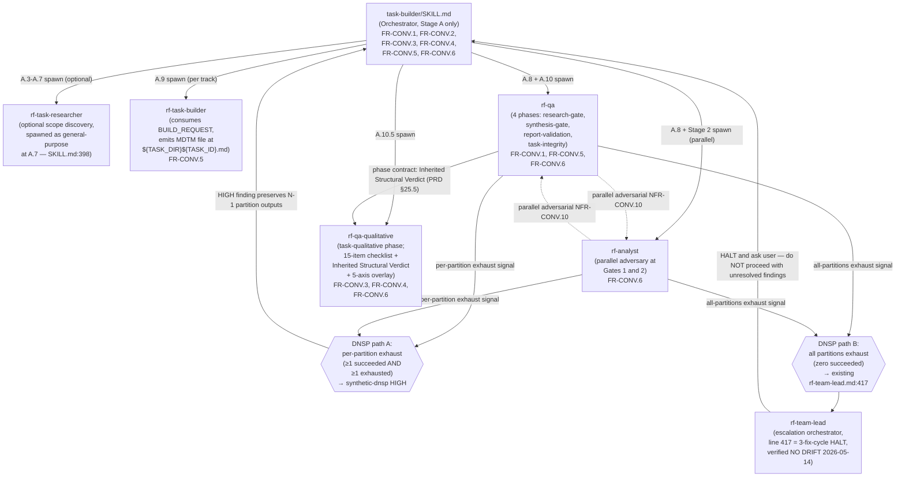
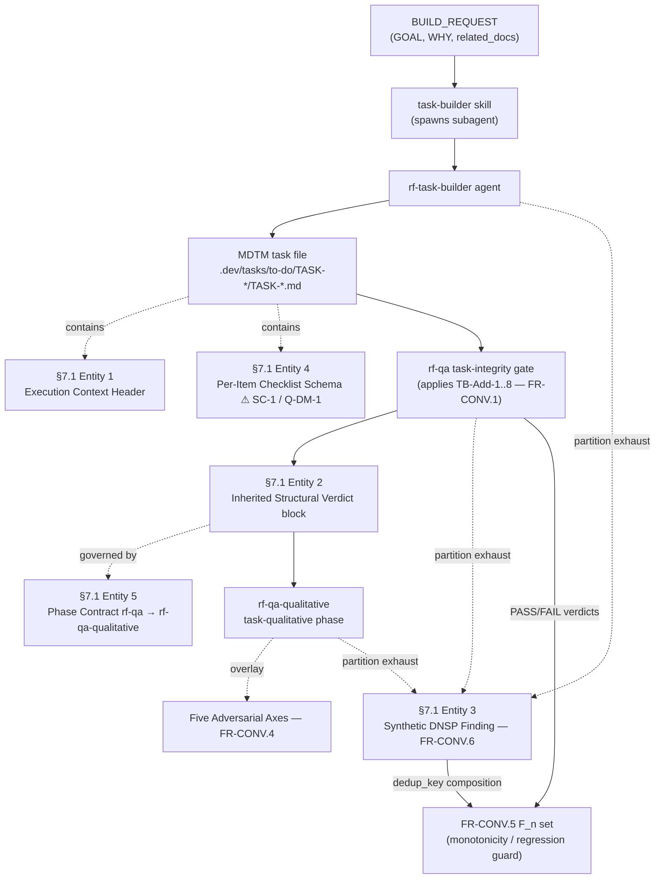

# Task-Builder Convergence v3.9 — Technical Design Document (TDD)

> **WHAT:** Technical Design Document specifying the architecture, data models, inter-agent contracts, and implementation specifications for the six-FR inverse-direction merge of `sc-tasklist` generation-time rigor mechanisms into the `task-builder` skill.
> **WHY:** Translates the product requirements (PRD v1.0) into an engineering specification the team builds against. Where the PRD defines *what* to build, this TDD defines *how* to build it.
> **HOW TO USE:** Engineers, architects, and QA stakeholders use this document to align on technical approach before implementation begins. Tier: **Heavyweight** — all 28 sections completed, conditional sections marked N/A-with-rationale rather than omitted.

### Tiered Usage

|Tier|When to Use|Sections Required|
|------|-------------|-------------------|
|**Lightweight**|Bug fixes, config changes, small features (<1 sprint)|1, 2, 3, 6.4, 21, 22|
|**Standard**|Most features and services (1-3 sprints)|All numbered sections; skip conditional sections marked *(if applicable)*|
|**Heavyweight**|New systems, platform changes, cross-team projects|All sections fully completed, including all conditional sections|

**This TDD: Heavyweight** — all 28 sections completed; conditional sections (§9, §10, §13.4, §14.6, §16, §25.3, §6.5) marked N/A-with-rationale; reduced sections (§11, §17, §26) scoped to the relevant dimension.

### Document Lifecycle Position

|Phase|Document|Ownership|Status|
|-------|----------|-----------|--------|
|Requirements|Product PRD (`PRD_TASK_BUILDER_CONVERGENCE.md` v1.0)|Product|✅ Complete|
|**Design**|**This TDD**|**Engineering**|**🟡 Draft**|
|Implementation|Technical Reference|Engineering|⬜ Not Started|

This TDD implements requirements from `.dev/releases/current/task-builder-merge/PRD_TASK_BUILDER_CONVERGENCE.md` Epics 1-3 (FR-CONV.1..6).


## Document Information

|Field|Value|
|-------|-------|
|**Component Name**|Task-Builder Convergence v3.9|
|**Component Type**|Internal Framework Skill|
|**Tech Lead**|TBD|
|**Engineering Team**|SuperClaude Core|
|**Maintained By**|task-builder maintainer|
|**Target Release**|v3.9|
|**Last Verified**|2026-05-14 against PRD v1.0 + 17 Phase-2 research files|
|**Status**|🟡 Draft|

### Approvers

|Role|Name|Status|Date|
|------|------|--------|------|
|Tech Lead|TBD|⬜ Pending||
|Engineering Manager|TBD|⬜ Pending||
|Architect|TBD|⬜ Pending||
|Security|TBD|⬜ Pending||


## Completeness Status

**Completeness Checklist:**
- [x] Section 1: Executive Summary — Complete
- [x] Section 2: Problem Statement & Context — Complete
- [x] Section 3: Goals & Non-Goals — Complete
- [x] Section 4: Success Metrics — Complete
- [x] Section 5: Technical Requirements — Complete
- [x] Section 6: Architecture — Complete
- [x] Section 7: Data Models — Complete
- [x] Section 8: API Specifications — Complete (adapted: inter-agent contracts)
- [x] Section 9: State Management — N/A with rationale
- [x] Section 10: Component Inventory — N/A with rationale
- [x] Section 11: User Flows & Interactions — Complete (Reduced: agent-operator)
- [x] Section 12: Error Handling & Edge Cases — Complete
- [x] Section 13: Security Considerations — Complete
- [x] Section 14: Observability & Monitoring — Complete
- [x] Section 15: Testing Strategy — Complete
- [x] Section 16: Accessibility Requirements — N/A with rationale
- [x] Section 17: Performance Budgets — Complete (Reduced: token-cost only)
- [x] Section 18: Dependencies — Complete
- [x] Section 19: Migration & Rollout Plan — Complete
- [x] Section 20: Risks & Mitigations — Complete
- [x] Section 21: Alternatives Considered — Complete
- [x] Section 22: Open Questions — Complete
- [x] Section 23: Timeline & Milestones — Complete
- [x] Section 24: Release Criteria — Complete
- [x] Section 25: Operational Readiness — Complete
- [x] Section 26: Cost & Resource Estimation — Complete (Reduced: LLM token-cost only)
- [x] Section 27: References & Resources — Complete
- [x] Section 28: Glossary — Complete
- [ ] All links verified — Pending QA
- [ ] Reviewed by SuperClaude Core Engineering — Pending

**Contract Table:**

|Element|Details|
|---------|---------|
|**Dependencies**|PRD v1.0, release-spec.md v1.0.0, conflict-register.md, invariant-probe.md|
|**Upstream**|Feeds from: PRD v1.0, 17 Phase-2 research files, 2 web-research files, FINAL-REPORT (v3.8)|
|**Downstream**|Feeds to: Technical Reference, per-FR implementation commits, synthetic-fixture test suite|
|**Change Impact**|Notify: rf-qa / rf-qa-qualitative / rf-analyst / rf-task-builder maintainers, task-builder maintainer|
|**Review Cadence**|Per-release (each major release)|


## Table of Contents

<!-- ToC regenerated at end of assembly from actual headers -->

1. [Executive Summary](#1-executive-summary)
2. [Problem Statement & Context](#2-problem-statement--context)
3. [Goals & Non-Goals](#3-goals--non-goals)
4. [Success Metrics](#4-success-metrics)
5. [Technical Requirements](#5-technical-requirements)
6. [Architecture](#6-architecture)
7. [Data Models](#7-data-models)
8. [API Specifications](#8-api-specifications)
9. [State Management](#9-state-management)
10. [Component Inventory](#10-component-inventory)
11. [User Flows & Interactions](#11-user-flows--interactions)
12. [Error Handling & Edge Cases](#12-error-handling--edge-cases)
13. [Security Considerations](#13-security-considerations)
14. [Observability & Monitoring](#14-observability--monitoring)
15. [Testing Strategy](#15-testing-strategy)
16. [Accessibility Requirements](#16-accessibility-requirements)
17. [Performance Budgets](#17-performance-budgets)
18. [Dependencies](#18-dependencies)
19. [Migration & Rollout Plan](#19-migration--rollout-plan)
20. [Risks & Mitigations](#20-risks--mitigations)
21. [Alternatives Considered](#21-alternatives-considered)
22. [Open Questions](#22-open-questions)
23. [Timeline & Milestones](#23-timeline--milestones)
24. [Release Criteria](#24-release-criteria)
25. [Operational Readiness](#25-operational-readiness)
26. [Cost & Resource Estimation](#26-cost--resource-estimation)
27. [References & Resources](#27-references--resources)
28. [Glossary](#28-glossary)


## 1. Executive Summary

**WHAT.** This release imports six strictly-additive functional requirements (FR-CONV.1..6) into the `task-builder` skill via an *intent-port* from `sc-tasklist` — adopting the *intent* of proven sc-tasklist mechanisms while re-expressing them in task-builder's idiom rather than copying code. Per the G6 four-case conflict rule (PRD §5), four FRs are CASE-D adopt-adapted ports (PR-06→FR-CONV.1, PR-01→FR-CONV.2, PR-07→FR-CONV.4, PR-02→FR-CONV.5 — each with a conflict-register row naming the conflicting mechanism and protected invariant) and two are CASE-B silent-adopt ports (PR-04→FR-CONV.3, PR-03→FR-CONV.6 — no conflict, no register row). **6 FRs (FR-CONV.1..6) land in v3.9; PR-05 (Tier-History Advisory) is DEFERRED to Phase-2 and is NOT an FR in this release.**

**WHY.** The six FRs close three structural-rigor gaps in the pre-merge task-builder gate topology: no task-level executor-readability summary, no structural gate checks for placeholder/DAG/granularity/format consistency, and an implicit inherited-verdict passthrough between rf-qa and rf-qa-qualitative that risks rubber-stamping. They also attack the oscillation cost surfaced empirically in FINAL-REPORT §6.2 F2 — a 21-retry / 18-batch oscillation loop with silent partition-agent exhaust — by adding monotonicity halt conditions and a synthetic Do-Not-Silently-Pass (DNSP) finding.

**HOW.** Delivery is governed by strictly-additive A-002 governance: no existing rf-qa check is renamed, renumbered, or removed (PRD §2 FR-CONV.1 negative criterion); each FR has per-FR rollback granularity (a single revertable append line per K-001/K-005); the G6 four-case rule classifies every proposal; and five load-bearing invariants — self-contained-item, evidence-bound-item, persistent-`.dev/tasks/`-artifact, zero-trust QA, parallel-research — are preserved and provable via NFR-CONV.6..10 fixtures. One synthesis-time contradiction is carried forward: PRD §25.4 asserts the per-item 5-field schema `{Description, Context, Acceptance, Confidence, Verification}` is "preserved unchanged" at `SKILL.md:1452-1457`, but that range currently holds a different `{Context, Action, Output, Verification, Completion gate}` phase-template. This is forwarded to §22 Open Questions (Q-DM-1) for Engineering Lead resolution and must not be silently resolved at synthesis time.

**Key Deliverables:**
- **Six FRs landing in strict serial order:** PR-06 (FR-CONV.1) → PR-01 (FR-CONV.2) → PR-04 (FR-CONV.3) → PR-07 (FR-CONV.4) → PR-02 (FR-CONV.5) → PR-03 (FR-CONV.6).
- **NFR-CONV.6..10 invariant preservation** provable on synthetic fixtures — every invariant maps to a falsifiable pass/fail fixture.
- **`make verify-sync` PASS after each FR merge** — all FRs touch `src/superclaude/` paths exclusively; sync-discipline (A-001) enforced per merge (K-009).


## 2. Problem Statement & Context

### 2.1 Background

Pre-merge, task-builder runs a **four-stage gate topology** (research-gate / synthesis-gate / report-validation / task-integrity / qualitative, with per-gate fix-cycle caps in `rf-task-builder.md` I16 lines 352-358, NOT in `rf-qa.md`). The task-integrity gate (rf-qa A.10) carries a **9-item checklist** (`SKILL.md:~898-906`, mirrored as a 15-item validation block at `SKILL.md:~1491-1507`). The downstream rf-qa-qualitative adversarial pass uses a **generic adversarial stance** with no named-axis annotation. Retry loops have **no monotonicity halt** — a fix cycle that fails to shrink the failure set simply re-runs. Partition agents (rf-analyst / rf-qa cohorts) **silently exhaust** their escalation ladder, aborting the gate without surfacing a finding.

### 2.2 Problem Statement

**The core problem:** task-builder's gate enforces evidence and zero-trust QA at the *item* level but lacks task-level structural rigor, an explicit inter-agent verdict channel, and retry-loop convergence guards — letting structural defects, rubber-stamp passthrough, and oscillating retry loops escape or burn fix-cycles.

- **Gap A — no task-level executor-readability summary.** Generated MDTM files have per-item context but no task-level `## Execution Context` header (References / Source areas / Key constraints), so an executor cannot orient without reading every item.
- **Gap B — no structural gate checks.** rf-qa A.10 has no checks for placeholder/title-only items, circular dependencies (DAG), granularity (XL items lacking subtasks), or Confidence/Verification format consistency.
- **Gap C — implicit inherited-verdict passthrough.** rf-qa's task-integrity verdict reaches rf-qa-qualitative only implicitly; without an explicit `## Inherited Structural Verdict` block plus a Self-Audit obligation, rf-qa-qualitative risks rubber-stamping rf-qa PASS items as semantically VERIFIED (K-003 inflation risk).
- **Gap D — silent partition exhaust + retry oscillation.** Partition-agent escalation-ladder exhaust aborts silently; retry loops have no halt-on-regression / halt-on-non-shrink condition. Empirical evidence: a 21-retry / 18-batch oscillation loop (FINAL-REPORT §6.2 F2).

### 2.3 Business Context

The release is scoped against the Reference Platform PRD.

- **Product PRD Reference:** `.dev/releases/current/task-builder-merge/PRD_TASK_BUILDER_CONVERGENCE.md` v1.0, Epics 1-3 (FR-CONV.1..6).
- **Business Impact:** The dominant cost driver is the **token-cost ceiling: ≤10% increase** over the pre-merge task-builder baseline per equivalent BUILD_REQUEST (NFR-CONV.4, PRD §3). All gate additions are local checks using only existing tooling (Read, Grep, Glob, Bash) with no new external dependencies or synchronous network calls (NFR-CONV.5), keeping wall-clock impact bounded.
- **User Impact:** The "user" is an agent-operator invoking the task-builder skill. Improved structural rigor reduces silent-acceptance defects and oscillation cost in generated MDTM task files.


## 3. Goals & Non-Goals

### 3.1 Goals

What this component WILL accomplish:

|ID|Goal|Success Criteria|
|----|------|------------------|
|**G1** (FR-CONV.1)|Append 8 structural checks (TB-Add-1..8) to rf-qa A.10 + 15-item validation block|Each TB-Add-1..8 fires a distinct, item-ID-naming error on violation; TB-Add-1/3/4/5/6/7/8 block the gate; TB-Add-2 emits `[ADVISORY]` and does not block (PRD §2)|
|**G2** (FR-CONV.2)|Insert task-level `## Execution Context` header in generated MDTM files|Header renders exactly 3 labeled lines (References / Source areas / Key constraints); minimal BUILD_REQUEST degrades to References-only with WHY/source-area lines explicitly omitted (PRD §2 FR-CONV.2)|
|**G3** (FR-CONV.3)|Inject `## Inherited Structural Verdict` block + Self-Audit obligation into rf-qa-qualitative spawn|Spawn prompt carries rf-qa verdict table verbatim; rf-qa-qualitative emits a `## Self-Audit` entry on first 5 runs listing relied-on PASS items AND ≥1 semantic check where PASS is insufficient (INV-019, K-003)|
|**G4** (FR-CONV.4)|Insert "Five Adversarial Axes" overlay before the 15-item task-qualitative checklist|Items Reviewed table `axis` column populated from {drift, contradictions, omissions, weakened-criteria, invented-content, none}; `drift-axis-inactive` annotation emitted when no item captures BUILD_REQUEST.GOAL baseline (PRD §2 FR-CONV.4)|
|**G5** (FR-CONV.5)|Add monotonicity + regression halt guards to existing retry loops|`[HALT-MONOTONICITY]` fires when `|F_{n+1}|>=|F_n|`; regression halt fires (precedence over monotonicity) when an item PASS@N is FAIL@N+1; dedup-key synthetic findings do not trigger regression halt (INV-012); all halt fixtures pass|
|**G6** (FR-CONV.6)|Emit synthetic-dnsp HIGH finding on partition escalation-ladder exhaust|5-field finding emitted with dedup-key `(assigned_files_range, escalation_ladder_exhaust_point)`; identical dedup-keys collapse with `found N times`; all-agents-fail guard preserved — zero synthetic emits, existing `rf-team-lead.md:417` escalation runs|
|**G7** (overall)|Preserve all 5 load-bearing invariants|NFR-CONV.6..10 synthetic fixtures PASS — every invariant has a falsifiable fail-closed fixture|

### 3.2 Non-Goals

What this component will NOT do (explicit scope boundaries):

|ID|Non-Goal|Rationale|
|----|----------|-----------|
|**NG1**|Bulk-port all 17 sc-tasklist gate checks|REJECTED per CB-3 — per-check classification only, not bulk import|
|**NG2**|Modify tier selection based on historical pattern (X-004)|REJECTED — hidden-input determinism guard (NFR-CONV.3) forbids it|
|**NG3**|Replace rf-qa-qualitative's existing 15-item checklist (X-002)|REJECTED — axes annotate, they do not substitute|
|**NG4**|PR-05 Tier-History Advisory|DEFERRED to Phase-2 per release-spec §2.1|
|**NG5**|Roadmap regeneration / downstream tasklist generation|Out of scope — this release touches task-builder gate behavior only|
|**NG6**|Any structural change to `.dev/tasks/` directory layout|Out of scope — INV-018 / persistent-`.dev/tasks/`-artifact invariant held inviolate|

### 3.3 Future Considerations

Items deferred to future iterations (PRD §12.3):

|Item|Target Phase|Notes|
|------|--------------|-------|
|PR-05 re-evaluation|Phase 2|Trigger when `.dev/tasks/done/TASK-RF-*` reaches ≥10 tasks spanning ≥3 distinct task_types (OPEN-PR05)|
|TB-Add-2 calibration|Phase 2|Item-count bounds (≥3 / ≤40 track / ≤50 single-track) stay `[ADVISORY]` until an empirical calibration sweep on `.dev/tasks/done/` produces thresholds (OPEN-INV-006)|
|`.dev/tasks/` layout versioning|Phase 2|Layout-change contract; if the directory layout changes, all 7 proposals require re-integration (OPEN-INV-018)|


## 4. Success Metrics

### 4.1 Technical Metrics

|Metric|Current State|Target|Measurement Method|
|--------|---------------|--------|-------------------|
|Single-pass gate PASS rate|≥80%|↑ post-merge|Fraction of BUILD_REQUESTs passing task-integrity gate on first cycle|
|Placeholder-defect detection rate|n/a (no check pre-merge)|100% on synthetic fixtures|TB-Add-1 fires on every placeholder/title-only fixture item|
|DAG-cycle detection rate|n/a (no check pre-merge)|100% on synthetic fixtures|TB-Add-4 fires on every circular-dependency fixture|
|Self-Audit coverage post-FR-CONV.3|n/a|100% on first 5 runs|Every rf-qa-qualitative run carries a `## Self-Audit` entry (K-003 audit target, OPEN-X-002)|
|`[HALT-MONOTONICITY]` emission rate|n/a|<10%|>50% emission rate alerts upstream BUILD_REQUEST defect, not a guard defect|
|Synthetic-dnsp emission count|n/a|≥1 on twice-exhaust fixture; 0 on healthy run|Inject twice-timeout partition fixture → ≥1 finding; healthy run → 0|

### 4.2 Business Metrics

|Business KPI|Proxy Metric (Engineering)|Instrumentation|Target|
|--------------|---------------------------|-----------------|--------|
|Generation-cost efficiency|Token-cost ratio post-merge / pre-merge|Total token count over 5 representative BUILD_REQUESTs|**≤1.10** (NFR-CONV.4; OPEN-TOKEN empirical post-merge; contingency K-010 = FR-CONV.3 verdict-table summarisation if exceeded)|
|Gate convergence health|Fix-cycle convergence rate|Fraction of fix-cycle sequences converging to gate PASS rather than hitting the per-gate cap or a monotonicity halt|≥75% baseline, expected ↑ post-merge|

> **Note:** Alert thresholds for the metrics above are reconciled across §14.2 (Metrics) and §19.3 (Rollout Stages) — the `[HALT-MONOTONICITY]` >50% threshold and the synthetic-dnsp >0 threshold are stated once per metric and cross-referenced, not redefined.


## 5. Technical Requirements

This section specifies the functional (§5.1) and non-functional (§5.2) requirements for Task-Builder Convergence v3.9 — six FRs (FR-CONV.1..6) landing in strict serial order **PR-06 (FR-CONV.1) → PR-01 (FR-CONV.2) → PR-04 (FR-CONV.3) → PR-07 (FR-CONV.4) → PR-02 (FR-CONV.5) → PR-03 (FR-CONV.6)**, plus ten NFRs of which NFR-CONV.6..10 are load-bearing invariant-preservation guarantees.

> **Line-citation discipline:** All `file:line` citations below are current-verified as of 2026-05-14. The zero-trust verdict definitions are cited at `rf-qa.md:141-142` (heading at :144). The rf-qa 20-item checklist items span `rf-qa.md:268-287` (sub-header at :266). `rf-team-lead.md:417` is **NO DRIFT** — the line-414 hypothesis was wrong.

### 5.1 Functional Requirements

All six FRs are **Must Have (P0)** — Phase-1 release scope per PRD §21.1.1 Epics 1-3. PR-05 (Tier-History Advisory) is **DEFERRED to Phase-2** and is out of scope here.

|ID|Requirement|Priority|Acceptance Criteria (Given/When/Then)|
|----|-------------|----------|----------------------------------------|
|**FR-CONV.1**|Append 8 structural checks (TB-Add-1..8) to rf-qa's task-integrity gate, mirrored across all three definition surfaces (rf-qa.md 20-item checklist, SKILL.md A.10 9-item block, SKILL.md 15-item validation block). CASE D. Protected invariant: **zero-trust QA**.|Must Have|**Given** a generated MDTM task file is submitted to rf-qa A.10, **when** any of TB-Add-1/3/4/5/6/7/8 detects a violation, **then** that check emits a distinct item-ID-naming error and the gate verdict is FAIL; **when** TB-Add-2 detects an out-of-bounds item count, **then** it emits an `[ADVISORY]`-prefixed message and does **not** block the gate. *Verification:* `grep -nE "TB-Add-[1-8]"` returns ≥3 hits per ID across the three definition sites — **rf-qa.md:268-287** (items 1-20, sub-header at :266), **SKILL.md:~898-906** (9-item A.10 block, append point after line 906), **SKILL.md:~1491-1507** (15-item validation block). A synthetic fixture with one placeholder-titled item runs rf-qa and TB-Add-1 fires in the gate log. *Negative:* No existing rf-qa check is renamed, renumbered, or removed; the 9-item, 15-item, and 20-item existing items are preserved verbatim; bundle-specific `/sc:tasklist` checks (phase-file naming, checkpoint emission, R-### roadmap traceability) MUST NOT appear in any TB-Add. **TB-Add catalogue:** TB-Add-1 placeholder scan (Hard); TB-Add-2 item-count bounds ≥3/≤40-track/≤50-single-track (`[ADVISORY]` until OPEN-INV-006 calibration); TB-Add-3 clarification adjacency (Hard); TB-Add-4 circular-dependency DAG check (Hard); TB-Add-5 granularity / XL-has-subtasks (Hard); TB-Add-6 Confidence/Verification format consistency (Hard); TB-Add-7 Execution-Context source-areas reappear in items (Hard); TB-Add-8 per-item Context field has ≥1 file:line citation OR justified-absence comment — resolves INV-015 (Hard).|
|**FR-CONV.2**|Insert a task-level `## Execution Context` block in generated MDTM task files (after frontmatter, before checklist) with exactly three labeled lines: References / Source areas / Key constraints. CASE D. Protected invariant: **evidence-bound-item**.|Must Have|**Given** a BUILD_REQUEST with GOAL + WHY + related_docs, **when** rf-task-builder generates the task file, **then** it emits a `## Execution Context` block with exactly three labeled lines (`References:` / `Source areas:` / `Key constraints:`) placed after `## Prerequisites & Dependencies` and before the `## Phase 1` checklist; **when** the BUILD_REQUEST is minimal (GOAL only), **then** the block degrades to References-only with the other two lines explicitly omitted. *Verification:* `grep -n "## Execution Context" <generated-task-file>` returns line N; the next 10 lines contain ≥1 of `References:`/`Source areas:`/`Key constraints:`; `grep -E "src/|/.*:[0-9]+" <header-block-range>` returns **zero hits**. *Insertion sites:* primary template at **SKILL.md:1407-1487**; BUILD_REQUEST prompt guidance near **SKILL.md:715-725**; `## Execution Overview` header at **SKILL.md:~139**; tier-aware header policy at `## Tier Selection` **SKILL.md:~86**. *Negative:* per-item Context fields MUST retain file:line citations OR justified-absence comments (validated by TB-Add-8); the per-item self-contained 5-field schema MUST NOT be altered or supplemented by header content.|
|**FR-CONV.3**|Inject rf-qa's task-integrity verdict table verbatim into rf-qa-qualitative's spawn prompt under `## Inherited Structural Verdict`, with the directive "PASS items machine-verified — skip structural re-checking; FAIL items machine-verified defects — flag HIGH. Focus on semantic quality." Add a `## Self-Audit` section to rf-qa-qualitative's output schema. CASE B. Invariant alignment: **zero-trust QA**.|Must Have|**Given** rf-qa A.10 has emitted a task-integrity verdict, **when** the orchestrator spawns rf-qa-qualitative at A.10.5, **then** the spawn prompt contains `## Inherited Structural Verdict` with the rf-qa Items Reviewed table copied byte-for-byte plus the directive; **when** a fix-cycle re-run occurs, **then** the orchestrator re-reads and re-injects the NEW (cycle-N) verdict — stale verdicts forbidden (INV-002); **when** rf-qa-qualitative runs, **then** its output contains a `## Self-Audit` section listing relied-on rf-qa PASS items AND ≥1 semantic check where rf-qa PASS is insufficient (INV-019). *Verification:* `grep -n "## Inherited Structural Verdict" <spawn-log>` returns line N and the block below diffs identically against `${TASK_DIR}qa/qa-task-integrity.md`. *Insertion sites:* **SKILL.md:923-1000** (A.10.5 spawn prompt; injection at ~:966); **rf-qa-qualitative.md:794** (EOF — append "Handling the Inherited Structural Verdict" section + add `## Self-Audit` to output schema). *Negative:* rf-qa-qualitative MUST NOT mark any item VERIFIED solely from the inherited verdict; the anti-inflation rule at **rf-qa-qualitative.md:766-775** (Prohibited Behaviors header :766; anti-inflation bullet :770) MUST NOT be weakened, removed, or rephrased.|
|**FR-CONV.4**|Insert a `### Five Adversarial Axes` header subsection BEFORE rf-qa-qualitative's existing 15-item task-qualitative checklist, and add an `axis` column to the Items Reviewed table. Five axes: drift / contradictions / omissions / weakened-criteria / invented-content (plus `none` sentinel). CASE D. Protected invariant: **zero-trust QA**.|Must Have|**Given** rf-qa-qualitative runs the task-qualitative phase, **when** it produces output, **then** a `### Five Adversarial Axes` subsection renders BEFORE the 15-item checklist heading and the Items Reviewed table carries a populated `axis` column with one canonical value per row from {drift, contradictions, omissions, weakened-criteria, invented-content, none}; **when** no checklist item restates BUILD_REQUEST.GOAL verbatim, **then** the report emits a single-line `drift-axis-inactive` annotation in the Summary block. *Verification:* `grep -n "### Five Adversarial Axes" src/superclaude/agents/rf-qa-qualitative.md` returns ≥1 match. *Insertion sites:* 15-item checklist body at **rf-qa-qualitative.md:527-583** (body MUST be unmodified; header inserts before `#### Checklist (15 items)`); Items Reviewed table (axis column site) at **rf-qa-qualitative.md:675-714** (insert `axis` column between `Check` and `Result`); axis-annotation directive in SKILL.md Task-Qualitative prompt at **SKILL.md:961**. *Negative:* the existing 15-item checklist MUST NOT be removed, reordered, renamed, or replaced; the severity floor at **rf-qa-qualitative.md:786-795** (multi-line: "Contradictions are always IMPORTANT or CRITICAL", reinforced by items 9-10) MUST NOT be weakened; no axis introduces a new conditional code path (overlay-only).|
|**FR-CONV.5**|Add two stop-conditions to the EXISTING fix-cycle retry loops (no new loop or stage): (1) Monotonicity guard — HALT if `|F_{n+1}|>=|F_n|`; (2) Regression detection — HALT if any item PASS at cycle N is FAIL at cycle N+1. Precedence: **Regression > monotonicity**. CASE D. Protected invariant: **zero-trust QA**.|Must Have|**Given** a fix-cycle transition N→N+1, **when** any item that held PASS at cycle N flips to FAIL at cycle N+1, **then** the loop emits the verbatim message `Regression detected on Item X.Y — previously PASS at cycle N, now FAIL. Halt overrides monotonicity check.` and exits BEFORE the monotonicity check; **when** no regression but `|F_{n+1}|>=|F_n|`, **then** the loop emits `[HALT-MONOTONICITY]|F|=<n>` and exits; **when** a synthetic-dnsp finding with identical dedup-key appears in both cycles N and N+1, **then** no halt fires (dedup recognized, not a regression). *Verification:* a 3-cycle fixture with `|F|=5,5,5` halts at cycle 2 with `[HALT-MONOTONICITY]|F|=5`; a 2-cycle fixture with Item 2.3 PASS@1/FAIL@2 halts with the verbatim regression message regardless of `|F_2|<|F_1|`. *Insertion sites:* **SKILL.md:867-873** (A.9 separate-counters invariant tail); **SKILL.md:1547-1553** (Behavioral Constraints hard-invariants list); **rf-task-builder.md:334-361** (QA-gate fix-cycle encoding table); **rf-qa.md:~308-315** (Fix Cycle Protocol Rules; the existing SHOULD bullet is promoted to a MUST-halt). *Negative:* legitimate slow-cycle correction MUST NOT be halted — any cycle where `|F|` strictly shrinks continues; the four independent retry counters MUST NOT be collapsed; no halt-on-slow-convergence threshold is permitted (X-003 REJECTED). The existing 3-cycle hard cap at **rf-team-lead.md:417** and the per-gate fix-cycle table at **rf-task-builder.md:354-360** are preserved unchanged.|
|**FR-CONV.6**|After a partition agent's entire escalation ladder exhausts (rf-analyst, rf-qa, or rf-qa-qualitative partition instance), emit a synthetic HIGH-severity finding (`source: "synthetic-dnsp"`) into the agent's output stream rather than silently aborting the gate. Dedup key: `(assigned_files_range, escalation_ladder_exhaust_point)`. CASE B. Invariant alignment: **zero-trust QA + evidence-bound-item + parallel-research**.|Must Have|**Given** ≥1 partition agent succeeded AND ≥1 partition agent's escalation ladder exhausted, **when** the exhaust occurs, **then** the exhausted agent emits a JSON-or-block finding with all 5 fixed fields (`severity: HIGH`, `source: "synthetic-dnsp"`, `affected_range`, `evidence`, `recommendation: "Manual review required — partition agent failed twice"`) plus `dedup_key` and `found_n_times`; **when** two synthetic findings share an identical dedup-key, **then** they collapse into one record with a `found N times` note; **when** zero partition agents succeeded, **then** NO synthetic emits and the existing all-agents-fail escalation runs. *Verification:* a twice-timeout partition fixture produces a synthetic-dnsp finding with all 5 fields; two identical-exhaust events collapse to one finding with `found N times`; `grep -n "synthetic-dnsp" src/superclaude/agents/rf-analyst.md src/superclaude/agents/rf-qa.md` returns ≥1 hit per file. *Insertion sites:* **SKILL.md:572-656** (A.8 Research Quality Gate); **SKILL.md:870-918** (A.10 Task File Validation); **rf-analyst.md:58-71**, **rf-qa.md:49-77** (partition protocol + DNSP edit site :70-77), **rf-qa-qualitative.md:70-80**. *Negative:* synthetic-dnsp MUST NOT emit before the escalation ladder exhausts; the existing escalation at **rf-team-lead.md:417** MUST NOT be replaced or short-circuited — **this line is current-verified with NO DRIFT**; synthetic findings MUST NOT mask real findings (HIGH severity ensures gate visibility); the dedup-key collapse MUST NOT cross-cycle (INV-012).|

**Cross-FR dependency chain:** FR-CONV.1 (first-mover, zero outbound deps) → FR-CONV.2 (depends on TB-Add-7/8 live) → FR-CONV.3 (depends on TB-Add catalogue for INV-010 dynamic enumeration + TB-Add-7 cross-validation) → FR-CONV.4 (depends on FR-CONV.3 inherited-PASS composition INV-013 + FR-CONV.1 GOAL plumbing) → FR-CONV.5 (depends on FR-CONV.1 `F_n` count + FR-CONV.6 synthetic-dnsp dedup-key shape) → FR-CONV.6 (depends on FR-CONV.5 monotonicity to consume the dedup-key). The FR-CONV.5 ↔ FR-CONV.6 mutual reference is resolved by landing order: FR-CONV.5 lands 5th specifying the dedup-key *shape it will consume*; FR-CONV.6 lands 6th *emitting* that shape.

### 5.2 Non-Functional Requirements

This is a **generation-time skill** (task-builder), not a runtime service. RPS / latency / MTTR / MTBF rows are N/A and are replaced with token-cost ratio, Determinism SLOs, and invariant-preservation guarantees.

#### 5.2.1 Performance Requirements

|NFR|Requirement|Target|Measurement|
|-----|-------------|--------|-------------|
|**NFR-CONV.4**|Token-cost ratio (post-merge / pre-merge) per equivalent BUILD_REQUEST|**≤1.10**|Sample 5 representative BUILD_REQUESTs covering Quick/Standard/Deep tiers; record pre-merge and post-merge total token counts; compute ratio. OPEN-TOKEN tracks empirical measurement post-merge. Contingency K-010: if exceeded, profile per-FR contribution and summarise the FR-CONV.3 Inherited Structural Verdict table rather than emit it verbatim.|
|**NFR-CONV.5**|Wall-clock impact: no new external dependencies, no synchronous network calls added; gate additions are local checks|Diff inspection shows only existing tools (Read, Grep, Glob, Bash) used|Inspect the rf-qa.md and SKILL.md diffs for any new tool invocation beyond the four-tool set; reject the diff if any new external dep or synchronous network call appears.|

(RPS, latency, throughput rows omitted — N/A for a generation-time skill.)

#### 5.2.2 Reliability Requirements

|NFR|Requirement|Target|Measurement|
|-----|-------------|--------|-------------|
|**NFR-CONV-R1**|Single-pass gate PASS rate (baseline)|**≥80%** of representative BUILD_REQUESTs PASS the task-integrity gate on the first cycle|Run the 5 representative BUILD_REQUESTs; count first-cycle PASS verdicts. Failures route through the FR-CONV.5 fix-cycle protocol.|
|**NFR-CONV.3**|Hidden-input determinism (per FR §6.2 F4)|Fixture-populated `.dev/tasks/done/` produces byte-identical structural output to empty `.dev/tasks/done/`|Run task-builder against an identical BUILD_REQUEST with `.dev/tasks/done/` (a) empty and (b) populated with 10+ historical tasks of ≥3 distinct task_types; diff the structural output fields; structural fields must be byte-identical. **PR-05 advisory mechanism is REJECTED for Phase-1.**|

(MTTR / MTBF / availability rows omitted — N/A for generation-time skill.)

#### 5.2.3 Determinism SLOs

|NFR|Determinism scope|Target|Measurement|
|-----|-------------------|--------|-------------|
|**NFR-CONV.1**|Structural fields — gate outputs deterministic|TB-Add-1..8 PASS/FAIL verdicts, synthetic-dnsp 5 fixed fields + dedup-key, axis column values, Items Reviewed table structure are **byte-identical** across two runs on the same BUILD_REQUEST + source tree|Re-run task-builder on identical BUILD_REQUEST twice; diff the rf-qa A.10 verdict table and the rf-qa-qualitative Items Reviewed table; all structural fields must be byte-equal.|
|**NFR-CONV.2**|Research-driven prose — explicitly excluded from determinism scope|Per-item Context prose and rf-qa-qualitative semantic-check prose remain LLM-research-driven; byte-equality is **not** required|Diff prose between two runs; non-byte-equality is acceptable. Structural annotations within prose (axis labels, finding counts, dedup-keys) MUST remain byte-equal.|

#### 5.2.4 Security Requirements

This is an internal generation-time framework. The security model is minimal and is operationalised as **invariant preservation** rather than authn/authz/encryption.

|Requirement|Statement|
|-------------|-----------|
|**No new data collection / storage / transmission**|NFR-CONV.5 forbids new external deps and synchronous network calls; no new data sinks introduced.|
|**Anti-inflation rule preservation**|The anti-inflation rule at **rf-qa-qualitative.md:766-775** (Prohibited Behaviors items + Tool Engagement Minimum) MUST NOT be weakened, removed, or rephrased by FR-CONV.3. The load-bearing bullet is the anti-inflation rule at :770. FR-CONV.3's inherited verdict is a deliberately-scoped RELIANCE channel for **structural** items only; semantic items continue to require independent tool calls.|
|**Five load-bearing invariants ARE the security model**|self-contained-item, evidence-bound-item, persistent-`.dev/tasks/`-artifact, zero-trust QA, parallel-research are preserved by the NFR-CONV.6..10 acceptance fixtures (§5.2.5). A regression in any invariant surfaces as a gate failure rather than silent drift.|

#### 5.2.5 Invariant Preservation (NFR-CONV.6..10)

|NFR|Invariant|Operational source (current-verified file:line)|Fixture / Pass-Fail Behavior|
|-----|-----------|-------------------------------------------------|-------------------------------|
|**NFR-CONV.6**|self-contained-item|**SKILL.md:~1452-1457** (5-field per-item schema). **SC-1 OPEN (Q-DM-1):** PRD §25.4 declares the schema is `{Description, Context, Acceptance, Confidence, Verification}` but current SKILL.md:1450-1460 reads `{Context, Action, Output, Verification, Completion gate}`. Escalated to §22 Open Question Q-DM-1 — Engineering Lead decision required. The fixture targets *whichever schema lands*.|Synthetic fixture with all 5 fields populated **PASSES** all 8 TB-Add checks; same fixture with one field stripped **FAILS** TB-Add-1 (fails closed).|
|**NFR-CONV.7**|evidence-bound-item|**SKILL.md:1530 rule #2** ("Evidence-based claims only. Every finding must cite actual file paths, line numbers, function names...")|Three-fixture triple: (a) `Context: src/foo` (bare, no `:N`) → **FAILS** TB-Add-8; (b) `Context: src/foo:42` → **PASSES**; (c) `Context: <none — pure refactor> [justified-absence]` → **PASSES**.|
|**NFR-CONV.8**|persistent-`.dev/tasks/`-artifact|OPEN-INV-018 / `SKILL.md:1536 rule #5` ("Preserve research artifacts...persist after the task file is built"). Convention-bound; no single line number.|Diff the `.dev/tasks/<task-id>/` directory layout pre-merge vs post-merge. **PASS** when zero structural changes occur: no new mandatory subdirectory, no rename of `research/`/`qa/`/`synthesis/`/`reviews/`/`adversarial/`, no naming-pattern change.|
|**NFR-CONV.9**|zero-trust QA|**rf-qa.md:141-142** (verbatim PASS/FAIL definitions; surrounding heading at :144). Verbatim: `**PASS** — All checks pass, no gaps of any severity. … **FAIL** — Any gaps exist (CRITICAL, IMPORTANT, or MINOR). … ALL gaps must be resolved before proceeding — no severity level is exempt.`|Two-part fixture: (a) 1-LOW-finding fixture → gate **FAILS**; (b) FR-CONV.3 inherited-verdict applied to a task file → no item is marked VERIFIED unless the Self-Audit lists an independent semantic-check engagement.|
|**NFR-CONV.10**|parallel-research|**rf-qa.md:49-77** (Parallel Partitioning) + **rf-qa-qualitative.md:50-82** (identical Parallel Partitioning). INV-021: DNSP fires within-agent-instance.|Spawn-log inspection fixture: **N partition agents spawn concurrently** (timestamp overlap proves concurrency); on one agent's escalation exhaust, **N-1 partitions continue to completion** before that one synthesises a DNSP finding. **FAIL** if the cohort serialises or DNSP fires cross-cohort.|

**Cross-coverage check:** Every UNADDRESSED-MEDIUM finding from the Round-2.5 invariant probe (INV-002, INV-010, INV-012, INV-015) is routed through ≥1 FR Negative Criterion in §5.1, so a regression manifests as a gate failure rather than silent invariant drift. Coverage matrix: self-contained-item (FR-CONV.2 negative); evidence-bound-item (FR-CONV.1 TB-Add-8 + FR-CONV.2 negative); persistent-artifact (FR-CONV.3 read-target stability); zero-trust QA (FR-CONV.1/3/4/5/6 negatives — 4-of-6 coverage); parallel-research (FR-CONV.6 negative). No invariant is uncovered.


## 6. Architecture

### 6.1 High-Level Architecture

The Task-Builder Convergence v3.9 release modifies an existing single-stage orchestration pipeline. The `task-builder` SKILL.md is the orchestrator (Stage A only — there is no Stage B; `SKILL.md:12, 141`). It is fed a `BUILD_REQUEST` contract by the `/tdd` skill orchestrator (or invoked standalone), runs the A.1–A.11 pipeline, and emits a validated MDTM task file. The six FR-CONV functional requirements are **strictly additive** insertions onto this existing topology (A-002 governance) — no existing pipeline stage, agent, or checklist item is renamed or removed.

The diagram below shows the orchestration, the four sequential adversarial gates, the agents that run each gate, the `rf-team-lead` escalation guard, and the six FR-CONV insertion-point annotations.

```
              /tdd skill orchestrator  ──┐
                                         │  emits Skill-tool prompt
                                         ▼
              ┌─────────────────────────────────────────────────────┐
              │  BUILD_REQUEST  (input contract)                    │
              │  15 fields: GOAL, WHY, TASK_ID_PREFIX, TEMPLATE,    │
              │  QA_GATE_REQUIREMENTS, VALIDATION_REQUIREMENTS,     │
              │  TESTING_REQUIREMENTS, DOC STALENESS WARNINGS,      │
              │  RESEARCH DIR, QUALITY GATE RESULTS, OPEN QUESTIONS,│
              │  REMAINING GAPS, granularity req, incremental-write │
              │  block, TASK FILE LOCATION   (SKILL.md:716-848)     │
              └─────────────────────────────────────────────────────┘
                                         │
                                         ▼
   ┌──────────────────────────────────────────────────────────────────────┐
   │  task-builder SKILL.md  —  ORCHESTRATOR  (Stage A, A.1-A.11)          │
   │  A.1 Resume detect   A.2 Parse & triage   A.3 Scope discovery         │
   │  A.4 Write research-notes.md   A.5 Self-Review Gate (max 2 rounds)    │
   │  A.6 Template triage   A.7 Spawn researchers (3-8, parallel)          │
   │                                                                      │
   │   ◄── [FR-CONV.2]  Execution Context header — inserted at MDTM       │
   │        template top + builder-spawn anchor SKILL.md:715-725;         │
   │        scope-confined "no speculative file paths" (header only)      │
   └──────────────────────────────────────────────────────────────────────┘
                                         │
                                         ▼
   ┌──────────────────────────────────────────────────────────────────────┐
   │  A.9  SPAWN rf-task-builder  (one per track, BUILD_REQUEST consumer)  │
   │  Emits MDTM file ${TASK_DIR}${TASK_ID}.md (incremental write)         │
   │  3 return flows: RESEARCH_NEEDED (max 2) · MALFORMED (max 2,          │
   │  separate counter) · NEED_USER_INPUT → Open Questions                │
   │  Combined max invocations = 4   (SKILL.md:852-870, 1550)             │
   │                                                                      │
   │   ◄── [FR-CONV.5]  Retry monotonicity — rf-task-builder.md:334-361   │
   │        I16 fix-cycle table + two new HALTs:                          │
   │        |F_{n+1}| >= |F_n|  HALT  ·  PASS@N → FAIL@N+1  HALT          │
   └──────────────────────────────────────────────────────────────────────┘
                                         │
       ════════════════ 4-STAGE ADVERSARIAL GATE TOPOLOGY ════════════════
                                         │
   ┌──────────────────────────────────────────────────────────────────────┐
   │  STAGE 1 — A.8 RESEARCH GATE          (parallel adversarial pair)     │
   │  ┌────────────────────────────┐   ┌────────────────────────────────┐ │
   │  │ rf-qa                      │   │ rf-analyst                     │ │
   │  │ QA_MODE: research-gate     │ ‖ │ analysis_type:                 │ │
   │  │ fix_authorization: false   │   │  completeness-verification     │ │
   │  │ 10-item checklist          │   │ 8-item checklist               │ │
   │  └────────────────────────────┘   └────────────────────────────────┘ │
   │  Partition 2+2 when >6 research files. Gap-fill cycle max 3 rounds.   │
   │  Zero-trust verdict: any gap any severity = FAIL (rf-qa.md:141-142)   │
   │                                                                      │
   │   ◄── [FR-CONV.6]  DNSP emission edit site — rf-qa.md:70-77 +        │
   │        rf-analyst.md:58-71 (new sub-section, per-partition exhaust)  │
   └──────────────────────────────────────────────────────────────────────┘
                                         │  PASS
                                         ▼
   ┌──────────────────────────────────────────────────────────────────────┐
   │  STAGE 2 — SYNTHESIS GATE             (parallel adversarial pair)     │
   │  rf-qa  QA_MODE: synthesis-gate  fix_authorization: true  (12-item)  │
   │  ‖  rf-analyst  analysis_type: synthesis-review  (10-item)            │
   │  Partition 2+2 when >6 synthesis files.                              │
   │   ◄── [FR-CONV.6]  DNSP emission edit site (same contract as Stage 1)│
   └──────────────────────────────────────────────────────────────────────┘
                                         │  PASS
                                         ▼
   ┌──────────────────────────────────────────────────────────────────────┐
   │  STAGE 3 — REPORT VALIDATION  (single agent)                         │
   │  rf-qa  ·  QA_MODE: report-validation  ·  fix_authorization: true    │
   │  19-item checklist (15 + 4 content-quality)                          │
   └──────────────────────────────────────────────────────────────────────┘
                                         │  PASS
                                         ▼
   ┌──────────────────────────────────────────────────────────────────────┐
   │  STAGE 4 — A.10 TASK INTEGRITY GATE   (single agent)                 │
   │  rf-qa  ·  QA_MODE: task-integrity  ·  fix_authorization: true       │
   │  Existing 20-item checklist (rf-qa.md:268-287)                       │
   │                                                                      │
   │   ◄── [FR-CONV.1]  +8 TB-Add structural checks merged here           │
   │        (rf-qa.md:268-287; restated SKILL.md:~1491-1507).             │
   │        Existing items preserved verbatim; additive only.            │
   └──────────────────────────────────────────────────────────────────────┘
                                         │  PASS
                                         ▼
   ┌──────────────────────────────────────────────────────────────────────┐
   │  STAGE 4 (cont.) — A.10.5 TASK QUALITATIVE GATE   (single agent)      │
   │  rf-qa-qualitative  ·  QA_PHASE: task-qualitative                    │
   │  Existing 15-item checklist (rf-qa-qualitative.md:527-583),          │
   │  TARGET_FILE_LIST — no spot-checking.                                │
   │   ◄── [FR-CONV.3]  Inherited Structural Verdict block appended       │
   │        after rf-qa-qualitative.md:794; consumes rf-qa task-          │
   │        integrity verdict. Anti-inflation rule :766-775 unchanged.    │
   │   ◄── [FR-CONV.4]  5-axis adversarial overlay — header inserted      │
   │        before rf-qa-qualitative.md:527; Items-Reviewed table        │
   │        (:675-714) gains an Axis column. Overlay-only, no code path. │
   └──────────────────────────────────────────────────────────────────────┘
                                         │  PASS
                                         ▼
   ┌──────────────────────────────────────────────────────────────────────┐
   │  A.11  PRESENT RESULTS                                               │
   │  MDTM task file path + 4 gate statuses + item count + /task <path>   │
   └──────────────────────────────────────────────────────────────────────┘


   ESCALATION GUARD  (orthogonal to the linear pipeline)
   ┌──────────────────────────────────────────────────────────────────────┐
   │  rf-team-lead.md:417  —  "max 3 cycles per phase ... HALT and ask    │
   │  user — do NOT proceed with unresolved findings."                    │
   │  VERIFIED NO DRIFT 2026-05-14: PRD-cited line 417 == current source. │
   │                                                                      │
   │  DNSP interaction (FR-CONV.6, mutually exclusive paths):             │
   │   • ≥1 partition succeeded AND ≥1 partition exhausted                │
   │       → emit synthetic-dnsp HIGH finding for exhausted partition     │
   │   • zero partitions succeeded (all exhausted)                        │
   │       → fall through to existing rf-team-lead.md:417 HALT (NO DNSP)  │
   └──────────────────────────────────────────────────────────────────────┘
```

**Notes on the diagram (current-verified anchors):**

- The four gates are sequential; the Stage-1 and Stage-2 pairs run their two agents *in parallel* (`‖`), reading the same artifacts independently. NFR-CONV.10 forbids serial chaining of the rf-qa / rf-analyst cohort.
- `fix_authorization` is `false` only at Stage 1 (research-gate flags issues, does not fix); it is `true` at Stages 2, 3, and 4.
- The per-gate fix-cycle limits (research-gate 3 / synthesis-gate 2 / report-validation 3 / task-integrity 2 / qualitative 3) are defined in `rf-task-builder.md:334-361` (I16 table), **not** in `rf-qa.md`, which carries only the global max of 3 (`rf-qa.md:~311`). FR-CONV.5 layers the monotonicity HALTs on top of these caps.
- `rf-team-lead` is not invoked directly by `SKILL.md` (Critical Rule #13 forbids team infrastructure for this skill — `SKILL.md:~1552`). It is the escalation orchestrator for the FR-CONV.6 DNSP path: the orchestrator surfaces an exhausted-partition signal to the existing `rf-team-lead.md:417` guard, which DNSP must not short-circuit.

### 6.2 Component Diagram

The component graph below shows the agents, their spawn relationships, the parallel adversarial pairings at Gates 1 and 2, and the two mutually-exclusive DNSP emission paths. Each component is annotated with the FR(s) that modify it.



**Component-to-FR annotations:**

|Component|File anchor|Modifying FRs|
|---|---|---|
|`task-builder/SKILL.md`|`src/superclaude/skills/task-builder/SKILL.md` (1,709 lines)|FR-CONV.1, FR-CONV.2, FR-CONV.3, FR-CONV.4, FR-CONV.5, FR-CONV.6|
|`rf-qa.md`|`src/superclaude/agents/rf-qa.md` (432 lines)|FR-CONV.1, FR-CONV.5, FR-CONV.6|
|`rf-qa-qualitative.md`|`src/superclaude/agents/rf-qa-qualitative.md` (794 lines)|FR-CONV.3, FR-CONV.4, FR-CONV.6|
|`rf-analyst.md`|`src/superclaude/agents/rf-analyst.md` (349 lines)|FR-CONV.6|
|`rf-task-builder.md`|`src/superclaude/agents/rf-task-builder.md` (493 lines)|FR-CONV.5|
|`rf-team-lead.md`|`src/superclaude/agents/rf-team-lead.md` (431 lines)|UNMODIFIED — line 417 NO-DRIFT preservation only|

**Notes on the component diagram:**

- The `rf-task-researcher` node represents the optional scope-discovery agent. In current `SKILL.md` the A.7 researchers are spawned as `general-purpose` (line 398), not as a dedicated `rf-task-researcher` subagent type. The diagram uses the brief's name with the source-anchored caveat. [UNVERIFIED in current SKILL.md]
- The dashed bidirectional edge between `rf-qa` and `rf-analyst` represents the **parallel-adversarial** pairing at Gates 1 and 2. NFR-CONV.10 mandates concurrent spawn; the orchestrator merges reports post-hoc with "union of findings, take the more severe rating for shared items".
- The two DNSP nodes are mutually exclusive by success-count. The orchestrator must check global partition success-count before emitting; if zero, fall through to the existing `rf-team-lead.md:417` escalation, **never** emit DNSP in this branch.

### 6.3 System Boundaries

The Task-Builder Convergence release operates entirely inside the SuperClaude framework. It introduces **no new external dependency** — NFR-CONV.5 constrains all six FRs to existing tooling only (Read, Grep, Glob, Bash).

|Boundary|Direction|Contract|Anchor / Evidence|
|---|---|---|---|
|**Upstream — BUILD_REQUEST**|Inbound|Skill-tool prompt in the 15-field `BUILD_REQUEST` format emitted by the `/tdd` skill orchestrator (or constructed by `task-builder` SKILL.md for standalone use).|`SKILL.md:716-848`; `rf-task-builder.md:90-99` (canonical schema)|
|**Downstream — MDTM task file**|Outbound|A single validated MDTM task file written to `.dev/tasks/to-do/TASK-RF-<YYYYMMDD-HHMMSS>/TASK-RF-<YYYYMMDD-HHMMSS>.md`. Written incrementally: header first, then one phase per Edit, then Task Log last.|`SKILL.md:819-835, 1002-1071`; `rf-task-builder.md:168-196, 465`|
|**External dependencies**|—|**NONE.** NFR-CONV.5 — no new network calls, no new MCP servers, no new libraries. All six FRs are prompt-and-checklist changes.|research-doc 14 §4; FR-CONV.4 Negative Criterion|
|**Inter-agent — rf-qa → rf-qa-qualitative**|Internal phase contract|The structural verdict produced by `rf-qa` at the A.10 task-integrity gate is passed to `rf-qa-qualitative` at A.10.5 via a `## Inherited Structural Verdict` block (PRD §25.5). Surfaces structural PASS/FAIL as *context only*; `rf-qa-qualitative` MUST NOT mark any item VERIFIED solely from the inherited verdict, and MUST re-read the verdict at every fix cycle.|`rf-qa-qualitative.md:794` insertion site, anti-inflation `:766-775`|
|**Inter-agent — rf-qa ‖ rf-analyst**|Internal parallel pairing|At Gates 1 and 2, `rf-qa` and `rf-analyst` run concurrently over the same artifact set. Serial chaining is explicitly forbidden.|`rf-qa.md:49-77`; `rf-analyst.md:58-71`; NFR-CONV.10|
|**Inter-agent — orchestrator → rf-team-lead**|Internal escalation|On all-partitions-exhaust, the orchestrator hands off to the existing `rf-team-lead.md:417` HALT guard. DNSP emission must finalize all DNSP artifacts before `rf-team-lead`'s Cleanup section.|research-doc 07 §5, §7|

### 6.4 Key Design Decisions

> **Important:** Section 21 (Alternatives Considered), including the mandatory Alternative 0: Do Nothing, was completed before this architecture was finalized — see §21.

|#|Decision|Choice|Rationale|Alternatives Considered|
|---|---|---|---|---|
|1|Intent-port over implementation-port|Adapt the sc-tasklist *intent* (5 mechanisms: TB-Add catalogue, Execution Context header concept, Inherited Structural Verdict origin, Five Adversarial Axes naming, monotonicity + regression stop-conditions) — **not** its implementation.|Cross-paradigm merger pattern from FINAL-REPORT §6.3: the execution-context paradigm of `task-builder` differs from the generation-context paradigm of `sc-tasklist`. Only one of the five mechanisms is a literal source; the rest are concept-ports.|Bulk-import sc-tasklist implementations — **REJECTED** (§21 Alt 1): would re-introduce v3.8 over-engineering and import bundle-specific machinery with no single-MDTM analogue.|
|2|Additive-only governance (A-002)|All 6 FR-CONV requirements are strictly additive — no existing checklist item, pipeline stage, or agent phase is renamed, renumbered, or removed.|Per-FR rollback granularity and low blast radius: each FR Negative Criterion forbids modification of existing surfaces.|Single-FR mega-merge — **REJECTED** (§21 Alt 4): collapsing the six PRs eliminates per-FR rollback granularity.|
|3|Per-check classification (CB-3)|Import only the 8 unique TB-Add checks, not all 17 (actually 20) sc-tasklist Stage-6 checks.|Bundle-specific checks (phase-file naming, index references, checkpoint-emission, T-ID format) are inapplicable to single-MDTM output. 11 of the 20 sc-tasklist checks are bundle-specific, 3 are not-relevant.|Bulk-port all 17/20 checks — **REJECTED per CB-3**: would land domain-mismatched checks that can never fire.|
|4|G6 four-case rule as authoritative tiebreaker|Per-proposal CASE A/B/C/D classification governs conflict resolution. A conflict-register row is required for CASE-A and CASE-D; CASE-B and CASE-C are correctly silent.|Makes conflict resolution auditable: e.g., PR-04 (Inherited Structural Verdict) is CASE-B — sc-tasklist is silent on structural-verdict passthrough, so no register row.|Implicit precedence rules — **REJECTED**: opaque and non-auditable.|
|5|Determinism scope split (NFR-CONV.1 vs NFR-CONV.2)|Structural fields are byte-deterministic; research-prose nondeterminism is acceptable.|LLM determinism is achievable on structured output but not on free prose. Gate verdicts must be reliable enough to drive PASS/FAIL.|Full byte-determinism — **REJECTED**: impossible with an LLM-driven builder. Zero determinism — **REJECTED**: gate verdicts must be reliable.|
|6|Anti-inflation rule absolute (`rf-qa-qualitative.md:766-775`)|FR-CONV.3's Inherited Structural Verdict permits skipping the *mechanical* re-check of structural items, but mandates a Self-Audit listing ≥1 independent semantic check; the anti-inflation rule itself is byte-stable.|INV-019 makes the rule auditable: every VERIFIED item must show an independent semantic-check engagement. K-003 designates the first 5 runs as an audit-target.|Strict mechanical re-check — **REJECTED**: wastes fix cycles. Pure passthrough — **REJECTED**: rubber-stamp risk.|
|7|All-agents-fail guard precedence (`rf-team-lead.md:417`, NO DRIFT)|DNSP emits a synthetic-dnsp HIGH finding only when ≥1 partition succeeded **AND** ≥1 partition exhausted; zero-partitions-succeeded falls through to the existing `rf-team-lead.md:417` escalation. Line 417 verified NO DRIFT on 2026-05-14.|Preserves the established multi-fix-cycle escalation. DNSP adds coverage for the partial-failure case without short-circuiting the "stop the line" HALT.|DNSP always emits on any exhaust — **REJECTED**: would mask a total-failure condition. No DNSP at all — **REJECTED**: leaves the partial-failure case silent.|
|8|Dedup-key composition with monotonicity (INV-012)|Synthetic-dnsp findings count as `|F_n|` failures for FR-CONV.5 monotonicity purposes; an identical dedup-key recurring across consecutive cycles is treated as a dedup event, **not** a regression.|Enables FR-CONV.5's monotonicity guard to compose cleanly with FR-CONV.6 emissions without false-regression halts.|Pure cardinality counting — **REJECTED**: produces false regressions. Cross-cycle ignore of synthetic findings — **REJECTED**: would mask repeated defects.|

### 6.5 Multi-Tenancy Architecture

**N/A — internal single-tenant framework.** The Task-Builder Convergence v3.9 modifies an in-repo orchestration pipeline executed in a single SuperClaude session. There is no multi-user surface, no per-tenant data, and no isolation boundary beyond the existing `.dev/tasks/<task-id>/` persistence convention (NFR-CONV.8). This is a framework convention with ephemeral subagent invocations and no client-facing state, so no multi-tenancy model is required.


## 7. Data Models

> **Single source of truth:** The five data entities defined in this section (sourced from PRD §25) are defined **once here** and only cross-referenced from §8 API Specifications. §8 documents how they are *exchanged* between agents; §7 documents their *structure*.

### 7.1 Data Entities

The task-builder convergence release defines **five data entities**, all sourced verbatim from PRD §25. Entities 1–3 and 5 are mutually consistent and drift-free. **Entity 4 (Per-Item Checklist Schema) carries a CRITICAL contradiction (SC-1)** between the PRD-asserted schema and the current SKILL.md surface — see Entity 4 and the forward-reference to §22 Open Question Q-DM-1.

#### Entity 1: Execution Context Header

**Producer:** FR-CONV.2 (PR-01) — emitted by `rf-task-builder` into every generated MDTM task file, placed after frontmatter / `## Prerequisites & Dependencies` and before the first `## Phase N:` checklist section.
**Source:** PRD §25.1 (`PRD_TASK_BUILDER_CONVERGENCE.md:944-954`).

```yaml
"## Execution Context":
  References:        # list of BUILD_REQUEST refs (GOAL, WHY, related-doc IDs)
    - "R-###: <ref-line>"
  Source areas:      # list of named modules/packages — NEVER specific file paths
    - "<package-or-module-name>"
  Key constraints:   # top 1-3 invariants from BUILD_REQUEST
    - "<invariant statement>"
```

|Field|Type|Required|Description|Constraints|
|-------|------|----------|-------------|-------------|
|`References`|list[string]|Yes|BUILD_REQUEST refs (GOAL, WHY, related-doc IDs)|Each item formatted `"R-###: <ref-line>"`|
|`Source areas`|list[string]|Yes (omitted under degradation)|Named modules / packages|**NEVER specific file paths, NEVER `file:line` citations** — hidden-input determinism rule|
|`Key constraints`|list[string]|Yes, 1–3 items (omitted under degradation)|Top invariants pulled verbatim from BUILD_REQUEST|Bounded 1–3 entries|

**Block-level degradation rule:** When BUILD_REQUEST is minimal (GOAL only — no WHY, no `related_docs`, no surfacable constraints), the block **degrades to References-only**; `Source areas` and `Key constraints` are **explicitly omitted** (not blank-but-present). TB-Add-7 (FR-CONV.1) cross-validates that each `Source areas` entry reappears in ≥1 per-item Context field, and MUST tolerate the degraded form.

#### Entity 2: Inherited Structural Verdict Block

**Producer:** FR-CONV.3 (PR-04) — the task-builder orchestrator (executing A.10.5) extracts rf-qa's `task-integrity` verdict and injects this block into the `rf-qa-qualitative` spawn prompt.
**Source:** PRD §25.2 (`PRD_TASK_BUILDER_CONVERGENCE.md:956-963`).

```yaml
"## Inherited Structural Verdict":
  rf_qa_table_verbatim: <copy of rf-qa task-integrity table at spawn time>
  prompt_directive: "PASS items machine-verified — skip structural re-checking; FAIL items machine-verified defects — flag HIGH. Focus on semantic quality."
  reinjection_rule: "On fix-cycle re-run, orchestrator MUST re-inject the NEW verdict; stale verdicts forbidden."
```

|Field|Type|Required|Description|Constraints|
|-------|------|----------|-------------|-------------|
|`rf_qa_table_verbatim`|string / markdown block|Yes|Verbatim copy of rf-qa's `task-integrity` Items Reviewed table (+ Overall Verdict line + Summary counts) at spawn time|Byte-exact copy — no editing, no summarization, no field-renaming|
|`prompt_directive`|string|Yes|Directive to rf-qa-qualitative on how to consume the verdict|**Fixed value**: `"PASS items machine-verified — skip structural re-checking; FAIL items machine-verified defects — flag HIGH. Focus on semantic quality."`|
|`reinjection_rule`|string|Yes|Freshness rule|**Fixed value**: `"On fix-cycle re-run, orchestrator MUST re-inject the NEW verdict; stale verdicts forbidden."`|

**Governing rules:**

- **freshness_rule — cycle-N+1 reinjection (INV-002):** On every fix-cycle spawn, the orchestrator MUST re-read the *current* rf-qa task-integrity report and re-extract the table. **No stale verdict from a prior cycle may govern current-cycle decisions.**
- **enumeration_rule — dynamic checklist (INV-010):** The injected verdict table's row count is *not* fixed — it enumerates over the TB-Add catalogue at runtime. This is why FR-CONV.1 must land 1st and FR-CONV.3 3rd.
- **consumer_obligation — Self-Audit (INV-019):** rf-qa-qualitative's first run after FR-CONV.3 lands MUST produce a `## Self-Audit` section listing every relied-on rf-qa PASS item **AND ≥1 semantic check** where rf-qa PASS is insufficient. K-003 audits the first 5 runs.
- **anti_inflation — MUST NOT weaken (`rf-qa-qualitative.md:766-775`):** FR-CONV.3 layers a *deliberately-permitted RELIANCE channel* on top of the anti-inflation rule. It MUST NOT weaken, remove, or rephrase the Prohibited Behaviors block.

#### Entity 3: Synthetic DNSP Finding

**Producer:** FR-CONV.6 (PR-03 BASE) — emitted by a partition agent (`rf-analyst`, `rf-qa`, or `rf-qa-qualitative` partition instance) into its own output stream when its escalation ladder exhausts (twice-retry exhaust) AND ≥1 sibling partition succeeded. Consumed by the task-builder orchestrator merge step.
**Source:** PRD §25.3 (`PRD_TASK_BUILDER_CONVERGENCE.md:965-976`).

```yaml
synthetic_dnsp_finding:
  severity: HIGH                                # fixed
  source: "synthetic-dnsp"                      # fixed
  affected_range: "<agent's assigned_files slice>"
  evidence: "<spawn-log path, OR stub citing log absence>"
  recommendation: "Manual review required — partition agent failed twice"
  dedup_key: "(assigned_files_range, escalation_ladder_exhaust_point)"
  found_n_times: <int, default 1>               # increments on dedup collapse
```

|Field|Type|Required|Description|Constraints|
|-------|------|----------|-------------|-------------|
|`severity`|enum|Yes|DNSP severity level|**Fixed = `HIGH`** — non-overridable; guarantees gate-level visibility|
|`source`|string|Yes|Origin tag for the finding|**Fixed = `"synthetic-dnsp"`** — literal grep-able sentinel|
|`affected_range`|string|Yes|The exhausted agent's `assigned_files` slice|Verbatim copy of the partition's file list as received in the spawn prompt|
|`evidence`|string|Yes|Spawn-log path OR explicit stub citing log absence|Never blank — if log missing, stub must explicitly cite the absence|
|`recommendation`|string|Yes|Action to operator|**Fixed value**: `"Manual review required — partition agent failed twice"`|
|`dedup_key`|tuple (2-tuple)|Yes|Identity for dedup-collapse|Composite: `(assigned_files_range, escalation_ladder_exhaust_point)` — canonicalised string/list form for hash/compare|
|`found_n_times`|int|Yes|Collision counter|Default `1`; **increments by 1 on each within-cycle dedup collapse** of an identical `dedup_key`|

**Composition note:** `dedup_key` is the identity FR-CONV.5 monotonicity uses to distinguish "same problem persisting across cycles" (NOT a regression) from "new failure mode appeared" (regression). A synthetic-dnsp finding contributes `1` to `|F_n|` exactly like a real finding (INV-012 — see §7.2). The **all-agents-fail guard** has precedence: if **zero** partitions succeeded, no synthetic emits — the existing `rf-team-lead.md:417` 3-fix-cycle escalation runs instead.

#### Entity 4: Per-Item Checklist Schema — ⚠ CRITICAL DRIFT (SC-1 / Q-DM-1)

**Source:** PRD §25.4 (`PRD_TASK_BUILDER_CONVERGENCE.md:978-987`), declared as the `NFR-CONV.6` operational source.

> **⚠ SC-1 CRITICAL CONTRADICTION — surfaced per `/qa/research-gate-consolidated.md`.**
> PRD §25.4 declares the per-item 5-field schema is "preserved unchanged" and points at `SKILL.md:1452-1457`. **However, the current content at `SKILL.md:1450-1460` is a *different* 5-field schema.** A `grep` of SKILL.md for `Acceptance` and `TB-Add-8` returns **zero hits**. The two schemas overlap on only **two** fields (`Context`, `Verification`). This is the SC-1 CRITICAL issue and **MUST be resolved by an Engineering Lead before FR-CONV.1 implementation begins.** This contradiction is documented as Open Question **Q-DM-1** in §22; both §7 (here) and §22 carry it consistently and neither resolves it.

**PRD-asserted schema (the target / contract — PRD §25.4):**

```yaml
per_item_schema:
  Description: "<one-line task-item action statement>"
  Context: "<file:line citation OR justified-absence comment>"     # TB-Add-8 enforced
  Acceptance: "<observable success condition>"
  Confidence: "<HIGH|MEDIUM|LOW> — with one-line rationale"
  Verification: "<command, file inspection, or test to confirm Acceptance>"
```

|Field|Type|Required|Description|Constraints|
|-------|------|----------|-------------|-------------|
|`Description`|string|Yes|One-line task-item action statement|Single line; imperative voice|
|`Context`|string|Yes|`file:line` citation OR justified-absence comment|**TB-Add-8 enforced** — when no citation available, must be a justified-absence comment, not empty|
|`Acceptance`|string|Yes|Observable success condition|Must be observable / verifiable from outside|
|`Confidence`|enum {HIGH, MEDIUM, LOW}|Yes|Confidence level with rationale|Must include a one-line rationale alongside the enum value|
|`Verification`|string|Yes|Command, file inspection, or test confirming Acceptance|Concrete and executable; pairs with `Acceptance`|

**Current `SKILL.md:1450-1460` content (the existing surface):**

```yaml
phase_item_schema_AS_BUILT:
  Context: "<what the executor needs to know>"
  Action: "<exactly what to do>"
  Output: "<what gets created/modified>"
  Verification: "<how to confirm it worked>"
  Completion gate: "<when this item is done>"
```

|Schema|Field set|Common fields|PRD-only|Current-only|
|--------|-----------|---------------|----------|--------------|
|PRD §25.4 (target)|`{Description, Context, Acceptance, Confidence, Verification}`|`Context`, `Verification`|`Description`, `Acceptance`, `Confidence`|—|
|`SKILL.md:1450-1460` (as-built)|`{Context, Action, Output, Verification, Completion gate}`|`Context`, `Verification`|—|`Action`, `Output`, `Completion gate`|

**This contradiction is documented as Open Question Q-DM-1 in §22 and requires Engineering Lead resolution before FR-CONV.1 implementation.** Three resolution options:

- **(a)** PRD §25.4 is the engineering target; FR-CONV.1 / TB-Add-8 lands a schema migration. **NOTE:** this would contradict A-002 strictly-additive governance unless treated as a *net-new* schema for new MDTM artifacts only.
- **(b)** The PRD pointer is corrected; the per-item schema remains `{Context, Action, Output, Verification, Completion gate}` and TB-Add-8 enforces `file:line` citation against the **Context** field only.
- **(c)** PRD §25.4 describes a schema documented *elsewhere* (e.g. the `rf-task-builder.md` / `rf-qa.md` per-item enforcement layer) — needs scope discovery before deciding.

**Invariant across all three options:** TB-Add-8 enforcement applies to the **Context field** regardless of which schema wins, since *both* schemas contain a `Context` field.

#### Entity 5: Phase Contract — rf-qa → rf-qa-qualitative

**Producer/consumer:** Formalises the FR-CONV.3 handoff (Entity 2) as a versioned phase contract between the `rf-qa` and `rf-qa-qualitative` agents.
**Source:** PRD §25.5 (`PRD_TASK_BUILDER_CONVERGENCE.md:989-1003`).

```yaml
phase_contract:
  producer: rf-qa
  consumer: rf-qa-qualitative
  artifact: "## Inherited Structural Verdict block in spawn prompt"
  schema_version: "1.0.0"
  delivery_semantics: "at-most-once-per-cycle"
  freshness_rule: "On fix-cycle re-run, orchestrator re-injects NEW verdict; stale verdicts forbidden (INV-002)"
  enumeration_rule: "Checklist enumeration is dynamic — auto-picks up TB-Add catalogue from FR-CONV.1 (INV-010)"
  consumer_obligation: "Self-Audit listing relied-on PASS items AND ≥1 semantic check (INV-019)"
  anti_inflation: "Mechanical re-checking SKIPPED for PASS items; semantic verification STILL REQUIRED (rf-qa-qualitative.md:766-775)"
  failure_mode: "If rf-qa fails to emit a verdict, rf-qa-qualitative MUST NOT spawn — gate halts at A.10 before A.10.5"
```

|Field|Type|Required|Description|Constraints|
|-------|------|----------|-------------|-------------|
|`producer`|string|Yes|Upstream agent emitting the artifact|**Fixed = `rf-qa`**|
|`consumer`|string|Yes|Downstream agent consuming the artifact|**Fixed = `rf-qa-qualitative`**|
|`artifact`|string|Yes|What is exchanged|**Fixed = `"## Inherited Structural Verdict block in spawn prompt"`** — byte-matches the Entity 2 header|
|`schema_version`|string|Yes|Contract version|**Fixed = `"1.0.0"`**; semver — no upgrade-path policy documented (backlog note)|
|`delivery_semantics`|string|Yes|Delivery guarantee|**Fixed = `"at-most-once-per-cycle"`**|
|`freshness_rule`|string|Yes|Reinjection-on-retry rule|On fix-cycle re-run, orchestrator re-injects NEW verdict; stale verdicts forbidden — **INV-002**|
|`enumeration_rule`|string|Yes|Checklist-enumeration dynamism|Checklist enumeration dynamic — auto-picks up TB-Add catalogue from FR-CONV.1 — **INV-010**|
|`consumer_obligation`|string|Yes|rf-qa-qualitative Self-Audit obligation|Self-Audit listing relied-on PASS items AND ≥1 semantic check — **INV-019**|
|`anti_inflation`|string|Yes|Mechanical-recheck skip rule|Mechanical re-checking SKIPPED for PASS items; semantic verification STILL REQUIRED — **`rf-qa-qualitative.md:766-775`**|
|`failure_mode`|string|Yes|Gate-halt on missing verdict|If rf-qa fails to emit a verdict, rf-qa-qualitative MUST NOT spawn — gate halts at A.10 before A.10.5|

**Cross-schema consistency:** All four cross-schema assertions hold — `artifact` byte-matches Entity 2's header; `anti_inflation` preserves `rf-qa-qualitative.md:766-775` per NFR-CONV.9; Entity 3's `dedup_key` + `found_n_times` mechanise the INV-012 `F_n` cardinality; Entity 4's `Context` field is enforced by TB-Add-8. No internal contradictions exist *between* the five schemas — the only material drift is the SC-1 PRD-vs-source contradiction inside Entity 4.

### 7.2 Data Flow



**Flow narrative:**

1. **BUILD_REQUEST** (GOAL / WHY / `related_docs`) enters the `task-builder` skill, which spawns the `rf-task-builder` agent.
2. `rf-task-builder` emits the **MDTM task file** with the **Entity 1 Execution Context Header** at the top, followed by phases of **Entity 4** per-item checklist entries.
3. The **rf-qa task-integrity gate** validates the task file, applying **TB-Add-1..8** from FR-CONV.1. (TB-Add-2 is `[ADVISORY]`; TB-Add-1/3/4/5/6/7/8 block on failure.)
4. On PASS-or-FAIL, rf-qa emits the **Entity 2 Inherited Structural Verdict block** into the `rf-qa-qualitative` spawn prompt — the **Entity 5 Phase Contract** governs this handoff. If rf-qa fails to emit a verdict, `rf-qa-qualitative` MUST NOT spawn.
5. `rf-qa-qualitative` runs its `task-qualitative` phase, applying the **Five Adversarial Axes overlay** (FR-CONV.4).
6. **On partition exhaust at any `rf-*` agent**: the exhausted agent emits an **Entity 3 Synthetic DNSP Finding**. Its `dedup_key` composes into the FR-CONV.5 **`F_n`** set, where it counts as a failure for monotonicity but a cross-cycle identical-`dedup_key` is treated as NOT a regression (INV-012). If **zero** partitions succeed, no synthetic emits — `rf-team-lead.md:417` escalation runs instead.

### 7.3 Data Storage

|Data Type|Storage|Retention|Backup Strategy|
|-----------|---------|-----------|-----------------|
|MDTM task file|`.dev/tasks/to-do/TASK-*/TASK-*.md` (INV-018 stable layout)|Indefinite — until task moves to `done/`|Git VCS|
|Research artifacts|`.dev/tasks/to-do/TASK-*/research/`|Indefinite|Git VCS|
|QA reports|`.dev/tasks/to-do/TASK-*/qa/` and `.../reviews/`|Indefinite|Git VCS|
|No external data|N/A|N/A|N/A|

All five data entities are **in-band Markdown/YAML artifacts** — there is no external datastore, no database, and no network-delivered payload. Entity 1 and Entity 4 live inside the MDTM task file; Entity 2 and Entity 5 are transient spawn-prompt content (logged to `qa/` spawn logs); Entity 3 is emitted into an agent output stream and merged into a `qa/` report. Persistence and version history are provided entirely by Git on the `.dev/tasks/` tree.


## 8. API Specifications

> **Adaptation note:** This component exposes **no HTTP API**. §8 documents the **inter-agent contract APIs** — the spawn-prompt and report artifacts exchanged between `task-builder` (skill orchestrator) and the `rf-*` subagent family. The five entity *structures* are defined once in §7 Data Models; §8 documents how they are *exchanged* and only cross-references their schemas.

### 8.1 Inter-Agent Contract Overview

The task-builder convergence release introduces or modifies **five distinct contract artifacts** carried between the skill orchestrator and its rf-* subagents. Each contract is an in-memory spawn-prompt fragment OR an on-disk markdown artifact under `.dev/tasks/to-do/TASK-*/`. None are HTTP endpoints.

|Producer|Consumer|Contract Artifact|FR Introducing It|
|----------|----------|-------------------|-------------------|
|task-builder skill (orchestrator)|rf-task-builder|`BUILD_REQUEST` Skill-tool prompt|(existing transport; payload extended)|
|rf-task-builder|rf-qa (task-integrity phase)|MDTM task file containing a new `## Execution Context` block after frontmatter (§7 Entity 1)|**FR-CONV.2**|
|rf-qa (task-integrity)|rf-qa-qualitative (task-qualitative)|`## Inherited Structural Verdict` block injected verbatim into the rf-qa-qualitative spawn prompt at SKILL.md §A.10.5 (§7 Entity 2 / Entity 5)|**FR-CONV.3**|
|Any partition agent (rf-qa, rf-analyst, or rf-qa-qualitative partition instance)|task-builder skill orchestrator (gate-result merger at SKILL.md §A.8 / §A.10)|`synthetic-dnsp` HIGH-severity finding (§7 Entity 3)|**FR-CONV.6**|
|rf-task-builder fix-loop|itself (next-cycle decision)|Halt-message strings: `[HALT-MONOTONICITY] \|F\|=<n>` OR verbatim regression message|**FR-CONV.5**|
|All-partition-agents-fail|rf-team-lead (existing)|Escalation per `rf-team-lead.md:417` (3 fix cycles per phase, HALT-and-ask-user)|(existing — explicitly **preserved** by FR-CONV.6 Negative Criterion)|

**Direction of flow:** All contracts are unidirectional. There is no request/response handshake. Reinjection on retry (INV-002) is achieved by the orchestrator re-reading the producer's on-disk artifact on every cycle, **not** by a callback.

**Persistent vs. ephemeral:**
- **On-disk (persistent under `.dev/tasks/to-do/TASK-*/`):** the MDTM task file, all `qa/qa-*.md` reports, all `research/*.md` files. These satisfy OPEN-INV-018.
- **In-memory (ephemeral to one orchestrator turn):** the spawn-prompt payloads. These are reconstructed every cycle from the on-disk producer artifacts, which enforces INV-002 freshness without any cache layer.

### 8.2 Contract Details

#### Contract 1: BUILD_REQUEST → MDTM Task File (FR-CONV.2 modifies output)

**Producer:** task-builder skill (orchestrator). **Consumer:** rf-task-builder subagent. **Transport:** Skill-tool prompt; generated artifact is the on-disk MDTM task file. **Schema:** existing `BUILD_REQUEST` per `SKILL.md:1407-1487`, plus an optional new signal `EXECUTION_CONTEXT_REQUIREMENTS` that FR-CONV.2 *may* add. The generated MDTM file MUST contain a `## Execution Context` block (§7 Entity 1) placed at the top of the file, after the YAML frontmatter and before Phase 1.

**Emission rules:**
- Fully-populated BUILD_REQUEST → exactly three labeled lines (`References`, `Source areas`, `Key constraints`).
- Minimal BUILD_REQUEST → block **degrades to References-only** — other two lines omitted, not left blank.
- **Hidden-input determinism guard:** the block MUST NOT contain specific file paths or `file:line` citations. Verification: `grep -E "src/|/.*:[0-9]+"` against the header range returns zero hits.

**Error behavior:** If the orchestrator cannot derive even `References` (BUILD_REQUEST has no GOAL), the task-file generation is a MALFORMED return — rf-task-builder's MALFORMED retry counter (max 2) governs.

#### Contract 2: rf-qa task-integrity → rf-qa-qualitative task-qualitative (FR-CONV.3)

**Producer:** rf-qa, running the **task-integrity** QA phase (`rf-qa.md:259-289`). **Consumer:** rf-qa-qualitative, running the **task-qualitative** QA phase (`rf-qa-qualitative.md:508-603`). **Transport:** orchestrator-mediated spawn-prompt injection at task-builder `SKILL.md §A.10.5` (verified range `SKILL.md:923-1000`). **Schema:** PRD §25.5 Phase Contract (§7 Entity 5); the injected block follows PRD §25.2 (§7 Entity 2).

**Emission rules:**
- rf-qa emits its verdict table verbatim at `.dev/tasks/to-do/TASK-*/qa/qa-task-integrity*.md`.
- The orchestrator reads that report, extracts the `## Items Reviewed` table contiguously, and splices it **verbatim** into the rf-qa-qualitative spawn prompt under `## Inherited Structural Verdict`. Insertion point is inside the §A.10.5 spawn-prompt fenced block, after `TARGET FILES` and before `INSTRUCTIONS:`.
- **INV-002 cycle-N+1 reinjection:** on every fix-cycle re-run the orchestrator re-reads the *current* report and re-injects the **NEW** cycle-N verdict. The orchestrator MUST NOT memoize a prior cycle's read.
- **INV-010 dynamic checklist enumeration:** the rf-qa task-integrity checklist is not fixed-length — it enumerates over the TB-Add catalogue. **This is why FR-CONV.1 must land 1st and FR-CONV.3 must land 3rd.**
- **INV-019 Self-Audit mandate:** rf-qa-qualitative's output MUST contain a `## Self-Audit` section that (a) lists every rf-qa PASS item it relied on AND (b) lists **≥1 semantic check** where rf-qa PASS is insufficient. A run with 0 entries in category (b) is a violation.

**Anti-inflation invariant (FR-CONV.3 Negative Criterion):** the Prohibited Behaviors block at `rf-qa-qualitative.md:766-775` — in particular the anti-inflation bullet at :770 — MUST NOT be weakened, removed, or rephrased. The K-003 audit (first 5 real runs) verifies operational compliance.

**Failure mode:** If rf-qa fails to emit a task-integrity verdict, rf-qa-qualitative MUST NOT spawn — the gate halts at §A.10 before §A.10.5.

#### Contract 3: Partition Agent → Orchestrator (FR-CONV.6 synthetic-dnsp emission)

**Producer:** any partition instance — rf-qa, rf-analyst, or rf-qa-qualitative partition (all three carry the identical emission contract). **Consumer:** task-builder skill orchestrator, in the gate-result merge step at `SKILL.md §A.8` and `§A.10`. **Transport:** the synthetic finding is emitted as a structured block in the partition agent's **normal output stream** — no separate channel. **Schema:** PRD §25.3 (§7 Entity 3).

**Emission rules:**
- A partition agent emits **one** HIGH-severity synthetic finding with all 7 fields when its escalation ladder (initial → retry-1 → retry-2) exhausts and gap-fill has not recovered the partition's report.
- **Cardinality is per-partition-instance.** If 4 partitions spawn and 1 exhausts, exactly 1 synthetic finding emits.
- **Dedup collapse (within-cycle):** two synthetic findings with identical `dedup_key` collapse to one finding, with `found_n_times` incremented.
- **INV-021 within-agent-instance emission:** the cohort does **not** serialize on one partition's exhaust. N-1 partitions continue to run concurrently to completion while the exhausted partition synthesises its finding.
- **HIGH severity is non-overridable** — synthetic findings emit *alongside* (not in place of) the real findings from partitions that did succeed.

**All-agents-fail precedence (FR-CONV.6 Negative Criterion):** if **zero** partition agents succeeded AND the whole cohort exhausted, the orchestrator MUST **NOT** emit any synthetic finding. Instead it activates the existing escalation at `rf-team-lead.md:417`. This satisfies SC-2: the "partial-exhaust" path and the "all-fail" path are **mutually exclusive**.

|Condition|Action|
|---|---|
|≥1 partition succeeded AND ≥1 partition's ladder exhausted|Emit synthetic-dnsp per exhausted partition (one each)|
|Zero partitions succeeded (all exhausted)|DO NOT emit synthetic; escalate per `rf-team-lead.md:417`|
|All partitions succeeded|No synthetic emission — normal gate flow|

#### Contract 4: Fix-Loop Halt Signals (FR-CONV.5)

**Producer:** rf-task-builder fix-loop (and the rf-qa fix-cycle protocol that feeds it verdict counts). **Consumer:** itself — the next-cycle decision logic. **Transport:** halt-message strings emitted into the fix-loop's verdict stream; on emission the loop exits as a halt verdict.

**Halt messages (verbatim — fixtures depend on character-for-character match):**

- **Monotonicity halt** — emitted when `|F_{n+1}| >= |F_n|`:
  ```
  [HALT-MONOTONICITY] |F|=<n>
  ```
  where `<n>` is the cardinality of `F_{n+1}`.
- **Regression halt** — emitted when any item held verdict PASS at cycle N and flips to FAIL at cycle N+1:
  ```
  Regression detected on Item X.Y — previously PASS at cycle N, now FAIL. Halt overrides monotonicity check.
  ```

**Ordering / precedence (per cycle transition n → n+1):**
1. **First** — regression check: compute `R = { item | verdict(item,n)=PASS ∧ verdict(item,n+1)=FAIL }`. If `R ≠ ∅`, emit the regression halt and exit. **Regression detection has STRICT PRECEDENCE over the monotonicity guard.**
2. **Second** — monotonicity check: if `|F_{n+1}| >= |F_n|`, emit `[HALT-MONOTONICITY] |F|=|F_{n+1}|` and exit.
3. **Third** — existing 3-cycle hard cap (`rf-team-lead.md:417`, `rf-task-builder.md` per-gate table).
4. **Fourth** — otherwise proceed to fix cycle n+2.

**F-set definition:** `F_n` is the set of FAIL-verdict items at the end of fix cycle n, where **item identity is its dedup-key**. `|F_n|` is the cardinality after dedup-key deduplication.

**Negative criteria:** there is **no "shrinks too slowly" threshold** — `|F| = 10, 9, 8` is valid and must not be halted (X-003 REJECTED). The 4+ separate retry counters MUST NOT be collapsed into shared monotonicity state. The monotonicity check is only consulted when `|F_n| > 0`.

**INV-012 composition with synthetic-dnsp:** synthetic-dnsp findings **count as failures** for `|F_n|` cardinality. **BUT** a synthetic finding with an identical `dedup_key` across consecutive cycles is a **dedup case, NOT a regression** — its prior-cycle verdict was already FAIL, not PASS. It contributes `1` (not `2`) to `|F_{n+1}|`, and if it persists with nothing else changing it WILL trip the monotonicity guard — the intended behavior.

### 8.3 Error Response Format

This component has no HTTP error responses. The analogous concept is the **synthetic-dnsp finding** (§7 Entity 3) — the structured block a partition agent emits when its escalation ladder exhausts. Canonical wire-format notes:

- `severity: HIGH` is fixed and non-overridable.
- `source: "synthetic-dnsp"` is a fixed literal sentinel string — grep-able for operator inspection.
- `evidence` is either a spawn-log path (canonical recommended location `${TASK_DIR}qa/spawn-log-<agent_role>-<partition_id>.txt`) **or** an explicit stub `"no-spawn-log: <reason>"` — never blank.
- `dedup_key` canonical wire format MUST be a YAML list `["<range>", "<exhaust_point>"]` to avoid the string-vs-tuple ambiguity. `escalation_ladder_exhaust_point` is a closed-vocabulary token from `{"retry-1", "retry-2", "gap-fill-round-1", "gap-fill-round-2", "gap-fill-round-3"}` — free-form descriptions are forbidden so dedup-key equality is deterministic.
- `found_n_times` defaults to 1; increments on dedup collapse within the same cycle.

**Non-error paths:** a partition agent that completes successfully emits its normal report (no synthetic block); a partition agent that returns FAIL with real findings emits those findings normally; a partition agent whose ladder exhausts emits exactly **one** synthetic-dnsp block; all-cohort exhaust routes to `rf-team-lead.md:417` escalation with no synthetic emitted.

### 8.4 API Governance & Versioning

**Versioning strategy.** The inter-agent contracts are versioned via a `schema_version` field on the Phase Contract (PRD §25.5, `schema_version: "1.0.0"`, semver). The other artifacts are versioned implicitly under the same `1.0.0` umbrella for this release.

**Compatibility contract.** Governance is bound by **A-002 (strictly additive landings)**.

|Change Type|Example|Allowed Without Version Bump?|
|-------------|---------|-------------------------------|
|Add optional field to Phase Contract|New `audit_trail` field|**Yes** — additive, permitted by A-002|
|Add optional field to Synthetic DNSP Finding|New `tags` array|**Yes** — additive|
|Add optional line to Execution Context header|New `Risk notes` label|**Yes** — additive (degradation rules unchanged)|
|Remove an existing field|Drop `recommendation` from Synthetic DNSP Finding|**No** — breaking; A-002 forbids|
|Rename a field|`dedup_key` → `fingerprint`|**No** — breaking; consumers + fixtures pinned to the name|
|Change Inherited Verdict `prompt_directive` text|Modify the directive wording|**No** — affects the anti-inflation guarantee; fixed-value field|
|Change a halt message format|Alter `[HALT-MONOTONICITY]` text or the regression message|**No** — FR-CONV.5 fixtures depend on verbatim match|
|Change `escalation_ladder_exhaust_point` vocabulary|Add a new token|Additive **Yes**; removing/renaming a token **No**|

**Deprecation policy.** N/A for v3.9 — A-002 mandates strictly-additive landings. The `prompt_directive`, the two halt-message strings, and the fixed-value fields of §25.2/§25.3 are explicitly **frozen surfaces** — treat them as part of the wire ABI.

**Drift caveat (carries SC-1).** PRD §25.4 (Per-Item Checklist Schema) declares the 5-field schema `{Description, Context, Acceptance, Confidence, Verification}` is "preserved unchanged" at `SKILL.md:1452-1457`, but the current SKILL.md at that range holds a different phase-template. §25.4 is **not** an inter-agent *contract* surface, so it is out of §8's primary scope — but because FR-CONV.1/TB-Add-8 may have to *land* this schema (a non-additive change conflicting with A-002), it is recorded here as a governance risk and is elevated to §22 Open Question Q-DM-1.

### 8.5 Five Adversarial Axes — Canonical Definitions

The Five Adversarial Axes introduced by **FR-CONV.4** are referenced by the rf-qa-qualitative task-qualitative phase but are **not defined anywhere in `rf-qa-qualitative.md`**. Canonicalizing them is the TDD's responsibility. FR-CONV.4 adds a "Five Adversarial Axes" header *before* the immutable 15-item task-qualitative checklist (`rf-qa-qualitative.md:527-583`) and adds an `Axis` column to the `## Items Reviewed` table (`rf-qa-qualitative.md:675-714`).

|Axis|Name|Definition|What a finding on this axis looks like|
|------|------|------------|----------------------------------------|
|AX-1|**Drift**|A cited fact (file path, line number, signature, count, config value) no longer matches the current source.|"Item 4.2 cites `foo()` at `src/x.py:88`; actual location is `:91` — stale citation."|
|AX-2|**Contradictions**|Two artifacts (or two sections of one artifact) assert mutually incompatible facts about the same subject.|"Phase 3 says the function returns a dict; Phase 5's verification greps for a list return."|
|AX-3|**Omissions**|A required touchpoint, consumer, dependency, or step is absent from the plan.|"Item adds a new kwarg but no item updates the function signature to accept it."|
|AX-4|**Weakened criteria**|An acceptance/verification condition has been softened to something unobservable or trivially satisfiable.|"Verification reads `# Test` into a file and asserts on the 6-char placeholder."|
|AX-5|**Invented content**|The artifact introduces a requirement, feature, or capability not present in its upstream source.|"TDD adds a caching layer the PRD never specified."|

**Annotation rules (canonical):**
- Every row in the `## Items Reviewed` table for the task-qualitative phase MUST carry exactly one `Axis` value from `{AX-1, AX-2, AX-3, AX-4, AX-5}` OR the literal `none`.
- `Axis: none` is used when the check passed and the axis lens surfaced nothing — it is **not** an N/A escape.
- `Axis: drift-axis-inactive` is the single permitted exception: used only when the artifact under review has **no citations at all** to drift against.
- The five axes **multiply lenses, not checks** — the task-qualitative TOTAL stays at **15** items. The Tool Engagement Minimum floor remains `tool calls ≥ 15`, NOT `≥ 15 × 5`.
- The `Axis` column is **task-qualitative-only**; for the non-task phases the `Axis` column is omitted entirely.

**Composition with FR-CONV.3 (INV-013):** the five axes apply to items **not** covered by the inherited structural PASS. An item whose structural correctness rf-qa already machine-verified is off the table for AX-1/AX-2 structural-drift re-checking; the axes focus rf-qa-qualitative's effort on the semantic surface. FR-CONV.4 (4th) layers on FR-CONV.3 (3rd) without conflict.


## 9. State Management

**N/A for this component.**

**Rationale:** This component is a generation-time skill executed at MDTM task-file emission. It has no persistent client-side state, no global state, no URL state, and no form state. The closest analog to "state" is the on-disk MDTM task file itself, documented in §7 Data Models (Entity 4) and the persistent-`.dev/tasks/`-artifact invariant (NFR-CONV.8). The only inter-process datum that crosses an agent boundary — the `## Inherited Structural Verdict` block (FR-CONV.3, §7 Entity 2) — is a single-cycle, at-most-once-per-cycle message governed by the freshness/reinjection rule (INV-002), not durable state.

|State concern|Disposition for this TDD|
|---|---|
|Server State|N/A — no server; generation-time skill, not a service (NFR-CONV.5)|
|Global Client State|N/A — no client UI|
|Local Component State|N/A — single-process subagent execution per spawn|
|URL State|N/A — no routing|
|Form State|N/A — no forms|
|Persistent task-file state|Documented in §7 Data Models (PRD §25.4) and §14.1 Logging — governed by NFR-CONV.8|
|Inter-cycle verdict carryover|Explicitly **forbidden** as durable state — INV-002 reinjection rule forces a fresh verdict every fix cycle|


## 10. Component Inventory

**N/A for this component.**

**Rationale:** This component has no frontend UI. The only "user" is an agent-operator inspecting spawn-logs and the generated MDTM file. There are no pages, routes, or shared UI components. The structural decomposition that *does* exist — the rf-* agent topology — is documented in §6.2 Component Diagram, not here. See §11 for the agent-operator interaction model.

|Frontend concern|Disposition|
|---|---|
|Page / Route Structure|N/A — no routing, no pages|
|Shared Components|N/A — no UI components|
|Component Hierarchy|The *agent* hierarchy (rf-* agents) is documented in §6.2 Component Diagram; the rf-qa → rf-qa-qualitative phase contract is §7/§8 (PRD §25.5)|
|Design System / Tokens|N/A — output surfaces are plain-text logs and Markdown|
|State-bound components|N/A — see §9|


## 11. User Flows & Interactions

**Reduced — agent-operator only.** The sole interaction surface is an agent-operator invoking the task-builder skill via the Skill tool (Claude Code) and inspecting the resulting MDTM file plus QA reports. There is no end-user UI flow. One primary flow is documented below.

### 11.1 Primary Agent-Operator Flow: Generating an MDTM task file

```mermaid
sequenceDiagram
    participant U as Agent-Operator
    participant TBS as task-builder Skill
    participant TBA as rf-task-builder Agent
    participant Q as rf-qa (task-integrity)
    participant QQ as rf-qa-qualitative (task-qualitative)
    participant TL as rf-team-lead (escalation)

    U->>TBS: Invoke /task-builder with BUILD_REQUEST
    TBS->>TBA: Spawn with BUILD_REQUEST + Execution Context REQs (FR-CONV.2)
    TBA->>TBA: Emit MDTM file with ## Execution Context header (after frontmatter)
    TBA-->>TBS: Return task file path
    TBS->>Q: Spawn task-integrity QA on MDTM file
    Q->>Q: Run 20-item + 8 TB-Add (FR-CONV.1) checklist
    Q-->>TBS: Emit verdict table
    alt Verdict PASS
        TBS->>QQ: Spawn task-qualitative with ## Inherited Structural Verdict block (FR-CONV.3)
        QQ->>QQ: Run 15-item + Five Adversarial Axes overlay (FR-CONV.4) + Self-Audit (INV-019)
        QQ-->>TBS: PASS verdict + Self-Audit listing
        TBS-->>U: Return MDTM file path + QA reports
    else Verdict FAIL within I16 cycle limit
        TBS->>TBA: Fix-cycle (FR-CONV.5 monotonicity + regression guards)
        TBA->>TBA: Apply fixes; re-emit
        Note over TBA,Q: Repeat until PASS or [HALT-MONOTONICITY] / regression halt / I16 cap
    else Partition exhaust (FR-CONV.6)
        Q-->>TBS: Emit synthetic-dnsp HIGH finding (5 fixed fields)
        Note over TBS: N-1 partitions continue (NFR-CONV.10); manual review per recommendation field
    else All-partitions exhaust
        Q-->>TL: Activate rf-team-lead.md:417 escalation (3 fix cycles per phase)
        TL->>U: HALT and ask user after 3 cycles — NO synthetic-dnsp emitted
    end
```

**Steps (textual narrative):**

1. Agent-operator invokes the task-builder skill with a BUILD_REQUEST.
2. task-builder spawns rf-task-builder with the BUILD_REQUEST + Execution Context requirements (FR-CONV.2).
3. rf-task-builder emits the MDTM file with the `## Execution Context` header at the top (References / Source areas / Key constraints — strictly **no specific file paths** in the header; per-item Context fields still carry file:line citations per NFR-CONV.7).
4. task-builder skill spawns rf-qa task-integrity on the MDTM file.
5. rf-qa runs the 20-item structural checklist + the new 8 TB-Add checks (FR-CONV.1); TB-Add-2 emits `[ADVISORY]` and does not block, TB-Add-1/3..8 block on failure.
6. rf-qa emits a PASS/FAIL verdict table under zero-trust semantics — any gap of any severity = FAIL (NFR-CONV.9, `rf-qa.md:141-142`).
7. If PASS: task-builder spawns rf-qa-qualitative with the `## Inherited Structural Verdict` block (FR-CONV.3, §7 Entity 2) injected verbatim into the spawn prompt.
8. rf-qa-qualitative runs the 15-item checklist + Five Adversarial Axes overlay (FR-CONV.4) + Self-Audit mandate (INV-019) and emits its verdict.
9. If both PASS: agent-operator receives the task-file path + QA reports.
10. If FAIL: fix-cycle activates with FR-CONV.5 monotonicity + regression guards; the cycle terminates on `[HALT-MONOTONICITY]`, the regression halt, or the per-gate I16 cap.
11. If a partition agent exhausts its escalation ladder: a synthetic-dnsp HIGH finding emits (FR-CONV.6, §7 Entity 3); the remaining N-1 partitions continue to completion per NFR-CONV.10 / INV-021.
12. If zero partitions succeeded: the existing `rf-team-lead.md:417` escalation activates instead of DNSP — these two paths are mutually exclusive (SC-2).

**Success Criteria:**
- Generated MDTM file passes 20-item structural + 8 TB-Add + 15-item qualitative + 5-axis overlay + Self-Audit.
- No `[HALT-MONOTONICITY]` or regression halt triggered on a legitimate slow-shrink fix cycle.
- Token cost ≤10% above pre-merge baseline (NFR-CONV.4).
- `## Execution Context` header contains no file paths; per-item Context fields retain file:line citations.

**Error Scenarios:**
- TB-Add-1..8 fires on a structural defect → fix-cycle.
- Self-Audit shows zero independent semantic checks → K-003 audit FAIL.
- `|F_{n+1}| >= |F_n|` → `[HALT-MONOTONICITY] |F|=<n>` and loop exit.
- Item X.Y was PASS at cycle N, FAIL at cycle N+1 → verbatim regression halt message, exits **before** the monotonicity check.
- Partition agent escalation ladder exhausts → synthetic-dnsp emission with 5 fixed fields; identical dedup-key collapses with a `found N times` note.


## 12. Error Handling & Edge Cases

> **Adaptation note:** This is an internal agent-framework change set — no service, no network surface, no user data. §12–§15 are adapted accordingly: "errors" are gate FAILs and halt verdicts; "security" is anti-inflation and hidden-input integrity; "observability" is spawn-log + on-disk gate-report inspection; "testing" is a synthetic-fixture catalogue keyed per FR.

This component has no exceptions in the runtime sense — every "error" is a **gate FAIL**, a **halt verdict**, or a **degraded annotation** emitted into an on-disk markdown report.

### 12.1 Error Categories

|Category|Examples|Agent Experience|Recovery|
|---|---|---|---|
|Structural defects (TB-Add-1..7)|Placeholder item ("TBD"/"TODO"/title-only), DAG cycle, granularity outlier, format mismatch, phase-header count drift|Task-Integrity gate FAILs with an item-ID-naming error (`rf-qa.md` 20-item checklist, items at `rf-qa.md:268-287`; FR-CONV.1 adds TB-Add checks here)|rf-task-builder fix-cycle re-generates the offending item|
|Advisory (TB-Add-2)|Item count outside the recommended bounds|`[ADVISORY]` annotation in the gate report; gate verdict is **not** affected — does NOT FAIL|None — informational only|
|Evidence-binding miss (TB-Add-8)|Bare `Context: src/foo` with no `:N` line anchor; resolves INV-015|Task-Integrity gate FAILs with a TB-Add-8 error|rf-task-builder adds the `:line` anchor or a justified-absence note|
|Retry oscillation (FR-CONV.5)|`|F_{n+1}|>=|F_n|` (set fails to shrink) or a PASS@N→FAIL@N+1 flip on any item|Fix-cycle loop halts: `[HALT-MONOTONICITY]|F|=<n>` or the verbatim regression message|Manual review — loop exits as a halt verdict; no further QA gate invoked under that counter|
|Partition exhaust (FR-CONV.6)|One partition agent's escalation ladder exhausts (retry-2 / gap-fill-round-3) while ≥1 sibling partition succeeded|Synthetic-dnsp HIGH finding emits into that partition's output stream; N-1 partitions complete normally|Manual review per the synthetic finding's fixed `recommendation` field|
|All-agents-fail|Zero partitions succeeded across the cohort|No synthetic emits — masking guard; existing `rf-team-lead.md:417` escalation runs instead|3 fix cycles per phase, then HALT-and-ask-user (`rf-team-lead.md:417`)|

**SC-2 discharge:** The last two rows are mutually exclusive by partition success-count. Synthetic-dnsp fires **only** in the mixed-outcome regime (≥1 success AND ≥1 exhaust); zero-success falls through to the `rf-team-lead.md:417` HALT.

### 12.2 Edge Cases

|Scenario|Expected Behavior|Test Case|
|---|---|---|
|Minimal BUILD_REQUEST (sparse fields)|FR-CONV.2 Execution Context header degrades to References-only|`test_execution_context_minimal_buildrequest`|
|No GOAL-baseline item present|rf-qa-qualitative emits `drift-axis-inactive` annotation; the drift axis is skipped, not marked N/A|`test_drift_axis_inactive_when_no_goal_baseline`|
|Synthetic-dnsp same dedup-key across cycles|Cross-cycle dedup recognised — NOT a regression (INV-012); prior verdict was FAIL not PASS|`test_synthetic_dnsp_dedup_not_regression`|
|Fixture-populated `.dev/tasks/done/` (hidden input)|Structural output byte-identical to the empty-`done/` run (NFR-CONV.3)|`test_hidden_input_guard`|
|Sequencing inversion (PR-04 lands before PR-06)|INV-010 dynamic enumeration richens the rf-qa-qualitative checklist automatically once the FR-CONV.1 catalogue activates|`test_sequencing_PR06_before_PR04`|
|3-cycle `|F|= 5, 5, 5`|Halt at cycle 2 with `[HALT-MONOTONICITY]|F|=5`; cycle 3 not attempted|3-cycle monotonicity fixture|
|Item 3.2 PASS@1 / FAIL@2|Halt at cycle 2 with the verbatim regression message, emitted BEFORE the monotonicity guard is consulted|regression fixture|
|Synthetic-dnsp same dedup-key cycles 1+2, other findings shrink|Loop proceeds to cycle 3 — no halt|dedup-no-regression fixture|

### 12.3 Graceful Degradation

|Component Failure|Degraded Experience|Communication|
|---|---|---|
|Execution Context header generation fails (FR-CONV.2)|Header degrades to References-only or is omitted entirely; TB-Add-7 still cross-validates whatever header content exists|rf-task-builder execution log|
|FR-CONV.3 passthrough block missing (Inherited Structural Verdict absent from spawn)|rf-qa-qualitative spawns without an inherited verdict; falls back to current behavior (independent verification only); INV-019 Self-Audit still fires, and the K-003 first-5-runs audit catches the omission|rf-qa-qualitative output report|
|Synthetic-dnsp emission fails inside an exhausted partition agent|The existing all-agents-fail escalation path (`rf-team-lead.md:417`) remains the backstop — a missing synthetic record degrades to the pre-FR-CONV.6 silent-abort behavior, which the HALT guard still catches|rf-team-lead log|

### 12.4 Retry & Recovery Strategies

**SC-4 discharge:** Per-gate fix-cycle limits live in `rf-task-builder.md` I16 (verified at `rf-task-builder.md:334-361` — research-gate 3 / synthesis-gate 2 / report-validation 3 / task-integrity 2 / any qualitative gate 3), NOT in `rf-qa.md` (which specifies only the global max of 3 at `rf-qa.md:~311`). The FR-CONV.5 monotonicity and regression halts layer **on top of** these caps and trip earlier on pathological loops.

|Error Type|Retry Strategy|Max Attempts|Backoff|
|---|---|---|---|
|Per-gate fix cycles|I16 per-gate caps (research-gate 3, synthesis-gate 2, report-validation 3, task-integrity 2, qualitative 3) — `rf-task-builder.md:334-361`|Per-gate cap; terminal action HALT-and-escalate or Open-Questions per gate type|None (cycles run sequentially)|
|Monotonicity guard|If `|F|` shrinks strictly → continue; if `|F_{n+1}|>=|F_n|` → halt. Only consulted when `|F_n|> 0`|Per FR-CONV.5 — halt on first non-shrink|N/A|
|Regression detection|Strict — any PASS@N→FAIL@N+1 flip always halts; runs FIRST each cycle, precedence over monotonicity|0 (halt immediately on detection)|N/A|
|All-agents-fail|`rf-team-lead.md:417` — invoke `/rf:pipeline` with a FIX request, max 3 cycles per phase, then HALT-and-ask-user|3|None|

**Composition order per cycle transition:** (1) regression check → (2) monotonicity check → (3) hard-cap check → (4) proceed to next cycle. No existing rule is removed; the new halts only add earlier exit paths. The four/seven separate retry counters are **never collapsed** into shared monotonicity state — `F_n` is tracked per fix-cycle counter.


## 13. Security Considerations

Minimal — this is an internal agent-framework change set with no network surface, no authentication boundary, and no user data (NFR-CONV.5). The "security" concerns that do apply are **integrity** concerns: keeping the adversarial QA posture from being silently weakened, and keeping the build deterministic against contaminating inputs.

### 13.1 Threat Model

|Threat|Likelihood|Impact|Mitigation|
|---|---|---|---|
|Anti-inflation rule weakened by FR-CONV.3 — agent cites the inherited structural verdict as evidence instead of doing its own semantic checks|Low|High|INV-019 mandatory Self-Audit listing per phase forces a count of *own* verifications; the Prohibited-Behaviors floor at `rf-qa-qualitative.md:766-775` forbids "RELIANCE, not VERIFICATION"; K-003 first-5-runs audit confirms ≥1 semantic check beyond the inherited PASS|
|DNSP synthetic finding masks a real finding — looks like an ordinary fixable issue|Low|Low|Fixed `severity: HIGH` (non-overridable) guarantees gate-level visibility; synthetic findings emit *alongside* real findings, never in place of them|
|Hidden-input contamination — fixture-populated `.dev/tasks/done/` or stray files alter build output non-deterministically|Low|Medium|NFR-CONV.3 fixture test (`test_hidden_input_guard`) asserts byte-identical structural output regardless of `.dev/tasks/done/` contents|

### 13.2 Security Controls

|Control|Implementation|Verification|
|---|---|---|
|Input Validation|BUILD_REQUEST schema validation performed by rf-task-builder before encoding any checklist items (mandatory-field handling)|Spawn-prompt grep against the generated task file|
|Anti-inflation enforcement|INV-019 Self-Audit listing required in every rf-qa-qualitative phase output; tool-engagement minimum (`rf-qa-qualitative.md:766-775`) — total Read+Grep+Glob calls must be ≥ TOTAL checklist items|K-003 first-5-runs audit + content QA review|
|Hidden-input guard|NFR-CONV.3 fixture test isolates `.dev/tasks/done/` as a non-input|Byte-diff of structural fields between populated-`done/` and empty-`done/` runs|
|Authentication|N/A — internal framework; no auth surface exists or is introduced|N/A|
|Authorization|N/A — internal framework; no privilege boundary exists or is introduced|N/A|

### 13.3 Sensitive Data Handling

N/A — no PII, no credentials, and no new data of any kind is collected, stored, or transmitted (NFR-CONV.5). All artifacts are markdown task/QA files written to `.dev/tasks/` under version control.

### 13.4 Data Governance & Compliance

**N/A** — internal developer tooling, no regulatory scope. No data-retention, residency, or processing obligations apply to on-disk markdown artifacts in a git-tracked repository.


## 14. Observability & Monitoring

Adapted: this component has no runtime service to monitor. The observability surfaces are (a) the **spawn-log** the orchestrator writes for each subagent invocation, (b) the **on-disk gate-output reports** in `${TASK_DIR}qa/` and `${TASK_DIR}reviews/`, and (c) the **embedded YAML/markdown markers** (`[HALT-MONOTONICITY]`, regression message, synthetic-dnsp block) that downstream processes grep for.

### 14.1 Logging

|Log Type|Format|Destination|Retention|
|---|---|---|---|
|rf-task-builder execution log|Text appended to `### Execution Log` section inside `.dev/tasks/to-do/TASK-*/TASK-*.md`|On-disk per task|Indefinite (under git VCS)|
|rf-qa gate reports (4 phases)|Markdown reports per `rf-qa.md:316` Output Format — Research Gate, Synthesis Gate, Report Validation, Task Integrity|`.dev/tasks/to-do/TASK-*/qa/qa-{phase}-{partition-N-of-M}.md`|Indefinite (git)|
|rf-qa-qualitative reports (8 phases)|Markdown reports per `rf-qa-qualitative.md:675-714` Output Format — includes Items Reviewed table with new `Axis` column (FR-CONV.4)|`.dev/tasks/to-do/TASK-*/reviews/` (per Output Format `output_path` field)|Indefinite (git)|
|Synthetic-dnsp findings|Embedded structured block (JSON-or-block per PRD §14.1) inside the partition agent's QA report; five fixed fields + two dedup-control fields|On-disk inside the agent's normal output stream — same channel as real findings|Indefinite (git)|
|Spawn logs (FR-CONV.6 evidence field)|Per-spawn capture of subagent stdout/stderr — canonicalised path `${TASK_DIR}qa/spawn-log-<agent_role>-<partition_id>.txt`|On-disk|Indefinite (git) — referenced by synthetic-dnsp `evidence` field|

### 14.2 Metrics

These are **offline, post-merge metrics**, not live service metrics. They are measured by grepping the on-disk reports across a representative set of BUILD_REQUESTs (NFR-CONV.4: 5 representative BUILD_REQUESTs).

|Metric|Type|Source|Alert Threshold|
|---|---|---|---|
|`synthetic-dnsp emission count`|Counter|grep `"source: synthetic-dnsp"` across rf-analyst / rf-qa / rf-qa-qualitative outputs|>0 in production → human review of which partitions exhausted and why|
|`[HALT-MONOTONICITY] count`|Counter|grep `[HALT-MONOTONICITY]` in fix-loop execution logs|>50% of fix-cycle batches → upstream BUILD_REQUEST defect or systemic agent issue|
|`regression-halt count`|Counter|grep `Regression detected on Item` in fix-loop execution logs|>20% of fix-cycle batches → fix-cycle itself is introducing new defects|
|`Self-Audit coverage` (INV-019)|Gauge (fraction)|grep `## Self-Audit` in rf-qa-qualitative outputs; assert ≥1 semantic check beyond inherited verdict|<100% on the first 5 runs after FR-CONV.3 → K-003 audit-fail (block release)|
|`make verify-sync PASS rate`|Counter|CI step + commit hook|Any FAIL blocks the commit; threshold is 100%|

> **Note (threshold reconciliation, AC-2):** The `synthetic-dnsp emission count` and `[HALT-MONOTONICITY]` thresholds above are the single authoritative definitions. §4.1 references the same metrics for target-setting and §19.3 references them for rollout gating; no metric is given two conflicting thresholds across §4.1, §14.2, and §19.3.

### 14.3 Tracing

N/A — the rf-* subagent stack is a **single-process spawning model** (no distributed coordination). Each subagent runs in the same Claude Code session under the Agent tool; there is no cross-process trace context to propagate. Causality between spawn-events and gate-verdicts is recovered offline by reading the execution log + spawn-log + gate-report chain in `.dev/tasks/to-do/TASK-*/`.

### 14.4 Alerts

N/A in v3.9 (initial convergence release). Post-merge metrics are measured offline on the 5 representative BUILD_REQUESTs per NFR-CONV.4. Live alerting on the metrics above is out of scope and is deferred — there is no operations team consuming alerts and no SLA on the offline framework artifacts. The metric-threshold pairs in §14.2 are used for offline review gating, not for paging.

### 14.5 Dashboards

N/A — no live service, no dashboard surface. Offline review of the §14.2 metrics is performed by grepping the on-disk `.dev/tasks/` reports during the post-merge audit window (§19.3 Stage 7).

### 14.6 Business Metric Instrumentation

**N/A** — this is an internal generation-time framework with no business-KPI telemetry surface. The token-cost ratio (NFR-CONV.4) and fix-cycle convergence rate proxy metrics from §4.2 are measured offline by token-counting and grep, not by instrumented telemetry events.


## 15. Testing Strategy

The change set is **agent-instruction text** (skill SKILL.md + rf-* agent `.md` files), not executable code paths. The test strategy is therefore **synthetic-fixture-driven**: each FR-CONV.X acceptance criterion is verified by a fixture that exercises the new instruction surface and asserts on a grep-able / byte-diffable marker in the produced artifact.

### 15.1 Test Pyramid (adapted)

|Level|Coverage Target|Tools|Responsibility|
|---|---|---|---|
|Synthetic Fixtures (per-FR)|100% AC coverage — every FR-CONV.X acceptance criterion has a fixture|Custom fixtures under the test directory; `uv run pytest`|Engineering|
|Integration Tests (cross-FR composition)|INV-010 (dynamic enumeration) + INV-012 (cross-cycle dedup) + INV-019 (Self-Audit) composition paths|Custom multi-FR fixtures|Engineering|
|E2E Tests|Full A.1–A.11 task-builder pipeline on a realistic BUILD_REQUEST|Custom fixture BUILD_REQUEST fed through the whole pipeline|Engineering|
|Manual Audit|K-003 first-5-runs of rf-qa-qualitative after FR-CONV.3 lands — confirm anti-inflation rule not weakened|Human review|QA Lead|

### 15.2 Synthetic Fixture Catalogue (25 fixtures, per FR-CONV.X)

|#|Fixture|FR|Verifies|Verdict / Assertion|
|---|---|---|---|---|
|1|`test_placeholder_tb_add_1`|FR-CONV.1|TB-Add-1 fires on a "TBD"/"TODO"/title-only checklist item|TB-Add-1 emits an item-ID-naming error; gate FAILs|
|2|`test_dag_cycle_tb_add_4`|FR-CONV.1|TB-Add-4 fires on a circular intra-/inter-phase dependency|TB-Add-4 emits; gate FAILs|
|3|`test_evidence_bound_tb_add_8`|FR-CONV.1|TB-Add-8 fires on a bare `Context: src/foo` with no `:N` anchor (INV-015)|FAIL without anchor; with `Context: src/foo:42` it passes|
|4|`test_execution_context_full`|FR-CONV.2|The 3-labeled-line Execution Context block is present in the generated MDTM task file|grep matches all 3 labeled lines|
|5|`test_execution_context_minimal_buildrequest`|FR-CONV.2|Minimal/sparse BUILD_REQUEST degrades the header to References-only|grep matches the degraded References-only form|
|6|`test_execution_context_no_file_paths`|FR-CONV.2|`grep -E "src/\|/.*:[0-9]+"` against the header block returns zero|grep returns 0|
|7|`test_inherited_verdict_present`|FR-CONV.3|`## Inherited Structural Verdict` block appears in the rf-qa-qualitative spawn prompt|grep matches the block header|
|8|`test_inherited_verdict_freshness_inv_002`|FR-CONV.3|2-cycle fixture — cycle-2 spawn shows the cycle-2 structural verdict, not a stale cycle-1 verdict|byte-diff of cycle-1 vs cycle-2 spawn prompts|
|9|`test_self_audit_inv_019`|FR-CONV.3|rf-qa-qualitative output contains `## Self-Audit` with ≥1 documented semantic check beyond the inherited verdict|grep + content inspection|
|10|`test_dynamic_enumeration_inv_010`|FR-CONV.3|When the FR-CONV.1 TB-Add catalogue grows, the rf-qa-qualitative checklist auto-richens to reference it|structural diff of the checklist before/after catalogue growth|
|11|`test_five_axes_overlay`|FR-CONV.4|`### Five Adversarial Axes` header appears BEFORE the immutable 15-item task-qualitative checklist (`rf-qa-qualitative.md:527`)|grep ordering assertion|
|12|`test_axis_column_populated`|FR-CONV.4|The Items Reviewed table (`rf-qa-qualitative.md:675-714`) carries a non-empty `Axis` value on every row|parse table, assert no empty `Axis` cell|
|13|`test_drift_axis_inactive_when_no_goal_baseline`|FR-CONV.4|No GOAL-baseline item present → `drift-axis-inactive` annotation emitted (not N/A)|grep matches the annotation|
|14|`test_severity_floor_unweakened`|FR-CONV.4|The rf-qa-qualitative severity floor (`rf-qa-qualitative.md:786-795` — contradictions always IMPORTANT/CRITICAL) is unchanged|byte-diff of the Critical Rules block|
|15|`test_monotonicity_halt_F_5_5_5`|FR-CONV.5|3-cycle `|F|= 5, 5, 5` halts at cycle 2 with `[HALT-MONOTONICITY]|F|=5`; cycle 3 not attempted|grep halt message + assert no cycle-3 log|
|16|`test_regression_halt_pass1_fail2`|FR-CONV.5|Item 3.2 PASS@1 / FAIL@2 halts with the verbatim regression message, emitted BEFORE the monotonicity check|grep message + ordering assertion|
|17|`test_slow_shrink_continues`|FR-CONV.5|`|F|= 5, 4` continues — strict shrink holds; the rejected X-003 slow-convergence threshold is NOT triggered|execution log shows cycle continues|
|18|`test_dnsp_twice_exhaust`|FR-CONV.6|A partition fixture that times out twice emits a synthetic-dnsp finding with all 5 fixed fields|parse the YAML/block, assert all 5 fields populated|
|19|`test_dnsp_dedup_collapse`|FR-CONV.6|Two identical-`dedup_key` synthetic findings collapse into one record with `found_n_times=2`|parse merged YAML, assert cardinality 1 + `found_n_times`|
|20|`test_dnsp_all_agents_fail_bypass`|FR-CONV.6|Zero partitions succeeded → no synthetic emits; the existing `rf-team-lead.md:417` escalation activates instead|execution log shows HALT path, no synthetic block|
|21|`test_dnsp_does_not_serialize_cohort`|FR-CONV.6 + NFR-CONV.10|On one partition's escalation exhaust, the N-1 sibling partitions continue concurrently to completion (INV-021)|spawn-log timing — N-1 partitions overlap the exhausted partition's synthesis|
|22|`test_synthetic_dnsp_dedup_not_regression`|FR-CONV.5 + FR-CONV.6 + INV-012|A synthetic finding with the same `dedup_key` in cycles 1+2 (other findings shrinking) proceeds to cycle 3 — no regression halt|execution log shows cycle 3 attempted|
|23|`test_hidden_input_guard`|NFR-CONV.3|Fixture-populated `.dev/tasks/done/` yields byte-identical structural output vs the empty-`done/` baseline|byte-diff of structural fields|
|24|`test_sequencing_PR06_before_PR04`|INV-010|If PR-04 (FR-CONV.3) lands before PR-06 (FR-CONV.1), dynamic enumeration still richens once the catalogue activates|structural assertion on the enriched checklist|
|25|`test_invariant_preservation_NFR_6_through_10`|NFR-CONV.6..10|All 5 invariants (self-contained-item, evidence-bound-item, persistent-artifact, zero-trust QA, parallel-research) preserved per the Negative Criteria|composite fixture exercising each invariant surface|

### 15.3 Test Environments

Local development via UV (`uv run pytest`, `uv run pytest tests/path/ -v`) plus CI (GitHub Actions invoking `make test`). No external services, no containers, no network — all fixtures are self-contained markdown inputs and grep/byte-diff assertions. `make verify-sync` runs in CI to confirm `src/superclaude/` and `.claude/` agree before the suite executes.


## 16. Accessibility Requirements

**N/A for this component.**

**Standard:** WCAG 2.1 AA is the project standard for user-facing UI components; this component has no UI.

**Rationale:** Internal-framework component with no user-facing UI. All observable surfaces are plain-text spawn-logs and Markdown files (the MDTM task file and QA reports). Agent-operator interaction occurs via the Skill tool inside Claude Code, which inherits its accessibility properties from the Claude Code parent application. Markdown output is screen-reader-compatible by default and requires no additional accessibility engineering by this component.

|Requirement|Disposition|
|---|---|
|Keyboard Navigation|N/A — no UI|
|Screen Reader Support|N/A — Markdown/plain-text output is screen-reader-compatible by default|
|Color Contrast|N/A — plain text, no color-encoded information|
|Focus Management|N/A — no UI|
|Alternative Text|N/A — no images in generated artifacts|
|Form Labels|N/A — no forms|
|ARIA Roles|N/A — no markup surface|


## 17. Performance Budgets

**Reduced — token-cost only.** No frontend and no backend service exist, so the only meaningful performance dimension is token cost (NFR-CONV.4). NFR-CONV.5 forbids new external dependencies and synchronous network calls, so wall-clock is dominated by LLM inference time rather than by any FR addition.

### 17.1 Frontend Performance

N/A — no frontend. No bundle size, no render budget, no Core Web Vitals apply.

### 17.2 Backend Performance

N/A — generation-time skill, not a long-running service. No request latency, no throughput, no connection-pool budgets apply.

### 17.3 Token Cost Performance (NFR-CONV.4)

**Budget:** ≤10% token-cost increase over the pre-merge task-builder baseline per equivalent BUILD_REQUEST. **Measurement:** sample 5 representative BUILD_REQUESTs; record pre-merge and post-merge token counts; the ratio must be ≤1.10 (NFR-CONV.4, OPEN-TOKEN).

|Contributor|Pre-merge baseline|Post-merge target|Notes|
|---|---|---|---|
|Per-BUILD_REQUEST total token cost|Baseline|≤110% (ratio ≤1.10)|Hard ceiling — NFR-CONV.4|
|FR-CONV.3 Inherited Structural Verdict block|N/A|~1–3% per run|Largest single contributor; verbatim verdict table can be **summarised** rather than copied if the ceiling is breached (K-010 contingency / §19 rollback option)|
|FR-CONV.2 Execution Context header|N/A|<1% per run|3 labeled lines + header markdown; degrades to References-only on minimal BUILD_REQUEST|
|FR-CONV.4 Five Adversarial Axes overlay|N/A|<1% per run|One `axis` column added per Items-Reviewed row + a short axes subsection|
|FR-CONV.1 TB-Add checklist additions|N/A|<1% per run|8 append-only checklist lines in rf-qa.md / SKILL.md|
|FR-CONV.5 / FR-CONV.6 (monotonicity + DNSP)|N/A|<2% per run|Stop-conditions + synthetic-finding emission; only materialises on retry/exhaust paths|

### 17.4 Wall-Clock

No new external network calls and no new dependencies (NFR-CONV.5) — all gate operations use existing local tools (Read, Grep, Glob, Bash). Per-run wall-clock is dominated by LLM inference time; the FR additions add a small, bounded number of additional local checks (TB-Add-1..8, monotonicity comparison, dedup-key check) that are negligible against inference cost. The parallel-research cohort (NFR-CONV.10) is preserved, so partition QA does not serialize.


## 18. Dependencies

### 18.1 External Dependencies

**NONE.**

Per NFR-CONV.5 (PRD §14.2): "No new external dependencies; gate additions are local checks; no synchronous network calls added." All six FRs are markdown-level additions to existing skill/agent definition files — there is no runtime, no package, no service, and no network surface introduced by this release.

|Dependency|Version|Type|Status|Justification|
|------------|---------|------|--------|---------------|
|—|—|—|—|NFR-CONV.5 forbids new external dependencies; gate additions use only existing tools (Read/Grep/Glob/Bash).|

### 18.2 Internal Dependencies

All dependencies are internal artifacts of the SuperClaude repository. Sourced from PRD §11 and cross-referenced against the FR landing-order chain (PR-06 → PR-01 → PR-04 → PR-07 → PR-02 → PR-03).

|Dependency|Type|Status|Interface|Consumed by|
|------------|------|--------|-----------|-------------|
|`release-spec.md` v1.0.0 (`.dev/releases/current/task-builder-merge/`)|Internal|Draft|Spec document — defines §4.6 landing order, §9 SP-10 rollback matrix, §8.3 audit rows|All 6 FRs (governance)|
|`conflict-register.md` (5 CASE-D rows: PR-01, PR-02, PR-06, PR-07, + PR-05-deferred)|Internal|Complete|Spec document — per-CASE-D conflicting `/sc:tasklist` mechanism + protected invariant|FR-CONV.1, FR-CONV.2, FR-CONV.4, FR-CONV.5 (CASE-D); FR-CONV.3 / FR-CONV.6 are CASE-B (no row)|
|`invariant-probe.md` (INV-002, INV-010, INV-012, INV-015, INV-019, INV-021)|Internal|Complete|Spec document — Round-2.5 adversarial probe; 5 UNADDRESSED-MEDIUM findings routed to FR Negative Criteria|FR-CONV.2, FR-CONV.3, FR-CONV.5, FR-CONV.6|
|`FINAL-REPORT.md` §6.3 asymmetric finding (5 ADOPT-grade qualities, inverse direction)|Upstream (v3.8)|Complete|Spec document — establishes the merge-worthiness of the 5 mechanisms|All 6 FRs (origin rationale)|
|`FINAL-REPORT.md` §6.2 F2 (21-retry / 18-batch oscillation) + F4 (hidden-input over-engineering)|Upstream (v3.8)|Complete|Spec document — empirical motivation|FR-CONV.5 (F2), NFR-CONV.3 / PR-05 deferral (F4)|
|`rf-team-lead.md:417` escalation behavior (3 fix cycles per phase)|Internal source|Stable — verified NO-DRIFT (`:417` correct; `:414` was a discarded scope-discovery hypothesis)|Agent definition — all-agents-fail escalation ladder|FR-CONV.6 (must not replace/short-circuit; all-agents-fail guard)|
|`rf-qa.md:141-142` zero-trust verdict (verbatim PASS/FAIL at :141-142, heading at :144)|Internal source|Stable — verified current by invariant-preservation probe|Agent definition — "Any gap regardless of severity = FAIL"|FR-CONV.1, FR-CONV.3, FR-CONV.4, FR-CONV.5, FR-CONV.6 (NFR-CONV.9 preservation)|
|`task-builder/SKILL.md:~1452-1457` per-item schema|Internal source|**Drift flagged (SC-1 CRITICAL)** — PRD §25.4 declares `{Description,Context,Acceptance,Confidence,Verification}` "preserved unchanged" here, but current source holds `{Context,Action,Output,Verification,Completion-gate}`|Skill definition — per-item self-contained schema|FR-CONV.1 (TB-Add-8), FR-CONV.2 (Negative Criterion); resolution deferred to §22 Open Question Q-DM-1|
|`.dev/tasks/` directory layout (INV-018)|Internal|Stable per release-spec.md SP-33 stability commitment|Filesystem convention — `research/`, `qa/`, `synthesis/`, `reviews/` subdirs + task-file naming|FR-CONV.3 (reads from `.dev/tasks/<task-id>/qa/`); NFR-CONV.8 preservation; all 6 FRs (portfolio-wide blast radius per K-008)|
|`make sync-dev` / `make verify-sync` pipeline (A-001)|Tooling|Operational|CLI — copies `src/superclaude/{skills,agents}` → `.claude/`; `verify-sync` is CI-friendly assertion|All 6 FRs (every FR names `src/superclaude/` paths exclusively; `make verify-sync` MUST PASS before commit per K-009)|

### 18.3 Infrastructure Dependencies

**N/A.** This release introduces no infrastructure. There is no database, no message queue, no compute allocation, no deployment target. The "deployable artifact" is a set of edited markdown definition files (`src/superclaude/agents/rf-qa.md`, `rf-analyst.md`, `rf-qa-qualitative.md`, `rf-task-builder.md`, `src/superclaude/skills/task-builder/SKILL.md`) that propagate to `.claude/` via the existing `make sync-dev` tooling. The only "infrastructure" touched is the source-of-truth → dev-copy sync discipline (A-001), already covered as an internal tooling dependency in §18.2.


## 19. Migration & Rollout Plan

### 19.1 Migration Strategy

This is a **strictly-additive, per-FR serially-sequenced** migration (governance assumption A-002). There is no data migration, no schema backfill, and no cutover event. "Migration" here means landing six independent markdown-level additions in a fixed order, each gated by `make verify-sync` PASS before the next begins. Each FR is its own commit; each commit is independently revertable (subject to the co-revert matrix in §19.4).

> **Single source of truth (AC-4):** The FR landing order **PR-06 → PR-01 → PR-04 → PR-07 → PR-02 → PR-03** is stated authoritatively here in §19. All other sections (§5, §6, §23) cross-reference this section rather than re-deriving the order.

|Phase|FR / Proposal-ID|Description|Duration|Rollback Plan|
|-------|------------------|-------------|----------|---------------|
|**M1.1**|FR-CONV.1 (PR-06) — lands **1st**|Append TB-Add-1..8 structural checks to rf-qa task-integrity checklist + mirror in 15-item validation block. Strictly-additive per A-002.|TBD|Revert specific TB-Add append lines individually OR full revert of the PR-06 commit.|
|**M1.2**|FR-CONV.2 (PR-01) — lands **2nd**|Insert task-level `## Execution Context` header in generated MDTM files. Header scope-confined: NO file paths in header; per-item Context fields keep file:line citations.|TBD|Disable header generation; per-item Context fields are unchanged so MDTM files degrade gracefully to References-only / pre-header form.|
|**M1.3**|FR-CONV.3 (PR-04) — lands **3rd**|Inject rf-qa task-integrity verdict table verbatim into rf-qa-qualitative spawn prompt under `## Inherited Structural Verdict`.|TBD|Disable passthrough block; rf-qa-qualitative falls back to current behavior (independent structural re-checking).|
|**M1.4**|FR-CONV.4 (PR-07) — lands **4th**|Insert "Five Adversarial Axes" header subsection BEFORE rf-qa-qualitative's 15-item checklist + axis-annotation column on the Items Reviewed table. Overlay-only.|TBD|Remove the axis column + the `drift-axis-inactive` annotation; the 15-item checklist is untouched.|
|**M1.5**|FR-CONV.5 (PR-02) — lands **5th**|Add two stop-conditions (monotonicity guard + regression detection) to EXISTING retry loops. No new loop/stage.|TBD|Disable the two guards individually; existing retry loops + per-gate caps (rf-task-builder.md I16) continue to govern.|
|**M1.6**|FR-CONV.6 (PR-03 BASE) — lands **6th**|Emit synthetic HIGH-severity `synthetic-dnsp` finding when a partition agent's escalation ladder exhausts. All-agents-fail guard preserved.|TBD|Revert the DNSP edit sites; existing `rf-team-lead.md:417` all-agents-fail escalation already handles the zero-partitions-succeeded path.|
|**M1.7**|Post-merge audit + NFR-CONV.4 measurement|Audit the first 5 rf-qa-qualitative runs after FR-CONV.3 lands (K-003 / X-002 audit-target); measure token-cost on 5 representative BUILD_REQUESTs (NFR-CONV.4 ≤10% ceiling).|1–2 weeks|If audit shows inflation → roll back FR-CONV.3 (§19.4). If token ceiling exceeded → summarise the FR-CONV.3 verdict table rather than emit verbatim.|

**Why serial, not parallel:** release-spec.md §4.6 mandates strict serial sequencing. The dependency chain is real: FR-CONV.2 depends on FR-CONV.1; FR-CONV.3 depends on FR-CONV.1 and FR-CONV.2; FR-CONV.4 depends on FR-CONV.3; FR-CONV.5 depends on FR-CONV.1 and FR-CONV.6; FR-CONV.6 depends on FR-CONV.5 for the dedup-key composition rule. K-007 specifically calls out PR-04-before-PR-06 sequencing inversion as a MEDIUM-impact risk — strict serial enforcement is the primary mitigation.

### 19.2 Feature Flags & Progressive Delivery

There is **no runtime flag system** — and none is needed. Each FR is a self-contained, markdown-definition-level addition with **revert-by-line or revert-by-commit granularity**. The "feature flag" is the git revert itself.

|Flag (logical)|Description|Default|Rollout Plan|Cleanup Date|Owner|
|----------------|-------------|---------|--------------|--------------|-------|
|`TB_ADD_1_THROUGH_8`|FR-CONV.1 — each TB-Add is a separate append line. TB-Add-2 ships as `[ADVISORY]` until INV-006 calibration.|Enabled at merge|v3.9 ships → 100%; TB-Add-2 stays `[ADVISORY]` until OPEN-INV-006 calibration|Post-v3.9 GA + 30 days: remove fallback paths; TB-Add-2 advisory→hard pending Phase-2 calibration|rf-qa maintainer|
|`EXECUTION_CONTEXT_HEADER`|FR-CONV.2 — `## Execution Context` header generation|Enabled at merge|v3.9 ships → 100%|Post-v3.9 GA + 30 days: remove References-only degradation fallback if unused|task-builder maintainer|
|`INHERITED_STRUCTURAL_VERDICT`|FR-CONV.3 — verdict passthrough block in rf-qa-qualitative spawn prompt|Enabled at merge|First 5 real rf-qa-qualitative runs audited (K-003 / X-002) before declaring stable|Post-K-003 audit pass (release-spec.md §8.3 row 4)|QA Lead|
|`FIVE_ADVERSARIAL_AXES`|FR-CONV.4 — axis-annotation overlay on the 15-item checklist|Enabled at merge|v3.9 ships → 100%|Post-v3.9 GA + 30 days: tune annotation rules per axis-distribution audit (K-004)|rf-qa-qualitative maintainer|
|`RETRY_MONOTONICITY_GUARDS`|FR-CONV.5 — monotonicity halt + regression halt conditions|Enabled at merge|v3.9 ships → 100%|Post-v3.9 GA + 30 days: confirm false-halt rate acceptable (K-005)|rf-task-builder maintainer|
|`SYNTHETIC_DNSP_EMISSION`|FR-CONV.6 — partition-exhaust HIGH-severity synthetic finding|Enabled at merge|v3.9 ships → 100%|Post-v3.9 GA + 30 days: inspect emission-count metric (K-006)|rf-analyst / rf-qa maintainers|

### 19.3 Rollout Stages

There is no canary / percentage-based rollout — the release ships as a unit (v3.9) once all six FRs have landed in serial order. The "stages" are the six landing steps plus the audit window:

1. **Stage 0 — Pre-merge.** SC-1 CRITICAL (PRD §25.4 vs SKILL.md schema drift) MUST be resolved by Engineering Lead decision before FR-CONV.1 lands. Carried as §22 Open Question Q-DM-1.
2. **Stages 1–6 — Serial FR landing.** PR-06 → PR-01 → PR-04 → PR-07 → PR-02 → PR-03 (per §19.1). Each FR is its own commit; `make verify-sync` MUST PASS before the next FR begins (K-009 mitigation).
3. **Stage 7 — Post-merge audit window (1–2 weeks).** First 5 rf-qa-qualitative runs audited for inflation (K-003); NFR-CONV.4 token-cost measured on 5 representative BUILD_REQUESTs. The §14.2 metric thresholds gate this review (e.g., `[HALT-MONOTONICITY]` >50%, synthetic-dnsp >0).
4. **Stage 8 — GA + 30 days.** Fallback paths and degradation branches removed; advisory rules promoted pending Phase-2 calibration.

### 19.4 Rollback Procedure

Rollback is per-FR git revert. Because the FRs form a dependency chain, some reverts force co-reverts. The co-revert matrix is taken from release-spec.md §9 SP-10:

|Reverted FR|Co-Revert Required|Reason|
|-------------|--------------------|--------|
|FR-CONV.5 (monotonicity guards)|FR-CONV.6 dedup-key emission|INV-012 composition is no longer needed once monotonicity is gone.|
|FR-CONV.1 (TB-Add catalogue)|FR-CONV.3 dynamic-enumeration consumer|INV-010 — the TB-Add catalogue is the source the FR-CONV.3 dynamic checklist enumeration auto-picks up.|
|FR-CONV.2, FR-CONV.4|Independently revertable|A-002 strictly-additive — no downstream FR consumes their output as a structural dependency.|
|FR-CONV.6 (synthetic-dnsp)|FR-CONV.5 `\|F_n\|` definition adjustment|Inverse edge: if FR-CONV.6 is reverted alone, FR-CONV.5's `\|F_n\|` definition must drop the synthetic-finding term. Treat the FR-CONV.5/FR-CONV.6 pair as jointly revertable.|

**Rollback Decision Criteria** (from PRD §20.2 contingencies / §21.3):
- **K-003 inflation detected** — audit of first 5 rf-qa-qualitative runs shows any item marked VERIFIED without independent semantic-check engagement → **revert FR-CONV.3**.
- **FR-CONV.5 false-halt rate too high** — monotonicity/regression guard halts a legitimate slow-cycle correction in >50% of observed fix-cycles → **disable the two guards individually**.
- **TB-Add false-positive volume unacceptable** — a specific TB-Add fires false positives that waste fix-cycles → **revert that specific TB-Add append line** (K-001 contingency).
- **Token ceiling NFR-CONV.4 exceeded by >10%** — profile per-FR token contribution; **summarise the FR-CONV.3 Inherited Structural Verdict table** rather than emit it verbatim (K-010 contingency).
- **INV-018 `.dev/tasks/` layout change** — directory restructuring invalidates the portfolio-wide assumption → **re-integration commit covering all 6 FRs** (K-008 contingency).
- **A-001 sync-discipline violated** — `.claude/` edited directly without `make verify-sync` → **revert the `.claude/` direct edit**, re-run from `src/superclaude/` (K-009 contingency).


## 20. Risks & Mitigations

Full K-001..K-010 risk register from PRD §20.1 + §20.2. All ten risks were independently assessed LOW probability; impact ranges LOW to HIGH.

|ID|Risk|Probability|Impact|Mitigation|Contingency|
|----|------|-------------|--------|------------|-------------|
|**K-001**|TB-Add false positives waste fix-cycles|Low|Low|Each TB-Add cites its source-check-ID for traceability; TB-Add-2 ships as `[ADVISORY]`; each TB-Add is individually revertable by its append line.|Disable the specific TB-Add line; document the false-positive class.|
|**K-002**|Execution Context header drift (header says X, items say Y)|Low|Low|TB-Add-7 cross-validates that header source-areas reappear in items; on drift the gate fails and rf-task-builder retries; the header degrades to References-only.|Header optional fallback to References-only.|
|**K-003**|PR-04 passthrough causes inflation despite the anti-inflation rule|Low|**Med**|INV-019 acceptance criterion mandates a Self-Audit listing on the first run; X-002 flagged as audit-target — first 5 rf-qa-qualitative runs after FR-CONV.3 lands MUST be audited (release-spec.md §8.3 row 4).|If any audit shows inflation, disable passthrough and fall back to current behavior.|
|**K-004**|5-axis annotation ambiguity over-flags items|Low|Low|Axes are annotation-only; the existing 15-item checklist still runs; severity floor preserved; `drift-axis-inactive` annotation emitted when the GOAL-baseline item is missing.|Audit axis distribution; tune annotation rules.|
|**K-005**|Retry monotonicity halts a legitimate slow-cycle correction|Low|Low|Strict-shrink threshold (`F_{n+1} >= F_n` halts; any forward motion continues); X-003 "halt on slow convergence" REJECTED so a by-1 shrink is never halted.|Roll back by disabling the guards individually.|
|**K-006**|Synthetic-dnsp findings mask real issues|Low|Low|HIGH severity ensures gate-level visibility; all-agents-fail guard preserves the existing escalation path; dedup-key prevents over-emission.|Inspect synthetic-dnsp emission-count metric weekly.|
|**K-007**|PR-04 + PR-06 sequencing inversion (PR-04 lands before PR-06)|Low|**Med**|Sequencing rule PR-06 → PR-04 enforced in release-spec.md §4.6; PR-04's prompt uses dynamic checklist enumeration so it richens automatically (INV-010 mitigation).|Re-merge in correct order; verify INV-010.|
|**K-008**|INV-018 `.dev/tasks/` directory structure changes invalidate all proposals|Low|**High**|Portfolio-wide note; SP-33 stability commitment; if directory structure changes, re-integrate all 6 FRs at the new layout.|Re-integration commit covering all six FRs.|
|**K-009**|sync-discipline (A-001) violated: `.claude/` edited directly without `make verify-sync`|Low|**Med**|All FRs name `src/superclaude/` paths exclusively; CLAUDE.md mandates the sync workflow; `make verify-sync` MUST pass before commit.|Revert the `.claude/` direct edit; re-run from `src/superclaude/`.|
|**K-010**|Token ceiling NFR-CONV.4 exceeded by >10%|Low|Low|Empirical measurement post-merge; if exceeded, profile per-FR contribution and revise the FR-CONV.3 Inherited Structural Verdict block (verdict table summarised rather than verbatim).|FR-CONV.3 verdict-table summarisation.|

**Risk profile summary:** 10 risks, all LOW probability. Impact distribution: 6 LOW (K-001, K-002, K-004, K-005, K-006, K-010), 3 MEDIUM (K-003, K-007, K-009), 1 HIGH (K-008). The single HIGH-impact risk (K-008) is a portfolio-wide blast-radius concern tied to a stable convention (SP-33) and is mitigated by an explicit re-integration contingency. **Every K-001..K-010 risk has both a mitigation and a contingency** — no risk lacks either.


## 21. Alternatives Considered

### Alternative 0: Do Nothing *(mandatory)*

**Description:** Leave task-builder unchanged. Continue accepting placeholder/title-only checklist items, undetected DAG cycles, rubber-stamped rf-qa-qualitative passes, silently-aborted partition-agent gates, and the 21-retry / 18-batch oscillation pattern documented in FINAL-REPORT §6.2 F2.

**Pros:**
- Zero engineering cost
- Zero regression risk
- Preserves the existing pipeline byte-for-byte
- No operational burden

**Cons:**
- Persistent silent-acceptance defects (placeholder items, undetected cycles)
- Unbounded oscillation cost — the 21-retry / 18-batch loop continues indefinitely
- Rubber-stamp inflation risk in rf-qa-qualitative remains operationally invisible
- The structural-rigor gaps remain exactly as documented in PRD §2

**Why Not Chosen:** The PRD §2 problem statement and FINAL-REPORT §6.3 asymmetric finding establish the structural-rigor gaps as well-evidenced and high-leverage. External prior art (web-02 §2 — Reflexion local-minima, Self-Contrast) confirms self-refinement without a no-improvement detector is the *predicted* failure mode, not an accident. The release presents 6 FRs at low blast radius with per-FR rollback granularity — the cost/benefit strongly favors acting.

### Alternative 1: Bulk-port all 17 sc-tasklist Stage-6 checks (REJECTED per CB-3)

**Description:** Import the entire `/sc:tasklist` Stage 6 Structural Quality Gate (the "17-point gate", actually 20 numbered checks) into rf-qa task-integrity as TB-Add-1..17 — or, in the rf-qa-qualitative variant, replace the existing 15-item checklist outright.

**Pros:**
- Higher nominal coverage
- Reuses gate logic with codebase-validated provenance in sc-tasklist

**Cons:**
- Per CB-3 per-check classification, only 8 of 17 candidate checks are intent-portable. 11 checks are **bundle-specific** (phase-file naming, index references, `T<PP>.<TT>` ID format, em-dash phase headings, checkpoint emission, end-of-phase position, checkpoint-report-path presence) — inapplicable to task-builder's single-MDTM output.
- A further 3 checks reference traceability schemes task-builder does not use.
- Bulk-porting would force X-001's blanket "no specific file paths" rule onto per-item Context fields, gutting task-builder's evidence-bound-item invariant.

**Why Not Chosen:** CB-3's per-check classification shows only 8 of 17 are intent-portable. External prior art supports the per-check / overlay framing (Travassos et al. 2001 SRS-defect taxonomy, IEEE 830, Fagan inspection — all treat adversarial categories as a classification dimension layered onto an existing checklist, not a wholesale replacement). Removing the codebase-validated 15-item rf-qa-qualitative checklist would lose information with no compensating gain.

### Alternative 2: Continue v3.8 RF→SC direction only (REJECTED)

**Description:** Stop the inverse-direction merge work entirely; continue only the original v3.8 RF-to-SC direction.

**Pros:**
- Simpler — a single merge direction with no inverse-port classification overhead

**Cons:**
- FINAL-REPORT §6.3's asymmetric finding documents 5 ADOPT-grade qualities in the *inverse* direction. Ignoring them leaves task-builder structurally under-rigored relative to its sister skill.

**Why Not Chosen:** The portfolio-wide adversarial debate identified these 5 as worth adopting. Not adopting them means task-builder remains permanently weaker than its paired skill on exactly the dimensions where rigor matters most for an artifact-generating skill.

### Alternative 3: Ship PR-05 (Tier-History Advisory) in Phase-1 with advisory framing (REJECTED — DEFERRED to Phase-2)

**Description:** Read frontmatter from historical `.dev/tasks/done/TASK-RF-*` task files to inform tier selection at task-builder run-time, framed as a non-binding "advisory" signal.

**Pros:**
- Could improve tier-selection accuracy on task-types similar to prior completed tasks

**Cons:**
- Hidden-input determinism risk (NFR-CONV.3): task-builder MUST NOT read any input outside the BUILD_REQUEST + source-tree that could modify its behavior. PR-05 reads `.dev/tasks/done/` — a behavior-modifying hidden input.
- FINAL-REPORT §6.2 F4 documents this exact pattern as an over-engineering anti-pattern from v3.8.
- The "advisory is non-binding" claim relies on agent prompt-obedience, not on a structural guarantee.

**Why Not Chosen:** Deferred to Phase-2 per release-spec.md §2.1. Re-evaluation trigger: `.dev/tasks/done/TASK-RF-*` count reaches ≥10 with ≥3 distinct `task_type`s AND a genuinely advisory-only mechanism is designed. The NFR-CONV.3 hidden-input guard verification is the gate PR-05 must pass before any Phase-2 re-introduction.

### Alternative 4: Single-FR mega-merge (REJECTED)

**Description:** Land all 6 FRs as a single commit / single FR for one review cycle.

**Pros:**
- One review cycle; a simpler, flatter git history

**Cons:**
- Eliminates per-FR rollback granularity. The per-FR rollback dependency matrix (release-spec.md §9 SP-10) and the K-003 audit-target specifically on FR-CONV.3 both require the FRs to be independently revertable.
- A bug detected post-merge in any single FR would force a full revert and re-land of all six.
- External prior art (web-02 §7) treats failure-grouping and progress-detection as orthogonal concerns — INV-012's composition rule *requires* FR-CONV.5 and FR-CONV.6 to be expressible independently.

**Why Not Chosen:** Per-FR rollback granularity is a stated release goal. The composition lives in the algorithm, not in a single monolithic data structure.

### Alternative 5: X-003 "halt on slow convergence" threshold (REJECTED — FR-CONV.5 design alternative)

**Description:** Halt the fix-loop when `F_{n+1} = F_n - 1` (a shrink of only 1), declaring slow convergence "too slow" to be worth continuing.

**Pros:**
- More aggressive token conservation than the strict `|F_{n+1}| >= |F_n|` halt

**Cons:**
- Legitimate slow-cycle correction is a normal pattern — some defects genuinely require multiple cycles to converge.
- A rate threshold introduces a tunable parameter K with no principled value — contradicting the v3.9 goal of intent-porting a *proven* mechanism.
- The abstract-interpretation widening literature supports a binary "did the chain stabilize?" test, not rate-of-stabilization thresholds.

**Why Not Chosen:** Per the FR-CONV.5 Negative Criterion, slow-cycle shrink — even by 1 — MUST NOT be halted. The strict-shrink threshold is the operational definition. The existing max-retry cap already provides a soft backstop.

### Alternative 6: Pure-cardinality monotonicity, no regression precedence (REJECTED — web-02 prior art)

**Description:** Use only the `|F_{n+1}| >= |F_n|` cardinality halt; omit regression detection entirely.

**Pros:**
- Simpler — a single rule, one comparison per cycle

**Cons:**
- Misses PASS@N → FAIL@N+1 regressions where cardinality stays constant but composition changes (a fix-cycle trades an old defect for a new one of equal count).
- `F` is a **set with identity**, not just a count. INV-012's dedup-key composition with FR-CONV.6 requires set-identity semantics.
- External prior art (web-02 §4 — CI/CD pass-to-fail transition; ddmin failure-preservation invariant) is direct.

**Why Not Chosen:** Composition matters — pure cardinality would let real regressions slide. The regression-detection-before-monotonicity precedence rule catches the equal-cardinality old-for-new swap that the cardinality check alone cannot.


## 22. Open Questions

Combines the six PRD-sourced OPEN questions (PRD §13) with the SC-1 critical contradiction (elevated to §22 status by the Phase-3 research gate) and three design-management questions resolved within the TDD body.

|ID|Question|Owner|Target Date|Status|Resolution|
|----|----------|-------|-------------|--------|------------|
|**Q-DM-1**|**§25.4 Per-Item Checklist Schema PRD-vs-source contradiction:** PRD declares the per-item 5-field schema `{Description, Context, Acceptance, Confidence, Verification}` is "preserved unchanged" at `SKILL.md:1452-1457`, BUT grep confirms zero hits for `Acceptance` / `TB-Add-8` in SKILL.md and current content at SKILL.md:1450-1460 is `{Context, Action, Output, Verification, Completion gate}`. Three resolution options listed in §7.1 Entity 4. Engineering Lead decision required before FR-CONV.1 implementation.|Engineering Lead|Pre-FR-CONV.1 implementation|🔴 OPEN|Pending — DO NOT silently resolve|
|OPEN-PR05|When does `.dev/tasks/done/` reach ≥10-tasks-of-≥3-task_types threshold to re-evaluate PR-05?|Engineering Lead|Re-check each major release|🟡 Tracked|Documented in KNOWLEDGE.md|
|OPEN-INV-006|Empirical calibration of TB-Add-2 item-count bounds (≥3 / ≤40 track / ≤50 single-track)|Engineering|Phase-2 with PR-05|🔴 OPEN|TB-Add-2 stays `[ADVISORY]` until calibrated|
|OPEN-INV-017|Historical-file staleness check for PR-05 advisory citations|Engineering|Resolve when PR-05 re-evaluated|🟡 Deferred|Academic given PR-05 Phase-2 deferral|
|OPEN-INV-018|If `.dev/tasks/` directory layout changes, all 7 proposals require re-integration|Engineering Lead|Per release|🔴 OPEN|Document layout-change contract; re-integrate on demand|
|OPEN-X-002|PR-04 anti-inflation operational test — "reliance ≠ verification" distinction empirically observable, not structurally provable|QA Lead|First 5 rf-qa-qualitative runs after FR-CONV.3|🔴 OPEN — K-003 audit-target|Audit per release-spec.md §8.3 row 4|
|OPEN-TOKEN|NFR-CONV.4 token-ceiling empirical measurement|Engineering Lead|Post-merge|🔴 OPEN|Measure on 5 representative BUILD_REQUESTs|
|Q-DM-2|Should §19 Migration & Rollout enumerate per-FR rollback dependency matrix inline or reference externally?|Tech Lead|Pre-implementation|🟢 RESOLVED|Enumerate inline — see §19.4|
|Q-DM-3|Five Adversarial Axes canonical definitions: where should they live?|TDD authors|Pre-FR-CONV.4 land|🟢 RESOLVED|Defined in §8.5 (canonical axis definitions)|
|Q-DM-4|Per-gate fix-cycle limits authority location (rf-task-builder.md I16 vs rf-qa.md global max)|Engineering|Pre-implementation|🟢 RESOLVED|rf-task-builder.md I16 is authoritative; rf-qa.md max=3 is per-cycle global ceiling layered on top — see §6.1, §12.4|

**Notes on Q-DM-1 (critical path blocker):**
- Surfaced as SC-1 [CRITICAL] in the Phase-3 research gate consolidated verdict; it is the single synthesis-blocking issue.
- It is a PRD-vs-source contradiction, not a research gap — the research correctly identified it.
- Blocks FR-CONV.1 (PR-06) because TB-Add-8 (per-item Context `file:line` citation) and the Execution Context header negative criterion both reference the per-item schema. If the schema in SKILL.md is `{Context, Action, Output, Verification, Completion gate}` rather than the PRD-asserted `{Description, Context, Acceptance, Confidence, Verification}`, NFR-CONV.6 acceptance criteria cannot be authored against a wrong baseline.
- Resolution options (§7.1 Entity 4): (a) FR-CONV.1/TB-Add-8 LANDS the §25.4 schema — would contradict A-002 unless treated as net-new schema; (b) correct the PRD §25.4 pointer to the real operational source; (c) §25.4 describes a separate schema living elsewhere. Engineering Lead decision required before implementation.

**Notes on Q-DM-4 (resolved within §12):**
- Per-gate fix-cycle caps live in rf-task-builder.md I16 (`:334-361` — research-gate 3 / synthesis-gate 2 / report-validation 3 / task-integrity 2 / qualitative 3). rf-qa.md `:~308-315` specifies only a global `max=3`. FR-CONV.5 monotonicity + regression halts layer ON TOP of these caps.

> **Internal-consistency note:** No Open Question above is silently answered elsewhere in this TDD. Q-DM-2/3/4 are explicitly marked RESOLVED with the resolving section cited; Q-DM-1 and the six OPEN-* items remain genuinely open and are referenced (not resolved) by §7, §18, §19, §24, §25, §26.


## 23. Timeline & Milestones

### 23.1 High-Level Timeline

|Milestone|Target Date|Status|Dependencies|
|-----------|-------------|--------|--------------|
|Design Complete (this TDD approved)|2026-05-21|🟡 In Review|Q-DM-1 Engineering Lead decision|
|Implementation Start|TBD post-Q-DM-1|⬜|Design approval|
|FR-CONV.1 (PR-06) merge — M1.1|TBD|⬜|Q-DM-1 decision; design approval|
|FR-CONV.2 (PR-01) merge — M1.2|TBD|⬜|M1.1 PASS|
|FR-CONV.3 (PR-04) merge — M1.3|TBD|⬜|M1.2 PASS|
|FR-CONV.4 (PR-07) merge — M1.4|TBD|⬜|M1.3 PASS|
|FR-CONV.5 (PR-02) merge — M1.5|TBD|⬜|M1.4 PASS|
|FR-CONV.6 (PR-03) merge — M1.6|TBD|⬜|M1.5 PASS|
|K-003 audit (first 5 rf-qa-qualitative runs post-FR-CONV.3)|TBD post-M1.3|⬜|M1.3 + 5 real runs|
|NFR-CONV.4 measurement (5 BUILD_REQUESTs)|TBD post-M1.6|⬜|All 6 FRs landed|
|v3.9 GA|2026-Q3|⬜|All FRs + audit + measurement PASS|

**Sequencing note:** The merge order PR-06 → PR-01 → PR-04 → PR-07 → PR-02 → PR-03 is stated authoritatively in §19.1. K-007 (PR-04 lands before PR-06) is explicitly mitigated by enforcing this serial chain in the git log — verified in the §24.2 release checklist.

### 23.2 Implementation Phases

#### Phase 1 — Structural Gate Reinforcement
FR-CONV.1 (PR-06) + FR-CONV.2 (PR-01). Establishes the TB-Add catalogue and Execution Context header. FR-CONV.2 depends on FR-CONV.1 (TB-Add-7 cross-validation + TB-Add-8 scope-confinement test live first).

**Exit Criteria:** TB-Add-1..8 fire correctly on synthetic fixtures; `## Execution Context` header renders and degrades correctly; `make verify-sync` PASS.

#### Phase 2 — Inter-Agent Verdict Channel
FR-CONV.3 (PR-04) + FR-CONV.4 (PR-07). rf-qa → rf-qa-qualitative inherited verdict passthrough plus Five Adversarial Axes overlay.

**Exit Criteria:** `## Inherited Structural Verdict` block present + fresh per cycle; `## Self-Audit` emitted; `### Five Adversarial Axes` header + populated axis column.

#### Phase 3 — Retry & Exhaust Resilience
FR-CONV.5 (PR-02) + FR-CONV.6 (PR-03 BASE). Retry monotonicity + regression halts and DNSP synthetic-finding emission. FR-CONV.5 ↔ FR-CONV.6 share the INV-012 dedup-key composition contract.

**Exit Criteria:** monotonicity / regression halt fixtures pass; synthetic-dnsp 5-field finding emits on twice-exhaust; all-agents-fail bypass verified.

#### Phase 4 — Post-merge Audit + Measurement
K-003 audit (first 5 rf-qa-qualitative runs) and NFR-CONV.4 token-ceiling measurement. Neither is on the merge critical path; both gate v3.9 GA.


## 24. Release Criteria

### 24.1 Definition of Done (per-FR)

A feature is considered complete when:
- [ ] All three Acceptance Criteria fields (Observable behavior / Verification method / Negative criterion) PASS on synthetic fixtures
- [ ] Unit tests per §15.2 catalogue written and passing
- [ ] Integration tests for cross-FR composition (INV-010 + INV-012 + INV-019) passing
- [ ] `make verify-sync` PASS (src/superclaude/ ↔ .claude/ in sync — A-001 discipline)
- [ ] Code reviewed by the relevant rf-* agent maintainer
- [ ] No invariant weakening — NFR-CONV.6..10 confirmed (self-contained-item, evidence-bound-item, persistent-`.dev/tasks/`-artifact, zero-trust QA, parallel-research)
- [ ] Per-FR rollback procedure documented in §19.4 dependency matrix
- [ ] No bundle-specific `/sc:tasklist` checks leaked in (FR-CONV.1 negative criterion)

### 24.2 Release Checklist

- [ ] All 6 FRs Done per §24.1
- [ ] No critical or high bugs open
- [ ] Q-DM-1 resolved (Engineering Lead decision on §25.4 schema contradiction landed before FR-CONV.1)
- [ ] K-003 audit PASS — first 5 rf-qa-qualitative runs after FR-CONV.3 show no inflation
- [ ] NFR-CONV.4 ≤1.10 token ratio on 5 representative BUILD_REQUESTs
- [ ] `make verify-sync` PASS after each FR merge (not just at the end)
- [ ] Strict serial sequencing PR-06 → PR-01 → PR-04 → PR-07 → PR-02 → PR-03 visible in git log (K-007 mitigation)
- [ ] All 6 FRs co-revertable per the §19.4 rollback dependency matrix
- [ ] NFR-CONV.1 determinism spot-check: re-run task-builder on identical BUILD_REQUEST twice; structural fields byte-identical
- [ ] NFR-CONV.3 hidden-input guard: fixture-populated `.dev/tasks/done/` produces byte-identical structural output to empty


## 25. Operational Readiness

### 25.1 Runbook

|Scenario|Symptoms|Diagnosis Steps|Resolution|Escalation|
|----------|----------|-----------------|------------|------------|
|K-003 audit-target (first 5 rf-qa-qualitative runs post-FR-CONV.3)|rf-qa-qualitative output missing `## Self-Audit` section OR Self-Audit shows zero independent semantic checks|Read `.dev/tasks/to-do/TASK-*/reviews/qa-qualitative-review.md`; grep for `## Self-Audit`; verify ≥1 semantic check beyond inherited PASS|If missing: prompt FR-CONV.3 spawn-prompt; if zero independent checks: K-003 FAIL → disable passthrough flag (§19.2)|QA Lead immediate; Engineering Lead if pattern across all 5 runs|
|DNSP triage (synthetic-dnsp emission count >0 in production)|rf-qa report contains a `synthetic-dnsp` finding (HIGH severity)|Read affected partition's spawn-log (cited in `evidence` field); identify root cause of escalation-ladder exhaust; check `dedup_key` for prior similar events|Manual investigation per `recommendation` field; consider whether root cause should land as a new TB-Add|rf-qa maintainer; escalate to Engineering if ≥3 distinct dedup-keys in a week|
|All-partitions-exhaust HALT (no DNSP emitted)|rf-team-lead HALTs and asks user; zero partitions succeeded|Confirm zero partition successes in spawn-log; verify line-417 escalation path fired and NO synthetic-dnsp was emitted (correct per FR-CONV.6 mutual-exclusivity)|This is the preserved all-agents-fail guard, not a defect — user resolves unresolved findings before re-run|rf-team-lead maintainer if HALT misfires when ≥1 partition succeeded|
|`[HALT-MONOTONICITY]` rate >50% of fix-cycle batches|Many fix-loops halting before convergence with `[HALT-MONOTONICITY] \|F\|=<n>`|Sample 3 halt events; inspect BUILD_REQUESTs for upstream defects; inspect generated MDTM for structural issues|Improve upstream BUILD_REQUESTs; consider TB-Add-2 calibration (OPEN-INV-006)|rf-task-builder maintainer|
|Regression-halt rate >20% of fix-cycle batches|Many fix-cycles emitting the verbatim regression halt message|Sample 3 regression events; inspect what changed between cycles; look for fix-cycle pattern introducing collateral damage|Tighten fix-cycle prompts (note: X-003 slow-convergence threshold was REJECTED)|Engineering Lead|
|`make verify-sync` FAIL post-FR-merge|Sync verification fails between `src/superclaude/` and `.claude/`|Re-run `make sync-dev`; check git status for unsynced changes; verify CLAUDE.md sync-discipline rule (A-001) followed|Re-sync; commit only on PASS; if persistent, revert the direct `.claude/` edit and re-run from `src/superclaude/` (K-009 contingency)|Per-commit author|
|INV-018 layout change detected (K-008)|`.dev/tasks/` directory schema differs from pre-merge|Inspect all 6 FRs for path/naming references; re-integrate at the new layout|Re-integration commit covering all 6 FRs per the §19.4 dependency matrix|Engineering Lead + orchestrator|

### 25.2 On-Call Expectations

|Aspect|Detail|
|--------|--------|
|**On-call team**|task-builder maintainers (rotating)|
|**Expected page volume**|<2 pages / week at steady state (most operations are batch / async)|
|**Required response time**|K-003 audit failure: 4 business hours; DNSP triage: 24 hours; `make verify-sync` FAIL: immediate|
|**Knowledge prerequisites**|task-builder skill v3.9 architecture (this TDD); rf-qa.md / rf-qa-qualitative.md gate semantics; rf-team-lead.md:417 escalation ladder; sync workflow per CLAUDE.md (A-001)|

### 25.3 Capacity Planning

**N/A** — internal skill with no infrastructure scaling. All gate additions are local checks (Read, Grep, Glob, Bash); NFR-CONV.5 forbids new external dependencies or synchronous network calls. There are no database connections, storage, or compute resources to project or scale.


## 26. Cost & Resource Estimation

**Reduced — LLM token-cost only.** This release deploys no infrastructure; the only cost dimension is LLM token cost.

### 26.1 Infrastructure Costs

**N/A** — no infrastructure deployed. task-builder v3.9 is a skill + agent definition change only.

### 26.2 LLM Token Costs

Per NFR-CONV.4, target is ≤10% token-cost increase over the pre-merge task-builder baseline per equivalent BUILD_REQUEST (ratio ≤1.10). Measured post-merge on 5 representative BUILD_REQUESTs (OPEN-TOKEN). Per-FR estimates below are pre-measurement projections.

|Cost driver|Pre-merge baseline|Post-merge target|Notes|
|-------------|--------------------|--------------------|-------|
|Per-FR token cost increase (aggregate)|Baseline|≤10% total|Distributed across all 6 FRs|
|FR-CONV.3 verdict block (largest single addition)|0|~1-3% per run|`## Inherited Structural Verdict` table verbatim; can be summarised if token ceiling exceeded (rollback per §19.4)|
|FR-CONV.4 axis annotations|0|<1% per run|Small text addition — Five Adversarial Axes header + `axis` column|
|FR-CONV.1 TB-Add catalogue|0|<2% per run|8 structural checks appended to rf-qa checklist|
|FR-CONV.2 Execution Context header|0|<1% per run|Three-line block per generated MDTM file|
|FR-CONV.5 / FR-CONV.6 (retry + DNSP)|0|<2% per run|Halt messages + synthetic-dnsp 5-field findings — only emitted on pathological paths|

### 26.3 Cost Optimization Opportunities

|Opportunity|Estimated Savings|Effort|Priority|
|-------------|-------------------|--------|----------|
|FR-CONV.3 verdict-table summarisation (if NFR-CONV.4 exceeded)|1-3% per run|Low|Medium (only if token ceiling hit; K-010 contingency)|
|Per-FR rollback of high-cost FRs|Up to 10% per FR|Low|High (granular co-revertable rollback per §19.4 dependency matrix)|


## 27. References & Resources

### 27.1 Related Documents

|Document|Type|Link|
|---|---|---|
|Product PRD|Product Requirements|`.dev/releases/current/task-builder-merge/PRD_TASK_BUILDER_CONVERGENCE.md`|
|Release Spec|Spec|`.dev/releases/current/task-builder-merge/release-spec.md`|
|Conflict Register|Spec|`.dev/releases/current/task-builder-merge/conflict-register.md`|
|Merge Log|Spec|`.dev/releases/current/task-builder-merge/adversarial/merge-log.md`|
|Per-Proposal Verdicts|Spec|`.dev/releases/current/task-builder-merge/adversarial/per-proposal-verdicts.md`|
|Invariant Probe|Spec|`.dev/releases/current/task-builder-merge/adversarial/invariant-probe.md`|
|Refactor Plan|Spec|`.dev/releases/current/task-builder-merge/adversarial/refactor-plan.md`|
|Reflection Task|Spec|`.dev/releases/current/task-builder-merge/reflection/reflect-task.md`|
|Gate Report (Phase 5.2 PASS)|QA|`.dev/releases/current/task-builder-merge/reflection/gate-report.md`|
|Upstream FINAL-REPORT (v3.8)|Spec|`.dev/releases/backlog/v3.8-RigorFlowMerger-tasklist/FINAL-REPORT.md`|
|Research notes (this TDD)|Internal|`.dev/tasks/to-do/TASK-TDD-20260514-121250/research-notes.md`|
|TDD Template|Engineering|`src/superclaude/examples/tdd_template.md`|
|PRD Template|Product|`src/superclaude/examples/prd_template.md`|

### 27.2 Source Code Targets

|File|Lines|Purpose|FR(s) modifying|
|---|---|---|---|
|`src/superclaude/skills/task-builder/SKILL.md`|1709|Generation orchestration; A.1–A.11 pipeline; 4-stage gate topology|FR-CONV.1, FR-CONV.2, FR-CONV.3, FR-CONV.4, FR-CONV.5, FR-CONV.6|
|`src/superclaude/skills/sc-tasklist-protocol/SKILL.md`|1390|Intent-port source (NOT modified by this release)|None|
|`src/superclaude/agents/rf-qa.md`|432|4 QA phases + partition protocol|FR-CONV.1, FR-CONV.5, FR-CONV.6|
|`src/superclaude/agents/rf-qa-qualitative.md`|794|7 QA phases incl. task-qualitative|FR-CONV.3, FR-CONV.4, FR-CONV.6|
|`src/superclaude/agents/rf-analyst.md`|349|Partition + completeness/synthesis review|FR-CONV.6|
|`src/superclaude/agents/rf-task-builder.md`|493|BUILD_REQUEST → MDTM transformation|FR-CONV.5|
|`src/superclaude/agents/rf-team-lead.md`|431|Project-mode orchestrator; escalation at line 417 (NO DRIFT)|None (preserved by FR-CONV.6 Negative Criterion)|

> **Drift note:** PRD cites `rf-team-lead.md:417` for the "3 fix cycles per phase" rule. This was sed-verified against current source: line 417 is verbatim `- **Fix Cycles**: ... (max 3 cycles per phase). If max cycles exhausted, HALT and ask user ...`. **Drift = 0 lines** — the PRD citation is exactly correct as of 2026-05-14. (The earlier hypothesis that the anchor had drifted to line 414 was disproven: line 414 is the unrelated `- **Direct pipeline invocation**:` bullet.)

### 27.3 External References (prior art for §6.4 + §21)

All URLs accessed **2026-05-14**.

**From web-01 — Adversarial-axis taxonomies + multi-stage QA gate patterns:**

|Source|Purpose|Citation (URL)|
|---|---|---|
|Travassos et al. 2001 — SRS Inspection Taxonomy|Prior art for classical adversarial-review axes (Omission, Inconsistency, Incorrect Fact, Ambiguity, Extraneous Information)|https://thescipub.com/pdf/jcssp.2017.470.495.pdf|
|ACM Computing Surveys 2024 — "A Survey on Hallucination in LLMs"|Prior art for the "invented-content" axis|https://dl.acm.org/doi/10.1145/3703155|
|"Large Language Models Hallucination: A Comprehensive Survey" (arXiv 2510.06265)|Prior art for the "drift" axis|https://arxiv.org/html/2510.06265v2|
|LayerLens 2025 — "LLM Hallucination Detection in Production"|Prior art for "Citation Drift" and "Fabrication"|https://layerlens.ai/blog/llm-hallucination-detection-in-production|
|Fagan inspection (Wikipedia) — IBM 1976|Foundational inspection-process literature; major-vs-minor defect categorization|https://en.wikipedia.org/wiki/Fagan_inspection|
|"Refute-or-Promote" (arXiv 2604.19049, 2026)|Prior art for the 4-stage fail-closed gate topology + inherited-verdict pattern|https://arxiv.org/html/2604.19049v1|
|IEEE Std 830-1998 / IEEE Std 1233-1998 — SRS quality attributes|Prior art for spec-quality dimensions (Internal Consistency, Completeness)|http://www.math.uaa.alaska.edu/~afkjm/cs401/IEEE830.pdf · https://ranger.uta.edu/~huber/cse4316/Docs/IEEEStd1233-1998.pdf|
|Wiegers' canonical SRS review checklist|Supporting prior art for omissions/contradictions axes|https://www.cs.toronto.edu/~sme/CSC340F/2005/assignments/inspections/reqts_checklist.pdf|
|Cooper's Stage-Gate® model + SonarQube / Dynatrace / Perforce Quality Gates|Prior art for fail-closed multi-stage gate semantics|https://www.stage-gate.com/blog/the-stage-gate-model-an-overview/ · https://www.dynatrace.com/news/blog/what-are-quality-gates-how-to-use-quality-gates-with-dynatrace/|

**From web-02 — Monotonicity guards + dedup-key strategies:**

|Source|Purpose|Citation (URL)|
|---|---|---|
|"Widening and narrowing operators for abstract interpretation" + "Efficiently intertwining widening and narrowing"|Prior art for the monotonicity guard as a widening termination operator|https://www.sciencedirect.com/science/article/pii/S1477842410000254 · https://www.sciencedirect.com/science/article/pii/S0167642315004165|
|"A minimalistic look at widening operators" (arXiv 0902.3722)|Supporting formalization of widening sequences for termination|https://arxiv.org/abs/0902.3722|
|Sentry event fingerprinting|Prior art for dedup-key composition — tuple-of-stable-attributes with priority cascade|https://sentry.zendesk.com/hc/en-us/articles/26184711712155|
|Rollbar grouping algorithm + best practices|Prior art for dedup-key stability-over-precision|https://docs.rollbar.com/docs/grouping-algorithm · https://docs.rollbar.com/docs/error-grouping-best-practices|
|BugSnag error grouping|Prior art for custom-grouping-hash composition|https://docs.bugsnag.com/product/error-grouping/|
|Self-Refine (Madaan et al. 2023, arXiv 2303.17651)|Prior art for the QA fix-cycle as iterative generate/critique/refine|https://arxiv.org/abs/2303.17651|
|Reflexion (Shinn et al.) + Reflexion wiki|Prior art for the "no-improvement / lack-of-improvement" stop condition|https://openreview.net/pdf?id=vAElhFcKW6 · https://aiwiki.ai/wiki/reflexion|
|Self-Refine prompting guide (sureprompts.com)|Prior art enumerating 4 termination conditions|https://sureprompts.com/blog/self-refine-prompting-guide|
|"Self-Contrast: Better Reflection Through Inconsistent Solving Perspectives" (arXiv 2401.02009)|Prior art for local-minimum oscillation — validates the v3.8 F2 oscillation pattern|https://arxiv.org/abs/2401.02009|
|Zeller & Hildebrandt — "Simplifying and Isolating Failure-Inducing Input" (ddmin, IEEE TSE 2002)|Prior art for regression-before-monotonicity precedence|https://homes.cs.washington.edu/~mernst/teaching/6.893/readings/zeller-tse.pdf|
|Gaffer "flip rate" + Chromium CI flaky-vs-fault study (arXiv 2302.10594)|Prior art for PASS@N → FAIL@N+1 regression detection|https://gaffer.sh/solutions/flaky-test-detection/ · https://arxiv.org/abs/2302.10594|
|"Satisfiability Solvers are Static Analysers" + CDCL (Wikipedia)|Prior art for dedup-key persistence across fix-cycles ≈ learned-clause persistence|https://www.kroening.com/papers/sas2012.pdf · https://en.wikipedia.org/wiki/Conflict-driven_clause_learning|

> **Codebase remains source of truth:** No external source contradicts the verified code in `sc-tasklist-protocol/SKILL.md` or `rf-qa-qualitative.md`. External prior art is supportive context for §6.4 and §21 narrative — validating, not authoritative.


## 28. Glossary

|Term|Definition|
|---|---|
|**A-001**|Sync-discipline rule: `src/superclaude/` is source of truth; `make sync-dev` propagates to `.claude/`; `make verify-sync` confirms.|
|**A-002**|Strictly-additive governance rule: every FR adds content; no existing item is renamed or removed.|
|**A.1–A.11**|The 11 stages of the task-builder skill's pipeline: Check-Existing → Parse-Triage → Scope-Discovery → Write-Notes → Sufficiency-Gate → Template-Triage → Build → Verify → Task-Integrity → Task-Qualitative → Present.|
|**anti-inflation rule**|`rf-qa-qualitative.md:766-775`: "NEVER mark an item VERIFIED if you only read about it in another report — that is RELIANCE, not VERIFICATION."|
|**B2 self-contained pattern**|MDTM checklist-item rule: each item is one paragraph containing context + action + output + verification (no nested bullets).|
|**BUILD_REQUEST**|The structured prompt the task-builder skill passes to rf-task-builder; defined at `SKILL.md:1407-1487`.|
|**CASE A/B/C/D**|G6 four-case conflict-rule classifications: A = both have mechanism, conflicting; B = sc-tasklist has, task-builder silent; C = sc-tasklist silent, task-builder has; D = both have, related but non-conflicting.|
|**CB-3**|Per-check classification rule: when bulk-import would conflate applicable and inapplicable mechanisms, classify per-check rather than bulk-porting.|
|**dedup-key**|INV-012 composition identity: the tuple `(assigned_files_range, escalation_ladder_exhaust_point)` for synthetic-dnsp findings.|
|**DNSP**|"Do Not Silently Pass" — FR-CONV.6's synthetic finding mechanism, emitted on per-partition escalation-ladder exhaust.|
|**drift-axis-inactive**|Annotation rule in FR-CONV.4: when no MDTM item restates `BUILD_REQUEST.GOAL`, the drift axis emits this annotation instead of a finding.|
|**`F_n`**|The set of FAIL-verdict items at fix-cycle N, with dedup-key as identity (FR-CONV.5).|
|**FR-CONV.1..6**|The 6 functional requirements of the Task-Builder Convergence v3.9 release (Structural Gate Additions, Execution Context header, Inherited Structural Verdict, Five Adversarial Axes, Retry Monotonicity, DNSP synthetic-finding).|
|**G6 four-case rule**|Authoritative conflict-resolution rule for sc-tasklist ↔ task-builder mechanism conflicts (release-spec.md Appendix D).|
|**INV-002, INV-010, INV-012, INV-015, INV-019, INV-021**|MEDIUM-severity invariant-probe findings from adversarial-debate Phase 4.|
|**K-001..K-010**|The 10 risk entries from PRD §20.|
|**MDTM**|Markdown Driven Task Management — the task-file format generated by rf-task-builder.|
|**NFR-CONV.1..10**|Non-functional requirements; NFR-CONV.6..10 are the invariant-preservation NFRs.|
|**OPEN-PR05, OPEN-INV-006, OPEN-INV-017, OPEN-INV-018, OPEN-X-002, OPEN-TOKEN**|The 6 Open Questions from PRD §13.|
|**PR-01..PR-07**|The 7 proposals from the adversarial debate; PR-01/PR-02/PR-06/PR-07 are CASE-D, PR-03/PR-04 are CASE-B, PR-05 is DEFERRED.|
|**Q-DM-1..4**|Design-management open questions raised in this TDD; Q-DM-1 is the critical-path SC-1 schema-contradiction blocker.|
|**rf-qa**|The structural QA agent: 4 phases (research-gate, synthesis-gate, report-validation, task-integrity).|
|**rf-qa-qualitative**|The content QA agent: 7 phases including task-qualitative (15-item checklist + Self-Audit).|
|**rf-analyst**|The completeness-verification + synthesis-review agent.|
|**rf-task-builder**|The subagent that emits MDTM task files from a BUILD_REQUEST.|
|**rf-team-lead**|The project-mode orchestrator; its line-417 "3 fix cycles per phase" rule is preserved by FR-CONV.6 (NO DRIFT).|
|**Self-Audit**|INV-019 mandate: rf-qa-qualitative output must list ≥1 semantic check performed beyond inherited PASS verdicts.|
|**TB-Add-1..8**|The 8 structural checks added to rf-qa's task-integrity gate by FR-CONV.1 (placeholder scan, item-count bounds, clarification adjacency, circular-dependency DAG check, granularity check, confidence/verification format, Execution-Context cross-validation, per-item file:line citation).|
|**synthetic-dnsp**|The 5-field HIGH-severity finding emitted on per-partition escalation-ladder exhaust (FR-CONV.6).|
|**task-qualitative**|rf-qa-qualitative's phase (`rf-qa-qualitative.md:527-583` checklist body) — the FR-CONV.4 5-axis adversarial overlay landing site.|
|**tdd-qualitative**|rf-qa-qualitative's Phase-6 gate that validates THIS TDD.|
|**X-001, X-002, X-003, X-004**|Rejected design alternatives documented in PRD §2.2 / Alternatives Considered.|
|**`[HALT-MONOTONICITY]`**|FR-CONV.5 halt signal raised when `\|F_{n+1}\|>= \|F_n\|` (failure-set fails to strictly shrink).|
|**Regression halt**|FR-CONV.5 halt raised when an item that PASSed at cycle N FAILs at cycle N+1. Regression detection runs before the monotonicity check.|


## Appendices

### Appendix A: Detailed API Specifications

The inter-agent contract APIs are documented inline in §8 — this component exposes no HTTP API and no OpenAPI/Swagger spec. The five entity schemas are defined in §7 Data Models.

### Appendix B: Database Schema

N/A — no database. All five data entities are in-band Markdown/YAML artifacts under `.dev/tasks/` (see §7.3 Data Storage).

### Appendix C: Wireframes & Mockups

N/A — internal generation-time skill with no UI surface (see §10, §16).

### Appendix D: Performance Test Results

Baseline and target token-cost measurement (NFR-CONV.4) is performed post-merge on 5 representative BUILD_REQUESTs (OPEN-TOKEN). Results will be appended after the §19.3 Stage 7 audit window.

### Appendix E: Document Provenance

This TDD was assembled via the `/tdd` pipeline from the following inputs.

**17 Phase-2 research files** (`.dev/tasks/to-do/TASK-TDD-20260514-121250/research/`):
1. `00-prd-extraction.md`
2. `01-task-builder-skill-architecture.md`
3. `02-sc-tasklist-source-mechanisms.md`
4. `03-rf-qa-topology.md`
5. `04-rf-qa-qualitative-topology.md`
6. `05-rf-analyst-topology.md`
7. `06-rf-task-builder-encoding.md`
8. `07-rf-team-lead-escalation.md`
9. `08-fr1-tb-add-landings.md`
10. `09-fr2-execution-context.md`
11. `10-fr3-inherited-verdict.md`
12. `11-fr4-adversarial-axes.md`
13. `12-fr5-retry-monotonicity.md`
14. `13-fr6-dnsp-synthetic.md`
15. `14-invariant-preservation.md`
16. `15-data-models.md`
17. `research-notes.md` (orchestrator scope-discovery notes)

**2 web-research files** (same `research/` directory):
- `web-01-adversarial-taxonomies.md`
- `web-02-monotonicity-patterns.md`

**10 synthesis files** (`.dev/tasks/to-do/TASK-TDD-20260514-121250/synthesis/`):
- `synth-01-exec-problem-goals-metrics.md` → §1-§4
- `synth-02-technical-requirements.md` → §5
- `synth-03-architecture.md` → §6
- `synth-04-data-models.md` → §7
- `synth-05-api-specs.md` → §8
- `synth-06-error-security-obs-testing.md` → §12-§15
- `synth-07-deps-migration-risks-alternatives.md` → §18-§21
- `synth-08-openq-timeline-release-ops-cost.md` → §22-§26
- `synth-09-references-glossary.md` → §27-§28
- `synth-10-conditional-sections.md` → §9, §10, §11, §16, §17

**4 QA consolidated reports** (`.dev/tasks/to-do/TASK-TDD-20260514-121250/qa/`):
- `research-gate-consolidated.md` (Phase-3 research gate — SC-1..SC-8 constraints)
- `synthesis-gate-consolidated.md` (Phase-4 synthesis gate — AC-1..AC-5 reconciliation constraints)
- `qa-research-partA.md` / `qa-research-partB.md` (partitioned research-gate QA)
- `qa-synthesis-partA.md` / `qa-synthesis-partB.md` (partitioned synthesis-gate QA)
- `analyst-research-partA.md` / `analyst-research-partB.md` and `analyst-synthesis-partA.md` / `analyst-synthesis-partB.md` (partitioned adversarial analysis)


## Document History

|Version|Date|Author|Changes|
|---------|------|--------|---------|
|1.0|2026-05-14|SuperClaude Core Engineering|Initial draft assembled from PRD v1.0 via /tdd pipeline (17 research files + 2 web research files + 10 synthesis files + 4-stage QA gate)|

---

> **Template Version:** 1.2 — `src/superclaude/examples/tdd_template.md`
> **Document Type:** Technical Design Document (TDD) — Engineering Specification
> **Tier:** Heavyweight — all 28 sections completed; conditional sections (§9, §10, §13.4, §14.6, §16, §25.3, §6.5) marked N/A-with-rationale; reduced sections (§11, §17, §26) scoped to the relevant dimension.
