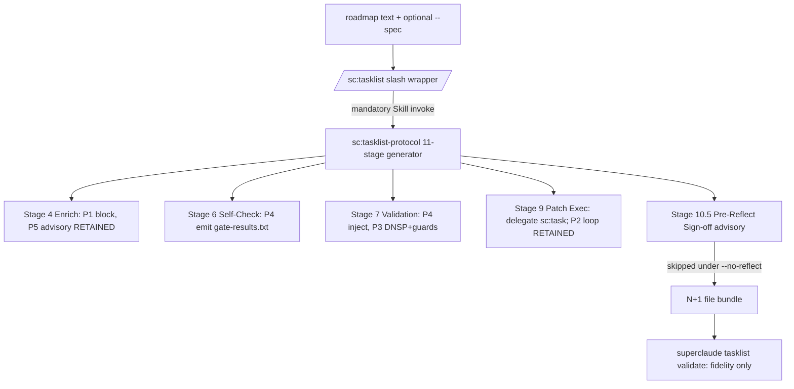
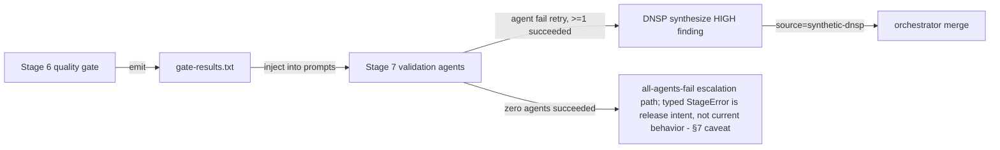

# RFMerger Refresh — Technical Design Document (TDD)

> **WHAT:** Technical design specifying *how* the retained RFMerger proposals attach to the current
> `sc:tasklist` generator surface, as **release intent**. Where the sibling PRD defines *what* to build,
> this TDD defines *how* a later, separate implementation step would build it.
> **WHY:** Translates the refreshed product requirements (`prd.md`) and release intent (`spec.md`) into an
> engineering design anchored to today's `src/superclaude/...` source-of-truth — not the drifted April-2026
> historical surface.
> **HOW TO USE:** `sc:tasklist` / reflect / task-builder maintainers and QA reference this TDD during the
> document-review checkpoint. It is **not** an implementation authorization.

> **CRITICAL:** This TDD is a **reviewed-planning draft**. It edits no source code and no `.claude/` mirror,
> and it authorizes **no implementation tasklist** within this task. The two human decisions **P2** and **P5**
> are now **RECORDED (2026-06-19): P2 = `retain-with-full-set-revalidation-and-guards`, P5 = `retain-advisory-only`**
> (explicit human choices, not defaults). With both decisions recorded, downstream implementation-tasklist
> generation is **UNBLOCKED** (subject to human review sign-off of `spec.md` / `prd.md` / `tdd.md`). The P2/P5
> decisions never blocked this document's QA.

Sentinel self-check (run before submitting TDD for pipeline consumption):

- `feature_id` is `FR-RFMERGE` (not the template feature-id placeholder). Passes.
- `spec_type` is `refactoring` (valid enum value). Passes.
- `target_release` is `v3.8-RigorFlowMerger-tasklist` (not the template version placeholder). Passes.
- `complexity_score` (`0.62`) and `complexity_class` (`MEDIUM`) are populated as ESTIMATES (carried from `spec.md`); the
  sc:roadmap extraction step computes authoritative values regardless.

### Document Lifecycle Position

| Phase | Document | Ownership | Status |
|-------|----------|-----------|--------|
| Requirements | `prd.md` (sibling) + `spec.md` (release intent) | Product / Eng | 🟡 Draft (reviewed-planning) |
| **Design** | **This TDD** | **Engineering** | **🟡 Draft (reviewed-planning, not implementation-ready)** |
| Implementation | Technical Reference | Engineering | ⛔ Blocked — pending review sign-off (P2/P5 decisions recorded 2026-06-19) |

This TDD implements requirements from `prd.md` (PR-1..PR-7) and the release intent in `spec.md`
(FR-RFMERGE.1..7), traceable to the canonical P1–P5 ledger.

### Tiered Usage

| Tier | When to Use | Sections Required |
|------|-------------|-------------------|
| **Lightweight** | Bug fixes, config changes, small features (<1 sprint) | 1, 2, 3, 6.4, 21, 22 |
| **Standard** | Most features and services (1-3 sprints) — **this TDD** | All numbered sections; skip conditional frontend-only sections |
| **Heavyweight** | New systems, platform changes, cross-team projects | All sections fully completed |

> **Note:** This is a **Standard-tier refactoring** TDD for internal developer tooling (the `sc:tasklist`
> generator). Frontend-only sections (9 State Management, 10 Component Inventory in the UI sense, 16
> Accessibility, 17.1 Frontend Performance) are **N/A** and folded; Section 10 is repurposed as the
> source-component inventory the task requires.

---

## Document Information

| Field | Value |
|-------|-------|
| **Component Name** | RFMerger Refresh — Selective RigorFlow Borrows into `sc:tasklist` |
| **Component Type** | Backend / Library (the `sc:tasklist` inference generator + its CLI validate surface) |
| **Tech Lead** | `sc:tasklist` maintainers |
| **Engineering Team** | `sc:tasklist` / reflect / task-builder maintainers |
| **Maintained By** | RFMerger refresh owners; carried in this release directory |
| **Target Release** | v3.8-RigorFlowMerger-tasklist |
| **Last Verified** | 2026-06-18 against current `src/superclaude/...` source (`sc-tasklist-protocol/SKILL.md`, `commands/tasklist.md`, `cli/tasklist/*`, `cli/sprint/config.py`) |
| **Status** | 🟡 Draft (reviewed-planning, not implementation-ready) |

### Approvers

| Role | Name | Status | Date |
|------|------|--------|------|
| Tech Lead | _pending review_ | ⬜ Pending | |
| Engineering Manager | _pending review_ | ⬜ Pending | |
| Architect | _pending review_ | ⬜ Pending | |
| Security | _pending review_ | ⬜ Pending | |
| P2 decision recorded | `retain-with-full-set-revalidation-and-guards` (explicit human choice, not a default) | 🟢 RECORDED | 2026-06-19 |
| P5 decision recorded | `retain-advisory-only` (explicit human choice, not a default) | 🟢 RECORDED | 2026-06-19 |

**Contract Table:**

| Element | Details |
|---------|---------|
| **Dependencies** | `spec.md`, `prd.md`, `refresh-requirements-ledger.md`, `refresh-validation-matrix.md`; current `src/superclaude/skills/sc-tasklist-protocol/*`, `commands/tasklist.md`, `cli/tasklist/*`, `cli/sprint/config.py` |
| **Upstream** | Feeds from: `prd.md` (PR-1..7), `spec.md` (FR-RFMERGE.1..7), canonical P1–P5 ledger, current-source-contract inventory |
| **Downstream** | Feeds to: a separate, later `/task-builder` handoff (P2/P5 decisions recorded 2026-06-19; handoff proceeds after the review checkpoint sign-off) |
| **Change Impact** | Notify: `sc:tasklist` / reflect / task-builder maintainers, QA |
| **Review Cadence** | As-needed (release-scoped); next review = the document-review checkpoint |

---

## 1. Executive Summary

The April-2026 RigorFlow-Merger (RFMerger) investigation produced a five-proposal design package
(P1 Context-Armed Steps, P2 Bounded Patch Loop, P3 DNSP, P4 Evidence-Anchored Validation, P5
Feedback-Driven Tier Calibration) proposing that the SuperClaude `sc:tasklist` generator borrow selected
RigorFlow (RF) execution-time mechanisms. That package was authored against a `sc:tasklist` surface that has
since drifted: it assumed a 10-stage model, an RF agent-team flow (`/rf:*`, TeamCreate/SendMessage), a
`.gfdoc` shell harness, an external `llm-workflows` / `/config/.claude` source-of-truth, and a `sc:task-unified`
Stage-9 patch delegate — **none operative today**. This TDD specifies *how* the retained proposals attach to
the **current 11-stage** generator (Stages 1–10 plus the **Stage 10.5 Pre-Reflect Sign-off** advisory gate),
with `sc:task` as the Stage-9 patch delegate, `/task` for MDTM execution, and `src/superclaude/...` as the
single source-of-truth.

This is a **reviewed-planning design**. Three proposals are retained in
conservative, adversarially-revised forms (P1, P3, P4) and are design-specified as release intent (validated by the automated M3/M4/runtime/sync gates; pending human review sign-off — not yet implementation-ready); the two human decisions P2 and P5 are now **RECORDED (2026-06-19): P2 = `retain-with-full-set-revalidation-and-guards`, P5 = `retain-advisory-only`** (explicit human choices, not defaults), so their designs are now active rather than conditional. The engineering thrust is a more
robust, evidence-anchored, self-contained generator that preserves the existing determinism guarantee
("same roadmap → same scored tiers"; and, with P5 advisory retained, "same roadmap + same `feedback-log.md` → same advisory output") and never lets hidden feedback mutate deterministic tier scores. Every design
attaches to an existing stage — no new pipeline phase — so the surface change is minimal and fully backward
compatible. All test specifications in this TDD are **FUTURE implementation-verification tests** (what a later
implementer would write); **none is executed by this documents-only task.**

**Key Deliverables:**

- A stage-anchored design for P1 (optional task-level `## Execution Context` block at Stage 4), P4
  (`gate-results.txt` quality-gate passthrough Stage 6 → Stage 7), and P3 (DNSP at Stage 7 with an
  all-agents-fail guard and a `source: "synthetic-dnsp"` provenance marker).
- Now-active designs for P2 (bounded Stage-9 patch loop) and P5 (advisory tier calibration), each retained
  per its recorded human decision (2026-06-19: P2 `retain-with-full-set-revalidation-and-guards`, P5 `retain-advisory-only`).
- A FUTURE test strategy covering `--no-reflect`, Stage 10.5, `sc:task` naming, stale-token prevention,
  PRD/TDD autowire, and all retained features — plus the carried `--no-reflect` / Stage 10.5 coverage gap.
- Source-of-truth sync criteria and downstream Sprint-compatibility requirements for any later tasklist.

---

## 2. Problem Statement & Context

### 2.1 Background

The `sc:tasklist` generator is a deterministic roadmap-to-tasklist producer emitting an N+1 file bundle
(`tasklist-index.md` + one `phase-N-tasklist.md` per phase) with `/sc:task` compliance-tier integration. It
currently runs an **11-stage** model (Stage 1 Ingest → 2 Parse/Bucket → 3 Convert → 4 Enrich → 5 Emit → 6
Self-Check → 7 Roadmap Validation → 8 Patch Plan → 9 Patch Execution → 10 Spot-Check → 10.5 Pre-Reflect
Sign-off). Stage 10.5 fans out one `/sc:reflect --mode pre --remediate` per phase file and is **advisory for
shipping** (PASS/PARTIAL/FAIL all ship the bundle; `--remediate` never auto-mutates phase files); `--no-reflect`
(also auto-set by `--dry-run`) skips it entirely and lives on the slash command only. (Source:
`sc-tasklist-protocol/SKILL.md:1525-1558`, `:1460-1481`; current-source-contract inventory, "Tasklist protocol".)

The April-2026 RFMerger package predates this surface and is anchored to a vanished one. The historical artifacts
(`FINAL-REPORT.md`, `artifacts/design-rfmerger-proposals.md`, `artifacts/adversarial-validation.md`) are retained
as **HISTORICAL-ONLY** evidence; the adversarial pass already produced revised, conservative forms for all five
proposals, which this refresh consumes rather than re-litigating.

### 2.2 Problem Statement

**The core problem:** The RFMerger design package is anchored to a `sc:tasklist` surface that no longer exists,
so implementing it verbatim would reintroduce stale tokens as operative edit targets, re-derive proposals against
a vanished architecture, and ship the structural-correctness defects the adversarial pass already flagged.

- **What is broken/inadequate:** The historical design assumes a 10-stage model, `/rf:*` / `.gfdoc` /
  `sc:task-unified` surfaces, and `/config/.claude` / `llm-workflows` as source-of-truth — every one of which would
  mis-target an edit today. P2 (as proposed) is a subset-only re-validation loop with oscillation/regression risk;
  P5 (as proposed) mutates scored tiers from hidden `feedback-log.md` input, violating determinism.
- **Who is affected:** Maintainers of `sc:tasklist`, the Stage 10.5 reflect gate, and `task-builder`; and any
  downstream automation that would consume the historical package to generate implementation work.
- **Cost of not solving:** A builder reading the historical package verbatim ships a determinism violation and an
  oscillation risk, and reintroduces broken references (including the non-existent `tests/reflect/` path, OQ-1).

### 2.3 Business Context

- **Product PRD Reference:** `prd.md` (PR-1..PR-7), this release directory.
- **Business Impact:** `sc:tasklist` is a core generation surface; defects propagate into every downstream
  Sprint/MDTM execution. The value here is **correctness-risk reduction** plus three robustness wins
  (P1/P3/P4), achieved with no CLI surface change and full backward compatibility.
- **User Impact:** Internal maintainers gain self-contained tasks, evidence-anchored validation, and
  validation that survives a single flaky agent — without sacrificing determinism.

---

## 3. Goals & Non-Goals

### 3.1 Goals

| ID | Goal | Success Criteria |
|----|------|------------------|
| G1 | Rebase the retained proposals (P1, P3, P4) onto the current 11-stage surface as design-specified engineering specs (release intent; candidate retained designs pending the review checkpoint). | Each maps to a concrete Stage attachment in `src/superclaude/...` with FUTURE verification tests specified. |
| G2 | Preserve determinism and the Stage 10.5 advisory-for-shipping invariant. | No retained design auto-mutates phase files or scored tiers; "same roadmap → same scored tiers" holds (scored tiers roadmap-pure); when P5 advisory is retained, "same roadmap + same `feedback-log.md` → same advisory output" holds, and the advisory never feeds back into scored tiers. |
| G3 | Record P2 and P5 as explicit human decisions (no default). | Both RECORDED 2026-06-19 (P2 `retain-with-full-set-revalidation-and-guards`, P5 `retain-advisory-only`) as explicit human choices; auto-defaulting either would have been a halt condition. |
| G4 | Quarantine all stale tokens as HISTORICAL-ONLY with current rebase targets. | Zero stale token appears as a current edit target; `sc:task-unified` → `sc:task`. |
| G5 | Specify FUTURE tests closing the carried `--no-reflect` / Stage 10.5 coverage gap. | Test strategy names direct assertions for the currently-untested generation contracts. |

### 3.2 Non-Goals

| ID | Non-Goal | Rationale |
|----|----------|-----------|
| NG1 | Authoring any implementation tasklist, or invoking `/task-builder` for implementation. | Documents-only task; explicitly forbidden. Downstream handoff is a separate, later step. |
| NG2 | Editing source code or `.claude/` mirrors. | Documents-only; SoT discipline — all edits would resolve under `src/superclaude/...` in a later step. |
| NG3 | Executing any test. | All tests are FUTURE implementation-verification specs; none runs in this task. |
| NG4 | RF mechanism R5 (session management) and R6 (batch-immutability / UID tracking). | Execution-time concepts judged N/A to SuperClaude generation; explicit non-goals. |
| NG5 | Re-implementing reflect's own UC-2 P1–P5 fields. | A separate, quarantined taxonomy — no semantic correspondence to canonical RFMerger P1–P5 (see Glossary). |
| NG6 | Selecting a default for P2 or P5. | Auto-defaulting either is a halt condition; the choice is a blocking human decision. |
| NG7 | Any hidden-feedback mutation of deterministic tier scores. | Violates the "same roadmap → same scored tiers" guarantee (the P5 constraint); advisory-only — scored tiers remain roadmap-only; the advisory may read `feedback-log.md` and must never feed back into scored tiers. |

### 3.3 Future Considerations

| Item | Target Phase | Notes |
|------|--------------|-------|
| P2 bounded patch loop implementation | Later (conditional) | Only if the P2 human decision records `retain-with-full-set-revalidation-and-guards`. |
| P5 advisory tier calibration implementation | Later (conditional) | Only if the P5 human decision records `retain-advisory-only`; advisory-only, determinism-preserving. |
| Reflect-test path correction (OQ-1) | ✅ Done (fixed at source 2026-06-19) | `BUILD-REQUEST.md:15` + `research/07:137` now use `tests/cli/reflect/` (was `tests/reflect/`). |

---

## 4. Success Metrics

### 4.1 Technical Metrics

| Metric | Current State | Target | Measurement Method |
|--------|---------------|--------|-------------------|
| Determinism preserved | Deterministic today (no hidden-feedback path) | 100% — same roadmap (+ same `--spec`) → same scored tiers (always; scored tiers a pure function of the roadmap); byte-identical bundle ⇔ same `(roadmap, --spec, feedback-log.md)` tuple when P5 advisory is retained | FUTURE determinism test asserts identical scored tiers across runs (roadmap-only) and identical advisory across runs with the same `feedback-log.md` (NFR-RFMERGE.1). |
| Synthetic-finding auditability | No provenance marker exists | 100% of P3-synthesized findings carry `source: "synthetic-dnsp"` | FUTURE P3 provenance test; grep of validation output (NFR-RFMERGE.5). |
| No reflect-gate overlap | N/A (P2 not implemented) | 0 double-remediations of the same finding | P2 loop provably disjoint from Stage 10.5 remediation; qualitative-gate review (NFR-RFMERGE.2). |
| `--no-reflect` / Stage 10.5 coverage | Untested (name search returned no hits) | Direct test assertions added in the FUTURE test plan | FUTURE tests under `tests/tasklist/` (carried gap from `research/05` §6). |
| Stale-token leakage | Historical package is full of stale tokens | 0 promoted to current operative instructions | Source-fidelity + stale-token gates (FR-RFMERGE.7 / PR-7). |

### 4.2 Business Metrics

> N/A for an internal developer-tooling refactor — no end-user KPI. The "business" outcome is correctness-risk
> reduction; see Section 2.3 and the PRD's Section 19. This TDD does not duplicate those.

---

## 5. Technical Requirements

### 5.1 Functional Requirements

> Traceable to `spec.md` FR-RFMERGE.1–7 and `prd.md` PR-1–7. **FR-002 (P2) and FR-005 (P5) were gated behind
> the P2/P5 human decisions, which are now RECORDED (2026-06-19: P2 = `retain-with-full-set-revalidation-and-guards`,
> P5 = `retain-advisory-only`); both are now active requirements.**

| ID | Requirement | Priority | Acceptance Criteria |
|----|-------------|----------|---------------------|
| FR-001 (P1) | Generated phase tasks MAY carry an optional task-level `## Execution Context` block containing roadmap ref(s) and named "source areas" (not file paths). Emitted at Stage 4 **iff ≥1 roadmap ref resolves** (References-only degraded form when no source areas; omitted otherwise; deterministic). **Reuses** task-builder's `## Execution Context` sub-field names + no-file-path discipline (`task-builder/SKILL.md:1066,1231`) — P1's block is optional, task-builder's is required; no second incompatible meaning is introduced. | Should Have | Block contains roadmap refs + source areas only; no file paths; no `Ensuring:` clause; Acceptance Criteria remain unduplicated and authoritative; the block is additive/optional; deterministic emission rule holds; no-semantic-collision check passes vs `task-builder/SKILL.md:1066,1231`. |
| FR-002 (P2) | **RETAINED (recorded 2026-06-19).** After Stage 10, loop back to Stage 9 (delegate `sc:task`) to re-patch unresolved work — the P2 decision records `retain-with-full-set-revalidation-and-guards`. | Must Have (recorded: retain) | Disposition recorded `retain-with-full-set-revalidation-and-guards` (chosen from {`defer`, `retain-with-full-set-revalidation-and-guards`}; explicit human choice, not a default); retained — implement with: full-set re-validation + monotonicity guard + regression detection + 1-extra-pass cap (2 total; adversarially-adopted, `artifacts/adversarial-validation.md:141`) + no overlap with Stage 10.5; downstream tasklist generation UNBLOCKED. |
| FR-003 (P3) | On Stage-7 validation-agent retry failure, synthesize a conservative HIGH finding for the affected range and proceed, guarded by an all-agents-fail guard and a `source: "synthetic-dnsp"` provenance marker. **Reuses the existing `synthetic-dnsp` contract owned by `task-builder` (`task-builder/SKILL.md:873-911`)** — same fixed `HIGH`+`source`, 2-element dedup key, all-agents-fail path — NOT a new divergent contract; the `sc:tasklist` use is the narrower Stage-7 case. | Must Have | DNSP activates only when ≥1 agent succeeded; zero-success follows the all-agents-fail escalation path (release intent: historically prescribed as `StageError`, `artifacts/adversarial-validation.md:51`; no typed `StageError` exists in current source — see §7 caveat); every synthesized finding carries `source: "synthetic-dnsp"` conformant to the task-builder field contract (`HIGH` non-overridable; 2-element dedup key); Stage 8 never blocked by a single failed-then-synthesized agent (given ≥1 success); compatibility/regression tests vs the existing contract are included. |
| FR-004 (P4) | Stage 6 emits `TASKLIST_ROOT/validation/gate-results.txt` from the existing quality gate; Stage 7 prompts inject it (passthrough, not a new artifact system). | Should Have | Stage 6 emits `gate-results.txt` (no new Stage 6.5); Stage 7 prompts include it; no `generation-evidence.json`; no regex-extraction PABLOV pipeline. |
| FR-005 (P5) | **RETAINED advisory-only (recorded 2026-06-19).** The P5 decision records `retain-advisory-only`: render a `## Tier Calibration Advisory` section (min 2 matching overrides) with STRICT-downgrade warnings; never mutate scored tiers. | Must Have (recorded: retain advisory-only) | Disposition recorded `retain-advisory-only` (chosen from {`defer`, `retain-advisory-only`}; explicit human choice, not a default); retained advisory-only — implement with: advisory never alters scored tiers; "same roadmap → same scored tiers" holds (scored tiers roadmap-pure), and "same roadmap + same `feedback-log.md` → same advisory" holds; downstream tasklist generation UNBLOCKED. |
| FR-006 | All documents represent current behavior accurately: 11-stage model, Stage 10.5 advisory-for-shipping, `--remediate` non-mutating, `--no-reflect` skip semantics (slash command only). | Must Have | Documents describe the 11-stage model with Stage 10.5; bundle ships on PASS/PARTIAL/FAIL; `--no-reflect` skips Stage 10.5 (+ templated post-reflect task); no retained design auto-mutates phase files. |
| FR-007 | Stale tokens (`/rf:*`, `.gfdoc`, `llm-workflows`, `/config/.claude`, `sc:task-unified`, "10-stage-only") appear only as HISTORICAL-ONLY evidence with a current rebase target; MDTM execution is `/task <absolute-path>`. | Must Have | No stale token as a current edit target/operative instruction; `sc:task-unified` → `sc:task`; MDTM execution `/task <path>` (not `/sc:task`); reflect tests at `tests/cli/reflect/`; edits under `src/superclaude/...`. |

### 5.2 Non-Functional Requirements

> Traceable to `spec.md` NFR-RFMERGE.1–7. Targets describe **release intent**; runtime/test measurement applies
> only once a later implementation step runs — not in this documents-only task.

#### Performance Requirements

| Metric | Requirement (bounded predicate) | Measurement (fixture + assertion) |
|--------|---------------------------------|-----------------------------------|
| Generation latency overhead | Added wall-time ≤ **10%** over the current baseline on a fixed reference roadmap (P1 block is additive text; P3/P4 are small per-stage hooks). | FUTURE: time `/sc:tasklist` on the fixed fixture roadmap `tests/tasklist/fixtures/` baseline vs retained-features build, N≥5 runs; assert `median(after) <= 1.10 * median(before)`. |
| Stage 7 prompt size | The P4 `gate-results.txt` passthrough adds **only** the existing 20-check gate output (no derived/heavyweight artifact); prompt-size delta = `len(gate-results.txt)` bytes, nothing more. | FUTURE: assert the Stage-7 prompt delta equals the byte length of the emitted `gate-results.txt` (the verbatim gate output) and contains no `generation-evidence.json` / regex-extracted content. |

> Detailed latency/throughput SLO tables from the template are **N/A** — this is an inference-time generator
> with no production request-serving surface.

#### Scalability Requirements

| Dimension | Current | Target | Scaling Strategy |
|-----------|---------|--------|------------------|
| Phases per bundle | N phases → N+1 files | Unchanged | Retained designs attach per-stage, not per-phase-multiplied; no new fan-out beyond existing Stage 10.5 per-phase reflect. |

#### Reliability Requirements

| Metric | Requirement |
|--------|-------------|
| Determinism | Same roadmap (+ same `--spec`) → same scored tiers (always; scored tiers a pure function of the roadmap; hard invariant). Byte-identical bundle ⇔ same `(roadmap, --spec, feedback-log.md)` tuple when P5 advisory is retained (the advisory varies with `feedback-log.md` and never feeds back into scored tiers). |
| Total-failure visibility | Zero masking of total validation failure: when zero agents succeed, DNSP does NOT fire and zero-success follows the all-agents-fail escalation path (P3 guard 1). Whether to surface a typed `StageError` is a new implementation-time decision / release intent, not current behavior — no typed `StageError` exists in current source (§7 caveat). |

#### Service Level Objectives (SLOs)

> N/A — `sc:tasklist` is a developer-invoked generator, not a continuously-served component. Reliability is
> expressed as the determinism and total-failure-visibility invariants above rather than availability/latency SLOs.

#### Security Requirements

| Requirement | Implementation | Compliance |
|-------------|----------------|------------|
| Provenance of synthetic findings | `source: "synthetic-dnsp"` on every P3-synthesized finding | Auditability (NFR-RFMERGE.5) |
| No hidden-input mutation | Scored tiers a pure function of the roadmap; feedback advisory-only | Determinism (NFR-RFMERGE.1) |
| Source-of-truth integrity | Edits under `src/superclaude/...`; `make verify-sync` green; no `.claude/{skills,commands,agents,hooks,templates}` staged | SoT discipline (NFR-RFMERGE.3) |

---

## 6. Architecture

> This is a **refactoring** TDD: the architecture describes **where the retained proposals attach** to the
> existing 11-stage `sc:tasklist` surface as **release intent**. No source file is created or modified by this
> documents-only task. All edit targets are canonical `src/superclaude/...` paths; `.claude/` is a generated
> mirror, never an edit target.

### 6.1 High-Level Architecture

The retained proposals are **stage-anchored hooks** inside the existing inference generator — none introduces a
new pipeline phase. P1 attaches at Stage 4 (Enrichment), P4 at Stages 6 (emit) and 7 (consume), P3 at Stage 7
(validation-agent failure handling / orchestrator merge), and — only if their human decisions retain them — P2 at
Stage 9 (Patch Execution) and P5 at Stage 4 (advisory rendering).

```
roadmap text (+ optional --spec)
      |
      v
/sc:tasklist (slash wrapper)  --mandatory-->  Skill sc:tasklist-protocol (11-stage generator)
  Stage 1 Ingest -> 2 Parse/Bucket -> 3 Convert
   -> 4 Enrich   [P1 ## Execution Context; P5 ## Tier Calibration Advisory RETAINED]
   -> 5 Emit
   -> 6 Self-Check  [P4 emit TASKLIST_ROOT/validation/gate-results.txt]
   -> 7 Roadmap Validation  [P4 inject gate-results into prompts; P3 DNSP on agent failure + guards]
   -> 8 Patch Plan
   -> 9 Patch Execution (delegate: sc:task)  [P2 bounded loop RETAINED]
   -> 10 Spot-Check
   -> 10.5 Pre-Reflect Sign-off (ADVISORY; PASS/PARTIAL/FAIL all ship; skipped under --no-reflect;
                                 never auto-mutates phase files)
      |
      v
   N+1 file bundle (tasklist-index.md + phase-N-tasklist.md)
      |
      v
   superclaude tasklist validate  (separate CLI; ROADMAP->TASKLIST fidelity only; exits 1 on HIGH)
```

**Diagram source:** `sc-tasklist-protocol/SKILL.md:1525-1558` (stage model), `:1460-1481` (Stage 10.5 + `--no-reflect`).

### 6.2 Component Diagram



### 6.3 System Boundaries

| Boundary | Description | Protocol |
|----------|-------------|----------|
| **Upstream** | Roadmap text (+ optional `--spec`) fed to the `/sc:tasklist` slash wrapper. | Markdown file / `@file` reference |
| **Downstream** | N+1 file bundle consumed by Sprint CLI / `superclaude tasklist validate`. | Markdown bundle (`tasklist-index.md` + `phase-N-tasklist.md`) |
| **External** | None. The generator works on roadmap *text*, not a live codebase or network service. | N/A |

### 6.4 Key Design Decisions

| Decision | Choice | Rationale | Alternatives Considered |
|----------|--------|-----------|------------------------|
| P1 step-context form | Task-level `## Execution Context` block (roadmap refs + source areas, no file paths, no `Ensuring:`) | Generator works on roadmap text → per-step file paths would be hallucinated; Acceptance Criteria stay the single source of truth (adversarial 22/50 → 34/50). | Original per-step `Context:`/`Ensuring:` sub-fields. |
| P2 disposition | **`retain-with-full-set-revalidation-and-guards`** (recorded 2026-06-19; explicit human choice, not a default) | Subset-only re-validation is a structural-correctness defect (oscillation/regression); the disposition was a blocking human decision, not an engineering default (adversarial 20/50 → 39/50). | Auto-adopt subset-only loop. |
| P3 disposition | Adopt + all-agents-fail guard + `source: "synthetic-dnsp"` provenance | Adversarial winner (39/50); guards prevent masking total failure and keep synthetic findings auditable. | Adopt as-proposed (no guard). |
| P4 evidence mechanism | Quality-gate passthrough (`gate-results.txt` → Stage 7 prompts) | The existing pre-write quality gate (**20 checks**, checks 1-20 per `sc-tasklist-protocol/SKILL.md:1132-1194`) already catches orphan deliverables; a new JSON-extraction stage is redundant and adds a regex failure surface (adversarial 27/50 → 39/50). (Historical adversarial reasoning cited a "17-point" gate; the current source gate is 20-check.) | New Stage 6.5 + `generation-evidence.json` PABLOV pipeline. |
| P5 disposition | **`retain-advisory-only`** (recorded 2026-06-19; explicit human choice, not a default) | Auto-mutation violates the "same roadmap → same scored tiers" determinism guarantee (hidden-input problem); advisory-only preserves it (scored tiers stay roadmap-pure; the advisory varies with `feedback-log.md` and never feeds back into scored tiers); the choice was a blocking human decision (adversarial 23/50 → 40/50). | Auto-mutate scored tiers from `feedback-log.md`. |
| Patch delegate | `sc:task` (remaps historical `sc:task-unified`) | `sc:task-unified` is HISTORICAL-ONLY; the current Stage-9 delegate is `sc:task` (`SKILL.md:130-132,544-548,1409-1427`). | Keep the stale `sc:task-unified` name. |
| Attachment strategy | Hooks on existing stages; no new pipeline phase | Minimal surface change; backward compatible; avoids overlapping the existing Stage 10.5 reflect gate. | New stages (e.g. P4's original Stage 6.5). |

### 6.5 Multi-Tenancy Architecture

> N/A — `sc:tasklist` is a single-user developer-invoked generator with no tenant model.

---

## 7. Data Models

> No new persistent data model is introduced. Two runtime data shapes are referenced as release intent:
> (1) the P4 `gate-results.txt` plain-text artifact, and (2) the P3 `source: "synthetic-dnsp"` provenance field.
> The canonical `synthetic-dnsp` field contract is **owned by `task-builder`** and lives at
> `src/superclaude/skills/task-builder/SKILL.md:873-911` (DM-003); P3 **reuses** it and does **not** redefine it.
>
> **Source-fidelity caveat (`StageError`).** The current `sc:tasklist` source has **no typed `StageError`**: a
> grep of `src/superclaude/skills/sc-tasklist-protocol/` and `src/superclaude/cli/tasklist/` returns zero hits,
> and the `sc:tasklist` Stage-7 surface is **markdown protocol instructions**, not typed orchestrator code with
> a raised exception. The `StageError` token originates in the **historical** adversarial recommendation
> (`artifacts/adversarial-validation.md:51`: "raise StageError (same as current behavior)") — that "as current
> behavior" claim was already inaccurate against today's `sc:tasklist` source. Accordingly, every `StageError`
> reference in this TDD is **release intent / historical-prescribed behavior**, NOT a verified current return
> contract. The current all-agents-fail behavior is the existing escalation path (`rf-team-lead`-style
> fix-cycle escalation per the reused task-builder Path A, `task-builder/SKILL.md:873-911`); whether the
> implementation surfaces it as a typed `StageError` or as the existing escalation is an implementation-time
> decision (a discovery item, not a settled current fact).

### 7.1 Data Entities

#### P4 `gate-results.txt` (runtime artifact)

Plain-text quality-gate evidence emitted by Stage 6 and injected into Stage 7 prompts. **Explicitly NOT JSON,
NOT `generation-evidence.json`, and NOT a new Stage 6.5 schema.**

| Field | Type | Required | Description | Constraints |
|-------|------|----------|-------------|-------------|
| (file body) | plain text | Yes | A serialization of the **existing 20-check** pre-write gate (checks 1-20, `sc-tasklist-protocol/SKILL.md:1132-1194`). **Release-intent caveat:** the 20 *checks* exist in current source, but the **emitted artifact and its line-format contract are NEW (P4 design), not current behavior** — current source runs the gate but does **not** emit a `gate-results.txt` file and has **no** per-line PASS/FAIL format or trailing-summary contract. The future contract: one check per line with explicit PASS/FAIL tokens and a trailing `GATE: PASS|FAIL` summary; emitted even on an all-pass gate. | Path: `TASKLIST_ROOT/validation/gate-results.txt`; plain text (not JSON); no new schema, no regex extraction. **FUTURE artifact contract — no current emitter exists.** |

#### P3 synthesized finding (REUSES the existing `task-builder` `synthetic-dnsp` contract)

> **Contract ownership (MANDATORY — not a new model).** The `synthetic-dnsp` finding contract **already
> exists and is owned by `task-builder`** (`src/superclaude/skills/task-builder/SKILL.md:873-911`, the
> "DNSP Synthetic Finding Protocol (PR-03)" / DM-003 emission contract). P3 in `sc:tasklist` **reuses that
> contract verbatim** for the narrower Stage-7-validation-agent case; it does **not** define a new or
> divergent field set. The full task-builder contract carries **seven** emission fields plus emitter-rejection
> invariants and cohort/merge semantics — all enumerated below. (The earlier draft listed only
> `severity` / `task_range` / `source`, which under-specified the reused contract and used the non-canonical
> name `task_range`; the canonical field is `affected_range`.)

```python
# Illustrative only — conforms to the EXISTING task-builder synthetic-dnsp / DM-003 contract
# (task-builder/SKILL.md:873-911). Not a new model; the sc:tasklist Stage-7 use is the narrower case.
synthesized_finding = {
    "severity": "HIGH",                       # fixed, non-overridable (R-113); reject if != "HIGH"
    "source": "synthetic-dnsp",               # fixed literal, non-overridable (R-114); reject if != "synthetic-dnsp"
    "affected_range": "<assigned_files slice>",  # verbatim spawn-prompt slice, byte-for-byte (R-115); never normalized
    "evidence": "<spawn-log path>",           # NEVER blank (R-116); else "<!-- evidence-absence: no-spawn-log: <reason> -->"
    "recommendation": "Manual review required — partition agent failed twice",  # fixed byte-exact string (R-117)
    "dedup_key": ["<affected_range>", "<escalation_ladder_exhaust_point>"],      # 2-element YAML list (R-118)
    "found_n_times": 1,                        # int >=1, default 1; +1 per within-cycle dedup collapse (R-119)
}
# Guard 1 (all-agents-fail precedence, R-122): zero-success → Path A (rf-team-lead fix-cycle escalation;
#   NO synthetic emits — release intent reframes the historical "raise StageError" as this current escalation;
#   see §7.1 note + §12.1). >=1 success AND >=1 exhaust → Path B (synthetic emits ALONGSIDE real findings,
#   strictly additive). All-success → Path C (no synthetic; normal merge).
```

| Field | Type | Required | Description | Constraints (task-builder DM-003) |
|-------|------|----------|-------------|------------------------------------|
| severity | string | Yes | Conservative HIGH for the affected range. | Fixed `"HIGH"`, **non-overridable across emission AND merge** (R-113, R-126); emitter rejects any other value (`DM-003-fixed-field-invariant-violation`). |
| source | string | Yes | Provenance marker distinguishing synthetic from real findings. | Fixed literal `"synthetic-dnsp"`, non-overridable (R-114). |
| affected_range | string | Yes | The failed agent's `assigned_files` slice. | Copied **verbatim / byte-for-byte** from the spawn-prompt slice — no normalization/ordering/whitespace edits (R-115). (This is the canonical name; the prior `task_range` was non-canonical.) |
| evidence | string | Yes | Path to the failed agent's spawn log. | **Never blank** (R-116): canonical `${TASK_DIR}qa/spawn-log-<role>-<partition>.txt`; when unavailable, the explicit stub `<!-- evidence-absence: no-spawn-log: <reason> -->`. |
| recommendation | string | Yes | Operator action. | Fixed byte-exact string `Manual review required — partition agent failed twice` (R-117); no suffix/whitespace. |
| dedup_key | list[str] | Yes | Dedup identity. | **2-element** YAML list `["<assigned_files_range>", "<escalation_ladder_exhaust_point>"]`; 2nd element ∈ closed vocab `{retry-1, retry-2, gap-fill-round-1, gap-fill-round-2, gap-fill-round-3}` (R-118; vocabulary also enforced at API-003-M6). |
| found_n_times | int | Yes | Within-cycle collapse counter. | Positive int >=1, default `1`; +1 per within-cycle dedup-key collapse (R-119, R-123); cross-cycle re-emit is DEDUP not regression (R-124 / INV-012). |

**All-agents-fail + merge semantics (part of the reused contract — MUST NOT be omitted):**

- **Guard precedence (R-122).** Gate on partition-cohort success count BEFORE any per-partition emission,
  routing to exactly one of three mutually-exclusive paths: **Path A** (zero succeeded → existing
  `rf-team-lead's Fix Cycles rule` fix-cycle escalation; **no** synthetic emits), **Path B** (≥1 success AND
  ≥1 exhaust → synthetic emits **alongside** real findings, strictly additive), **Path C** (all succeeded →
  no synthetic). For the narrower `sc:tasklist` Stage-7 case, "partition" = validation-agent range.
- **Strictly-additive merge (R-126).** The synthetic block merges **alongside** real findings, never in place
  of them: post-merge real-finding count = pre-merge real-finding count + synthetic count. `severity: HIGH`
  is non-overridable across the merge step (no merge-time downgrade/coalesce).
- **N-1 cohort concurrency (INV-021 / R-125).** When one range exhausts, the remaining N-1 sibling ranges
  continue concurrently to their own terminal state before the synthetic is composed.

> **Narrower-projection note (reuse-claim integrity).** `sc:tasklist` Stage-7 uses the *same* field contract;
> any place the Stage-7 case would need behavior the task-builder contract does not provide is a **stated
> boundary to resolve at implementation time, not a silent fork** (per spec FR-RFMERGE.3 / ledger P3). No
> narrower projection that drops fields is asserted here — the full contract above is the reused shape.

### 7.2 Data Flow



### 7.3 Data Storage

| Data Type | Storage | Retention | Backup Strategy |
|-----------|---------|-----------|-----------------|
| `gate-results.txt` (P4) | `TASKLIST_ROOT/validation/` (per-run output dir) | Lifetime of the run/output bundle | N/A — regenerated on each run; not a persisted store |
| Synthesized findings (P3) | In-memory validation result merged into the run's validation output | Lifetime of the run | N/A — derived data |

---

## 8. API Specifications

> No HTTP/REST API exists or is added. This section documents the **command/CLI surface** so that no retained
> design silently alters it. The slash command is a wrapper that **mandatorily** invokes
> `Skill sc:tasklist-protocol`; the generator does not run from the command file alone.

### 8.1 API Overview (command surface — unchanged by this refresh)

```
/sc:tasklist <roadmap-path> [--spec <spec-path>] [--output <output-dir>] [--no-reflect]
superclaude tasklist validate <output_dir> [--roadmap-file ...] [--tasklist-dir ...] [--model ...]
                                           [--max-turns ...] [--debug] [--tdd-file ...] [--prd-file ...]
```

| Surface | Option | Default | Purpose |
|---------|--------|---------|---------|
| slash | `--spec` (path / `@file`) | none | Optional supplementary spec/context; must resolve to a readable file when provided. Used at **four** current generator sites (not just reflect): (1) §4.1a Supplementary TDD Context load (`SKILL.md:169-182`), (2) §4.4a Supplementary Task Generation / source-document enrichment (`SKILL.md:246-271`), (3) Stage-7 Supplementary TDD Validation (`SKILL.md:1297-1308`), and (4) Stage 10.5 PRE reflect `<RESOLVED_SPEC_PATH>` threading (`SKILL.md:1466-1471`). Slash command only. |
| slash | `--output` (dir) | derived `TASKLIST_ROOT` | Output directory for the bundle. |
| slash | `--no-reflect` (flag) | off | Skips Stage 10.5 (pre-reflect sign-off) **and** the templated post-reflect task; auto-set by `--dry-run`. **Slash command only — NOT on `superclaude tasklist validate`.** |
| validate | `--tdd-file` (existing path) | autowired from `.roadmap-state.json` | Supplementary TDD validation input; adds testing-strategy/rollback/component/data-model/API checks (missing → MEDIUM). |
| validate | `--prd-file` (existing path) | autowired from `.roadmap-state.json` | Supplementary PRD validation input; adds personas/metrics/acceptance/priority checks (missing → MEDIUM; priority contradiction → LOW). |
| validate | `--model` (str) | `""` (empty) | Overrides the validation step model; subprocess uses `step.model or config.model`. |

> `superclaude tasklist validate` is **validation-only**: it validates ROADMAP → TASKLIST alignment (not
> spec→tasklist or roadmap→spec), exits 1 on HIGH-severity deviations, and does **not** own `--no-reflect`. There
> is **no** `tasklist generate` CLI subcommand; inference-based generation is the `/sc:tasklist` skill path.
> (Source: `commands/tasklist.md:12-30,71-85`; `cli/tasklist/commands.py:15-72,173-185`;
> `cli/tasklist/prompts.py:151-170`.)
>
> **Surface split (do not conflate) + open risk.** `--spec` is a **slash-generator** supplementary input
> (resolution order: explicit `--spec` → autowired TDD/PRD from `.roadmap-state.json` → roadmap;
> `SKILL.md:1466-1471`); `--tdd-file`/`--prd-file` are **validate-CLI** inputs autowired from
> `.roadmap-state.json`. Distinct surfaces — not one "autowire" claim. The `sc:tasklist` skill body is itself
> inconsistent — "exactly one input: the roadmap text" (`SKILL.md:49-57`) vs `--spec` enrichment/autowire
> (`SKILL.md:169-182,1297-1308,1466-1471`); carried as an **open risk** (Section 22) for upstream-source
> reconciliation, not treated as settled here.

### 8.2 Endpoint Details

> N/A — no request/response endpoints. The command surface is fully described in 8.1. The only new runtime
> artifact is the P4 `gate-results.txt` passthrough (Section 7.1); the only new field is the P3
> `source: "synthetic-dnsp"` provenance marker (Section 7.1).

### 8.3 Error Response Format

> N/A — no API error envelope. The relevant error contract is internal: zero-success at Stage 7 raises
> `StageError` (P3 guard 1) as **release intent** (no typed `StageError` exists in current source — see §7 caveat); HIGH-severity deviations cause `superclaude tasklist validate`
> to exit 1.

### 8.4 API Governance & Versioning

**Versioning Strategy:** No CLI surface is added or changed by this refresh; the command surface above is
documented as current, not versioned anew.

| Change Type | This refresh? | Notes |
|-------------|---------------|-------|
| Add optional output artifact (`gate-results.txt`) | Additive (P4) | New plain-text file under `TASKLIST_ROOT/validation/`; no consumer breakage. |
| Add field to existing finding (`source`) | Additive (P3) | New provenance field on the existing finding shape; additive. |
| Remove/rename CLI flag | No | No flag removed or renamed. |
| Add CLI subcommand | No | No `tasklist generate` subcommand added. |

---

## 9. State Management

> **Conditional Section — N/A.** This is a backend/library component with no frontend client state. Skipped.

---

## 10. Component Inventory

> **Repurposed (per the task's required "component inventory" section):** rather than the template's
> frontend-route inventory (N/A), this lists the **current source components** the retained proposals attach to.
> All paths are canonical `src/superclaude/...` edit targets for a **later** implementation step (not edited here);
> `.claude/` is a generated mirror, never an edit target.

### 10.1 Source Components (attachment points — release intent)

| Component (canonical path) | Role | Retained proposal attaching here | Evidence |
|----------------------------|------|----------------------------------|----------|
| `src/superclaude/skills/sc-tasklist-protocol/SKILL.md` (inline 11-stage runtime — **the single authoritative edit target**) | The authoritative inline generator copy; every retained proposal is edited here. | P1 (Stage 4 block), P4 (Stage 6 emit + Stage 7 inject), P3 (Stage 7 DNSP + guards); IF P2 retained: Stage 9 loop; IF P5 retained: Stage 4 advisory. | `SKILL.md:1525-1558`, `:1460-1481`, `:130-132`, `:1409-1427` |
| `src/superclaude/skills/sc-tasklist-protocol/templates/phase-template.md` (**source-side read-only reference extracted from `SKILL.md`** — NOT a `.claude/` generated mirror) | Source-side static reference for the inline phase template. The authoritative edit path is `SKILL.md`; this reference reflects shape changes made there. "Generated mirror" is reserved for `.claude/` copies. | P1 `## Execution Context` shape reflected from `SKILL.md` — **do not hand-edit**; `make sync-dev` regenerates the `.claude/` copies. **Checkpoint-heading lag (disclosed):** this reference is **stale** on checkpoint headings — it still uses non-numbered `### Checkpoint: Phase <P>` / `### Checkpoint: End of Phase <N>` (`templates/phase-template.md:110,128`), whereas the authoritative `SKILL.md` requires the numbered `### T<PP>.<NN> -- Checkpoint:` form (`SKILL.md:356,360`; gate check 18 at `SKILL.md:1183`). The authoritative checkpoint shape comes from inline `SKILL.md` until this reference template is updated; do not treat the template's heading shape as current. | `templates/phase-template.md:1-5,9-24,110,128`; mirror-lag note in `rules/file-emission-rules.md:1-12` |
| `src/superclaude/commands/tasklist.md` (slash wrapper) | Parses/validates args; mandatorily invokes the skill. | FR-006 fidelity (`--no-reflect`, `--spec`, `--output` semantics). | `commands/tasklist.md:12-30,20-39` |
| `src/superclaude/cli/tasklist/*` (validate CLI) | ROADMAP→TASKLIST fidelity validation; PRD/TDD autowire. | FR-006 / PRD-TDD autowire fidelity (no change; documented for accuracy). | `cli/tasklist/commands.py:15-72,99-171`; `prompts.py:17-146` |
| `src/superclaude/cli/sprint/config.py` (Sprint parser) | Discovers/counts downstream tasklist phases + tasks. | NFR-RFMERGE.4 downstream Sprint compatibility (constrains a FUTURE tasklist; not edited here). | `cli/sprint/config.py:15-32,34-55,73-124,134-146` |

### 10.2 Test Components (FUTURE attachment points)

| Component (canonical path) | Role | FUTURE coverage |
|----------------------------|------|-----------------|
| `tests/tasklist/` | Generation-contract + fidelity tests. | FUTURE: P1 block shape, P4 passthrough, `--no-reflect`/Stage 10.5, `sc:task` naming, slash flags. |
| `tests/cli/reflect/` | Reflect-guard suite (disk-verified path; **not** `tests/reflect/`). | Stays green: `test_marker_suppression.py`, `test_docs_cli_parity.py`. |
| `tests/skills/test_task_builder_merge.py` | Retained-feature content gate (PR-01..PR-07). | FUTURE: P1 Execution Context, P3 DNSP provenance + guard, P4 passthrough. |

### 10.3 Component Hierarchy

> N/A in the frontend-tree sense. The "hierarchy" is the linear 11-stage pipeline shown in Section 6.1, with the
> retained proposals as per-stage hooks (Section 6.4).

---

## 11. User Flows & Interactions

> "User" = a maintainer invoking `/sc:tasklist`. The flows below describe the **state/flow impacts** of the
> retained designs inside the generation pipeline. These are release intent; no flow is exercised by this task.

### 11.1 Primary Flow: Generate a bundle with retained P1/P3/P4 active

```mermaid
sequenceDiagram
    participant U as Maintainer
    participant SW as /sc:tasklist wrapper
    participant GEN as sc:tasklist-protocol
    participant QG as Stage 6 quality gate
    participant V7 as Stage 7 validation agents
    participant R as Stage 10.5 reflect (advisory)

    U->>SW: /sc:tasklist roadmap.md [--spec ...]
    SW->>GEN: Skill invoke (mandatory)
    GEN->>GEN: Stage 4 — emit optional ## Execution Context (P1)
    GEN->>QG: Stage 6 — run quality gate
    QG-->>GEN: emit gate-results.txt (P4)
    GEN->>V7: Stage 7 — inject gate-results into prompts (P4)
    V7-->>GEN: findings; on agent fail+>=1 success → synthesize HIGH source=synthetic-dnsp (P3)
    GEN->>R: Stage 10.5 — per-phase reflect (advisory; ships on PASS/PARTIAL/FAIL)
    R-->>U: N+1 bundle (phase files unmutated)
```

**Steps:**

1. Maintainer runs `/sc:tasklist`; the wrapper mandatorily invokes the skill.
2. Stage 4 emits the optional `## Execution Context` block (roadmap refs + source areas; no file paths) (P1).
3. Stage 6 runs the existing quality gate and emits `gate-results.txt` (P4).
4. Stage 7 injects `gate-results.txt` into validation prompts (P4); on a single agent's retry failure with ≥1
   success, DNSP synthesizes a conservative HIGH finding marked `source: "synthetic-dnsp"` and proceeds (P3).
5. Stage 10.5 runs per-phase reflect (advisory); the bundle ships on PASS/PARTIAL/FAIL with phase files unmutated.

**Success Criteria:**

- The `## Execution Context` block (when emitted) contains roadmap refs + source areas only.
- `gate-results.txt` exists under `TASKLIST_ROOT/validation/` and its content appears in Stage 7 prompts.
- Every synthesized finding carries `source: "synthetic-dnsp"`; Stage 8 is not blocked given ≥1 success.

**Error Scenarios:**

- If **all** Stage-7 validation agents fail (zero success), zero-success follows the all-agents-fail escalation path (no synthesis, no masking); whether to surface a typed `StageError` is a new implementation-time decision / release intent, not current behavior (no typed `StageError` exists in current source — §7 caveat).
- If `--no-reflect` is set, Stage 10.5 and the templated post-reflect task are skipped; the bundle still ships.

### 11.2 Flow: P2 bounded patch loop (RETAINED, recorded 2026-06-19)

> The P2 decision records `retain-with-full-set-revalidation-and-guards` (recorded 2026-06-19; explicit human
> choice). After Stage 10, loop
> back to Stage 9 (delegate `sc:task`) to re-patch unresolved work, capped at the original pass + at most 1
> re-patch pass (2 total — the adversarially-adopted cap, `artifacts/adversarial-validation.md:141`; the
> pre-adversarial "3 total" is the rejected Variant-B value, historical-only), using **full-set**
> re-validation + monotonicity guard + regression detection, and
> **never** overlapping Stage 10.5 reflect remediation.
>
> **Retained state model (defines the recorded `retain-*` branch):**
>
> - State: `(pass_index k, failing_set F_k, prev_failing_set F_{k-1})`; `k=1` is the original pass, re-patch adds `k=2`.
> - Compared data: each pass re-runs the **full** Stage-7 validation set (not an unresolved-only subset) and records `F_k`.
> - Monotonicity predicate: continue only if `|F_k| < |F_{k-1}|`; halt if `|F_k| >= |F_{k-1}|`.
> - Regression predicate (precedence over monotonicity): any PASS@`k-1` → FAIL@`k` finding halts immediately (reusing PR-02 semantics, `task-builder/SKILL.md:1290-1305`).
> - Cap counting: at most 1 re-patch pass (`k ∈ {2}`); pass 2 is last (2 total passes).
> - Stage-10.5 non-overlap: the loop's finding set must be provably disjoint from Stage 10.5 reflect-remediation findings (explicit non-overlap test obligation).

### 11.3 Flow: P5 advisory tier calibration (RETAINED advisory-only, recorded 2026-06-19)

> The P5 decision records `retain-advisory-only` (recorded 2026-06-19; explicit human choice). Stage 4 renders a `## Tier Calibration
> Advisory` section (min 2 matching overrides) with STRICT-downgrade warnings; scored tiers are **never** mutated
> — they remain a pure function of the roadmap, preserving "same roadmap → same scored tiers". The advisory output
> itself is a function of `(roadmap, feedback-log.md)` ("same roadmap + same `feedback-log.md` → same advisory")
> and must never feed back into the scored tiers.
>
> **Retained-option advisory contract (defines the `retain-advisory-only` branch; NOT a default selection):**
>
> - Input schema: `feedback-log.md` rows of `(roadmap_item_id | task_signature, suggested_tier, observed_count)`; rows missing any field are ignored.
> - Match key: feedback row matches a task on `roadmap_item_id` (preferred) or `task_signature`; a "matching override" is a matched row whose `suggested_tier` differs from the scored tier.
> - Threshold/omission: render only with ≥2 matching overrides; omit the whole section otherwise.
> - Output: a `## Tier Calibration Advisory` markdown table `| Task | Scored tier | Feedback-suggested tier | Observed count | Note |`, rows ordered by ascending `T<PP>.<TT>`.
> - Warning semantics: scored `STRICT` + lower feedback suggestion ⇒ explicit ⚠ STRICT-downgrade note; never auto-applied.
> - Determinism: section is a pure function of `(roadmap, feedback-log.md)`; scored tiers stay a pure function of the roadmap alone (feedback never feeds back into the score).

---

## 12. Error Handling & Edge Cases

### 12.1 Error Categories

| Category | Examples | Behavior | Recovery |
|----------|----------|----------|----------|
| Total validation failure | All Stage-7 agents fail retry (zero success) | All-agents-fail escalation path (P3 guard 1; no synthesis, no masking) — release intent prescribes `StageError` (`adversarial-validation.md:51`); no typed `StageError` in current source (§7 caveat) | Investigate validation inputs; re-run |
| Single-agent validation failure | One agent fails retry, ≥1 other succeeded | DNSP synthesizes a conservative HIGH finding (`source: "synthetic-dnsp"`) and proceeds | Reviewer inspects the flagged range |
| Reflect verdict PARTIAL/FAIL | Stage 10.5 returns PARTIAL/FAIL | Bundle still ships; index records the verdict + report link; phase files unmutated | Optional `--remediate` (offer only) |
| Stale-token mis-target | A historical token used as a current edit target | Halt — source-fidelity/stale-token gate fails | Replace with the current rebase target |
| P2/P5 auto-default | A synthesis pass selects a default for P2/P5 | Halt condition; record blocker in Open Questions | Route to the human decision checkpoint |

### 12.2 Edge Cases

| Scenario | Expected Behavior | FUTURE Test Case |
|----------|-------------------|------------------|
| `## Execution Context` would need a file path | No file path is emitted; only roadmap refs + source areas | FUTURE: assert no file paths / no `Ensuring:` in the block |
| Quality gate produces no orphans | `gate-results.txt` still emitted (passthrough of the gate output); Stage 7 still injects it | FUTURE: assert passthrough reaches Stage 7 regardless of gate verdict |
| `--no-reflect` + `--dry-run` together | `--dry-run` auto-sets `--no-reflect`; Stage 10.5 skipped | FUTURE: assert skip under both |
| P5 retained but <2 matching overrides | Advisory section renders only with ≥2 matching overrides (else omitted) | FUTURE: assert min-2 threshold; scored tiers unchanged |

### 12.3 Graceful Degradation

| Component Failure | Degraded Experience | Fallback Behavior |
|-------------------|--------------------|--------------------|
| One Stage-7 validation agent fails | Validation continues with a synthetic HIGH finding for the affected range | DNSP synthesize-and-proceed (given ≥1 success) |
| Stage 10.5 reflect FAILs | Bundle still ships with the verdict recorded | Advisory-for-shipping semantics; `--remediate` offers, never mutates |

### 12.4 Retry & Recovery Strategies

| Error Type | Retry Strategy | Max Attempts | Notes |
|------------|----------------|--------------|-------|
| Stage-7 validation agent failure | Existing per-agent retry, then DNSP synthesize (if ≥1 success) | Existing retry + 0 extra | Zero-success → all-agents-fail escalation path (typed `StageError` is release intent / implementation-time decision, not current behavior; §7 caveat) |
| P2 bounded patch loop (RETAINED) | Loop Stage 10 → Stage 9 with full-set re-validation + monotonicity guard | 1 extra cycle (cap; 2 total passes) | Must not overlap Stage 10.5 remediation |

---

## 13. Security Considerations

> Internal developer tooling — no external attack surface, no PII, no auth. "Security" here is **integrity**:
> provenance, determinism, and source-of-truth discipline.

### 13.1 Threat Model

| Threat | Likelihood | Impact | Mitigation |
|--------|------------|--------|------------|
| Synthetic finding mistaken for a real validation finding | M | M | Mandatory `source: "synthetic-dnsp"` provenance marker (P3 guard 2) |
| Hidden feedback silently mutates deterministic tier scores | M | H | P5 advisory-only (retained); scored tiers stay a pure function of the roadmap (determinism invariant) |
| Stale token mis-targets an edit to a non-existent surface | M | H | Stale-token quarantine; each historical mention paired with a current rebase target (FR-007) |
| Edit lands in a `.claude/` mirror instead of `src/superclaude/...` | L | H | SoT discipline; `make verify-sync`; never stage `.claude/{skills,commands,agents,hooks,templates}` |

### 13.2 Security Controls

| Control | Implementation | Verification |
|---------|----------------|--------------|
| Provenance integrity | `source: "synthetic-dnsp"` on every synthesized finding | FUTURE provenance test + grep of validation output |
| Determinism integrity | Scored tiers a pure function of the roadmap; feedback advisory-only | FUTURE determinism test (identical scored tiers across runs) |
| Total-failure visibility | Zero-success → all-agents-fail escalation path (no masking); typed `StageError` is release intent / implementation-time decision, not current behavior (§7 caveat) | FUTURE all-agents-fail guard test |
| SoT integrity | Edits under `src/superclaude/...`; `.claude/` regenerated via `make sync-dev` | `make verify-sync`; git-status safety check |

### 13.3 Sensitive Data Handling

> N/A — the generator processes roadmap markdown text only; no PII, secrets, or confidential data.

### 13.4 Data Governance & Compliance

> N/A — internal developer tooling; no regulated data, no residency/retention obligations.

---

## 14. Observability & Monitoring

> Lightweight for a developer-invoked generator. Observability is the generation log/index records and the
> emitted validation artifacts, not a production telemetry stack.

### 14.1 Logging

| Log Type | Format | Destination | Retention |
|----------|--------|-------------|-----------|
| Generation index records | Markdown (`tasklist-index.md`) | `TASKLIST_ROOT/` | Lifetime of the bundle |
| Stage 10.5 reflect verdict | Index line `reflect_pre: PASS/PARTIAL/FAIL ...` + report link | `TASKLIST_ROOT/` + `validation/reflect-pre/phase-<P>/` | Lifetime of the bundle |
| P4 quality-gate evidence | Plain text (`gate-results.txt`) | `TASKLIST_ROOT/validation/` | Lifetime of the bundle |

### 14.2 Metrics

> N/A — no continuous metrics emission. Success is measured by the FUTURE test suite (Section 15) and the
> Section 4.1 technical metrics, not by runtime counters.

### 14.3 Tracing

> N/A — single-process generation; no distributed tracing.

### 14.4 Alerts

> N/A — no production alerting. The CI signal is the FUTURE test suite (green/red) and `make verify-sync`.

### 14.5 Dashboards

> N/A.

### 14.6 Business Metric Instrumentation

> N/A — internal tooling; no business KPIs (see Section 4.2).

---

## 15. Testing Strategy

> **CRITICAL — FUTURE IMPLEMENTATION-VERIFICATION TESTS ONLY.** Every test below is a specification of what a
> **later implementer** would write **after** the review checkpoint. The P2/P5 human decisions are now recorded
> (2026-06-19: P2 `retain-with-full-set-revalidation-and-guards`, P5 `retain-advisory-only`), so their test work
> is an active requirement, not conditional. **No test in this section is authored or executed by this
> documents-only task.** All commands are UV-only and disk-verified. The reflect-guard suite path is
> `tests/cli/reflect/` (NOT `tests/reflect/` — see OQ-1).

### 15.1 Test Pyramid

| Level | Coverage Target | Tools | Responsibility | Status |
|-------|-----------------|-------|----------------|--------|
| Unit | Per-stage hook behavior (P1/P3/P4) + retained (P2/P5) | `pytest` (UV) | Engineers | FUTURE |
| Integration | Existing fidelity/PRD/autowire/reflect suites stay green | `pytest` (UV) | Engineers | FUTURE |
| Manual / E2E | Stage 10.5 advisory ship-on-FAIL; `--no-reflect` skip | manual generation runs | Engineers + QA | FUTURE |
| Sync | `make sync-dev` + `make verify-sync` parity | `make` targets | Engineers | FUTURE |

### 15.2 Test Cases (FUTURE)

#### Unit Tests (FUTURE)

| Component/Function | Test Case (FUTURE) | File (FUTURE) | Expected Result |
|--------------------|--------------------|---------------|-----------------|
| P1 `## Execution Context` shape | Block contains roadmap refs + source areas only; no file paths; no `Ensuring:`; Acceptance Criteria unduplicated; emitted iff ≥1 roadmap ref. **Assertion**: parse a generated phase-file fixture; assert exact shape + omission on no-ref. **Discovery**: locate Stage-4 enrichment emit fn first. | `tests/tasklist/test_tasklist_cli.py` (new fn `test_execution_context_block_shape`) and/or `tests/skills/test_task_builder_merge.py` (PR-01 Execution Context) | Pass |
| P3 DNSP synthetic provenance | Every synthesized finding carries `source: "synthetic-dnsp"`, `severity: HIGH`, 2-element dedup key. **Assertion**: simulate single-agent fail (≥1 success); assert exactly one conformant synthetic record. **Discovery**: locate Stage-7 orchestrator-merge fn first. | `tests/skills/test_task_builder_merge.py` (PR-03) + new fn `test_dnsp_synthetic_provenance` in `tests/tasklist/test_tasklist_cli.py` | Pass |
| P3 all-agents-fail guard | Zero-success → all-agents-fail escalation (release intent: `StageError`); ≥1 success → synthesize + proceed. **Assertion**: on a zero-success fixture, no synthetic is emitted and the escalation path fires. **Discovery (implementation-time)**: decide whether the escalation is surfaced as a typed `StageError` or the existing escalation path — no typed `StageError` exists in current source (§7 caveat), so the raise site is a NEW requirement, not a confirm-existing. | new fn `test_dnsp_all_agents_fail_escalates` in `tests/tasklist/test_tasklist_cli.py` | Pass |
| P4 gate-results passthrough | Stage 6 emits `gate-results.txt` (plain text, present on all-pass); Stage 7 prompt includes it; no `generation-evidence.json`; no Stage 6.5. **Assertion**: run generation on fixture roadmap; assert file exists + content substring in captured Stage-7 prompt. **Discovery (implementation-time)**: the emitter + line-format are NEW (no current `gate-results.txt` emitter exists — §7.1 caveat); locate the Stage-6 self-check fn + Stage-7 prompt-build fn as the *attachment points* for the new emission, not as existing emitters. | new fn `test_gate_results_passthrough` in `tests/tasklist/test_tasklist_cli.py` | Pass |
| **`--no-reflect` / Stage 10.5 generation contract (CARRIED GAP)** | `--no-reflect` skips Stage 10.5 + the templated post-reflect task; Stage 10.5 advisory PASS/PARTIAL/FAIL all ship; never auto-mutates phase files. **Assertion**: assert bundle ships + phase-file bytes unchanged across verdicts; assert skip under `--no-reflect`. **Discovery**: locate Stage-10.5 invocation + flag handling. | new fns `test_no_reflect_skips_stage_10_5` + `test_stage_10_5_advisory_ships_all_verdicts` in `tests/tasklist/test_tasklist_cli.py` | Pass |
| **`sc:task` naming (not `sc:task-unified`)** | Stage-9 delegate and tier classification reference `sc:task`. **Assertion**: grep generated/source content asserts `sc:task` and zero `sc:task-unified`. | `tests/tasklist/test_tasklist_cli.py` new fn `test_sc_task_naming` | Pass |
| **Slash-command flag coverage (CARRIED GAP)** | `/sc:tasklist` `--spec`, `--output`, `--no-reflect` parsed/validated. **Assertion**: parametrized parse cases per flag default/value. **Discovery**: confirm parse site in `commands/tasklist.md` / `cli/tasklist/commands.py`. | new fn `test_slash_flag_parsing` in `tests/tasklist/test_tasklist_cli.py` | Pass |
| **Stale-token prevention** | No `/rf:*`, `.gfdoc`, `llm-workflows`, `/config/.claude`, `sc:task-unified` token as an operative edit target in refreshed/generated content | new assertion (modeled on `tests/cli/prd/test_prompts.py` staleness-token tests) | Pass |
| **PRD/TDD autowire** | `--tdd-file`/`--prd-file` autowire from `.roadmap-state.json`; explicit override; missing-file warn+skip; no-state | `tests/tasklist/test_autowire.py`, `test_prd_cli.py`, `test_prd_prompts.py` (existing, stay green) | Pass |
| **Retained-feature gate** | PR-01..PR-07 (except PR-05) source-side markdown invariants | `tests/skills/test_task_builder_merge.py` (existing, stay green) | Pass |
| P2 bounded-loop guards (**RETAINED**, recorded 2026-06-19) | Full-set re-validation, monotonicity guard, regression detection, 1-extra-pass cap (2 total; `artifacts/adversarial-validation.md:141`), non-overlap with Stage 10.5 | new — active (P2 == `retain-with-full-set-revalidation-and-guards`) | Pass |
| P5 advisory determinism (**RETAINED**, recorded 2026-06-19) | Advisory section never alters scored tiers; same roadmap → same scored tiers | new — active (P5 == `retain-advisory-only`) | Pass |

#### Integration Tests (FUTURE)

| Flow | Test Case (FUTURE) | Expected Result |
|------|--------------------|-----------------|
| Tasklist fidelity stays green | `uv run pytest tests/tasklist/ -v` — retained proposals do not regress ROADMAP→TASKLIST fidelity | Pass |
| PRD/autowire stays green | `uv run pytest tests/tasklist/test_prd_cli.py tests/tasklist/test_prd_prompts.py tests/tasklist/test_autowire.py -v` | Pass |
| Reflect-guard stays green | `uv run pytest tests/cli/reflect/ -v` (`test_marker_suppression.py`, `test_docs_cli_parity.py`) | Pass |
| RFMerger retained-feature gate | `uv run pytest tests/skills/test_task_builder_merge.py tests/audit/test_inherited_verdict_freshness_inv_002.py tests/audit/test_five_axes_overlay.py -v` | Pass |
| Sync coverage | `make sync-dev && make verify-sync`; `uv run pytest tests/cli/test_verify_sync_hooks.py -v` (V1-V7) | Pass |

#### E2E / Manual Tests (FUTURE)

| User Journey | Test Case (FUTURE) | Expected Result |
|--------------|--------------------|-----------------|
| Stage 10.5 advisory ships on FAIL | Generate a bundle for a roadmap producing a Stage 10.5 FAIL verdict (reflect enabled) | Bundle still ships; index records `reflect_pre: FAIL ...` + report link; phase files unmutated |
| `--no-reflect` skips reflect gate | Run `/sc:tasklist <roadmap> --no-reflect` | Stage 10.5 skipped; no pre-reflect sign-off and no templated post-reflect task; bundle ships |

### 15.3 Test Environments

| Environment | Purpose | Data | Command |
|-------------|---------|------|---------|
| Local (UV) | All FUTURE unit/integration tests | Fixture roadmaps / source-side markdown | `uv run pytest tests/... -v` |
| CI | Gate the FUTURE suites + `make verify-sync` | Repo fixtures | `make test` + `make verify-sync` |

> **Reminder:** none of the above is executed in this task. They are the verification surface a later
> implementer must build. The carried `--no-reflect` / Stage 10.5 coverage gap (research/05 §6) is an explicit
> FUTURE obligation, not a present test run.

---

## 16. Accessibility Requirements

> **Conditional Section — N/A.** Backend/library component with no UI surface. Skipped.

---

## 17. Performance Budgets

### 17.1 Frontend Performance

> N/A — no frontend.

### 17.2 Generation Performance (backend/library)

| Metric | Budget (bounded predicate) | Measurement |
|--------|----------------------------|-------------|
| Added generation latency | ≤ 10% over baseline median on the fixed reference roadmap (N≥5 runs) | FUTURE before/after wall-time on a fixed roadmap fixture; assert `median(after) <= 1.10 * median(before)` |
| Stage 7 prompt growth | Delta = `len(gate-results.txt)` bytes exactly (the verbatim 20-check gate output; no heavyweight artifact) | FUTURE assertion the passthrough is the gate output, not a new heavyweight artifact (no `generation-evidence.json`) |
| Determinism | Byte-identical bundle for the same input | FUTURE determinism test |

### 17.3 Performance Testing

> N/A as a formal load/stress/soak suite. Performance is treated as a non-regression check folded into the
> FUTURE integration tests, not a dedicated performance harness.

---

## 18. Dependencies

### 18.1 External Dependencies

| Dependency | Version | Purpose | Risk Level | Fallback |
|------------|---------|---------|------------|----------|
| `pytest` (UV-run) | per `pyproject.toml` | FUTURE test harness | L | Standard harness |
| Claude subprocess (validation steps) | framework-managed | Stage-7 validation agents | L | Existing in current pipeline |

### 18.2 Internal Dependencies

| Dependency | Team | Status | Interface |
|------------|------|--------|-----------|
| `sc-tasklist-protocol/SKILL.md` (11-stage inline runtime) | tasklist maintainers | Operative | Skill protocol |
| `templates/phase-template.md` (read-only mirror) | tasklist maintainers | Operative | Static mirror (`make sync-dev`) |
| Stage 10.5 reflect gate + `tests/cli/reflect/` | reflect maintainers | Operative | `/sc:reflect --mode pre --remediate` |
| `sc:task` patch delegate + tier classification | task maintainers | Operative | Skill tool (`--compliance strict`) |
| `cli/sprint/config.py` (Sprint parser) | sprint maintainers | Operative | Filename/heading conventions |

### 18.3 Infrastructure Dependencies

> N/A — no databases, caches, or queues. The only runtime artifacts are files under `TASKLIST_ROOT/`.

---

## 19. Migration & Rollout Plan

> This refresh is **documents-only**; the migration notes describe rollout of the **retained proposals** by a
> later implementation step (release intent), not of this TDD.

### 19.1 Migration Strategy

| Phase | Description | Duration | Rollback Plan |
|-------|-------------|----------|---------------|
| Phase 1 | Refresh docs (spec/prd/tdd + ledger + matrix) + record P2/P5 decisions at the review checkpoint | This release | Revert the release directory docs |
| Phase 2 | Implement P4 passthrough + P1 block (lowest risk; additive) | Later | Remove `gate-results.txt` emission/injection; remove the optional Stage 4 block |
| Phase 3 | Implement P3 DNSP + guards (Stage 7 / orchestrator merge) | Later | Fall back to the all-agents-fail escalation path (release intent: `StageError`; no typed `StageError` in current source — §7 caveat) |
| Phase 4 (conditional) | IF P2 retained: bounded patch loop; IF P5 retained: advisory section | Later | Revert to `defer` (no determinism/loop residue) |
| Phase 5 | FUTURE tests for all retained features + carried gaps | Later | N/A (tests added, not rolled out) |

### 19.2 Feature Flags & Progressive Delivery

> No runtime feature flag. The progressive-delivery control is the **per-proposal independence**: P1/P3/P4 each
> land independently; P2/P5 land only if their human decision retains them. There is no `% rollout` for an
> inference-time generator.

### 19.3 Rollout Stages

> N/A — no traffic-percentage rollout. Each retained proposal is merged behind the existing `make verify-sync`
> + FUTURE test gates, not a canary.

### 19.4 Rollback Procedure

1. Identify the retained proposal to revert (P1 / P3 / P4 / P2 / P5).
2. Revert the corresponding `src/superclaude/...` change via git history.
3. Run `make sync-dev` to regenerate `.claude/` mirrors.
4. Run `make verify-sync` and the FUTURE test suite to confirm the revert.

**Rollback Decision Criteria:**

- A retained design regresses ROADMAP→TASKLIST fidelity (`tests/tasklist/`).
- P3 masks a total validation failure (guard regression).
- P5 (retained) is observed to alter scored tiers (determinism violation).

---

## 20. Risks & Mitigations

| ID | Risk | Probability | Impact | Mitigation | Contingency |
|----|------|-------------|--------|------------|-------------|
| R1 | P2 patch-loop oscillation/regression (historical K4) | M | H | P2 recorded `retain-with-full-set-revalidation-and-guards` (2026-06-19); full-set re-validation + monotonicity guard + regression detection + 1-extra-pass cap (2 total; `artifacts/adversarial-validation.md:141`) + non-overlap with Stage 10.5 | Revert P2 to `defer` |
| R2 | P5 hidden-feedback determinism violation (historical K2) | M | H | P5 recorded `retain-advisory-only` (2026-06-19); advisory-only — scored tiers never mutated | Revert P5 to `defer`; determinism test gate |
| R3 | Stale token re-promoted as operative instruction (`/rf:*`, `.gfdoc`, `sc:task-unified`, 10-stage wording) | M | H | Source-fidelity + stale-token gates; each historical mention paired with a current rebase target; `sc:task-unified` → `sc:task` | Halt; correct the citation |
| R4 | P2/P5 auto-defaulted by a downstream synthesis pass | L | H | Auto-defaulting either is an explicit halt condition; review checkpoint records both first | Halt + record blocker in Open Questions |
| R5 | Implementation tasklist generated inside this documents-only task | L | H | Authorization boundary: no `task-builder` implementation invocation; downstream handoff is a separate, later, non-blocking step | Review checkpoint + git status catch it |
| R6 | P3 DNSP masks a total validation failure | L | H | All-agents-fail guard: DNSP activates only when ≥1 agent succeeded; zero-success follows the all-agents-fail escalation path (release intent: `StageError`; §7 caveat) | Fall back to the all-agents-fail escalation path |
| R7 | Reflect-guard test command pins a non-existent path (`tests/reflect/`) | M | M | Standardize on disk-verified `tests/cli/reflect/`; OQ-1 ✅ Resolved (fixed at source 2026-06-19) | Resolved: `BUILD-REQUEST.md:15` / `research/07:137` now use `tests/cli/reflect/` |
| R8 | Mirror-lag in `rules/file-emission-rules.md` propagated as runtime truth | L | M | Respect mirror-lag; the inline `SKILL.md` copy is the runtime source; never hand-edit the mirror | Regenerate mirrors via `make sync-dev` |
| R9 | `--no-reflect` / Stage 10.5 generation contracts remain untested | H | M | FUTURE test plan adds direct assertions (carried gap from research/05 §6) | Block coverage sign-off until added |
| R10 | Edits land in `.claude/` mirrors instead of `src/superclaude/...` | L | H | SoT discipline; `make verify-sync`; never stage `.claude/{skills,commands,agents,hooks,templates}` | Move change to `src/`, re-sync |

---

## 21. Alternatives Considered

> Completing this section before finalizing Section 6 prevents confirmation bias. The retained dispositions are
> the adversarial winners from the historical validation, rebased onto current source.

### Alternative 0: Do Nothing (mandatory)

**Description:** Drop the RFMerger package entirely and leave `sc:tasklist` unchanged.

**Pros:**

- No engineering cost, no operational burden, no regression risk.
- Preserves the current pipeline exactly as-is.

**Cons:**

- Discards three genuinely valuable, adversarially-validated mechanisms (P3 DNSP — the adversarial winner; P4
  evidence passthrough; P1 conservative step context) that map cleanly onto the current generator.
- Loses the two carried open questions (OQ-1 reflect-test path, OQ-2 deliverable count) that a future builder
  would otherwise re-discover.
- Leaves the historical package as a live trap: a later reader could implement it verbatim against a vanished
  surface, shipping the P2/P5 defects.

**Why Not Chosen:** The refresh keeps the validated value (P1/P3/P4) while neutralizing the two
structural-correctness defects (P2/P5) — at near-zero risk, since each retained design is additive and
independently revertible. "Do nothing" forfeits that value and leaves the trap intact.

---

### Alternative 1: Implement the historical package verbatim

**Description:** Build P1–P5 exactly as the April-2026 design specified (per-step `Context:`/`Ensuring:`, subset-only
patch loop, new Stage 6.5 + `generation-evidence.json`, tier-score mutation from `feedback-log.md`).

**Pros:**

- No re-derivation effort; the design "already exists".

**Cons:**

- Targets a 10-stage model and `/rf:*` / `.gfdoc` / `sc:task-unified` / `/config/.claude` surfaces that are not
  operative; every edit would mis-target.
- Ships a determinism violation (P5 tier mutation) and an oscillation risk (P2 subset-only loop) the adversarial
  pass explicitly flagged.
- Adds a redundant JSON-extraction stage (P4) with a high-authority regex failure surface.

**Why Not Chosen:** It re-introduces stale tokens as operative instructions and ships known defects. The refresh
rebases onto current source and adopts the conservative, guarded forms instead.

---

### Alternative 2: Auto-default P2/P5 to a conservative engineering choice

**Description:** Rather than gating P2/P5 on human decisions, pick a safe default (e.g. P2 `defer`, P5
`retain-advisory-only`) automatically.

**Pros:**

- Unblocks downstream implementation immediately; no review checkpoint wait.

**Cons:**

- P2 and P5 dispositions are product/risk judgments, not engineering defaults; auto-defaulting buries the decision.
- Violates the task's hard requirement that auto-defaulting either is a **halt condition**.

**Why Not Chosen:** The disposition of P2/P5 is a blocking human decision by design. Auto-defaulting would
short-circuit the exact judgment this refresh exists to surface.

---

## 22. Open Questions

> Carried forward from Phase 1 discovery. OQ-1 is **✅ Resolved (fixed at source 2026-06-19)** — `BUILD-REQUEST.md:15`
> and `research/07:137` now use `tests/cli/reflect/`. OQ-2's deliverable-count taxonomy is **RESOLVED** in this package
> (spec §11 OQ-2 + `refresh-validation-matrix.md` "Deliverable taxonomy"); its residual raw research-file wording is
> **WAIVED** (the refreshed spec/PRD/TDD are authoritative for any downstream `/task-builder` run). Q-P2/Q-P5
> are the two human decisions, now RECORDED (2026-06-19).

| ID | Question | Owner | Target Date | Status | Resolution |
|----|----------|-------|-------------|--------|------------|
| OQ-1 | `BUILD-REQUEST.md:15` and `research/07:137` now use `uv run pytest tests/cli/reflect/ -v`; the disk-correct path is `tests/cli/reflect/` (not `tests/reflect/`). The refreshed validation matrix was already correctly pinned (`artifacts/refresh-validation-matrix.md:61,75,77`), and the upstream sources are now fixed too. | refresh owners | done | ✅ Resolved (fixed at source 2026-06-19) | Fixed at source: `BUILD-REQUEST.md:15` + `research/07:137` now use `tests/cli/reflect/` (with a dated correction note); the matrix-command pin needs no further action. |
| OQ-2 | 5-vs-7 output-count taxonomy — **RESOLVED** (spec §11 OQ-2 + `refresh-validation-matrix.md` "Deliverable taxonomy"): 5 GATED deliverables (spec/prd/tdd/ledger/matrix) + 2 DERIVED control artifacts (`review-checkpoint.md`, `downstream-task-builder-handoff.md`) + 1 process report (`final-validation-evidence-report.md`). | refresh owners | resolved in this package | ✅ Resolved (in-package; research-file residual WAIVED) | Taxonomy fixed in-package; the raw research-file residual (`research/07:46-50` / research-notes) is WAIVED — the refreshed spec/PRD/TDD are authoritative inputs for any downstream `/task-builder` run and supersede the raw research notes. |
| Q-P2 | P2 disposition: `defer` vs `retain-with-full-set-revalidation-and-guards`. | human reviewer | review checkpoint | 🟢 RECORDED 2026-06-19: `retain-with-full-set-revalidation-and-guards` (explicit choice, not a default) | Recorded at the review checkpoint per `.dev/tasks/to-do/TASK-RF-rfmerger-refresh-20260618-172224/phase-outputs/reviews/p2-human-decision-record.md`; downstream implementation unblocked. |
| Q-P5 | P5 disposition: `defer` vs `retain-advisory-only`. | human reviewer | review checkpoint | 🟢 RECORDED 2026-06-19: `retain-advisory-only` (explicit choice, not a default) | Recorded at the review checkpoint per `.dev/tasks/to-do/TASK-RF-rfmerger-refresh-20260618-172224/phase-outputs/reviews/p5-human-decision-record.md`; downstream implementation unblocked. |
| Q-mirror | Mirror-lag: `rules/file-emission-rules.md` omits the post-reflect terminal task the inline `SKILL.md` has. | tasklist maintainers | when P1 lands | 🟡 Investigating | Respect, do not propagate; the inline `SKILL.md` copy is authoritative; regenerate via `make sync-dev`. |

---

## 23. Timeline & Milestones

> Release intent only — gated behind the review checkpoint. The P2/P5 decisions are recorded (2026-06-19). No dates are committed by
> this documents-only task.

### 23.1 High-Level Timeline

| Milestone | Target Date | Status | Dependencies |
|-----------|-------------|--------|--------------|
| Refresh docs complete (spec/prd/tdd + ledger + matrix) | This release | ⬜ In progress | — |
| P2/P5 decisions recorded (2026-06-19) | 2026-06-19 | ✅ Done | Refresh docs complete |
| Document-review checkpoint sign-off | TBD | ⬜ | Refresh docs complete |
| Implementation start (P1/P3/P4) | TBD | ⬜ | Review sign-off |
| Implementation start (P2/P5, retained) | TBD | ⬜ | Review sign-off (`retain-*` decisions recorded 2026-06-19) |
| FUTURE test suite green + `make verify-sync` | TBD | ⬜ | Implementation complete |

### 23.2 Implementation Phases

#### Phase 1: Documents complete (this release)

**Deliverables:**

- [ ] Refreshed `spec.md`, `prd.md`, `tdd.md` (this document) + `refresh-requirements-ledger.md` + `refresh-validation-matrix.md`
- [x] P2 and P5 human decisions recorded (2026-06-19): P2 = `retain-with-full-set-revalidation-and-guards`, P5 = `retain-advisory-only` (explicit human choices, not defaults)

**Exit Criteria:**

- Document QA gates pass; P2/P5 decisions recorded as explicit `retain-*` human choices; no implementation-ready claim until review sign-off.

#### Phase 1.5: Human decisions recorded (COMPLETE 2026-06-19)

**Deliverables:**

- [x] Human operator recorded the P2 and P5 decisions (2026-06-19): P2 = `retain-with-full-set-revalidation-and-guards`, P5 = `retain-advisory-only` (explicit choices, not defaults).

**Exit Criteria:**

- Both `p2_decision` and `p5_decision` are recorded (non-PENDING). This unblocks Phase 2+ (subject to `review_status` human sign-off).

#### Phase 2+: Implementation (later, gated by review sign-off; P2/P5 decisions recorded)

> See Section 19.1 (Migration Strategy) for the dependency-ordered implementation phases. Not executed here.

---

## 24. Release Criteria

### 24.1 Definition of Done (this documents-only task)

This TDD is "Done" when:

- [ ] All required sections present (frontmatter, technical requirements, architecture, component inventory,
  data/API impacts, state/flow impacts, error handling, testing strategy, migration, risks, alternatives,
  release criteria, operational readiness, stale-token checks, source-of-truth sync criteria, downstream Sprint
  compatibility).
- [ ] `feature_id`, `spec_type`, `target_release`, `complexity_score`, `complexity_class` populated (estimates marked).
- [ ] Zero template placeholder sentinels (the double-brace `SC_PLACEHOLDER` pattern) remain.
- [ ] All tests framed as FUTURE implementation-verification (none executed).
- [x] P2 and P5 human decisions recorded (2026-06-19) as explicit `retain-*` choices (not defaults): P2 = `retain-with-full-set-revalidation-and-guards`, P5 = `retain-advisory-only`.
- [ ] No stale token (`/rf:*`, `.gfdoc`, `llm-workflows`, `/config/.claude`, `sc:task-unified`) as a current edit
  target; all historical citations paired with a current rebase target.
- [ ] Consistent with `spec.md` and `prd.md` (11-stage model, Stage 10.5 audit-first, same P1–P5 dispositions).

### 24.2 Definition of Done (FUTURE implementation — not asserted now)

A retained proposal is "Done" in a **later** implementation step when its acceptance criteria are met, the
relevant FUTURE tests pass under UV, source edits live under `src/superclaude/...`, `make verify-sync` is green,
and no `.claude/` mirror was staged. **None of these is asserted complete by this TDD.**

### 24.3 Release Checklist (FUTURE)

- [ ] Retained features complete per their acceptance criteria
- [ ] FUTURE test suites green (`tests/tasklist/`, `tests/cli/reflect/`, retained-feature gates)
- [ ] `make sync-dev` + `make verify-sync` green
- [ ] No `.claude/{skills,commands,agents,hooks,templates}` staged
- [x] P2/P5 decisions recorded (2026-06-19, both `retain-*`); P2/P5 tasks are active

---

## 25. Operational Readiness

> Lightweight for a developer-invoked generator. "Operations" = the maintainer running `/sc:tasklist` and the
> CI signal, not a 24/7 on-call surface.

### 25.1 Runbook (FUTURE retained behavior)

| Scenario | Symptoms | Diagnosis Steps | Resolution | Escalation |
|----------|----------|-----------------|------------|------------|
| Stage 7 zero-success escalation (release intent: typed `StageError`; no typed `StageError` in current source — §7 caveat) | Generation halts at validation via the all-agents-fail escalation path | Check whether **all** agents failed (zero success → expected all-agents-fail escalation) | Fix validation inputs; re-run | Tasklist maintainers |
| Synthetic findings everywhere | Many `source: "synthetic-dnsp"` findings | Indicates repeated single-agent failures (≥1 success each time) | Investigate flaky validation agent | Tasklist maintainers |
| Non-deterministic bundle | Same roadmap → differing scored tiers | Check for any hidden-feedback path (P5 must be advisory-only) | Restore determinism; revert any tier mutation | Reflect + tasklist maintainers |
| `make verify-sync` fails | `.claude/` diverges from `src/` | Confirm edit landed in `src/superclaude/...` then `make sync-dev` | Re-sync; never stage `.claude/` mirrors | Tasklist maintainers |

### 25.2 On-Call Expectations

> N/A — no on-call rotation. The owning teams (tasklist / reflect / task-builder maintainers) handle issues via
> normal CI signals and the FUTURE test suite, not paging.

### 25.3 Capacity Planning

> N/A — inference-time generator; no capacity dimension beyond the maintainer's local/CI run. The only
> per-run artifacts are files under `TASKLIST_ROOT/`.

---

## 26. Cost & Resource Estimation

> N/A — internal developer tooling; no per-tenant infrastructure cost. The only cost is engineering time for a
> later implementation step (P1/P3/P4 are small per-stage hooks; P2/P5 are retained per the recorded 2026-06-19 decisions).

---

## 26A. Stale-Token Checks

> **Required section.** Stale tokens appear in the refreshed documents **only** as HISTORICAL-ONLY evidence,
> each paired with its current rebase target. A downstream reader encountering any of these as a *current edit
> target* must STOP. None below is an operative instruction in this TDD.

| Stale token / wording (HISTORICAL-ONLY) | Current operative equivalent (do NOT edit the stale form) |
|---|---|
| `/rf:*` (`/rf:taskbuilder`, `/rf:pipeline`, `/rf:run`) + TeamCreate/SendMessage agent-team flow | `/task-builder` (Agent tool; no agent teams) for authoring, then `/task <absolute-path>` for MDTM execution. |
| `.gfdoc` (e.g. `.gfdoc/scripts/automated_qa_workflow.sh`, `.gfdoc/templates/...`) | Source of truth is `src/superclaude/templates/workflow/...`; execution is the `/task` skill loop, not a shell script. (`.claude/templates/workflow/...` is a generated mirror, not an edit target.) |
| `llm-workflows` (`/config/workspace/llm-workflows/`) | In-repo `src/superclaude/...`. |
| `/config/.claude` (global-config SC source) | In-repo `src/superclaude/...`; never edit `/config/.claude`. |
| `sc:task-unified` (historical Stage-9 patch delegate) | `sc:task` (current Stage-9 patch-execution delegate). |
| "10-stage-only" tasklist wording (no reflect gating, no PRD/TDD enrichment) | **11-stage** model with Stage 10.5 advisory reflect gate + `--no-reflect` + PRD/TDD autowire. |
| `tests/reflect/` (pinned in `BUILD-REQUEST.md:15` / `research/07:137`) | `tests/cli/reflect/` (disk-verified; `test_marker_suppression.py`, `test_docs_cli_parity.py`). Carried as OQ-1. |

**Stale-token self-check (this TDD):**

- No stale token above is used as a current edit target or operative instruction — each is paired with a current
  rebase target.
- `sc:task-unified` is replaced by `sc:task`; MDTM execution is `/task <absolute-path>`, never `/sc:task`.
- Reflect tests are pinned at `tests/cli/reflect/` (never `tests/reflect/`).
- No template placeholder sentinel (the double-brace `SC_PLACEHOLDER` pattern) remains anywhere in this document.

---

## 26B. Source-of-Truth Sync Criteria

> **Required section.** All FUTURE code edits implementing the retained proposals MUST follow this discipline.
> This TDD itself edits no source and no mirror.

1. **Edit `src/superclaude/...` first.** `src/superclaude/` is canonical for distributable skills, agents,
   commands, and templates; the install CLI reads from there. The retained-proposal edit targets are
   `src/superclaude/skills/sc-tasklist-protocol/SKILL.md` (inline runtime) and, via regeneration only,
   `src/superclaude/skills/sc-tasklist-protocol/templates/phase-template.md` (read-only mirror).
2. **Then `make sync-dev` + `make verify-sync`.** After editing `src/superclaude/...`, run `make sync-dev` to
   regenerate `.claude/`, then `make verify-sync` to confirm the two sides match (CI-friendly).
3. **Never stage `.claude/{skills,commands,agents,hooks,templates}` mirrors.** These are gitignored sync-dev
   output. **Only `.claude/settings.json` is tracked.** If `git add` requires `-f` on any `.claude/` path, STOP,
   move the change to `src/superclaude/...`, re-sync, and stage only the `src/` side.
4. **Respect, do not propagate, mirror-lag.** `rules/file-emission-rules.md` currently omits the post-reflect
   terminal task that the inline `SKILL.md` has — a known mirror lag. The inline `SKILL.md` copy is the runtime
   source; never hand-edit the mirror; regenerate via `make sync-dev`.
5. **Artifact placement.** Documents live under the release dir (`.dev/releases/current/v3.8-RigorFlowMerger-tasklist/`);
   code/test edits live under `src/superclaude/...` and `tests/...`. A git-status safety check must confirm no
   `.claude/{skills,commands,agents,hooks,templates}` path is staged.

| Sync gate | Command | Pass condition |
|-----------|---------|----------------|
| Regenerate mirrors | `make sync-dev` | `src/superclaude/{skills,agents,commands}` copied to `.claude/` |
| Verify parity | `make verify-sync` | `src/` and `.claude/` match; exits 0 |
| Hook coverage (FUTURE) | `uv run pytest tests/cli/test_verify_sync_hooks.py -v` | V1–V7 pass |

---

## 26C. Downstream Sprint Compatibility Requirements

> **Required section.** Any **FUTURE** implementation tasklist generated from the refreshed `spec.md` / `prd.md` /
> `tdd.md` (in a separate, later `/task-builder` step) MUST preserve Sprint parser conventions so the Sprint CLI
> can discover and count its work. **This task generates NO such tasklist** — these requirements constrain the
> later step; they are documented here, not exercised here.

| Requirement | Convention | Evidence (CODE-VERIFIED) |
|-------------|------------|--------------------------|
| Phase filenames | Literal `phase-N-tasklist.md` (e.g. `phase-1-tasklist.md`), not path-prefixed | `src/superclaude/cli/sprint/config.py:15-32`, `134-146` |
| Task headings | Match `### T<PP>.<TT>` (e.g. `### T01.02`) | `src/superclaude/cli/sprint/config.py:34-55` |
| Execution Mode column | Optional; values only `claude`, `python`, or `skip` | `src/superclaude/cli/sprint/config.py:73-124` |
| Directory fallback | If no phase refs in the index, Sprint scans the dir for the phase filename pattern — reinforcing literal filenames | `src/superclaude/cli/sprint/config.py:134-146` |

**Downstream handoff requirements (later, non-blocking — P2/P5 recorded 2026-06-19; after the review checkpoint sign-off):**

- Generate the tasklist from the refreshed `spec.md` + `prd.md` + `tdd.md` via `/task-builder`, then execute it
  with `/task <absolute-path>` (**NOT** `/sc:task`).
- Include P2 and P5 implementation tasks: both human decisions recorded a `retain-*` choice (2026-06-19: P2
  `retain-with-full-set-revalidation-and-guards`, P5 `retain-advisory-only`).
- Generated tasks must not assume the stale 10-stage model — the current generator is 11-stage with an advisory
  Stage 10.5 reflect gate and a `--no-reflect` escape hatch.
- Ignore any stale `sc:tasklist`-generated RFMerger tasklists from the historical package.

> **This TDD does not generate an implementation tasklist.** It records the Sprint-compatibility contract so the
> later, separate step honors it.

---

## 27. References & Resources

### 27.1 Related Documents

| Document | Type | Link |
|----------|------|------|
| RFMerger Refresh PRD | Product Requirements | `.dev/releases/current/v3.8-RigorFlowMerger-tasklist/prd.md` |
| RFMerger Refresh Spec | Release intent | `.dev/releases/current/v3.8-RigorFlowMerger-tasklist/spec.md` |
| Requirements Ledger (canonical P1–P5) | Ledger | `.dev/releases/current/v3.8-RigorFlowMerger-tasklist/artifacts/refresh-requirements-ledger.md` |
| Validation Matrix (per-output gate contract) | QA contract | `.dev/releases/current/v3.8-RigorFlowMerger-tasklist/artifacts/refresh-validation-matrix.md` |
| Current-Source-Contract Inventory | Discovery | `.dev/tasks/to-do/TASK-RF-rfmerger-refresh-20260618-172224/phase-outputs/discovery/current-source-contract-inventory.md` |
| Tests & Verification Inventory | Discovery | `.dev/tasks/to-do/TASK-RF-rfmerger-refresh-20260618-172224/research/05-tests-and-verification.md` |
| Tasklist protocol (current runtime) | Source | `src/superclaude/skills/sc-tasklist-protocol/SKILL.md` |
| Tasklist slash wrapper | Source | `src/superclaude/commands/tasklist.md` |
| Tasklist validate CLI | Source | `src/superclaude/cli/tasklist/` |
| Sprint parser conventions | Source | `src/superclaude/cli/sprint/config.py` |

### 27.2 External References

> N/A — no external library/framework references; this is an internal generator refactor grounded in repository
> source.

### 27.3 Historical (HISTORICAL-ONLY evidence — never current operative instructions)

| Document | Relevance |
|----------|-----------|
| `FINAL-REPORT.md` (historical RFMerger) | Source of canonical P1–P5 proposals; HISTORICAL-ONLY. |
| `artifacts/design-rfmerger-proposals.md` (historical) | Canonical proposal numbering; HISTORICAL-ONLY. |
| `artifacts/adversarial-validation.md` (historical) | Adversarial revisions/scores feeding the dispositions; HISTORICAL-ONLY. |

---

## 28. Glossary

| Term | Definition |
|------|------------|
| RFMerger | RigorFlow-Merger — the April-2026 investigation proposing selected RF execution-time mechanisms be borrowed into `sc:tasklist`. |
| Canonical RFMerger P1–P5 | P1 Context-Armed Steps, P2 Bounded Patch Loop, P3 DNSP, P4 Evidence-Anchored Validation, P5 Feedback-Driven Tier Calibration (per `design-rfmerger-proposals.md`). **This is the taxonomy used throughout this TDD.** |
| DNSP | Detect-Nudge-Synthesize-Proceed (P3). Canonical name; the gloss "Dynamic / synthetic no-source provenance" refers to the same entry — the canonical name is source-of-truth. |
| **Reflect UC-2 "P1–P5" (QUARANTINED — DO NOT CONFUSE)** | The `sc:reflect` UC-2 protocol independently uses P1–P5 for a *different* taxonomy (P1/P2 per-task verdicts, P3 cross-task interaction scan, P4 report rendering, P5 budget routing). They share only the `P<n>` label with the canonical RFMerger P1–P5 — **no semantic correspondence**. Keep strictly separate; never reuse reflect's `P<n>` labels for RFMerger proposals. |
| Stage 10.5 (Pre-Reflect Sign-off) | 11th tracked stage of `sc:tasklist`; fans out `/sc:reflect --mode pre --remediate` per phase; **advisory for shipping** (PASS/PARTIAL/FAIL all ship); `--remediate` offers remediation without auto-mutating phase files; skipped under `--no-reflect`. |
| `--no-reflect` | Slash-command flag that skips Stage 10.5 (and the templated post-reflect task); auto-set by `--dry-run`; not present on `superclaude tasklist validate`. |
| `sc:task` | Current Stage-9 patch-execution delegate and tier-classification algorithm (`STRICT > EXEMPT > LIGHT > STANDARD`). Replaces the historical `sc:task-unified`. |
| `/task` | The MDTM execution skill loop. MDTM tasklists are executed via `/task <absolute-path>` — **not** `/sc:task`. |
| HISTORICAL-ONLY | A token/claim existing only in the historical RFMerger package; never promoted to current operative guidance; cited as evidence with a current rebase target. |
| Source-of-truth (SoT) | `src/superclaude/...` is canonical; `.claude/{skills,commands,agents,hooks,templates}` is a generated mirror (`make sync-dev` + `make verify-sync`), never an edit/stage target (except `.claude/settings.json`). |
| `gate-results.txt` | P4 runtime artifact: plain-text quality-gate evidence emitted by Stage 6, injected into Stage 7 prompts. Explicitly **not** `generation-evidence.json` and **not** a new Stage 6.5. |
| `source: "synthetic-dnsp"` | Mandatory provenance marker on every P3-synthesized validation finding. |
| FUTURE (test) | A test specified here as what a *later implementer* would write; **not authored or executed by this task.** |

---

## Appendices

### Appendix A: Detailed API Specifications

> N/A — no HTTP API. The command surface is fully specified in Section 8.1.

### Appendix B: Runtime Artifact Shapes

- P4 `gate-results.txt`: plain-text quality-gate output under `TASKLIST_ROOT/validation/` (Section 7.1).
- P3 synthesized finding: existing validation-finding shape + `source: "synthetic-dnsp"` (Section 7.1).

### Appendix C: Wireframes & Mockups

> N/A — no UI.

### Appendix D: Performance Test Results

> N/A — no performance harness; non-regression is folded into FUTURE integration tests (Section 17.3).

---

## Document History

| Version | Date | Author | Changes |
|---------|------|--------|---------|
| 1.0 | 2026-06-18 | claude (TASK-RF-rfmerger-refresh-20260618-172224, Step 2.5) | Initial refreshed TDD — reviewed-planning draft. P1/P3/P4 design-specified as release intent (conservative/guarded forms; candidate retained designs pending review checkpoint); P2/P5 recorded PENDING with no default (conditional, gated designs). Rebased onto current 11-stage / Stage-10.5 / `sc:task` / `src/superclaude/...` surface. All tests framed as FUTURE implementation-verification (none executed). Stale tokens quarantined HISTORICAL-ONLY. Not implementation-ready. |
| 1.1 | 2026-06-19 | claude (decision propagation) | Propagated the two now-RECORDED human decisions: P2 = `retain-with-full-set-revalidation-and-guards`, P5 = `retain-advisory-only` (explicit human choices, not defaults). P2/P5 designs flipped from conditional/gated to active; decision-status wording updated PENDING → RECORDED; downstream implementation-tasklist generation now UNBLOCKED. Guard design, P2 2-total-pass cap, P5 determinism semantics, and historical/adversarial evidence unchanged. |

---

> **Template:** `src/superclaude/examples/tdd_template.md` (TDD v1.2), adapted to Standard-tier refactoring for an
> internal developer-tooling refresh. Frontend-only sections folded as N/A; Section 10 repurposed as the
> source-component inventory; Sections 26A/26B/26C added for the task-required stale-token checks, source-of-truth
> sync criteria, and downstream Sprint compatibility requirements.
