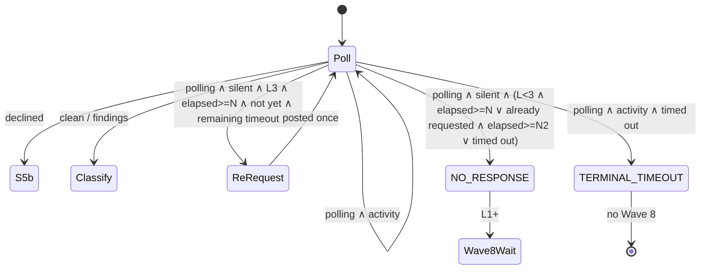

# Augment no-response (silence)

Delta on Wave 1 poll + Wave 8 arm table. Not a new monitor. Not S5b.

## 0. Verified current behaviour (do not re-litigate)

### 0.1 Decline / opt-in (not a second bug)

`is_decline` (`classifier.py:105-139`) requires **both** regexes, Augment identity, and watermark. Defaults (`detection.py:114-118`):

- `decline_phrase_regex` = `abnormally\s+large`
- `decline_retrigger_regex` = `comment\s+[\"'`*_]*(augment|auggie|augmentcode)\s+review[\"'`*_]*`

Live #241 opt-in (id `5833796931`, `augmentcode[bot]`, 2026-09-25T14:09:26Z):

```
<!-- augment-large-pr-opt-in -->
This pull request is abnormally large and would use a significant amount of tokens to review. If you still wish to review it, comment "**_augment review_**" and we will review it.
```

Both regexes match (`phrase: True`, retrigger match `comment "**_augment review_**"`). `classify` returns `declined` (`classifier.py:184-203`). FSM edges `S2_CLASSIFY` / `S5_AWAITING_REREVIEW` + `declined` → `S5B_AUGGIE_FALLBACK` (`fsm.py:658-667`). Wave 6b (`SKILL.md:127`) + `refs/auggie-fallback.md` already own that path. **No regex change.**

Still add a live-shape fixture from this comment (identity `augmentcode[bot]`, HTML marker, real body). Existing `decline-comment.json` uses synthetic `augment-code[bot]`.

### 0.2 Silence path (the gap)

Attended loop (`SKILL.md:46-54`) classifies the **full JSON line** via `classify`, comments included. `poll-augment-review.sh:74-77` coarse `polling` / `review_present` is a stream hint only.

`classify` with empty reviews **and** no matching decline → `"polling"` (`classifier.py:205-207`). Augment comments that are not declines do **not** leave `polling` (only a formal review does). `poll_outcome` (`fsm.py:577-588`) and SKILL `timed_out` then fire `TERMINAL_TIMEOUT`. No other terminal exists for zero activity.

PR #242 evidence (`last-poll.json`: `reviews:[], comments:[]`; `state.snapshot.json`: `TERMINAL_TIMEOUT`, `round_counter=0`, `auggie_review_invoked=[]`). Wave 8 does **not** arm on `TERMINAL_TIMEOUT` (`SKILL.md:129`, `ci-poll.md` arm table, `.dev/specs/pr-submit-ci-wait.md` §3).

### 0.3 Wave 8 itself works

Manual follow-up on #242: `poll-ci-checks.sh` + `classify_checks` → `clean`, 12/12, `wait_sha=cd031eda…` matched, 1 poll (`last-ci-poll.json`). Only reason Wave 8 did not run in-session was the Augment timeout. **Option 4 evidence.** The pending → wait path is classified (`test_classify_pending` + `checks-pending.json`) but was never a live Wave 8 wait in this incident.

## 1. Problem

A missed webhook / App allowlist / quota leaves Augment fully silent. Today that burns `--timeout` (default 600s, #242 used 1800s / 62 polls) as `TERMINAL_TIMEOUT`, skips Wave 8, and gives the operator no App next-steps and no `augment review` poke. Baseline latency is 2–5 minutes for `<!-- augment-pr-summary -->` plus the review.

## 2. Chosen set (smallest that closes the gap)

| # | Option | Verdict |
|---|--------|---------|
| 1 | No-activity detector, N≈300s | **Take** |
| 2 | One L3 re-request via `retrigger-review.sh` | **Take** |
| 3 | Distinct terminal `augment_no_response` | **Take** |
| 4 | Wave 8 still waits after silence | **Take** (wait-only) |
| 5 | Engage S5b `/sc:auggie-review` | **Reject** |

**Reject 5.** S5b is the oversized-PR decline fallback (clamp `max_rounds` to 1, invoke a different reviewer, freeze `round_counter`). Silence is infra, not "PR too large". Cost is a full in-session review; it also hides the App failure the operator needs to fix. Wave 6b "do not take the App's bait" stays: silence re-request is **our** comment, and it is unreachable when a decline comment exists (`has_augment_activity` is true → not silent).

## 3. Thesis

```
silent = no Augment-attributed review, summary, or comment
         (identity set {augment_bot_login, augment_app_slug})
```

A decline **is** activity and already routes to S5b. A summary-only comment **is** activity: keep polling until `--timeout`, then `TERMINAL_TIMEOUT` (partial activity, not silence).



## 4. Core (I/O-free)

### 4.1 `has_augment_activity(payload, contract) -> bool`

New pure fn in `classifier.py`. True iff any review **or** comment (issue or inline) has `_login_of` in the contract identity set. Empty / missing lists → False. No `gh`/`git` tokens.

### 4.2 Wait decision — extend `poll_outcome`

Keep existing positional behaviour: `poll_outcome("polling", elapsed, timeout)` with `silent=False` (default) still returns `TERMINAL_TIMEOUT`. That is the **partial-activity** timeout.

New kwargs (defaults preserve T-221):

- `silent: bool = False`
- `silence_timeout: int = DEFAULT_SILENCE_TIMEOUT` (300)
- `rerequested: bool = False`
- `monitor_ordinal: int = 0`

When `review_state == "polling"` and `silent`:

1. If `elapsed >= timeout` → `TERMINAL_AUGMENT_NO_RESPONSE` (never `TERMINAL_TIMEOUT`).
2. If `elapsed >= silence_timeout` and `monitor_ordinal >= 3` and not `rerequested` and `elapsed + MIN_POLL_INTERVAL < timeout` → return a **non-terminal** sentinel the SKILL interprets as "post once, then continue". Use a new `MonitorState.S5C_SILENCE_REREQUEST` working state (or a small enum/str `"rerequest"` from a sibling fn). Do **not** tick `round_counter`.
3. If `elapsed >= silence_timeout` (L1/L2, or L3 already requested) → `TERMINAL_AUGMENT_NO_RESPONSE`.
4. Else → `S2_CLASSIFY` (keep polling).

`clean` / `findings` unchanged. `declined` is not this function's job (`transition` already handles it). SKILL must call this helper instead of raw `timed_out` on the Augment wait.

Second wait after the one re-request: same N, measured from elapsed-at-request, capped by remaining `--timeout`. If `--timeout == --silence-timeout`, skip the re-request (no remaining wait). Default `--timeout 600` / `--silence-timeout 300` gives L3 one poke + one 300s wait.

### 4.3 Flag

`--silence-timeout` on `build_arg_parser` / `SkillArgs`. Default 300. Reject `< 30` with the same "minimum is 30 seconds" class of error. Clamp to `--timeout` (`effective = min(silence_timeout, timeout)`). Command file + SKILL Required Input table.

### 4.4 Terminal + events

- `MonitorState.TERMINAL_AUGMENT_NO_RESPONSE` — add to `TERMINAL_STATES`.
- `EventType` 37 → **39**:
  - `SILENCE_REREQUESTED = "silence_rerequested"` (INV-S1 producer)
  - `TERMINAL_AUGMENT_NO_RESPONSE = "terminal_augment_no_response"`
- Output `status` adds `terminal_augment_no_response`.
- Report next steps, verbatim enough to paste: check Augment App trigger mode, Allowlist, quota; comment `augment review` by hand.

Update `test_eventtype_is_37_members_with_v11_events` → 39.

### 4.5 Strict-once (INV-S1)

Mirror INV-R2, not INV-R1's count:

- 7th idempotency set `silence_rerequest_invoked`, keyed on `pr_number`.
- `rebuild_state` IDIOM B: fold `silence_rerequested` events into the set.
- `check_idempotent("silence_rerequest_invoked", pr)` before the POST; domain event on the next line.
- Survives `--resume`. Does **not** increment `round_counter`, `rereview_request_count`, or `fallback_round_counter`.
- L1/L2: never POST; still emit the terminal (report-only).

### 4.6 Wave 8 arm table (option 4)

| Augment terminal | Arm wait? | CI auto-fix? |
|------------------|-----------|--------------|
| `TERMINAL_CLEAN` / `REPORT_ONLY` | Yes | If `round_counter < max_rounds` |
| `HALT_MAX_ROUNDS` | Yes, wait-only; retain Augment status | No |
| **`TERMINAL_AUGMENT_NO_RESPONSE`** | **Yes, wait-only; retain Augment status; report CI alongside** | **No** |
| `HALT_HUMAN` / `VALIDATION_FAIL` / `TERMINAL_TIMEOUT` / `TERMINAL_FAILED` / L0 | No | No |

Never `transition(clean)` after silence. CI clean is not an Augment clean review.

Pure helper in `ci.py`:

```
should_arm_ci_wait(state) -> bool
ci_wait_autofix(state) -> bool
```

Pending → wait is already `classify_checks(checks-pending.json) == polling`. Keep that. Add arm-table tests so silence arms and `TERMINAL_TIMEOUT` still does not.

## 5. Scripts / SKILL

- Reuse `scripts/retrigger-review.sh`. Add optional `--body` (default remains `auggie review` for S5a). Silence path: `--body "augment review" --pr N --repo "$REPO"`. Pin `--repo`. Do not treat an Augment decline comment as this POST (unreachable: not silent).
- Attended loop stays in-session. After `TERMINAL_AUGMENT_NO_RESPONSE`, Wave 8 same as after `HALT_MAX_ROUNDS` (elapsed reset, `source=ci`, `wait_sha`).
- Error-handling row "Review never arrives" splits: silence → `terminal_augment_no_response` + Wave 8; partial activity → `terminal_timeout` (no Wave 8).
- SKILL.md has markdown-collab markers — edit via `mc_*` tools, never hand-edit `<!--mc:...-->`.
- `refs/augment-poll.md`, `refs/state-machine.md` §5.1/§5.2c, `refs/ci-poll.md` arm table, `refs/review-retrigger.md` (distinguish S5a vs silence poke). No new S5b behaviour.
- Command file **does** change (`--silence-timeout` + status enum).

## 6. Invariants (do not weaken)

- `--repo <owner/repo>` on every `gh` call; `test_static_grep.py` stays green.
- SHA attribution / `wait_sha`, `HALT_MAX_ROUNDS`, `max_rounds ≤ 5`, `push_count ≤ max_rounds + 1`, poll interval ≥ 30s.
- No daemon / headless mode.
- Never treat Augment's own decline as our re-trigger (Wave 6b). Silence path is gated on `not has_augment_activity`.

## 7. File manifest

| File | Change |
|------|--------|
| `src/superclaude/pr_submit/classifier.py` | `has_augment_activity` |
| `src/superclaude/pr_submit/fsm.py` | `--silence-timeout`, `poll_outcome` kwargs, `S5C` or rerequest sentinel |
| `src/superclaude/pr_submit/models.py` | new terminal + 2 EventType members |
| `src/superclaude/pr_submit/run_log.py` | 7th set + fold |
| `src/superclaude/pr_submit/ci.py` | `should_arm_ci_wait` / `ci_wait_autofix` |
| `src/superclaude/pr_submit/__init__.py` | re-export `has_augment_activity` |
| `scripts/retrigger-review.sh` | optional `--body` |
| `SKILL.md` + `commands/pr-submit.md` | loop, flag, status, Wave 8 table |
| `refs/{augment-poll,state-machine,ci-poll,review-retrigger}.md` | docs in step |
| `tests/pr_submit/fixtures/silence-empty.json` | empty reviews+comments |
| `tests/pr_submit/fixtures/opt-in-241.json` | live #241 body |
| `tests/pr_submit/fixtures/summary-only.json` | Augment summary comment, no review |
| `tests/pr_submit/test_silence.py` (new) | activity / wait / rerequest / resume / L1 report |
| `tests/pr_submit/test_ci_classify.py` | arm table + existing pending fixture |
| `tests/pr_submit/test_run_log.py` | EventType count 39 |
| `tests/pr_submit/test_timeout.py` | silent vs partial-activity timeout |
| `tests/pr_submit/test_detection_contract.py` | opt-in-241 → `declined` |

`make sync-dev` after skill/command edits. No `.claude/` staging except `settings.json`.

## 8. Tasks

1. **Classifier activity + live opt-in fixture.** `has_augment_activity`; `opt-in-241.json` from the real #241 body; `silence-empty.json`; `summary-only.json`. AC: empty → not activity, polling; #241 → activity + `declined` (not silence); summary-only → activity + polling.
2. **Wait decision + flag.** `--silence-timeout` default 300, min 30, clamp to timeout. Extend `poll_outcome`. AC: L1 silent at 300 → `TERMINAL_AUGMENT_NO_RESPONSE`; L3 silent at 300 with timeout 600 → rerequest sentinel, `round_counter` unchanged; L3 already requested at 600 → `TERMINAL_AUGMENT_NO_RESPONSE`; summary-only at 600 → `TERMINAL_TIMEOUT`; `declined` still → S5b; T-221 positional still `TERMINAL_TIMEOUT`.
3. **INV-S1 durable once.** Event + idempotency set + resume rebuild. AC: second rerequest skipped; resume does not POST again; does not bump `rereview_request_count`.
4. **Script `--body`.** Default `auggie review`; silence passes `augment review`; `--repo` required by static grep.
5. **Wave 8 arm.** Helper + SKILL/refs table. AC: `should_arm_ci_wait(TERMINAL_AUGMENT_NO_RESPONSE)` true, autofix false; `TERMINAL_TIMEOUT` still false; `classify_checks(checks-pending.json) == polling` remains (pending → wait). Never claim `TERMINAL_CLEAN` for the review.
6. **Docs / command / EventType 39 / SKILL error row.** `make sync-dev && make verify-sync`.
7. **Validation.** `uv run pytest tests/pr_submit -q` (≥ 341 + new); `uv run ruff check src/superclaude/pr_submit tests/pr_submit`.

## 9. Follow-up (not this change)

Live rehearsal where Wave 8 starts while checks are still `pending` (the #242 follow-up was already green, so pending → wait was not exercised live). Confirm the attended CI loop sleeps and re-polls instead of classifying a snapshot as final.

## 10. Non-goals

- Regex / decline-contract change.
- S5b on silence.
- New poller script.
- Daemon / headless.
- CI auto-fix after silence.
- Commit, push, PR, or posting `augment review` on #242 from this work.

<!--mc:threads:begin-->
<!--mc:rev {"ts":"2026-09-25T16:39:23.389Z","contentHash":"bf6aec44","sections":[{"heading":null,"hash":"c48d7022"},{"heading":"Augment no-response (silence)","hash":"be826e2f"},{"heading":"0. Verified current behaviour (do not re-litigate)","hash":"fb5cc0db"},{"heading":"0.1 Decline / opt-in (not a second bug)","hash":"a2598587"},{"heading":"0.2 Silence path (the gap)","hash":"b20ebfa4"},{"heading":"0.3 Wave 8 itself works","hash":"377a8945"},{"heading":"1. Problem","hash":"571c7703"},{"heading":"2. Chosen set (smallest that closes the gap)","hash":"45661194"},{"heading":"3. Thesis","hash":"47da975c"},{"heading":"4. Core (I/O-free)","hash":"8b6d05c7"},{"heading":"4.1 `has_augment_activity(payload, contract) -> bool`","hash":"83deb2ea"},{"heading":"4.2 Wait decision — extend `poll_outcome`","hash":"04cc860b"},{"heading":"4.3 Flag","hash":"f7530966"},{"heading":"4.4 Terminal + events","hash":"5bd006bf"},{"heading":"4.5 Strict-once (INV-S1)","hash":"75a8ed1c"},{"heading":"4.6 Wave 8 arm table (option 4)","hash":"5df3bd48"},{"heading":"5. Scripts / SKILL","hash":"953d1edc"},{"heading":"6. Invariants (do not weaken)","hash":"8cb11d4a"},{"heading":"7. File manifest","hash":"b62d754b"},{"heading":"8. Tasks","hash":"b2876669"},{"heading":"9. Follow-up (not this change)","hash":"8aa7e6e3"},{"heading":"10. Non-goals","hash":"ea18c1de"}]}-->
<!--mc:threads:end-->
