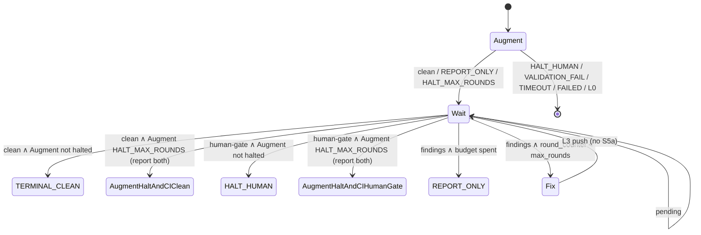

# CI wait until chosen checks complete

Delta on Wave 8. Not a new monitor. `fsm.py` unchanged.

## 1. Problem

Two abort paths on PR #237 while Test 3.10/3.11/3.12 were still `pending`:

1. Wave 8 armed only after Augment `clean` / `REPORT_ONLY`. `HALT_MAX_ROUNDS` skipped the wait.
2. `as_array` on empty `gh` stdout → `--argjson ""` → `set -e` kill. No JSON line.

`classify_checks` already maps `pending` → `polling`. Keep that.

## 2. Thesis: wait ≠ fix

| Job | Rounds? | Blocked by `HALT_MAX_ROUNDS`? |
|-----|---------|-------------------------------|
| Wait until chosen list has no `pending` | No | **No** |
| Auto-fix parseable CI findings | Yes | **Yes** |



```mermaid
sequenceDiagram
    participant SKILL
    participant Poll as poll-ci-checks.sh
    participant Cls as classify_checks

    SKILL->>SKILL: Augment terminal
    alt HALT_MAX_ROUNDS / clean / REPORT_ONLY
        SKILL->>SKILL: source=ci, elapsed=0
        loop until not pending or timeout
            SKILL->>Poll: --pr --repo
            Poll-->>SKILL: one JSON line (always)
            SKILL->>Cls: payload, wait_sha
            alt polling
                SKILL->>SKILL: sleep ≥30s
            else human-gate after Augment HALT_MAX_ROUNDS
                SKILL->>SKILL: preserve HALT_MAX_ROUNDS; report CI human-gate alongside it
            else human-gate after Augment clean / REPORT_ONLY
                SKILL->>SKILL: HALT_HUMAN
            else clean after Augment HALT_MAX_ROUNDS
                SKILL->>SKILL: preserve HALT_MAX_ROUNDS; report CI clean alongside it
            else clean after Augment clean / REPORT_ONLY
                SKILL->>SKILL: transition(clean) → TERMINAL_CLEAN
            else findings and budget left
                SKILL->>SKILL: Waves 3–5
            else findings and halted
                SKILL->>SKILL: REPORT_ONLY
            end
        end
    end
```

## 3. Wave 8 arm table

| Augment terminal | Arm wait? | CI auto-fix? |
|------------------|-----------|--------------|
| `TERMINAL_CLEAN` / `REPORT_ONLY` | Yes | If `round_counter < max_rounds` |
| `HALT_MAX_ROUNDS` | Yes, wait-only; retain Augment terminal status and report CI outcome alongside it | No (`findings` → `REPORT_ONLY`) |
| `HALT_HUMAN` / `VALIDATION_FAIL` / `TERMINAL_TIMEOUT` / `TERMINAL_FAILED` | No | No |
| L0 | No | No |

## 4. Poller (`poll-ci-checks.sh`)

Distinguish **parsed empty array** from **parse miss**.

The poller validates each response with `jq -es` to require exactly one JSON array, including when stdout is empty or contains concatenated arrays. `as_array` uses `${1:-[]}` and `jq -cs` so each `--argjson` argument is exactly one array, never an empty string. Choose a valid nonempty required list; otherwise choose the all-checks list. A chosen `[]` is `clean` **only when both queries parsed successfully**. If the chosen list is empty and either query did not parse, emit `state:polling` with `checks:[]`. With nonempty checks, pending wins over failure; otherwise fail/cancel or `action_required` → findings, pass/skipping → clean.

Head re-sample after checks stays.

Usage errors still exit 2. Completed poll always one JSON line, exit 0 (FR-W6).

## 5. `classify_checks` (one new branch)

Insert **before** empty → `clean`:

```
if payload.get("state") == "polling" and not checks:
    return STATE_POLLING
```

Then existing: empty → clean; pending wins mix; fail/cancel → findings.

Non-dict payload stays `clean` (poller never feeds it). No `gh`/`git` tokens.

## 6. SKILL

Wave 8 bullet: arm wait on `clean` / `REPORT_ONLY` / `HALT_MAX_ROUNDS`. Same poll swap + elapsed reset.

After halt: do not dispatch Waves 3–5 on CI findings. Keep Augment `HALT_MAX_ROUNDS` as the FSM/status result and report CI clean, failure, timeout, or human-gate alongside it; no terminal-state transition. Do not add an output-schema field.

`refs/ci-poll.md`: copy the arm table + parse-miss rule.

`refs/state-machine.md`: SKILL-owned wait after halt. No new `MonitorState`.

Parent spec **FM-CI-7**: wait starts on `HALT_MAX_ROUNDS`; fix does not.

## 7. File manifest

| File | Change |
|------|--------|
| `scripts/poll-ci-checks.sh` | `is_array` / `as_array "${1:-[]}"` / parse miss → `state:polling` |
| `src/superclaude/pr_submit/ci.py` | FR-W9 branch |
| `SKILL.md` Wave 8 | arm table |
| `refs/ci-poll.md` | arm table + parse miss |
| `refs/state-machine.md` | wait after halt |
| `tests/pr_submit/test_ci_classify.py` | mix pending; `{state:polling,checks:[]}` |
| `.dev/specs/pr-submit-ci-monitor.md` FM-CI-7 | rewrite |

No `fsm.py`. `make sync-dev` after skill edits.

## 8. Tests

| Test | Asserts |
|------|---------|
| existing pending/pass/empty/fail | unchanged |
| mix `{pass, pending}` → `polling` | FR-W1 |
| `{state:"polling", checks:[]}` → `polling` | FR-W9 |
| `{checks:[]}` no state → `clean` | FR-W8 |
| T-104 | still green |

Poller empty-stdout: optional one-liner `as_array` via extracting the function, or skip if static. Don't add a gh mock suite.

## 9. Non-goals

New skill/FSM/`EventType`/`--monitor`. `--ci-timeout`. Second round counter. `gh run rerun`. Codecov-by-name.

E9: nonempty `--required` ignores optional pending. "ALL" = chosen list.

## 10. Implement order

1. `ci.py` FR-W9 + mix/polling-empty tests.
2. Poller `is_array`/`as_array`.
3. SKILL + `ci-poll.md` + `state-machine.md` + FM-CI-7.
4. `make sync-dev`. `uv run pytest tests/pr_submit/test_ci_classify.py tests/pr_submit/test_static_grep.py -q`.

<!--mc:threads:begin-->
<!--mc:rev {"ts":"2026-09-25T01:15:55.185Z","contentHash":"59d649f3","sections":[{"heading":null,"hash":"03272061"},{"heading":"CI wait until chosen checks complete","hash":"479eab75"},{"heading":"1. Problem","hash":"2b189352"},{"heading":"2. Thesis: wait ≠ fix","hash":"15edaa1d"},{"heading":"3. Wave 8 arm table","hash":"e25e343b"},{"heading":"4. Poller (`poll-ci-checks.sh`)","hash":"0400aafb"},{"heading":"5. `classify_checks` (one new branch)","hash":"e495efeb"},{"heading":"6. SKILL","hash":"b3ad284e"},{"heading":"7. File manifest","hash":"7ffb82fd"},{"heading":"8. Tests","hash":"b2c08af4"},{"heading":"9. Non-goals","hash":"03338ae2"},{"heading":"10. Implement order","hash":"6b21b971"}]}-->
<!--mc:threads:end-->
