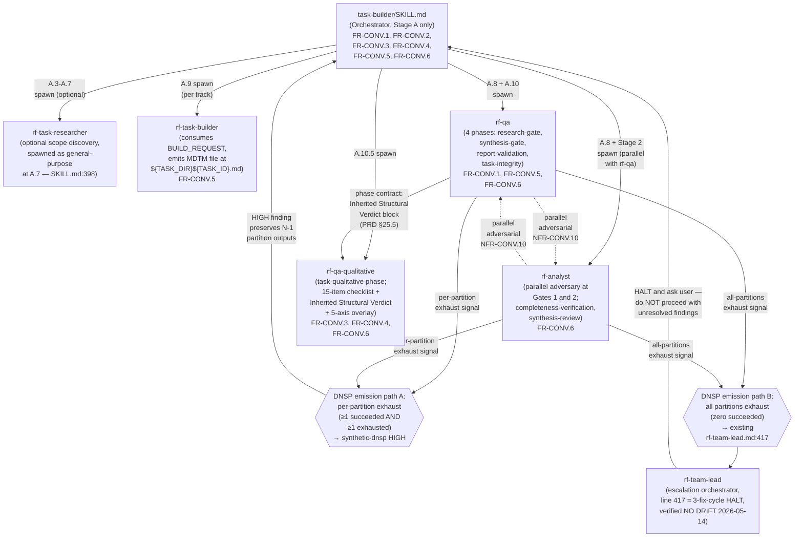

# Synthesis: TDD §6 Architecture

**Status:** Complete
**Date:** 2026-05-14
**Agent type:** Synthesis subagent (template-aligned content for TDD §6 Architecture)
**Source research:** research-docs 01-07, 14, and qa/research-gate-consolidated.md
**Applies synthesis-time constraints:** SC-2 (DNSP partial-vs-all-fail semantics — codified in §6.1 / §6.2), SC-4 (per-gate fix-cycle cross-file coupling — codified in §6.4 rows 5 and 7), SC-6 (corrected FR order: FR-CONV.1 → .2 → .3 → .4 → .5 → .6), SC-8 (cite rf-qa.md:141-142 for the zero-trust verdict).

---

## 6. Architecture

### 6.1 High-Level Architecture

The Task-Builder Convergence v3.9 release modifies an existing single-stage orchestration pipeline. The `task-builder` SKILL.md is the orchestrator (Stage A only — there is no Stage B; `SKILL.md:12, 141`). It is fed a `BUILD_REQUEST` contract by the `/tdd` skill orchestrator (or invoked standalone), runs the A.1–A.11 pipeline, and emits a validated MDTM task file. The six FR-CONV functional requirements are **strictly additive** insertions onto this existing topology (A-002 governance, research-doc 14 §3 FR-CONV.1 Negative Criterion) — no existing pipeline stage, agent, or checklist item is renamed or removed.

The diagram below shows the orchestration, the four sequential adversarial gates, the agents that run each gate, the `rf-team-lead` escalation guard, and the six FR-CONV insertion-point annotations.

```
              /tdd skill orchestrator  ──┐
                                         │  emits Skill-tool prompt
                                         ▼
              ┌─────────────────────────────────────────────────────┐
              │  BUILD_REQUEST  (input contract)                    │
              │  15 fields: GOAL, WHY, TASK_ID_PREFIX, TEMPLATE,    │
              │  QA_GATE_REQUIREMENTS, VALIDATION_REQUIREMENTS,     │
              │  TESTING_REQUIREMENTS, DOC STALENESS WARNINGS,      │
              │  RESEARCH DIR, QUALITY GATE RESULTS, OPEN QUESTIONS,│
              │  REMAINING GAPS, granularity req, incremental-write │
              │  block, TASK FILE LOCATION   (SKILL.md:716-848)     │
              └─────────────────────────────────────────────────────┘
                                         │
                                         ▼
   ┌──────────────────────────────────────────────────────────────────────┐
   │  task-builder SKILL.md  —  ORCHESTRATOR  (Stage A, A.1-A.11)          │
   │  A.1 Resume detect   A.2 Parse & triage   A.3 Scope discovery         │
   │  A.4 Write research-notes.md   A.5 Self-Review Gate (max 2 rounds)    │
   │  A.6 Template triage   A.7 Spawn researchers (3-8, parallel)          │
   │                                                                      │
   │   ◄── [FR-CONV.2]  Execution Context header — inserted at MDTM       │
   │        template top + builder-spawn anchor SKILL.md:719;             │
   │        scope-confined "no speculative file paths" (header only)      │
   └──────────────────────────────────────────────────────────────────────┘
                                         │
                                         ▼
   ┌──────────────────────────────────────────────────────────────────────┐
   │  A.9  SPAWN rf-task-builder  (one per track, BUILD_REQUEST consumer)  │
   │  Emits MDTM file ${TASK_DIR}${TASK_ID}.md (incremental write)         │
   │  3 return flows: RESEARCH_NEEDED (max 2) · MALFORMED (max 2,          │
   │  separate counter) · NEED_USER_INPUT → Open Questions                │
   │  Combined max invocations = 4   (SKILL.md:852-870, 1550)             │
   │                                                                      │
   │   ◄── [FR-CONV.5]  Retry monotonicity — rf-task-builder.md:336-359   │
   │        I16 fix-cycle table + two new HALTs:                          │
   │        |F_{n+1}| > |F_n|  HALT  ·  PASS@N → FAIL@N+1  HALT           │
   └──────────────────────────────────────────────────────────────────────┘
                                         │
       ════════════════ 4-STAGE ADVERSARIAL GATE TOPOLOGY ════════════════
                                         │
   ┌──────────────────────────────────────────────────────────────────────┐
   │  STAGE 1 — A.8 RESEARCH GATE          (parallel adversarial pair)     │
   │  ┌────────────────────────────┐   ┌────────────────────────────────┐ │
   │  │ rf-qa                      │   │ rf-analyst                     │ │
   │  │ QA_MODE: research-gate     │ ‖ │ analysis_type:                 │ │
   │  │ fix_authorization: false   │   │  completeness-verification     │ │
   │  │ 10-item checklist          │   │ 8-item checklist               │ │
   │  │ (rf-qa.md:96-141)          │   │ (rf-analyst.md:91-129)         │ │
   │  └────────────────────────────┘   └────────────────────────────────┘ │
   │  Partition 2+2 when >6 research files. Gap-fill cycle max 3 rounds.   │
   │  Zero-trust verdict: any gap any severity = FAIL (rf-qa.md:141-142)   │
   │                                                                      │
   │   ◄── [FR-CONV.6]  DNSP emission edit site — rf-qa.md:70-77 +        │
   │        rf-analyst.md:60-69 (new sub-section, per-partition exhaust)  │
   └──────────────────────────────────────────────────────────────────────┘
                                         │  PASS
                                         ▼
   ┌──────────────────────────────────────────────────────────────────────┐
   │  STAGE 2 — SYNTHESIS GATE             (parallel adversarial pair)     │
   │  ┌────────────────────────────┐   ┌────────────────────────────────┐ │
   │  │ rf-qa                      │   │ rf-analyst                     │ │
   │  │ QA_MODE: synthesis-gate    │ ‖ │ analysis_type:                 │ │
   │  │ fix_authorization: true    │   │  synthesis-review              │ │
   │  │ 12-item checklist          │   │ 10-item checklist              │ │
   │  │ (rf-qa.md:146-211)         │   │ (rf-analyst.md:218-281)        │ │
   │  └────────────────────────────┘   └────────────────────────────────┘ │
   │  Partition 2+2 when >6 synthesis files.                              │
   │                                                                      │
   │   ◄── [FR-CONV.6]  DNSP emission edit site (same contract as Stage 1)│
   └──────────────────────────────────────────────────────────────────────┘
                                         │  PASS
                                         ▼
   ┌──────────────────────────────────────────────────────────────────────┐
   │  STAGE 3 — REPORT VALIDATION          (single agent)                 │
   │  rf-qa  ·  QA_MODE: report-validation  ·  fix_authorization: true    │
   │  19-item checklist (15 + 4 content-quality)  (rf-qa.md:215-256)       │
   └──────────────────────────────────────────────────────────────────────┘
                                         │  PASS
                                         ▼
   ┌──────────────────────────────────────────────────────────────────────┐
   │  STAGE 4 — A.10 TASK INTEGRITY GATE   (single agent)                 │
   │  rf-qa  ·  QA_MODE: task-integrity  ·  fix_authorization: true       │
   │  Existing 20-item checklist (rf-qa.md:266-287)                        │
   │                                                                      │
   │   ◄── [FR-CONV.1]  +8 TB-Add structural checks merged here           │
   │        (rf-qa.md:266-287; restated SKILL.md:1389-1398).              │
   │        Existing items preserved verbatim; additive only.            │
   └──────────────────────────────────────────────────────────────────────┘
                                         │  PASS
                                         ▼
   ┌──────────────────────────────────────────────────────────────────────┐
   │  STAGE 4 (cont.) — A.10.5 TASK QUALITATIVE GATE   (single agent)      │
   │  rf-qa-qualitative  ·  QA_PHASE: task-qualitative                    │
   │  fix_authorization: true                                             │
   │  Existing 15-item checklist (rf-qa-qualitative.md:527-562),          │
   │  TARGET_FILE_LIST — no spot-checking (SKILL.md:931).                 │
   │  Partition by assigned_phases when >15 items.                        │
   │                                                                      │
   │   ◄── [FR-CONV.3]  Inherited Structural Verdict block appended       │
   │        after rf-qa-qualitative.md:794; consumes rf-qa task-          │
   │        integrity verdict via "## Inherited Structural Verdict".     │
   │        Anti-inflation rule :766-775 MUST NOT be weakened.           │
   │   ◄── [FR-CONV.4]  5-axis adversarial overlay — header inserted      │
   │        before rf-qa-qualitative.md:527; Items-Reviewed table        │
   │        (:689-693) gains an Axis column. Overlay-only, no code path. │
   └──────────────────────────────────────────────────────────────────────┘
                                         │  PASS
                                         ▼
   ┌──────────────────────────────────────────────────────────────────────┐
   │  A.11  PRESENT RESULTS                                               │
   │  MDTM task file path + 4 gate statuses + item count + /task <path>   │
   └──────────────────────────────────────────────────────────────────────┘


   ESCALATION GUARD  (orthogonal to the linear pipeline)
   ┌──────────────────────────────────────────────────────────────────────┐
   │  rf-team-lead.md:417  —  "max 3 cycles per phase ... HALT and ask    │
   │  user — do NOT proceed with unresolved findings."                    │
   │  VERIFIED NO DRIFT 2026-05-14: PRD-cited line 417 == current source. │
   │                                                                      │
   │  DNSP interaction (FR-CONV.6, mutually exclusive paths):             │
   │   • ≥1 partition succeeded AND ≥1 partition exhausted                │
   │       → emit synthetic-dnsp HIGH finding for exhausted partition     │
   │   • zero partitions succeeded (all exhausted)                        │
   │       → fall through to existing rf-team-lead.md:417 HALT (NO DNSP)  │
   └──────────────────────────────────────────────────────────────────────┘
```

**Notes on the diagram (current-verified anchors):**

- The four gates are sequential; the Stage-1 and Stage-2 pairs run their two agents *in parallel* (`‖`), reading the same artifacts independently (`rf-qa.md:105`, `rf-analyst.md:41-69`). NFR-CONV.10 forbids serial chaining of the rf-qa / rf-analyst cohort.
- `fix_authorization` is `false` only at Stage 1 (research-gate flags issues, does not fix — `rf-qa.md:96-141`); it is `true` at Stages 2, 3, and 4 (`rf-qa.md:201-211, 249-255`; A.10/A.10.5 per `SKILL.md:872-1000`).
- The per-gate fix-cycle limits (research-gate 3 / synthesis-gate 2 / report-validation 3 / task-integrity 2 / qualitative 3) are defined in `rf-task-builder.md:352-358` (I16 table), **not** in `rf-qa.md`, which carries only the global max of 3 (`rf-qa.md:311`). FR-CONV.5 layers the monotonicity HALTs on top of these caps (SC-4).
- `rf-team-lead` is not invoked directly by `SKILL.md` (Critical Rule #13 forbids team infrastructure for this skill — `SKILL.md:1552`). It is the escalation orchestrator for the FR-CONV.6 DNSP path: the orchestrator surfaces an exhausted-partition signal to the existing `rf-team-lead.md:417` guard, which DNSP must not short-circuit (research-doc 07 §5; research-doc 14 §3 FR-CONV.6 Negative Criterion).

### 6.2 Component Diagram

The component graph below shows the agents, their spawn relationships, the parallel adversarial pairings at Gates 1 and 2, and the two mutually-exclusive DNSP emission paths. Each component is annotated with the FR(s) that modify it.



**Component-to-FR annotations (per task brief and research-doc 14 §3):**

| Component | File anchor | Modifying FRs |
|---|---|---|
| `task-builder/SKILL.md` | `src/superclaude/skills/task-builder/SKILL.md` (1,709 lines) | FR-CONV.1, FR-CONV.2, FR-CONV.3, FR-CONV.4, FR-CONV.5, FR-CONV.6 |
| `rf-qa.md` | `src/superclaude/agents/rf-qa.md` (432 lines) | FR-CONV.1, FR-CONV.5, FR-CONV.6 |
| `rf-qa-qualitative.md` | `src/superclaude/agents/rf-qa-qualitative.md` (794 lines) | FR-CONV.3, FR-CONV.4, FR-CONV.6 |
| `rf-analyst.md` | `src/superclaude/agents/rf-analyst.md` (349 lines) | FR-CONV.6 |
| `rf-task-builder.md` | `src/superclaude/agents/rf-task-builder.md` (493 lines) | FR-CONV.5 |
| `rf-team-lead.md` | `src/superclaude/agents/rf-team-lead.md` (431 lines) | UNMODIFIED — line 417 NO-DRIFT preservation only (research-doc 07 §9) |

**Notes on the component diagram:**

- The `rf-task-researcher` node represents the optional scope-discovery agent. In current `SKILL.md` the A.7 researchers are spawned as `general-purpose` (line 398), not as a dedicated `rf-task-researcher` subagent type. The task brief lists this as a planned consolidation; the diagram uses the brief's name with the source-anchored caveat. [UNVERIFIED in current SKILL.md — research-doc 01 §7]
- The dashed bidirectional edge between `rf-qa` and `rf-analyst` represents the **parallel-adversarial** pairing at Gates 1 and 2. NFR-CONV.10 (research-doc 14 §1) mandates concurrent spawn; the orchestrator merges reports post-hoc with "union of findings, take the more severe rating for shared items" (`rf-qa.md:77`, `rf-analyst.md:69`).
- The two DNSP nodes (`DNSP_PARTIAL`, `DNSP_ALL`) are mutually exclusive by success-count (research-doc 07 §5). The orchestrator must check global partition success-count before emitting; if zero, fall through to the existing `rf-team-lead.md:417` escalation, **never** emit DNSP in this branch (FR-CONV.6 Negative Criterion, PRD line 540).
- `rf-qa` → `rf-qa-qualitative` carries the structural verdict via the phase contract block (see §6.3 Inter-agent boundary; PRD §25.5 names this "Inherited Structural Verdict"). Anti-inflation rule at `rf-qa-qualitative.md:766-775` forbids citing the inherited verdict as evidence for any item; FR-CONV.3 INV-019 operationalizes this via mandatory Self-Audit.

### 6.3 System Boundaries

The Task-Builder Convergence release operates entirely inside the SuperClaude framework. It introduces **no new external dependency** — NFR-CONV.5 constrains all six FRs to existing tooling only (Read, Grep, Glob, Bash). The boundaries below define what crosses into and out of the modified pipeline.

| Boundary | Direction | Contract | Anchor / Evidence |
|---|---|---|---|
| **Upstream — BUILD_REQUEST** | Inbound | Skill-tool prompt in the 15-field `BUILD_REQUEST` format emitted by the `/tdd` skill orchestrator (or constructed by `task-builder` SKILL.md for standalone use). Fields: GOAL, WHY, TASK_ID_PREFIX, TEMPLATE, QA_GATE_REQUIREMENTS, VALIDATION_REQUIREMENTS, TESTING_REQUIREMENTS, DOCUMENTATION STALENESS WARNINGS, RESEARCH DIR, QUALITY GATE RESULTS, OPEN QUESTIONS, REMAINING GAPS, granularity requirement, incremental-write block, TASK FILE LOCATION. | `SKILL.md:716-848`; `rf-task-builder.md:90-99` (canonical schema) |
| **Downstream — MDTM task file** | Outbound | A single validated MDTM task file written to `.dev/tasks/to-do/TASK-*/` (`.dev/tasks/to-do/TASK-RF-<YYYYMMDD-HHMMSS>/TASK-RF-<YYYYMMDD-HHMMSS>.md` for this skill). Written incrementally: header first, then one phase per Edit, then Task Log last. Returned as the builder's final output (no broadcast). | `SKILL.md:819-835, 1002-1071`; `rf-task-builder.md:168-196, 465` |
| **External dependencies** | — | **NONE.** NFR-CONV.5 — no new network calls, no new MCP servers, no new libraries. All six FRs use only the existing tool surface: Read, Grep, Glob, Bash. The DNSP emission, the 5-axis overlay, the Inherited Structural Verdict block, and the monotonicity HALTs are all prompt-and-checklist changes (CB-3 "overlay-only" constraint for FR-CONV.4). | research-doc 14 §4 ("uses only the existing tooling permitted by NFR-CONV.5"); research-doc 14 §3 FR-CONV.4 Negative Criterion |
| **Inter-agent — rf-qa → rf-qa-qualitative** | Internal phase contract | The structural verdict produced by `rf-qa` at the A.10 task-integrity gate is passed to `rf-qa-qualitative` at A.10.5 via a `## Inherited Structural Verdict` block (PRD §25.5). The block surfaces the structural PASS/FAIL as *context only* — `rf-qa-qualitative` MUST NOT mark any item VERIFIED solely from the inherited verdict, and MUST re-read the verdict at every fix cycle (no stale cross-cycle carryover). | research-doc 14 §3 FR-CONV.3 Negative Criterion (PRD line 499); `rf-qa-qualitative.md:794` insertion site, anti-inflation `:766-775` |
| **Inter-agent — rf-qa ‖ rf-analyst** | Internal parallel pairing | At Gates 1 and 2, `rf-qa` and `rf-analyst` run concurrently over the same artifact set, each producing an independent report. Neither can suppress the other; the orchestrator reconciles (union of findings, severer rating wins on shared items). Serial chaining is explicitly forbidden. | `rf-qa.md:105`; `rf-analyst.md:41-69, 309`; NFR-CONV.10 (research-doc 14 §1) |
| **Inter-agent — orchestrator → rf-team-lead** | Internal escalation | On all-partitions-exhaust, the orchestrator hands off to the existing `rf-team-lead.md:417` HALT guard. DNSP emission must finalize all DNSP artifacts before `rf-team-lead`'s Cleanup section (lines 422-431) tears down teammates. | research-doc 07 §5, §7 |

### 6.4 Key Design Decisions

The eight design decisions below were identified across the SOLUTION_RESEARCH notes (research-docs 01, 02, 07, 14 and the consolidated research gate). Each cites the verified operational source for its rationale.

| # | Decision | Choice | Rationale | Alternatives Considered |
|---|---|---|---|---|
| 1 | Intent-port over implementation-port | Adapt the sc-tasklist *intent* (5 mechanisms: TB-Add catalogue, Execution Context header concept, Inherited Structural Verdict origin, Five Adversarial Axes naming, monotonicity + regression stop-conditions) — **not** its implementation. | Cross-paradigm merger pattern from FINAL-REPORT §6.3: the execution-context paradigm of `task-builder` (single MDTM file, runtime checklist) differs from the generation-context paradigm of `sc-tasklist` (multi-file phase bundle, Sprint-CLI index). Only one of the five mechanisms (the 5 axes, `sc-tasklist SKILL.md:1112-1117`) is a literal source; the rest are concept-ports. | Bulk-import sc-tasklist implementations — **REJECTED**: would re-introduce the over-engineering pattern from v3.8 and import bundle-specific machinery (phase-file naming, index references, T-ID format) that has no analogue in single-MDTM output (research-doc 02 §1, §2). |
| 2 | Additive-only governance (A-002) | All 6 FR-CONV requirements are strictly additive — no existing checklist item, pipeline stage, or agent phase is renamed, renumbered, or removed. | Per-FR rollback granularity and low blast radius: each FR Negative Criterion forbids modification of existing surfaces (e.g., FR-CONV.1 preserves the 20-item A.10 checklist verbatim; FR-CONV.4 keeps the 15-item task-qualitative body byte-stable). | Single-FR mega-merge — **REJECTED**: collapsing the six PRs into one change eliminates per-FR rollback granularity and makes the blast radius the entire pipeline (research-doc 14 §3 FR-CONV.1/.4 Negative Criteria). |
| 3 | Per-check classification (CB-3) | Import only the 8 unique TB-Add checks, not all 17 (actually 20) sc-tasklist Stage-6 checks. Of the 20 numbered checks, only 6 are direct imports (sc-tasklist checks 11, 13, 14, 15, 16, 17); the remaining 2 TB-Adds are synthesized from the Minimum Task Specificity Rule. | Bundle-specific checks — phase-file naming, index references, checkpoint-emission, T-ID format — are inapplicable to a single-MDTM output. 11 of the 20 sc-tasklist checks are bundle-specific (REJECTED-bundle-specific), 3 are not-relevant (tier/deliverable/R-ID schemes). | Bulk-port all 17/20 checks — **REJECTED per CB-3**: would land domain-mismatched checks into rf-qa task-integrity, weakening adversarial coverage with checks that can never fire (research-doc 02 §2; research-doc 14 §3 FR-CONV.1). |
| 4 | G6 four-case rule as authoritative tiebreaker | Per-proposal CASE A/B/C/D classification governs conflict resolution between the imported intent and the existing task-builder mechanism. A conflict-register row is required for CASE-A and CASE-D; CASE-B and CASE-C are correctly silent. | Makes conflict resolution auditable: e.g., PR-04 (Inherited Structural Verdict) is CASE-B — sc-tasklist has the conceptual mechanism (traceability inheritance) but is silent on structural-verdict passthrough, so no conflict-register row is needed. | Implicit precedence rules — **REJECTED**: opaque and non-auditable; a reviewer could not determine why a given conflict resolved the way it did (research-doc 02 §1(c)). |
| 5 | Determinism scope split (NFR-CONV.1 vs NFR-CONV.2) | Structural fields (checklist item schema, gate verdicts, TB-Add check IDs, the Axis column) are byte-deterministic; research-prose nondeterminism (free-text Context narration, finding descriptions) is acceptable. | LLM determinism is achievable on structured output but not on free prose. Gate verdicts and the 8 TB-Add checks must be reliable enough to drive PASS/FAIL; the prose surrounding them need not be byte-identical across runs. | Full byte-determinism — **REJECTED**: impossible with an LLM-driven builder. Zero determinism — **REJECTED**: gate verdicts must be reliable or the four-stage gate topology is meaningless (research-doc 14 §4 fixture-determinism note). |
| 6 | Anti-inflation rule absolute (`rf-qa-qualitative.md:766-775`) | FR-CONV.3's Inherited Structural Verdict permits skipping the *mechanical* re-check of structural items, but mandates a Self-Audit listing ≥1 independent semantic check; the anti-inflation rule itself is byte-stable. | INV-019 makes the rule auditable: every VERIFIED item must show an independent semantic-check engagement in the Self-Audit listing. K-003 designates the first 5 runs as an audit-target for this behavior. | Strict mechanical re-check — **REJECTED**: wastes fix cycles re-verifying what rf-qa already structurally confirmed. Pure passthrough — **REJECTED**: rubber-stamp risk; an inherited PASS would silently become a semantic VERIFIED (research-doc 04 §3; research-doc 14 §3 FR-CONV.3 Negative Criterion). |
| 7 | All-agents-fail guard precedence (`rf-team-lead.md:417`, NO DRIFT) | DNSP emits a synthetic-dnsp HIGH finding only when ≥1 partition succeeded **AND** ≥1 partition exhausted; zero-partitions-succeeded falls through to the existing `rf-team-lead.md:417` escalation. Line 417 verified NO DRIFT against current source on 2026-05-14. | Preserves the established multi-fix-cycle escalation. DNSP adds coverage for the partial-failure case that previously aborted silently, without short-circuiting the "stop the line" HALT. The two paths are logically disjoint by success-count. | DNSP always emits on any exhaust — **REJECTED**: would short-circuit the all-agents-fail escalation and mask a total-failure condition as a best-effort partial. No DNSP at all — **REJECTED**: leaves the partial-failure case silent (research-doc 07 §5, §6; research-doc 14 §3 FR-CONV.6). |
| 8 | Dedup-key composition with monotonicity (INV-012) | Synthetic-dnsp findings count as `|F_n|` failures for FR-CONV.5 monotonicity purposes; an identical dedup-key recurring across consecutive cycles is treated as a dedup event, **not** a regression. | Enables FR-CONV.5's monotonicity guard (`|F_{n+1}| > |F_n|` HALT, `PASS@N → FAIL@N+1` HALT) to compose cleanly with FR-CONV.6 emissions without false-regression halts — the dedup-key collapse must not cross-cycle. | Pure cardinality counting — **REJECTED**: produces false regressions when the same dedup event repeats. Cross-cycle ignore of synthetic findings — **REJECTED**: would mask repeated defects from the monotonicity guard entirely (research-doc 14 §2 INV-012; FR-CONV.6 Negative Criterion, PRD line 540). |

### 6.5 Multi-Tenancy Architecture

**N/A — internal single-tenant framework.** The Task-Builder Convergence v3.9 modifies an in-repo orchestration pipeline executed in a single SuperClaude session. There is no multi-user surface, no per-tenant data, and no isolation boundary beyond the existing `.dev/tasks/<task-id>/` persistence convention (NFR-CONV.8, research-doc 14 §1 invariant #3). The Ban-N/A rule (`rf-qa-qualitative.md:93`, `:564`) requires an adapted rationale rather than omission: this is a framework convention with ephemeral subagent invocations and no client-facing state, so no multi-tenancy model is required.

---

**Status:** Complete
