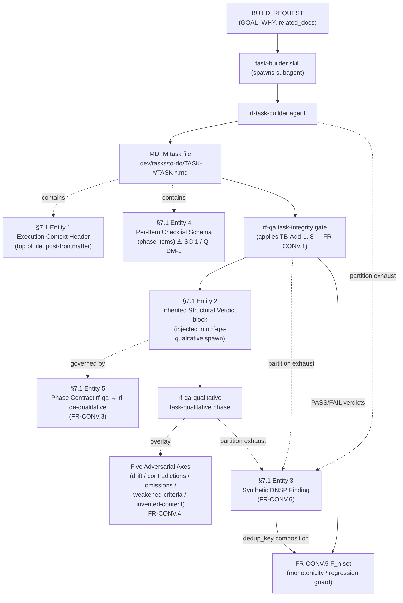

# Synthesis 04 — TDD §7 Data Models

**Status:** In Progress
**Date:** 2026-05-14
**Synthesis agent:** synth-04 (Data Models)
**Source research:** 15-data-models.md, 08-fr1, 09-fr2, 10-fr3, 11-fr4, 12-fr5, 13-fr6, /qa/research-gate-consolidated.md
**Target TDD section:** §7 Data Models

---

## §7 Data Models

### §7.1 Data Entities

The task-builder convergence release defines **five data entities**, all sourced verbatim from PRD §25. Entities 1–3 and 5 are mutually consistent and drift-free. **Entity 4 (Per-Item Checklist Schema) carries a CRITICAL contradiction (SC-1)** between the PRD-asserted schema and the current SKILL.md surface — see Entity 4 and the forward-reference to §22 Open Question Q-DM-1.

---

#### Entity 1: Execution Context Header

**Producer:** FR-CONV.2 (PR-01) — emitted by `rf-task-builder` into every generated MDTM task file, placed after frontmatter / `## Prerequisites & Dependencies` and before the first `## Phase N:` checklist section.
**Source:** PRD §25.1 (`PRD_TASK_BUILDER_CONVERGENCE.md:944-954`).

YAML schema (verbatim from PRD §25.1):

```yaml
"## Execution Context":
  References:        # list of BUILD_REQUEST refs (GOAL, WHY, related-doc IDs)
    - "R-###: <ref-line>"
  Source areas:      # list of named modules/packages — NEVER specific file paths
    - "<package-or-module-name>"
  Key constraints:   # top 1-3 invariants from BUILD_REQUEST
    - "<invariant statement>"
```

| Field | Type | Required | Description | Constraints |
|-------|------|----------|-------------|-------------|
| `References` | list[string] | Yes | BUILD_REQUEST refs (GOAL, WHY, related-doc IDs) | Each item formatted `"R-###: <ref-line>"` (PRD §25.1:948-949) |
| `Source areas` | list[string] | Yes (omitted under degradation) | Named modules / packages | **NEVER specific file paths, NEVER `file:line` citations** — hidden-input determinism rule (PRD §25.1:950-951) |
| `Key constraints` | list[string] | Yes, 1–3 items (omitted under degradation) | Top invariants pulled verbatim from BUILD_REQUEST | Bounded 1–3 entries (PRD §25.1:952 inline comment) |

**Block-level degradation rule:** When BUILD_REQUEST is minimal (GOAL only — no WHY, no `related_docs`, no surfacable constraints), the block **degrades to References-only**; `Source areas` and `Key constraints` are **explicitly omitted** (not blank-but-present). The §25.1 YAML shows the maximal form; the degradation behavior is governed at the FR-CONV.2 level (research 09 §2). TB-Add-7 (FR-CONV.1) cross-validates that each `Source areas` entry reappears in ≥1 per-item Context field, and MUST tolerate the degraded form.

---

#### Entity 2: Inherited Structural Verdict Block

**Producer:** FR-CONV.3 (PR-04) — the task-builder orchestrator (executing A.10.5) extracts rf-qa's `task-integrity` verdict and injects this block into the `rf-qa-qualitative` spawn prompt.
**Source:** PRD §25.2 (`PRD_TASK_BUILDER_CONVERGENCE.md:956-963`).

YAML schema (verbatim from PRD §25.2):

```yaml
"## Inherited Structural Verdict":
  rf_qa_table_verbatim: <copy of rf-qa task-integrity table at spawn time>
  prompt_directive: "PASS items machine-verified — skip structural re-checking; FAIL items machine-verified defects — flag HIGH. Focus on semantic quality."
  reinjection_rule: "On fix-cycle re-run, orchestrator MUST re-inject the NEW verdict; stale verdicts forbidden."
```

| Field | Type | Required | Description | Constraints |
|-------|------|----------|-------------|-------------|
| `rf_qa_table_verbatim` | string / markdown block | Yes | Verbatim copy of rf-qa's `task-integrity` Items Reviewed table (+ Overall Verdict line + Summary counts) at spawn time | Byte-exact copy — no editing, no summarization, no field-renaming (PRD §25.2:960) |
| `prompt_directive` | string | Yes | Directive to rf-qa-qualitative on how to consume the verdict | **Fixed value** (PRD §25.2:961): `"PASS items machine-verified — skip structural re-checking; FAIL items machine-verified defects — flag HIGH. Focus on semantic quality."` |
| `reinjection_rule` | string | Yes | Freshness rule | **Fixed value** (PRD §25.2:962): `"On fix-cycle re-run, orchestrator MUST re-inject the NEW verdict; stale verdicts forbidden."` |

**Governing rules (research 10):**

- **freshness_rule — cycle-N+1 reinjection (INV-002):** On every fix-cycle spawn (cycle 1, 2, 3 …), the orchestrator MUST re-read the *current* rf-qa task-integrity report and re-extract the table. The cycle-N verdict is discarded when cycle-N+1 is injected; **no stale verdict from a prior cycle may govern current-cycle decisions** (PRD §25.2:962 + research 10 §3).
- **enumeration_rule — dynamic checklist (INV-010):** The injected verdict table's row count is *not* fixed — it enumerates over the TB-Add catalogue at runtime, so the block auto-richens when FR-CONV.1 adds TB-Add items. This is why FR-CONV.1 must land 1st and FR-CONV.3 3rd (research 10 §4).
- **consumer_obligation — Self-Audit (INV-019):** rf-qa-qualitative's first run after FR-CONV.3 lands MUST produce a `## Self-Audit` section listing every relied-on rf-qa PASS item **AND ≥1 semantic check** where rf-qa PASS is insufficient. A run with 0 semantic-beyond-PASS entries is a violation, not a clean run (research 10 §5; K-003 audits the first 5 runs).
- **anti_inflation — MUST NOT weaken (`rf-qa-qualitative.md:766-775`):** FR-CONV.3 layers a *deliberately-permitted RELIANCE channel* (skip structural re-checking for PASS items) on top of the anti-inflation rule. It **MUST NOT weaken, remove, or rephrase** the Prohibited Behaviors block at `rf-qa-qualitative.md:766-775` — line 770 ("NEVER mark an item VERIFIED if you only read about it in another report — that is RELIANCE, not VERIFICATION") and line 772 (no padding tool calls) apply unchanged to all *semantic* verification (research 10 §7).

---

#### Entity 3: Synthetic DNSP Finding

**Producer:** FR-CONV.6 (PR-03 BASE) — emitted by a partition agent (`rf-analyst`, `rf-qa`, or `rf-qa-qualitative` partition instance) into its own output stream when its escalation ladder exhausts (twice-retry exhaust) AND ≥1 sibling partition succeeded. Consumed by the task-builder orchestrator merge step.
**Source:** PRD §25.3 (`PRD_TASK_BUILDER_CONVERGENCE.md:965-976`).

YAML schema (verbatim from PRD §25.3):

```yaml
synthetic_dnsp_finding:
  severity: HIGH                                # fixed
  source: "synthetic-dnsp"                      # fixed
  affected_range: "<agent's assigned_files slice>"
  evidence: "<spawn-log path, OR stub citing log absence>"
  recommendation: "Manual review required — partition agent failed twice"
  dedup_key: "(assigned_files_range, escalation_ladder_exhaust_point)"
  found_n_times: <int, default 1>               # increments on dedup collapse
```

| Field | Type | Required | Description | Constraints |
|-------|------|----------|-------------|-------------|
| `severity` | enum | Yes | DNSP severity level | **Fixed = `HIGH`** — non-overridable; guarantees gate-level visibility (PRD §25.3:969) |
| `source` | string | Yes | Origin tag for the finding | **Fixed = `"synthetic-dnsp"`** — literal grep-able sentinel (PRD §25.3:970) |
| `affected_range` | string | Yes | The exhausted agent's `assigned_files` slice | Verbatim copy of the partition's file list as received in the spawn prompt (PRD §25.3:971) |
| `evidence` | string | Yes | Spawn-log path OR explicit stub citing log absence | Never blank — if log missing, stub must explicitly cite the absence (PRD §25.3:972) |
| `recommendation` | string | Yes | Action to operator | **Fixed value** (PRD §25.3:973): `"Manual review required — partition agent failed twice"` |
| `dedup_key` | tuple (2-tuple) | Yes | Identity for dedup-collapse | Composite: `(assigned_files_range, escalation_ladder_exhaust_point)` — canonicalised string form for hash/compare (PRD §25.3:974) |
| `found_n_times` | int | Yes | Collision counter | Default `1`; **increments by 1 on each within-cycle dedup collapse** of an identical `dedup_key` (PRD §25.3:975) |

**Composition note:** `dedup_key` is the identity FR-CONV.5 monotonicity uses to distinguish "same problem persisting across cycles" (NOT a regression) from "new failure mode appeared" (regression). A synthetic-dnsp finding contributes `1` to `|F_n|` exactly like a real finding (INV-012 — see §7.2). The **all-agents-fail guard** has precedence: if **zero** partitions succeeded, no synthetic emits — the existing `rf-team-lead.md:417` 3-fix-cycle escalation runs instead (research 13 §4).

---

#### Entity 4: Per-Item Checklist Schema — ⚠ CRITICAL DRIFT (SC-1 / Q-DM-1)

**Source:** PRD §25.4 (`PRD_TASK_BUILDER_CONVERGENCE.md:978-987`), declared as the `NFR-CONV.6` operational source.

> **⚠ SC-1 CRITICAL CONTRADICTION — surfaced per /qa/research-gate-consolidated.md.**
> PRD §25.4 declares the per-item 5-field schema is "preserved unchanged" and points at `SKILL.md:1452-1457`. **However, the current content at `SKILL.md:1450-1460` is a *different* 5-field schema.** A `grep` of SKILL.md for `Acceptance` and `TB-Add-8` returns **zero hits** (research 15 §4, §9). The two schemas overlap on only **two** fields (`Context`, `Verification`). This is the SC-1 CRITICAL issue from the consolidated research gate and **MUST be resolved by an Engineering Lead before FR-CONV.1 implementation begins.**

**PRD-asserted schema (the target / contract — PRD §25.4):**

```yaml
per_item_schema:
  Description: "<one-line task-item action statement>"
  Context: "<file:line citation OR justified-absence comment>"     # TB-Add-8 enforced
  Acceptance: "<observable success condition>"
  Confidence: "<HIGH|MEDIUM|LOW> — with one-line rationale"
  Verification: "<command, file inspection, or test to confirm Acceptance>"
```

| Field | Type | Required | Description | Constraints |
|-------|------|----------|-------------|-------------|
| `Description` | string | Yes | One-line task-item action statement | Single line; imperative voice (PRD §25.4:982) |
| `Context` | string | Yes | `file:line` citation OR justified-absence comment | **TB-Add-8 enforced** (PRD §25.4:983) — when no citation available, must be a justified-absence comment, not empty |
| `Acceptance` | string | Yes | Observable success condition | Must be observable / verifiable from outside (PRD §25.4:984) |
| `Confidence` | enum {HIGH, MEDIUM, LOW} | Yes | Confidence level with rationale | Must include a one-line rationale alongside the enum value (PRD §25.4:985) |
| `Verification` | string | Yes | Command, file inspection, or test confirming Acceptance | Concrete and executable; pairs with `Acceptance` (PRD §25.4:986) |

**Current `SKILL.md:1450-1460` content (the existing surface — research 15 §4, research 09 Site 3):**

```yaml
phase_item_schema_AS_BUILT:
  Context: "<what the executor needs to know>"
  Action: "<exactly what to do>"
  Output: "<what gets created/modified>"
  Verification: "<how to confirm it worked>"
  Completion gate: "<when this item is done>"
```

| Schema | Field set | Common fields | PRD-only | Current-only |
|--------|-----------|---------------|----------|--------------|
| PRD §25.4 (target) | `{Description, Context, Acceptance, Confidence, Verification}` | `Context`, `Verification` | `Description`, `Acceptance`, `Confidence` | — |
| `SKILL.md:1450-1460` (as-built) | `{Context, Action, Output, Verification, Completion gate}` | `Context`, `Verification` | — | `Action`, `Output`, `Completion gate` |

**This contradiction is documented as Open Question Q-DM-1 in §22 and requires Engineering Lead resolution before FR-CONV.1 implementation.** Three resolution options:

- **(a)** PRD §25.4 is the engineering target; FR-CONV.1 / TB-Add-8 lands a schema migration. **NOTE:** this would contradict A-002 strictly-additive governance unless treated as a *net-new* schema for new MDTM artifacts only (not a rewrite of the existing phase-item template).
- **(b)** The PRD pointer is corrected; the per-item schema remains `{Context, Action, Output, Verification, Completion gate}` and TB-Add-8 enforces `file:line` citation against the **Context** field only.
- **(c)** PRD §25.4 describes a schema documented *elsewhere* (e.g. the `rf-task-builder.md` / `rf-qa.md` per-item enforcement layer rather than `SKILL.md`) — needs scope discovery before deciding.

**Invariant across all three options:** TB-Add-8 enforcement applies to the **Context field** regardless of which schema wins, since *both* schemas contain a `Context` field. The justified-absence syntax for the Context field (e.g. `Context: <none — pure refactor> [justified-absence]`) is a TDD-level gap to canonicalise (research 08 §5, gap 2) independent of Q-DM-1.

---

#### Entity 5: Phase Contract — rf-qa → rf-qa-qualitative

**Producer/consumer:** Formalises the FR-CONV.3 handoff (Entity 2) as a versioned phase contract between the `rf-qa` and `rf-qa-qualitative` agents.
**Source:** PRD §25.5 (`PRD_TASK_BUILDER_CONVERGENCE.md:989-1003`).

YAML schema (verbatim from PRD §25.5):

```yaml
phase_contract:
  producer: rf-qa
  consumer: rf-qa-qualitative
  artifact: "## Inherited Structural Verdict block in spawn prompt"
  schema_version: "1.0.0"
  delivery_semantics: "at-most-once-per-cycle"
  freshness_rule: "On fix-cycle re-run, orchestrator re-injects NEW verdict; stale verdicts forbidden (INV-002)"
  enumeration_rule: "Checklist enumeration is dynamic — auto-picks up TB-Add catalogue from FR-CONV.1 (INV-010)"
  consumer_obligation: "Self-Audit listing relied-on PASS items AND ≥1 semantic check (INV-019)"
  anti_inflation: "Mechanical re-checking SKIPPED for PASS items; semantic verification STILL REQUIRED (rf-qa-qualitative.md:766-775)"
  failure_mode: "If rf-qa fails to emit a verdict, rf-qa-qualitative MUST NOT spawn — gate halts at A.10 before A.10.5"
```

| Field | Type | Required | Description | Constraints |
|-------|------|----------|-------------|-------------|
| `producer` | string | Yes | Upstream agent emitting the artifact | **Fixed = `rf-qa`** (PRD §25.5:993) |
| `consumer` | string | Yes | Downstream agent consuming the artifact | **Fixed = `rf-qa-qualitative`** (PRD §25.5:994) |
| `artifact` | string | Yes | What is exchanged | **Fixed = `"## Inherited Structural Verdict block in spawn prompt"`** (PRD §25.5:995) — byte-matches the Entity 2 header `"## Inherited Structural Verdict"` |
| `schema_version` | string | Yes | Contract version | **Fixed = `"1.0.0"`** (PRD §25.5:996); semver — no upgrade-path policy documented (backlog note) |
| `delivery_semantics` | string | Yes | Delivery guarantee | **Fixed = `"at-most-once-per-cycle"`** (PRD §25.5:997) |
| `freshness_rule` | string | Yes | Reinjection-on-retry rule | On fix-cycle re-run, orchestrator re-injects NEW verdict; stale verdicts forbidden — **INV-002** (PRD §25.5:998) |
| `enumeration_rule` | string | Yes | Checklist-enumeration dynamism | Checklist enumeration dynamic — auto-picks up TB-Add catalogue from FR-CONV.1 — **INV-010** (PRD §25.5:999) |
| `consumer_obligation` | string | Yes | rf-qa-qualitative Self-Audit obligation | Self-Audit listing relied-on PASS items AND ≥1 semantic check — **INV-019** (PRD §25.5:1000) |
| `anti_inflation` | string | Yes | Mechanical-recheck skip rule | Mechanical re-checking SKIPPED for PASS items; semantic verification STILL REQUIRED — **`rf-qa-qualitative.md:766-775`** (PRD §25.5:1001) |
| `failure_mode` | string | Yes | Gate-halt on missing verdict | If rf-qa fails to emit a verdict, rf-qa-qualitative MUST NOT spawn — gate halts at A.10 before A.10.5 (PRD §25.5:1002) |

**Cross-schema consistency (research 15 §6):** All four cross-schema assertions hold — `artifact` byte-matches Entity 2's header; `anti_inflation` preserves `rf-qa-qualitative.md:766-775` per NFR-CONV.9; Entity 3's `dedup_key` + `found_n_times` mechanise the INV-012 `F_n` cardinality; Entity 4's `Context` field is enforced by TB-Add-8. No internal contradictions exist *between* the five schemas — the only material drift is the SC-1 PRD-vs-source contradiction inside Entity 4.

---

### §7.2 Data Flow



**Flow narrative:**

1. **BUILD_REQUEST** (GOAL / WHY / `related_docs`) enters the `task-builder` skill, which spawns the `rf-task-builder` agent.
2. `rf-task-builder` emits the **MDTM task file** with the **Entity 1 Execution Context Header** at the top (after frontmatter / Prerequisites, before `## Phase 1`), followed by phases of **Entity 4** per-item checklist entries.
3. The **rf-qa task-integrity gate** validates the task file, applying **TB-Add-1..8** from FR-CONV.1. (TB-Add-2 is `[ADVISORY]` and does not block; TB-Add-1/3/4/5/6/7/8 block on failure.)
4. On PASS-or-FAIL, rf-qa emits the **Entity 2 Inherited Structural Verdict block** into the `rf-qa-qualitative` spawn prompt — the **Entity 5 Phase Contract** governs this handoff (`at-most-once-per-cycle`, freshness/enumeration/consumer-obligation/anti-inflation rules). If rf-qa fails to emit a verdict, `rf-qa-qualitative` MUST NOT spawn (`failure_mode`).
5. `rf-qa-qualitative` runs its `task-qualitative` phase, applying the **Five Adversarial Axes overlay** (FR-CONV.4) as a per-finding annotation on the existing 15-item checklist.
6. **On partition exhaust at any `rf-*` agent** (twice-retry exhaust with ≥1 sibling partition succeeding): the exhausted agent emits an **Entity 3 Synthetic DNSP Finding** into its output stream. Its `dedup_key` `(assigned_files_range, escalation_ladder_exhaust_point)` composes into the FR-CONV.5 **`F_n`** set, where it counts as a failure for monotonicity but a cross-cycle identical-`dedup_key` is treated as NOT a regression (INV-012). If **zero** partitions succeed, no synthetic emits — `rf-team-lead.md:417` escalation runs instead.

---

### §7.3 Data Storage

| Data Type | Storage | Retention | Backup Strategy |
|-----------|---------|-----------|-----------------|
| MDTM task file | `.dev/tasks/to-do/TASK-*/TASK-*.md` (INV-018 stable layout) | Indefinite — until task moves to `done/` | Git VCS |
| Research artifacts | `.dev/tasks/to-do/TASK-*/research/` | Indefinite | Git VCS |
| QA reports | `.dev/tasks/to-do/TASK-*/qa/` and `.../reviews/` | Indefinite | Git VCS |
| No external data | N/A | N/A | N/A |

All five data entities are **in-band Markdown/YAML artifacts** — there is no external datastore, no database, and no network-delivered payload. Entity 1 and Entity 4 live inside the MDTM task file; Entity 2 and Entity 5 are transient spawn-prompt content (logged to `qa/` spawn logs); Entity 3 is emitted into an agent output stream and merged into a `qa/` report. Persistence and version history are provided entirely by Git on the `.dev/tasks/` tree (OPEN-INV-018 persistent-artifact invariant).

---

**Status:** Complete

