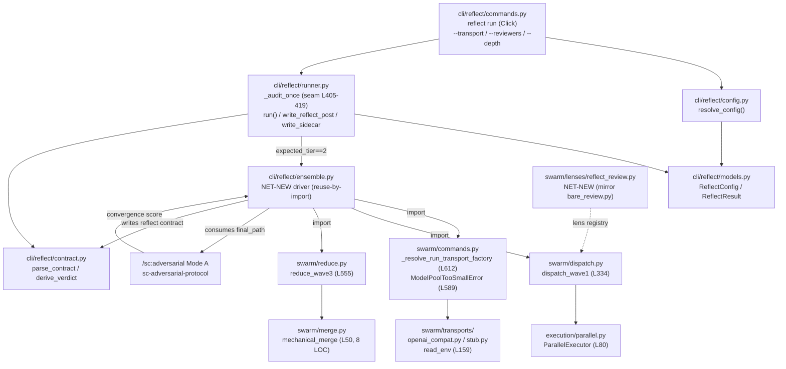

# Synthesis 03 — §6 Architecture (FR-RH2 Headless Ensemble Fix)

- **Feature:** FR-RH2 — drive sc:reflect Tier-2 reviewer ensemble through the swarm dispatch library (headless ensemble fix)
- **Target release:** 4.4.0 | **Complexity:** HIGH (0.82)
- **Source research:** `research/00-prd-extraction.md`, `01-reflect-runner-seam.md`, `03-swarm-dispatch.md`, `04-swarm-transport-pool.md`, `05-swarm-reduce-merge-contract.md`, `06-swarm-lens-registry.md`, `09-reflect-config-cli-surface.md`, `reuse-audit.yaml`
- **Worktree root:** `/config/workspace/IronClaude/.dev/worktrees/ReflectHardening-3/`
- **Status:** Complete

> **Evidence rule:** Every architectural claim below is grounded in a `[CODE-VERIFIED]` finding from the research set (line numbers re-verified against shipped source). No doc-only claims. Components that do not yet exist (`ensemble.py`, `reflect_review.py`, the output template, the stub integration test) are explicitly marked **NET-NEW** and their design is grounded against the verified precedents they mirror.

---

## 6. Architecture

### 6.1 High-Level Architecture

The change re-routes the reflect Tier-2 launch from a single `claude --print` subprocess (which relied on in-process Task fan-out inside the child — the path that architecturally cannot nest) to an **in-process import** of the swarm dispatch library that fans out to external `T2Model0N` proxy workers. The seam is `_audit_once`, branched on the already-computed `expected_tier`; the parse + derive tail of `_audit_once` and all of `run()` (fix-loop, write-back, sidecar) are untouched.

```
                    superclaude reflect run <tasklist> --depth {standard|deep}
                            --transport {openai_compat|stub} --reviewers N
                                              │
                                              ▼
        ┌─────────────────────────────────────────────────────────────────────┐
        │  cli/reflect/runner.py :: ReflectRunner._audit_once   (runner.py L392)│
        │  expected_tier = 2 if depth in {standard,deep} else 1   (L403)        │
        │                                                                       │
        │     ┌───────────────────────────┐     ┌───────────────────────────┐  │
        │     │ expected_tier == 1        │     │ expected_tier == 2        │  │
        │     │ EXISTING single-agent path│     │ NEW ensemble route (seam) │  │
        │     │ ClaudeProcess(/sc:reflect)│     │ L405-419 branch point     │  │
        │     │ (subprocess) — UNCHANGED  │     └────────────┬──────────────┘  │
        │     └───────────────────────────┘                  │                 │
        │                                                     ▼   in-process    │
        │                                          import (no subprocess,       │
        │                                          no Task(, no async)          │
        └─────────────────────────────────────────────────────┼───────────────┘
                                                               ▼
        ┌──────────────────────────────────────────────────────────────────────┐
        │  cli/reflect/ensemble.py        ── NET-NEW (reuse-by-import) ──        │
        │                                                                        │
        │  1. _resolve_run_transport_factory(transport, models=…,                │
        │       env=…, workers_requested=N)          (swarm/commands.py L612)    │
        │       → factory: slot i → DISTINCT T2Model0N   (pool[i % len(pool)])   │
        │       guarded by ModelPoolTooSmallError when len(pool) < N (L687-688)  │
        │                                                                        │
        │  2. dispatch_wave1(preflight_result,                                   │
        │       transport_for_slot=factory, prompt=…,                            │
        │       worker_spec=…, logger=…)             (swarm/dispatch.py L334)    │
        │       → ParallelExecutor fan-out, ONE WorkerResult per slot (len N)    │
        │                                                                        │
        │  3. reduce_wave3(worker_results,                                       │
        │       mode="normalize+merge", output_dir=<output_dir>/t2-swarm/)       │
        │                                            (swarm/reduce.py L555)       │
        │       → per-reviewer final_path artifacts + swarm DM-012               │
        │         t2-swarm/return-contract.yaml + t2-swarm/done.json             │
        │                                                                        │
        │     swarm/merge.py :: mechanical_merge  → t2-swarm/merged.md           │
        │       (8 LOC, scoring-FREE concat — NEVER the verdict)  (merge.py L50) │
        └──────────────────────────────────┬─────────────────────────────────────┘
                                            │ output_files[].final_path  (NOT merged.md)
                                            ▼
        ┌──────────────────────────────────────────────────────────────────────┐
        │  /sc:adversarial Mode A  (sc-adversarial-protocol, --suspect-source)   │
        │  scores the N normalized per-reviewer artifacts                        │
        │  → adversarial_convergence_score                                       │
        └──────────────────────────────────┬─────────────────────────────────────┘
                                            │  ensemble.py maps swarm facts +
                                            │  adversarial score → reflect contract
                                            ▼
        ┌──────────────────────────────────────────────────────────────────────┐
        │  <output_dir>/return-contract.yaml   (REFLECT contract — the ONLY      │
        │  file derive_verdict parses; NOT the t2-swarm/ subdir contract)        │
        │  fields: status, tier_reached, merge_method,                          │
        │          t2_model_class_diversity, reviewer_count,                    │
        │          adversarial_convergence_score, deviation_count_by_class      │
        └──────────────────────────────────┬─────────────────────────────────────┘
                                            ▼
        parse_contract(config.contract_path)  → derive_verdict(expected_tier, child_rc)
                                            │   (runner.py L420-426; UNCHANGED tail)
                                            ▼
        write_reflect_post (frontmatter, FR-6)  +  write_sidecar (wrapper-result.yaml, FR-7)
                                            │   (runner.py L117 / L188; UNCHANGED)
                                            ▼
                       Verdict → exit code  (pass→0, halted→10, degraded→11, blocked→2)
```

**Load-bearing invariants encoded in the diagram:**

- **Boundary invariant (path-confinement A):** reflect consumes `output_files[].final_path` (the per-reviewer normalized bodies), **NEVER** `merged.md`. `merged.md` is the scoring-free mechanical concat; feeding it to `/sc:adversarial` would collapse the per-reviewer diversity the ensemble exists to provide (`merge.py` L50-57, `reduce.py` L248-294). `[CODE-VERIFIED]`
- **Path-confinement B:** TWO files are named `return-contract.yaml`. `reflect.derive_verdict` parses only `<output_dir>/return-contract.yaml`; the swarm subrun's `<output_dir>/t2-swarm/return-contract.yaml` (DM-012) is consumed by `ensemble.py` only and is NEVER fed raw into `derive_verdict` — the two schemas are disjoint (share only the key name `status`, with different semantics). `[CODE-VERIFIED]`
- **Diversity over M, not N:** `reviewer_count` and `t2_model_class_diversity` are measured over the **succeeded** workers (M = `WorkerResult.status == "success"`), not the requested slots (N). `[CODE-VERIFIED]` (`dispatch.py` L496; `reduce.py` L648)

---

### 6.2 Component Diagram / Module Dependency Graph



**Module dependency narrative (`[CODE-VERIFIED]`):**

| Edge | Nature | Evidence |
|------|--------|----------|
| `runner.py → ensemble.py` | new in-process call, branched on `expected_tier` at the L405-419 launch block | `runner.py` L403, L405-419 (seam) |
| `ensemble.py → swarm.dispatch.dispatch_wave1` | reuse-by-import; sync `def`, fans out via `ParallelExecutor`, returns `list[WorkerResult]` of length N | `dispatch.py` L334-508 |
| `ensemble.py → swarm.commands._resolve_run_transport_factory` | reuse-by-import; private symbol (coupling smell — see §6.4) builds slot→`T2Model0N` factory | `commands.py` L612-707 |
| `ensemble.py → swarm.reduce.reduce_wave3` | reuse-by-import; emits per-reviewer `final_path` + swarm DM-012 contract under `t2-swarm/` | `reduce.py` L555-724 |
| `ensemble.py → /sc:adversarial Mode A` | consumes `output_files[].final_path`, returns `adversarial_convergence_score` | `merge.py` boundary delegates scoring to `/sc:adversarial` (L24-29) |
| `ensemble.py → contract.py` | writes the reflect-shaped `return-contract.yaml` at `config.contract_path` for the unchanged parse+derive tail | `runner.py` L420-427; `contract.py` `parse_contract` L65 |
| `reflect_review.py ⇢ lens registry` | NET-NEW lens, registered in `swarm/lenses/__init__.py` (3 edits) | `lenses/__init__.py` L49-67/L73-82/L105-114 |

**Boundary invariant — `swarm/merge.py` stays mechanical concat.** `mechanical_merge` is 8 LOC (≤30-LOC NFR-008 ceiling), reads each worker's `final_path`, orders by slot `index`, prepends the fixed provenance header `## From {model_label} ({elapsed_ms}ms)`, and concats. DISALLOWED: sort / rank / score / judge / dedup / filter / rewrite / cross-worker synthesis. Four structural guards protect it (docstring enumeration + LOC-ceiling test + PR-touch review + 3-worker boundary test). FR-RH2.3 adds NO scoring logic here. `[CODE-VERIFIED]` (`merge.py` L9-57)

**Isolation invariant — the reflect package stays thin (NFR-RH2.1 / NFR-RH2.2).** The `ensemble.py` driver composes swarm functions that fan out via `ParallelExecutor` + `Transport` (HTTP/proxy or stub) — **not** via `Task(`, `subagent_type`, `subprocess.run`/`Popen`, or `async`/`await`. This is structurally satisfiable because all three swarm symbols are plain sync `def`s (`grep` for `^async def|await` across `dispatch.py reduce.py commands.py` returned no matches). The guards:

| Forbidden in reflect pkg | Why satisfiable | Guard |
|--------------------------|-----------------|-------|
| `Task(` / `subagent_type` fan-out | swarm fan-out is `ParallelExecutor`, not Task | `test_no_nesting_guard.py` Layer B (extended to `ensemble.py`) |
| `cli.sprint` / `cli.roadmap` import | `ensemble.py` imports only `cli.swarm.*` (not blocked by `runner.py` L8-9 guard) | import-anchored regex |
| `async` / `await` | swarm dispatch is fully synchronous | async-anchored regex |
| raw `subprocess.run` / `Popen` | swarm call goes through in-process import, not a hand-rolled `Popen` | subprocess-anchored regex |

`[CODE-VERIFIED]` (`runner.py` L8-12 isolation rules; `dispatch.py`/`reduce.py`/`commands.py` all sync per grep)

---

### 6.3 System Boundaries

| Boundary | Description | Protocol / Contract |
|----------|-------------|---------------------|
| **Upstream** | `cli/reflect/runner.py::_audit_once` invokes the ensemble in-process when `expected_tier == 2` (computed at `runner.py` L403). Hands the driver `config` (tasklist, base, depth, transport, reviewers, output_dir) and expects a reflect-shaped `return-contract.yaml` at `config.contract_path` + an `rc` for `derive_verdict(child_rc=…)`. | In-process Python call; `ReflectConfig` dataclass in; `(rc, contract-at-path)` out. The L420-427 parse+derive tail is untouched. `[CODE-VERIFIED]` (`runner.py` L392-428) |
| **Downstream** | `/sc:adversarial` Mode A (`sc-adversarial-protocol`) scores the N normalized per-reviewer artifacts (`output_files[].final_path`, suspect-aware via `--suspect-source`) and returns an `adversarial_convergence_score`. Reflect's `write_reflect_post` (FR-6) + `write_sidecar` (FR-7) are the terminal write-back, unchanged. | Reads `final_path` files (NEVER `merged.md`); emits convergence score. `[CODE-VERIFIED]` (`merge.py` L24-29 delegates scoring; `reduce.py` L243/L294 names `final_path`) |
| **External** | The `T2Model0N` proxy at `<T2ProxyUrl>` (operator convention: base `:4000/cli`). `openai_compat` transport POSTs `<base>/chat/completions` with `Authorization: Bearer <T2ProxyKey>`, one client per distinct `T2Model0N`. `stub` transport is offline/deterministic (stdlib-only, zero network I/O) for credit-free CI. | OpenAI-compatible Chat Completions over httpx; env contract read by `read_env` from `os.environ` (`T2ProxyUrl` + `T2ProxyKey` + dense `T2Model01..T2Model09`). The swarm never opens an `.aienv` file. `[CODE-VERIFIED]` (`openai_compat.py` L159-202, L264-267; `config.py` L48-63; `stub.py` L33-42) |

**External contract guards:**

- `read_env` raises `TransportEnvError` eagerly if `T2ProxyUrl`/`T2ProxyKey`/any `T2Model0N` is absent. `[CODE-VERIFIED]` (`openai_compat.py` L187-196)
- `ModelPoolTooSmallError` raises eagerly at factory-build time iff `len(pool) < workers_requested` — catching the gap INV-005 cannot see (INV-005 checks spec *placeholders*; this checks the live `T2Model0N` env pool). Exact message names the slot shortfall. `[CODE-VERIFIED]` (`commands.py` L589-609, L687-688)
- No `:4000`/`:8317`/`/v1`/`/cli` literal exists in transport/config code — the base URL is 100% from `T2ProxyUrl`; only `/chat/completions` is appended. The `:4000/cli`-only / never-`:4000/v1`-or-`:8317` rule is honoured by hardcoding nothing. `[CODE-VERIFIED]` (`openai_compat.py` L122)

---

### 6.4 Key Design Decisions

| Decision | Choice | Rationale | Alternatives Considered |
|----------|--------|-----------|-------------------------|
| **D1. How `ensemble.py` reaches swarm** | **In-process library import** of `dispatch_wave1` / `_resolve_run_transport_factory` / `reduce_wave3` — NOT a `superclaude swarm run` CLI subprocess | NFR-RH2.2 forbids a second subprocess; all three swarm symbols are sync `def`s routing through `ParallelExecutor`+`Transport` (no `Task(`/`subprocess`/`async`), so import satisfies the reflect isolation guards and keeps `derive_verdict` in-process. `[CODE-VERIFIED]` (`dispatch.py` L334, `commands.py` L612, `reduce.py` L555 all sync; `runner.py` L8-12) | (a) CLI shellout `swarm run --lens reflect-review` — rejected as default (adds a subprocess; kept ONLY as the optional `--detached` observability variant per spec §1.2). (b) raw `Popen` of swarm — violates NFR-RH2.2 subprocess ban. |
| **D2. Who fans out the reviewers** | **Swarm-driven fan-out** via `dispatch_wave1` + per-slot transport factory | Swarm already provides a `ParallelExecutor`-backed, heterogeneous-per-slot fan-out engine with retry/timeout matrix and one-`WorkerResult`-per-slot invariant; spec §1.2 explicitly says *adapt the shared seam, do not rebuild*. `[CODE-VERIFIED]` (`dispatch.py` L334-508; `parallel.py` L80-246) | (a) Rebuild a new parallel fan-out engine in reflect — rejected (duplicates swarm; out-of-scope per spec). (b) In-process `Task(` fan-out inside reflect — **architecturally forbidden** (NFR-7 / the exact nesting defect this feature fixes). |
| **D3. What produces the adversarial verdict** | **`/sc:adversarial` Mode A scores the per-reviewer artifacts** | Scoring/ranking/adversarial merge are explicitly delegated to `/sc:adversarial`; `swarm/merge.py` is intentionally too small (8 LOC) to host them and is fenced by 4 guards. FR-RH2.3 forbids adding scoring to `merge.py`. `[CODE-VERIFIED]` (`merge.py` L24-29; reuse-audit pins merge as mechanical) | (a) Treat swarm `mechanical_merge` / `merged.md` as the verdict — rejected (collapses per-reviewer diversity; merge is scoring-free by contract). (b) Score inside `ensemble.py` — rejected (re-implements `/sc:adversarial` Mode A, which already exists). |
| **D4. Source of model-class diversity** | **The `T2Model0N` proxy pool model_ids** (distinct `model_id`/`model_label` of the M succeeded workers) | Real heterogeneity comes from distinct proxy models, measured over succeeded workers M, not the `ANTHROPIC_DEFAULT_*` Claude-alias *count* (which is the current wrapper's observability-only `count_model_aliases`, capped at 3 and never the runtime reviewer source). `[CODE-VERIFIED]` (`runner.py` L37-41/L254-261 alias count is sidecar-only; `dispatch.py` L496 success predicate; `commands.py` L612-707 distinct-model binding) | (a) Keep deriving diversity from `ANTHROPIC_DEFAULT_*` alias count — rejected (it counts aliases the ensemble does not use; the proxy pool is the actual fan-out source). (b) Measure diversity over requested slots N — rejected (failed/collapsed workers would falsely count as `full`; FR-RH2.4/2.9 require M). |
| **D5. Swarm→reflect contract bridge** | **`ensemble.py` synthesizes the reflect contract** from swarm raw facts + the adversarial score | The two `return-contract.yaml` schemas are disjoint (share only `status`, different semantics); reflect verdict fields (`tier_reached`, `merge_method`, `t2_model_class_diversity`, `reviewer_count`, `adversarial_convergence_score`) have NO DM-012 counterparts and must be mapped/computed. This is OI-1, the load-bearing blocking gate. `[CODE-VERIFIED]` (`reduce.py` L369-394 swarm schema; `contract.py` L65/L113/L267/L280/L284 reflect schema) | (a) Feed swarm DM-012 contract raw into `derive_verdict` — rejected (disjoint schemas; would mis-derive). (b) Extend swarm `ResultContract` with reflect fields — rejected (pollutes swarm boundary with reflect-specific vocabulary). |

> **D1 supporting note (private-symbol coupling):** `_resolve_run_transport_factory` is a private (`_`-prefixed) symbol and there is **no public swarm transport-factory API** (`_resolve_run_transport` L510 and `_resolve_run_transport_factory` L612 are both private; only `read_env` L159 is public). Reuse-by-import must either import the private symbol (a coupling smell the TDD should call out) or recompose `read_env` + transport classes directly. `[CODE-VERIFIED]` (research 01 caveat, re-confirmed `[CODE-CONTRADICTED]` on "public equivalent exists").

---

### 6.6 Reuse & Consolidation Audit

Rendered from `research/reuse-audit.yaml` (stage: pre; 4 candidates scanned, 8 neighbours found, max overlap 0.81; `degraded: []`, `sampled: false`). One row per proposed component. All four are **maybe-related** tier — none is an L3 confident-duplicate, so **no confident-duplicate banner fires** and no proposed component is blocked. Verdicts are detection-only.

| Proposed component | Nearest prior art (file:line) | Tier | Verdict | Disposition |
|--------------------|-------------------------------|------|---------|-------------|
| `src/superclaude/cli/reflect/ensemble.py` | `swarm/dispatch.py:344` (fan via `ParallelExecutor`); `swarm/commands.py:619` (per-slot transport factory); `swarm/reduce.py:578` (compute status + emit `ResultContract`); `swarm/lenses/bare_review.py:65` (next-command template) | maybe-related (conf 0.88) | **reuse-by-import** | Import & compose the three swarm symbols in-process; do NOT rebuild fan-out. Real work = swarm→reflect contract translation (D5/OI-1) + private-factory coupling decision (D1). Consolidation N=2, `recommend_centralize: false`. |
| `src/superclaude/cli/swarm/lenses/reflect_review.py` | `bare_review.py:40` (`LENS = LensEntry(`); `:63` (`suspect=True`); `:64` (`tier="T2"`); `:66` (`/sc:adversarial …` next-command) | maybe-related (conf 0.84) | **mirror-shape** | NET-NEW lens module mirroring `bare_review.py` field-for-field; keep `suspect=True`, `tier="T2"`, `+ CANONICAL_INJECTION_GUARD_SENTENCE`, `{suspect_files}` next-command tail. No model ID (pool flows via `job.workers.models`). Consolidation N=1, no centralize. |
| `src/superclaude/cli/swarm/lenses/templates/reflect-review-output.md` | `feasibility-probe-output.md:44` (canonical-shape header); `:52` (`reviewer_model_id` substitution); `:98` (`schema_version`/`tier`/`suspect`/`lens` pinned by lens) | maybe-related (conf 0.79) | **mirror-shape** | NET-NEW template mirroring `feasibility-probe-output.md` frontmatter (pinned `suspect: true`, `tier: "T2"`, `lens: "reflect-review"`, `{reviewer_model_id}` substitution), blended with a `## Suspect files` section (bare-review style) since `suspect=True`. Consolidation N=1, no centralize. |
| `tests/cli/reflect/test_ensemble_stub_integration.py` | `tests/swarm/test_commands_run.py:516` (stub-transport assert results==workers); `:548` (bare-review `default_workers=3`); `:551` (`assert "results=3"`) | maybe-related (conf 0.81) | **mirror-shape** | NET-NEW non-mocked stub-transport test mirroring the swarm stub-integration assertion shape; drives the REAL `dispatch_wave1`/`reduce_wave3` path (positive ≥2 + negative 1-reviewer witness). Consolidation N=2, no centralize. |

**DIRECTIVE D4 — recipe binding for the new lens.** A **net-new `lenses/reflect_review.py` module is required** (no `reflect-review`/`reflect_review` token exists anywhere in `src/` today). The recipe binding **reuses the already-registered `bare-review-v1`**: set `recipe_name="bare-review-v1"` and `normalizer_strategy="bare-review-v1"`. Both keys already exist in `recipes/__init__.py` `REGISTRY` (L182) and `STRATEGIES` (L209), so validator **assertions 2 (recipe registered) and 6 (normalizer-strategy resolves) are satisfied with ZERO recipe-package edits** — no new recipe module, no new AC-011 boundary test. `[CODE-VERIFIED]` (`__init__.py` L182/L209; `_validate.py` L357-391 / L493-532; `bare_review.py` L59-60). A new `reflect-review-v1` recipe (Path B) is required only if the reflect-review output shape must differ from the bare-review findings-table shape — not the chosen default.

**No L3 confident-duplicate banner.** All four candidates are advisory `maybe-related`; the audit surfaces them so the TDD can confirm the import/mirror dispositions, not to block any net-new file. `recommend_centralize` is `false` for every row.

---

### 6.7 Architecture Status Note

The wiring described above **does not yet exist in code** — this is a TDD/hardening design, not a documentation of current behaviour:

- `cli/reflect/ensemble.py` is absent (`find … -name ensemble.py` → no hit). `[CODE-VERIFIED]`
- Reflect does NOT currently consume swarm artifacts (`grep "t2-swarm|final_path|output_files" src/superclaude/cli/reflect/` → zero hits). `[CODE-VERIFIED]`
- `--transport` / `--reviewers` are 100% net-new (zero occurrences in `cli/reflect/`); `--depth` already exists and must NOT be re-added. `[CODE-VERIFIED]` (`commands.py` L101-106)
- The path-confinement invariants (§6.1) are **design rules to be built**, not existing enforcement.

The seam (`_audit_once` L405-419, branched on `expected_tier` L403), the parse+derive tail (L420-427), `run()`'s fix-loop/write-back, and the three reusable swarm symbols are all verified-present and structurally compatible with the in-process import. `[CODE-VERIFIED]`

---

**Status: Complete**
