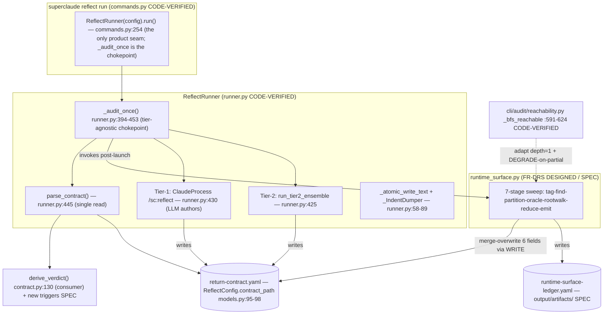

## 6. Architecture

> **Scope of this section:** FR-DRS introduces a new pure-Python module, `src/superclaude/cli/reflect/runtime_surface.py`, that deterministically produces the six `runtime_surface_*` contract scalars and the `runtime-surface-ledger.yaml` artifact, removing the LLM from the structured-emission path. The architecture below is the **DESIGNED** target. The runtime-surface module **does not exist yet** — a grep across all seven files in `src/superclaude/cli/reflect/` (`models.py`, `runner.py`, `commands.py`, `contract.py`, `ensemble.py`, `config.py`, `__init__.py`) returns zero matches for `runtime_surface`, `RuntimeSurface`, `rootwalk`, `unreached_surfaces`, or `ledger` [CODE-VERIFIED, research 01/02]. Algorithm steps (the 6 logical units and 7-stage data flow) are grounded in the spec `refs/runtime-surface.md` and are correctly tagged `[SPEC]`, **not** presented as existing code. The integration surfaces the module plugs into (`_audit_once`, `parse_contract`, `_IndentDumper`, `_atomic_write_text`, `ReflectConfig.contract_path`, `cli/audit/reachability.py:_bfs_reachable`) are all `[CODE-VERIFIED]` and described as the real, current product path.

### 6.1 High-Level Architecture

The sweep is a **deterministic, LLM-free, UC-2-only** pipeline composed of **6 logical units** wired in a fixed 7-stage data flow. It consumes the diff/patch under audit (plus scope work-tree and tasklist) and produces one per-edge ledger YAML plus six per-symbol contract scalars, written into `return-contract.yaml` **before** that contract is parsed by any consumer.

The 6 logical units and the `tag → find-referrers → partition → degrade-oracle → rootwalk → reduce → emit` data flow:

```
                         FR-DRS runtime_surface.py  (DESIGNED, pure-Python, LLM-free, UC-2 only)
                         [SPEC: refs/runtime-surface.md §1-§6]

 INPUTS                                                                                  OUTPUTS
 ┌─────────────┐                                                                         ┌──────────────────────────┐
 │ diff/patch  │                                                                         │ runtime-surface-         │
 │ scope wtree │                                                                         │   ledger.yaml            │
 │ tasklist    │                                                                         │ (per-edge rows)          │
 └──────┬──────┘                                                                         │ <output>/artifacts/      │
        │                                                                                └────────────▲─────────────┘
        ▼                                                                                             │
 ┌──────────────┐   ┌──────────────┐   ┌──────────────┐   ┌──────────────┐   ┌──────────────┐  ┌─────┴────────┐
 │ (1) surface- │   │ (2) referrer-│   │ (3)          │   │ (4) degrade- │   │ (5) entrypoint│  │ (6) ledger + │
 │     tagger   │──▶│     finder   │──▶│  partitioner │──▶│     oracle   │──▶│   -rootwalk   │─▶│  scalar      │
 │              │   │ (rg/AST floor│   │ prod vs test/│   │ a–d → DEGRADE│   │ depth=1;      │  │  reducer     │
 │ kind+decorat.│   │  LSP overlay)│   │   comment    │   │ before UNREA.│   │ partial→DEGR. │  │ reduce→emit  │
 └──────────────┘   └──────────────┘   └──────────────┘   └──────────────┘   └───────┬──────┘  └─────┬────────┘
   TAG               FIND-REFERRERS      PARTITION          DEGRADE-ORACLE     ROOTWALK│          REDUCE│
   FR-RSR.1          (reuse step-4)      §2 lang table      §3 oracle          §4      │          §5    │
        │                                                                              │                │
        └── non-surface fast path: requirements:[], sweep_ran:false, zero cost ────────┘                ▼
                                                                                          ┌──────────────────────────┐
   reduction precedence:  DEGRADE-on-any-incompleteness > UNREACHED > REACHED            │ 6 contract scalars into   │
   invariant:  len(unreached_surfaces) == runtime_surface_unreached                      │ return-contract.yaml      │
                                                                                          │ (BEFORE parse_contract)   │
                                                                                          └──────────────────────────┘
```

| Stage | Logical unit | What it does | Source |
|-------|--------------|--------------|--------|
| TAG | (1) surface-tagger | Classify diff-hunk symbols as runtime surfaces by resolved symbol kind + decorator/registration against the allowlist `{py, ts, js, rust, go}`; unclassifiable → DEGRADE (never silent-skip). Non-surface diff short-circuits to the fast path (`requirements:[]`, `sweep_ran:false`, zero added cost). | `[SPEC]` RS §1 |
| FIND-REFERRERS | (2) referrer-finder | Extend the already-fetched step-4 `find_referencing_symbols` result (no second fetch); rg/AST floor with optional LSP/Serena precision overlay that DEGRADEs-to-floor on any unavailability. | `[SPEC]` RS §1 / SKILL:489; web-01/web-02 |
| PARTITION | (3) partitioner | Split each referrer into production vs test/inline-test/comment via the per-language table; unknown/ambiguous → DEGRADE (never "treat as production"). | `[SPEC]` RS §2 |
| DEGRADE-ORACLE | (4) degrade-oracle | If any of 4 categories matches (decorator routes / packaging entrypoints / registry-DI-string-dispatch / reflection-dynamic-import) → DEGRADE; MUST run before any UNREACHED. | `[SPEC]` RS §3 |
| ROOTWALK | (5) entrypoint-rootwalk | For each candidate-UNREACHED symbol, enumerate runtime roots and walk at depth bound = 1; REACHED on any root hit, confirmed UNREACHED only on full enumeration + clean oracle, DEGRADE on any partial enumeration. Adapts `cli/audit/reachability.py:_bfs_reachable`. | `[SPEC]` RS §4; adapts `[CODE-VERIFIED]` `reachability.py:591-624` |
| REDUCE + EMIT | (6) ledger + scalar reducer | Collapse per-edge rows to per-symbol verdict under `DEGRADE > UNREACHED > REACHED`; write the per-edge ledger YAML; compute the 6 scalars with `len(unreached_surfaces) == runtime_surface_unreached` holding by construction. | `[SPEC]` RS §5/§6 |

**Governing posture (preserved from FR-RSR safety logic, NOT re-derived):** fail-loud asymmetric cost — never silently PASS an untested surface, never silently Regression an idiomatic dynamic/registry/decorator/packaging/reflection entrypoint; every uncertainty maps to `DEGRADE → §10.6 Grounding Gap` [SPEC, RS §3/§4; research 06 P1–P5].

### 6.2 Component Diagram

How the FR-DRS module fits the existing reflect CLI product path. Solid boxes are `[CODE-VERIFIED]` current code; the dashed box is the `[SPEC]` new module; the merge/write edge into `return-contract.yaml` is the new wiring.



**Reading the diagram.** `_audit_once` (runner.py:394-453) is the single tier-agnostic chokepoint that runs on every audit and every auto-fix re-audit; it sits exactly between contract-authoring (Tier-1 LLM or Tier-2 ensemble) and `parse_contract` (runner.py:445, the single read). The FR-DRS sweep is invoked there, **merge-overwrites** the six `runtime_surface_*` keys into the just-authored `return-contract.yaml` (via the runner's `_atomic_write_text` + `_IndentDumper`), and writes the sibling ledger — so `derive_verdict` consumes the deterministic values, not LLM-typed ones [research 02]. The rootwalk unit adapts the audit BFS internal (`_bfs_reachable`) rather than importing it (see §6.4 D1). **Coverage caveat:** this CLI-side site covers `superclaude reflect run` (foreground, `--tmux` inner, and the fix loop) on **both** tiers, but does **NOT** cover a bare `claude -p /sc:reflect` invocation, which never enters the Python wrapper — see §6.4 D2 (OQ-DRS.2).

### 6.3 System Boundaries

| Boundary | Description | Protocol / Format |
|----------|-------------|-------------------|
| Upstream (inputs) | The diff/patch under audit plus the scope work-tree, and the tasklist consumed for requirement-mapping. The diff/patch supplies the changed symbols the surface-tagger classifies; the scope work-tree supplies the referrer search space; the tasklist supplies the requirement→surface linkage. | Unified diff / patch text + filesystem work-tree + MDTM tasklist markdown [research 01] |
| Downstream — contract consumers | **In-scope live readers:** `return-contract.yaml` is read by `contract.py` `parse_contract` / `derive_verdict` (the single read at `runner.py:445`), and the SKILL §5.3 forbid-STOP pre-filter reads `runtime_surface_unreached` — the sweep merge-overwrites the six `runtime_surface_*` fields **before** these consumers read. **Deferred (SPEC-ONLY) consumer:** the `sprint run` executor (`cli/sprint/executor.py`) reads **no** reflect contract today (it imports `TurnLedger` for budget only, research/03 §5.2/§5.3); it is NOT a live reader and is NOT wired by this rollout. The architecture records it as a future/deferred consumer (FR-006a) — when it begins reading the contract it MUST read the deterministic scalars, but FR-DRS v1 delivers no executor wiring. | `return-contract.yaml` (PyYAML; written via `_IndentDumper` + `_atomic_write_text`) [research 02, research 03 §5, research 06] |
| Artifact (sibling output) | The per-edge ledger `<output>/artifacts/runtime-surface-ledger.yaml` (one row per referrer edge), written alongside the contract for forensics; not consumed by `derive_verdict`. | `runtime-surface-ledger.yaml` (block-sequence YAML, yamllint-conformant) [research 02] |

**Entrypoint-rootwalk adaptation note.** The rootwalk unit adapts `cli/audit/reachability.py` `_bfs_reachable` (`:591-624`) but inverts two of its semantics at the boundary: it walks with **depth = 1** and **DEGRADEs on partial enumeration**, whereas the audit BFS is **unbounded** (no depth parameter; depth>50 guard only on recursive module parse) and reports **UNREACHABLE on dynamic-dispatch** rather than DEGRADE. The boundary thus converts cleanup-audit's binary reachable/unreachable doctrine into runtime-surface's asymmetric-cost DEGRADE-on-uncertainty doctrine [research 05 §5, research 06].

### 6.4 Key Design Decisions

| Decision | Choice | Rationale | Alternatives Considered |
|----------|--------|-----------|-------------------------|
| **D1 — reflect→audit import boundary** | **Option C (reflect-local copy) for v1**; Option B (boundary-neutral shared helper) as the clean long-term shape; **avoid Option A**. | Importing `cli/audit` is *mechanically legal* — reflect's documented import ban names `cli/sprint` and `cli/roadmap` ONLY (verified in `runner.py:8-9`, `config.py:7-10`, `models.py:8-12`; `__init__.py` carries no ban) — BUT it couples reflect's product/gating path to cleanup-audit heuristic semantics whose defaults (UNKNOWN→SOURCE, dynamic→KEEP:monitor, dynamic-dispatch→UNREACHABLE, depth>50) are the *inverse* of runtime-surface's asymmetric-cost doctrine. Option C matches the in-repo copy-over-import precedent at `runner.py:14-17` (`_IndentDumper` copied locally rather than importing the private symbol). [research 05 §7] | (A) import `cli/audit` directly — lowest LOC but silent, semantics-inverted coupling + reaches an unexported `_bfs_reachable`; (B) extract a boundary-neutral BFS helper both packages import — no coupling but a refactor touching `cli/audit` with its own regression cost; (C) reflect-local copy of the ~30-line BFS skeleton with depth=1 + DEGRADE-on-partial baked in. [research 05 §7 A/B/C] |
| **D2 — invocation site (OQ-DRS.2)** | Invoke the sweep at `runner.py` `_audit_once` (`:394-453`); keep the SKILL prose demotion **conditional** with an LLM-fallback branch for the bare-CLI path. | `_audit_once` is the strongest CLI chokepoint: tier-agnostic, runs on every audit and every auto-fix re-audit, and sits between contract-authoring and `parse_contract`. But it covers ONLY `superclaude reflect run` (foreground, `--tmux` inner, fix loop) — it does **NOT** cover bare `claude -p /sc:reflect`, which never enters the Python wrapper. So the deterministic demotion cannot be unconditional; the bare path must retain an LLM-authored fallback. [research 02] | `commands.py` (too early / not the re-audit chokepoint) vs `runner.py` `_audit_once` (chosen) vs a Wave-1A skill-shell-out (would couple the skill prose to a subprocess and still miss the chokepoint coverage). [research 02] |
| **D3 — referrer engine (OQ-DRS.1)** | ripgrep/AST **floor** as the determinism-safe default (`--sort path`), with an **optional** Serena/LSP precision overlay that **DEGRADEs-to-floor** on any unavailability. | The floor must be deterministic and reproducible for a gating path; an LSP/Serena overlay adds symbol-level precision when present but must never make the verdict depend on a non-deterministic or absent tool — hence fail-open back to the rg/AST floor. [web-01, web-02; research 05 §2] | LSP/Serena as a *hard* dependency (rejected — non-deterministic, breaks reproducible gating); rg/AST only with no overlay (loses precision where structured analysis is available). |
| **D4 — sweep ordering (before parse)** | The sweep runs and merge-overwrites the six `runtime_surface_*` fields into `return-contract.yaml` **before** `parse_contract` consumes it. | Guarantees `derive_verdict` (and the §5.3 forbid-STOP pre-filter) consume the deterministic, sweep-computed scalars rather than LLM-typed ones; the `len(unreached_surfaces) == runtime_surface_unreached` invariant holds by construction at read time. [research 02, research 06] | Sweep after parse / as a separate post-pass (rejected — would let `derive_verdict` read stale LLM-authored values before the deterministic overwrite lands). |

**Status:** Complete
