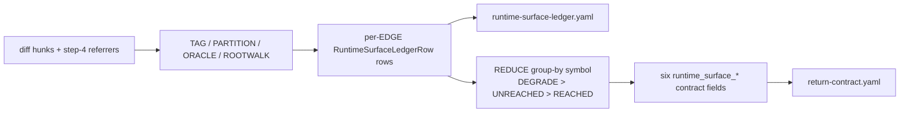

## 7. Data Models

> **Component type note:** FR-DRS is a backend/library component (a deterministic, LLM-free Python sweep under `src/superclaude/cli/reflect/`). This section models the **on-disk ledger artifact** and the **in-memory `RuntimeSurfaceLedgerRow` TypedDict** that the sweep produces, plus the per-symbol reduction and the count invariant. The contract scalars the ledger reduces to are specified in §8 (API).

### 7.1 Data Entities

#### 7.1.1 `runtime-surface-ledger.yaml` (per-run artifact)

The sweep writes `<output>/artifacts/runtime-surface-ledger.yaml` as a **per-run artifact**, **one row per evaluated EDGE** (not one row per symbol). The per-edge-vs-per-symbol split is the most error-prone aspect of the model and is what drives the count invariant in §7.4. Source: `refs/runtime-surface.md:61-101` (RS:L63 granularity; RS:L65-L72 row shape).

YAML row shape (RS:L65-L72):

```yaml
- requirement_id: <str | null>          # null is valid; tagger is symbol-anchored
  symbol: <str>                          # tagged surface symbol name-path
  edge: <str>                            # "<symbol> -> <referrer-or-entrypoint-root>"
  status: REACHED | UNREACHED | DEGRADE
  production_referrers: [<file:line>]    # surviving non-test/non-comment referrers; [] for UNREACHED
  evidence_ref: <file:line-or-artifact>  # evidence backing the verdict; re-Read by evidence-validator
```

Ledger row entity — Field / Type / Required / Description / Constraints:

| Field | Type | Required | Description | Constraints |
|-------|------|----------|-------------|-------------|
| `requirement_id` | `str \| null` | No | Surface requirement id tagged from the diff hunk. `null` is valid because the tagger is **symbol-anchored, not requirement-anchored** (RS:L7, L66). | May be `null`; a surface hunk with no mapped requirement is still tagged and still swept. |
| `symbol` | `str` | Yes | The tagged surface symbol **name-path** (e.g. `MyClass/my_handler`). | Stable **join key** for the per-symbol reduction (§7.4). One symbol → N edge rows. |
| `edge` | `str` | Yes | Formatted `"<symbol> -> <referrer-or-entrypoint-root>"` (RS:L68). One ledger row = one such edge. | Delimiter spacing / entrypoint-root rendering / dedup rules are under-specified by the spec (Open Question OQ-EDGE) — port must pin a canonical formatter + test. Grouping joins on `symbol`, NOT `edge`. |
| `status` | `Literal["REACHED","UNREACHED","DEGRADE"]` | Yes | **Per-EDGE** status. The per-symbol verdict is derived by reduction (§7.4), not stored here. | Exactly one of the three enum tokens. |
| `production_referrers` | `list[str]` | Yes | Surviving non-test / non-comment referrers as `file:line`. | **MUST be `[]` for an UNREACHED edge** (RS:L70). Nested block sequence → writer must dump via `_IndentDumper`. |
| `evidence_ref` | `str` | Yes | `file:line` or artifact path backing the verdict. | **Re-Read by the downstream evidence-validator** (RS:L71) → MUST resolve to a re-readable `file:line` or an on-disk artifact under `<output>/`; never a transient/in-memory handle. |

#### 7.1.2 `RuntimeSurfaceLedgerRow` (TypedDict — field by field)

The in-memory representation of one ledger row (RS:L77-L84). Greenfield: no TypedDict exists in `cli/reflect/models.py` today; the port introduces this as new surface (decide `models.py` vs a new `runtime_surface.py`).

```python
class RuntimeSurfaceLedgerRow(TypedDict):
    requirement_id: str | None
    symbol: str
    edge: str
    status: Literal["REACHED", "UNREACHED", "DEGRADE"]
    production_referrers: list[str]
    evidence_ref: str
```

| TypedDict field | Type | Maps to YAML field | Port note |
|-----------------|------|--------------------|-----------|
| `requirement_id` | `str \| None` | `requirement_id` | Optional; `None` ⇄ YAML `null`. |
| `symbol` | `str` | `symbol` | Reduction join key. |
| `edge` | `str` | `edge` | One row per edge. |
| `status` | `Literal["REACHED","UNREACHED","DEGRADE"]` | `status` | Per-edge, not per-symbol. |
| `production_referrers` | `list[str]` | `production_referrers` | `[]` for UNREACHED. |
| `evidence_ref` | `str` | `evidence_ref` | Must be re-readable. |

#### 7.1.3 `UnreachedSurface` (per-symbol entry — `unreached_surfaces[]` member)

One entry per symbol reduced to UNREACHED (FR-RSR.6). This list is the per-symbol projection of the per-edge ledger; its length is bound to the `runtime_surface_unreached` scalar by the §7.4 invariant. Field-level shape beyond "one entry per UNREACHED symbol" is owned by the contract spec (SKILL.md §9.1); a DEGRADE-only or fully-REACHED run emits `[]`.

### 7.2 Per-symbol Reduction Precedence

Edge rows for a given `symbol` collapse into one per-symbol verdict by taking the **highest-precedence status present** (RS:L86-L90):

```text
DEGRADE-on-any-incompleteness  >  UNREACHED  >  REACHED
```

| Condition over a symbol's N edge rows | Per-symbol verdict |
|---------------------------------------|--------------------|
| **Any** single edge is `DEGRADE` | `DEGRADE` (degrade dominance, RS:L98) |
| No degrade, but ≥1 edge `UNREACHED` and no REACHED rescue | `UNREACHED` |
| Otherwise (a root/rescue reached the symbol) | `REACHED` |

Per-symbol verdict → contract-field effect (RS table; SKILL.md:727-729):

| Per-symbol verdict | `runtime_surface_unreached` | `runtime_surface_degraded` | `unreached_surfaces` |
|--------------------|-----------------------------|-----------------------------|----------------------|
| REACHED | `0` (no increment) | `false` | `[]` (no entry) |
| UNREACHED | `+1` increment | `false` | `+1` entry |
| DEGRADE | no increment | `true` (+ §10.6 Grounding Gap) | **NOT added** |

> **CRITICAL:** A DEGRADE symbol is **never** added to `unreached_surfaces`, so it does not count toward the invariant below. Degrade routes through §10.6 Grounding Gaps, never the deviation ledger, never `deviation_count_by_class.regression`.

### 7.3 Data Flow



Data-model layering (RS:L178-L181):
1. Producer emits per-EDGE `RuntimeSurfaceLedgerRow[]` → YAML ledger.
2. Reducer groups rows by `symbol`, applies `DEGRADE > UNREACHED > REACHED` → per-symbol verdict map.
3. Contract emitter derives the six `runtime_surface_*` fields (§8) from the per-symbol map, maintaining the §7.4 invariant as a checkable post-condition.

### 7.4 Data-Integrity Constraint — Count Invariant

> **CRITICAL invariant (RS:L96, SKILL.md:730):** `len(unreached_surfaces) == runtime_surface_unreached` **MUST hold on every run.**

- The ledger is **per-edge**; contract counts are **per-symbol** (RS:L94).
- `runtime_surface_unreached` counts **symbols** reduced to UNREACHED, **never edges** (RS:L95).
- `unreached_surfaces` (list) and `runtime_surface_unreached` (int) are two views of the same per-symbol UNREACHED set; the port keeps them in lockstep.
- **Worked example (RS:L97):** a symbol with N test-only/comment-only referrers contributes **N ledger rows** but exactly **1** to `runtime_surface_unreached` — *if* all edges are non-production AND none degrade.
- This constraint is a unit/contract-boundary test assertion (a malformed-contract guard candidate mirroring `contract.py`'s `_LOAD_BEARING_BOOL_FIELDS` fail-closed block, contract.py:200-209).

### 7.5 Data Storage / Write Conventions

| Artifact | Location | Writer convention | Source |
|----------|----------|-------------------|--------|
| Ledger | `<output>/artifacts/runtime-surface-ledger.yaml` | `_IndentDumper` (NOT bare `yaml.safe_dump`) + `_atomic_write_text`; `mkdir(parents=True, exist_ok=True)` the `artifacts/` dir | runner.py:58-67, 70-89; ensemble divergence noted at ensemble.py:508-509 |
| Six fields | `<output>/return-contract.yaml` (= `ReflectConfig.contract_path`, models.py:95-98) | merge-overwrite the six keys into the just-authored contract before `parse_contract` at runner.py:445 | research 02 §runner |

> **Note:** Nested block sequences (`unreached_surfaces:`, `production_referrers:`) require `_IndentDumper` or pre-commit yamllint (`indent-sequences: true`) fails. The ensemble's bare `yaml.safe_dump` + `path.write_text` is NOT the convention to copy.

## 8. API Specifications

> **Component-type note:** FR-DRS is a backend/library component. There are **no HTTP endpoints**. This section is REPURPOSED to specify (8.1) the **module / function API** of the deterministic sweep and (8.2) the **contract-field surface** — the six canonical `runtime_surface_*` scalars the sweep reduces to. The sweep module lives at `src/superclaude/cli/reflect/runtime_surface.py` and is invoked from `_audit_once` (`runner.py:394-453`).

### 8.1 Module / Function API

Six logical units. Proposed Python signatures (illustrative — bodies not reproduced). All live in `src/superclaude/cli/reflect/runtime_surface.py`; a single orchestrator (`run_sweep`) wires them and returns the ledger rows + contract dict consumed at `runner.py:445`.

| Function (proposed signature) | Purpose | Key Params | Returns |
|-------------------------------|---------|------------|---------|
| `tag_surfaces(diff_hunks: list[DiffHunk], allowlist: SurfaceAllowlist) -> list[TaggedSurface]` | **Surface-tagger.** Tag diff-hunk symbols by AST kind + decorator against the surface allowlist; symbol-anchored (requirement_id may be `null`). | `diff_hunks`, `allowlist` (kind/decorator table) | `list[TaggedSurface]` (symbol name-path + kind + optional `requirement_id`) |
| `find_referrers(surfaces: list[TaggedSurface], *, lsp: LspOverlay \| None = None) -> list[ReferrerEdge]` | **Referrer-finder.** Find referrers via ripgrep `--json --sort path` with an AST floor; optional LSP overlay for precision. | `surfaces`, optional `lsp` overlay | `list[ReferrerEdge]` (symbol → referrer `file:line`) |
| `partition_referrers(edges: list[ReferrerEdge], lang_table: TestCommentTable) -> PartitionedReferrers` | **Production-vs-test partitioner.** Split referrers into production vs test/comment using the per-language test/comment table. | `edges`, `lang_table` (per-language test+comment patterns) | `PartitionedReferrers` (`.production`, `.test_or_comment`) |
| `degrade_oracle(surface: TaggedSurface, partitioned: PartitionedReferrers) -> DegradeVerdict` | **Degrade-oracle.** Match the 4 incompleteness categories a–d → DEGRADE when reachability cannot be soundly decided. | `surface`, `partitioned` | `DegradeVerdict` (`degraded: bool`, `category: Literal["a","b","c","d"] \| None`) |
| `rootwalk_entrypoints(surface: TaggedSurface, roots: list[EntrypointRoot]) -> RootwalkResult` | **Entrypoint-rootwalk.** Depth=1 walk from the enumerated entrypoint roots → REACHED; partial/unsound enumeration → DEGRADE. | `surface`, `roots` (enumerated entrypoint roots) | `RootwalkResult` (`status: Literal["REACHED","partial"]`) |
| `reduce_ledger(rows: list[RuntimeSurfaceLedgerRow]) -> tuple[dict[str, str], ContractScalars]` | **Ledger + scalar reducer.** Reduce per-edge rows to a per-symbol verdict (`DEGRADE > UNREACHED > REACHED`) and compute the 6 contract scalars (§8.2), enforcing the §7.4 count invariant. | `rows` (per-edge ledger) | `(per_symbol_verdict_map, ContractScalars)` — the six `runtime_surface_*` fields as a dict merged into `return-contract.yaml` |

### 8.2 Contract-Field Surface

The six canonical fields the reducer emits, verbatim from `research/03-consumer-surfaces.md` lines 25–32 / `SKILL.md` §9.1 lines 731–736. Emitted under the MANDATORY-EMISSION rule (all six, exact names, on REACHED/DEGRADE/UNREACHED alike) when `runtime_surface_sweep_ran` is true.

| Field | Type | Semantics | Consumer-that-reads-it |
|-------|------|-----------|------------------------|
| `runtime_surface_requirements` | `list[str]` | FR-RSR.1: surface requirement ids tagged from symbol kind/decorator; `[]` when none. | §9.3 UC-2 advisory (non-gating) |
| `runtime_surface_sweep_ran` | `bool` | FR-RSR.2: `true` ONLY when ≥1 tagged surface triggered the sweep. | §9.3 UC-2 advisory (non-gating) |
| `runtime_surface_ledger_path` | `str \| null` (abs path) | FR-RSR.2: `<output>/artifacts/runtime-surface-ledger.yaml`; `null` when sweep did not run. | §9.3 UC-2 advisory (non-gating) |
| `runtime_surface_unreached` | `int` (symbol count) | FR-RSR.2/6: count of SYMBOLS reduced to UNREACHED; `0` on a fully-REACHED run. | **§5.3 pre-filter (GATING)** — `≥1` forces Tier 2; also §9.3 UC-2 advisory; sprint executor SPEC-ONLY |
| `runtime_surface_degraded` | `bool` | FR-RSR.3/8: `true` when ≥1 symbol reduced to DEGRADE (→ §10.6 Grounding Gap); `false` on fully-REACHED. | §9.3 UC-2 advisory (non-gating) |
| `unreached_surfaces` | `list[UnreachedSurface]` | FR-RSR.6: one entry per UNREACHED symbol; `[]` on REACHED and DEGRADE-only runs. Bound to `runtime_surface_unreached` by the §7.4 count invariant. | §9.3 UC-2 advisory; sprint executor SPEC-ONLY |

> **CRITICAL prefix caveat:** Only **5 of the 6** fields carry the literal `runtime_surface_` prefix. The 6th, **`unreached_surfaces`**, is a **list** with NO prefix. A naive `startswith("runtime_surface_")` filter would **silently drop** `unreached_surfaces` — every consumer (and the reducer's own emit/test code) MUST key on the **exact six names**, never a prefix glob. (research/03 §1 line 22-23, Gap #2 lines 230-234.)

### 8.3 API-Governance Note

- **This is a PRODUCER change, not a field-set change.** FR-DRS makes the deterministic sweep actually *populate* the six fields; the contract's field set is unchanged. The six fields were already added **additively at `contract_version: "1.6.0"`** (`SKILL.md` line 671–672, `1.6.0 (FR-RSR) ADDITIVE ONLY: +runtime_surface_* (6 fields)`).
- **Likely no version bump (OQ-DRS.3).** Because the surface stays additive and read-and-ignore forward-compatible (§9.4, research/03 lines 115–117), populating existing fields does not force a minor/major bump. Confirm against OQ-DRS.3 before finalizing.
- **Stale version constant to reconcile:** `ensemble.REFLECT_CONTRACT_VERSION = "1.0"` (`ensemble.py:59`) is stale vs the SKILL-declared `1.6.0`. The port must reconcile this constant (or document why the ensemble path carries a different version literal) so the producer and the declared contract version do not silently disagree.

**Status:** Complete
