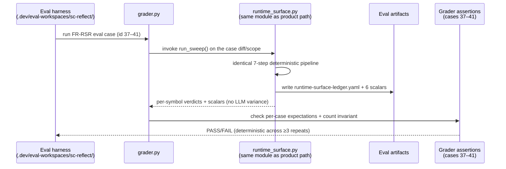

# synth-05 — Sections 9, 10, 11 (State Management · Component Inventory · User Flows)

**Source TDD:** FR-DRS — sc:reflect Deterministic Runtime-Surface Sweep
**Template:** `src/superclaude/examples/tdd_template.md` v1.2
**Synthesized from:** research 00 (PRD extraction), 01 (runtime-surface algorithm), 02 (product-path integration), 03 (consumer surfaces); tailoring per `phase-outputs/discovery/template-orientation.md`
**Status:** Complete

---

## 9. State Management

> **Conditional Section (frontend-only):** This section applies to frontend/client-side components. FR-DRS has no such surface.

**N/A — rationale: FR-DRS is a backend/library + CLI-integration component with no frontend state or UI component surface.**

The sweep module (`src/superclaude/cli/reflect/runtime_surface.py`) is a pure-Python, LLM-free function over an immutable diff/work-tree input that emits on-disk artifacts (`runtime-surface-ledger.yaml` + the six contract scalars merged into `return-contract.yaml`). It holds no client-side, session, or global UI state — there is no server-state cache, store, URL state, or form state to model. Run-scoped intermediate values (per-edge ledger rows, the per-symbol reduction map) are transient locals discarded after `EMIT`; durable state lives only in the run artifacts under `<output>/`, which are covered by §7 Data Models, not here.

---

## 10. Component Inventory

> **Conditional Section (frontend-only):** This section applies to frontend/client-side components. FR-DRS has no such surface.

**N/A — rationale: FR-DRS is a backend/library + CLI-integration component with no frontend state or UI component surface.**

There are no pages, routes, layouts, or shared UI components. The "components" of FR-DRS are Python modules/functions (the new `runtime_surface.py` sweep, plus the consumer seams in `runner.py` / `contract.py` / `ensemble.py`) and are specified as the module/function API in §8, not as a UI component tree. No page/route table, shared-component table, or component hierarchy applies.

---

## 11. User Flows & Interactions

> The "user" of FR-DRS is an operator invoking reflect (or the eval harness). Both flows below are deterministic, LLM-free for the structured-emission path, and converge on the same `runtime_surface.run_sweep()` module. The LLM role is reduced to narrating the verdict in `REPORT.md` only.

### 11.1 Primary Flow: Deterministic Sweep on a Reflect Run (Product Path)

```mermaid
sequenceDiagram
    participant Op as Operator
    participant CLI as reflect CLI wrapper<br/>(commands.py / runner.py)
    participant Skill as /sc:reflect skill<br/>(SKILL.md §6.1)
    participant Sweep as runtime_surface.py<br/>(deterministic 7-step)
    participant FS as Artifacts (&lt;output&gt;/)
    participant Con as Consumers<br/>(contract.py · §5.3 · sprint executor [deferred/FR-006a])
    participant Rep as REPORT.md (LLM)

    Op->>CLI: superclaude reflect run TASK.md<br/>(or bare claude -p "/sc:reflect --mode post")
    CLI->>Skill: launch audit (_audit_once, runner.py:394)
    Skill-->>FS: author return-contract.yaml<br/>(Tier-1 LLM) / ensemble (Tier-2)
    CLI->>Sweep: invoke sweep (diff/base/tasklist from config)
    Sweep->>Sweep: TAG → FIND-REFERRERS (reuse step-4) → PARTITION →<br/>DEGRADE-ORACLE → ROOTWALK(depth=1) → REDUCE
    Sweep->>FS: write artifacts/runtime-surface-ledger.yaml<br/>(_IndentDumper + _atomic_write_text)
    Sweep->>FS: merge-overwrite 6 runtime_surface_* scalars<br/>into return-contract.yaml  [BEFORE parse]
    CLI->>Con: parse_contract(contract_path)  (runner.py:445)
    Con->>Con: derive_verdict — read deterministic scalars<br/>(_halted_reason: unreached / _degraded_reason: degraded)
    Con->>Con: §5.3 pre-filter: unreached ≥ 1 ⇒ force Tier 2 + status:partial
    Con-->>CLI: Verdict (exit_code) + deviation mapping (§10.9)
    CLI->>Rep: LLM narrates verdict (narration only — no scalar typing)
    CLI-->>Op: exit code + contract: path (stderr on non-PASS)
```

**Steps:**

| # | Actor | Action |
|---|-------|--------|
| 1 | Operator | Invokes `superclaude reflect run TASK.md` **or** a bare `claude -p "/sc:reflect --mode post …"`. |
| 2 | CLI wrapper | `ReflectRunner.run()` → `_audit_once()` launches the audit (Tier-1 LLM or Tier-2 ensemble authors `return-contract.yaml`). |
| 3 | Sweep | `runtime_surface.run_sweep()` runs the 7 deterministic stages — **TAG → FIND-REFERRERS (reuses the already-fetched step-4 referrers; no second fetch) → PARTITION → DEGRADE-ORACLE → ROOTWALK (depth=1) → REDUCE**. |
| 4 | Sweep → FS | Always writes `<output>/artifacts/runtime-surface-ledger.yaml` (one `RuntimeSurfaceLedgerRow` per edge) via `_IndentDumper` + `_atomic_write_text`. |
| 5 | Sweep → FS | **EMIT:** merge-overwrites the **six** `runtime_surface_*` scalars into `return-contract.yaml` **before** the contract is parsed — overriding any LLM-typed/ad-hoc values. |
| 6 | Consumers | `parse_contract()` (single read, runner.py:445) → `derive_verdict()` reads the deterministic scalars; §5.3 pre-filter forces Tier 2 on `runtime_surface_unreached ≥ 1`; sprint executor (spec) gates on the §10.9 `regression` mapping. |
| 7 | LLM | `REPORT.md` narrates the verdict only — no longer hand-types the scalars. |
| 8 | Operator | Receives the exit code (`pass=0 / halted=10 / degraded=11 / blocked=2` — owned by `Verdict.exit_code`, `src/superclaude/cli/reflect/models.py:39-42`; research/03) and the `contract:` path echo on a non-PASS verdict. |

**Ordering invariant (load-bearing):** EMIT (step 5) MUST complete **before** `parse_contract` at `runner.py:445`. The strongest tier-agnostic chokepoint is `ReflectRunner._audit_once` (post-launch, pre-parse); it re-runs on every auto-fix re-audit so the scalars stay consistent across fix cycles. A bare `claude -p /sc:reflect` does not enter the CLI wrapper, so full coverage of that path additionally requires a Wave-1A skill shell-out to the same module (OQ-DRS.2).

**Success Criteria:**

- All six `runtime_surface_*` fields present with exact canonical names on REACHED / DEGRADE / UNREACHED paths alike, zero dependence on LLM emission (AC-1).
- `len(unreached_surfaces) == runtime_surface_unreached` holds by construction (AC-3).
- §5.3 pre-filter reads the deterministic scalars (AC-4, v1 in-scope portion). *(The sprint executor read is **deferred to FR-006a / SPEC-ONLY** — `cli/sprint/executor.py` reads no reflect contract today, so it is net-new and out of v1 scope; see step 6 above, which already marks it "(spec)".)*
- Existing safety behavior (never clean-pass an unwired surface) preserved (AC-5).

**Error / Degrade Scenarios:**

- If backend/tooling (Serena/LSP) is unavailable or a referrer fetch fails → degrade the affected edge, set `runtime_surface_degraded: true`, append `"runtime-surface:backend_unavailable"` to `degraded_components`, continue over remaining edges — NEVER STOP.
- If the language is unclassifiable, root enumeration is partial, or dynamic/registry/decorator/packaging wiring is detected → `DEGRADE` → §10.6 Grounding Gap; never silently PASS, never a Regression solely from idiomatic dynamic wiring.
- If `return-contract.yaml` is missing/unparseable at parse → `parse_contract` returns `None` → routes BLOCKED (unchanged existing behavior).

### 11.2 Secondary Flow: Eval-Path Sweep (Grader Invokes the Same Module)



**Steps:**

| # | Actor | Action |
|---|-------|--------|
| 1 | Eval harness | Runs an FR-RSR eval case (ids 37–41) from `.dev/eval-workspaces/sc-reflect/`. |
| 2 | Grader | Invokes the **same** `runtime_surface.run_sweep()` module — no LLM in the structured-emission path, removing LLM variance from the eval. |
| 3 | Sweep | Runs the identical 7-step pipeline and writes the ledger + six scalars. |
| 4 | Grader | Asserts the per-case expectation and the count invariant. |

**Success Criteria (AC-2):** the 5 distinct FR-RSR cases (ids 37–41) pass deterministically across ≥3 repeated runs (no variance):

| Id | Case | Expected deterministic result |
|----|------|-------------------------------|
| 37 | `uc2-unwired-surface-passes` | FAIL-pre / PASS-post; `runtime_surface_unreached ≥ 1` + `regression: 1`; never clean-pass the unwired surface |
| 38 | `uc2-surface-positive-control` | `runtime_surface_unreached: 0`, `runtime_surface_degraded: false`; no UNREACHED/STOP |
| 39 | `uc2-surface-dynamic-dispatch` | `[project.scripts]` registry → `runtime_surface_degraded: true`, `regression: 0`; DEGRADE, never UNREACHED |
| 40 | `uc2-surface-degraded-backend` | `backend: none` → Grounding Gap + `runtime_surface_degraded: true`; no hard-STOP, no clean-pass |
| 41 | `uc2-surface-test-only-ref` | test/comment-only → `UNREACHED`; hosts the `len(unreached_surfaces) == runtime_surface_unreached` count-invariant assertion |

**Why two flows share one module:** product path and eval path call the identical `runtime_surface.run_sweep()`, which is the determinism guarantee — the eval can no longer pass on LLM-emitted scalars, making it a true falsifier for AC-1/AC-3.

---

**Cross-references for the assembler:**
- The six canonical field names, the `RuntimeSurfaceLedgerRow` TypedDict, and the count invariant belong to §7 Data Models / §8 API Specifications (not restated here).
- Verdict→exit-code mapping (`pass=0/halted=10/degraded=11/blocked=2`) is owned by the existing reflect `Verdict` enum — `Verdict.exit_code` at `src/superclaude/cli/reflect/models.py:39-42` (research/03); FR-DRS does not change it.
- Degrade/Grounding-Gap and backend-unavailable handling detail belong to §12 Error Handling.

**Status: Complete**
