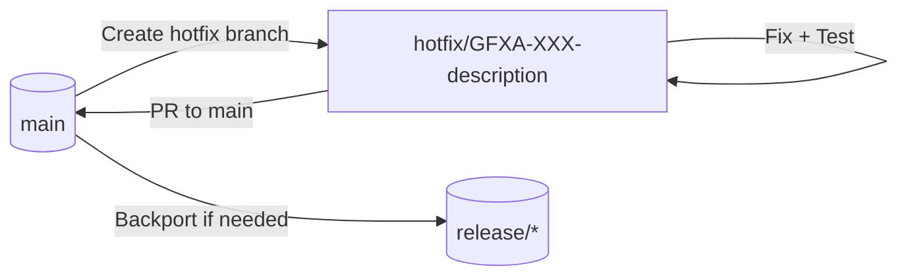

## Git Standards and Repository Protocols

← Back to [10_development_process.md](../10_development_process.md)

> **WHAT:** Comprehensive Git workflow, branching strategy, PR standards, commit conventions, code review checklist, release process, and hotfix procedures for the GFxAI project. This document consolidates what was previously `development-workflow.md` with comprehensive GitHub repository protocols.
> **WHY:** Ensures consistent, traceable, and high-quality code contributions across all team members and maintains a clean, professional repository history.
> **HOW TO USE:** All developers and contributors should follow these standards for all Git operations. DevOps should reference for CI/CD integration points.

## Completeness Status

**Completeness Checklist:**

- [ ] Section 1: Repository Structure documented - **Partial** (Monorepo type and directory conventions derived from prework naming; required root files To Do)
- [x] Section 2: Branching Strategy documented - **Done** (High-level flow, naming conventions, workflow stages, Branch Protection Rules, User Roles, Feature Branch Ownership, Emergency Override)
- [x] Section 3: Commit Standards documented - **Done** (Commit message format, commit restrictions, commit signing)
- [x] Section 4: Pull Request Protocol documented - **Done** (PR requirements, types by target branch, PR approval requirements, naming convention)
- [x] Section 5: Code Review Standards documented - **Done** (Code review checklist, response time expectations, feedback guidelines)
- [ ] Section 6: Release and Tagging documented - **To Do** (No prework; release promotion flow in Section 2)
- [x] Section 7: Hotfix Procedures documented - **Done** (Hotfix flow, when to use, process, naming convention)
- [x] Section 8: GitHub Actions and Automation documented - **Done** (Golden Path Test Suite Tiers 1-3, Config Consistency Gate, Environment Parity Gate, Pre-commit hooks)
- [x] Section 9: Security and Access Controls documented - **Done** (Secrets management, Branch Protection Security, GitHub settings, CODEOWNERS)
- [ ] Section 10: Contribution Guidelines documented - **To Do** (No prework)
- [ ] All links verified - **To Do**
- [ ] Reviewed by engineering-team - **Pending team review**

**Contract Table:**

| Element | Details |
|---------|---------|
| **Dependencies** | 10_development_process.md, 12_deployment_ops.md |
| **Upstream** | Feeds from: Team conventions, industry best practices |
| **Downstream** | Feeds to: CI/CD pipeline, deployment automation, code reviews |
| **Change Impact** | Notify: engineering-team, devops-team |
| **Review Cadence** | Quarterly (or when process changes) |

**Relationship to Anchor Documents:**

- **Rolls up to 10_development_process.md**: Development workflow, branching strategy, PR process, code review standards
- **Rolls up to 12_deployment_ops.md**: CI/CD integration, release automation, deployment triggers, environment promotion

---

## Section 1: Repository Structure

### Repository Type

**GFxAI uses a monorepo architecture.** This is evident from the branch naming convention where feature branches are nested under release branches (e.g., `investor-demo-1.0/feature/GFXA-101-asset-manifest`), allowing all related code to live in a single repository with release-scoped feature development.

### Directory Conventions

Directory structure follows the release-scoped branching model:

- Feature work is organized by release milestone
- Branch naming reflects the directory-like hierarchy: `[release]/feature/[ticket]-[description]`
- This enables clear traceability from feature to release

### Required Root Files

[To Do - Document required root files:]

- [ ] README.md requirements
- [ ] LICENSE requirements
- [ ] CONTRIBUTING.md requirements
- [ ] .gitignore patterns
- [ ] Other required configuration files

---

## Section 2: Branching Strategy

### High-Level Flow Overview

The GFxAI branching strategy follows a structured promotion path from development through production, with clear gates at each stage.

```mermaid
flowchart TD
    %% REPO - Source of Truth
    REPO[(📁 REPOSITORY<br/>release/* & feature/* branches)]

    %% LOCAL
    subgraph LOCAL ["🖥️ LOCAL ENVIRONMENT"]
        L1[Pull from release/* or feature/*]
        L2[Local .env files]
        L3[Local commits]
        L4[Unit & integration tests]
        L5[Lint + Type check + Config Consistency]
    end

    %% PR TO FEATURE
    PR_FEAT([→ PR to feature/*])

    %% GATE 1 - TIER 1 TESTS
    G1{🚦 GATE 1: TIER 1<br/>Unit, Lint, Type, Security,<br/>Config Consistency}

    %% REPO UPDATE 1
    REPO_FEAT[(📁 REPOSITORY<br/>feature/* updated<br/>PR merged)]

    %% DEV
    subgraph DEV ["🔧 DEV ENVIRONMENT"]
        D1[Pull from feature/*]
        D2[.env files]
        D3[Integration + E2E tests]
        D4[Docker build validation]
    end

    %% GATE 2 - TIER 2 TESTS
    G2{🚦 GATE 2: TIER 2<br/>Integration, E2E, Docker Build,<br/>Docker Startup, API Contract,<br/>Environment Parity}

    %% PR TO RELEASE
    PR_REL([→ PR to release/*])

    %% REPO UPDATE 2
    REPO_REL[(📁 REPOSITORY<br/>release/* updated<br/>PR merged)]

    %% TEST
    subgraph TEST ["🧪 TEST ENVIRONMENT"]
        T1[Pull from release/*]
        T2[Secrets Store]
        T3[E2E tests in Docker]
        T4[Cross-service integration]
        T5[Chaos/Resilience tests]
    end

    %% GATE 3 - TIER 3 TESTS
    G3{🚦 GATE 3: TIER 3<br/>E2E, Cross-service,<br/>Performance baseline,<br/>Chaos/Resilience}

    %% BETA
    subgraph BETA ["🎯 BETA ENVIRONMENT"]
        B1[Pull from release/*]
        B2[Secrets Store]
        B3[UAT + stakeholder sign-off]
    end

    %% GATE 4
    G4{🚦 GATE 4<br/>UAT + Stakeholder<br/>Approval}

    %% PR TO MAIN
    PR_MAIN([→ PR to main])

    %% REPO UPDATE 3
    REPO_MAIN[(📁 REPOSITORY<br/>main updated<br/>PR merged)]

    %% PROD
    subgraph PROD ["🚀 PRODUCTION"]
        P1[Pull from main]
        P2[Exclusive Secrets Store]
        P3[Smoke tests + monitoring]
    end

    %% FLOW
    REPO --> LOCAL
    LOCAL --> G1
    G1 -->|Pass| PR_FEAT
    PR_FEAT --> REPO_FEAT
    G1 -->|Fail| LOCAL
    REPO_FEAT -->|Promote| DEV
    DEV --> G2
    G2 -->|Pass| PR_REL
    PR_REL --> REPO_REL
    G2 -->|Fail| DEV
    REPO_REL -->|Promote| TEST
    TEST --> G3
    G3 -->|Pass + Promote| BETA
    G3 -->|Fail| TEST
    BETA --> G4
    G4 -->|Pass| PR_MAIN
    PR_MAIN --> REPO_MAIN
    G4 -->|Fail| BETA
    REPO_MAIN -->|Promote| PROD
```



**Secrets Management by Environment:**

- **Dev**: `.env` files
- **Test/Beta**: Secrets Store (e.g., Vault, AWS Secrets Manager)
- **Prod**: Secrets Store (exclusively)

> **Note:** By separating branches and environments clearly like this, it's easy to extend the Mermaid chart with swimlanes or subgraphs if you want.

### Branch Types and Naming

| Branch Type | Naming Pattern | Purpose | Lifetime |
|-------------|----------------|---------|----------|
| Main | `main` | Production-ready code | Permanent |
| Release | `release/[release-name-version]` | Release preparation and stabilization | Temporary (per release cycle) |
| Feature | `[release-name]/feature/[ticket-id]-description` | New features | Temporary |
| Bugfix | `[release-name]/bugfix/[ticket-id]-description` | Non-critical bug fixes during development (follows same workflow as Feature) | Temporary |
| Docs | `[release-name]/docs/[ticket-id]-description` | Documentation changes only (no code changes) | Temporary |
| Hotfix | `hotfix/[ticket-id]-description` | Emergency production fixes (branches from `main`, see [Section 7](#section-7-hotfix-procedures)) | Temporary (merged directly to `main`) |

> **Note:** Bugfix and Docs branches follow the same development workflow as Feature branches (Local → Dev → Test → Beta → Prod). The difference is the naming convention to distinguish work types. Docs branches may skip Docker/integration tests if no code changes are included. For emergency production fixes that cannot wait for the normal release cycle, use Hotfix branches instead.

### Branch Naming Convention Examples

```text
main
release/investor-demo-1.0
release/investor-demo-2.0
investor-demo-1.0/feature/GFXA-101-asset-manifest
investor-demo-1.0/feature/GFXA-102-cache-utilities
investor-demo-1.0/bugfix/GFXA-150-fix-cache-invalidation
investor-demo-1.0/docs/GFXA-160-api-documentation
investor-demo-2.0/feature/GFXA-201-enhanced-wizard
investor-demo-2.0/bugfix/GFXA-250-fix-wizard-validation
investor-demo-2.0/docs/GFXA-260-wizard-user-guide
hotfix/GFXA-500-fix-auth-token-expiry
hotfix/GFXA-501-patch-sql-injection
```

### Feature Branch Definition

**IMPORTANT:** A feature branch aligns with a **product feature**, not a single task or user story. Feature branches contain many stories and tasks that together comprise a complete feature.

- **Feature branch** = Full product feature (multiple stories and tasks)
- **NOT** = One task or one user story

### Detailed Workflow by Stage

#### 1. Local Development (Feature/Bugfix Branch)

| Attribute | Details |
|-----------|---------|
| **Branch** | `feature/*` or `bugfix/*` (nested under release, e.g., `investor-demo-1.0/feature/GFXA-101-asset-manifest`) |
| **Environment** | Local dev machines |
| **Actions** | - Pull from release/*or feature/*<br/>- Make local commits<br/>- Run local tests (unit + basic integration) before opening a PR |
| **Tests** | Unit tests, basic integration tests |
| **Secrets** | Local `.env` files |
| **Mocks** | Full mock usage for all dependencies (see [development-methodology.md](development-methodology.md#section-3-use-of-mocks)) |

> **Note:** Bugfix branches (`bugfix/*`) follow this same workflow. Use `bugfix/*` for non-critical bug fixes; use `feature/*` for new functionality.
>
> **See also:** [testing-strategy.md](testing-strategy.md#section-1-unit-tests) for detailed unit testing guidelines and AI contribution to testing.

#### 2. Gate 1: Local Tests Pass?

**➜ If Pass → Create PR to feature/***
**➜ If Fail → Return to Local Development**

#### 3. PR to Feature Branch + Repository Update

| Attribute | Details |
|-----------|---------|
| **Action** | Create PR from local work into feature/* branch |
| **Result** | After review and approval, PR merged → feature/* updated in repository |

#### 4. Promote to Dev Environment

| Attribute | Details |
|-----------|---------|
| **Branch** | `feature/*` |
| **Environment** | `dev` (shared development environment) |
| **Actions** | - Pull from feature/*<br/>- CI/CD deploys the feature branch to the dev environment<br/>- Run integration and E2E tests |
| **Tests** | Integration tests, End-to-end (E2E) tests |
| **Secrets** | `.env` files in dev (managed per environment, but still file-based) |
| **Mocks** | Mocks may still be active, with partial or full real-service integrations enabled progressively |

> **See also:** [testing-strategy.md](testing-strategy.md#section-2-integration-tests) for integration test guidelines, and [development-methodology.md](development-methodology.md#mock-progression-through-environments) for mock progression through environments.

#### 5. Gate 2: Feature Tests Pass?

**➜ If Pass → Create PR to release/***
**➜ If Fail → Return to Dev Environment**

#### 6. PR to Release Branch + Repository Update

| Attribute | Details |
|-----------|---------|
| **Action** | Create PR from feature/*into release/* branch |
| **Result** | After review and approval, PR merged → release/* updated in repository |

#### 7. Promote to Test Environment

| Attribute | Details |
|-----------|---------|
| **Branch** | `release/*` |
| **Environment** | `test` |
| **Actions** | - Pull from release/*<br/>- CI/CD deploys the release branch to the test environment<br/>- Run integration, E2E, and product tests |
| **Tests** | Integration tests, E2E tests, product tests, Chaos/Resilience tests |
| **Secrets** | Secrets Store (e.g., Vault, AWS Secrets Manager) |
| **Mocks** | Mocks are mostly disabled unless explicitly needed for isolation |

> **See also:** [testing-strategy.md](testing-strategy.md#section-4-chaos--resilience-testing) for Chaos/Resilience testing guidelines, and [testing-strategy.md](testing-strategy.md#test-environment-testing) for Test environment testing expectations.

#### 8. Gate 3: Release Tests Pass?

**➜ If Pass + Promote → Beta Environment**
**➜ If Fail → Return to Dev Environment for fixes**

#### 9. Beta Environment

| Attribute | Details |
|-----------|---------|
| **Branch** | `release/*` (same branch; no new branch for Beta) |
| **Environment** | Beta (staging-like) |
| **Code Freeze** | **Release branch is frozen** - no new features allowed; only critical bug fixes discovered during Beta testing |
| **Actions** | - Pull from release/*<br/>- Run E2E tests, UAT, stakeholder sign-off |
| **Tests** | E2E tests, Chaos/Resilience tests, UAT (User Acceptance Testing), stakeholder sign-off |
| **Secrets** | Secrets Store |

> **Note:** During Beta, the release branch is under code freeze. Any bug fixes discovered during UAT must go through a shortened Dev → Test → Beta cycle before being merged back to the release branch.

#### 10. Gate 4: Beta Tests Pass?

**➜ If Pass → Create PR to main**
**➜ If Fail → Return to Dev Environment for fixes**

#### 11. PR to Main Branch + Repository Update

| Attribute | Details |
|-----------|---------|
| **Action** | Create PR from release/* into main branch |
| **Result** | After code review and approval, PR merged → main updated in repository |

#### 12. Promote to Production

| Attribute | Details |
|-----------|---------|
| **Branch** | `main` (Production branch) |
| **Environment** | Production |
| **Actions** | - Pull from main<br/>- CI/CD deploys the main branch to Production<br/>- Run smoke tests and monitoring |
| **Tests** | Smoke tests, monitoring |
| **Secrets** | Exclusive Secrets Store (production secrets only) |

### Branch Protection Rules

Branch protection enforces quality gates and access controls at the repository level.

#### Protection by Branch Type

| Branch | PR Required | Direct Push Allowed | Force Push Allowed | Required Approvers |
|--------|-------------|---------------------|--------------------|--------------------|
| `main` | ✅ Always | ❌ No one | ❌ No one | 2 (Tech Lead + 1 other) |
| `release/*` | ✅ Always | ❌ No one | ❌ No one (Leads only for emergency) | 1 (Tech Lead or Release Manager) |
| `feature/*` | ✅ For others' branches | ✅ Branch owner only | ✅ Branch owner only | 1 (any team member) |
| `bugfix/*` | ✅ For others' branches | ✅ Branch owner only | ✅ Branch owner only | 1 (any team member) |
| `docs/*` | ✅ For others' branches | ✅ Branch owner only | ✅ Branch owner only | 1 (any team member) |
| `hotfix/*` | ✅ Always | ❌ No one | ❌ No one (Leads only for emergency) | 1 (Tech Lead) + expedited |

#### Feature Branch Ownership

Developers have full control over branches they create:

| Rule | Enforcement |
|------|-------------|
| Branch creator owns the branch | Git metadata / CODEOWNERS |
| Owner can direct push and force push to their branch | Branch protection exception for owner |
| Others must PR into someone else's feature branch | PR required with owner approval |
| Original branch creator must approve PRs to their branch | Required reviewer = branch owner |

> **Example:** John creates `release-1.0/feature/GFXA-101-wizard-ux`. John can push/force-push freely. If Larry wants to contribute, Larry must open a PR that John approves.

#### User Role Definitions

| Role | Direct Push | Force Push | PR Approval | Merge to Main | Bypass Protections |
|------|-------------|------------|-------------|---------------|-------------------|
| **Tech Lead** | ❌ (except own branch) | Emergency only (release/hotfix) | ✅ All branches | ✅ | Emergency only |
| **Release Manager** | ❌ (except own branch) | ❌ | ✅ release/* and below | ✅ | ❌ |
| **Senior Developer** | ❌ (except own branch) | ❌ (except own branch) | ✅ feature/bugfix/docs | ❌ | ❌ |
| **Developer** | ❌ (except own branch) | ❌ (except own branch) | ✅ feature/bugfix/docs (limited) | ❌ | ❌ |
| **AI Agent** | ❌ | ❌ | ❌ | ❌ | ❌ |
| **External Contributor** | ❌ | ❌ | ❌ | ❌ | ❌ |

#### Emergency Override Protocol

For emergency situations only (production down, security breach):

1. **Who**: Tech Leads only
2. **What**: Temporary bypass of branch protection
3. **Where**: `hotfix/*` → `main` only
4. **Audit**: All bypasses logged, reviewed in next retrospective
5. **Follow-up**: Must create follow-up PR within 24 hours with proper review

---

## Section 3: Commit Standards

### Commit Message Format

All commits must follow a consistent format for traceability and changelog generation.

```text
[GFXA-XXX] Brief description (imperative mood, max 72 chars)

Optional body explaining:
- What changed
- Why the change was made
- Any breaking changes or migration notes

Refs: #issue-number (if applicable)
```

**Examples:**

```text
[GFXA-101] Add asset manifest caching layer

Implements Redis-based caching for asset manifests to reduce
API latency. Cache TTL set to 5 minutes with automatic invalidation
on asset updates.

Refs: #42
```

### Commit Restrictions

| Rule | Applies To | Enforcement |
|------|-----------|-------------|
| Signed commits required | `main`, `release/*` | GitHub branch protection |
| Commit message format | All branches | Pre-commit hook + CI check |
| No merge commits in feature branches | `feature/*`, `bugfix/*` | Rebase-only policy |
| Squash merge to release | PRs to `release/*` | GitHub merge settings |
| Conventional commits encouraged | All branches | CI warning (non-blocking) |

### Commit Signing

For `main` and `release/*` branches, commits must be signed:

1. **GPG Signing**: Recommended for all team members
2. **Verified Badge**: GitHub shows "Verified" on signed commits
3. **Setup**: See [GitHub's GPG signing guide](https://docs.github.com/en/authentication/managing-commit-signature-verification)

---

## Section 4: Pull Request Protocol

Pull requests are the primary mechanism for code review and branch promotion in the GFxAI workflow. The PR flow is integrated into the branching strategy (see Section 2, stages 3, 6, and 11).

### PR Requirements

All pull requests MUST meet the following requirements before merge:

| Requirement | Description |
|-------------|-------------|
| **Tests Pass** | All automated tests (unit, integration, E2E as applicable) must pass in CI |
| **Code Review** | At least one approved review from a team member |
| **No Conflicts** | Branch must be up-to-date with target branch, no merge conflicts |
| **CI/CD Green** | All CI/CD pipeline checks must pass |
| **Linked Ticket** | PR must reference the associated ticket (e.g., GFXA-101) |

### PR Types by Target Branch

| PR Target | Source Branch | Required Tests | Additional Requirements |
|-----------|---------------|----------------|------------------------|
| `feature/*` | Local work | Tier 1 (Unit, Lint, Type, Security, Config) | Code review |
| `bugfix/*` | Local work | Tier 1 (Unit, Lint, Type, Security, Config) | Code review |
| `docs/*` | Local work | Tier 1-Docs (Lint, Security, Link validation) | Code review |
| `release/*` | `feature/*`, `bugfix/*`, `docs/*` | Tier 1 + Tier 2 (Integration, Docker, API Contract) | Code review, feature complete |
| `main` | `release/*` | Tier 1 + Tier 2 + Tier 3 (E2E, Performance) | Code review, UAT sign-off, stakeholder approval |
| `main` | `hotfix/*` | Tier 1 + Tier 2 (expedited) | Code review, expedited approval |

> **Note:** `docs/*` branches skip Docker build, unit tests, and integration tests when the PR contains only documentation changes (no code modifications).
>
> **See also:** [testing-strategy.md](testing-strategy.md#golden-path-test-suite) for detailed test tier definitions.

### PR Approval Requirements

| PR Target | Min Approvers | Required Reviewer Roles | Stale Review Policy |
|-----------|---------------|-------------------------|---------------------|
| `feature/*` | 1 | Any team member | Dismissed on new commits |
| `bugfix/*` | 1 | Any team member | Dismissed on new commits |
| `docs/*` | 1 | Any team member | Dismissed on new commits |
| `release/*` | 1 | Tech Lead OR Senior Developer | Dismissed on new commits |
| `main` | 2 | Tech Lead + 1 other | Dismissed on new commits |
| `main` (hotfix) | 1 | Tech Lead (expedited) | Dismissed on new commits |

**Stale Review Policy:** When new commits are pushed to a PR, all existing approvals are dismissed. Reviewers must re-approve after reviewing the new changes.

### PR Naming Convention

```text
[ticket-id] Brief description of change

Example:
GFXA-101 Add asset manifest caching layer
```

### PR Description Template

[To Do - Define PR description template requirements]

---

## Section 5: Code Review Standards

### Code Review Checklist

All reviewers should verify the following before approving a PR:

#### Functional Review

- [ ] Code accomplishes the stated objective (ticket requirements)
- [ ] Logic is correct and handles edge cases
- [ ] No regressions introduced to existing functionality
- [ ] Error handling is appropriate

#### Code Quality

- [ ] Code follows project style guidelines
- [ ] No dead code or commented-out blocks
- [ ] Functions/methods are appropriately sized and focused
- [ ] Variable/function names are clear and descriptive

#### Testing

- [ ] Appropriate tests included for new functionality
- [ ] Tests cover happy path and error cases
- [ ] All CI checks pass

#### Documentation

- [ ] Code comments where logic is non-obvious
- [ ] README/docs updated if setup or usage changed
- [ ] API changes documented

#### Security

- [ ] No hardcoded secrets or credentials
- [ ] Input validation on user-provided data
- [ ] No SQL injection, XSS, or other OWASP vulnerabilities

#### Environment & Config

- [ ] New environment variables added to `.env.example`
- [ ] Docker Compose uses `${VAR}` syntax (no hardcoded values)
- [ ] Works in Docker environment (not local-only)

### Review Response Time Expectations

| PR Type | Initial Review | Follow-up Reviews |
|---------|----------------|-------------------|
| Standard PR | Within 24 hours | Within 8 hours |
| Hotfix PR | Within 2 hours | Within 1 hour |
| Large PR (>500 lines) | Within 48 hours | Within 24 hours |

### Constructive Feedback Guidelines

1. **Be specific** - Point to exact lines, suggest alternatives
2. **Explain why** - Help the author understand the reasoning
3. **Distinguish blockers from suggestions** - Use "BLOCKER:" prefix for must-fix items
4. **Acknowledge good work** - Positive feedback encourages quality

---

## Section 6: Release and Tagging Protocol

[To Do - No prework content available. Note: Release promotion flow is documented in Section 2]

---

## Section 7: Hotfix Procedures

Hotfixes are emergency fixes for critical production issues that cannot wait for the normal release cycle.

### Hotfix Flow



### When to Use Hotfix

| Use Hotfix | Do NOT Use Hotfix |
|------------|-------------------|
| Critical production bug affecting users | Non-critical bugs |
| Security vulnerability | Feature requests |
| Data integrity issue | Performance improvements (unless critical) |
| System outage | Cosmetic issues |

### Hotfix Process

1. **Create Hotfix Branch**
   - Branch directly from `main`: `hotfix/GFXA-XXX-brief-description`
   - Do NOT branch from `release/*`

2. **Implement Fix**
   - Make minimal, targeted changes
   - Include unit tests for the fix
   - Run integration tests locally

3. **Expedited Review**
   - Create PR to `main`
   - Requires at least one code review (expedited)
   - CI/CD must pass

4. **Merge and Deploy**
   - Merge PR to `main`
   - CI/CD automatically deploys to Production
   - Run smoke tests and monitor

5. **Backport (if applicable)**
   - If active `release/*` branches exist, cherry-pick or merge the fix
   - Ensures the fix is included in upcoming releases

### Hotfix Naming Convention

```text
hotfix/GFXA-XXX-brief-description

Examples:
hotfix/GFXA-500-fix-auth-token-expiry
hotfix/GFXA-501-patch-sql-injection
```

---

## Section 8: GitHub Actions and Automation

### Golden Path Test Suite

The Golden Path Test Suite defines required CI checks that must pass before a PR can be merged. Tests are organized into tiers based on the target branch.

#### Tier 1 - All PRs (feature/*, bugfix/*)

| Test | What It Does | Required | Blocking | Threshold |
|------|--------------|----------|----------|-----------|
| **Unit Tests** | Tests code logic in isolation | ✅ | ✅ 100% pass | ≥80% line coverage |
| **Linting** (ESLint/Ruff) | Code style and quality | ✅ | ✅ No errors | N/A |
| **Type Checking** (TypeScript/MyPy) | Static type analysis | ✅ | ✅ No errors | N/A |
| **Security Scan** (secrets/SAST) | Detects leaked credentials, vulnerabilities | ✅ | ✅ No high/critical | N/A |
| **Config Consistency** | `.env.example` ↔ `docker-compose.yml` sync | ✅ | ✅ | N/A |
| **Docs Drift Warning** | Flags if code changed but docs not updated | ✅ | ⚠️ Warning only | N/A |

#### Tier 2 - PRs to release/* (adds to Tier 1)

| Test | What It Does | Required | Blocking | Threshold |
|------|--------------|----------|----------|-----------|
| **Integration Tests** | Tests component interactions | ✅ | ✅ 100% pass | ≥70% coverage |
| **API Contract Tests** | Validates API schemas haven't regressed | ✅ | ✅ No regressions | N/A |
| **Docker Build** | `docker-compose build` succeeds | ✅ | ✅ | N/A |
| **Docker Startup** | `docker-compose up` → all services healthy | ✅ | ✅ | N/A |
| **Docker Smoke Test** | Basic API calls against containerized backend | ✅ | ✅ | `/health` returns 200 |
| **Environment Parity** | Verifies no "local-only" dependencies | ✅ | ✅ | N/A |
| **Accessibility (a11y)** | WCAG compliance check | ✅ | ⚠️ Warnings allowed | WCAG 2.1 AA |

#### Tier 3 - PRs to main (adds to Tier 2)

| Test | What It Does | Required | Blocking | Threshold |
|------|--------------|----------|----------|-----------|
| **E2E Tests** (critical paths) | Complete user journeys in Docker | ✅ | ✅ 100% pass | Core user journeys |
| **Cross-service Integration** | Frontend ↔ Backend ↔ DB in Docker | ✅ | ✅ | N/A |
| **Performance Baseline** | Response time regression check | ✅ | ⚠️ Warn on regression | Within 10% baseline |
| **Chaos/Resilience** | Failure injection testing | ⚠️ Recommended | ❌ | N/A |

> **See also:** [testing-strategy.md](testing-strategy.md) for detailed test implementation guidelines.

### Config Consistency Gate

The Config Consistency Gate prevents "works on my machine" issues by enforcing environment variable documentation.

#### Rules Enforced

| Rule | Rationale |
|------|-----------|
| `docker-compose.yml` must NOT contain hardcoded secrets/values | Values come from `.env` or Secrets Store |
| `docker-compose.yml` must reference env vars via `${VAR_NAME}` syntax | Docker reads from `.env` at runtime |
| `.env.example` must exist with ALL required keys | Documents what's needed without exposing values |
| `.env` must be gitignored | Never committed |
| If new env var added, `.env.example` must be updated | Prevents undocumented dependencies |

#### CI Implementation

```yaml
# Example GitHub Actions workflow for Config Consistency
config-consistency:
  runs-on: ubuntu-latest
  steps:
    - name: Check for hardcoded secrets in docker-compose
      run: |
        # Scan for values that aren't ${VAR} references
        # Fail if API keys, passwords, connection strings found hardcoded

    - name: Verify .env.example sync
      run: |
        # Parse docker-compose*.yml for all ${VAR_NAME} references
        # Verify each appears in .env.example
        # Fail if new vars in compose but missing from .env.example

    - name: Verify .env not committed
      run: |
        # Check .gitignore includes .env
        # Fail if .env file exists in commit

    - name: Docker startup test with .env.example
      run: |
        # Copy .env.example → .env (with test values)
        # Run docker-compose up
        # Must start successfully
```

### Environment Parity Gate

Ensures all code works in the Docker environment, not just locally.

#### Requirements

1. **Docker-First Development**
   - All new environment variables must be added to `docker-compose.yml` (as `${VAR}` references) AND `.env.example`
   - CI fails if `.env.example` missing required keys

2. **Docker Build Validation**
   - PR cannot merge unless `docker-compose build` succeeds
   - PR cannot merge unless `docker-compose up` results in healthy containers

3. **No Local-Only Code Paths**
   - Code that only works when run outside Docker is prohibited
   - Exception: explicit `DEV_MODE=local` flag with documented fallback

4. **Smoke Test in Docker**
   - Basic health endpoints must respond in containerized environment
   - At minimum: `/health`, `/api/v1/health` return 200

### Pre-commit Hooks

Recommended pre-commit hooks for local development:

```yaml
# .pre-commit-config.yaml
repos:
  - repo: local
    hooks:
      - id: commit-msg-format
        name: Validate commit message format
        entry: scripts/validate-commit-msg.sh
        language: script
        stages: [commit-msg]

      - id: no-secrets
        name: Check for secrets
        entry: scripts/check-secrets.sh
        language: script

      - id: env-example-sync
        name: Verify .env.example is updated
        entry: scripts/check-env-sync.sh
        language: script
```

---

## Section 9: Security and Access Controls

### Secrets Management by Environment

Secrets management follows a progressive security model aligned with the environment promotion path:

| Environment | Secrets Storage | Access Level | Audit |
|-------------|-----------------|--------------|-------|
| **Local** | `.env` files (gitignored) | Developer only | None |
| **Dev** | `.env` files (managed) | Dev team | Basic logging |
| **Test** | Secrets Store (Vault/AWS SM) | CI/CD + QA team | Full audit trail |
| **Beta** | Secrets Store (Vault/AWS SM) | CI/CD + limited team | Full audit trail |
| **Production** | Secrets Store (exclusive) | CI/CD only (no direct access) | Full audit + alerting |

### Secret Categories

| Category | Examples | Rotation Policy |
|----------|----------|-----------------|
| **API Keys** | Third-party service keys, internal service tokens | Quarterly or on compromise |
| **Database Credentials** | Connection strings, passwords | Quarterly |
| **Encryption Keys** | JWT secrets, encryption keys | Annually or on compromise |
| **Cloud Credentials** | AWS/GCP/Azure service accounts | Per policy |

### Security Rules

1. **Never commit secrets** - All `.env` files must be in `.gitignore`
2. **No secrets in code** - Use environment variables or secrets store references
3. **Production isolation** - Production secrets are NEVER accessible from lower environments
4. **Audit trail** - All secret access in Test/Beta/Prod must be logged
5. **Rotation capability** - All secrets must support rotation without code changes

### Branch Protection Security

Branch protection rules are configured at the repository level to enforce security policies.

#### GitHub Branch Protection Settings

| Setting | `main` | `release/*` | `feature/*` / `bugfix/*` |
|---------|--------|-------------|--------------------------|
| Require PR before merging | ✅ | ✅ | ✅ (for non-owners) |
| Required approving reviews | 2 | 1 | 1 |
| Dismiss stale reviews | ✅ | ✅ | ✅ |
| Require review from CODEOWNERS | ✅ | ✅ | ❌ |
| Require status checks | ✅ All Tiers | ✅ Tier 1+2 | ✅ Tier 1 |
| Require signed commits | ✅ | ✅ | ❌ |
| Include administrators | ✅ | ✅ | ❌ |
| Restrict push access | ✅ | ✅ | Owner only |
| Allow force pushes | ❌ | Leads only | Owner only |
| Allow deletions | ❌ | ❌ | ✅ (owner) |

#### CODEOWNERS Configuration

```text
# .github/CODEOWNERS
# Default owners for everything
* @tech-leads

# Backend requires backend team review
/backend/ @backend-team @tech-leads

# Frontend requires frontend team review
/frontend/ @frontend-team @tech-leads

# Infrastructure changes require DevOps review
/docker-compose*.yml @devops-team @tech-leads
/.env.example @devops-team @tech-leads
/terraform/ @devops-team @tech-leads
```

> **See also:** [Section 2: Branch Protection Rules](#branch-protection-rules) for detailed protection by branch type and user roles.

---

## Section 10: Contribution Guidelines

[To Do - No prework content available]

---

## Resources and References

**Internal Resources:**

- [10_development_process.md](../10_development_process.md) - Development process overview
- [11_testing_qa.md](../11_testing_qa.md) - Testing and QA overview
- [12_deployment_ops.md](../12_deployment_ops.md) - Deployment and operations
- [ops/development-methodology.md](development-methodology.md) - Interface-First Design, Use of Mocks, Work Item Hierarchy
- [ops/testing-strategy.md](testing-strategy.md) - Detailed testing types (Unit, Integration, E2E, Chaos/Resilience)
- [ops/cicd-pipeline.md](cicd-pipeline.md) - CI/CD pipeline details

---

> **See also:**
>
> - [10_development_process.md](../10_development_process.md) - Parent anchor document for development workflow
> - [11_testing_qa.md](../11_testing_qa.md) - Parent anchor document for testing and QA
> - [12_deployment_ops.md](../12_deployment_ops.md) - Parent anchor document for deployment operations
> - [development-methodology.md](development-methodology.md) - Interface-First Design, Use of Mocks, Work Item Hierarchy (Release→Epic→Feature→Story→Task)
> - [testing-strategy.md](testing-strategy.md) - Detailed testing types, AI contribution to testing, environment-specific testing expectations
> - [cicd-pipeline.md](cicd-pipeline.md) - CI/CD pipeline configuration details
>
> **Note:** This document consolidates and replaces the previously planned `development-workflow.md`.
