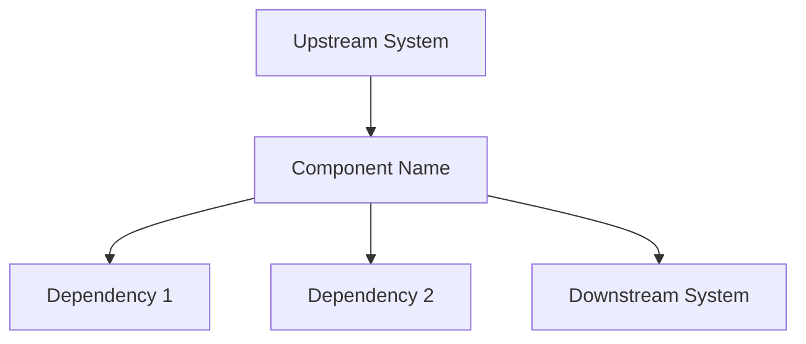
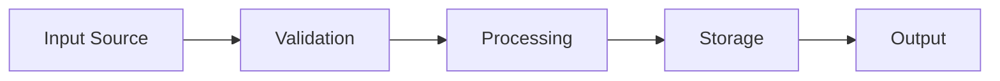
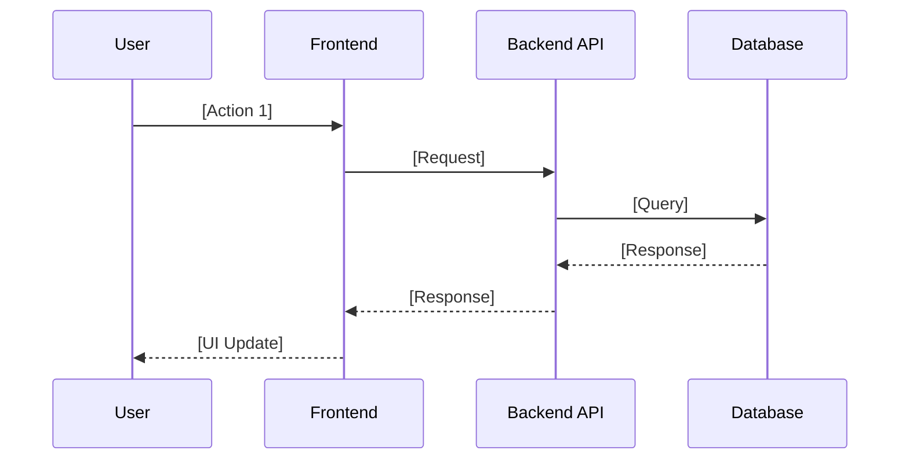

# [Component Name] - Technical Design Document (TDD)

> **WHAT:** Technical Design Document specifying the architecture, data models, API specifications, and implementation details for [component name].
> **WHY:** Translates product requirements (from the PRD) into an engineering specification that the team builds against. Where the PRD defines *what* to build, this TDD defines *how* to build it.
> **HOW TO USE:** Engineers, architects, and technical stakeholders use this document to align on technical approach before implementation begins.

Sentinel self-check (run before submitting TDD for pipeline consumption):
- feature_id must not be "[FEATURE-ID]"
- spec_type must be one of the valid enum values
- target_release must not be "[version]"
- complexity_score and complexity_class: computed by sc:roadmap during extraction. Provide estimated values if known; the extraction step will compute authoritative values regardless.

Pipeline field consumption:
- `complexity_score`, `complexity_class`: Computed by sc:roadmap during extraction (not read from frontmatter). Pre-populated values are advisory only.
- `feature_id`, `spec_type`, `target_release`: Consumed by sc:spec-panel `--downstream roadmap` (Step 6b) when generating scoped release specs.
- `quality_scores`: Populated by sc:spec-panel review output. Not consumed by sc:roadmap.

Quality gate: /sc:spec-panel @<this-tdd-file> --focus correctness,architecture --mode critique

### Document Lifecycle Position

| Phase | Document | Ownership | Status |
|-------|----------|-----------|--------|
| Requirements | Product PRD | Product | [Status] |
| **Design** | **This TDD** | **Engineering** | **[Status]** |
| Implementation | Technical Reference | Engineering | [Status] |

This TDD implements requirements from [link to Product PRD] Epics [X, Y, Z].

### Tiered Usage

| Tier | When to Use | Sections Required |
|------|-------------|-------------------|
| **Lightweight** | Bug fixes, config changes, small features (<1 sprint) | 1, 2, 3, 6.4, 21, 22 |
| **Standard** | Most features and services (1-3 sprints) | All numbered sections; skip conditional sections marked *(if applicable)* |
| **Heavyweight** | New systems, platform changes, cross-team projects | All sections fully completed, including all conditional sections |

---

## Document Information

| Field | Value |
|-------|-------|
| **Component Name** | [Component Name] |
| **Component Type** | [Frontend / Backend / Service / Infrastructure / Library] |
| **Tech Lead** | [Name] |
| **Engineering Team** | [Team Name] |
| **Maintained By** | [Team or person responsible for keeping this TDD current] |
| **Target Release** | [Version / Date] |
| **Last Verified** | [Date and context — e.g., "2026-03-08 against current design state"] |
| **Status** | [Draft / In Review / Approved / Implementing / Complete] |

### Approvers

| Role | Name | Status | Date |
|------|------|--------|------|
| Tech Lead | [Name] | ⬜ Pending | |
| Engineering Manager | [Name] | ⬜ Pending | |
| Architect | [Name] | ⬜ Pending | |
| Security | [Name] | ⬜ Pending | |

---

## Completeness Status

**Completeness Checklist:**
- [ ] Section 1: Executive Summary — **Status**
- [ ] Section 2: Problem Statement & Context — **Status**
- [ ] Section 3: Goals & Non-Goals — **Status**
- [ ] Section 4: Success Metrics — **Status**
- [ ] Section 5: Technical Requirements — **Status**
- [ ] Section 6: Architecture — **Status**
- [ ] Section 7: Data Models — **Status**
- [ ] Section 8: API Specifications — **Status**
- [ ] Section 9: State Management — **Status**
- [ ] Section 10: Component Inventory — **Status**
- [ ] Section 11: User Flows & Interactions — **Status**
- [ ] Section 12: Error Handling & Edge Cases — **Status**
- [ ] Section 13: Security Considerations — **Status**
- [ ] Section 14: Observability & Monitoring — **Status**
- [ ] Section 15: Testing Strategy — **Status**
- [ ] Section 16: Accessibility Requirements — **Status**
- [ ] Section 17: Performance Budgets — **Status**
- [ ] Section 18: Dependencies — **Status**
- [ ] Section 19: Migration & Rollout Plan — **Status**
- [ ] Section 20: Risks & Mitigations — **Status**
- [ ] Section 21: Alternatives Considered — **Status**
- [ ] Section 22: Open Questions — **Status**
- [ ] Section 23: Timeline & Milestones — **Status**
- [ ] Section 24: Release Criteria — **Status**
- [ ] Section 25: Operational Readiness — **Status**
- [ ] Section 26: Cost & Resource Estimation — **Status**
- [ ] Section 27: References & Resources — **Status**
- [ ] Section 28: Glossary — **Status**
- [ ] All links verified — **Status**
- [ ] Reviewed by [team] — **Status**

**Contract Table:**

| Element | Details |
|---------|---------|
| **Dependencies** | [Docs/systems this TDD depends on] |
| **Upstream** | Feeds from: [Product PRD, stakeholder requirements] |
| **Downstream** | Feeds to: [Technical Reference, implementation, test plans] |
| **Change Impact** | Notify: [teams to notify when this changes] |
| **Review Cadence** | [Quarterly / Monthly / As-needed] |

---

## Table of Contents

1. [Executive Summary](#1-executive-summary)
2. [Problem Statement & Context](#2-problem-statement--context)
3. [Goals & Non-Goals](#3-goals--non-goals)
4. [Success Metrics](#4-success-metrics)
5. [Technical Requirements](#5-technical-requirements)
6. [Architecture](#6-architecture)
7. [Data Models](#7-data-models)
8. [API Specifications](#8-api-specifications)
9. [State Management](#9-state-management)
10. [Component Inventory](#10-component-inventory)
11. [User Flows & Interactions](#11-user-flows--interactions)
12. [Error Handling & Edge Cases](#12-error-handling--edge-cases)
13. [Security Considerations](#13-security-considerations)
14. [Observability & Monitoring](#14-observability--monitoring)
15. [Testing Strategy](#15-testing-strategy)
16. [Accessibility Requirements](#16-accessibility-requirements)
17. [Performance Budgets](#17-performance-budgets)
18. [Dependencies](#18-dependencies)
19. [Migration & Rollout Plan](#19-migration--rollout-plan)
20. [Risks & Mitigations](#20-risks--mitigations)
21. [Alternatives Considered](#21-alternatives-considered)
22. [Open Questions](#22-open-questions)
23. [Timeline & Milestones](#23-timeline--milestones)
24. [Release Criteria](#24-release-criteria)
25. [Operational Readiness](#25-operational-readiness)
26. [Cost & Resource Estimation](#26-cost--resource-estimation)
27. [References & Resources](#27-references--resources)
28. [Glossary](#28-glossary)

---

## 1. Executive Summary

[2-3 paragraphs maximum. Every engineer should be able to read this and understand what this component does, why it's being built, and whether the rest of the document is relevant to them.]

**Key Deliverables:**
- [Deliverable 1]
- [Deliverable 2]
- [Deliverable 3]

---

## 2. Problem Statement & Context

### 2.1 Background

[Explain the context. What is the current state? What problem does this component solve? Include relevant history and why this work is happening now.]

### 2.2 Problem Statement

**The core problem:** [One clear sentence stating the technical problem]

[Expand on the problem with specifics:]
- What is broken, missing, or inadequate?
- Who is affected (users, other systems, teams)?
- What is the cost of not solving this?

### 2.3 Business Context

[How does this component support business objectives? Reference the Product PRD if applicable.]

- **Product PRD Reference:** [Link to Product PRD, specific epics/features]
- **Business Impact:** [What business value does this enable?]
- **User Impact:** [How does this affect end users?]

---

## 3. Goals & Non-Goals

### 3.1 Goals

What this component WILL accomplish:

| ID | Goal | Success Criteria |
|----|------|------------------|
| G1 | [Goal 1] | [How we'll know it's achieved] |
| G2 | [Goal 2] | [How we'll know it's achieved] |
| G3 | [Goal 3] | [How we'll know it's achieved] |

### 3.2 Non-Goals

What this component will NOT do (explicit scope boundaries):

| ID | Non-Goal | Rationale |
|----|----------|-----------|
| NG1 | [Non-Goal 1] | [Why excluded from scope] |
| NG2 | [Non-Goal 2] | [Why excluded from scope] |
| NG3 | [Non-Goal 3] | [Why excluded from scope] |

### 3.3 Future Considerations

Items deferred to future iterations:

| Item | Target Phase | Notes |
|------|--------------|-------|
| [Future item 1] | Phase 2 | [Notes] |
| [Future item 2] | Phase 3 | [Notes] |

---

## 4. Success Metrics

How we will measure success:

### 4.1 Technical Metrics

| Metric | Current State | Target | Measurement Method |
|--------|---------------|--------|-------------------|
| [Metric 1] | [Baseline] | [Target] | [How measured] |
| [Metric 2] | [Baseline] | [Target] | [How measured] |
| [Metric 3] | [Baseline] | [Target] | [How measured] |

### 4.2 Business Metrics *(if applicable)*

[Identify business KPIs this component directly influences. These should trace back to the Product PRD but be instrumented here.]

| Business KPI | Proxy Metric (Engineering) | Instrumentation | Dashboard |
|--------------|---------------------------|-----------------|-----------|
| [e.g., User retention] | [e.g., Feature adoption rate] | [Event/counter name] | [Link] |
| [e.g., Revenue per user] | [e.g., Checkout completion rate] | [Event/counter name] | [Link] |

---

## 5. Technical Requirements

### 5.1 Functional Requirements

| ID | Requirement | Priority | Acceptance Criteria |
|----|-------------|----------|---------------------|
| FR-001 | [Requirement description] | Must Have | [Given/When/Then or specific criteria] |
| FR-002 | [Requirement description] | Must Have | [Given/When/Then or specific criteria] |
| FR-003 | [Requirement description] | Should Have | [Given/When/Then or specific criteria] |
| FR-004 | [Requirement description] | Could Have | [Given/When/Then or specific criteria] |

### 5.2 Non-Functional Requirements

#### Performance Requirements

| Metric | Requirement | Measurement |
|--------|-------------|-------------|
| Response Time (p50) | < [X]ms | [Tool/method] |
| Response Time (p95) | < [X]ms | [Tool/method] |
| Response Time (p99) | < [X]ms | [Tool/method] |
| Throughput | [X] requests/sec | [Tool/method] |
| Concurrent Users | [X] | [Tool/method] |

#### Scalability Requirements

| Dimension | Current | Target | Scaling Strategy |
|-----------|---------|--------|------------------|
| [Dimension 1] | [Current] | [Target] | [How to scale] |
| [Dimension 2] | [Current] | [Target] | [How to scale] |

#### Reliability Requirements

| Metric | Requirement |
|--------|-------------|
| Availability | [X]% uptime (e.g., 99.9%) |
| MTTR (Mean Time to Recovery) | < [X] minutes |
| MTBF (Mean Time Between Failures) | > [X] hours |
| Data Durability | [X]% |

#### Service Level Objectives (SLOs)

[Define SLOs, SLIs, and error budgets for this component. SLOs are the target reliability; SLIs are the measurements; error budgets define the acceptable failure margin.]

| SLO | SLI (Measurement) | Target | Error Budget (30d) | Burn-Rate Alert |
|-----|-------------------|--------|-------------------|-----------------|
| Availability | Successful requests / total requests | [e.g., 99.9%] | [e.g., 43.2 min downtime] | [e.g., 6x in 1h] |
| Latency | p99 request duration | [e.g., < 500ms] | [e.g., 0.1% of requests may exceed] | [e.g., 3x in 6h] |
| Correctness | Valid responses / total responses | [e.g., 99.99%] | [e.g., 4.3 min of bad data] | [e.g., 10x in 5m] |

**Error Budget Policy:**
- When error budget is **> 50% remaining**: Normal development velocity
- When error budget is **25-50% remaining**: Halt risky deployments, prioritize reliability work
- When error budget is **< 25% remaining**: Freeze feature releases until budget recovers
- When error budget is **exhausted**: All engineering effort redirected to reliability

#### Security Requirements

| Requirement | Implementation | Compliance |
|-------------|----------------|------------|
| Authentication | [Method] | [Standard] |
| Authorization | [Method] | [Standard] |
| Data Encryption (at rest) | [Method] | [Standard] |
| Data Encryption (in transit) | [Method] | [Standard] |
| Audit Logging | [Method] | [Standard] |
| Input Validation | [Method] | [Standard] |

---

## 6. Architecture

### 6.1 High-Level Architecture

[Include architecture diagram - Mermaid, PlantUML, or image link]

```
[ASCII diagram or reference to diagram file]
```

**Diagram:** [Link to architecture diagram in Figma/Lucidchart/etc.]

### 6.2 Component Diagram

[Show how this component fits into the larger system]



### 6.3 System Boundaries

| Boundary | Description | Protocol |
|----------|-------------|----------|
| **Upstream** | [What sends data to this component] | [Protocol/format] |
| **Downstream** | [What receives data from this component] | [Protocol/format] |
| **External** | [External systems/APIs] | [Protocol/format] |

### 6.4 Key Design Decisions

> **Important:** Before finalizing the architecture, ensure you have completed **Section 21: Alternatives Considered** — particularly **Alternative 0: Do Nothing**. Google's design doc process identifies Alternatives Considered as one of the most important sections; evaluating alternatives early prevents expensive mid-implementation pivots.

| Decision | Choice | Rationale | Alternatives Considered |
|----------|--------|-----------|------------------------|
| [Decision 1] | [What we chose] | [Why] | [Other options considered] |
| [Decision 2] | [What we chose] | [Why] | [Other options considered] |
| [Decision 3] | [What we chose] | [Why] | [Other options considered] |

### 6.5 Multi-Tenancy Architecture *(if applicable — SaaS/platform components)*

> Skip this section for single-tenant, internal, or purely frontend components.

**Tenancy Model:** [Silo / Pool / Bridge — see definitions below]

| Dimension | Strategy | Implementation | Trade-offs |
|-----------|----------|----------------|------------|
| **Compute** | [Shared / Dedicated] | [e.g., shared K8s pods with namespace isolation] | [Cost vs isolation] |
| **Data** | [Shared DB / Schema-per-tenant / DB-per-tenant] | [e.g., shared DB, RLS policies on tenant_id] | [Cost vs compliance] |
| **Configuration** | [Shared / Per-tenant overrides] | [e.g., feature flags per tenant tier] | [Complexity vs flexibility] |
| **Noisy Neighbor Prevention** | [Rate limiting / Resource quotas] | [e.g., per-tenant rate limits, fair-share scheduling] | [Throughput vs fairness] |

**Tenant Isolation Guarantees:**
- [ ] Data cannot leak across tenants (verify with integration tests)
- [ ] One tenant's failure/load cannot degrade another tenant's experience
- [ ] Tenant-scoped audit logging is in place
- [ ] Tenant offboarding/data deletion is supported

---

## 7. Data Models

### 7.1 Data Entities

#### [Entity 1 Name]

```typescript
interface EntityName {
  id: string;
  field1: string;
  field2: number;
  field3: boolean;
  createdAt: Date;
  updatedAt: Date;
}
```

| Field | Type | Required | Description | Constraints |
|-------|------|----------|-------------|-------------|
| id | string | Yes | Unique identifier | UUID v4 |
| field1 | string | Yes | [Description] | Max 255 chars |
| field2 | number | No | [Description] | Min 0, Max 100 |

#### [Entity 2 Name]

[Repeat structure for each entity]

### 7.2 Data Flow



### 7.3 Data Storage

| Data Type | Storage | Retention | Backup Strategy |
|-----------|---------|-----------|-----------------|
| [Type 1] | [Where stored] | [How long] | [Backup approach] |
| [Type 2] | [Where stored] | [How long] | [Backup approach] |

---

## 8. API Specifications

### 8.1 API Overview

| Endpoint | Method | Purpose | Auth Required |
|----------|--------|---------|---------------|
| `/api/v1/[resource]` | GET | [Purpose] | Yes/No |
| `/api/v1/[resource]` | POST | [Purpose] | Yes/No |
| `/api/v1/[resource]/:id` | PUT | [Purpose] | Yes/No |
| `/api/v1/[resource]/:id` | DELETE | [Purpose] | Yes/No |

### 8.2 Endpoint Details

#### `GET /api/v1/[resource]`

**Purpose:** [What this endpoint does]

**Request:**
```http
GET /api/v1/[resource]?param1=value&param2=value
Authorization: Bearer {token}
```

**Query Parameters:**
| Parameter | Type | Required | Default | Description |
|-----------|------|----------|---------|-------------|
| param1 | string | No | "" | [Description] |
| param2 | number | No | 10 | [Description] |

**Response (200 OK):**
```json
{
  "data": [
    {
      "id": "123",
      "field1": "value"
    }
  ],
  "pagination": {
    "page": 1,
    "pageSize": 10,
    "total": 100
  }
}
```

**Error Responses:**

| Status | Error Code | Description |
|--------|------------|-------------|
| 400 | BAD_REQUEST | Invalid query parameters |
| 401 | UNAUTHORIZED | Missing or invalid token |
| 403 | FORBIDDEN | Insufficient permissions |
| 500 | INTERNAL_ERROR | Server error |

#### `POST /api/v1/[resource]`

[Repeat structure for each endpoint]

### 8.3 Error Response Format

All errors follow this standard format:

```json
{
  "error": {
    "code": "ERROR_CODE",
    "message": "Human-readable error message",
    "details": {
      "field": "Additional context"
    },
    "requestId": "uuid-for-tracing"
  }
}
```

### 8.4 API Governance & Versioning

[Define versioning strategy, breaking change policy, and deprecation timelines. Critical for any API consumed by external clients or other teams.]

**Versioning Strategy:** [URL path (`/v1/`) / Header (`Accept-Version`) / Query param]

**Compatibility Contract:**

| Change Type | Example | Allowed Without Version Bump? |
|-------------|---------|-------------------------------|
| Add optional field | New response field | Yes (additive) |
| Add optional query param | New filter parameter | Yes (additive) |
| Remove field | Drop a response field | No — breaking change |
| Rename field | `user_name` → `username` | No — breaking change |
| Change type | `string` → `number` | No — breaking change |
| Add required param | New required body field | No — breaking change |

**Deprecation Policy:**

| Phase | Duration | Action |
|-------|----------|--------|
| Announce | [e.g., T+0] | Add `Sunset` header, update docs, notify consumers |
| Warn | [e.g., T+30d] | Log warnings on deprecated endpoint usage |
| Migrate | [e.g., T+60d] | Provide migration guide, offer new endpoint |
| Remove | [e.g., T+90d] | Return `410 Gone`, remove from docs |

---

## 9. State Management *(if applicable — frontend components)*

> **Conditional Section:** This section applies to frontend/client-side components. Backend services, infrastructure, and libraries should skip this section entirely.

### 9.1 State Architecture

| State Type | Tool/Library | Scope | Purpose |
|------------|--------------|-------|---------|
| Server State | [e.g., TanStack Query] | [Scope] | [Purpose] |
| Global Client State | [e.g., Zustand, Redux] | [Scope] | [Purpose] |
| Local Component State | [e.g., useState] | [Scope] | [Purpose] |
| URL State | [e.g., nuqs, next/router] | [Scope] | [Purpose] |
| Form State | [e.g., React Hook Form] | [Scope] | [Purpose] |

### 9.2 State Shape

```typescript
// Global State Shape
interface AppState {
  user: UserState;
  projects: ProjectsState;
  ui: UIState;
}

interface UserState {
  isAuthenticated: boolean;
  profile: UserProfile | null;
  preferences: UserPreferences;
}

// Continue for each state slice...
```

### 9.3 State Transitions

[Document key state transitions and what triggers them]

| Current State | Trigger | Next State | Side Effects |
|---------------|---------|------------|--------------|
| [State A] | [Event] | [State B] | [What happens] |
| [State B] | [Event] | [State C] | [What happens] |

---

## 10. Component Inventory *(if applicable — frontend components)*

> **Conditional Section:** This section applies to frontend/client-side components. Backend services, infrastructure, and libraries should skip this section entirely.

### 10.1 Page/Route Structure

| Route | Page Component | Layout | Auth Required |
|-------|----------------|--------|---------------|
| `/` | HomePage | MainLayout | No |
| `/dashboard` | DashboardPage | DashboardLayout | Yes |
| `/projects/:id` | ProjectPage | MainLayout | Yes |

### 10.2 Shared Components

| Component | Purpose | Props Interface | Location |
|-----------|---------|-----------------|----------|
| Button | [Purpose] | `ButtonProps` | `components/ui/` |
| Modal | [Purpose] | `ModalProps` | `components/ui/` |
| [Component] | [Purpose] | `[Props]` | `[Location]` |

### 10.3 Component Hierarchy

```
App
├── Layout
│   ├── Header
│   │   ├── Logo
│   │   ├── Navigation
│   │   └── UserMenu
│   ├── Sidebar
│   └── Footer
├── Pages
│   ├── HomePage
│   ├── DashboardPage
│   │   ├── ProjectList
│   │   └── ActivityFeed
│   └── ProjectPage
│       ├── ProjectHeader
│       ├── ChatInterface
│       └── PreviewPanel
└── Modals
    ├── CreateProjectModal
    └── SettingsModal
```

---

## 11. User Flows & Interactions

### 11.1 Primary User Flow: [Flow Name]



**Steps:**
1. User [action]
2. System [response]
3. [Continue...]

**Success Criteria:**
- [Criterion 1]
- [Criterion 2]

**Error Scenarios:**
- If [condition], then [behavior]
- If [condition], then [behavior]

### 11.2 Secondary User Flow: [Flow Name]

[Repeat structure for each major flow]

---

## 12. Error Handling & Edge Cases

### 12.1 Error Categories

| Category | Examples | User Experience | Recovery |
|----------|----------|-----------------|----------|
| Validation Errors | Invalid input, missing fields | Inline field errors | User corrects input |
| Authentication Errors | Expired token, invalid credentials | Redirect to login | Re-authenticate |
| Authorization Errors | Insufficient permissions | Error message, action disabled | Request access |
| Network Errors | Timeout, connection lost | Toast notification, retry option | Retry or offline mode |
| Server Errors | 500 errors, service unavailable | Error page, support contact | Retry later |

### 12.2 Edge Cases

| Scenario | Expected Behavior | Test Case |
|----------|-------------------|-----------|
| [Edge case 1] | [How system behaves] | [How to test] |
| [Edge case 2] | [How system behaves] | [How to test] |
| [Edge case 3] | [How system behaves] | [How to test] |

### 12.3 Graceful Degradation

| Component Failure | Degraded Experience | Fallback Behavior |
|-------------------|--------------------|--------------------|
| [Component 1] fails | [What still works] | [Fallback mechanism] |
| [Component 2] fails | [What still works] | [Fallback mechanism] |

### 12.4 Retry & Recovery Strategies

| Error Type | Retry Strategy | Max Attempts | Backoff |
|------------|----------------|--------------|---------|
| Network timeout | Automatic retry | 3 | Exponential (1s, 2s, 4s) |
| Rate limiting | Wait and retry | 5 | Fixed (wait until reset) |
| Server error (5xx) | Automatic retry | 3 | Exponential |
| Client error (4xx) | No retry | 0 | N/A |

---

## 13. Security Considerations

### 13.1 Threat Model

| Threat | Likelihood | Impact | Mitigation |
|--------|------------|--------|------------|
| [Threat 1] | [H/M/L] | [H/M/L] | [Mitigation strategy] |
| [Threat 2] | [H/M/L] | [H/M/L] | [Mitigation strategy] |
| [Threat 3] | [H/M/L] | [H/M/L] | [Mitigation strategy] |

### 13.2 Security Controls

| Control | Implementation | Verification |
|---------|----------------|--------------|
| Input Validation | [How implemented] | [How verified] |
| Output Encoding | [How implemented] | [How verified] |
| CSRF Protection | [How implemented] | [How verified] |
| XSS Prevention | [How implemented] | [How verified] |
| SQL Injection Prevention | [How implemented] | [How verified] |
| Authentication | [How implemented] | [How verified] |
| Authorization | [How implemented] | [How verified] |

### 13.3 Sensitive Data Handling

| Data Type | Classification | Encryption | Access Control |
|-----------|----------------|------------|----------------|
| [Data type 1] | [PII/Confidential/Public] | [At rest / In transit] | [Who can access] |
| [Data type 2] | [PII/Confidential/Public] | [At rest / In transit] | [Who can access] |

### 13.4 Data Governance & Compliance *(if applicable)*

[Document regulatory requirements, data residency constraints, and retention/deletion obligations.]

**Applicable Regulations:** [e.g., GDPR, CCPA, SOC2, HIPAA, PCI-DSS — list all that apply]

| Requirement | Regulation | Implementation | Verification |
|-------------|-----------|----------------|--------------|
| Right to deletion | [e.g., GDPR Art. 17] | [e.g., Cascade delete via tenant_id, async job] | [e.g., Deletion audit log] |
| Data residency | [e.g., GDPR] | [e.g., Region-pinned storage, no cross-region replication] | [e.g., Infrastructure test] |
| Data retention limits | [e.g., Internal policy] | [e.g., TTL on logs, scheduled purge jobs] | [e.g., Cron monitoring] |
| Consent tracking | [e.g., GDPR Art. 7] | [e.g., Consent service integration] | [e.g., Consent audit trail] |
| Data portability | [e.g., GDPR Art. 20] | [e.g., Export API in standard format] | [e.g., Export integration test] |

**Data Classification:**
- [ ] All data fields classified (PII, Confidential, Internal, Public)
- [ ] PII fields documented with legal basis for processing
- [ ] Cross-border data transfer mechanisms identified (if applicable)

---

## 14. Observability & Monitoring

### 14.1 Logging

| Log Type | Format | Destination | Retention |
|----------|--------|-------------|-----------|
| Application logs | JSON | [Destination] | [Duration] |
| Access logs | [Format] | [Destination] | [Duration] |
| Error logs | JSON | [Destination] | [Duration] |
| Audit logs | JSON | [Destination] | [Duration] |

**Log Levels:**
- `ERROR`: System errors requiring immediate attention
- `WARN`: Potential issues, degraded functionality
- `INFO`: Key business events, state transitions
- `DEBUG`: Detailed diagnostic information (dev/staging only)

### 14.2 Metrics

| Metric | Type | Labels | Alert Threshold |
|--------|------|--------|-----------------|
| `[metric_name]` | Counter/Gauge/Histogram | [Labels] | [Threshold] |
| `request_duration_seconds` | Histogram | method, endpoint, status | p99 > 2s |
| `active_connections` | Gauge | service | > 1000 |
| `error_rate` | Counter | error_type | > 1% |

### 14.3 Tracing

| Span | Parent | Attributes |
|------|--------|------------|
| [Span name] | [Parent span] | [Key attributes to capture] |

### 14.4 Alerts

| Alert | Condition | Severity | Response |
|-------|-----------|----------|----------|
| [Alert 1] | [Threshold condition] | Critical/Warning | [Runbook link] |
| [Alert 2] | [Threshold condition] | Critical/Warning | [Runbook link] |

### 14.5 Dashboards

| Dashboard | Purpose | Link |
|-----------|---------|------|
| [Dashboard 1] | [What it monitors] | [Link] |
| [Dashboard 2] | [What it monitors] | [Link] |

### 14.6 Business Metric Instrumentation *(if applicable)*

[Map business KPIs from Section 4.2 to concrete telemetry events. Every business metric should have a corresponding technical event that can be queried.]

| Business Event | Event Name | Properties | Emitter | Consumer |
|----------------|------------|------------|---------|----------|
| [e.g., User completes onboarding] | `onboarding.completed` | `{user_id, duration_ms, steps_completed}` | [Service] | [Analytics pipeline] |
| [e.g., Feature first used] | `feature.first_use` | `{user_id, feature_name, entry_point}` | [Service] | [Product analytics] |

---

## 15. Testing Strategy

### 15.1 Test Pyramid

| Level | Coverage Target | Tools | Responsibility |
|-------|-----------------|-------|----------------|
| Unit Tests | > 80% | [Jest, Vitest, pytest] | Engineers |
| Integration Tests | Key flows | [Testing Library, Playwright] | Engineers |
| E2E Tests | Critical paths | [Playwright, Cypress] | QA + Engineers |
| Performance Tests | [Targets] | [k6, Artillery] | Engineers |
| Security Tests | [Scope] | [OWASP ZAP, Snyk] | Security |

### 15.2 Test Cases

#### Unit Tests

| Component/Function | Test Case | Expected Result |
|--------------------|-----------|-----------------|
| [Component 1] | [Test description] | [Expected] |
| [Component 2] | [Test description] | [Expected] |

#### Integration Tests

| Flow | Test Case | Expected Result |
|------|-----------|-----------------|
| [Flow 1] | [Test description] | [Expected] |
| [Flow 2] | [Test description] | [Expected] |

#### E2E Tests

| User Journey | Test Case | Expected Result |
|--------------|-----------|-----------------|
| [Journey 1] | [Test description] | [Expected] |
| [Journey 2] | [Test description] | [Expected] |

### 15.3 Test Environments

| Environment | Purpose | Data | URL |
|-------------|---------|------|-----|
| Local | Development | Mock/Seed | localhost |
| Dev | Integration testing | Synthetic | [URL] |
| Staging | Pre-production | Production-like | [URL] |
| Production | Live | Real | [URL] |

---

## 16. Accessibility Requirements

> **Standard:** WCAG 2.1 AA Compliance

### 16.1 Requirements

| Requirement | Implementation | Testing Method |
|-------------|----------------|----------------|
| Keyboard Navigation | [How implemented] | [How tested] |
| Screen Reader Support | [ARIA implementation] | [How tested] |
| Color Contrast | Minimum 4.5:1 ratio | [How tested] |
| Focus Management | [How implemented] | [How tested] |
| Alternative Text | [How implemented] | [How tested] |
| Form Labels | [How implemented] | [How tested] |

### 16.2 Testing Tools

- [Tool 1]: [Purpose]
- [Tool 2]: [Purpose]
- [Tool 3]: [Purpose]

---

## 17. Performance Budgets

### 17.1 Frontend Performance

| Metric | Budget | Measurement |
|--------|--------|-------------|
| First Contentful Paint (FCP) | < [X]s | Lighthouse |
| Largest Contentful Paint (LCP) | < [X]s | Lighthouse |
| First Input Delay (FID) | < [X]ms | Lighthouse |
| Cumulative Layout Shift (CLS) | < [X] | Lighthouse |
| Time to Interactive (TTI) | < [X]s | Lighthouse |
| Total Bundle Size | < [X]KB | Webpack/Next.js |
| Initial JS Bundle | < [X]KB | Webpack/Next.js |

### 17.2 Backend Performance

| Metric | Budget | Measurement |
|--------|--------|-------------|
| API Response Time (p50) | < [X]ms | APM tool |
| API Response Time (p95) | < [X]ms | APM tool |
| API Response Time (p99) | < [X]ms | APM tool |
| Database Query Time | < [X]ms | Query profiler |
| Memory Usage | < [X]MB | Container metrics |
| CPU Usage | < [X]% | Container metrics |

### 17.3 Performance Testing

| Test Type | Tool | Frequency | Threshold |
|-----------|------|-----------|-----------|
| Load test | [Tool] | [Frequency] | [Pass criteria] |
| Stress test | [Tool] | [Frequency] | [Pass criteria] |
| Soak test | [Tool] | [Frequency] | [Pass criteria] |

---

## 18. Dependencies

### 18.1 External Dependencies

| Dependency | Version | Purpose | Risk Level | Fallback |
|------------|---------|---------|------------|----------|
| [Package 1] | [Version] | [Why needed] | [H/M/L] | [Alternative] |
| [Package 2] | [Version] | [Why needed] | [H/M/L] | [Alternative] |
| [Service 1] | N/A | [Why needed] | [H/M/L] | [Fallback plan] |

### 18.2 Internal Dependencies

| Dependency | Team | Status | Interface |
|------------|------|--------|-----------|
| [Internal service 1] | [Team] | [Status] | [API/Event/etc.] |
| [Internal service 2] | [Team] | [Status] | [API/Event/etc.] |
| [Shared library] | [Team] | [Status] | [npm/pip package] |

### 18.3 Infrastructure Dependencies

| Resource | Type | Environment | Configuration |
|----------|------|-------------|---------------|
| [Database] | [Type] | [Env] | [Config notes] |
| [Cache] | [Type] | [Env] | [Config notes] |
| [Queue] | [Type] | [Env] | [Config notes] |

---

## 19. Migration & Rollout Plan

### 19.1 Migration Strategy

| Phase | Description | Duration | Rollback Plan |
|-------|-------------|----------|---------------|
| Phase 1 | [Description] | [Duration] | [How to rollback] |
| Phase 2 | [Description] | [Duration] | [How to rollback] |
| Phase 3 | [Description] | [Duration] | [How to rollback] |

### 19.2 Feature Flags & Progressive Delivery

| Flag | Description | Default | Rollout Plan | Cleanup Date | Owner |
|------|-------------|---------|--------------|--------------|-------|
| [flag_name] | [What it controls] | [true/false] | [% rollout plan] | [Date to remove] | [Team/person] |

**Feature Flag Lifecycle:**

```
Created → Testing → Canary (1%) → Partial (10-50%) → GA (100%) → Cleanup (remove flag)
```

> **Rule:** Every feature flag MUST have a `Cleanup Date` — the target date by which the flag is fully rolled out and removed from the codebase. Stale flags are tech debt. If a flag has been at 100% for more than 30 days, it should be removed.

### 19.3 Rollout Stages

| Stage | Traffic % | Duration | Success Criteria | Rollback Trigger |
|-------|-----------|----------|------------------|------------------|
| Canary | 1% | [Duration] | [Criteria] | [When to rollback] |
| Limited | 10% | [Duration] | [Criteria] | [When to rollback] |
| Partial | 50% | [Duration] | [Criteria] | [When to rollback] |
| Full | 100% | - | [Criteria] | [When to rollback] |

### 19.4 Rollback Procedure

1. [Step 1]
2. [Step 2]
3. [Step 3]
4. [Verification step]

**Rollback Decision Criteria:**
- Error rate exceeds [X]%
- Latency p99 exceeds [X]ms
- [Other criteria]

---

## 20. Risks & Mitigations

| ID | Risk | Probability | Impact | Mitigation | Contingency |
|----|------|-------------|--------|------------|-------------|
| R1 | [Risk description] | [H/M/L] | [H/M/L] | [Prevention strategy] | [If it happens] |
| R2 | [Risk description] | [H/M/L] | [H/M/L] | [Prevention strategy] | [If it happens] |
| R3 | [Risk description] | [H/M/L] | [H/M/L] | [Prevention strategy] | [If it happens] |

---

## 21. Alternatives Considered

> **This is one of the most important sections of the TDD.** Reviewers should verify that alternatives were genuinely evaluated, not reverse-engineered to justify a predetermined choice. Completing this section *before* finalizing Section 6 (Architecture) prevents confirmation bias.

### Alternative 0: Do Nothing *(mandatory)*

**Description:** What happens if we do not build this? Can the problem be solved with existing systems, manual processes, or by deferring?

**Pros:**
- No engineering cost
- No operational burden
- No risk of introducing regressions
- [Other pros of inaction]

**Cons:**
- [Specific cost or consequence of inaction — quantify if possible]
- [e.g., Manual workaround costs X hours/week]
- [e.g., User churn of Y% due to missing feature]

**Why Not Chosen:** [Explain why "do nothing" is not viable. If you cannot articulate this clearly, reconsider whether the project should proceed.]

---

### Alternative 1: [Alternative Name]

**Description:** [Brief description of the alternative approach]

**Pros:**
- [Pro 1]
- [Pro 2]

**Cons:**
- [Con 1]
- [Con 2]

**Why Not Chosen:** [Reason for not choosing this approach]

---

### Alternative 2: [Alternative Name]

**Description:** [Brief description of the alternative approach]

**Pros:**
- [Pro 1]
- [Pro 2]

**Cons:**
- [Con 1]
- [Con 2]

**Why Not Chosen:** [Reason for not choosing this approach]

---

## 22. Open Questions

| ID | Question | Owner | Target Date | Status | Resolution |
|----|----------|-------|-------------|--------|------------|
| Q1 | [Question] | [Owner] | [Date] | 🔴 Open | |
| Q2 | [Question] | [Owner] | [Date] | 🟡 Investigating | |
| Q3 | [Question] | [Owner] | [Date] | 🟢 Resolved | [Answer] |

---

## 23. Timeline & Milestones

### 23.1 High-Level Timeline

| Milestone | Target Date | Status | Dependencies |
|-----------|-------------|--------|--------------|
| Design Complete | [Date] | ⬜ | |
| Implementation Start | [Date] | ⬜ | Design approval |
| Alpha/Internal Release | [Date] | ⬜ | Core features |
| Beta Release | [Date] | ⬜ | Testing complete |
| GA Release | [Date] | ⬜ | All criteria met |

### 23.2 Implementation Phases

#### Phase 1: [Phase Name] (Weeks 1-X)

**Deliverables:**
- [ ] [Deliverable 1]
- [ ] [Deliverable 2]
- [ ] [Deliverable 3]

**Exit Criteria:**
- [Criterion 1]
- [Criterion 2]

#### Phase 2: [Phase Name] (Weeks X-Y)

[Repeat structure]

---

## 24. Release Criteria

### 24.1 Definition of Done

A feature is considered complete when:

- [ ] All acceptance criteria met
- [ ] Unit tests written and passing (coverage > [X]%)
- [ ] Integration tests passing
- [ ] E2E tests for critical paths passing
- [ ] Code reviewed and approved
- [ ] Documentation updated
- [ ] Performance benchmarks met
- [ ] Security review completed
- [ ] Accessibility audit passed
- [ ] Feature flag configured
- [ ] Monitoring/alerting configured
- [ ] Runbook created (if applicable)
- [ ] Product owner sign-off

### 24.2 Release Checklist

- [ ] All features complete per DoD
- [ ] No critical/high severity bugs open
- [ ] Performance targets met
- [ ] Security scan passed
- [ ] Load testing passed
- [ ] Rollback procedure tested
- [ ] On-call team briefed
- [ ] Release notes prepared
- [ ] Stakeholders notified

---

## 25. Operational Readiness

[Define what is needed to run this component in production. This section ensures the team has thought beyond "it works" to "it works reliably at 3 AM when on-call gets paged."]

### 25.1 Runbook

| Scenario | Symptoms | Diagnosis Steps | Resolution | Escalation |
|----------|----------|-----------------|------------|------------|
| [e.g., Service unresponsive] | [e.g., Health check failures, 5xx spike] | [e.g., Check logs, verify DB connectivity] | [e.g., Restart pod, failover to replica] | [e.g., Page SRE after 15 min] |
| [e.g., Data inconsistency] | [e.g., User reports stale data] | [e.g., Check cache TTL, verify replication lag] | [e.g., Invalidate cache, force sync] | [e.g., Notify data team] |

### 25.2 On-Call Expectations

| Aspect | Detail |
|--------|--------|
| **On-call team** | [Team name / rotation] |
| **Expected page volume** | [e.g., < 2 pages/week at steady state] |
| **Required response time** | [e.g., Acknowledge within 5 min, mitigate within 30 min] |
| **Knowledge prerequisites** | [e.g., Familiarity with Redis, Postgres, K8s] |

### 25.3 Capacity Planning

| Resource | Current Capacity | Projected Load (6 mo) | Projected Load (12 mo) | Scaling Trigger |
|----------|-----------------|----------------------|------------------------|-----------------|
| [e.g., Database connections] | [Current] | [Projected] | [Projected] | [e.g., > 80% pool utilization] |
| [e.g., Storage] | [Current] | [Projected] | [Projected] | [e.g., > 70% disk usage] |
| [e.g., Compute] | [Current] | [Projected] | [Projected] | [e.g., > 75% CPU sustained] |

---

## 26. Cost & Resource Estimation *(if applicable)*

[Estimate the infrastructure and operational costs for this component. Critical for SaaS platforms where margin depends on per-tenant cost efficiency.]

### 26.1 Infrastructure Costs

| Resource | Unit | Unit Cost | Estimated Usage | Monthly Cost | Notes |
|----------|------|-----------|-----------------|--------------|-------|
| [e.g., Compute (ECS/EKS)] | [vCPU-hours] | [$X/hr] | [Y hrs/mo] | [$Z] | [e.g., Auto-scales 2-8 instances] |
| [e.g., Database (RDS)] | [Instance] | [$X/mo] | [1 primary + 1 replica] | [$Z] | [e.g., db.r6g.xlarge] |
| [e.g., Cache (ElastiCache)] | [Node] | [$X/mo] | [2 nodes] | [$Z] | [e.g., cache.r6g.large] |
| [e.g., Storage (S3)] | [GB] | [$X/GB] | [Y GB] | [$Z] | [e.g., Infrequent Access tier] |
| **Total** | | | | **[$Total]** | |

### 26.2 Cost Scaling Model

| Scale Factor | At 1K Users | At 10K Users | At 100K Users | Cost Driver |
|--------------|-------------|--------------|---------------|-------------|
| [e.g., Compute] | [$X] | [$Y] | [$Z] | [e.g., Linear with concurrent sessions] |
| [e.g., Storage] | [$X] | [$Y] | [$Z] | [e.g., Linear with total projects] |
| [e.g., Bandwidth] | [$X] | [$Y] | [$Z] | [e.g., Per-session streaming cost] |

### 26.3 Cost Optimization Opportunities

| Opportunity | Estimated Savings | Effort | Priority |
|-------------|-------------------|--------|----------|
| [e.g., Reserved instances] | [e.g., 30-40%] | [e.g., Low] | [e.g., High — implement at GA] |
| [e.g., Tiered storage] | [e.g., 20%] | [e.g., Medium] | [e.g., Medium — Phase 2] |

---

## 27. References & Resources

### 27.1 Related Documents

| Document | Type | Link |
|----------|------|------|
| Product PRD | Product Requirements | [Link] |
| Architecture Decision Record | ADR | [Link] |
| API Documentation | Technical | [Link] |
| Runbook | Operations | [Link] |

### 27.2 External References

| Resource | Purpose | Link |
|----------|---------|------|
| [Reference 1] | [Why relevant] | [Link] |
| [Reference 2] | [Why relevant] | [Link] |

---

## 28. Glossary

| Term | Definition |
|------|------------|
| [Term 1] | [Definition] |
| [Term 2] | [Definition] |
| [Term 3] | [Definition] |

---

## Appendices

### Appendix A: Detailed API Specifications

[Link to OpenAPI/Swagger spec or detailed API docs]

### Appendix B: Database Schema

[Detailed schema definitions, migrations]

### Appendix C: Wireframes & Mockups

[Links to design files]

### Appendix D: Performance Test Results

[Baseline and target test results]

---

## Document History

| Version | Date | Author | Changes |
|---------|------|--------|---------|
| 0.1 | [Date] | [Author] | Initial draft |
| 0.2 | [Date] | [Author] | [Summary of changes] |
| 1.0 | [Date] | [Author] | Approved for implementation |

---

<!--
LINE BUDGET — Target line counts per tier:
- Lightweight (bug fixes, config changes, <1 sprint): 300–500 lines
- Standard (most features and services, 1-3 sprints): 800–1,200 lines
- Heavyweight (new systems, platform changes, cross-team): 1,200–1,800 lines

If a document exceeds the tier ceiling, it needs editing — not a larger tier.
Documents over 2,000 lines are a code smell.
-->

<!--
CONTENT RULES:
| Rule                  | Do                                                    | Don't                                                               |
|-----------------------|-------------------------------------------------------|---------------------------------------------------------------------|
| TDD vs PRD            | Define HOW to build it (architecture, APIs, data)     | Restate WHAT to build (that belongs in the PRD)                     |
| TDD vs Tech Ref       | Specify the intended design before implementation     | Document what was actually built (that belongs in the Tech Ref)     |
| Architecture          | Use diagrams, tables, and concise prose               | Write multi-paragraph prose for what could be a table row           |
| API Specs             | Define contracts, request/response shapes             | Reproduce full OpenAPI specs inline (link to them in Appendices)    |
| Code examples         | Show key interfaces and data models                   | Reproduce full implementations                                     |
| Single source of truth| Describe each concept in exactly one section          | Repeat the same info across Architecture, Data Models, and API     |
-->

<!--
FILE NAMING CONVENTION:
TDD files use kebab-case:
- Pattern: [component-name]-tdd.md (e.g., auth-service-tdd.md)
- Multi-word components: [name-name]-tdd.md (e.g., pixel-streaming-tdd.md)
- Always lowercase, hyphens as separators, suffix -tdd.md
-->

<!--
CALLOUT CONVENTIONS:
Use these standardized callout formats throughout the document:
  > **Note:** Informational context that is helpful but not critical
  > **Important:** Something the reader must be aware of to avoid issues
  > **CRITICAL:** Something that will cause failure or data loss if ignored
  > **Tip:** Helpful shortcut, best practice, or time-saving suggestion
-->

> **See also:**
> - [prd_template.md](prd_template.md) — Product requirements template (defines *what* to build)
> - [technical_reference_template.md](technical_reference_template.md) — Post-implementation reference (documents *what was built*)

---

> **Template Version:** 1.2
> **Template Created:** 2025-11-27
> **Template Updated:** 2026-02-11
> **Template Type:** Technical Design Document (TDD) - Engineering Specification
> **Based On:** Google Design Docs, Stripe API Governance, HashiCorp RFCs, Google SRE Production Readiness, Pragmatic Engineer RFCs, IEEE SRS, AWS SaaS Lens, FinOps Foundation, SLODLC
> **Naming Note:** Renamed from `technical_prd_template.md` to `tdd_template.md` to clarify the distinction: PRDs define *what* to build (product ownership), TDDs define *how* to build it (engineering ownership).
> **v1.2 Changes:** Added tiered usage guidance, SLOs/SLIs/error budgets, API governance & versioning, multi-tenancy architecture (conditional), data governance & compliance, business metric instrumentation, feature flag lifecycle, "Do Nothing" as mandatory Alternative 0, operational readiness (runbooks, on-call, capacity planning), cost & resource estimation, conditional markers for frontend-only sections.
